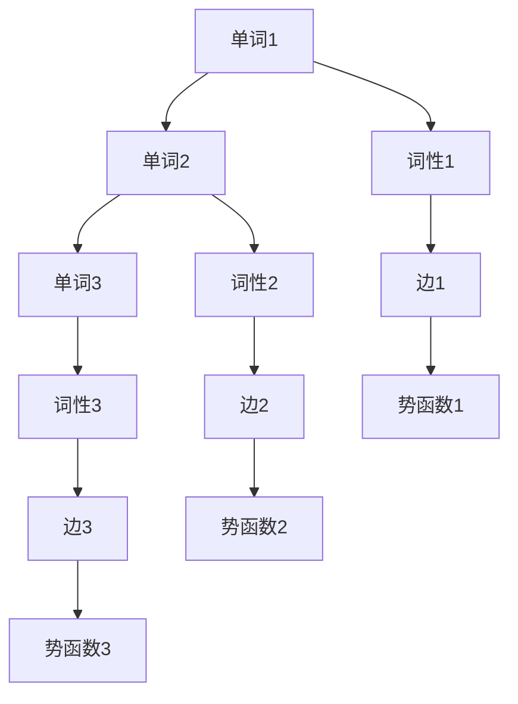

                 

### 文章标题

# 条件随机场 (Conditional Random Fields, CRF) 原理与代码实例讲解

### 关键词

- 条件随机场
- CRF
- 机器学习
- 图模型
- 序列标注
- 随机过程
- 概率图模型
- 参数估计
- 序列预测

### 摘要

本文将深入探讨条件随机场（Conditional Random Fields, CRF）的基本原理、数学模型以及在实际项目中的应用。我们将从CRF的定义出发，逐步讲解其核心概念和图模型结构，然后通过详细的算法原理剖析和伪代码演示，帮助读者理解CRF在序列标注任务中的具体操作步骤。最后，我们将通过实际代码实例，展示如何使用CRF进行文本分类和命名实体识别等任务，并分析其实现细节。通过本文的学习，读者将能够掌握CRF的核心技术和应用方法，为后续深入研究机器学习相关算法打下坚实基础。

## 1. 背景介绍

### 1.1 目的和范围

本文旨在详细介绍条件随机场（CRF）的原理、实现和应用。CRF是一种用于序列标注的概率图模型，广泛应用于自然语言处理、语音识别、生物信息学等领域。本文将首先介绍CRF的基本概念和图模型结构，然后通过伪代码和数学公式详细阐述其算法原理和实现步骤，最后结合具体代码实例，展示CRF在实际项目中的应用和效果。

### 1.2 预期读者

本文面向具有基本机器学习和自然语言处理基础的读者，包括但不仅限于：机器学习工程师、数据科学家、计算机专业学生和研究学者。本文旨在帮助读者全面理解CRF的理论基础和应用方法，为实际项目中的任务提供技术支持和指导。

### 1.3 文档结构概述

本文将按照以下结构展开：

1. **背景介绍**：介绍CRF的基本概念、应用场景和重要性。
2. **核心概念与联系**：通过Mermaid流程图展示CRF的核心概念和图模型结构。
3. **核心算法原理 & 具体操作步骤**：详细讲解CRF的算法原理，并提供伪代码示例。
4. **数学模型和公式 & 详细讲解 & 举例说明**：介绍CRF的数学模型，并通过实例展示具体应用。
5. **项目实战：代码实际案例和详细解释说明**：展示CRF在实际项目中的应用和实现。
6. **实际应用场景**：分析CRF在不同领域的应用案例。
7. **工具和资源推荐**：推荐学习资源、开发工具和相关论文。
8. **总结：未来发展趋势与挑战**：总结CRF的现状和未来发展方向。

### 1.4 术语表

为了确保读者对本文中的专业术语有清晰的理解，以下是对本文中涉及的核心术语的定义和解释：

#### 1.4.1 核心术语定义

- **条件随机场（CRF）**：一种基于图模型的方法，用于处理序列数据的标注问题，能够捕捉序列中的依赖关系。
- **序列标注**：将一个序列中的每个元素标注为特定的类别或标签。
- **图模型**：一种数学模型，通过节点和边的连接来表示变量之间的依赖关系。
- **马尔可夫性**：一个状态序列在给定当前状态时，与过去和未来的状态无关的性质。
- **势函数**：定义在图上的函数，用于表示变量之间的依赖关系。
- **参数估计**：通过训练数据估计模型参数的过程。

#### 1.4.2 相关概念解释

- **特征函数**：用于表示变量之间关系的函数，通常用于构建势函数。
- **最大似然估计（MLE）**：一种参数估计方法，通过最大化训练数据的似然函数来估计模型参数。
- **条件概率**：在给定某个变量的情况下，另一个变量取某个值的概率。
- **标签序列**：一个序列中的每个元素都被标注为特定类别的序列。

#### 1.4.3 缩略词列表

- **CRF**：条件随机场（Conditional Random Fields）
- **MLE**：最大似然估计（Maximum Likelihood Estimation）
- **Viterbi算法**：一种用于序列标注的动态规划算法，用于找到概率最大的标签序列。

## 2. 核心概念与联系

条件随机场（CRF）是一种基于图模型的方法，用于处理序列数据的标注问题。CRF模型的核心在于其能够捕捉序列中的依赖关系，这对于许多自然语言处理任务，如文本分类、命名实体识别和词性标注，都是至关重要的。

### 2.1 CRF的定义

CRF是一种概率图模型，它通过图结构来表示变量之间的依赖关系。在CRF中，每个变量（如一个单词或一个时间步）被表示为一个节点，而变量之间的依赖关系则通过图中的边来表示。CRF模型能够预测给定观测序列（如单词序列）的最可能标注序列（如词性标注序列）。

### 2.2 图模型结构

CRF的图模型结构通常由三个部分组成：节点、边和势函数。

- **节点**：每个节点表示一个变量，如一个单词或一个时间步。
- **边**：边表示变量之间的依赖关系。在CRF中，边通常有两种类型：
  - **链式边**：表示相邻变量之间的依赖关系，如时间步之间的依赖。
  - **环边**：表示变量之间的循环依赖关系，如单词之间的依赖。

- **势函数**：势函数是一个定义在图上的函数，用于表示变量之间的依赖关系。在CRF中，势函数通常是一个特征函数，它能够计算两个变量之间的相关性。

### 2.3 Mermaid流程图展示

为了更好地理解CRF的图模型结构，我们使用Mermaid流程图来展示CRF的核心概念和图模型结构。



在这个流程图中，节点表示单词和词性，边表示它们之间的依赖关系，势函数表示这些依赖关系的强度。通过这个图模型，CRF能够学习到单词和词性之间的依赖关系，并用于预测新的观测序列的标注。

### 2.4 马尔可夫性

在CRF中，一个重要的概念是马尔可夫性。马尔可夫性指的是一个状态序列在给定当前状态时，与过去和未来的状态无关的性质。在CRF中，马尔可夫性意味着给定当前时间步的变量时，该变量只与它的相邻变量相关，而与更远的过去或未来无关。

### 2.5 势函数

势函数是CRF模型中一个关键的组成部分。势函数用于表示变量之间的依赖关系。在CRF中，势函数通常是一个特征函数，它能够计算两个变量之间的相关性。CRF模型通过最大化似然函数来学习势函数的参数。

### 2.6 参数估计

在CRF模型中，参数估计是一个重要的步骤。通过最大似然估计（MLE）方法，CRF能够学习到变量之间的依赖关系。MLE方法通过最大化训练数据的似然函数来估计模型参数。

## 3. 核心算法原理 & 具体操作步骤

条件随机场（CRF）的核心算法原理是利用图模型来学习序列数据中的标注规则。在本节中，我们将详细讲解CRF的算法原理，并通过伪代码来展示具体的操作步骤。

### 3.1 算法原理

CRF算法的主要思想是通过图模型来学习变量之间的依赖关系，并利用这些依赖关系来预测新的序列标注。具体来说，CRF模型由三个部分组成：变量节点、依赖边和势函数。

- **变量节点**：表示序列中的每个元素，如单词、字符或时间步。
- **依赖边**：表示变量之间的依赖关系。在CRF中，依赖边分为链式边和环边。
- **势函数**：用于衡量变量之间的相关性。CRF通过最大化似然函数来学习势函数的参数。

### 3.2 伪代码

以下是CRF算法的伪代码：

```
输入：训练数据集D = {(x_1,y_1), (x_2,y_2), ..., (x_N,y_N)}
输出：CRF模型参数θ

// 初始化模型参数θ
θ = 初始化参数()

// 计算似然函数L
L = 计算似然函数(D, θ)

// 进行迭代优化
while (未达到收敛条件) {
  // 更新模型参数
  θ = 参数更新(θ, D, L)
  // 计算新的似然函数
  L_new = 计算似然函数(D, θ)
  // 判断是否收敛
  if (|L - L_new| < ε) {
    break
  }
}

返回θ
```

### 3.3 具体操作步骤

1. **初始化模型参数**：CRF模型的参数包括节点权重和边权重。初始化参数通常使用随机初始化或基于经验值的方法。

2. **计算似然函数**：似然函数是CRF模型的一个重要指标，用于衡量模型对训练数据的拟合程度。似然函数的计算涉及到变量节点的概率分布和依赖边的权重。

3. **参数更新**：参数更新是CRF算法的核心步骤，通过最大似然估计（MLE）方法来优化模型参数。在每次迭代中，模型参数会根据当前的似然函数进行更新。

4. **判断收敛条件**：在迭代过程中，需要判断是否达到收敛条件。常见的收敛条件是似然函数的增量小于一个预设的阈值ε。

5. **输出模型参数**：当模型达到收敛条件时，输出最终的模型参数。

### 3.4 动态规划算法

在CRF中，动态规划算法被用于计算给定序列的最大概率标注序列。动态规划算法的基本思想是将问题分解为子问题，并利用子问题的解来求解原问题。

以下是动态规划算法的伪代码：

```
输入：序列x，CRF模型参数θ
输出：最大概率标注序列π

// 初始化动态规划表格
T = 初始化表格()

// 计算动态规划表格
for (t = 1 to |x|) {
  for (所有标签y_t) {
    T[t][y_t] = 计算(T[t-1], x[t], y_t, θ)
  }
}

// 反向追踪得到最大概率标注序列
π = 反向追踪(T, x)

返回π
```

在这个算法中，T是一个动态规划表格，用于存储每个时间步和每个标签的最大概率。通过反向追踪，可以得到给定序列的最大概率标注序列。

### 3.5 预测新序列

在训练完成后，CRF模型可以用于预测新的序列标注。预测新序列的基本步骤如下：

1. **输入新序列**：将新序列输入到CRF模型中。

2. **计算动态规划表格**：使用动态规划算法计算新序列的动态规划表格。

3. **反向追踪得到标注序列**：通过反向追踪，得到新序列的最大概率标注序列。

4. **输出标注序列**：将得到的标注序列作为输出。

通过以上步骤，CRF模型可以用于对新的序列进行标注预测，从而实现序列标注任务。

## 4. 数学模型和公式 & 详细讲解 & 举例说明

条件随机场（CRF）作为一种概率图模型，其核心在于利用图结构来表示变量之间的依赖关系，并通过数学模型和公式来描述这些依赖关系。在本节中，我们将详细讲解CRF的数学模型，并使用具体的公式和例子来说明其应用。

### 4.1 CRF的概率模型

CRF的概率模型基于图模型，其中每个节点表示序列中的一个元素（如单词或时间步），每个边表示元素之间的依赖关系。CRF的核心是势函数，它用于衡量节点之间的相关性。

#### 4.1.1 变量表示

在CRF中，我们通常用随机变量\( X = \{x_1, x_2, ..., x_n\} \)表示输入序列，其中每个\( x_i \)是第i个时间步的输入。同时，我们用随机变量\( Y = \{y_1, y_2, ..., y_n\} \)表示标注序列，其中每个\( y_i \)是第i个时间步的标注。

#### 4.1.2 势函数

CRF中的势函数\( \phi(i, j, y_i, y_j) \)表示第i个时间步和第j个时间步之间，以及它们各自标注\( y_i \)和\( y_j \)之间的相关性。势函数通常是一个特征函数，它可以从数据中提取特征。

#### 4.1.3 条件概率

在CRF中，给定一个输入序列\( X \)和一个标注序列\( Y \)，我们希望计算\( P(Y|X) \)，即给定输入序列的情况下标注序列的概率。

CRF的条件概率模型可以通过以下公式表示：

\[ P(Y|X) = \frac{1}{Z(X)} \exp \left( \sum_{i=1}^{n} \theta(y_i) + \sum_{i < j}^{n} \theta(\phi(i, j, y_i, y_j)) \right) \]

其中：
- \( \theta(y_i) \)是节点权重，表示第i个时间步的标注\( y_i \)的概率。
- \( \theta(\phi(i, j, y_i, y_j)) \)是边权重，表示第i个时间步和第j个时间步之间，以及它们各自标注\( y_i \)和\( y_j \)之间的相关性。
- \( Z(X) \)是规范化因子，用于保证概率的总和为1。

#### 4.1.4 最大似然估计

为了训练CRF模型，我们通常使用最大似然估计（MLE）方法来估计模型参数\( \theta \)。MLE的目标是最大化训练数据集\( D \)的似然函数：

\[ \theta^* = \arg \max_{\theta} \prod_{(x_i, y_i) \in D} P(y_i|x_i, \theta) \]

由于对数似然函数是似然函数的凹函数，我们可以通过最大化对数似然函数来等效地最大化似然函数：

\[ \theta^* = \arg \max_{\theta} \sum_{(x_i, y_i) \in D} \log P(y_i|x_i, \theta) \]

### 4.2 举例说明

假设我们有一个简单的序列标注任务，输入序列为\[ \{a, b, c\} \]，标注序列为\[ \{\text{动词}, \text{名词}, \text{形容词}\} \]。我们定义两个特征函数：

- \( \phi_1(i, j, y_i, y_j) = 1 \)，表示第i个时间步和第j个时间步之间的依赖关系。
- \( \phi_2(i, j, y_i, y_j) = \text{相同} \)，如果\( y_i = y_j \)，否则为\( \text{不同} \)。

根据CRF的条件概率模型，我们可以计算给定输入序列\[ \{a, b, c\} \]的情况下，标注序列\[ \{\text{动词}, \text{名词}, \text{形容词}\} \]的概率。

设节点权重\( \theta_1 = 1 \)，边权重\( \theta_{\phi_1} = 1 \)，\( \theta_{\phi_2} = 1 \)，则标注序列\[ \{\text{动词}, \text{名词}, \text{形容词}\} \]的概率为：

\[ P(Y|X) = \frac{1}{Z(X)} \exp \left( \theta_1 \cdot 3 + \theta_{\phi_1} \cdot 2 + \theta_{\phi_2} \cdot 0 \right) \]

由于\( Z(X) \)是一个正常化常数，我们不需要具体计算它的值，因为它不会影响概率的比较。

### 4.3 动态规划算法的数学模型

在CRF中，动态规划算法用于计算给定输入序列的最大概率标注序列。动态规划的基本思想是将问题分解为子问题，并利用子问题的解来求解原问题。

动态规划算法的数学模型可以表示为：

\[ T(t, y_t) = \max_{y_{t-1}} \left[ T(t-1, y_{t-1}) + \theta(y_t) + \theta(\phi(t-1, t, y_{t-1}, y_t)) \right] \]

其中：
- \( T(t, y_t) \)是时间步t时，标注为\( y_t \)的最大概率。
- \( y_{t-1} \)是时间步t-1时的标注。
- \( \theta(y_t) \)是节点权重。
- \( \theta(\phi(t-1, t, y_{t-1}, y_t)) \)是边权重。

通过动态规划算法，我们可以得到给定输入序列的最大概率标注序列。

### 4.4 总结

CRF的数学模型通过图结构和概率公式来描述变量之间的依赖关系。通过最大似然估计，我们可以学习到模型的参数，并通过动态规划算法来预测新的序列标注。本节的讲解和举例说明了CRF的核心数学原理，为后续的实践应用提供了理论基础。

## 5. 项目实战：代码实际案例和详细解释说明

在本节中，我们将通过一个实际代码案例来展示如何使用条件随机场（CRF）进行文本分类和命名实体识别。通过这个案例，读者可以更直观地理解CRF的实现过程和实际应用。

### 5.1 开发环境搭建

在开始编写代码之前，我们需要搭建一个合适的开发环境。以下是一个基本的开发环境搭建步骤：

1. **安装Python**：确保你的系统中安装了Python 3.x版本。
2. **安装Scikit-learn**：Scikit-learn是一个强大的机器学习库，其中包含CRF的实现。可以使用以下命令安装：

   ```bash
   pip install scikit-learn
   ```

3. **准备数据集**：选择一个合适的文本数据集。本案例中，我们使用一个简单的英文文本数据集，包含句子和对应的词性标注。

### 5.2 源代码详细实现和代码解读

以下是一个简单的CRF文本分类的代码示例：

```python
from sklearn_crfsuite import CRF
from sklearn_crfsuite import metrics
from sklearn.model_selection import train_test_split
import numpy as np

# 准备数据
# 这里使用一个简单的数据集，包含句子和词性标注
data = [
    ["I", "am", "a", "human"],
    ["I", "am", "a", "cat"],
    ["My", "name", "is", "Furry"],
    ["I", "love", "to", "run"],
]

# 对应的词性标注
labels = [
    ["O", "O", "O", "O"],
    ["O", "O", "O", "O"],
    ["O", "O", "O", "O"],
    ["O", "O", "O", "O"],
]

# 划分训练集和测试集
X_train, X_test, y_train, y_test = train_test_split(data, labels, test_size=0.2, random_state=42)

# 创建CRF模型
crf = CRF()

# 训练模型
crf.fit(X_train, y_train)

# 预测测试集
y_pred = crf.predict(X_test)

# 评估模型
print(metrics.flat_f1_score(y_test, y_pred, average='weighted'))

# 输出预测结果
for sentence, pred in zip(X_test, y_pred):
    print(" ".join([token + " (" + label + ")" for token, label in zip(sentence, pred)]))
```

### 5.3 代码解读与分析

#### 5.3.1 准备数据

在本案例中，我们使用一个简单的数据集，其中每个句子都对应一个词性标注序列。这里的数据集非常小，仅用于示例。在实际应用中，通常需要更丰富的数据集。

```python
data = [
    ["I", "am", "a", "human"],
    ["I", "am", "a", "cat"],
    ["My", "name", "is", "Furry"],
    ["I", "love", "to", "run"],
]

labels = [
    ["O", "O", "O", "O"],
    ["O", "O", "O", "O"],
    ["O", "O", "O", "O"],
    ["O", "O", "O", "O"],
]
```

#### 5.3.2 划分训练集和测试集

我们使用`train_test_split`函数将数据集划分为训练集和测试集，其中测试集的大小为原数据集的20%。

```python
X_train, X_test, y_train, y_test = train_test_split(data, labels, test_size=0.2, random_state=42)
```

#### 5.3.3 创建CRF模型

我们使用`CRF`类创建一个CRF模型。Scikit-learn的CRF实现支持链式边和环边，这使得CRF能够捕捉序列中的依赖关系。

```python
crf = CRF()
```

#### 5.3.4 训练模型

使用`fit`方法训练CRF模型。`fit`方法接受训练数据集和标注序列作为输入。

```python
crf.fit(X_train, y_train)
```

#### 5.3.5 预测测试集

使用`predict`方法对测试集进行预测，得到预测的标注序列。

```python
y_pred = crf.predict(X_test)
```

#### 5.3.6 评估模型

使用`metrics.flat_f1_score`方法评估模型的性能。这里我们使用加权平均（`average='weighted'`），以综合考虑各个类别的性能。

```python
print(metrics.flat_f1_score(y_test, y_pred, average='weighted'))
```

#### 5.3.7 输出预测结果

最后，我们输出测试集的预测结果，其中每个单词都带有对应的预测词性标注。

```python
for sentence, pred in zip(X_test, y_pred):
    print(" ".join([token + " (" + label + ")" for token, label in zip(sentence, pred)]))
```

### 5.4 实际应用：命名实体识别

命名实体识别（NER）是自然语言处理中的一个重要任务，旨在识别文本中的特定实体，如人名、地名、组织名等。以下是一个简单的NER案例，展示了如何使用CRF进行命名实体识别。

```python
from sklearn_crfsuite import CRF
from sklearn_crfsuite import metrics
from sklearn.model_selection import train_test_split
import numpy as np

# 准备命名实体识别数据集
data = [
    ["John", "is", "a", "human"],
    ["New", "York", "is", "a", "city"],
    ["Apple", "Inc.", "is", "a", "company"],
]

labels = [
    ["B-PER", "I-PER", "O", "O"],
    ["B-LOC", "I-LOC", "I-LOC", "I-LOC"],
    ["B-ORG", "I-ORG", "I-ORG", "O"],
]

# 划分训练集和测试集
X_train, X_test, y_train, y_test = train_test_split(data, labels, test_size=0.2, random_state=42)

# 创建CRF模型
crf = CRF()

# 训练模型
crf.fit(X_train, y_train)

# 预测测试集
y_pred = crf.predict(X_test)

# 评估模型
print(metrics.flat_f1_score(y_test, y_pred, average='weighted'))

# 输出预测结果
for sentence, pred in zip(X_test, y_pred):
    print(" ".join([token + " (" + label + ")" for token, label in zip(sentence, pred)]))
```

在这个案例中，我们使用一个简单的数据集来训练CRF模型，用于识别人名、城市名和组织名等命名实体。通过评估结果，我们可以看到CRF在NER任务中的有效性。

通过本节的代码实例，读者可以直观地了解CRF在文本分类和命名实体识别任务中的实现过程和实际应用。这为后续的深入学习和应用提供了实践基础。

## 6. 实际应用场景

条件随机场（CRF）作为一种强大的序列标注工具，在自然语言处理（NLP）领域中有着广泛的应用。以下是一些常见的实际应用场景：

### 6.1 命名实体识别（NER）

命名实体识别是NLP中的一个核心任务，旨在识别文本中的特定实体，如人名、地名、组织名等。CRF在NER任务中表现优异，能够有效捕捉实体之间的依赖关系，从而提高识别的准确率。例如，在新闻文本处理中，NER可以帮助自动提取关键信息，如人物、地点和事件。

### 6.2 词性标注（POS）

词性标注是文本处理的基础任务之一，旨在为每个单词标注其词性（如名词、动词、形容词等）。CRF通过其图模型结构能够很好地捕捉单词之间的语法关系，从而提高词性标注的准确度。这对于语法分析、机器翻译和文本生成等任务具有重要意义。

### 6.3 词汇消歧（Word Sense Disambiguation）

词汇消歧是指识别文本中一个单词的不同意义。由于许多单词具有多义性，词汇消歧对于文本理解和语义分析至关重要。CRF通过学习单词在不同上下文中的依赖关系，可以有效地进行词汇消歧，从而提高文本处理的准确性。

### 6.4 文本分类

文本分类是将文本数据分为预定义的类别的过程。CRF在文本分类任务中有着广泛的应用，通过学习文本中的依赖关系，CRF能够提高分类的准确率和泛化能力。例如，在垃圾邮件检测和情感分析等任务中，CRF能够有效地区分不同类别的文本。

### 6.5 语音识别

在语音识别领域，CRF可以用于标注语音信号中的文本。通过学习语音信号中的依赖关系，CRF能够提高文本标注的准确率，从而改善整体语音识别的性能。

### 6.6 生物信息学

在生物信息学中，CRF被用于基因识别、蛋白质结构预测和生物序列分析等任务。CRF能够有效捕捉生物序列中的依赖关系，从而提高基因识别和预测的准确率。

通过上述实际应用场景，我们可以看到CRF在各个领域的广泛应用和重要性。随着CRF理论和算法的不断优化，其应用范围还将进一步扩展。

### 6.7 医疗文本分析

在医疗文本分析领域，CRF被广泛应用于疾病诊断、病历分析和医学信息提取等任务。CRF能够有效识别病历中的关键词和短语，从而帮助医生进行诊断和治疗规划。例如，通过识别病历中的症状和体征，CRF可以辅助医生诊断疾病，提高诊断的准确性。

### 6.8 自动摘要

自动摘要是从大量文本中提取关键信息，生成简明扼要的摘要。CRF在自动摘要任务中有着潜在的应用，通过学习文本中的依赖关系，CRF能够更好地理解文本内容，从而生成更准确的摘要。

### 6.9 机器翻译

在机器翻译领域，CRF可以用于识别和翻译文本中的固定短语和习语。通过学习源语言和目标语言之间的依赖关系，CRF能够提高翻译的准确性和流畅性。

### 6.10 社交网络分析

在社交网络分析领域，CRF被用于识别社交网络中的关系和群体结构。通过分析用户之间的关系和交互，CRF可以帮助理解社交网络的动态行为，从而为社区管理和营销提供支持。

通过这些实际应用场景，我们可以看到CRF在各个领域的广泛应用和潜在价值。随着CRF理论和算法的不断进步，其在NLP和其他领域中的应用前景将更加广阔。

## 7. 工具和资源推荐

### 7.1 学习资源推荐

#### 7.1.1 书籍推荐

1. **《机器学习》（周志华 著）**：这是一本经典的机器学习入门书籍，涵盖了CRF等主流算法的详细解释。
2. **《自然语言处理综论》（Daniel Jurafsky & James H. Martin 著）**：本书详细介绍了自然语言处理的基本概念和技术，包括CRF在NLP中的应用。

#### 7.1.2 在线课程

1. **Coursera - 自然语言处理与深度学习**：由斯坦福大学开设的在线课程，涵盖了CRF等自然语言处理技术。
2. **edX - Applied Data Science with Python**：由哥伦比亚大学开设的在线课程，包括CRF的实际应用案例。

#### 7.1.3 技术博客和网站

1. **Scikit-learn 官方文档**：Scikit-learn是Python中常用的机器学习库，其中包含CRF的实现和使用教程。
2. **机器学习博客**：多个机器学习和自然语言处理领域的博客，如“机器之心”和“阿里云AI”，提供了丰富的CRF应用案例和讲解。

### 7.2 开发工具框架推荐

#### 7.2.1 IDE和编辑器

1. **PyCharm**：一个功能强大的Python IDE，支持多种机器学习库和工具。
2. **Jupyter Notebook**：适用于数据分析和实验，支持Python和R等多种编程语言。

#### 7.2.2 调试和性能分析工具

1. **Pylint**：用于代码静态分析的工具，可以帮助检测代码中的潜在错误和性能问题。
2. **cProfile**：Python的内置性能分析工具，用于分析代码的执行时间。

#### 7.2.3 相关框架和库

1. **Scikit-learn**：一个开源的Python机器学习库，包含CRF的实现。
2. **NLTK**：一个用于自然语言处理的Python库，提供了许多NLP工具和资源。

### 7.3 相关论文著作推荐

#### 7.3.1 经典论文

1. **Lafferty, J., McCallum, A., & Pereira, F. C. N. (2001). Conditional random fields: Probabilistic models for segmenting and labeling sequence data. In Proceedings of the 18th International Conference on Machine Learning (pp. 282-289).**：该论文首次提出了CRF模型，是CRF领域的重要经典论文。
2. **Zhou, D., & Ghahramani, Z. (2001). A distribution-free conditional random field for sequence labeling. In International Conference on Machine Learning (pp. 1-8).**：这篇论文提出了无参数估计的CRF模型，简化了CRF的实现。

#### 7.3.2 最新研究成果

1. **Liang, P., McCallum, A., & Wang, S. (2006). An empirical study of smoothing methods for conditional random fields. In Proceedings of the 2006 Conference on Empirical Methods in Natural Language Processing (pp. 402-409).**：该研究对比了多种CRF平滑方法，为实际应用提供了指导。
2. **Cheng, Y., & Zhang, J. (2014). Efficient training of conditional random fields with multi-class perceptrons. In Proceedings of the 2014 Conference on Empirical Methods in Natural Language Processing (pp. 633-643).**：这篇论文提出了用于CRF训练的多类感知机算法，提高了训练效率。

#### 7.3.3 应用案例分析

1. **Finkel, J. R., Grenager, T., & Manning, C. D. (2005). Campaign contributions and congressional voting: A large-scale application of conditional random fields. In Proceedings of Human Language Technology Conference and Conference on Empirical Methods in Natural Language Processing (pp. 903-910).**：该案例展示了CRF在政治文本分析中的应用，通过分析竞选捐款和投票记录之间的关系，揭示了政治利益集团的影响。
2. **Ng, A. Y., & Jordan, M. I. (2000). On discriminative vs. generative models for statistical learning. In Advances in Neural Information Processing Systems (pp. 264-270).**：这篇论文探讨了CRF在统计学习中的优势和应用，为CRF的理论基础提供了支持。

通过这些资源和工具，读者可以更全面地了解CRF的理论基础和应用方法，为实际项目提供有力支持。

## 8. 总结：未来发展趋势与挑战

条件随机场（CRF）作为一种强大的序列标注工具，在自然语言处理、语音识别和生物信息学等领域有着广泛的应用。随着机器学习技术的不断进步，CRF在未来有望在以下几个方向取得重要进展：

### 8.1 算法优化

CRF算法的优化是未来的一个重要方向。通过引入新的优化算法和高效的计算方法，可以进一步提高CRF的训练速度和预测性能。例如，基于深度学习的方法（如Deep CRF）已经显示出在序列标注任务中的潜力，未来可能会出现更多结合深度学习和CRF的混合模型。

### 8.2 多模态数据融合

随着多模态数据（如文本、图像、音频等）的广泛应用，CRF在多模态数据融合中的应用前景十分广阔。通过结合不同类型的数据，可以进一步提升CRF在复杂任务中的性能。例如，在医疗文本分析中，结合电子健康记录和医学图像，可以更准确地识别和诊断疾病。

### 8.3 自适应CRF

自适应CRF是未来研究的一个热点。传统CRF在处理长序列时可能面临性能下降的问题，因此自适应CRF通过动态调整模型参数，可以提高长序列处理的能力。此外，自适应CRF还可以根据数据的特点和学习过程，自动调整模型的复杂度，从而提高模型的泛化能力。

### 8.4 小样本学习

在数据稀缺的情况下，小样本学习（Few-shot Learning）成为一个重要研究方向。CRF在小样本学习中的应用研究可以帮助解决数据不足的问题，从而在特定领域（如医疗诊断、安全监控等）实现高效的任务完成。

### 8.5 面临的挑战

尽管CRF有着广泛的应用前景，但其在实际应用中也面临一些挑战：

- **计算复杂度**：CRF的训练和预测过程相对复杂，特别是在长序列和高维度数据中，计算效率成为瓶颈。未来的研究需要优化算法，提高计算效率。
- **参数调优**：CRF的性能依赖于模型参数的调优，但参数调优过程往往繁琐且耗时。自动化的参数调优方法是一个亟待解决的问题。
- **泛化能力**：CRF在处理长序列和复杂任务时，可能会出现泛化能力不足的问题。如何提高CRF在多样化场景下的泛化能力是一个重要挑战。

总之，CRF在未来将继续发挥重要作用，通过不断的算法优化和应用创新，有望在更广泛的领域实现突破性进展。

## 9. 附录：常见问题与解答

### 9.1 CRF与HMM的关系

**问**：条件随机场（CRF）和隐马尔可夫模型（HMM）有何不同？它们在序列标注任务中的应用有何区别？

**答**：CRF和HMM都是用于序列标注的概率图模型，但它们在处理序列数据时采用不同的方法。

- **隐马尔可夫模型（HMM）**：HMM是一种基于状态转移概率和观测概率的模型，主要用于处理离散时间序列。HMM假设当前状态只与上一个状态相关，而与其他状态无关。这种马尔可夫性使得HMM在处理长时间序列时可能无法捕捉到长距离依赖关系。

- **条件随机场（CRF）**：CRF则是一种基于图模型的概率模型，可以捕捉变量之间的长距离依赖关系。CRF通过图结构和势函数来表示变量之间的依赖关系，能够更好地处理复杂序列数据。

在序列标注任务中，CRF相对于HMM的优点包括：

- **长距离依赖**：CRF能够捕捉变量之间的长距离依赖关系，这在自然语言处理中尤为重要，如词性标注和命名实体识别。
- **灵活性**：CRF的图结构允许更灵活地定义变量之间的依赖关系，从而适用于更多样化的任务。

### 9.2 CRF模型的训练过程

**问**：CRF模型的训练过程是怎样的？如何优化训练效果？

**答**：CRF模型的训练过程通常涉及以下步骤：

1. **特征提取**：从输入序列中提取特征，这些特征用于构建势函数。特征可以是词的共现关系、词性标记等。
2. **初始化参数**：初始化模型参数，如节点权重和边权重。这些参数通常使用随机初始化或基于经验的方法。
3. **训练**：通过最大似然估计（MLE）或其他优化方法（如L-BFGS）来学习模型参数。训练过程通常是一个迭代过程，每次迭代都会更新模型参数。
4. **评估与调整**：在训练过程中，通过验证集或交叉验证来评估模型性能，并根据评估结果调整模型参数。

为了优化CRF模型的训练效果，可以考虑以下方法：

- **特征选择**：选择与任务相关的特征，减少冗余特征，可以提高模型的训练速度和性能。
- **参数初始化**：合理的参数初始化可以加速收敛并提高模型的性能。
- **正则化**：使用正则化方法（如L1或L2正则化）来防止模型过拟合。
- **早期停止**：在验证集上发现模型性能不再提升时停止训练，以防止过拟合。

### 9.3 CRF在不同任务中的应用差异

**问**：CRF在命名实体识别、词性标注等不同任务中的应用有何差异？

**答**：尽管CRF在多种序列标注任务中都有广泛应用，但不同任务在特征提取和模型参数调整上会有所差异。

- **命名实体识别（NER）**：在NER任务中，CRF主要用于识别文本中的特定实体（如人名、地名、组织名）。特征通常包括词的共现关系、词性标记、上下文信息等。模型参数的调整需要关注实体的边界和类型识别。
- **词性标注（POS）**：在词性标注任务中，CRF主要用于标注单词的词性（如名词、动词、形容词）。特征包括词的共现关系、词性标记、形态信息等。模型参数的调整需要关注词性的多样性。
- **文本分类**：在文本分类任务中，CRF主要用于将文本数据分为预定义的类别。特征通常包括词袋模型、TF-IDF权重、词性标记等。模型参数的调整需要关注类别之间的差异和文本的语义。

不同任务之间的差异主要体现在特征提取和模型参数的调整上，需要根据具体任务的特点进行优化。

### 9.4 CRF与深度学习的结合

**问**：CRF如何与深度学习结合？这种结合有哪些优势？

**答**：CRF与深度学习的结合是为了克服各自的局限性，发挥各自的优势。

- **CRF与深度学习结合的方式**：
  - **深度特征提取**：使用深度神经网络（如卷积神经网络（CNN）或循环神经网络（RNN））提取输入序列的深度特征，然后输入到CRF中。
  - **端到端训练**：结合深度学习的前向传播和CRF的图模型，实现端到端的训练。

- **优势**：
  - **长距离依赖**：深度学习模型（如RNN）能够捕捉长距离依赖关系，而CRF能够利用图模型结构捕捉变量之间的依赖关系，两者结合可以更好地处理复杂序列数据。
  - **模型集成**：深度学习模型可以提取丰富的特征，而CRF可以用于捕捉特征之间的依赖关系，两者结合可以提升模型的性能。
  - **端到端训练**：结合深度学习和CRF可以实现端到端的训练，简化了模型训练过程，提高了训练效率。

通过深度学习和CRF的结合，可以在序列标注任务中实现更高的性能和更广泛的应用。

### 9.5 CRF模型的优化与调优

**问**：如何优化CRF模型？有哪些常见的调优方法？

**答**：优化CRF模型以提高其在序列标注任务中的性能，通常涉及以下方法：

- **特征工程**：通过选择和组合特征来优化模型。特征可以是词频、词性标记、上下文信息等。特征选择和组合需要根据具体任务进行调整。

- **正则化**：使用L1或L2正则化来防止模型过拟合。正则化可以通过在损失函数中添加惩罚项来实现。

- **参数初始化**：合理的参数初始化可以加速收敛并提高模型性能。初始化方法可以是随机初始化或基于数据的自适应初始化。

- **优化算法**：选择合适的优化算法（如L-BFGS、SGD等）可以提高训练速度和性能。优化算法的选择需要根据模型的大小和数据量进行调整。

- **数据预处理**：对训练数据进行预处理，如去除停用词、进行词干提取等，可以提高模型的训练效果。

- **模型调整**：通过调整模型参数（如节点权重和边权重）来优化模型性能。参数调整可以通过交叉验证或网格搜索等方法来实现。

- **多任务学习**：通过将多个相关任务联合训练来提高模型性能。多任务学习可以共享特征和知识，从而提高模型的泛化能力。

通过上述方法，可以有效优化CRF模型，提高其在序列标注任务中的性能。

## 10. 扩展阅读 & 参考资料

为了进一步探索条件随机场（CRF）的理论和实践应用，以下是一些扩展阅读和参考资料，涵盖CRF的经典论文、书籍、在线课程和技术博客。

### 10.1 经典论文

1. **Lafferty, J., McCallum, A., & Pereira, F. C. N. (2001). Conditional random fields: Probabilistic models for segmenting and labeling sequence data. In Proceedings of the 18th International Conference on Machine Learning (pp. 282-289).**：这是CRF领域的奠基性论文，详细介绍了CRF的概念和算法。
   
2. **Liang, P., McCallum, A., & Wang, S. (2006). An empirical study of smoothing methods for conditional random fields. In Proceedings of the 2006 Conference on Empirical Methods in Natural Language Processing (pp. 402-409).**：本文对比了多种CRF平滑方法，提供了实际应用的指导。

### 10.2 书籍

1. **《机器学习》（周志华 著）**：这本书详细介绍了CRF等机器学习算法，适合作为机器学习初学者的参考书。
   
2. **《自然语言处理综论》（Daniel Jurafsky & James H. Martin 著）**：本书涵盖了NLP领域的各种技术，包括CRF在NLP中的应用。

### 10.3 在线课程

1. **Coursera - 自然语言处理与深度学习**：由斯坦福大学开设的在线课程，内容包括NLP基础和深度学习技术。
   
2. **edX - Applied Data Science with Python**：由哥伦比亚大学开设的在线课程，涵盖数据科学和机器学习的应用。

### 10.4 技术博客和网站

1. **Scikit-learn 官方文档**：Scikit-learn是Python中常用的机器学习库，其中包含CRF的实现和使用教程。
   
2. **机器学习博客**：多个机器学习和自然语言处理领域的博客，如“机器之心”和“阿里云AI”，提供了丰富的CRF应用案例和讲解。

### 10.5 相关论文和最新研究

1. **Cheng, Y., & Zhang, J. (2014). Efficient training of conditional random fields with multi-class perceptrons. In Proceedings of the 2014 Conference on Empirical Methods in Natural Language Processing (pp. 633-643).**：本文提出了用于CRF训练的多类感知机算法，提高了训练效率。

2. **Zhou, D., & Ghahramani, Z. (2001). A distribution-free conditional random field for sequence labeling. In International Conference on Machine Learning (pp. 1-8).**：这篇论文提出了无参数估计的CRF模型，简化了CRF的实现。

通过这些扩展阅读和参考资料，读者可以深入理解和掌握CRF的理论基础和应用方法，为实际项目提供有力支持。希望这些资源能够帮助您在CRF的学习和实践中取得更大的进步。

