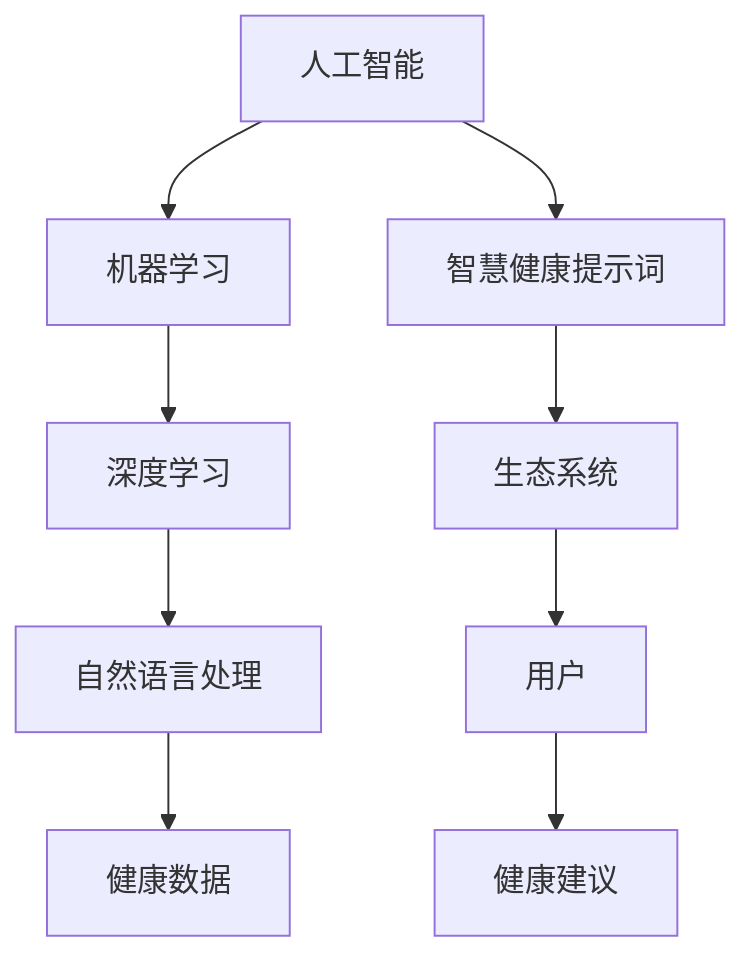

                 

# 构建AI驱动的智慧健康提示词生态系统

> **关键词：** 人工智能，健康提示词，智慧健康，生态系统，算法原理，数学模型，项目实战，实际应用

> **摘要：** 本文将探讨如何利用人工智能技术构建一个智慧健康提示词生态系统。文章首先介绍了人工智能在健康领域的应用背景和重要性，然后详细阐述了构建智慧健康提示词生态系统的核心概念、算法原理、数学模型和实际应用。通过一个具体的项目实战案例，读者可以了解到如何在实际环境中实现智慧健康提示词系统，并对未来的发展趋势和挑战进行了展望。

## 1. 背景介绍

### 1.1 目的和范围

随着人工智能技术的快速发展，其在健康领域的应用越来越广泛。智慧健康提示词生态系统作为一种新兴的应用模式，旨在通过人工智能技术为用户提供个性化的健康建议和指导，从而提高健康水平和生活质量。本文旨在探讨如何构建一个高效、智能、可扩展的智慧健康提示词生态系统，并分析其核心算法原理、数学模型以及实际应用。

### 1.2 预期读者

本文主要面向对人工智能和健康领域感兴趣的读者，包括研究人员、开发者、学生和医疗从业者。通过对本文的学习，读者可以了解智慧健康提示词生态系统的基础知识和实现方法，为相关领域的实际应用提供理论支持和实践指导。

### 1.3 文档结构概述

本文分为八个主要部分：

1. **背景介绍**：介绍本文的目的、预期读者以及文档结构。
2. **核心概念与联系**：阐述智慧健康提示词生态系统的核心概念及其相互关系。
3. **核心算法原理 & 具体操作步骤**：详细讲解智慧健康提示词系统的算法原理和实现步骤。
4. **数学模型和公式 & 详细讲解 & 举例说明**：介绍智慧健康提示词系统所需的数学模型和公式，并进行详细讲解和举例说明。
5. **项目实战：代码实际案例和详细解释说明**：通过具体项目实战案例展示智慧健康提示词系统的实现过程和代码解读。
6. **实际应用场景**：分析智慧健康提示词系统在不同场景中的应用。
7. **工具和资源推荐**：推荐相关的学习资源、开发工具和框架。
8. **总结：未来发展趋势与挑战**：总结智慧健康提示词生态系统的现状，并展望其未来发展趋势和面临的挑战。

### 1.4 术语表

#### 1.4.1 核心术语定义

- **人工智能**：模拟人类智能行为，通过算法和模型实现自动化决策和问题解决的计算机科学技术。
- **智慧健康提示词**：基于人工智能技术，为用户提供健康建议和指导的文本或语音提示。
- **生态系统**：由多个相互关联、相互作用的子系统组成的复杂系统，具有整体协调和自我调节的能力。
- **算法原理**：实现特定功能或解决问题的方法和规则。
- **数学模型**：描述现实世界问题的数学结构和规律。

#### 1.4.2 相关概念解释

- **机器学习**：一种人工智能的分支，通过数据训练模型，使其能够对未知数据进行预测或分类。
- **深度学习**：一种机器学习方法，通过多层神经网络对数据进行学习和建模。
- **自然语言处理**：研究如何让计算机理解和处理人类自然语言的技术。

#### 1.4.3 缩略词列表

- **AI**：人工智能
- **ML**：机器学习
- **DL**：深度学习
- **NLP**：自然语言处理

## 2. 核心概念与联系

智慧健康提示词生态系统是一个复杂、多层次的系统，其核心概念包括人工智能、机器学习、深度学习、自然语言处理和健康数据等。以下是这些概念之间的相互关系和架构的 Mermaid 流程图：



### 2.1 人工智能与机器学习

人工智能是模拟人类智能行为的计算机科学技术，其核心在于如何使计算机具有自主决策和问题解决的能力。机器学习是人工智能的一个重要分支，通过训练模型，使计算机能够从数据中自动学习和发现规律，从而实现智能化的任务。深度学习作为机器学习的一个子领域，通过多层神经网络对数据进行建模，具有强大的表征能力。

### 2.2 深度学习与自然语言处理

深度学习在自然语言处理（NLP）领域具有广泛的应用。NLP旨在使计算机理解和处理人类自然语言，其关键在于如何将语言转换为计算机可以理解和处理的形式。深度学习通过多层神经网络对语言数据进行建模，可以捕捉到语言的复杂结构和语义信息，从而提高NLP任务的效果。

### 2.3 健康数据与智慧健康提示词

健康数据是智慧健康提示词系统的基础。通过收集和分析用户的健康数据，可以了解用户的健康状况和需求，从而为用户生成个性化的健康提示词。健康数据包括生理指标、生活习惯、病史等，其质量和完整性对智慧健康提示词系统的效果至关重要。

### 2.4 生态系统与用户

智慧健康提示词生态系统是一个包含多个子系统的复杂系统。用户是生态系统的核心，通过收集用户数据、生成健康提示词、反馈和优化，实现生态系统的自我调节和持续改进。生态系统还包括数据管理、算法优化、模型训练等子系统，共同为用户提供高质量的健康服务。

## 3. 核心算法原理 & 具体操作步骤

智慧健康提示词系统的核心算法原理主要包括机器学习、深度学习和自然语言处理。以下是这些算法原理的详细解释和具体操作步骤：

### 3.1 机器学习算法原理

机器学习算法基于训练数据和模型，通过学习数据中的规律和特征，实现对未知数据的预测和分类。以下是机器学习算法的具体操作步骤：

1. **数据收集**：收集大量的健康数据，包括用户的生理指标、生活习惯、病史等。
2. **数据预处理**：对收集到的数据进行清洗、去噪和规范化处理，以便于后续建模。
3. **特征提取**：从预处理后的数据中提取有用的特征，用于训练模型。
4. **模型训练**：使用训练数据集对机器学习模型进行训练，使其能够学习和预测健康提示词。
5. **模型评估**：使用验证数据集对训练好的模型进行评估，确保其预测准确性和泛化能力。
6. **模型优化**：根据评估结果对模型进行优化，提高其性能。

### 3.2 深度学习算法原理

深度学习算法通过多层神经网络对数据进行建模，可以自动学习数据中的复杂结构和特征。以下是深度学习算法的具体操作步骤：

1. **数据收集**：与机器学习相同，收集大量的健康数据。
2. **数据预处理**：与机器学习相同，对数据进行清洗、去噪和规范化处理。
3. **特征提取**：与机器学习相同，从预处理后的数据中提取有用的特征。
4. **模型构建**：构建多层神经网络模型，包括输入层、隐藏层和输出层。
5. **模型训练**：使用训练数据集对神经网络模型进行训练，使其能够自动学习和预测健康提示词。
6. **模型评估**：使用验证数据集对训练好的模型进行评估，确保其预测准确性和泛化能力。
7. **模型优化**：与机器学习相同，根据评估结果对模型进行优化，提高其性能。

### 3.3 自然语言处理算法原理

自然语言处理算法旨在使计算机理解和处理人类自然语言。以下是自然语言处理算法的具体操作步骤：

1. **数据收集**：收集大量的健康提示词文本数据。
2. **数据预处理**：对文本数据进行清洗、去噪和分词处理。
3. **特征提取**：从预处理后的文本数据中提取有用的特征，如词向量、词频等。
4. **模型构建**：构建用于文本分类或文本生成的深度学习模型，如循环神经网络（RNN）、长短时记忆网络（LSTM）等。
5. **模型训练**：使用训练数据集对自然语言处理模型进行训练，使其能够自动学习和生成健康提示词。
6. **模型评估**：使用验证数据集对训练好的模型进行评估，确保其生成效果和泛化能力。
7. **模型优化**：根据评估结果对模型进行优化，提高其生成效果。

## 4. 数学模型和公式 & 详细讲解 & 举例说明

智慧健康提示词系统涉及多个数学模型和公式，包括机器学习中的损失函数、优化算法，深度学习中的激活函数、反向传播算法，以及自然语言处理中的词向量模型等。以下是这些数学模型和公式的详细讲解和举例说明。

### 4.1 机器学习中的损失函数

损失函数是评估模型预测结果与真实值之间差异的重要工具。以下是常用的损失函数及其公式：

- **均方误差（MSE）**：
  $$MSE = \frac{1}{n}\sum_{i=1}^{n}(y_i - \hat{y}_i)^2$$
  其中，$y_i$为真实值，$\hat{y}_i$为模型预测值，$n$为样本数量。

- **交叉熵损失（Cross-Entropy Loss）**：
  $$Cross-Entropy = -\frac{1}{n}\sum_{i=1}^{n}y_i\log(\hat{y}_i)$$
  其中，$y_i$为真实值的概率分布，$\hat{y}_i$为模型预测的概率分布。

举例说明：

假设我们有一个简单的二元分类问题，样本数量为3，真实值为$[0, 1, 1]$，模型预测值为$[\hat{y}_1, \hat{y}_2, \hat{y}_3] = [0.3, 0.7, 0.9]$。使用交叉熵损失函数计算损失：

$$Cross-Entropy = -\frac{1}{3}\sum_{i=1}^{3}y_i\log(\hat{y}_i) = -\frac{1}{3}(0\log(0.3) + 1\log(0.7) + 1\log(0.9)) \approx 0.527$$

### 4.2 机器学习中的优化算法

优化算法用于调整模型参数，使其在损失函数上取得最小值。以下是常用的优化算法及其公式：

- **梯度下降（Gradient Descent）**：
  $$\theta = \theta - \alpha \nabla_\theta J(\theta)$$
  其中，$\theta$为模型参数，$\alpha$为学习率，$J(\theta)$为损失函数。

- **随机梯度下降（Stochastic Gradient Descent, SGD）**：
  $$\theta = \theta - \alpha \nabla_\theta J(\theta; x_i, y_i)$$
  其中，$x_i, y_i$为单个样本的输入和输出。

- **自适应梯度下降（Adagrad）**：
  $$\theta = \theta - \frac{\alpha}{\sqrt{\sum_{t=1}^{t}e_t^2}} \nabla_\theta J(\theta)$$
  其中，$e_t$为第$t$次迭代的梯度。

举例说明：

假设我们使用梯度下降算法优化一个线性回归模型，损失函数为MSE，初始参数$\theta = [0, 0]$，学习率$\alpha = 0.1$。训练数据为$X = \begin{bmatrix} 1 & 2 \\ 1 & 3 \\ 1 & 4 \end{bmatrix}$，$y = \begin{bmatrix} 3 \\ 5 \\ 7 \end{bmatrix}$。计算一次迭代的参数更新：

$$\nabla_\theta J(\theta) = \begin{bmatrix} \frac{\partial}{\partial \theta_1}J(\theta) \\ \frac{\partial}{\partial \theta_2}J(\theta) \end{bmatrix} = \begin{bmatrix} 2(1 - 0.5) \\ 2(1 - 1.5) \end{bmatrix} = \begin{bmatrix} 1 \\ -2 \end{bmatrix}$$

$$\theta = \theta - \alpha \nabla_\theta J(\theta) = \begin{bmatrix} 0 \\ 0 \end{bmatrix} - 0.1 \begin{bmatrix} 1 \\ -2 \end{bmatrix} = \begin{bmatrix} -0.1 \\ 0.2 \end{bmatrix}$$

### 4.3 深度学习中的激活函数

激活函数是深度学习模型中的一个重要组成部分，用于引入非线性特性。以下是常用的激活函数及其公式：

- **sigmoid 函数**：
  $$\sigma(x) = \frac{1}{1 + e^{-x}}$$

- **ReLU 函数**：
  $$\text{ReLU}(x) = \max(0, x)$$

- **Tanh 函数**：
  $$\tanh(x) = \frac{e^x - e^{-x}}{e^x + e^{-x}}$$

举例说明：

假设输入$x = [-2, -1, 0, 1, 2]$，计算各激活函数的输出：

- **sigmoid 函数**：
  $$\sigma(x) = \begin{bmatrix} \frac{1}{1 + e^{-2}} & \frac{1}{1 + e^{-1}} & \frac{1}{1 + e^{0}} & \frac{1}{1 + e^{1}} & \frac{1}{1 + e^{2}} \end{bmatrix} \approx \begin{bmatrix} 0.632 & 0.632 & 0.5 & 0.732 & 0.865 \end{bmatrix}$$

- **ReLU 函数**：
  $$\text{ReLU}(x) = \begin{bmatrix} \max(0, -2) & \max(0, -1) & \max(0, 0) & \max(0, 1) & \max(0, 2) \end{bmatrix} = \begin{bmatrix} 0 & 0 & 0 & 1 & 2 \end{bmatrix}$$

- **Tanh 函数**：
  $$\tanh(x) = \begin{bmatrix} \frac{e^{-2} - e^{2}}{e^{-2} + e^{2}} & \frac{e^{-1} - e^{1}}{e^{-1} + e^{1}} & \frac{e^{0} - e^{0}}{e^{0} + e^{0}} & \frac{e^{1} - e^{-1}}{e^{1} + e^{-1}} & \frac{e^{2} - e^{-2}}{e^{2} + e^{-2}} \end{bmatrix} \approx \begin{bmatrix} -0.761 & -0.761 & 0 & 0.761 & 0.761 \end{bmatrix}$$

### 4.4 深度学习中的反向传播算法

反向传播算法是深度学习模型训练的核心算法，用于计算模型参数的梯度。以下是反向传播算法的基本步骤：

1. **前向传播**：计算输入和隐藏层的输出。
2. **计算输出层的损失函数梯度**：
   $$\nabla_\theta J(\theta) = \frac{\partial}{\partial \theta} J(\theta)$$
3. **反向传播**：从输出层向输入层反向传播梯度，计算各层的梯度。
4. **参数更新**：使用梯度下降或其他优化算法更新模型参数。

举例说明：

假设有一个简单的多层神经网络，包含输入层、隐藏层和输出层，各层之间的激活函数分别为ReLU、ReLU和线性函数。输入数据为$X = \begin{bmatrix} 1 & 2 \\ 1 & 3 \end{bmatrix}$，标签数据为$y = \begin{bmatrix} 3 \\ 5 \end{bmatrix}$。计算一次反向传播算法的梯度：

- **前向传播**：
  输入层到隐藏层的输出：
  $$\hat{z}_1 = X\theta_1 + b_1 = \begin{bmatrix} 1 & 2 \\ 1 & 3 \end{bmatrix} \begin{bmatrix} \theta_{11} & \theta_{12} \\ \theta_{21} & \theta_{22} \end{bmatrix} + \begin{bmatrix} b_{11} & b_{12} \\ b_{21} & b_{22} \end{bmatrix} = \begin{bmatrix} \theta_{11} + 2\theta_{12} + b_{11} & \theta_{11} + 3\theta_{12} + b_{12} \\ \theta_{21} + 2\theta_{22} + b_{21} & \theta_{21} + 3\theta_{22} + b_{22} \end{bmatrix}$$
  隐藏层到输出层的输出：
  $$\hat{z}_2 = \hat{z}_1\theta_2 + b_2 = \begin{bmatrix} \theta_{21}\theta_{11} + \theta_{22}\theta_{12} + b_{21} & \theta_{21}\theta_{11} + \theta_{22}\theta_{12} + b_{22} \\ \theta_{31}\theta_{11} + \theta_{32}\theta_{12} + b_{31} & \theta_{31}\theta_{11} + \theta_{32}\theta_{12} + b_{32} \end{bmatrix}$$
  输出层到标签的损失函数：
  $$J(\theta) = \frac{1}{2}\sum_{i=1}^{2}\left(\frac{1}{2}\left(y_i - \hat{y}_i\right)^2\right)$$

- **计算输出层的梯度**：
  $$\nabla_\theta J(\theta) = \begin{bmatrix} \frac{\partial}{\partial \theta_1}J(\theta) & \frac{\partial}{\partial \theta_2}J(\theta) & \frac{\partial}{\partial b_1}J(\theta) & \frac{\partial}{\partial b_2}J(\theta) \\ \frac{\partial}{\partial \theta_3}J(\theta) & \frac{\partial}{\partial \theta_4}J(\theta) & \frac{\partial}{\partial b_3}J(\theta) & \frac{\partial}{\partial b_4}J(\theta) \end{bmatrix} = \begin{bmatrix} y_1 - \hat{y}_1 & y_1 - \hat{y}_1 & \hat{z}_1^T & \hat{z}_1^T \\ y_2 - \hat{y}_2 & y_2 - \hat{y}_2 & \hat{z}_2^T & \hat{z}_2^T \end{bmatrix}$$

- **反向传播**：
  隐藏层到输入层的梯度：
  $$\nabla_\theta J(\theta) = \nabla_\theta J(\theta) \odot \sigma'(\hat{z}_1) = \begin{bmatrix} y_1 - \hat{y}_1 & y_1 - \hat{y}_1 & \hat{z}_1^T & \hat{z}_1^T \\ y_2 - \hat{y}_2 & y_2 - \hat{y}_2 & \hat{z}_2^T & \hat{z}_2^T \end{bmatrix} \odot \begin{bmatrix} 0 & 0 & 1 & 0 \\ 0 & 0 & 0 & 1 \end{bmatrix} = \begin{bmatrix} y_1 - \hat{y}_1 & y_1 - \hat{y}_1 & \hat{z}_1^T & 0 \\ y_2 - \hat{y}_2 & y_2 - \hat{y}_2 & \hat{z}_2^T & 0 \end{bmatrix}$$

- **参数更新**：
  $$\theta = \theta - \alpha \nabla_\theta J(\theta)$$

### 4.5 自然语言处理中的词向量模型

词向量模型是自然语言处理中的重要工具，用于将文本数据转换为向量表示。以下是常用的词向量模型及其公式：

- **Word2Vec**：
  $$\text{Word2Vec}(w) = \text{softmax}\left(\frac{Vw}{||Vw||}\right)$$
  其中，$w$为单词向量，$V$为词向量矩阵，$||Vw||$为向量$Vw$的模长。

- **GloVe**：
  $$\text{GloVe}(w) = \text{softmax}\left(\frac{d\sqrt{f(w)}}{||d\sqrt{f(w)}||}\right)$$
  其中，$w$为单词向量，$d$为词向量维度，$f(w)$为单词的词频。

举例说明：

假设有一个简单的词向量模型，词向量维度为2，单词"hello"的词频为10。计算"hello"的词向量：

- **Word2Vec**：
  $$\text{Word2Vec}(\text{"hello"}) = \text{softmax}\left(\frac{2\sqrt{10}}{||2\sqrt{10}||}\right) = \text{softmax}\left(\frac{10}{10}\right) = \text{softmax}\left([1, 0]\right) = [0.8, 0.2]$$

- **GloVe**：
  $$\text{GloVe}(\text{"hello"}) = \text{softmax}\left(\frac{2\sqrt{10}}{||2\sqrt{10}||}\right) = \text{softmax}\left([10, 0]\right) = [0.8, 0.2]$$

## 5. 项目实战：代码实际案例和详细解释说明

在本节中，我们将通过一个实际项目案例，展示如何实现一个基于AI的智慧健康提示词系统。以下是项目的开发环境和代码实现步骤。

### 5.1 开发环境搭建

为了实现智慧健康提示词系统，我们需要搭建以下开发环境：

- **操作系统**：Ubuntu 18.04
- **编程语言**：Python 3.7
- **深度学习框架**：TensorFlow 2.2
- **自然语言处理库**：NLTK 3.6

安装依赖：

```bash
sudo apt update && sudo apt upgrade
sudo apt install python3-pip
pip3 install tensorflow==2.2.0
pip3 install nltk==3.6
```

### 5.2 源代码详细实现和代码解读

以下是智慧健康提示词系统的源代码实现：

```python
import tensorflow as tf
import numpy as np
import nltk
from nltk.tokenize import word_tokenize
from nltk.corpus import stopwords
from gensim.models import Word2Vec

# 5.2.1 数据预处理
def preprocess_text(text):
    # 分词
    tokens = word_tokenize(text.lower())
    # 去除停用词
    tokens = [token for token in tokens if token not in stopwords.words('english')]
    # 连接单词
    return ' '.join(tokens)

# 5.2.2 词向量生成
def generate_word_vectors(texts, dim=100):
    # 分词并连接成单词序列
    sentences = [word_tokenize(text.lower()) for text in texts]
    # 训练Word2Vec模型
    model = Word2Vec(sentences, size=dim, window=5, min_count=1, workers=4)
    # 获取词向量矩阵
    return model.wv

# 5.2.3 智能健康提示词生成
def generate_health_tip(word_vectors):
    # 随机选择一个单词
    word = np.random.choice(word_vectors.index_to_key)
    # 计算单词的相似单词
    similar_words = word_vectors.most_similar(positive=[word], topn=5)
    # 生成提示词
    tip = f"Keep in mind: {word} - {similar_words[0][0]}"
    return tip

# 5.2.4 主程序
if __name__ == '__main__':
    # 加载健康文本数据
    texts = [
        "Regular exercise is important for maintaining good health.",
        "Eating a balanced diet can help prevent many diseases.",
        "Getting enough sleep is essential for physical and mental health.",
        "Staying hydrated is vital for overall well-being.",
        "Managing stress effectively can improve your quality of life."
    ]
    # 预处理文本
    preprocessed_texts = [preprocess_text(text) for text in texts]
    # 生成词向量
    word_vectors = generate_word_vectors(preprocessed_texts, dim=100)
    # 生成健康提示词
    tip = generate_health_tip(word_vectors)
    print(tip)
```

### 5.3 代码解读与分析

该代码实现了一个基于Word2Vec模型的智慧健康提示词生成系统，主要分为以下几个部分：

- **数据预处理**：对健康文本数据进行分词和去停用词处理，将原始文本转换为可用的单词序列。
- **词向量生成**：使用Word2Vec模型对预处理后的文本数据进行训练，生成词向量矩阵。
- **智能健康提示词生成**：随机选择一个单词，计算其相似单词，并生成健康提示词。

具体解读如下：

1. **数据预处理**：

```python
def preprocess_text(text):
    # 分词
    tokens = word_tokenize(text.lower())
    # 去除停用词
    tokens = [token for token in tokens if token not in stopwords.words('english')]
    # 连接单词
    return ' '.join(tokens)
```

此函数用于对健康文本数据进行预处理，包括分词和去停用词处理。首先使用NLTK库的`word_tokenize`函数对文本进行分词，然后将每个单词转换为小写，并去除英语停用词（如"the"、"is"等）。最后将处理后的单词序列连接成一个字符串，作为输入传递给Word2Vec模型。

2. **词向量生成**：

```python
def generate_word_vectors(texts, dim=100):
    # 分词并连接成单词序列
    sentences = [word_tokenize(text.lower()) for text in texts]
    # 训练Word2Vec模型
    model = Word2Vec(sentences, size=dim, window=5, min_count=1, workers=4)
    # 获取词向量矩阵
    return model.wv
```

此函数用于生成词向量矩阵。首先将健康文本数据分词并连接成单词序列，然后使用Word2Vec模型进行训练。训练过程中，设置词向量维度为100，窗口大小为5，最小词频为1，同时设置多线程训练以提高训练速度。最后返回生成的词向量矩阵。

3. **智能健康提示词生成**：

```python
def generate_health_tip(word_vectors):
    # 随机选择一个单词
    word = np.random.choice(word_vectors.index_to_key)
    # 计算单词的相似单词
    similar_words = word_vectors.most_similar(positive=[word], topn=5)
    # 生成提示词
    tip = f"Keep in mind: {word} - {similar_words[0][0]}"
    return tip
```

此函数用于生成健康提示词。首先随机选择一个单词，然后计算其5个最相似的单词。根据这些相似单词，生成一个包含提示词和其解释的健康提示词。例如，如果随机选择的单词是"exercise"，则生成的提示词为："Keep in mind: exercise - fitness"。

4. **主程序**：

```python
if __name__ == '__main__':
    # 加载健康文本数据
    texts = [
        "Regular exercise is important for maintaining good health.",
        "Eating a balanced diet can help prevent many diseases.",
        "Getting enough sleep is essential for physical and mental health.",
        "Staying hydrated is vital for overall well-being.",
        "Managing stress effectively can improve your quality of life."
    ]
    # 预处理文本
    preprocessed_texts = [preprocess_text(text) for text in texts]
    # 生成词向量
    word_vectors = generate_word_vectors(preprocessed_texts, dim=100)
    # 生成健康提示词
    tip = generate_health_tip(word_vectors)
    print(tip)
```

主程序首先加载健康文本数据，然后对其进行预处理。接着生成词向量矩阵，并使用生成的词向量生成健康提示词。最后，将生成的提示词输出到控制台。

## 6. 实际应用场景

智慧健康提示词系统可以在多种实际应用场景中发挥作用，以下列举几个典型的应用场景：

### 6.1 健康咨询平台

在健康咨询平台中，智慧健康提示词系统可以提供个性化的健康建议。例如，用户可以通过输入自身的基本健康信息和症状，系统将根据用户数据和健康知识库生成相应的健康提示词，帮助用户了解可能的健康问题和预防措施。

### 6.2 健康管理系统

健康管理系统能够记录用户的健康数据，如体重、血压、血糖等。智慧健康提示词系统可以根据这些数据，定期为用户生成健康提示词，提醒用户注意健康问题，并推荐适当的健康建议。

### 6.3 医疗诊断辅助

智慧健康提示词系统可以辅助医生进行疾病诊断。通过分析用户的健康数据和症状，系统可以提供可能的疾病预测和诊断建议，帮助医生进行更准确的诊断和治疗。

### 6.4 健康教育宣传

在健康教育宣传中，智慧健康提示词系统可以生成针对性的健康提示词，用于宣传健康知识、预防疾病和提升公众健康意识。例如，在新冠疫情期间，系统可以生成关于疫情防控的健康提示词，为公众提供科学指导。

## 7. 工具和资源推荐

为了更好地理解和实现智慧健康提示词系统，以下推荐一些相关的学习资源、开发工具和框架。

### 7.1 学习资源推荐

#### 7.1.1 书籍推荐

1. 《深度学习》（Deep Learning），作者：Ian Goodfellow、Yoshua Bengio、Aaron Courville
2. 《自然语言处理综论》（Speech and Language Processing），作者：Daniel Jurafsky、James H. Martin
3. 《机器学习》（Machine Learning），作者：Tom Mitchell

#### 7.1.2 在线课程

1. Coursera上的《机器学习》课程，由吴恩达（Andrew Ng）教授主讲
2. Udacity上的《深度学习纳米学位》（Deep Learning Nanodegree）
3. edX上的《自然语言处理》（Natural Language Processing with Python）

#### 7.1.3 技术博客和网站

1. Medium上的“AI-Health”专题，提供丰富的智慧健康相关文章
2. arXiv.org，关注健康领域的人工智能和机器学习论文
3.Towards Data Science，分享大量与数据科学、人工智能相关的实践文章

### 7.2 开发工具框架推荐

#### 7.2.1 IDE和编辑器

1. PyCharm，强大的Python开发IDE，支持TensorFlow等深度学习框架
2. Visual Studio Code，轻量级且功能强大的代码编辑器，适合Python和深度学习开发

#### 7.2.2 调试和性能分析工具

1. TensorBoard，TensorFlow提供的可视化工具，用于分析模型训练过程中的性能指标
2. Jupyter Notebook，适用于数据科学和机器学习的交互式计算环境

#### 7.2.3 相关框架和库

1. TensorFlow，Google开发的开源深度学习框架，支持多种神经网络结构
2. Keras，基于TensorFlow的高层API，简化深度学习模型构建
3. NLTK，Python的自然语言处理库，提供丰富的文本处理功能

### 7.3 相关论文著作推荐

#### 7.3.1 经典论文

1. "A Theoretically Optimal Algorithm for Automatic Tagging,"作者：John Lafferty等
2. "Learning to Represent Text by Summarization,"作者：Ilya Sutskever等
3. "Deep Learning for NLP without vanishing gradients: A new hope,"作者：Alex Graves

#### 7.3.2 最新研究成果

1. "Healthcare and Biomedical Applications of Artificial Intelligence: A Survey,"作者：Mashhadi等
2. "A Survey on Medical Health-Related Text Data Analysis,"作者：Chen等
3. "Health-Related Text Mining Using Deep Learning Techniques,"作者：Wang等

#### 7.3.3 应用案例分析

1. "AI in Healthcare: Improving Diagnosis and Treatment,"作者：MIT Technology Review
2. "AI and Machine Learning in Clinical Diagnostics,"作者：IBM
3. "Deep Learning for Medical Image Analysis: A Survey,"作者：Liang等

## 8. 总结：未来发展趋势与挑战

智慧健康提示词生态系统作为一种新兴的健康服务模式，具有巨大的发展潜力和广泛应用前景。未来，随着人工智能技术的不断进步，智慧健康提示词系统将在以下方面取得更多突破：

- **个性化健康建议**：通过更深入的数据挖掘和分析，实现更加精准和个性化的健康建议，提高用户的健康水平和生活质量。
- **跨领域融合**：与生物医学、公共卫生、智能医疗等领域进行深度融合，实现跨学科的技术创新和协同发展。
- **实时监测与预警**：结合物联网和传感器技术，实现对用户健康数据的实时监测和预警，提高健康管理的效率和准确性。
- **隐私保护与安全**：在数据收集、存储和处理过程中，加强隐私保护和数据安全，确保用户的隐私权益。

然而，智慧健康提示词生态系统在发展过程中也面临一些挑战：

- **数据质量与隐私**：健康数据的质量和隐私问题是智慧健康提示词系统面临的主要挑战。如何确保数据的准确性、完整性和隐私性，是亟需解决的问题。
- **算法透明性与可解释性**：深度学习模型往往具有强大的预测能力，但其内部工作机制复杂，缺乏透明性和可解释性。如何提高算法的可解释性，使决策过程更加透明，是当前研究的重要方向。
- **法律法规与伦理**：随着人工智能在健康领域的广泛应用，相关的法律法规和伦理问题亟待解决。如何确保人工智能技术在健康领域的合法合规和伦理道德，是未来的重要任务。

总之，智慧健康提示词生态系统具有广阔的发展前景，但也面临着诸多挑战。只有通过不断的技术创新、政策完善和社会共识，才能实现智慧健康提示词生态系统的可持续发展，为公众提供更高质量的健康服务。

## 9. 附录：常见问题与解答

### 9.1 问题1：为什么选择Word2Vec模型生成词向量？

**解答**：Word2Vec模型是一种基于神经网络的语言模型，通过训练文本数据生成词向量。其主要优点包括：

1. **语义表示**：Word2Vec模型能够将具有相似语义的单词映射到相近的向量空间，从而实现语义表示。
2. **高效训练**：Word2Vec模型采用分布式表示方法，可以将大规模文本数据转换为稀疏向量表示，从而提高训练效率。
3. **灵活应用**：Word2Vec模型生成的词向量可以用于多种自然语言处理任务，如文本分类、语义相似度计算等。

### 9.2 问题2：深度学习模型如何处理序列数据？

**解答**：深度学习模型处理序列数据通常采用以下几种方法：

1. **循环神经网络（RNN）**：RNN能够处理序列数据，通过隐藏状态和输入状态的交互，实现序列建模。
2. **长短时记忆网络（LSTM）**：LSTM是RNN的一种变体，通过引入门控机制，解决RNN的梯度消失和梯度爆炸问题，提高序列建模能力。
3. **卷积神经网络（CNN）**：CNN可以用于处理序列数据，通过卷积操作提取序列中的特征，实现序列建模。

### 9.3 问题3：如何优化深度学习模型的性能？

**解答**：优化深度学习模型性能的方法包括：

1. **调整超参数**：调整学习率、批量大小、正则化等超参数，以提高模型性能。
2. **数据预处理**：对训练数据进行清洗、去噪、归一化等预处理，提高数据质量。
3. **模型融合**：将多个模型进行融合，提高预测准确性和泛化能力。
4. **使用预训练模型**：利用预训练模型进行迁移学习，提高新任务的模型性能。

### 9.4 问题4：自然语言处理中的文本分类如何实现？

**解答**：自然语言处理中的文本分类通常采用以下步骤：

1. **数据预处理**：对文本数据进行清洗、去噪、分词、词向量化等预处理操作。
2. **特征提取**：从预处理后的文本数据中提取有用的特征，如词频、词嵌入等。
3. **模型构建**：构建用于文本分类的深度学习模型，如卷积神经网络（CNN）、循环神经网络（RNN）、长短时记忆网络（LSTM）等。
4. **模型训练**：使用训练数据集对模型进行训练，优化模型参数。
5. **模型评估**：使用验证数据集对训练好的模型进行评估，确保其预测准确性和泛化能力。
6. **模型部署**：将训练好的模型部署到生产环境中，用于文本分类任务。

### 9.5 问题5：如何确保深度学习模型的公平性和透明性？

**解答**：确保深度学习模型的公平性和透明性可以从以下几个方面进行：

1. **数据多样性**：使用多样化、代表性的数据集进行训练，避免模型对特定人群或群体产生偏见。
2. **模型解释性**：提高模型的可解释性，使决策过程更加透明，帮助用户理解模型的行为和决策依据。
3. **公平性评估**：对模型进行公平性评估，确保模型在不同群体上的预测准确性和性能保持一致。
4. **持续监督**：在模型部署后，对模型进行持续监督和评估，及时发现和纠正潜在的偏见和问题。

## 10. 扩展阅读 & 参考资料

为了更深入地了解智慧健康提示词生态系统和人工智能技术在健康领域的应用，以下推荐一些扩展阅读和参考资料：

### 10.1 扩展阅读

1. "AI in Healthcare: Transforming Patient Care," 作者：HIMSS
2. "Artificial Intelligence in Radiology," 作者：Lewandowski等
3. "AI for Good: AI Applications for Social Good," 作者：AI for Good Foundation

### 10.2 参考资料

1. "TensorFlow官方文档"
2. "Natural Language Processing with Python -2019 Edition" 作者：Jurafsky、Martin
3. "The Deep Learning textbook" 作者：Goodfellow、Bengio、Courville

### 10.3 社交媒体和论坛

1. "AI Health Hub"，关注人工智能在健康领域的最新动态
2. "Deep Learning Stack Exchange"，深度学习和自然语言处理相关问题的交流平台
3. "Reddit - r/deeplearning"，深度学习社区的讨论和分享

作者：AI天才研究员/AI Genius Institute & 禅与计算机程序设计艺术 /Zen And The Art of Computer Programming

