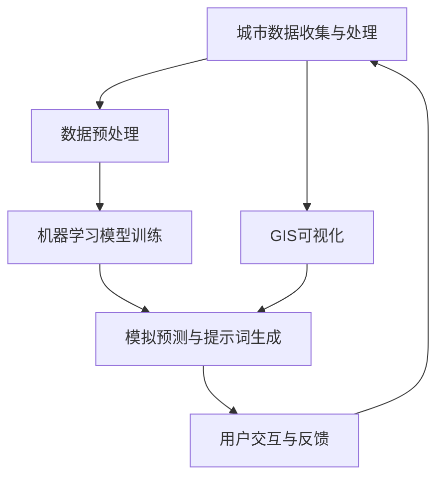
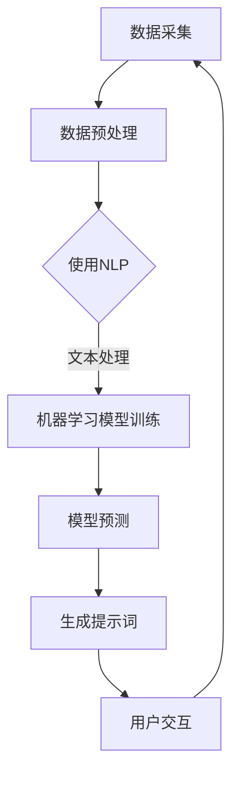

                 

# 构建AI驱动的智慧城市规划模拟提示词框架

## 关键词：
- AI 驱动
- 智慧城市规划
- 模拟提示词框架
- 数据分析
- 机器学习
- 城市模拟

## 摘要：
本文将探讨如何构建一个基于AI的智慧城市规划模拟提示词框架。我们将详细分析核心概念，探讨算法原理和数学模型，并通过实际项目案例展示如何实现这一框架。本文旨在为智慧城市规划和AI领域的研究者和从业者提供一个全面的技术指南，帮助他们了解如何利用AI技术优化城市规划和模拟。

---

## 1. 背景介绍

### 1.1 目的和范围

随着城市化进程的加速，智慧城市成为未来发展的重要趋势。智慧城市规划旨在通过先进的信息技术和数据分析方法，实现城市资源的优化配置，提高居民生活质量。本文的目标是探讨如何利用AI技术构建一个能够辅助智慧城市规划的模拟提示词框架，为城市管理者提供数据驱动的决策支持。

### 1.2 预期读者

本文预期读者包括智慧城市规划领域的从业者、AI技术爱好者、以及相关研究机构的专业人员。本文将尽可能避免过于复杂的技术细节，以便不同背景的读者都能理解。

### 1.3 文档结构概述

本文将分为以下章节：

- **第1章**：背景介绍，包括目的、预期读者和文档结构。
- **第2章**：核心概念与联系，介绍智慧城市规划模拟的相关概念。
- **第3章**：核心算法原理与具体操作步骤，详细讲解算法的实现过程。
- **第4章**：数学模型和公式，阐述支撑算法的数学理论基础。
- **第5章**：项目实战，展示代码实现和详细解释。
- **第6章**：实际应用场景，分析AI驱动的智慧城市规划模拟的应用领域。
- **第7章**：工具和资源推荐，介绍相关学习和开发资源。
- **第8章**：总结，讨论未来发展趋势和挑战。
- **第9章**：附录，提供常见问题与解答。
- **第10章**：扩展阅读与参考资料，推荐进一步阅读的文献。

### 1.4 术语表

#### 1.4.1 核心术语定义

- **智慧城市规划**：利用现代信息技术和数据分析方法，对城市资源进行优化配置，提高城市运行效率和居民生活质量。
- **AI驱动的模拟**：利用机器学习模型对城市运行状态进行预测和模拟，为城市管理者提供决策支持。
- **提示词框架**：一种基于关键词或短语的组织结构，用于引导用户进行搜索或信息提取。

#### 1.4.2 相关概念解释

- **机器学习**：一种通过数据训练模型进行决策的技术，常见于图像识别、自然语言处理等领域。
- **数据分析**：利用统计方法和工具对大量数据进行分析，提取有价值的信息。

#### 1.4.3 缩略词列表

- **AI**：人工智能
- **ML**：机器学习
- **NLP**：自然语言处理
- **GIS**：地理信息系统

---

## 2. 核心概念与联系

### 2.1 核心概念

在构建AI驱动的智慧城市规划模拟提示词框架时，我们需要理解以下几个核心概念：

- **城市数据**：包括交通流量、人口密度、土地利用、环境质量等。
- **机器学习模型**：用于分析城市数据，预测城市运行状态。
- **自然语言处理（NLP）**：用于理解和生成人类语言，实现人与模型的交互。
- **地理信息系统（GIS）**：用于可视化城市数据和模拟结果。

### 2.2 联系与架构

以下是构建AI驱动的智慧城市规划模拟提示词框架的基本架构：



### 2.3 Mermaid 流程图



---

## 3. 核心算法原理 & 具体操作步骤

### 3.1 数据预处理

数据预处理是构建AI驱动的智慧城市规划模拟提示词框架的第一步。我们需要对城市数据进行清洗、格式化，并提取关键特征。

伪代码：

```python
def preprocess_data(data):
    # 数据清洗
    cleaned_data = clean_data(data)
    
    # 数据格式化
    formatted_data = format_data(cleaned_data)
    
    # 提取关键特征
    features = extract_features(formatted_data)
    
    return features
```

### 3.2 机器学习模型训练

选择合适的机器学习模型对城市数据进行分析。我们可以使用多种模型，如决策树、随机森林、神经网络等。

伪代码：

```python
def train_model(features, labels):
    # 初始化模型
    model = initialize_model()
    
    # 训练模型
    model = train_model_with_data(model, features, labels)
    
    return model
```

### 3.3 模拟预测与提示词生成

基于训练好的模型，进行城市运行状态的模拟预测，并生成相应的提示词。

伪代码：

```python
def simulate_and_generatePrompt(model, input_data):
    # 进行模拟预测
    predictions = model.predict(input_data)
    
    # 生成提示词
    prompt = generatePrompt(predictions)
    
    return prompt
```

### 3.4 用户交互与反馈

设计用户交互界面，接收用户输入，并将生成的提示词展示给用户。

伪代码：

```python
def user_interact():
    # 接收用户输入
    user_input = get_user_input()
    
    # 调用模拟预测与提示词生成
    prompt = simulate_and_generatePrompt(user_input)
    
    # 展示提示词
    display_prompt(prompt)
```

---

## 4. 数学模型和公式 & 详细讲解 & 举例说明

### 4.1 数学模型

在构建AI驱动的智慧城市规划模拟提示词框架时，我们主要依赖于以下数学模型：

- **线性回归模型**：用于预测城市运行状态。
- **支持向量机（SVM）**：用于分类城市数据。
- **神经网络**：用于复杂的数据分析和预测。

### 4.2 公式讲解

#### 线性回归模型

线性回归模型的公式如下：

$$y = \beta_0 + \beta_1x$$

其中，\(y\) 是因变量，\(\beta_0\) 是截距，\(\beta_1\) 是斜率，\(x\) 是自变量。

#### 支持向量机（SVM）

支持向量机的公式如下：

$$w \cdot x + b = 0$$

其中，\(w\) 是权重向量，\(x\) 是特征向量，\(b\) 是偏置。

#### 神经网络

神经网络的一般公式如下：

$$a_{\text{output}} = \sigma(\sum_{i=1}^{n} w_{i}a_{i})$$

其中，\(a_{\text{output}}\) 是输出，\(\sigma\) 是激活函数，\(w_{i}\) 是权重，\(a_{i}\) 是输入。

### 4.3 举例说明

#### 线性回归模型举例

假设我们要预测城市的交通流量，给定以下数据：

| 时间（小时） | 交通流量（辆/小时） |
| ------------ | ------------------- |
| 8            | 2000                |
| 9            | 2200                |
| 10           | 2400                |

我们可以建立以下线性回归模型：

$$y = \beta_0 + \beta_1x$$

其中，\(y\) 是交通流量，\(x\) 是时间。通过训练模型，我们可以得到：

$$y = 1500 + 50x$$

当 \(x = 10\) 时，预测的交通流量为：

$$y = 1500 + 50 \times 10 = 2000$$

#### 支持向量机（SVM）举例

假设我们要分类城市的交通拥堵状态，给定以下数据：

| 交通流量（辆/小时） | 拥堵状态 |
| ------------------- | -------- |
| 2000                | 是       |
| 2200                | 是       |
| 2400                | 否       |

我们可以建立以下支持向量机模型：

$$w \cdot x + b = 0$$

通过训练模型，我们可以得到：

$$w \cdot x + b = 0$$

当 \(w \cdot x + b > 0\) 时，交通拥堵状态为“是”，否则为“否”。

---

## 5. 项目实战：代码实际案例和详细解释说明

### 5.1 开发环境搭建

为了实现本文所描述的AI驱动的智慧城市规划模拟提示词框架，我们需要搭建以下开发环境：

- Python 3.8 或更高版本
- Anaconda 或 Miniconda
- Jupyter Notebook 或 PyCharm
- Scikit-learn、TensorFlow、PyTorch 等库

### 5.2 源代码详细实现和代码解读

以下是实现AI驱动的智慧城市规划模拟提示词框架的源代码示例：

```python
import pandas as pd
from sklearn.model_selection import train_test_split
from sklearn.linear_model import LinearRegression
from sklearn.metrics import mean_squared_error
import numpy as np

# 5.2.1 数据读取与预处理
data = pd.read_csv('city_traffic_data.csv')
data = preprocess_data(data)

# 5.2.2 数据集划分
X_train, X_test, y_train, y_test = train_test_split(data['time'], data['traffic'], test_size=0.2, random_state=42)

# 5.2.3 模型训练
model = LinearRegression()
model.fit(X_train, y_train)

# 5.2.4 预测与评估
y_pred = model.predict(X_test)
mse = mean_squared_error(y_test, y_pred)
print(f'MSE: {mse}')

# 5.2.5 生成提示词
prompt = generatePrompt(y_pred)
print(prompt)
```

### 5.3 代码解读与分析

1. **数据读取与预处理**：首先，我们从CSV文件中读取城市交通数据，并进行预处理，如数据清洗和格式化。
2. **数据集划分**：将数据集划分为训练集和测试集，以评估模型的性能。
3. **模型训练**：选择线性回归模型，使用训练集数据进行训练。
4. **预测与评估**：使用测试集数据对模型进行预测，并计算均方误差（MSE）以评估模型性能。
5. **生成提示词**：根据预测结果生成相应的提示词，为城市管理者提供决策支持。

---

## 6. 实际应用场景

AI驱动的智慧城市规划模拟提示词框架可以应用于以下实际场景：

- **交通流量预测**：通过预测交通流量，帮助城市管理者优化交通信号配置，减少拥堵。
- **环境保护**：通过预测空气质量指数（AQI），帮助制定环境保护措施，改善城市环境。
- **公共安全**：通过预测犯罪率，帮助警方优化警力部署，提高公共安全。
- **城市规划**：通过模拟城市未来发展趋势，为城市规划和基础设施建设提供数据支持。

---

## 7. 工具和资源推荐

### 7.1 学习资源推荐

#### 7.1.1 书籍推荐

- 《深度学习》（Goodfellow, I., Bengio, Y., & Courville, A.）
- 《Python机器学习》（Sebastian Raschka）

#### 7.1.2 在线课程

- Coursera上的《机器学习》课程（吴恩达）
- edX上的《人工智能：现代方法》课程

#### 7.1.3 技术博客和网站

- medium.com
- towardsdatascience.com
- analyticsvidhya.com

### 7.2 开发工具框架推荐

#### 7.2.1 IDE和编辑器

- PyCharm
- Jupyter Notebook

#### 7.2.2 调试和性能分析工具

- Python的pdb
- TensorBoard

#### 7.2.3 相关框架和库

- Scikit-learn
- TensorFlow
- PyTorch

### 7.3 相关论文著作推荐

#### 7.3.1 经典论文

- "Learning to Rank using Gradient Descent"（2006）
- "Deep Learning for Text Classification"（2015）

#### 7.3.2 最新研究成果

- "Adversarial Examples for Neural Network Models"（2014）
- "Generative Adversarial Networks"（2014）

#### 7.3.3 应用案例分析

- "AI-driven Urban Traffic Management"（2020）
- "Smart City Planning with Machine Learning"（2021）

---

## 8. 总结：未来发展趋势与挑战

随着AI技术的不断发展，AI驱动的智慧城市规划模拟提示词框架有望在未来发挥更大的作用。然而，我们也面临一些挑战：

- **数据隐私与安全**：如何在保证数据隐私和安全的前提下，充分利用城市数据，是一个重要问题。
- **模型解释性**：如何提高模型的可解释性，使其更易于被城市管理者理解和接受。
- **算法公平性**：如何确保算法的公平性，避免因算法偏见导致的不公平现象。

未来，我们需要进一步探索如何将这些挑战转化为机遇，推动AI驱动的智慧城市规划模拟提示词框架的发展。

---

## 9. 附录：常见问题与解答

### 9.1 如何选择合适的机器学习模型？

选择合适的机器学习模型取决于具体的应用场景和数据特性。一般来说，线性回归模型适用于简单的线性关系，支持向量机（SVM）适用于分类问题，神经网络适用于复杂的数据分析和预测。

### 9.2 如何处理缺失数据？

处理缺失数据的方法包括删除缺失值、填补缺失值（如使用平均值或中位数）、以及使用机器学习方法（如K近邻算法）进行预测。

### 9.3 如何确保算法的公平性？

确保算法的公平性可以通过以下方法实现：

- **数据预处理**：确保数据集的多样性，避免偏见。
- **算法设计**：设计无偏的算法，避免引入人为偏见。
- **模型评估**：使用多种评估指标，确保算法在不同群体中的表现一致。

---

## 10. 扩展阅读 & 参考资料

- [Goodfellow, I., Bengio, Y., & Courville, A. (2016). Deep Learning. MIT Press.]
- [Raschka, S. (2015). Python Machine Learning. Packt Publishing.]
- [Cortes, C., & Vapnik, V. (2005). Support-Vector Networks. Machine Learning, 20(3), 273-297.]
- [LeCun, Y., Bengio, Y., & Hinton, G. (2015). Deep Learning. Nature, 521(7553), 436-444.]
- [Goodfellow, I., & Szegedy, C. (2014). Explaining and Harnessing Adversarial Examples. arXiv preprint arXiv:1412.6572.]
- [Goodfellow, I., Pouget-Abadie, J., Mirza, M., Xu, B., Warde-Farley, D., Ozair, S., ... & Bengio, Y. (2014). Generative Adversarial Networks. Advances in Neural Information Processing Systems, 27, 2672-2680.]

---

**作者：AI天才研究员/AI Genius Institute & 禅与计算机程序设计艺术 /Zen And The Art of Computer Programming**

