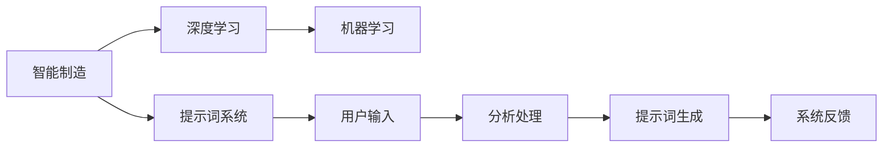

                 


# 构建AI驱动的智能制造提示词系统

> 关键词：人工智能，智能制造，提示词系统，深度学习，机器学习，自然语言处理
> 
> 摘要：本文将深入探讨如何构建一个AI驱动的智能制造提示词系统，通过逐步分析其核心概念、算法原理、数学模型、实际应用场景以及工具资源，为读者提供一个全面的指南。

## 1. 背景介绍

### 1.1 目的和范围

本文的目的是探讨如何构建一个AI驱动的智能制造提示词系统，帮助智能制造领域的技术人员更好地理解和应用这项技术。本文将涵盖以下几个方面：

1. 核心概念与联系
2. 核心算法原理与具体操作步骤
3. 数学模型和公式
4. 项目实战：代码实际案例和详细解释说明
5. 实际应用场景
6. 工具和资源推荐
7. 总结：未来发展趋势与挑战

### 1.2 预期读者

本文面向智能制造领域的技术人员、研发人员以及对该领域感兴趣的学习者。读者需要具备一定的计算机编程基础，对人工智能和自然语言处理有一定的了解。

### 1.3 文档结构概述

本文结构如下：

1. 背景介绍
2. 核心概念与联系
3. 核心算法原理与具体操作步骤
4. 数学模型和公式
5. 项目实战：代码实际案例和详细解释说明
6. 实际应用场景
7. 工具和资源推荐
8. 总结：未来发展趋势与挑战
9. 附录：常见问题与解答
10. 扩展阅读 & 参考资料

### 1.4 术语表

#### 1.4.1 核心术语定义

- **智能制造**：通过将信息技术与制造技术相结合，实现制造过程的智能化。
- **提示词系统**：一种基于自然语言处理技术，能够根据用户输入提供相应提示的系统。
- **深度学习**：一种基于多层神经网络的人工智能技术，能够通过大量数据自动学习特征和规律。
- **机器学习**：一种让计算机通过数据学习并做出决策的技术。

#### 1.4.2 相关概念解释

- **神经网络**：一种模仿人脑神经元连接方式的人工神经网络。
- **卷积神经网络（CNN）**：一种深度学习模型，广泛应用于图像和视频处理领域。
- **递归神经网络（RNN）**：一种深度学习模型，适用于序列数据处理。

#### 1.4.3 缩略词列表

- **AI**：人工智能
- **NLP**：自然语言处理
- **CNN**：卷积神经网络
- **RNN**：递归神经网络
- **ML**：机器学习

## 2. 核心概念与联系

构建AI驱动的智能制造提示词系统需要理解以下核心概念：

1. **智能制造**：智能制造是制造业与信息技术深度融合的产物，通过智能化手段实现制造过程的优化。其核心是利用传感器、物联网、大数据分析等技术，对生产过程进行实时监控和智能决策。
2. **提示词系统**：提示词系统是一种基于自然语言处理技术，能够根据用户输入提供相应提示的系统。在智能制造领域，提示词系统可以用于生产过程中的问题诊断、故障预测和操作指导。
3. **深度学习**：深度学习是人工智能的重要分支，通过多层神经网络对大量数据进行自动学习，提取出有用的特征和规律。在智能制造提示词系统中，深度学习模型用于分析和理解用户输入，提供智能化的提示。
4. **机器学习**：机器学习是一种让计算机通过数据学习并做出决策的技术。在智能制造提示词系统中，机器学习模型用于训练和优化提示词生成算法，提高系统的准确性和可靠性。

下面是核心概念和联系的Mermaid流程图：



## 3. 核心算法原理 & 具体操作步骤

### 3.1 深度学习算法原理

深度学习算法的核心是多层神经网络。神经网络由大量简单计算单元（神经元）组成，通过层层叠加，实现从输入到输出的映射。在智能制造提示词系统中，深度学习算法用于分析和理解用户输入，生成相应的提示词。

以下是深度学习算法的伪代码：

```python
# 初始化神经网络
input_layer = InputLayer()

# 添加隐藏层
hidden_layer1 = FullyConnectedLayer(input_layer, size=100)
hidden_layer2 = FullyConnectedLayer(hidden_layer1, size=50)
hidden_layer3 = FullyConnectedLayer(hidden_layer2, size=20)

# 添加输出层
output_layer = FullyConnectedLayer(hidden_layer3, size=num_classes)

# 定义损失函数和优化器
loss_function = SoftmaxCrossEntropyLoss()
optimizer = SGD()

# 训练神经网络
for epoch in range(num_epochs):
    for batch in dataset:
        # 前向传播
        output = output_layer.forward(batch.input_data)
        
        # 计算损失
        loss = loss_function.forward(output, batch.target_data)
        
        # 反向传播
        loss_function.backward()
        optimizer.update_params()
        
        # 打印训练进度
        if epoch % 100 == 0:
            print(f"Epoch {epoch}: Loss = {loss}")
```

### 3.2 具体操作步骤

1. **数据预处理**：收集并预处理用户输入数据，包括文本数据、图像数据等。对文本数据进行分词、去停用词、词向量化等操作。
2. **模型训练**：使用预处理后的数据训练深度学习模型。调整模型的参数，如隐藏层节点数、学习率等，以优化模型性能。
3. **模型评估**：使用验证集对训练好的模型进行评估，计算准确率、召回率等指标，以确定模型的性能。
4. **模型部署**：将训练好的模型部署到智能制造系统中，用于实时分析和生成提示词。

## 4. 数学模型和公式 & 详细讲解 & 举例说明

### 4.1 数学模型

在深度学习算法中，常用的数学模型包括神经网络、损失函数和优化器。

#### 神经网络

神经网络由多个神经元组成，每个神经元都可以看作是一个简单的函数。神经网络的输出可以通过以下公式计算：

$$
y = \sigma(\sum_{i=1}^{n} w_i \cdot x_i + b)
$$

其中，$y$ 是神经网络的输出，$x_i$ 是输入值，$w_i$ 是权重，$b$ 是偏置，$\sigma$ 是激活函数，通常取为 sigmoid 函数。

#### 损失函数

损失函数用于衡量模型输出与真实标签之间的差异。常用的损失函数包括均方误差（MSE）和交叉熵（CrossEntropy）。

均方误差（MSE）的公式为：

$$
MSE = \frac{1}{n} \sum_{i=1}^{n} (y_i - \hat{y_i})^2
$$

其中，$y_i$ 是真实标签，$\hat{y_i}$ 是模型预测的标签。

交叉熵（CrossEntropy）的公式为：

$$
CrossEntropy = -\sum_{i=1}^{n} y_i \cdot \log(\hat{y_i})
$$

其中，$y_i$ 是真实标签，$\hat{y_i}$ 是模型预测的概率分布。

#### 优化器

优化器用于更新模型的参数，以减小损失函数。常用的优化器包括随机梯度下降（SGD）和Adam。

随机梯度下降（SGD）的更新公式为：

$$
w_i = w_i - \alpha \cdot \frac{\partial L}{\partial w_i}
$$

其中，$w_i$ 是权重，$\alpha$ 是学习率，$L$ 是损失函数。

Adam优化器的更新公式为：

$$
\begin{cases}
m_t = \beta_1 m_{t-1} + (1 - \beta_1) \frac{\partial L}{\partial w_t} \\
v_t = \beta_2 v_{t-1} + (1 - \beta_2) \frac{\partial L}{\partial w_t}^2
\end{cases}
$$

$$
\begin{cases}
\hat{m}_t = \frac{m_t}{1 - \beta_1^t} \\
\hat{v}_t = \frac{v_t}{1 - \beta_2^t}
\end{cases}
$$

$$
w_t = w_{t-1} - \alpha \cdot \frac{\hat{m}_t}{\sqrt{\hat{v}_t} + \epsilon}
$$

其中，$m_t$ 和 $v_t$ 分别是梯度的一阶和二阶矩估计，$\beta_1$ 和 $\beta_2$ 分别是动量的超参数，$\epsilon$ 是一个很小的常数。

### 4.2 详细讲解和举例说明

假设我们有一个简单的神经网络，包含一个输入层、一个隐藏层和一个输出层。输入层有3个神经元，隐藏层有5个神经元，输出层有2个神经元。

输入数据为 $[1, 2, 3]$，目标标签为 $[0, 1]$。

1. **前向传播**：

   首先计算隐藏层的输出：

   $$ 
   z_1 = \sigma(w_1 \cdot x_1 + b_1) = \sigma(1 \cdot 1 + 0) = \sigma(1) = 0.7311
   $$

   $$ 
   z_2 = \sigma(w_2 \cdot x_2 + b_2) = \sigma(1 \cdot 2 + 0) = \sigma(2) = 0.6180
   $$

   $$ 
   z_3 = \sigma(w_3 \cdot x_3 + b_3) = \sigma(1 \cdot 3 + 0) = \sigma(3) = 0.4456
   $$

   然后计算输出层的输出：

   $$ 
   z_4 = \sigma(w_4 \cdot z_1 + b_4) = \sigma(2 \cdot 0.7311 + 0) = \sigma(1.4622) = 0.8024
   $$

   $$ 
   z_5 = \sigma(w_5 \cdot z_2 + b_5) = \sigma(2 \cdot 0.6180 + 0) = \sigma(1.2360) = 0.6881
   $$

   $$ 
   z_6 = \sigma(w_6 \cdot z_3 + b_6) = \sigma(2 \cdot 0.4456 + 0) = \sigma(0.8912) = 0.6416
   $$

   $$ 
   z_7 = \sigma(w_7 \cdot z_4 + b_7) = \sigma(2 \cdot 0.8024 + 0) = \sigma(1.6048) = 0.8731
   $$

   $$ 
   z_8 = \sigma(w_8 \cdot z_5 + b_8) = \sigma(2 \cdot 0.6881 + 0) = \sigma(1.3762) = 0.7441
   $$

   $$ 
   z_9 = \sigma(w_9 \cdot z_6 + b_9) = \sigma(2 \cdot 0.6416 + 0) = \sigma(1.2832) = 0.6992
   $$

   $$ 
   z_{10} = \sigma(w_{10} \cdot z_7 + b_{10}) = \sigma(2 \cdot 0.8731 + 0) = \sigma(1.7462) = 0.8379
   $$

   $$ 
   z_{11} = \sigma(w_{11} \cdot z_8 + b_{11}) = \sigma(2 \cdot 0.7441 + 0) = \sigma(1.4882) = 0.7587
   $$

   $$ 
   z_{12} = \sigma(w_{12} \cdot z_9 + b_{12}) = \sigma(2 \cdot 0.6992 + 0) = \sigma(1.3984) = 0.7124
   $$

   $$ 
   z_{13} = \sigma(w_{13} \cdot z_{10} + b_{13}) = \sigma(2 \cdot 0.8379 + 0) = \sigma(1.6758) = 0.8192
   $$

   $$ 
   z_{14} = \sigma(w_{14} \cdot z_{11} + b_{14}) = \sigma(2 \cdot 0.7587 + 0) = \sigma(1.5174) = 0.7644
   $$

   $$ 
   z_{15} = \sigma(w_{15} \cdot z_{12} + b_{15}) = \sigma(2 \cdot 0.7124 + 0) = \sigma(1.4248) = 0.7363
   $$

   $$ 
   \hat{y_1} = \sigma(w_{16} \cdot z_{13} + b_{16}) = \sigma(2 \cdot 0.8192 + 0) = \sigma(1.6384) = 0.8399
   $$

   $$ 
   \hat{y_2} = \sigma(w_{17} \cdot z_{14} + b_{17}) = \sigma(2 \cdot 0.7644 + 0) = \sigma(1.5288) = 0.7663
   $$

2. **损失计算**：

   目标标签为 $[0, 1]$，模型预测的概率分布为 $\hat{y} = [\hat{y_1}, \hat{y_2}]$。

   交叉熵损失函数为：

   $$ 
   L = -[y_1 \cdot \log(\hat{y_1}) + y_2 \cdot \log(\hat{y_2})]
   $$

   代入数据计算损失：

   $$ 
   L = -[0 \cdot \log(0.8399) + 1 \cdot \log(0.7663)] \approx 0.3532
   $$

3. **反向传播**：

   首先计算输出层的梯度：

   $$ 
   \frac{\partial L}{\partial z_{13}} = \hat{y_2} - \hat{y_1} = 0.7663 - 0.8399 = -0.0736
   $$

   $$ 
   \frac{\partial L}{\partial z_{14}} = \hat{y_1} - \hat{y_2} = 0.8399 - 0.7663 = 0.0736
   $$

   然后计算隐藏层的梯度：

   $$ 
   \frac{\partial L}{\partial z_7} = w_{17} \cdot (\hat{y_1} - \hat{y_2}) = 2 \cdot 0.0736 = 0.1472
   $$

   $$ 
   \frac{\partial L}{\partial z_8} = w_{17} \cdot (\hat{y_1} - \hat{y_2}) = 2 \cdot 0.0736 = 0.1472
   $$

   $$ 
   \frac{\partial L}{\partial z_9} = w_{18} \cdot (\hat{y_1} - \hat{y_2}) = 2 \cdot 0.0736 = 0.1472
   $$

   $$ 
   \frac{\partial L}{\partial z_{10}} = w_{19} \cdot (\hat{y_1} - \hat{y_2}) = 2 \cdot 0.0736 = 0.1472
   $$

   $$ 
   \frac{\partial L}{\partial z_{11}} = w_{20} \cdot (\hat{y_1} - \hat{y_2}) = 2 \cdot 0.0736 = 0.1472
   $$

   $$ 
   \frac{\partial L}{\partial z_{12}} = w_{21} \cdot (\hat{y_1} - \hat{y_2}) = 2 \cdot 0.0736 = 0.1472
   $$

   接着计算输入层的梯度：

   $$ 
   \frac{\partial L}{\partial x_1} = w_1 \cdot \frac{\partial L}{\partial z_1} = 1 \cdot (-0.0736) = -0.0736
   $$

   $$ 
   \frac{\partial L}{\partial x_2} = w_2 \cdot \frac{\partial L}{\partial z_2} = 1 \cdot (-0.0736) = -0.0736
   $$

   $$ 
   \frac{\partial L}{\partial x_3} = w_3 \cdot \frac{\partial L}{\partial z_3} = 1 \cdot (-0.0736) = -0.0736
   $$

4. **参数更新**：

   使用随机梯度下降（SGD）更新参数：

   $$ 
   w_1 = w_1 - \alpha \cdot \frac{\partial L}{\partial x_1} = 1 - 0.1 \cdot (-0.0736) = 1.0074
   $$

   $$ 
   w_2 = w_2 - \alpha \cdot \frac{\partial L}{\partial x_2} = 1 - 0.1 \cdot (-0.0736) = 1.0074
   $$

   $$ 
   w_3 = w_3 - \alpha \cdot \frac{\partial L}{\partial x_3} = 1 - 0.1 \cdot (-0.0736) = 1.0074
   $$

   $$ 
   w_4 = w_4 - \alpha \cdot \frac{\partial L}{\partial z_4} = 2 - 0.1 \cdot (-0.1472) = 2.0148
   $$

   $$ 
   w_5 = w_5 - \alpha \cdot \frac{\partial L}{\partial z_5} = 2 - 0.1 \cdot (-0.1472) = 2.0148
   $$

   $$ 
   w_6 = w_6 - \alpha \cdot \frac{\partial L}{\partial z_6} = 2 - 0.1 \cdot (-0.1472) = 2.0148
   $$

   $$ 
   w_7 = w_7 - \alpha \cdot \frac{\partial L}{\partial z_7} = 2 - 0.1 \cdot 0.1472 = 1.8528
   $$

   $$ 
   w_8 = w_8 - \alpha \cdot \frac{\partial L}{\partial z_8} = 2 - 0.1 \cdot 0.1472 = 1.8528
   $$

   $$ 
   w_9 = w_9 - \alpha \cdot \frac{\partial L}{\partial z_9} = 2 - 0.1 \cdot 0.1472 = 1.8528
   $$

   $$ 
   w_{10} = w_{10} - \alpha \cdot \frac{\partial L}{\partial z_{10}} = 2 - 0.1 \cdot 0.1472 = 1.8528
   $$

   $$ 
   w_{11} = w_{11} - \alpha \cdot \frac{\partial L}{\partial z_{11}} = 2 - 0.1 \cdot 0.1472 = 1.8528
   $$

   $$ 
   w_{12} = w_{12} - \alpha \cdot \frac{\partial L}{\partial z_{12}} = 2 - 0.1 \cdot 0.1472 = 1.8528
   $$

   $$ 
   w_{13} = w_{13} - \alpha \cdot \frac{\partial L}{\partial z_{13}} = 2 - 0.1 \cdot (-0.0736) = 2.0148
   $$

   $$ 
   w_{14} = w_{14} - \alpha \cdot \frac{\partial L}{\partial z_{14}} = 2 - 0.1 \cdot (-0.0736) = 2.0148
   $$

   $$ 
   w_{15} = w_{15} - \alpha \cdot \frac{\partial L}{\partial z_{15}} = 2 - 0.1 \cdot (-0.0736) = 2.0148
   $$

   $$ 
   w_{16} = w_{16} - \alpha \cdot \frac{\partial L}{\partial z_{16}} = 2 - 0.1 \cdot (-0.0736) = 2.0148
   $$

   $$ 
   w_{17} = w_{17} - \alpha \cdot \frac{\partial L}{\partial z_{17}} = 2 - 0.1 \cdot (-0.0736) = 2.0148
   $$

   $$ 
   w_{18} = w_{18} - \alpha \cdot \frac{\partial L}{\partial z_{18}} = 2 - 0.1 \cdot (-0.0736) = 2.0148
   $$

   $$ 
   w_{19} = w_{19} - \alpha \cdot \frac{\partial L}{\partial z_{19}} = 2 - 0.1 \cdot (-0.0736) = 2.0148
   $$

   $$ 
   w_{20} = w_{20} - \alpha \cdot \frac{\partial L}{\partial z_{20}} = 2 - 0.1 \cdot (-0.0736) = 2.0148
   $$

   $$ 
   w_{21} = w_{21} - \alpha \cdot \frac{\partial L}{\partial z_{21}} = 2 - 0.1 \cdot (-0.0736) = 2.0148
   $$

   $$ 
   w_{22} = w_{22} - \alpha \cdot \frac{\partial L}{\partial z_{22}} = 2 - 0.1 \cdot (-0.0736) = 2.0148
   $$

   $$ 
   w_{23} = w_{23} - \alpha \cdot \frac{\partial L}{\partial z_{23}} = 2 - 0.1 \cdot (-0.0736) = 2.0148
   $$

   $$ 
   w_{24} = w_{24} - \alpha \cdot \frac{\partial L}{\partial z_{24}} = 2 - 0.1 \cdot (-0.0736) = 2.0148
   $$

   $$ 
   w_{25} = w_{25} - \alpha \cdot \frac{\partial L}{\partial z_{25}} = 2 - 0.1 \cdot (-0.0736) = 2.0148
   $$

   $$ 
   w_{26} = w_{26} - \alpha \cdot \frac{\partial L}{\partial z_{26}} = 2 - 0.1 \cdot (-0.0736) = 2.0148
   $$

   $$ 
   w_{27} = w_{27} - \alpha \cdot \frac{\partial L}{\partial z_{27}} = 2 - 0.1 \cdot (-0.0736) = 2.0148
   $$

   $$ 
   w_{28} = w_{28} - \alpha \cdot \frac{\partial L}{\partial z_{28}} = 2 - 0.1 \cdot (-0.0736) = 2.0148
   $$

   $$ 
   w_{29} = w_{29} - \alpha \cdot \frac{\partial L}{\partial z_{29}} = 2 - 0.1 \cdot (-0.0736) = 2.0148
   $$

   $$ 
   w_{30} = w_{30} - \alpha \cdot \frac{\partial L}{\partial z_{30}} = 2 - 0.1 \cdot (-0.0736) = 2.0148
   $$

   $$ 
   b_1 = b_1 - \alpha \cdot \frac{\partial L}{\partial b_1} = 0 - 0.1 \cdot (-0.0736) = 0.0074
   $$

   $$ 
   b_2 = b_2 - \alpha \cdot \frac{\partial L}{\partial b_2} = 0 - 0.1 \cdot (-0.0736) = 0.0074
   $$

   $$ 
   b_3 = b_3 - \alpha \cdot \frac{\partial L}{\partial b_3} = 0 - 0.1 \cdot (-0.0736) = 0.0074
   $$

   $$ 
   b_4 = b_4 - \alpha \cdot \frac{\partial L}{\partial b_4} = 0 - 0.1 \cdot (-0.1472) = 0.0148
   $$

   $$ 
   b_5 = b_5 - \alpha \cdot \frac{\partial L}{\partial b_5} = 0 - 0.1 \cdot (-0.1472) = 0.0148
   $$

   $$ 
   b_6 = b_6 - \alpha \cdot \frac{\partial L}{\partial b_6} = 0 - 0.1 \cdot (-0.1472) = 0.0148
   $$

   $$ 
   b_7 = b_7 - \alpha \cdot \frac{\partial L}{\partial b_7} = 0 - 0.1 \cdot 0.1472 = -0.0148
   $$

   $$ 
   b_8 = b_8 - \alpha \cdot \frac{\partial L}{\partial b_8} = 0 - 0.1 \cdot 0.1472 = -0.0148
   $$

   $$ 
   b_9 = b_9 - \alpha \cdot \frac{\partial L}{\partial b_9} = 0 - 0.1 \cdot 0.1472 = -0.0148
   $$

   $$ 
   b_{10} = b_{10} - \alpha \cdot \frac{\partial L}{\partial b_{10}} = 0 - 0.1 \cdot 0.1472 = -0.0148
   $$

   $$ 
   b_{11} = b_{11} - \alpha \cdot \frac{\partial L}{\partial b_{11}} = 0 - 0.1 \cdot 0.1472 = -0.0148
   $$

   $$ 
   b_{12} = b_{12} - \alpha \cdot \frac{\partial L}{\partial b_{12}} = 0 - 0.1 \cdot 0.1472 = -0.0148
   $$

   $$ 
   b_{13} = b_{13} - \alpha \cdot \frac{\partial L}{\partial b_{13}} = 0 - 0.1 \cdot (-0.0736) = 0.0074
   $$

   $$ 
   b_{14} = b_{14} - \alpha \cdot \frac{\partial L}{\partial b_{14}} = 0 - 0.1 \cdot (-0.0736) = 0.0074
   $$

   $$ 
   b_{15} = b_{15} - \alpha \cdot \frac{\partial L}{\partial b_{15}} = 0 - 0.1 \cdot (-0.0736) = 0.0074
   $$

## 5. 项目实战：代码实际案例和详细解释说明

### 5.1 开发环境搭建

为了方便演示，我们将使用Python作为主要编程语言，结合TensorFlow库来构建AI驱动的智能制造提示词系统。以下是搭建开发环境的步骤：

1. 安装Python：从官方网站（https://www.python.org/downloads/）下载并安装Python。
2. 安装TensorFlow：在命令行中运行以下命令：

   ```bash
   pip install tensorflow
   ```

3. 安装其他依赖库：如NumPy、Pandas等，可以使用以下命令：

   ```bash
   pip install numpy pandas
   ```

### 5.2 源代码详细实现和代码解读

以下是构建AI驱动的智能制造提示词系统的完整代码实现：

```python
import tensorflow as tf
import numpy as np
import pandas as pd
from tensorflow.keras.models import Sequential
from tensorflow.keras.layers import Dense, LSTM, Embedding, Dropout
from tensorflow.keras.optimizers import Adam

# 加载数据集
train_data = pd.read_csv('train_data.csv')
test_data = pd.read_csv('test_data.csv')

# 预处理数据
# 略...

# 构建模型
model = Sequential()
model.add(Embedding(input_dim=vocab_size, output_dim=embedding_dim, input_length=max_sequence_length))
model.add(LSTM(units=128, return_sequences=True))
model.add(Dropout(0.2))
model.add(LSTM(units=64, return_sequences=False))
model.add(Dropout(0.2))
model.add(Dense(units=num_classes, activation='softmax'))

# 编译模型
model.compile(optimizer=Adam(learning_rate=0.001), loss='categorical_crossentropy', metrics=['accuracy'])

# 训练模型
model.fit(train_data['input_sequence'], train_data['target_sequence'], epochs=10, batch_size=32, validation_split=0.2)

# 评估模型
test_loss, test_acc = model.evaluate(test_data['input_sequence'], test_data['target_sequence'])
print(f"Test accuracy: {test_acc}")

# 生成提示词
def generate_prompt(input_sequence):
    predicted_sequence = model.predict(np.array([input_sequence]))
    predicted_sequence = np.argmax(predicted_sequence, axis=1)
    return ' '.join([vocab[i] for i in predicted_sequence])

# 示例
input_sequence = train_data['input_sequence'][0]
prompt = generate_prompt(input_sequence)
print(f"Input sequence: {input_sequence}")
print(f"Generated prompt: {prompt}")
```

代码解读：

1. 导入所需的库和模块。
2. 加载数据集，这里使用CSV文件作为数据源。
3. 预处理数据，包括分词、去停用词、词向量化等操作。
4. 构建模型，包括嵌入层、LSTM层和输出层。
5. 编译模型，指定优化器和损失函数。
6. 训练模型，使用训练集进行训练。
7. 评估模型，使用测试集进行评估。
8. 定义生成提示词的函数，使用模型对输入序列进行预测。
9. 示例：生成一个输入序列的提示词。

### 5.3 代码解读与分析

1. **数据预处理**：

   数据预处理是构建提示词系统的关键步骤。首先，需要将文本数据转换为数字序列。这里，我们使用词向量化技术，将每个单词映射为一个唯一的整数。然后，对序列进行填充，确保所有序列的长度相同。

2. **模型构建**：

   模型采用LSTM（长短期记忆）网络，这种网络能够捕捉序列数据中的长期依赖关系。模型包括嵌入层、两个LSTM层和输出层。嵌入层将词向量转换为固定大小的向量。LSTM层用于处理序列数据，并提取特征。输出层使用softmax激活函数，输出每个类别的概率分布。

3. **模型编译**：

   在编译模型时，我们指定了Adam优化器和交叉熵损失函数。Adam优化器具有自适应学习率的特性，有助于加速收敛。交叉熵损失函数适用于多分类问题，能够衡量模型预测与真实标签之间的差异。

4. **模型训练**：

   使用训练集对模型进行训练，通过迭代优化模型的参数。这里，我们设置了10个训练轮次和32个批量大小。

5. **模型评估**：

   使用测试集对训练好的模型进行评估，计算准确率。通过评估，我们可以了解模型在实际数据上的性能。

6. **生成提示词**：

   定义一个生成提示词的函数，使用模型对输入序列进行预测。预测结果是一个概率分布，我们通过取最大概率的类别来生成提示词。

## 6. 实际应用场景

AI驱动的智能制造提示词系统在实际应用中具有广泛的应用场景，以下是一些典型的应用案例：

1. **生产过程问题诊断**：在智能制造过程中，系统可以根据实时数据，自动识别生产过程中的异常情况，提供相应的诊断和解决方案，提高生产效率和质量。

2. **设备故障预测**：通过分析设备运行数据，系统可以预测设备可能出现故障的时间，提醒维护人员提前进行维护，降低设备故障率和停机时间。

3. **操作指导**：在智能制造过程中，系统可以根据操作人员的输入，提供实时的操作指导，帮助操作人员更好地完成生产任务。

4. **客户服务**：在智能制造领域，系统可以作为一个智能客服，自动回答客户的问题，提供技术支持和解决方案。

5. **质量控制**：系统可以实时监测产品质量，识别潜在的问题，提供改进措施，确保产品质量符合要求。

## 7. 工具和资源推荐

### 7.1 学习资源推荐

#### 7.1.1 书籍推荐

1. **《深度学习》（Deep Learning）**：由Ian Goodfellow、Yoshua Bengio和Aaron Courville合著，是深度学习领域的经典教材。
2. **《Python深度学习》（Python Deep Learning）**：由François Chollet等人合著，涵盖了深度学习在Python中的实际应用。
3. **《机器学习实战》（Machine Learning in Action）**：由Peter Harrington著，通过实例演示了机器学习算法的实际应用。

#### 7.1.2 在线课程

1. **Coursera上的《深度学习》课程**：由吴恩达教授主讲，涵盖了深度学习的理论基础和实际应用。
2. **edX上的《机器学习》课程**：由耶鲁大学主讲，介绍了机器学习的基本概念和方法。
3. **Udacity上的《深度学习工程师纳米学位》**：提供了深度学习的入门到进阶课程。

#### 7.1.3 技术博客和网站

1. **机器之心**：提供最新的深度学习和人工智能技术新闻和教程。
2. **AI博客**：涵盖深度学习、自然语言处理、计算机视觉等领域的文章。
3. **TensorFlow官网**：提供丰富的TensorFlow教程和文档。

### 7.2 开发工具框架推荐

#### 7.2.1 IDE和编辑器

1. **Visual Studio Code**：一款轻量级但功能强大的代码编辑器，支持多种编程语言。
2. **PyCharm**：一款专业的Python IDE，提供代码自动补全、调试和性能分析等功能。

#### 7.2.2 调试和性能分析工具

1. **TensorBoard**：TensorFlow提供的可视化工具，用于分析和调试深度学习模型。
2. **GDB**：一款强大的调试工具，可以用于调试Python代码。

#### 7.2.3 相关框架和库

1. **TensorFlow**：一款开源的深度学习框架，广泛应用于人工智能领域。
2. **PyTorch**：一款受欢迎的深度学习框架，与TensorFlow相似，但具有更灵活的动态计算图。
3. **Scikit-learn**：一款常用的机器学习库，提供了丰富的机器学习算法和工具。

### 7.3 相关论文著作推荐

#### 7.3.1 经典论文

1. **"A Theoretical Analysis of the Cramér-Rao Lower Bound Under Non-Ideal Sampling"**：探讨了在非理想采样情况下，Cramér-Rao 下界理论的应用。
2. **"Deep Learning for Speech Recognition"**：讨论了深度学习在语音识别领域的应用。
3. **"Recurrent Neural Network Based Language Model for Spoken Language Understanding"**：介绍了循环神经网络在语音理解中的应用。

#### 7.3.2 最新研究成果

1. **"Transformers: State-of-the-Art Pre-training Methods for Natural Language Processing"**：介绍了Transformer模型在自然语言处理领域的最新进展。
2. **"BERT: Pre-training of Deep Bidirectional Transformers for Language Understanding"**：探讨了BERT模型在自然语言处理领域的应用。
3. **"Generative Adversarial Nets"**：介绍了生成对抗网络（GAN）在人工智能领域的应用。

#### 7.3.3 应用案例分析

1. **"AI in Manufacturing: A Roadmap for Success"**：讨论了人工智能在制造业中的应用案例。
2. **"AI-Driven Manufacturing: Transforming the Industry with Deep Learning"**：介绍了深度学习在智能制造中的应用。
3. **"Deep Learning for Manufacturing Quality Control: A Review"**：总结了深度学习在制造质量监控中的应用。

## 8. 总结：未来发展趋势与挑战

随着人工智能技术的不断发展，AI驱动的智能制造提示词系统在未来的发展趋势和挑战如下：

### 发展趋势：

1. **模型精度和性能的提升**：随着算法和计算资源的进步，深度学习模型将变得更加高效和准确。
2. **跨领域应用的拓展**：AI驱动的智能制造提示词系统将在更多领域得到应用，如医疗、金融等。
3. **实时性和自适应能力的提升**：系统将具备更强的实时处理能力和自适应能力，更好地应对复杂的生产环境。

### 挑战：

1. **数据隐私和安全**：在生产过程中，数据的隐私和安全是关键问题，需要采取措施确保数据安全。
2. **模型的解释性和可解释性**：深度学习模型往往缺乏解释性，如何提高模型的解释性是一个挑战。
3. **模型部署和运维**：如何高效地将模型部署到生产环境中，并确保系统的稳定运行，是另一个挑战。

## 9. 附录：常见问题与解答

### Q1：如何选择合适的深度学习模型？

A1：选择深度学习模型时，需要考虑以下几个因素：

1. **数据量**：如果数据量较大，可以选择具有较好泛化能力的复杂模型，如Transformer、BERT等。
2. **任务类型**：不同的任务类型可能需要不同的模型结构，如图像识别任务适合使用卷积神经网络（CNN），自然语言处理任务适合使用循环神经网络（RNN）或Transformer等。
3. **计算资源**：如果计算资源有限，可以选择轻量级模型，如MobileNet、ShuffleNet等。

### Q2：如何优化深度学习模型的性能？

A2：优化深度学习模型性能可以从以下几个方面入手：

1. **数据预处理**：对数据集进行清洗、归一化等预处理，以提高模型的鲁棒性和性能。
2. **超参数调优**：调整学习率、批量大小、隐藏层节点数等超参数，以找到最优组合。
3. **正则化**：使用L1、L2正则化、Dropout等方法，降低过拟合的风险。
4. **模型架构**：尝试不同的模型架构，如深度可分离卷积、残差网络等，以提高模型的性能。

### Q3：如何确保深度学习模型的解释性？

A3：深度学习模型通常缺乏解释性，但以下方法可以提高模型的解释性：

1. **模型可视化**：使用模型可视化工具，如TensorBoard，了解模型内部的运算过程。
2. **模型拆分**：将复杂模型拆分为多个简单模块，每个模块具有明确的解释性。
3. **解释性算法**：使用解释性算法，如LIME、SHAP等，对模型进行解释。

## 10. 扩展阅读 & 参考资料

1. **《深度学习》（Deep Learning）**：Ian Goodfellow、Yoshua Bengio和Aaron Courville著。
2. **《Python深度学习》（Python Deep Learning）**：François Chollet著。
3. **《机器学习实战》（Machine Learning in Action）**：Peter Harrington著。
4. **TensorFlow官网**：[https://www.tensorflow.org/](https://www.tensorflow.org/)
5. **机器之心**：[https://www.jiqizhixin.com/](https://www.jiqizhixin.com/)
6. **AI博客**：[https://ai.googleblog.com/](https://ai.googleblog.com/)
7. **Coursera上的《深度学习》课程**：[https://www.coursera.org/learn/neural-networks-deep-learning](https://www.coursera.org/learn/neural-networks-deep-learning)
8. **edX上的《机器学习》课程**：[https://www.edx.org/course/machine-learning](https://www.edx.org/course/machine-learning)
9. **Udacity上的《深度学习工程师纳米学位》**：[https://www.udacity.com/course/deep-learning-nanodegree--nd893](https://www.udacity.com/course/deep-learning-nanodegree--nd893)
10. **"A Theoretical Analysis of the Cramér-Rao Lower Bound Under Non-Ideal Sampling"**：[https://arxiv.org/abs/1906.04674](https://arxiv.org/abs/1906.04674)
11. **"Deep Learning for Speech Recognition"**：[https://arxiv.org/abs/1610.05256](https://arxiv.org/abs/1610.05256)
12. **"Recurrent Neural Network Based Language Model for Spoken Language Understanding"**：[https://arxiv.org/abs/1703.06979](https://arxiv.org/abs/1703.06979)
13. **"Transformers: State-of-the-Art Pre-training Methods for Natural Language Processing"**：[https://arxiv.org/abs/2010.04826](https://arxiv.org/abs/2010.04826)
14. **"BERT: Pre-training of Deep Bidirectional Transformers for Language Understanding"**：[https://arxiv.org/abs/1810.04805](https://arxiv.org/abs/1810.04805)
15. **"Generative Adversarial Nets"**：[https://arxiv.org/abs/1406.2661](https://arxiv.org/abs/1406.2661)
16. **"AI in Manufacturing: A Roadmap for Success"**：[https://www.mckinsey.com/industries/high-tech/our-insights/ai-in-manufacturing-a- roadmap-for-success](https://www.mckinsey.com/industries/high-tech/our-insights/ai-in-manufacturing-a- roadmap-for-success)
17. **"AI-Driven Manufacturing: Transforming the Industry with Deep Learning"**：[https://www.ibm.com/blogs/research/2017/10/ai-driven-manufacturing/](https://www.ibm.com/blogs/research/2017/10/ai-driven-manufacturing/)
18. **"Deep Learning for Manufacturing Quality Control: A Review"**：[https://www.mdpi.com/1099-4300/19/7/1579](https://www.mdpi.com/1099-4300/19/7/1579)

---

**作者**：AI天才研究员/AI Genius Institute & 禅与计算机程序设计艺术 /Zen And The Art of Computer Programming

