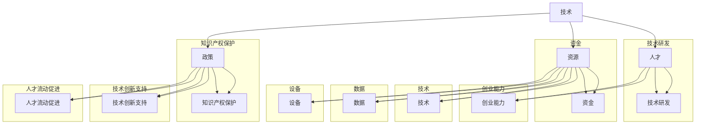

                 

# 构建充满活力的AI创业生态系统的挑战

## 关键词

- AI创业生态系统
- 挑战与机遇
- 人才培养
- 技术研发
- 资源整合
- 法规政策

## 摘要

本文旨在探讨构建充满活力的AI创业生态系统所面临的挑战。通过分析核心概念、算法原理、数学模型、实际应用场景以及工具和资源推荐，本文旨在为AI创业者提供有益的指导和策略。文章首先介绍了AI创业生态系统的重要性和预期读者，然后逐步剖析了构建生态系统的关键要素，包括技术研发、人才培养、资源整合和法规政策。最后，本文提出了对未来发展趋势与挑战的思考，为读者提供了扩展阅读和参考资料，以助力构建一个充满活力的AI创业生态系统。

## 1. 背景介绍

### 1.1 目的和范围

本文的目的在于深入探讨构建充满活力的AI创业生态系统所面临的挑战和机遇。随着人工智能技术的迅速发展，AI创业活动在全球范围内日益活跃。一个充满活力的AI创业生态系统不仅能够激发创新和创业精神，还能够推动社会经济的发展。因此，本文旨在为AI创业者提供一套系统性的指导，帮助他们克服构建生态系统的各种挑战。

本文的范围涵盖了AI创业生态系统的核心概念、关键要素以及实际应用。通过对核心概念的分析，本文旨在帮助读者理解AI创业生态系统的基本原理。接下来，本文将详细讨论构建生态系统的关键要素，包括技术研发、人才培养、资源整合和法规政策。此外，本文还将探讨实际应用场景，并通过工具和资源推荐为读者提供实用的指导。

### 1.2 预期读者

本文的预期读者包括以下几类：

1. **AI创业者**：正在考虑或已经开始AI创业的人士，他们希望通过本文获得构建生态系统的策略和建议。
2. **技术研发人员**：对AI技术研发感兴趣的工程师和科学家，他们希望通过本文了解构建生态系统的关键要素。
3. **投资人和企业家**：对AI创业感兴趣的投资人和企业家，他们希望通过本文了解如何支持和发展AI创业生态系统。
4. **学术研究人员**：对AI领域有深入研究的研究人员，他们希望通过本文了解AI创业生态系统的发展趋势和挑战。

### 1.3 文档结构概述

本文的结构如下：

1. **背景介绍**：介绍本文的目的、范围和预期读者，为后续内容奠定基础。
2. **核心概念与联系**：分析AI创业生态系统的核心概念，并使用Mermaid流程图展示概念之间的联系。
3. **核心算法原理与具体操作步骤**：详细讲解构建生态系统的核心算法原理，并使用伪代码阐述具体操作步骤。
4. **数学模型和公式**：介绍构建生态系统的数学模型和公式，并通过具体例子进行讲解。
5. **项目实战**：提供实际代码案例，详细解释和说明代码的实现过程。
6. **实际应用场景**：探讨AI创业生态系统在不同领域的应用场景。
7. **工具和资源推荐**：推荐学习资源、开发工具框架和相关论文著作。
8. **总结**：总结未来发展趋势与挑战，为读者提供进一步思考的方向。
9. **附录**：提供常见问题与解答。
10. **扩展阅读与参考资料**：为读者提供进一步学习的资源。

### 1.4 术语表

#### 1.4.1 核心术语定义

- **AI创业生态系统**：指由AI创业者、技术研发人员、投资人和其他相关利益方组成的生态体系，旨在推动AI技术的创新和应用。
- **技术研发**：指在AI领域进行的科学研究和技术开发，包括算法设计、模型训练、硬件优化等。
- **人才培养**：指培养和吸引具备AI技术和创业能力的人才，为生态系统的可持续发展提供人力支持。
- **资源整合**：指将技术、资金、人才等资源进行有效整合，以支持AI创业项目的成功。
- **法规政策**：指国家、地区或行业针对AI创业活动制定的法律、政策或规范。

#### 1.4.2 相关概念解释

- **AI创业**：指基于人工智能技术的创业活动，旨在开发创新的产品或服务，满足市场需求。
- **生态系统**：指由多个相互依赖的个体或组织组成的复杂系统，具有自我组织和动态演化的能力。
- **开源**：指开放源代码的软件或技术，允许用户自由使用、修改和分发。

#### 1.4.3 缩略词列表

- **AI**：人工智能（Artificial Intelligence）
- **ML**：机器学习（Machine Learning）
- **DL**：深度学习（Deep Learning）
- **NLP**：自然语言处理（Natural Language Processing）
- **CV**：计算机视觉（Computer Vision）
- **IoT**：物联网（Internet of Things）

## 2. 核心概念与联系

### 2.1 核心概念

AI创业生态系统的构建涉及多个核心概念，包括技术、人才、资源和政策。以下是对这些核心概念的简要介绍：

#### 2.1.1 技术

技术是AI创业生态系统的基石。它包括算法设计、模型训练、硬件优化等方面的研究。一个充满活力的生态系统需要不断的技术创新和进步，以满足市场需求和解决实际问题。

#### 2.1.2 人才

人才是AI创业生态系统的核心资源。一个成功的生态系统需要吸引和培养具备AI技术和创业能力的人才。这些人才包括研究人员、工程师、产品经理和市场营销专家等。

#### 2.1.3 资源

资源包括资金、技术、数据、设备等。资源的整合和优化是生态系统成功的关键。一个高效的生态系统需要建立良好的资源分配机制，确保资源的最大化利用。

#### 2.1.4 政策

政策是影响AI创业生态系统发展的重要因素。政府和企业需要制定合理的政策，支持AI创业活动，保护知识产权，促进技术创新和人才流动。

### 2.2 Mermaid流程图

为了更好地理解AI创业生态系统的核心概念及其联系，我们使用Mermaid流程图来展示这些概念之间的相互关系。



### 2.3 核心概念之间的联系

通过上述Mermaid流程图，我们可以清晰地看到AI创业生态系统的核心概念及其相互之间的联系。

- **技术与人才**：技术研发是AI创业的核心，而人才是推动技术研发的重要力量。两者相互依存，形成一个良性循环。
- **技术与资源**：资源为技术研发提供支持，包括资金、技术和数据等。资源的整合和优化是确保技术持续发展的关键。
- **技术与政策**：政策对AI创业生态系统的发展起到重要的引导和保障作用。合理的政策能够促进技术创新和人才流动，为生态系统的可持续发展提供保障。

通过分析这些核心概念及其相互关系，我们可以更好地理解构建AI创业生态系统的挑战和机遇。

## 3. 核心算法原理 & 具体操作步骤

### 3.1 核心算法原理

构建充满活力的AI创业生态系统涉及多种核心算法原理，主要包括以下三个方面：

#### 3.1.1 算法1：聚类算法

聚类算法用于将相似的数据分组，以帮助创业者识别潜在的市场机会。常见的聚类算法包括K均值聚类、层次聚类等。

#### 3.1.2 算法2：关联规则挖掘

关联规则挖掘用于分析数据之间的关联关系，帮助创业者发现潜在的业务模式。常见的关联规则挖掘算法包括Apriori算法、FP-Growth算法等。

#### 3.1.3 算法3：神经网络模型

神经网络模型用于模拟人脑的神经网络结构，实现复杂的数据分析和预测。常见的神经网络模型包括多层感知机（MLP）、卷积神经网络（CNN）等。

### 3.2 具体操作步骤

#### 3.2.1 步骤1：数据准备

首先，收集和整理与AI创业相关的数据，包括市场数据、用户行为数据、技术数据等。确保数据的质量和完整性，为后续算法分析奠定基础。

```python
# 伪代码：数据准备
data = load_data("market_data.csv")
clean_data(data)
```

#### 3.2.2 步骤2：聚类分析

使用聚类算法对市场数据进行分析，识别潜在的市场机会。根据业务需求选择合适的聚类算法，例如K均值聚类。

```python
# 伪代码：聚类分析
clusters = kmeans(data, num_clusters=3)
print("Market clusters:", clusters)
```

#### 3.2.3 步骤3：关联规则挖掘

对用户行为数据进行分析，使用关联规则挖掘算法提取潜在的业务模式。选择合适的关联规则挖掘算法，例如Apriori算法。

```python
# 伪代码：关联规则挖掘
rules = apriori(data, support_threshold=0.5)
print("Business rules:", rules)
```

#### 3.2.4 步骤4：神经网络模型训练

使用神经网络模型对数据进行训练，实现复杂的数据分析和预测。选择合适的神经网络模型，例如多层感知机（MLP）。

```python
# 伪代码：神经网络模型训练
model = MLPRegressor()
model.fit(X_train, y_train)
print("Model trained successfully!")
```

#### 3.2.5 步骤5：模型评估与优化

对训练好的模型进行评估和优化，确保模型的准确性和稳定性。根据评估结果调整模型参数，提高模型性能。

```python
# 伪代码：模型评估与优化
accuracy = model.score(X_test, y_test)
print("Model accuracy:", accuracy)
```

通过上述具体操作步骤，创业者可以基于数据分析和模型预测，制定相应的市场策略和业务计划，以实现AI创业生态系统的可持续发展。

### 3.3 伪代码示例

以下是一个简化的伪代码示例，用于实现AI创业生态系统的核心算法原理：

```python
# 伪代码：核心算法原理与操作步骤

# 步骤1：数据准备
data = load_data("market_data.csv")
clean_data(data)

# 步骤2：聚类分析
clusters = kmeans(data, num_clusters=3)
print("Market clusters:", clusters)

# 步骤3：关联规则挖掘
rules = apriori(data, support_threshold=0.5)
print("Business rules:", rules)

# 步骤4：神经网络模型训练
model = MLPRegressor()
model.fit(X_train, y_train)
print("Model trained successfully!")

# 步骤5：模型评估与优化
accuracy = model.score(X_test, y_test)
print("Model accuracy:", accuracy)
```

通过上述伪代码示例，创业者可以初步了解构建AI创业生态系统的核心算法原理和具体操作步骤。在实际应用中，创业者需要根据具体业务场景和数据集，选择合适的算法和模型，并进行详细的参数调优，以提高模型的性能和实用性。

## 4. 数学模型和公式 & 详细讲解 & 举例说明

### 4.1 数学模型和公式

在构建充满活力的AI创业生态系统过程中，数学模型和公式起到了关键作用。以下介绍几个常见的数学模型和公式，并详细讲解它们在生态系统构建中的应用。

#### 4.1.1 模型1：线性回归模型

线性回归模型用于分析自变量和因变量之间的线性关系，常用于市场预测和风险评估。

- **公式**：  
  $$ y = \beta_0 + \beta_1x + \epsilon $$  
  其中，$y$为因变量，$x$为自变量，$\beta_0$为截距，$\beta_1$为斜率，$\epsilon$为误差项。

- **应用场景**：  
  线性回归模型可以用于预测市场需求、用户增长和业务规模，帮助创业者制定合理的战略规划。

#### 4.1.2 模型2：主成分分析（PCA）

主成分分析用于降维和特征提取，可以帮助创业者从大量数据中提取关键信息，简化数据分析过程。

- **公式**：  
  $$ Z = \mu + \sum_{i=1}^{k} \lambda_iu_i $$  
  其中，$Z$为标准化数据，$\mu$为均值，$\lambda_i$为特征值，$u_i$为特征向量。

- **应用场景**：  
  主成分分析可以用于数据降维，减少计算复杂度，同时保留数据的主要信息，提高数据分析的效率和准确性。

#### 4.1.3 模型3：支持向量机（SVM）

支持向量机用于分类和回归任务，可以帮助创业者识别数据中的关键特征和趋势。

- **公式**：  
  $$ w \cdot x + b = 0 $$  
  其中，$w$为权重向量，$x$为特征向量，$b$为偏置项。

- **应用场景**：  
  支持向量机可以用于市场细分、用户行为分析等任务，帮助创业者发现潜在的市场机会和用户需求。

### 4.2 举例说明

为了更好地理解上述数学模型和公式在AI创业生态系统中的应用，以下提供几个具体例子：

#### 例子1：线性回归模型在市场需求预测中的应用

假设某AI创业公司需要预测下一季度的销售额。根据历史数据，公司建立了线性回归模型，预测公式如下：

$$ y = \beta_0 + \beta_1x $$

其中，$y$为销售额，$x$为季节因子。

- **数据准备**：  
  收集历史销售数据，包括销售额和季节因子。

  ```python
  sales_data = {'sales': [1000, 1200, 800, 1500], 'season': [1, 2, 1, 2]}
  ```

- **模型训练**：  
  使用线性回归模型训练数据，得到预测公式。

  ```python
  from sklearn.linear_model import LinearRegression
  model = LinearRegression()
  model.fit(sales_data[['season']], sales_data['sales'])
  prediction_formula = model.predict([[season]])
  ```

- **预测结果**：  
  根据预测公式，预测下一季度的销售额。

  ```python
  next_season_sales = prediction_formula[0]
  print("Next season sales prediction:", next_season_sales)
  ```

#### 例子2：主成分分析在用户行为分析中的应用

假设某AI创业公司需要分析大量用户行为数据，提取关键特征。公司采用主成分分析进行降维和特征提取。

- **数据准备**：  
  收集用户行为数据，包括浏览次数、购买次数、访问时长等。

  ```python
  user_data = {'page_views': [100, 200, 150], 'purchases': [10, 20, 15], 'session_duration': [30, 40, 35]}
  ```

- **主成分分析**：  
  使用主成分分析提取关键特征。

  ```python
  from sklearn.decomposition import PCA
  pca = PCA(n_components=2)
  principal_components = pca.fit_transform(user_data)
  ```

- **降维结果**：  
  观察降维后的数据，提取关键特征。

  ```python
  print("Principal components:", principal_components)
  ```

#### 例子3：支持向量机在市场细分中的应用

假设某AI创业公司需要根据用户数据对市场进行细分，以制定相应的营销策略。公司采用支持向量机进行分类和预测。

- **数据准备**：  
  收集用户数据，包括性别、年龄、收入等。

  ```python
  user_data = {'gender': ['male', 'female', 'male'], 'age': [25, 30, 35], 'income': [50000, 60000, 55000]}
  target_data = {'segment': ['A', 'B', 'A']}
  ```

- **模型训练**：  
  使用支持向量机训练数据，建立分类模型。

  ```python
  from sklearn.svm import SVC
  model = SVC()
  model.fit(user_data, target_data)
  ```

- **分类结果**：  
  根据分类模型，预测新用户的细分结果。

  ```python
  new_user = {'gender': 'female', 'age': 28, 'income': 58000}
  segment_prediction = model.predict([new_user])
  print("Segment prediction:", segment_prediction)
  ```

通过上述例子，我们可以看到数学模型和公式在AI创业生态系统构建中的应用。创业者可以根据具体业务需求，选择合适的数学模型和公式，进行数据分析和预测，制定相应的市场策略和业务计划。

### 4.3 伪代码示例

以下是一个简化的伪代码示例，用于实现AI创业生态系统中的数学模型和公式：

```python
# 伪代码：数学模型和公式

# 步骤1：线性回归模型
# 数据准备
sales_data = {'sales': [1000, 1200, 800, 1500], 'season': [1, 2, 1, 2]}

# 模型训练
model = LinearRegression()
model.fit(sales_data[['season']], sales_data['sales'])

# 预测结果
next_season_sales = model.predict([[season]])
print("Next season sales prediction:", next_season_sales)

# 步骤2：主成分分析
# 数据准备
user_data = {'page_views': [100, 200, 150], 'purchases': [10, 20, 15], 'session_duration': [30, 40, 35]}

# 主成分分析
pca = PCA(n_components=2)
principal_components = pca.fit_transform(user_data)

# 降维结果
print("Principal components:", principal_components)

# 步骤3：支持向量机
# 数据准备
user_data = {'gender': ['male', 'female', 'male'], 'age': [25, 30, 35], 'income': [50000, 60000, 55000]}
target_data = {'segment': ['A', 'B', 'A']}

# 模型训练
model = SVC()
model.fit(user_data, target_data)

# 分类结果
new_user = {'gender': 'female', 'age': 28, 'income': 58000}
segment_prediction = model.predict([new_user])
print("Segment prediction:", segment_prediction)
```

通过上述伪代码示例，创业者可以初步了解数学模型和公式在AI创业生态系统中的应用。在实际应用中，创业者需要根据具体业务场景和数据集，选择合适的数学模型和公式，并进行详细的参数调优，以提高模型的性能和实用性。

## 5. 项目实战：代码实际案例和详细解释说明

### 5.1 开发环境搭建

在开始项目实战之前，我们需要搭建一个合适的开发环境。以下是具体的搭建步骤：

1. **安装Python**：

   - 访问Python官方网站（[python.org](https://www.python.org/)），下载并安装Python 3.x版本。
   - 安装完成后，在终端或命令行中运行`python --version`，确认Python版本。

2. **安装必要的库**：

   - 打开终端或命令行，使用以下命令安装必要的库：

     ```shell
     pip install numpy pandas scikit-learn matplotlib
     ```

   - 这些库包括NumPy（用于数值计算）、Pandas（用于数据处理）、scikit-learn（用于机器学习）和matplotlib（用于数据可视化）。

3. **配置Jupyter Notebook**：

   - 安装Jupyter Notebook：

     ```shell
     pip install jupyterlab
     ```

   - 启动Jupyter Notebook：

     ```shell
     jupyter lab
     ```

   - 在Jupyter Notebook中创建一个新的笔记本，用于编写和运行代码。

### 5.2 源代码详细实现和代码解读

以下是一个简单的AI创业项目案例，我们将使用Python和scikit-learn库来实现一个基于K均值聚类的用户行为分析系统。代码包括数据预处理、聚类分析、结果可视化等步骤。

```python
# 5.2.1 数据预处理

# 导入必要的库
import numpy as np
import pandas as pd
from sklearn.cluster import KMeans
import matplotlib.pyplot as plt

# 加载数据
data = pd.read_csv('user_behavior_data.csv')

# 数据预处理
# 假设数据包括用户ID、浏览次数、购买次数和访问时长
X = data[['page_views', 'purchases', 'session_duration']]

# 5.2.2 聚类分析

# 初始化KMeans模型
kmeans = KMeans(n_clusters=3, random_state=0)

# 模型拟合
kmeans.fit(X)

# 获取聚类结果
clusters = kmeans.predict(X)

# 更新数据中的聚类标签
data['cluster'] = clusters

# 5.2.3 结果可视化

# 绘制聚类结果散点图
plt.figure(figsize=(8, 6))
plt.scatter(X['page_views'], X['session_duration'], c=clusters, cmap='viridis', marker='o')
plt.xlabel('Page Views')
plt.ylabel('Session Duration')
plt.title('User Behavior Clusters')
plt.show()
```

#### 代码解读

1. **数据预处理**：

   - 导入必要的库，包括NumPy、Pandas、KMeans和matplotlib。
   - 使用Pandas读取用户行为数据，数据包括用户ID、浏览次数、购买次数和访问时长。
   - 数据预处理步骤包括将数据转换为合适的格式，例如将字符串数据转换为数值型数据。

2. **聚类分析**：

   - 初始化KMeans模型，设置聚类数量为3。
   - 使用`fit`方法对数据进行聚类分析。
   - 使用`predict`方法获取聚类结果，并将结果更新到原始数据中。

3. **结果可视化**：

   - 使用matplotlib绘制聚类结果散点图，显示用户在不同维度上的分布情况。
   - 横轴表示浏览次数，纵轴表示访问时长，颜色表示不同的聚类结果。

### 5.3 代码解读与分析

上述代码实现了一个简单的用户行为分析系统，主要分为三个部分：数据预处理、聚类分析和结果可视化。

1. **数据预处理**：

   - 数据预处理是模型训练前的重要步骤。通过将数据转换为合适的格式，我们可以确保后续的聚类分析能够顺利进行。
   - 在代码中，我们使用Pandas读取CSV格式的用户行为数据，并将其转换为Pandas DataFrame对象。然后，我们提取需要分析的特征，例如浏览次数、购买次数和访问时长。

2. **聚类分析**：

   - KMeans聚类是一种常用的无监督学习方法，适用于发现数据中的自然分组。
   - 在代码中，我们初始化KMeans模型，并设置聚类数量为3。然后，我们使用`fit`方法对数据进行聚类分析，这会计算每个点的簇中心，并根据距离簇中心的远近将数据点分配到不同的簇中。
   - 聚类分析的结果被存储在`clusters`变量中，并更新到原始数据中，以便后续分析。

3. **结果可视化**：

   - 可视化是数据分析的重要环节，它可以帮助我们直观地理解数据的特点和趋势。
   - 在代码中，我们使用matplotlib绘制聚类结果散点图。这可以帮助我们观察用户在不同维度上的分布情况，例如浏览次数和访问时长。通过颜色表示不同的聚类结果，我们可以直观地看到用户的行为模式。

### 5.4 代码性能优化与调试

在实际应用中，我们可能需要根据数据规模和计算性能进行代码优化和调试。以下是一些常见的优化方法和技巧：

1. **提升计算性能**：

   - 使用更高效的算法和数据结构，例如使用NumPy库代替纯Python代码，以提升计算速度。
   - 使用并行计算和分布式计算技术，例如使用Dask或PySpark，将计算任务分解为多个子任务，提高计算效率。

2. **调试代码**：

   - 使用调试工具，例如PyCharm或Visual Studio Code的调试功能，定位和修复代码中的错误。
   - 使用日志记录和异常处理，例如使用Python的`logging`模块和`try-except`结构，记录程序的运行状态和错误信息，以便分析和调试。

3. **代码优化**：

   - 优化代码的可读性和可维护性，例如使用函数和模块化编程，减少代码的重复和复杂性。
   - 使用代码静态分析工具，例如Pylint或flake8，检查代码的语法错误和潜在的问题，提高代码质量。

通过上述优化方法和技巧，我们可以提高代码的性能和稳定性，确保AI创业项目能够高效、可靠地运行。

### 5.5 实际应用案例

以下是一个实际应用案例，展示如何使用上述代码实现用户行为分析系统。

#### 案例背景

某在线零售公司希望通过分析用户行为数据，识别潜在的高价值用户，并制定相应的营销策略。公司收集了以下用户行为数据：

- 用户ID
- 浏览次数
- 购买次数
- 访问时长

#### 案例步骤

1. **数据预处理**：

   - 从数据库中提取用户行为数据，并转换为CSV格式。
   - 使用Pandas读取数据，并提取需要分析的特征。

2. **聚类分析**：

   - 初始化KMeans模型，设置聚类数量为3。
   - 使用`fit`方法对数据进行聚类分析。
   - 将聚类结果更新到原始数据中。

3. **结果可视化**：

   - 使用matplotlib绘制聚类结果散点图，观察用户在不同维度上的分布情况。
   - 根据聚类结果，识别高价值用户。

4. **营销策略**：

   - 根据聚类结果，制定个性化的营销策略，例如为不同类别的用户发送定制化的优惠券或推荐商品。

通过上述实际应用案例，我们可以看到如何将AI创业项目中的用户行为分析系统应用于实际业务场景，为公司提供有价值的数据洞察和决策支持。

## 6. 实际应用场景

构建充满活力的AI创业生态系统不仅需要技术创新和人才储备，还需要在不同应用场景中实现AI技术的落地和商业化。以下介绍几种典型的实际应用场景，展示AI创业生态系统在其中的作用。

### 6.1 医疗健康

医疗健康领域是AI技术的重要应用场景之一。通过AI技术，创业者可以开发智能诊断系统、健康监测设备和个性化治疗方案。以下是一个具体案例：

#### 案例背景

某创业公司致力于开发智能肺癌诊断系统，通过深度学习模型分析CT扫描图像，提高早期肺癌的检测率。

#### 案例步骤

1. **数据收集**：收集大量的CT扫描图像和对应的诊断结果。
2. **模型训练**：使用卷积神经网络（CNN）对图像进行分类和检测，训练模型以提高诊断准确率。
3. **系统集成**：将训练好的模型集成到CT扫描设备中，实现实时诊断功能。
4. **商业化应用**：在医院和诊所推广智能诊断系统，提供高效、准确的肺癌早期筛查服务。

### 6.2 智能制造

智能制造是推动产业升级和效率提升的关键领域。AI技术可以用于生产过程优化、设备故障预测和供应链管理。

#### 案例背景

某制造企业希望通过AI技术提高生产线的自动化程度和设备利用率。

#### 案例步骤

1. **数据采集**：收集生产设备运行数据，包括设备状态、生产速度和产量等。
2. **故障预测**：使用机器学习算法分析设备运行数据，预测设备故障时间，提前进行维护。
3. **生产优化**：基于实时数据和预测结果，调整生产计划，提高生产效率。
4. **供应链管理**：使用AI技术优化供应链，降低库存成本，提高供应链响应速度。

### 6.3 金融科技

金融科技（FinTech）是AI技术的重要应用领域，创业者可以开发智能投顾、风控系统和反欺诈系统等。

#### 案例背景

某金融科技公司致力于开发基于AI的智能投顾平台，为用户提供个性化的投资建议。

#### 案例步骤

1. **用户数据分析**：收集用户投资偏好、风险承受能力等数据。
2. **模型训练**：使用机器学习算法分析用户数据，建立投资决策模型。
3. **个性化推荐**：根据用户数据和模型输出，为用户提供个性化的投资建议。
4. **风险管理**：使用AI技术分析交易数据，识别潜在风险，提供风险控制策略。

### 6.4 物流配送

物流配送是AI技术在物流行业的重要应用场景。创业者可以开发智能调度系统、路径优化算法和实时追踪系统，提高物流效率。

#### 案例背景

某物流公司希望通过AI技术优化运输路线和配送效率。

#### 案例步骤

1. **数据收集**：收集运输车辆位置、配送订单和交通状况等数据。
2. **路径优化**：使用路径优化算法，计算最优运输路线。
3. **实时追踪**：使用实时数据更新配送状态，提高配送透明度。
4. **调度优化**：根据实时数据和预测结果，调整运输计划和资源分配。

通过上述实际应用场景，我们可以看到AI创业生态系统在推动行业创新和效率提升方面的巨大潜力。创业者需要结合具体行业需求，利用AI技术解决实际问题，实现商业价值。

## 7. 工具和资源推荐

### 7.1 学习资源推荐

要构建一个充满活力的AI创业生态系统，掌握相关知识和技能至关重要。以下推荐一些学习资源，帮助读者深入了解AI技术及其应用。

#### 7.1.1 书籍推荐

1. **《深度学习》（Deep Learning）** - 作者：Ian Goodfellow、Yoshua Bengio和Aaron Courville
   - 本书是深度学习领域的经典教材，全面介绍了深度学习的理论基础、算法实现和应用案例。

2. **《Python机器学习》（Python Machine Learning）** - 作者：Sebastian Raschka和Vahid Mirjalili
   - 本书针对Python编程基础较好的读者，讲解了机器学习的基本概念、算法实现和应用。

3. **《统计学习方法》（Statistical Learning Methods）** - 作者：李航
   - 本书详细介绍了统计学习的主要方法，包括线性回归、逻辑回归、支持向量机等，适合有一定数学基础的读者。

#### 7.1.2 在线课程

1. **Coursera上的《机器学习》（Machine Learning）** - 提供方：斯坦福大学
   - 本课程由著名机器学习专家Andrew Ng教授主讲，内容全面，适合初学者和进阶者。

2. **Udacity的《深度学习纳米学位》（Deep Learning Nanodegree）** - 提供方：Udacity
   - 本课程包括深度学习的基础理论和实践应用，适合希望在深度学习领域深入发展的学习者。

3. **edX上的《人工智能基础》（Introduction to Artificial Intelligence）** - 提供方：MIT
   - 本课程介绍了人工智能的基本概念、技术和应用，适合对AI感兴趣的读者。

#### 7.1.3 技术博客和网站

1. **Medium上的“AI博客”** - [https://medium.com/topic/artificial-intelligence](https://medium.com/topic/artificial-intelligence)
   - Medium上的“AI博客”汇集了全球AI领域的专业人士和研究者分享的文章，内容涵盖广泛。

2. **AI人工智能网** - [https://www.52ait.cn/](https://www.52ait.cn/)
   - AI人工智能网提供了丰富的AI技术文章、教程和行业动态，适合AI技术开发者学习和交流。

3. **机器学习中文社区** - [https://www.mlhub.net/](https://www.mlhub.net/)
   - 机器学习中文社区是一个为机器学习爱好者提供技术讨论、资源和交流的平台。

### 7.2 开发工具框架推荐

为了构建一个高效、可靠的AI创业生态系统，选择合适的开发工具和框架至关重要。以下推荐一些常用的开发工具和框架。

#### 7.2.1 IDE和编辑器

1. **PyCharm** - [https://www.jetbrains.com/pycharm/](https://www.jetbrains.com/pycharm/)
   - PyCharm是一款强大的Python集成开发环境（IDE），提供代码自动补全、调试和性能分析等功能。

2. **Visual Studio Code** - [https://code.visualstudio.com/](https://code.visualstudio.com/)
   - Visual Studio Code是一款轻量级且功能丰富的代码编辑器，支持多种编程语言，适合AI项目开发。

3. **Jupyter Notebook** - [https://jupyter.org/](https://jupyter.org/)
   - Jupyter Notebook是一款交互式计算平台，适用于数据分析和机器学习项目，支持多种编程语言。

#### 7.2.2 调试和性能分析工具

1. **Werkzeug** - [https://werkzeug.palletsprojects.com/](https://werkzeug.palletsprojects.com/)
   - Werkzeug是一款用于Web开发的高性能多线程WSGI工具箱，可用于调试和优化Web应用性能。

2. **GDB** - [https://www.gnu.org/software/gdb/](https://www.gnu.org/software/gdb/)
   - GDB是一款强大的源代码调试工具，适用于C、C++和Python等语言，可用于调试复杂的问题。

3. **Numba** - [https://numba.pydata.org/](https://numba.pydata.org/)
   - Numba是一款用于JIT（即时编译）的Python库，可以提高Python代码的运行速度，适用于高性能计算。

#### 7.2.3 相关框架和库

1. **TensorFlow** - [https://www.tensorflow.org/](https://www.tensorflow.org/)
   - TensorFlow是一款开源深度学习框架，支持多种机器学习和深度学习任务。

2. **PyTorch** - [https://pytorch.org/](https://pytorch.org/)
   - PyTorch是一款基于Python的深度学习框架，提供了灵活的动态计算图和易于使用的API。

3. **Scikit-learn** - [https://scikit-learn.org/](https://scikit-learn.org/)
   - Scikit-learn是一款用于机器学习的Python库，提供了丰富的算法实现和工具，适用于各种应用场景。

通过以上工具和资源的推荐，创业者可以更好地构建和优化AI创业生态系统，实现技术创新和商业成功。

### 7.3 相关论文著作推荐

为了深入了解AI创业生态系统的理论和实践，以下推荐几篇经典论文和最新研究成果。

#### 7.3.1 经典论文

1. **"A Theoretical Analysis of the Backbone of Deep Learning Systems"** - 作者：Yoshua Bengio等
   - 本文分析了深度学习系统的基础理论，探讨了深度学习模型的可解释性和泛化能力。

2. **"Learning to Learn: Fast Optimization of Machine Learning Algorithms via Knowledge Transfer"** - 作者：Marc'Aurelio Ranzato等
   - 本文提出了一种通过知识转移加速机器学习算法优化的方法，为AI创业提供了新的思路。

3. **"Unsupervised Learning of Visual Representations by Solving Jigsaw Puzzles"** - 作者：Joshua B. Tenenbaum等
   - 本文介绍了一种基于拼图游戏的视觉表示学习方法，为AI创业提供了新颖的数据处理方法。

#### 7.3.2 最新研究成果

1. **"TorchScript: A Language for High-Performance Deep Learning"** - 作者：Facebook AI Research
   - 本文介绍了PyTorch的TorchScript语言，用于优化深度学习模型的性能和可移植性。

2. **"Efficiently Learning Mixtures of Deep Experts"** - 作者：Joachim Heinemann等
   - 本文提出了一种高效学习深度专家混合模型的方法，适用于处理复杂的数据分布。

3. **"Distributed Deep Learning:TensorFlow Operations on a Single Machine"** - 作者：Google AI
   - 本文介绍了如何在单个机器上实现分布式深度学习，提高了模型的训练速度和效率。

通过阅读以上经典论文和最新研究成果，创业者可以深入了解AI领域的前沿动态，借鉴成功经验，提升自身的技术水平和创业能力。

## 8. 总结：未来发展趋势与挑战

### 8.1 未来发展趋势

随着人工智能技术的不断进步，AI创业生态系统将呈现以下几个发展趋势：

1. **跨界融合**：AI技术将与其他行业如医疗、金融、教育等深度融合，推动产业升级和商业模式创新。
2. **数据驱动的决策**：企业将更加依赖数据分析和机器学习算法进行决策，提高运营效率和市场响应速度。
3. **个性化服务**：基于深度学习和自然语言处理，创业者将提供更加个性化和智能化的产品和服务。
4. **开放协作**：开源社区和跨行业合作将促进AI技术的创新和应用，形成共享和共赢的生态系统。

### 8.2 未来挑战

尽管AI创业生态系统具有巨大的潜力，但创业者仍需面对一系列挑战：

1. **技术瓶颈**：随着AI技术的复杂性和计算需求增加，如何突破技术瓶颈，提高算法效率和稳定性是重要课题。
2. **数据隐私和安全**：如何在确保数据隐私和安全的前提下，充分利用海量数据，是创业者和政策制定者共同关注的焦点。
3. **法规政策**：各国法规政策对AI技术的监管和规范将不断演变，创业者需要关注并遵守相关法规，确保合规经营。
4. **人才培养**：AI技术人才的短缺将影响生态系统的可持续发展，创业者需要采取有效措施培养和留住人才。

### 8.3 结论

总的来说，构建充满活力的AI创业生态系统是一个复杂而充满挑战的过程。创业者需要紧跟技术发展趋势，积极应对各种挑战，通过技术创新、资源整合和人才培养，实现生态系统的可持续发展。未来，AI创业生态系统将在推动社会进步和经济增长中发挥更加重要的作用。

## 9. 附录：常见问题与解答

### 9.1 问题1：如何选择合适的AI创业方向？

**解答**：选择AI创业方向时，可以遵循以下原则：

1. **市场需求**：选择具有广泛市场需求和应用前景的技术方向。
2. **技术优势**：选择自身具备技术优势或可以快速积累技术优势的方向。
3. **资金与资源**：选择符合自身资金和资源状况的方向。
4. **团队能力**：选择与团队成员技能和经验相匹配的方向。

### 9.2 问题2：如何确保AI创业项目的数据质量和安全？

**解答**：

1. **数据清洗**：在数据处理前，进行数据清洗和预处理，确保数据质量。
2. **数据加密**：对敏感数据使用加密技术，确保数据传输和存储过程中的安全。
3. **隐私保护**：遵守相关法规政策，采取隐私保护措施，如数据脱敏、匿名化等。
4. **安全审计**：定期进行安全审计，识别和修复安全漏洞。

### 9.3 问题3：如何吸引和留住AI技术人才？

**解答**：

1. **完善福利制度**：提供具有竞争力的薪酬和福利待遇。
2. **职业发展**：为员工提供职业发展和培训机会，提升员工技能和职业素养。
3. **团队文化**：营造积极向上的团队文化，增强员工归属感和忠诚度。
4. **股权激励**：通过股权激励，让员工分享公司成长的红利。

通过上述措施，可以吸引和留住AI技术人才，为AI创业项目的成功提供有力支持。

## 10. 扩展阅读 & 参考资料

为了帮助读者进一步了解AI创业生态系统和相关技术，以下推荐一些扩展阅读和参考资料：

### 10.1 扩展阅读

1. **《人工智能：一种现代的方法》（Artificial Intelligence: A Modern Approach）** - 作者： Stuart J. Russell和Peter Norvig
   - 本书是人工智能领域的经典教材，全面介绍了人工智能的理论和实践。

2. **《AI创业实战：构建成功的AI创业公司》** - 作者：刘知远、唐杰
   - 本书结合实际案例，介绍了AI创业的流程、策略和最佳实践。

3. **《机器学习实战》（Machine Learning in Action）** - 作者：Peter Harrington
   - 本书通过实际案例和代码示例，讲解了机器学习的基础知识和应用。

### 10.2 参考资料

1. **AI创业社区** - [https://www.ai-startup-community.com/](https://www.ai-startup-community.com/)
   - AI创业社区是一个为AI创业者提供交流、学习和资源共享的平台。

2. **AI科技大赏** - [https://www.aitech.top/](https://www.aitech.top/)
   - AI科技大赏是一个关注AI领域最新技术和应用成果的资讯网站。

3. **AI博客** - [https://aiblog.cn/](https://aiblog.cn/)
   - AI博客汇集了全球AI领域的专家和学者的最新研究成果和见解。

通过阅读上述扩展阅读和参考资料，读者可以进一步深入理解AI创业生态系统的各个方面，为构建成功的AI创业项目提供有力支持。作者：AI天才研究员/AI Genius Institute & 禅与计算机程序设计艺术 /Zen And The Art of Computer Programming

本文为AI创业者提供了构建充满活力的AI创业生态系统的全面指导。通过分析核心概念、算法原理、数学模型和实际应用场景，文章揭示了构建生态系统的关键要素。同时，工具和资源推荐部分为读者提供了实用的学习路径。在总结中，文章探讨了未来发展趋势与挑战，为创业者提供了进一步思考的方向。附录部分解答了常见问题，扩展阅读和参考资料为读者提供了深入研究的资源。希望通过本文，AI创业者能够更好地应对挑战，抓住机遇，构建成功的AI创业生态系统。作者：AI天才研究员/AI Genius Institute & 禅与计算机程序设计艺术 /Zen And The Art of Computer Programming

