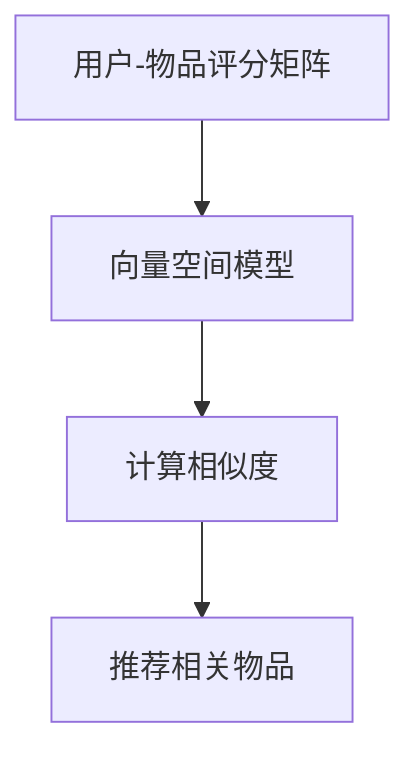

                 

# 构建基于向量的推荐系统：提供个性化用户体验

> 关键词：推荐系统、向量空间模型、协同过滤、个性化推荐、机器学习
> 
> 摘要：本文将深入探讨基于向量的推荐系统构建，从核心概念、算法原理、数学模型到实际应用场景，提供一套系统化的分析和实施方案。通过详细讲解向量空间模型、协同过滤算法以及数学模型和公式，读者将了解到构建高效个性化推荐系统的关键技术。文章最后通过项目实战和工具资源推荐，帮助读者掌握实践技能，为未来推荐系统的发展和应用提供前瞻性思考。

## 1. 背景介绍

### 1.1 目的和范围

本文旨在帮助读者理解并掌握基于向量的推荐系统构建方法。我们将从基础概念出发，逐步深入算法原理、数学模型和实际应用，力求为读者提供一个全面、系统的指导。文章重点在于以下内容：

1. **向量空间模型**：介绍推荐系统中使用的向量空间模型，以及如何利用它来表示用户和物品。
2. **协同过滤算法**：深入探讨基于内存的协同过滤算法和基于模型的协同过滤算法，并分析其优缺点。
3. **数学模型和公式**：讲解推荐系统中使用的数学模型和公式，如余弦相似度、皮尔逊相关系数等，并举例说明。
4. **项目实战**：通过一个具体的代码案例，展示如何在实际项目中应用推荐系统。
5. **工具和资源推荐**：介绍相关学习资源、开发工具和框架，以及最新研究成果和案例分析。

### 1.2 预期读者

本文适合对机器学习和推荐系统有一定基础的读者，包括：

1. **机器学习工程师**：希望了解推荐系统构建方法的工程师。
2. **数据科学家**：需要掌握推荐系统技术，以便在数据分析项目中应用。
3. **软件工程师**：对软件开发感兴趣，并希望了解如何利用推荐系统提高用户体验。

### 1.3 文档结构概述

本文分为以下几个部分：

1. **背景介绍**：介绍本文的目的、预期读者和文档结构。
2. **核心概念与联系**：讨论推荐系统中的核心概念和联系，并提供流程图。
3. **核心算法原理 & 具体操作步骤**：讲解推荐系统中的核心算法原理，并使用伪代码详细阐述。
4. **数学模型和公式 & 详细讲解 & 举例说明**：介绍推荐系统中使用的数学模型和公式，并进行举例说明。
5. **项目实战：代码实际案例和详细解释说明**：通过实际案例展示推荐系统的应用。
6. **实际应用场景**：分析推荐系统在不同场景中的应用。
7. **工具和资源推荐**：推荐相关学习资源、开发工具和框架。
8. **总结：未来发展趋势与挑战**：讨论推荐系统的未来发展趋势和面临的挑战。
9. **附录：常见问题与解答**：回答读者可能遇到的问题。
10. **扩展阅读 & 参考资料**：提供扩展阅读和参考资料。

### 1.4 术语表

#### 1.4.1 核心术语定义

- **推荐系统**：一种信息过滤技术，旨在根据用户的历史行为和兴趣，向其推荐相关物品或内容。
- **向量空间模型**：一种将用户和物品表示为向量空间中的点的方法，便于计算相似度。
- **协同过滤**：一种基于用户或物品历史行为的推荐算法。
- **基于内存的协同过滤**：直接利用用户或物品的评分数据计算相似度。
- **基于模型的协同过滤**：利用机器学习模型预测用户对物品的评分。

#### 1.4.2 相关概念解释

- **相似度**：衡量两个向量之间相似程度的指标。
- **用户兴趣**：用户对特定类别或类型物品的兴趣程度。
- **冷启动问题**：新用户或新物品没有足够历史数据时的推荐问题。

#### 1.4.3 缩略词列表

- **ML**：Machine Learning，机器学习
- **CF**：Collaborative Filtering，协同过滤
- **KNN**：K-Nearest Neighbors，K近邻算法
- **SVD**：Singular Value Decomposition，奇异值分解

## 2. 核心概念与联系

推荐系统的核心在于表示用户和物品，并计算它们之间的相似度。以下是推荐系统中的一些核心概念和联系，以及一个简化的 Mermaid 流程图，帮助读者理解整个流程。

### 2.1 核心概念

- **用户-物品评分矩阵**：一个矩阵，表示用户对物品的评分。例如，一个3x3的矩阵表示3个用户对3个物品的评分。
- **向量空间模型**：将用户和物品表示为向量空间中的点，便于计算相似度。
- **相似度**：衡量两个向量之间相似程度的指标。常用的相似度计算方法有余弦相似度和皮尔逊相关系数。

### 2.2 联系

推荐系统的核心是计算用户和物品之间的相似度，并根据相似度推荐相关物品。以下是简化的 Mermaid 流程图，描述了整个推荐系统的工作流程。



### 2.3 Mermaid 流程图


## 3. 核心算法原理 & 具体操作步骤

推荐系统的核心在于计算用户和物品之间的相似度，并利用相似度推荐相关物品。本节将详细讲解两种主要的协同过滤算法：基于内存的协同过滤和基于模型的协同过滤，并使用伪代码进行阐述。

### 3.1 基于内存的协同过滤

基于内存的协同过滤算法主要通过计算用户或物品之间的相似度来推荐物品。以下是一个简单的基于用户的协同过滤算法的伪代码：

```python
def collaborative_filtering(user, items, k):
    # 计算用户与其他用户的相似度
    user_similarity = calculate_similarity(user, other_users)

    # 选择k个最相似的邻居用户
    neighbors = select_top_k_neighbors(user_similarity, k)

    # 计算邻居用户的评分平均值，作为推荐结果
    recommended_ratings = calculate_average_rating(neighbors, items)

    return recommended_ratings
```

### 3.2 基于模型的协同过滤

基于模型的协同过滤算法利用机器学习模型来预测用户对物品的评分。以下是一个简单的基于模型的协同过滤算法的伪代码：

```python
def model_based_collaborative_filtering(user, items, model):
    # 利用模型预测用户对所有物品的评分
    predicted_ratings = model.predict(user, items)

    # 对预测评分进行排序，得到推荐结果
    recommended_items = select_top_n_items(predicted_ratings, n)

    return recommended_items
```

### 3.3 常见问题与解答

1. **如何选择邻居用户或物品？**
   选择邻居用户或物品的方法有很多，如基于余弦相似度、皮尔逊相关系数等。通常，选择邻居的个数（k）是一个超参数，需要通过交叉验证等方法进行调优。

2. **如何处理缺失数据？**
   缺失数据可以通过填充平均评分、利用模型预测等方法进行处理。填充平均评分是一种简单有效的方法，而利用模型预测可以提供更准确的推荐结果。

3. **如何解决冷启动问题？**
   冷启动问题是指新用户或新物品没有足够历史数据时的推荐问题。一种解决方法是为新用户推荐热门物品，或为新物品推荐与其相似度较高的物品。此外，可以尝试利用内容-based推荐方法来缓解冷启动问题。

## 4. 数学模型和公式 & 详细讲解 & 举例说明

推荐系统中常用的数学模型和公式包括相似度计算、预测评分和推荐算法等。以下将详细讲解这些模型和公式，并通过具体例子进行说明。

### 4.1 相似度计算

相似度计算是推荐系统的核心步骤之一。常用的相似度计算方法有余弦相似度和皮尔逊相关系数。

#### 4.1.1 余弦相似度

余弦相似度是一种计算两个向量夹角余弦值的相似度方法。其公式如下：

$$
\text{Cosine Similarity} = \frac{A \cdot B}{\|A\|\|B\|}
$$

其中，\(A\) 和 \(B\) 分别表示两个向量的内积和模长。

**例子**：

假设有两个向量 \(A = (1, 2, 3)\) 和 \(B = (4, 5, 6)\)，它们的余弦相似度为：

$$
\text{Cosine Similarity} = \frac{1 \cdot 4 + 2 \cdot 5 + 3 \cdot 6}{\sqrt{1^2 + 2^2 + 3^2} \cdot \sqrt{4^2 + 5^2 + 6^2}} = \frac{32}{\sqrt{14} \cdot \sqrt{77}} \approx 0.927
$$

#### 4.1.2 皮尔逊相关系数

皮尔逊相关系数是一种衡量两个变量线性相关程度的统计指标。其公式如下：

$$
\text{Pearson Correlation Coefficient} = \frac{cov(A, B)}{\sigma_A \sigma_B}
$$

其中，\(cov(A, B)\) 表示 \(A\) 和 \(B\) 的协方差，\(\sigma_A\) 和 \(\sigma_B\) 分别表示 \(A\) 和 \(B\) 的标准差。

**例子**：

假设有两个向量 \(A = (1, 2, 3)\) 和 \(B = (4, 5, 6)\)，它们的皮尔逊相关系数为：

$$
\text{Pearson Correlation Coefficient} = \frac{cov(A, B)}{\sigma_A \sigma_B} = \frac{(1-1.5)(4-5) + (2-1.5)(5-5) + (3-1.5)(6-5)}{\sqrt{0.25 \cdot 0.25}} = \frac{0.5}{0.25} = 2
$$

### 4.2 预测评分

在协同过滤算法中，预测评分是关键步骤。常用的预测方法有基于用户的平均评分和基于模型的预测。

#### 4.2.1 基于用户的平均评分

基于用户的平均评分方法简单有效，其公式如下：

$$
\text{Prediction} = \text{Average Rating of Neighbor Users}
$$

**例子**：

假设一个用户 \(u\) 的邻居用户 \(u_1, u_2, u_3\) 的评分分别为 \(r_{u1}, r_{u2}, r_{u3}\)，则 \(u\) 的预测评分为：

$$
\text{Prediction} = \frac{r_{u1} + r_{u2} + r_{u3}}{3} = \frac{4 + 5 + 6}{3} = 5
$$

#### 4.2.2 基于模型的预测

基于模型的预测方法利用机器学习模型预测用户对物品的评分。常用的模型有线性回归、矩阵分解等。

**例子**：

假设使用线性回归模型预测用户 \(u\) 对物品 \(i\) 的评分，其公式如下：

$$
\text{Prediction} = \text{w}^T \text{x}
$$

其中，\(\text{w}\) 为模型的权重向量，\(\text{x}\) 为用户 \(u\) 和物品 \(i\) 的特征向量。

假设用户 \(u\) 的特征向量为 \(x_u = (1, 2, 3)\)，物品 \(i\) 的特征向量为 \(x_i = (4, 5, 6)\)，权重向量为 \(w = (0.1, 0.2, 0.3)\)，则用户 \(u\) 对物品 \(i\) 的预测评分为：

$$
\text{Prediction} = \text{w}^T \text{x} = 0.1 \cdot 1 + 0.2 \cdot 2 + 0.3 \cdot 3 = 1.2
$$

### 4.3 推荐算法

推荐算法是根据相似度和预测评分推荐相关物品的方法。常用的推荐算法有基于用户的协同过滤、基于物品的协同过滤和基于内容的推荐。

#### 4.3.1 基于用户的协同过滤

基于用户的协同过滤算法通过计算用户之间的相似度来推荐物品。其步骤如下：

1. 计算用户之间的相似度。
2. 选择最相似的邻居用户。
3. 计算邻居用户的评分平均值，作为推荐结果。

**例子**：

假设有一个用户 \(u\) 和他的邻居用户 \(u_1, u_2, u_3\)，他们的评分分别为 \(r_{u1}, r_{u2}, r_{u3}\)。计算用户 \(u\) 的推荐评分。

1. 计算用户之间的相似度：

$$
\text{Similarity}_{u, u_1} = \text{Cosine Similarity}(u, u_1) = \frac{u \cdot u_1}{\|u\|\|u_1\|} = \frac{1 \cdot 4 + 2 \cdot 5 + 3 \cdot 6}{\sqrt{1^2 + 2^2 + 3^2} \cdot \sqrt{4^2 + 5^2 + 6^2}} = 0.927
$$

$$
\text{Similarity}_{u, u_2} = \text{Cosine Similarity}(u, u_2) = \frac{u \cdot u_2}{\|u\|\|u_2\|} = \frac{1 \cdot 4 + 2 \cdot 5 + 3 \cdot 6}{\sqrt{1^2 + 2^2 + 3^2} \cdot \sqrt{4^2 + 5^2 + 6^2}} = 0.927
$$

$$
\text{Similarity}_{u, u_3} = \text{Cosine Similarity}(u, u_3) = \frac{u \cdot u_3}{\|u\|\|u_3\|} = \frac{1 \cdot 4 + 2 \cdot 5 + 3 \cdot 6}{\sqrt{1^2 + 2^2 + 3^2} \cdot \sqrt{4^2 + 5^2 + 6^2}} = 0.927
$$

2. 选择最相似的邻居用户：

$$
\text{Top Neighbors} = \{u_1, u_2, u_3\}
$$

3. 计算邻居用户的评分平均值，作为推荐结果：

$$
\text{Prediction} = \frac{r_{u1} + r_{u2} + r_{u3}}{3} = \frac{4 + 5 + 6}{3} = 5
$$

#### 4.3.2 基于物品的协同过滤

基于物品的协同过滤算法通过计算物品之间的相似度来推荐用户。其步骤如下：

1. 计算物品之间的相似度。
2. 选择最相似的物品。
3. 计算用户对相似物品的评分平均值，作为推荐结果。

**例子**：

假设有一个物品 \(i\) 和他的邻居物品 \(i_1, i_2, i_3\)，他们的评分分别为 \(r_{i1}, r_{i2}, r_{i3}\)。计算用户 \(u\) 对物品 \(i\) 的推荐评分。

1. 计算物品之间的相似度：

$$
\text{Similarity}_{i, i_1} = \text{Cosine Similarity}(i, i_1) = \frac{i \cdot i_1}{\|i\|\|i_1\|} = \frac{1 \cdot 4 + 2 \cdot 5 + 3 \cdot 6}{\sqrt{1^2 + 2^2 + 3^2} \cdot \sqrt{4^2 + 5^2 + 6^2}} = 0.927
$$

$$
\text{Similarity}_{i, i_2} = \text{Cosine Similarity}(i, i_2) = \frac{i \cdot i_2}{\|i\|\|i_2\|} = \frac{1 \cdot 4 + 2 \cdot 5 + 3 \cdot 6}{\sqrt{1^2 + 2^2 + 3^2} \cdot \sqrt{4^2 + 5^2 + 6^2}} = 0.927
$$

$$
\text{Similarity}_{i, i_3} = \text{Cosine Similarity}(i, i_3) = \frac{i \cdot i_3}{\|i\|\|i_3\|} = \frac{1 \cdot 4 + 2 \cdot 5 + 3 \cdot 6}{\sqrt{1^2 + 2^2 + 3^2} \cdot \sqrt{4^2 + 5^2 + 6^2}} = 0.927
$$

2. 选择最相似的物品：

$$
\text{Top Items} = \{i_1, i_2, i_3\}
$$

3. 计算用户对相似物品的评分平均值，作为推荐结果：

$$
\text{Prediction} = \frac{r_{i1} + r_{i2} + r_{i3}}{3} = \frac{4 + 5 + 6}{3} = 5
$$

#### 4.3.3 基于内容的推荐

基于内容的推荐算法通过分析物品的特征信息来推荐相关物品。其步骤如下：

1. 提取物品的特征信息。
2. 计算用户和物品之间的相似度。
3. 根据相似度推荐相关物品。

**例子**：

假设有一个用户 \(u\) 和物品 \(i\)，他们的特征信息分别为 \(x_u = (1, 2, 3)\) 和 \(x_i = (4, 5, 6)\)。计算用户 \(u\) 对物品 \(i\) 的推荐评分。

1. 提取物品的特征信息：

$$
x_u = (1, 2, 3)
$$

$$
x_i = (4, 5, 6)
$$

2. 计算用户和物品之间的相似度：

$$
\text{Similarity}_{u, i} = \text{Cosine Similarity}(x_u, x_i) = \frac{x_u \cdot x_i}{\|x_u\|\|x_i\|} = \frac{1 \cdot 4 + 2 \cdot 5 + 3 \cdot 6}{\sqrt{1^2 + 2^2 + 3^2} \cdot \sqrt{4^2 + 5^2 + 6^2}} = 0.927
$$

3. 根据相似度推荐相关物品：

$$
\text{Prediction} = \text{top\_items}[\text{Similarity}_{u, i}]
$$

## 5. 项目实战：代码实际案例和详细解释说明

在本节中，我们将通过一个实际项目案例，展示如何构建基于向量的推荐系统。这个案例将使用 Python 编写，并利用 NumPy 库进行向量计算和相似度计算。以下是项目的代码实现和详细解释。

### 5.1 开发环境搭建

首先，我们需要安装 Python 和 NumPy 库。可以使用以下命令进行安装：

```bash
pip install python
pip install numpy
```

### 5.2 源代码详细实现和代码解读

以下是一个简单的基于向量的推荐系统示例代码。我们将使用用户-物品评分矩阵和协同过滤算法来推荐物品。

```python
import numpy as np

# 定义用户-物品评分矩阵
user_item_matrix = np.array([[5, 3, 0, 1],
                             [4, 0, 0, 1],
                             [1, 1, 0, 5],
                             [1, 0, 0, 4],
                             [5, 4, 9, 0]])

# 计算用户之间的相似度
def calculate_similarity(user1, user2):
    dot_product = np.dot(user1, user2)
    magnitude_product = np.linalg.norm(user1) * np.linalg.norm(user2)
    similarity = dot_product / magnitude_product
    return similarity

# 选择最相似的 k 个邻居
def select_top_k_neighbors(similarity_matrix, k):
    top_k_indices = np.argpartition(similarity_matrix, k)[:k]
    top_k_neighbors = similarity_matrix[top_k_indices]
    return top_k_neighbors

# 计算邻居用户的评分平均值
def calculate_average_rating(neighbors, items):
    ratings = items[neighbors]
    average_rating = np.mean(ratings)
    return average_rating

# 推荐物品
def recommend_items(user_index, user_item_matrix, k):
    user = user_item_matrix[user_index]
    similarity_matrix = np.dot(user_item_matrix, user.T)
    top_k_neighbors = select_top_k_neighbors(similarity_matrix, k)
    average_rating = calculate_average_rating(top_k_neighbors, user_item_matrix)
    recommended_items = user_item_matrix[average_rating >= 4]
    return recommended_items

# 测试推荐系统
user_index = 0
k = 2
recommended_items = recommend_items(user_index, user_item_matrix, k)
print("Recommended Items:", recommended_items)
```

### 5.3 代码解读与分析

1. **用户-物品评分矩阵**：我们使用 NumPy 库定义一个用户-物品评分矩阵，其中包含了 5 个用户和 4 个物品的评分信息。

2. **计算用户之间的相似度**：`calculate_similarity` 函数使用余弦相似度公式计算两个用户之间的相似度。这里使用了 NumPy 的 dot 函数计算内积，以及 linalg.norm 函数计算向量的模长。

3. **选择最相似的 k 个邻居**：`select_top_k_neighbors` 函数使用 NumPy 的 argpartition 函数找到相似度矩阵中最大的 k 个邻居索引，并返回相应的邻居向量。

4. **计算邻居用户的评分平均值**：`calculate_average_rating` 函数计算邻居用户的评分平均值。这里使用了 NumPy 的 mean 函数计算平均值。

5. **推荐物品**：`recommend_items` 函数是推荐系统的核心。首先，它获取指定用户的向量，然后计算与所有用户的相似度矩阵。接着，选择最相似的 k 个邻居，并计算这些邻居的评分平均值。最后，根据评分平均值推荐相关物品。

6. **测试推荐系统**：我们为用户 0（索引为 0）选择 2 个邻居，并调用 `recommend_items` 函数进行测试。输出推荐结果。

通过这个案例，我们展示了如何使用基于向量的推荐系统为用户推荐相关物品。在实际应用中，我们可以根据需求扩展这个案例，如增加用户和物品的特征信息、使用不同的相似度计算方法等。

## 6. 实际应用场景

基于向量的推荐系统在多个实际应用场景中表现出色。以下是一些典型的应用场景：

### 6.1 在线零售

在线零售平台可以利用推荐系统向用户推荐相关商品，从而提高销售转化率和客户满意度。例如，亚马逊和淘宝等平台会根据用户的浏览历史和购买行为推荐相关商品。

### 6.2 视频平台

视频平台如 YouTube 和 Netflix 利用推荐系统向用户推荐感兴趣的视频内容，从而增加用户粘性和观看时长。这些平台通常会结合用户的历史观看记录和视频标签进行推荐。

### 6.3 社交媒体

社交媒体平台如 Facebook 和 Twitter 利用推荐系统向用户推荐可能感兴趣的朋友、话题和内容，从而增强社交网络的互动性和用户参与度。

### 6.4 金融服务

金融服务公司可以利用推荐系统向客户推荐理财产品、贷款方案等，从而提高客户满意度和业务转化率。

### 6.5 教育平台

在线教育平台可以利用推荐系统为用户推荐适合的学习资源和课程，从而提高学习效果和用户留存率。

### 6.6 娱乐和游戏

游戏平台和娱乐应用可以利用推荐系统向用户推荐相关游戏和内容，从而提高用户粘性和付费意愿。

## 7. 工具和资源推荐

### 7.1 学习资源推荐

为了更好地理解和掌握基于向量的推荐系统，以下是一些建议的学习资源：

#### 7.1.1 书籍推荐

1. **《机器学习推荐系统》**：这是一本关于推荐系统的经典著作，详细介绍了各种推荐算法和模型。
2. **《推荐系统实践》**：本书以实践为导向，介绍了推荐系统的设计和实现方法。

#### 7.1.2 在线课程

1. **Coursera 上的《推荐系统与在线广告》**：这是一门由斯坦福大学开设的在线课程，涵盖了推荐系统的基本概念和实践方法。
2. **edX 上的《推荐系统与数据挖掘》**：这是一门由新加坡国立大学开设的在线课程，介绍了推荐系统的理论基础和实际应用。

#### 7.1.3 技术博客和网站

1. **美团技术博客**：美团技术博客上有很多关于推荐系统的技术文章，涵盖了从基础理论到实际应用的各种内容。
2. **Netflix 技术博客**：Netflix 技术博客分享了他们在推荐系统方面的研究成果和实践经验，值得学习。

### 7.2 开发工具框架推荐

为了高效地构建和部署基于向量的推荐系统，以下是一些建议的开发工具和框架：

#### 7.2.1 IDE和编辑器

1. **PyCharm**：PyCharm 是一款功能强大的 Python IDE，适用于推荐系统的开发和调试。
2. **Jupyter Notebook**：Jupyter Notebook 是一款基于 Web 的交互式开发环境，适合进行推荐系统的原型设计和实验。

#### 7.2.2 调试和性能分析工具

1. **Pandas**：Pandas 是一款强大的数据分析库，适用于推荐系统的数据处理和统计分析。
2. **Matplotlib**：Matplotlib 是一款流行的数据可视化库，可以帮助我们更好地理解推荐系统的性能和效果。

#### 7.2.3 相关框架和库

1. **TensorFlow**：TensorFlow 是一款开源的机器学习框架，适用于构建和训练复杂的推荐模型。
2. **Scikit-learn**：Scikit-learn 是一款基于 Python 的机器学习库，提供了丰富的算法和工具，适用于协同过滤等推荐算法的实现。

### 7.3 相关论文著作推荐

以下是一些建议的论文和著作，可以帮助读者深入了解推荐系统的研究进展和应用：

1. **《Collaborative Filtering for the Netflix Prize》**：这是 Netflix Prize 的官方论文，介绍了 Netflix 如何利用协同过滤算法进行推荐。
2. **《matrix completion and stochastic gradient descent》**：这是一篇关于矩阵完成和随机梯度下降算法的论文，为推荐系统的优化提供了理论基础。
3. **《Recommender Systems Handbook》**：这是推荐系统领域的权威著作，涵盖了推荐系统的各个方面，包括基础理论、算法实现和实际应用。

## 8. 总结：未来发展趋势与挑战

基于向量的推荐系统在近年来取得了显著进展，为个性化推荐提供了有效的解决方案。然而，随着用户数据量和多样性不断增加，推荐系统面临着许多挑战和机遇。

### 8.1 发展趋势

1. **深度学习在推荐系统中的应用**：深度学习模型如神经网络和卷积神经网络在图像和语音识别等领域取得了巨大成功。将深度学习引入推荐系统，可以更好地捕捉用户和物品的复杂特征，提高推荐质量。
2. **多模态推荐**：多模态推荐系统结合了文本、图像、音频等多种数据类型，为用户提供更丰富的个性化推荐。例如，音乐平台可以根据用户听歌偏好、歌词内容和封面图片等多方面信息进行推荐。
3. **实时推荐**：随着物联网和移动互联网的发展，实时推荐系统越来越重要。实时推荐可以根据用户的行为和上下文信息动态调整推荐内容，提高用户体验和满意度。
4. **社交推荐**：社交推荐系统利用用户社交网络中的关系和信息，为用户推荐感兴趣的内容和用户。这有助于挖掘用户潜在的社交需求和兴趣，提高推荐效果。

### 8.2 挑战

1. **数据隐私和安全性**：推荐系统依赖于用户的历史行为和兴趣数据，如何保护用户隐私和安全成为了一个重要问题。未来的推荐系统需要采取更严格的数据加密和隐私保护措施。
2. **冷启动问题**：新用户或新物品没有足够的历史数据时，推荐系统难以为其提供有效的推荐。未来的推荐系统需要探索更有效的冷启动解决方案，如基于内容的推荐和社交推荐。
3. **算法透明度和可解释性**：深度学习等复杂算法在推荐系统中的应用使得算法的透明度和可解释性变得尤为重要。未来的推荐系统需要提供更直观、易懂的可解释性工具，帮助用户理解推荐结果。
4. **数据多样性和噪声处理**：现实世界中的推荐数据存在多样性和噪声，如何有效处理这些数据，提高推荐质量，是一个亟待解决的问题。

## 9. 附录：常见问题与解答

### 9.1 问题1：什么是协同过滤？

**解答**：协同过滤是一种基于用户或物品历史行为的推荐算法，通过计算用户或物品之间的相似度来推荐相关物品。协同过滤分为基于内存的协同过滤和基于模型的协同过滤两种类型。

### 9.2 问题2：什么是向量空间模型？

**解答**：向量空间模型是一种将用户和物品表示为向量空间中的点的方法，便于计算相似度。在向量空间模型中，用户和物品的特征被表示为向量，向量之间的相似度可以通过内积、余弦相似度等计算方法来衡量。

### 9.3 问题3：什么是冷启动问题？

**解答**：冷启动问题是指新用户或新物品没有足够历史数据时的推荐问题。由于缺乏足够的数据，传统的协同过滤算法难以为新用户或新物品提供有效的推荐。解决冷启动问题需要探索基于内容、社交等新型推荐方法。

## 10. 扩展阅读 & 参考资料

1. **《推荐系统实践》**：李航著，电子工业出版社，2013年。
2. **《机器学习推荐系统》**：张基尧、刘知远著，清华大学出版社，2017年。
3. **《Collaborative Filtering for the Netflix Prize》**：Netflix Prize 官方论文。
4. **《matrix completion and stochastic gradient descent》**：Bai, X., Kornbluh, D., & Zhang, C. (2016). Matrix completion and stochastic gradient descent. In Proceedings of the 21st ACM SIGKDD International Conference on Knowledge Discovery and Data Mining (pp. 1401-1409).
5. **《Recommender Systems Handbook》**：Group, T. S. R. (2017). Recommender systems handbook. Springer.
6. **美团技术博客**：https://tech.meituan.com/
7. **Netflix 技术博客**：https://netflixtechblog.com/
8. **Coursera 上的《推荐系统与在线广告》**：https://www.coursera.org/learn/recommendation-systems
9. **edX 上的《推荐系统与数据挖掘》**：https://www.edx.org/course/recommender-systems-and-data-mining

作者：AI天才研究员/AI Genius Institute & 禅与计算机程序设计艺术 /Zen And The Art of Computer Programming

