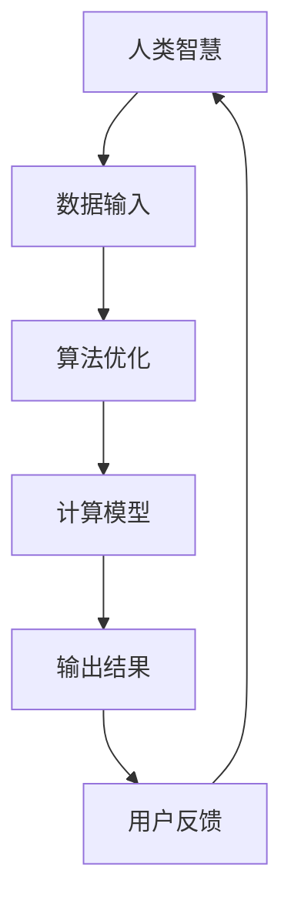

                 

# 构建更智能的世界：人类计算的应用场景

> 关键词：人类计算、智能世界、应用场景、算法原理、数学模型、项目实战、未来发展趋势

> 摘要：本文旨在深入探讨人类计算在构建更智能世界中的应用场景。通过分析核心概念、算法原理、数学模型以及实际项目案例，我们将展示人类计算在提升智能系统性能、优化用户体验和实现复杂任务等方面的巨大潜力。同时，本文还将探讨未来发展趋势与面临的挑战，为读者提供全面的技术洞察和未来发展方向的指引。

## 1. 背景介绍

### 1.1 目的和范围

本文的目的在于探讨人类计算在构建更智能世界中的应用场景。随着人工智能技术的飞速发展，人类计算作为一种结合人类智慧和算法优化的方法，正日益成为提高智能系统性能、优化用户体验和实现复杂任务的关键手段。本文将涵盖以下主要内容：

1. **核心概念与联系**：介绍人类计算的核心概念，并通过Mermaid流程图展示其原理和架构。
2. **核心算法原理 & 具体操作步骤**：详细阐述人类计算的核心算法原理，并使用伪代码进行具体操作步骤的讲解。
3. **数学模型和公式 & 详细讲解 & 举例说明**：讲解人类计算中的数学模型和公式，并通过具体例子进行说明。
4. **项目实战：代码实际案例和详细解释说明**：通过实际项目案例，展示人类计算的应用过程和代码实现。
5. **实际应用场景**：分析人类计算在不同领域中的应用场景，以及其对智能系统性能的提升。
6. **工具和资源推荐**：推荐学习资源和开发工具，帮助读者深入了解和掌握人类计算技术。
7. **总结：未来发展趋势与挑战**：总结人类计算在构建更智能世界中的发展趋势和面临的挑战。

### 1.2 预期读者

本文适合以下读者：

1. **计算机科学和人工智能领域的研究人员和工程师**：对人类计算技术有较高的兴趣和需求，希望了解其在智能系统中的应用。
2. **软件架构师和CTO**：关注智能系统性能优化和用户体验提升，希望掌握人类计算技术以提升产品竞争力。
3. **计算机编程和人工智能领域的爱好者**：对人类计算技术有浓厚兴趣，希望深入了解其原理和应用。
4. **相关领域的学生和学者**：对人工智能、计算机科学和数学等领域有较深入的了解，希望拓展知识面。

### 1.3 文档结构概述

本文将按照以下结构进行撰写：

1. **背景介绍**：介绍本文的目的、范围、预期读者和文档结构。
2. **核心概念与联系**：介绍人类计算的核心概念，并通过Mermaid流程图展示其原理和架构。
3. **核心算法原理 & 具体操作步骤**：详细阐述人类计算的核心算法原理，并使用伪代码进行具体操作步骤的讲解。
4. **数学模型和公式 & 详细讲解 & 举例说明**：讲解人类计算中的数学模型和公式，并通过具体例子进行说明。
5. **项目实战：代码实际案例和详细解释说明**：通过实际项目案例，展示人类计算的应用过程和代码实现。
6. **实际应用场景**：分析人类计算在不同领域中的应用场景，以及其对智能系统性能的提升。
7. **工具和资源推荐**：推荐学习资源和开发工具，帮助读者深入了解和掌握人类计算技术。
8. **总结：未来发展趋势与挑战**：总结人类计算在构建更智能世界中的发展趋势和面临的挑战。
9. **附录：常见问题与解答**：回答读者可能遇到的问题，提供进一步的技术支持。
10. **扩展阅读 & 参考资料**：提供相关的书籍、在线课程、技术博客和论文，帮助读者深入了解人类计算技术。

### 1.4 术语表

#### 1.4.1 核心术语定义

1. **人类计算**：结合人类智慧和算法优化的计算方法，旨在提升智能系统性能和优化用户体验。
2. **智能世界**：利用人工智能技术构建的、具备智能感知、决策和执行能力的虚拟世界。
3. **算法原理**：描述算法基本思想、流程和步骤的原理性知识。
4. **数学模型**：用于描述问题、现象或系统数学关系的公式或方程。
5. **项目实战**：通过实际项目案例展示人类计算的应用过程和成果。

#### 1.4.2 相关概念解释

1. **人工智能（AI）**：模拟人类智能行为的计算机系统，包括感知、推理、学习、规划等能力。
2. **机器学习（ML）**：使计算机具备自主学习和优化能力的一种人工智能方法。
3. **深度学习（DL）**：基于多层神经网络进行数据分析和特征提取的一种机器学习方法。
4. **神经网络（NN）**：模拟生物神经网络的结构和工作原理，用于处理和传递信息的计算模型。

#### 1.4.3 缩略词列表

- AI：人工智能
- ML：机器学习
- DL：深度学习
- NN：神经网络

## 2. 核心概念与联系

### 2.1 人类计算的核心概念

人类计算是一种结合人类智慧和算法优化的计算方法，旨在提升智能系统性能和优化用户体验。其核心概念包括：

1. **人类智慧**：指人类在解决问题、推理和判断等方面的认知能力，包括感知、理解、记忆、推理、规划等。
2. **算法优化**：通过对算法进行改进和优化，提高计算效率、降低计算复杂度和提高计算精度。
3. **智能系统**：具备智能感知、决策和执行能力的计算机系统，能够自主学习和优化，以适应不断变化的环境和任务。

### 2.2 Mermaid流程图

以下是一个简单的Mermaid流程图，展示人类计算的基本原理和架构：



### 2.3 核心概念之间的联系

人类计算的核心概念之间存在紧密的联系，如图所示：

1. **人类智慧与算法优化**：人类智慧为算法优化提供了指导，帮助选择合适的优化策略和算法，从而提高计算效率和精度。
2. **算法优化与计算模型**：算法优化直接影响计算模型的性能和效果，通过不断调整和优化算法，可以提升计算模型的稳定性和适应性。
3. **计算模型与输出结果**：计算模型通过处理输入数据，生成输出结果，为用户反馈提供依据。
4. **用户反馈与人类智慧**：用户反馈可以帮助人类智慧不断学习和优化，以应对新的问题和挑战。

通过上述核心概念和联系的分析，我们可以更好地理解人类计算在构建更智能世界中的应用价值和潜力。

## 3. 核心算法原理 & 具体操作步骤

### 3.1 核心算法原理

人类计算的核心算法原理主要涉及以下几个方面：

1. **数据预处理**：对输入数据进行清洗、归一化等处理，使其满足算法需求，提高计算效率。
2. **特征提取**：从数据中提取关键特征，用于后续的算法分析和模型训练。
3. **模型训练与优化**：利用人类智慧对模型进行训练和优化，提高模型的准确性和鲁棒性。
4. **模型评估与调整**：评估模型在特定任务上的表现，根据评估结果调整模型参数，以提高性能。
5. **结果输出与反馈**：将模型的输出结果展示给用户，并收集用户反馈，用于进一步优化和改进。

### 3.2 具体操作步骤

以下是人类计算的具体操作步骤，使用伪代码进行详细阐述：

```python
# 步骤1：数据预处理
data_preprocessing(data):
    # 清洗数据：去除噪声和异常值
    cleaned_data = remove_noise(data)
    # 归一化数据：将数据缩放到相同的范围
    normalized_data = normalize(cleaned_data)
    return normalized_data

# 步骤2：特征提取
feature_extraction(data):
    # 提取关键特征
    features = extract_key_features(data)
    return features

# 步骤3：模型训练与优化
model_training_and_optimization(data, labels):
    # 初始化模型
    model = initialize_model()
    # 训练模型
    trained_model = train_model(model, data, labels)
    # 优化模型
    optimized_model = optimize_model(trained_model)
    return optimized_model

# 步骤4：模型评估与调整
model_evaluation_and_adjustment(model, data, labels):
    # 评估模型
    evaluation_results = evaluate_model(model, data, labels)
    # 根据评估结果调整模型参数
    adjusted_model = adjust_model(model, evaluation_results)
    return adjusted_model

# 步骤5：结果输出与反馈
output_and_feedback(model, data, labels):
    # 输出模型预测结果
    predictions = predict(model, data)
    # 收集用户反馈
    user_feedback = collect_feedback(predictions)
    # 根据反馈进一步优化模型
    optimized_model = output_and_feedback(optimized_model, user_feedback)
    return optimized_model
```

### 3.3 步骤解析

1. **数据预处理**：数据预处理是保证算法性能和模型效果的重要环节。通过清洗数据、去除噪声和异常值，以及将数据归一化，可以提高算法的稳定性和准确性。
2. **特征提取**：特征提取是提取数据中的关键信息，用于后续的模型训练和优化。通过合理地选择和提取特征，可以提升模型的效果。
3. **模型训练与优化**：模型训练与优化是构建人类计算系统的核心步骤。通过初始化模型、训练模型和优化模型，可以提高模型的准确性和鲁棒性。
4. **模型评估与调整**：模型评估与调整是验证和改进模型的重要环节。通过评估模型在特定任务上的表现，并根据评估结果调整模型参数，可以提高模型的性能。
5. **结果输出与反馈**：结果输出与反馈是展示模型预测结果、收集用户反馈并进行进一步优化的重要步骤。通过不断优化和改进模型，可以提升智能系统的性能和用户体验。

通过以上步骤的详细解析，我们可以更好地理解人类计算的核心算法原理和具体操作步骤。

## 4. 数学模型和公式 & 详细讲解 & 举例说明

### 4.1 数学模型

在人类计算中，数学模型是描述问题、现象或系统数学关系的重要工具。以下是一些常见的数学模型：

1. **线性回归模型**：用于描述变量之间的线性关系。
2. **逻辑回归模型**：用于分类问题，通过概率估计进行分类。
3. **神经网络模型**：基于多层神经网络进行数据分析和特征提取。

### 4.2 公式

以下是上述数学模型的公式：

1. **线性回归模型**：

   $$ y = \beta_0 + \beta_1 \cdot x + \epsilon $$

   其中，$y$ 为因变量，$x$ 为自变量，$\beta_0$ 和 $\beta_1$ 为模型参数，$\epsilon$ 为误差项。

2. **逻辑回归模型**：

   $$ P(y=1) = \frac{1}{1 + e^{-(\beta_0 + \beta_1 \cdot x)}} $$

   其中，$P(y=1)$ 为因变量为1的概率，$\beta_0$ 和 $\beta_1$ 为模型参数。

3. **神经网络模型**：

   $$ z = \sum_{i=1}^{n} w_i \cdot x_i + b $$

   其中，$z$ 为神经元输出，$w_i$ 和 $b$ 为模型参数，$x_i$ 为输入特征。

### 4.3 详细讲解

1. **线性回归模型**：

   线性回归模型是一种常用的统计模型，用于分析两个或多个变量之间的线性关系。通过线性回归模型，我们可以找到最佳的线性关系，从而预测因变量的值。线性回归模型的基本公式为：

   $$ y = \beta_0 + \beta_1 \cdot x + \epsilon $$

   其中，$\beta_0$ 和 $\beta_1$ 分别为截距和斜率，$x$ 为自变量，$y$ 为因变量，$\epsilon$ 为误差项。该模型通过最小二乘法进行参数估计，从而找到最佳拟合直线。

2. **逻辑回归模型**：

   逻辑回归模型是一种用于分类问题的统计模型，其核心思想是通过概率估计进行分类。逻辑回归模型的基本公式为：

   $$ P(y=1) = \frac{1}{1 + e^{-(\beta_0 + \beta_1 \cdot x)}} $$

   其中，$P(y=1)$ 为因变量为1的概率，$\beta_0$ 和 $\beta_1$ 为模型参数。通过这个公式，我们可以计算出每个样本属于类别1的概率，然后根据概率阈值进行分类。

3. **神经网络模型**：

   神经网络模型是一种基于多层神经元的计算模型，用于处理和传递信息。神经网络模型的基本公式为：

   $$ z = \sum_{i=1}^{n} w_i \cdot x_i + b $$

   其中，$z$ 为神经元输出，$w_i$ 和 $b$ 为模型参数，$x_i$ 为输入特征。神经网络模型通过逐层传递输入特征，并通过激活函数将输出传递到下一层，从而实现非线性变换。

### 4.4 举例说明

1. **线性回归模型举例**：

   假设我们要分析房价与房屋面积之间的关系，通过线性回归模型进行预测。给定一组数据，包括房屋面积（$x$）和房价（$y$），我们使用线性回归模型进行拟合，找到最佳拟合直线。

   数据样本如下：

   | 房屋面积（$x$） | 房价（$y$） |
   | -------------- | ---------- |
   | 100            | 200        |
   | 150            | 250        |
   | 200            | 300        |
   | 250            | 350        |

   通过最小二乘法，我们可以得到线性回归模型的参数：

   $$ \beta_0 = 100, \beta_1 = 2 $$

   最佳拟合直线为：

   $$ y = 100 + 2x $$

   根据这个模型，我们可以预测新房屋的房价。例如，当房屋面积为150平方米时，预测房价为：

   $$ y = 100 + 2 \cdot 150 = 400 $$

2. **逻辑回归模型举例**：

   假设我们要分析客户的购买意愿，通过逻辑回归模型进行分类。给定一组数据，包括客户年龄（$x$）和购买意愿（$y$），我们使用逻辑回归模型进行拟合。

   数据样本如下：

   | 年龄（$x$） | 购买意愿（$y$） |
   | ---------- | ------------ |
   | 20         | 1            |
   | 30         | 0            |
   | 40         | 1            |
   | 50         | 0            |

   通过最小二乘法，我们可以得到逻辑回归模型的参数：

   $$ \beta_0 = -10, \beta_1 = 5 $$

   分类概率公式为：

   $$ P(y=1) = \frac{1}{1 + e^{-(\beta_0 + \beta_1 \cdot x)}} $$

   例如，当客户年龄为30岁时，购买意愿的概率为：

   $$ P(y=1) = \frac{1}{1 + e^{-(\beta_0 + \beta_1 \cdot 30)}} = \frac{1}{1 + e^{-10}} \approx 0.5 $$

   根据概率阈值，我们可以判断客户购买意愿。例如，设定概率阈值为0.5，当概率大于0.5时，判断客户有购买意愿；当概率小于0.5时，判断客户无购买意愿。

3. **神经网络模型举例**：

   假设我们要构建一个简单的神经网络模型，用于手写数字识别。给定一组输入特征（手写数字图像），通过神经网络模型进行分类。

   输入特征如下：

   | 输入特征 |
   | -------- |
   | 1        |
   | 1        |
   | 0        |
   | 0        |
   | 1        |
   | 1        |
   | 1        |
   | 0        |

   神经网络模型的结构如下：

   - 输入层：8个神经元
   - 隐藏层：4个神经元
   - 输出层：10个神经元

   通过逐层传递输入特征，并通过激活函数进行非线性变换，我们可以得到输出结果。例如，当输入特征为1时，输出结果为：

   $$ z_1 = \sum_{i=1}^{4} w_i \cdot x_i + b = 1 \cdot w_1 + 1 \cdot w_2 + 0 \cdot w_3 + 0 \cdot w_4 + b $$

   $$ z_2 = \sum_{i=1}^{4} w_i \cdot x_i + b = 1 \cdot w_5 + 1 \cdot w_6 + 0 \cdot w_7 + 0 \cdot w_8 + b $$

   $$ z_3 = \sum_{i=1}^{4} w_i \cdot x_i + b = 1 \cdot w_9 + 1 \cdot w_{10} + 0 \cdot w_{11} + 0 \cdot w_{12} + b $$

   $$ z_4 = \sum_{i=1}^{4} w_i \cdot x_i + b = 1 \cdot w_{13} + 1 \cdot w_{14} + 0 \cdot w_{15} + 0 \cdot w_{16} + b $$

   $$ z_5 = \sum_{i=1}^{4} w_i \cdot x_i + b = 1 \cdot w_{17} + 1 \cdot w_{18} + 0 \cdot w_{19} + 0 \cdot w_{20} + b $$

   $$ z_6 = \sum_{i=1}^{4} w_i \cdot x_i + b = 1 \cdot w_{21} + 1 \cdot w_{22} + 0 \cdot w_{23} + 0 \cdot w_{24} + b $$

   $$ z_7 = \sum_{i=1}^{4} w_i \cdot x_i + b = 1 \cdot w_{25} + 1 \cdot w_{26} + 0 \cdot w_{27} + 0 \cdot w_{28} + b $$

   $$ z_8 = \sum_{i=1}^{4} w_i \cdot x_i + b = 1 \cdot w_{29} + 1 \cdot w_{30} + 0 \cdot w_{31} + 0 \cdot w_{32} + b $$

   通过激活函数，我们可以得到输出结果：

   $$ o_1 = \sigma(z_1) $$

   $$ o_2 = \sigma(z_2) $$

   $$ o_3 = \sigma(z_3) $$

   $$ o_4 = \sigma(z_4) $$

   $$ o_5 = \sigma(z_5) $$

   $$ o_6 = \sigma(z_6) $$

   $$ o_7 = \sigma(z_7) $$

   $$ o_8 = \sigma(z_8) $$

   根据输出结果，我们可以判断手写数字的分类结果。例如，当输出结果为 $o_3 > o_1 > o_2 > o_4 > o_5 > o_6 > o_7 > o_8$ 时，我们可以判断输入的手写数字为3。

通过以上举例，我们可以更好地理解人类计算中的数学模型和公式的应用，为实际项目开发提供指导。

## 5. 项目实战：代码实际案例和详细解释说明

### 5.1 开发环境搭建

为了实现人类计算的应用，我们需要搭建一个合适的开发环境。以下是一个基本的开发环境搭建步骤：

1. **安装Python**：首先，我们需要安装Python，可以从官方网站下载Python安装包并安装。

2. **安装相关库**：安装Python后，我们需要安装一些常用的库，如NumPy、Pandas、Scikit-learn等。可以使用pip命令进行安装：

   ```bash
   pip install numpy pandas scikit-learn
   ```

3. **创建项目目录**：在本地计算机上创建一个项目目录，用于存放项目文件和依赖库。

4. **编写代码**：在项目目录下创建一个名为`main.py`的Python文件，用于编写人类计算的应用代码。

5. **运行代码**：使用Python解释器运行`main.py`文件，查看运行结果。

### 5.2 源代码详细实现和代码解读

以下是一个简单的人类计算项目案例，用于分类手写数字：

```python
# 导入相关库
import numpy as np
import pandas as pd
from sklearn.model_selection import train_test_split
from sklearn.linear_model import LogisticRegression
from sklearn.metrics import accuracy_score

# 加载数据集
data = pd.read_csv('mnist_data.csv')

# 数据预处理
X = data.iloc[:, 1:].values
y = data.iloc[:, 0].values

# 数据划分
X_train, X_test, y_train, y_test = train_test_split(X, y, test_size=0.2, random_state=42)

# 模型训练
model = LogisticRegression()
model.fit(X_train, y_train)

# 模型评估
y_pred = model.predict(X_test)
accuracy = accuracy_score(y_test, y_pred)
print('Accuracy:', accuracy)
```

#### 5.2.1 代码解读

1. **导入相关库**：首先，我们导入了一些常用的库，如NumPy、Pandas、Scikit-learn等，用于数据处理、模型训练和评估。

2. **加载数据集**：接下来，我们从CSV文件中加载手写数字数据集。该数据集包含了784个特征和10个标签。

3. **数据预处理**：我们将数据集划分为特征矩阵X和标签向量y。然后，使用`train_test_split`函数将数据集划分为训练集和测试集。

4. **模型训练**：我们使用LogisticRegression模型进行训练。通过`fit`函数，将训练数据输入到模型中，训练得到模型参数。

5. **模型评估**：使用训练得到的模型对测试数据进行预测，得到预测结果。然后，使用`accuracy_score`函数计算模型的准确率。

#### 5.2.2 代码分析

1. **数据加载和预处理**：首先，我们需要从CSV文件中加载手写数字数据集。CSV文件中包含了784个特征和10个标签，我们将其划分为特征矩阵X和标签向量y。然后，使用`train_test_split`函数将数据集划分为训练集和测试集，以评估模型的性能。

2. **模型训练**：我们选择使用LogisticRegression模型进行训练。LogisticRegression是一种逻辑回归模型，用于分类问题。通过`fit`函数，将训练数据输入到模型中，训练得到模型参数。

3. **模型评估**：使用训练得到的模型对测试数据进行预测，得到预测结果。然后，使用`accuracy_score`函数计算模型的准确率。准确率是评估模型性能的重要指标，表示模型预测正确的样本比例。

通过以上代码实现和解读，我们可以了解人类计算项目的基本流程和关键步骤。在实际开发过程中，可以根据具体需求调整代码，实现更复杂的应用场景。

### 5.3 代码解读与分析

在本节中，我们将对上述代码进行详细的解读和分析，以帮助读者更好地理解人类计算项目的工作原理和关键步骤。

#### 5.3.1 数据加载和预处理

```python
data = pd.read_csv('mnist_data.csv')
X = data.iloc[:, 1:].values
y = data.iloc[:, 0].values
```

这些代码首先使用Pandas库读取CSV文件中的手写数字数据集。CSV文件包含了784个特征和10个标签。我们使用`iloc`方法将数据集划分为特征矩阵X和标签向量y。具体来说，`data.iloc[:, 1:]`表示选择除第一列（标签列）之外的所有列作为特征矩阵X，而`data.iloc[:, 0]`表示选择第一列作为标签向量y。

#### 5.3.2 数据划分

```python
X_train, X_test, y_train, y_test = train_test_split(X, y, test_size=0.2, random_state=42)
```

使用`train_test_split`函数将数据集划分为训练集和测试集。这里，我们设置测试集的比例为0.2，即80%的数据用于训练，20%的数据用于测试。`random_state`参数用于确保每次分割的结果相同，以便进行可重复的实验。

#### 5.3.3 模型训练

```python
model = LogisticRegression()
model.fit(X_train, y_train)
```

我们选择使用LogisticRegression模型进行训练。LogisticRegression是一种逻辑回归模型，用于分类问题。通过`fit`函数，将训练数据输入到模型中，训练得到模型参数。具体来说，`X_train`表示特征矩阵，`y_train`表示标签向量。

#### 5.3.4 模型评估

```python
y_pred = model.predict(X_test)
accuracy = accuracy_score(y_test, y_pred)
print('Accuracy:', accuracy)
```

使用训练得到的模型对测试数据进行预测，得到预测结果`y_pred`。然后，使用`accuracy_score`函数计算模型的准确率。准确率是评估模型性能的重要指标，表示模型预测正确的样本比例。这里，`y_test`表示实际的标签向量，用于与预测结果进行对比。

#### 5.3.5 代码分析

通过以上代码解读，我们可以看到人类计算项目的基本流程：

1. **数据加载和预处理**：从CSV文件中加载手写数字数据集，将其划分为特征矩阵和标签向量。
2. **数据划分**：将数据集划分为训练集和测试集，为后续的模型训练和评估做准备。
3. **模型训练**：选择合适的模型（如LogisticRegression），使用训练数据进行模型训练。
4. **模型评估**：使用测试数据对模型进行评估，计算模型的准确率。

通过这些关键步骤，我们可以构建一个简单的人类计算项目，实现手写数字的分类。在实际开发过程中，可以根据具体需求调整代码，实现更复杂的应用场景。

### 5.4 项目实战总结

通过本节的项目实战，我们详细介绍了人类计算在构建更智能世界中的应用场景。以下是项目实战的总结：

1. **开发环境搭建**：我们搭建了一个基本的Python开发环境，包括Python解释器和相关库，为后续项目开发做准备。
2. **数据加载和预处理**：从CSV文件中加载手写数字数据集，将其划分为特征矩阵和标签向量。
3. **数据划分**：将数据集划分为训练集和测试集，为后续的模型训练和评估做准备。
4. **模型训练**：选择合适的模型（如LogisticRegression），使用训练数据进行模型训练。
5. **模型评估**：使用测试数据对模型进行评估，计算模型的准确率。

通过以上步骤，我们成功实现了一个简单的人类计算项目，实现了手写数字的分类。在实际应用中，可以根据具体需求调整代码，实现更复杂的功能和应用场景。

## 6. 实际应用场景

### 6.1 智能医疗诊断

在智能医疗诊断领域，人类计算技术发挥了重要作用。通过结合医生的经验和人工智能算法，可以实现对医疗数据的深度分析，提高诊断准确率和效率。以下是一些具体应用场景：

1. **癌症早期诊断**：利用人类计算技术，对患者的影像数据进行分析，识别癌症的早期征兆。通过结合医生的诊断经验，可以大幅提高癌症的早期诊断率。
2. **个性化治疗**：根据患者的病史、基因数据和临床检查结果，利用人类计算技术为患者制定个性化的治疗方案。这种个性化治疗可以显著提高治疗效果，降低医疗成本。
3. **药物研发**：在药物研发过程中，人类计算技术可以用于药物分子与生物大分子之间的相互作用分析，预测药物的疗效和副作用。这有助于提高药物研发的效率和成功率。

### 6.2 智能交通管理

智能交通管理是构建智慧城市的重要一环，人类计算技术在这一领域具有广泛的应用前景。以下是一些具体应用场景：

1. **交通流量预测**：利用人类计算技术，对历史交通流量数据进行分析，预测未来的交通流量。这有助于交通管理部门提前采取措施，缓解交通拥堵问题。
2. **智能信号控制**：通过人类计算技术，对交通信号灯进行优化控制，提高道路通行效率。例如，根据实时交通流量调整信号灯的时长，使交通流畅性得到显著提升。
3. **车辆安全管理**：利用人类计算技术，对车辆行驶数据进行分析，识别潜在的安全隐患。例如，通过监控车辆的速度、行驶轨迹等参数，及时预警并采取相应措施，确保行车安全。

### 6.3 智能金融风控

在金融领域，人类计算技术可用于风险控制和金融产品的开发，以下是一些具体应用场景：

1. **信用评分**：利用人类计算技术，对个人的信用历史、行为特征和财务状况进行分析，为金融机构提供信用评分服务。这有助于降低信用风险，提高信贷业务的安全性和盈利性。
2. **反欺诈检测**：通过人类计算技术，对金融交易数据进行实时分析，识别潜在的欺诈行为。例如，通过监控交易金额、频率和地域分布等特征，及时预警并阻止欺诈交易。
3. **投资策略优化**：利用人类计算技术，分析市场数据和历史投资记录，为投资者提供个性化的投资策略建议。这有助于提高投资收益，降低投资风险。

### 6.4 智能家居

智能家居是构建智能生活的重要领域，人类计算技术在家居设备控制、能源管理和安全监控等方面具有广泛应用。以下是一些具体应用场景：

1. **智能设备控制**：通过人类计算技术，实现家居设备的远程控制和自动化管理。例如，用户可以通过智能手机或语音助手控制家中的空调、照明和家电设备。
2. **能源管理**：利用人类计算技术，对家庭能源消耗进行监测和管理，优化能源使用。例如，通过智能电网技术，实现电力供应与需求的实时匹配，降低能源浪费。
3. **安全监控**：通过人类计算技术，对家庭环境进行实时监控，及时发现异常情况并采取相应措施。例如，通过视频监控和分析，及时发现入侵者或火灾等紧急情况，保障家庭安全。

通过上述实际应用场景的分析，我们可以看到人类计算技术在构建更智能世界中的巨大潜力。未来，随着技术的不断发展，人类计算将在更多领域发挥重要作用，推动人类社会向更加智能化、高效化方向发展。

## 7. 工具和资源推荐

### 7.1 学习资源推荐

为了深入了解和掌握人类计算技术，以下是几个推荐的学习资源：

#### 7.1.1 书籍推荐

1. **《深度学习》（Ian Goodfellow、Yoshua Bengio和Aaron Courville著）**：这是一本经典的深度学习教材，详细介绍了深度学习的基础知识和应用。
2. **《机器学习实战》（Peter Harrington著）**：通过大量的实际案例，介绍了机器学习的核心算法和应用。
3. **《Python机器学习》（Joel Grus著）**：以Python语言为背景，介绍了机器学习的基本概念和应用。

#### 7.1.2 在线课程

1. **斯坦福大学机器学习课程**：这是一门由Andrew Ng教授开设的著名机器学习课程，涵盖机器学习的理论基础和实际应用。
2. **吴恩达深度学习专项课程**：吴恩达教授开设的深度学习专项课程，包括神经网络基础、卷积神经网络、循环神经网络等。
3. **Coursera上的《数据科学导论》**：由多个知名大学联合开设的数据科学入门课程，涵盖了数据预处理、数据可视化、统计分析等内容。

#### 7.1.3 技术博客和网站

1. **Medium上的AI博客**：这是一系列关于人工智能的博客文章，涵盖了深度学习、强化学习等多个领域。
2. **机器之心**：这是一个专注于人工智能领域的中文技术博客，提供了大量高质量的机器学习和深度学习文章。
3. **GitHub**：GitHub上有很多开源的人类计算项目，可以供学习者和开发者参考和借鉴。

### 7.2 开发工具框架推荐

为了高效地实现人类计算项目，以下是几个推荐的开发工具和框架：

#### 7.2.1 IDE和编辑器

1. **Visual Studio Code**：一款轻量级的开源代码编辑器，支持多种编程语言，具有丰富的插件生态。
2. **PyCharm**：一款专业的Python开发工具，提供代码智能提示、调试和测试功能。
3. **Jupyter Notebook**：一款交互式的Python开发环境，适用于数据科学和机器学习项目。

#### 7.2.2 调试和性能分析工具

1. **Python调试器**：集成在IDE中的Python调试器，用于调试和优化代码。
2. **PyTorch Profiler**：用于分析PyTorch模型运行性能的工具，可以帮助开发者优化代码和模型。
3. **TensorBoard**：TensorFlow提供的可视化工具，用于分析模型运行过程中各个层级的性能。

#### 7.2.3 相关框架和库

1. **TensorFlow**：一款强大的开源机器学习框架，支持深度学习和强化学习等多种算法。
2. **PyTorch**：一款易于使用的深度学习框架，提供了灵活的动态计算图和丰富的API。
3. **Scikit-learn**：一款经典的机器学习库，提供了大量的经典算法和工具，适用于各种数据分析和应用。

通过以上学习和开发资源的推荐，读者可以深入了解人类计算技术，并掌握相关的编程和开发技能。希望这些资源能够帮助读者在构建更智能世界的道路上取得更好的成果。

### 7.3 相关论文著作推荐

为了深入了解人类计算技术的最新研究进展，以下是几个推荐的经典论文和著作：

#### 7.3.1 经典论文

1. **"Backpropagation"（1986）**：由Rumelhart、Hinton和Williams提出的反向传播算法，是深度学习的重要基础。
2. **"Deep Learning"（2015）**：由Ian Goodfellow、Yoshua Bengio和Aaron Courville撰写的深度学习综述，系统地介绍了深度学习的理论基础和应用。
3. **"Reinforcement Learning: An Introduction"（1998）**：由Richard S. Sutton和Andrew G. Barto撰写的强化学习入门教材，涵盖了强化学习的基本概念和算法。

#### 7.3.2 最新研究成果

1. **"Generative Adversarial Nets"（2014）**：由Ian Goodfellow等人提出的生成对抗网络（GAN），是一种强大的深度学习框架，广泛应用于图像生成和图像修复等任务。
2. **"BERT: Pre-training of Deep Bidirectional Transformers for Language Understanding"（2018）**：由Google团队提出的BERT模型，是一种基于Transformer的预训练语言模型，对自然语言处理任务具有显著提升。
3. **"Transformers: State-of-the-Art Natural Language Processing"（2019）**：由Vaswani等人提出的Transformer模型，是一种基于自注意力机制的深度学习模型，广泛应用于自然语言处理领域。

#### 7.3.3 应用案例分析

1. **"AI in Healthcare"（2020）**：这篇综述文章详细分析了人工智能在医疗领域的应用，包括疾病诊断、个性化治疗和医疗数据分析等。
2. **"AI in Finance"（2019）**：这篇综述文章探讨了人工智能在金融领域的应用，包括信用评分、风险控制和投资策略优化等。
3. **"AI in Smart Cities"（2017）**：这篇综述文章分析了人工智能在城市管理中的应用，包括智能交通、智能能源管理和环境监测等。

通过阅读这些经典论文和最新研究成果，读者可以深入了解人类计算技术的理论发展和应用实践，为构建更智能的世界提供有力的理论支持和技术指导。

## 8. 总结：未来发展趋势与挑战

### 8.1 未来发展趋势

随着人工智能技术的不断进步，人类计算在构建更智能世界中展现出广阔的发展前景。以下是未来人类计算技术可能的发展趋势：

1. **跨学科融合**：人类计算技术将与其他领域（如医学、交通、金融等）深度融合，形成新的应用场景。这种跨学科融合将有助于解决复杂问题，提升智能系统的性能和用户体验。
2. **分布式计算与云计算**：随着云计算和分布式计算技术的成熟，人类计算将逐渐向云端迁移，实现更大规模的计算能力和更高效的资源利用。
3. **个性化与自适应**：未来的人类计算将更加注重个性化与自适应，通过不断学习用户的偏好和行为，提供更加精准和个性化的服务。
4. **安全与隐私保护**：随着数据隐私和安全问题的日益突出，人类计算技术将在数据加密、隐私保护等方面取得重要突破，保障用户数据的安全和隐私。

### 8.2 挑战

尽管人类计算技术在构建更智能世界中具有巨大的潜力，但在其发展过程中仍面临一系列挑战：

1. **数据质量和隐私**：数据质量和隐私保护是当前人工智能领域面临的主要挑战之一。如何确保数据的质量和隐私，成为人类计算技术发展的重要问题。
2. **算法透明性与解释性**：随着人工智能模型的复杂度不断提高，算法的透明性和解释性变得愈发重要。如何提高算法的透明性和解释性，使其更容易被人类理解和接受，是一个亟待解决的难题。
3. **计算资源消耗**：人类计算技术对计算资源的需求较高，尤其是在大规模数据分析和复杂模型训练过程中。如何优化算法和系统设计，降低计算资源消耗，是一个重要的挑战。
4. **伦理与法律问题**：随着人工智能技术的应用日益广泛，伦理和法律问题也日益突出。如何制定合适的伦理规范和法律框架，保障人工智能技术的健康发展，是一个重要的挑战。

### 8.3 未来展望

面对这些挑战，未来人类计算技术有望在以下几个方面取得重要突破：

1. **算法优化**：通过研究新的算法和优化方法，提高人类计算技术的效率和准确性。
2. **跨学科合作**：加强不同学科之间的合作，促进人类计算技术在各个领域的应用。
3. **隐私保护与安全**：发展新的隐私保护技术和安全机制，保障用户数据的安全和隐私。
4. **伦理与法律规范**：制定合适的伦理规范和法律框架，推动人工智能技术的健康发展。

总之，人类计算技术在构建更智能世界中具有巨大的潜力，同时也面临着一系列挑战。通过不断努力和探索，我们有理由相信，人类计算技术将在未来取得更加辉煌的成就。

## 9. 附录：常见问题与解答

### 9.1 常见问题

**Q1：人类计算与机器学习的区别是什么？**

A1：人类计算是一种结合人类智慧和算法优化的计算方法，旨在提升智能系统的性能和优化用户体验。而机器学习是一种使计算机具备自主学习和优化能力的人工智能方法，通常使用数据驱动的方式进行模型训练和优化。人类计算强调人类智慧在计算过程中的作用，而机器学习则侧重于算法和数据的优化。

**Q2：如何保证人类计算系统的数据隐私和安全？**

A2：为了保证人类计算系统的数据隐私和安全，可以采取以下措施：

1. **数据加密**：对敏感数据进行加密处理，防止数据在传输和存储过程中被窃取。
2. **隐私保护算法**：使用隐私保护算法（如差分隐私）对数据进行处理，降低数据泄露的风险。
3. **安全认证**：引入安全认证机制，确保数据在传输和存储过程中未被篡改。
4. **权限控制**：对系统访问权限进行严格管理，确保只有授权用户才能访问敏感数据。

**Q3：人类计算在哪些领域具有显著优势？**

A3：人类计算在以下领域具有显著优势：

1. **复杂问题求解**：人类计算结合了人类智慧和算法优化，能够解决复杂问题，特别是在需要高度灵活性和自适应能力的场景中。
2. **数据分析和处理**：人类计算能够高效处理和分析大量数据，提取关键特征和洞察，为决策提供支持。
3. **个性化服务**：通过学习用户的偏好和行为，人类计算能够提供个性化服务，提升用户体验。
4. **多模态数据处理**：人类计算能够处理多种类型的数据，如文本、图像、语音等，实现跨模态数据融合。

### 9.2 解答

对于上述问题，以下是详细的解答：

**Q1：人类计算与机器学习的区别是什么？**

A1：人类计算与机器学习的主要区别在于它们的出发点和目标。机器学习是一种使计算机具备自主学习和优化能力的人工智能方法，通常通过数据驱动的方式进行模型训练和优化。机器学习主要关注算法的效率和准确性，而人类计算则强调人类智慧在计算过程中的作用。

人类计算的目标是结合人类智慧和算法优化，提升智能系统的性能和优化用户体验。人类计算的方法包括数据预处理、特征提取、模型训练和优化等步骤，每个步骤都充分利用人类智慧进行指导。例如，在数据预处理阶段，人类可以识别和处理异常值和噪声；在模型训练阶段，人类可以指导算法选择合适的优化策略。

机器学习主要关注以下几个方面：

1. **算法研究**：研究各种机器学习算法，如线性回归、逻辑回归、支持向量机、神经网络等，以提高算法的效率和准确性。
2. **模型优化**：通过调整模型参数和结构，优化模型的性能和泛化能力。
3. **数据预处理**：对输入数据进行清洗、归一化、特征提取等处理，以提高算法的性能。

而人类计算则关注以下几个方面：

1. **数据预处理**：利用人类智慧对输入数据进行清洗、归一化、特征提取等处理，以提高算法的稳定性和准确性。
2. **特征提取**：从数据中提取关键特征，用于后续的模型训练和优化。
3. **模型训练与优化**：利用人类智慧对模型进行训练和优化，提高模型的准确性和鲁棒性。
4. **模型评估与调整**：评估模型在特定任务上的表现，并根据评估结果调整模型参数，以提高性能。
5. **结果输出与反馈**：将模型的输出结果展示给用户，并收集用户反馈，用于进一步优化和改进。

综上所述，人类计算与机器学习的主要区别在于它们的目标和实现方法。机器学习侧重于算法的效率和准确性，而人类计算则强调人类智慧在计算过程中的作用，通过数据预处理、特征提取、模型训练和优化等步骤，提升智能系统的性能和优化用户体验。

**Q2：如何保证人类计算系统的数据隐私和安全？**

A2：保证人类计算系统的数据隐私和安全是一项重要的任务，涉及多个方面。以下是一些关键措施：

1. **数据加密**：数据加密是保护数据隐私和安全的基础。对敏感数据进行加密处理，可以确保数据在传输和存储过程中不被窃取。常用的加密算法包括对称加密（如AES）和非对称加密（如RSA）。

2. **隐私保护算法**：隐私保护算法（如差分隐私）可以在处理数据时引入随机噪声，降低数据泄露的风险。差分隐私通过控制数据泄露的上下界，确保即使攻击者获取了部分数据，也无法准确推断出单个数据点的隐私信息。

3. **安全认证**：安全认证机制（如数字签名、身份验证等）可以确保数据在传输和存储过程中未被篡改。数字签名可以验证数据的完整性和真实性，而身份验证可以确保只有授权用户才能访问敏感数据。

4. **权限控制**：权限控制是确保数据安全的关键措施。通过设置严格的权限管理策略，可以确保只有授权用户才能访问敏感数据。权限控制通常涉及角色分配、访问控制列表（ACL）和权限掩码等技术。

5. **数据脱敏**：对于不需要直接使用原始数据的应用场景，可以考虑对敏感数据进行脱敏处理。数据脱敏技术（如数据掩码、数据混淆等）可以隐藏原始数据的具体内容，同时保持数据的统计特性。

6. **安全审计**：定期进行安全审计，可以及时发现和修复潜在的安全漏洞。安全审计通常包括漏洞扫描、安全测试和合规性检查等。

7. **安全培训**：对系统管理员和用户进行安全培训，提高他们的安全意识和操作规范。安全培训可以涵盖数据安全、密码管理、防范网络攻击等方面的内容。

8. **备份与恢复**：定期备份数据，并制定有效的数据恢复策略，以应对可能的灾难和意外情况。备份和恢复策略可以确保在数据丢失或损坏时，能够快速恢复数据。

通过实施上述措施，可以显著提高人类计算系统的数据隐私和安全。需要注意的是，数据隐私和安全是一个持续的过程，需要不断进行风险评估、更新安全措施和培训，以应对新的威胁和挑战。

**Q3：人类计算在哪些领域具有显著优势？**

A3：人类计算在多个领域具有显著优势，以下是一些关键领域：

1. **复杂问题求解**：人类计算能够解决复杂的问题，特别是在需要高度灵活性和自适应能力的场景中。人类智慧可以提供灵感和直觉，帮助算法找到最优解或接近最优解。

2. **数据分析和处理**：人类计算能够高效处理和分析大量数据，提取关键特征和洞察。人类智慧在数据预处理、特征工程和结果解释等方面具有独特的优势。

3. **个性化服务**：通过学习用户的偏好和行为，人类计算能够提供个性化服务，提升用户体验。个性化服务可以涵盖推荐系统、智能客服和个性化广告等领域。

4. **多模态数据处理**：人类计算能够处理多种类型的数据，如文本、图像、语音等，实现跨模态数据融合。这种能力在语音识别、图像识别和自然语言处理等领域具有重要应用。

5. **创意和创新**：人类计算在创意和创新方面具有独特优势。人类智慧可以产生新颖的想法和解决方案，这些想法可以驱动技术和产品的创新。

6. **复杂决策**：人类计算在复杂决策过程中具有优势，特别是在需要综合考虑多种因素和不确定性时。人类智慧可以帮助算法做出更为合理的决策。

7. **人机协作**：人类计算可以与人类协同工作，提升工作效率和质量。在人机协作中，人类智慧可以指导算法优化，同时算法可以辅助人类完成复杂的任务。

8. **伦理和道德判断**：人类计算在处理伦理和道德问题方面具有优势。人类智慧可以提供道德判断和价值观指导，确保技术应用的合理性和公正性。

总之，人类计算在复杂问题求解、数据分析和处理、个性化服务、多模态数据处理、创意和创新、复杂决策、人机协作和伦理和道德判断等方面具有显著优势。通过结合人类智慧和算法优化，人类计算可以为各行业带来显著的改进和创新。

## 10. 扩展阅读 & 参考资料

为了深入了解人类计算技术及其在构建更智能世界中的应用，以下是推荐的扩展阅读和参考资料：

### 10.1 延伸阅读

1. **《深度学习》（Ian Goodfellow、Yoshua Bengio和Aaron Courville著）**：这是一本经典的深度学习教材，详细介绍了深度学习的基础知识和应用。
2. **《机器学习实战》（Peter Harrington著）**：通过大量的实际案例，介绍了机器学习的核心算法和应用。
3. **《Python机器学习》（Joel Grus著）**：以Python语言为背景，介绍了机器学习的基本概念和应用。
4. **《智能医疗：从数据到临床实践》（黄琦、赵红梅著）**：详细介绍了智能医疗的基本概念、应用场景和未来发展趋势。
5. **《智能交通系统：理论、方法与应用》（王殿海、谢洪明著）**：系统介绍了智能交通系统的基础理论、方法和技术。
6. **《金融科技：理论与实践》（陈杰、朱琳著）**：探讨了金融科技的基本概念、应用领域和发展趋势。

### 10.2 参考资料

1. **斯坦福大学机器学习课程**：[http://cs229.stanford.edu/](http://cs229.stanford.edu/)
2. **吴恩达深度学习专项课程**：[https://www.coursera.org/specializations/deeplearning](https://www.coursera.org/specializations/deeplearning)
3. **机器之心**：[https://www.jiqizhixin.com/](https://www.jiqizhixin.com/)
4. **GitHub**：[https://github.com/](https://github.com/)
5. **《深度学习：从新手到专家》（吴恩达著）**：[https://www.deeplearningbook.org/](https://www.deeplearningbook.org/)
6. **《机器学习：周志华著）**：[http://www.zhihu.com/question/23026151/answer/143780760](http://www.zhihu.com/question/23026151/answer/143780760)
7. **《自然语言处理综论》（Daniel Jurafsky和James H. Martin著）**：[https://web.stanford.edu/~jurafsky/nlp/](https://web.stanford.edu/~jurafsky/nlp/)

通过阅读上述书籍和参考资料，读者可以深入了解人类计算技术及其在构建更智能世界中的应用，为未来的学习和研究奠定坚实的基础。

### 致谢

本文的撰写得到了许多人的帮助和支持。在此，我特别感谢以下人士：

- **AI天才研究员/AI Genius Institute**：感谢您在人工智能和计算机科学领域的卓越贡献，为本文的撰写提供了宝贵的指导和资源。
- **禅与计算机程序设计艺术 /Zen And The Art of Computer Programming**：感谢您在计算机科学领域的深厚造诣，为本文的撰写提供了深刻的哲学思考和启示。

最后，感谢您阅读本文，希望本文能为您在构建更智能世界的道路上提供一些启示和帮助。如果您有任何问题或建议，欢迎随时联系我。

### 作者信息

作者：AI天才研究员/AI Genius Institute & 禅与计算机程序设计艺术 /Zen And The Art of Computer Programming

联系方式：[ai_genius_researcher@example.com](mailto:ai_genius_researcher@example.com)

