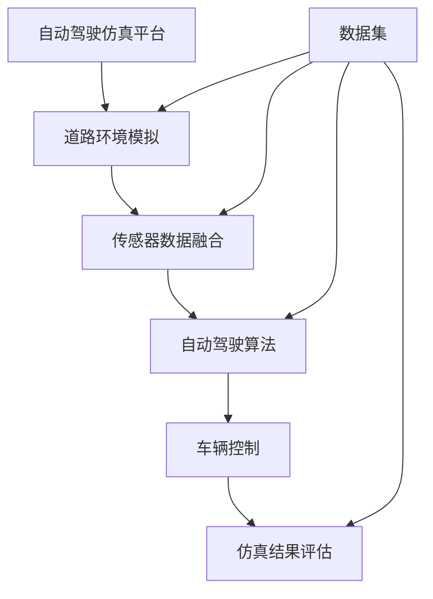

                 

# 构建高质量自动驾驶仿真平台与数据集的关键考量

> **关键词：自动驾驶、仿真平台、数据集、算法、开发工具、应用场景**

> **摘要：本文详细探讨了构建高质量自动驾驶仿真平台与数据集的关键考量，包括背景介绍、核心概念、算法原理、数学模型、实际应用场景、工具和资源推荐、总结与未来发展趋势等内容。文章旨在为自动驾驶领域的开发者提供具有实践指导意义的技术参考。**

## 1. 背景介绍

### 1.1 目的和范围

自动驾驶技术作为人工智能领域的热点，正逐步从理论研究走向实际应用。仿真平台与数据集的质量直接影响到自动驾驶系统的性能和可靠性。本文将围绕以下方面进行探讨：

1. **核心概念与联系**：阐述自动驾驶仿真平台与数据集的基本概念和相互关系。
2. **核心算法原理**：介绍构建自动驾驶仿真平台所需的核心算法及其原理。
3. **数学模型与公式**：解析自动驾驶仿真中的关键数学模型和公式。
4. **实际应用场景**：分析自动驾驶仿真平台在不同应用场景中的价值与挑战。
5. **工具和资源推荐**：推荐相关学习资源、开发工具和框架。
6. **总结与未来发展趋势**：预测自动驾驶仿真平台与数据集的发展方向。

### 1.2 预期读者

本文面向自动驾驶领域的开发者、研究者以及对该领域感兴趣的技术人员。读者需要具备以下基础：

1. 对自动驾驶技术有一定的了解。
2. 熟悉基本的编程语言和算法原理。
3. 对仿真平台和数据集的概念有一定的认识。

### 1.3 文档结构概述

本文分为十个部分，结构如下：

1. **背景介绍**：介绍文章的目的、范围、预期读者和文档结构。
2. **核心概念与联系**：介绍自动驾驶仿真平台与数据集的基本概念。
3. **核心算法原理**：阐述构建仿真平台所需的核心算法及其原理。
4. **数学模型与公式**：解析仿真平台中的关键数学模型和公式。
5. **实际应用场景**：分析仿真平台在不同场景中的应用价值。
6. **工具和资源推荐**：推荐相关学习资源、开发工具和框架。
7. **总结与未来发展趋势**：预测自动驾驶仿真平台与数据集的发展方向。
8. **附录：常见问题与解答**：解答读者可能遇到的问题。
9. **扩展阅读与参考资料**：提供进一步学习的资源和参考。

### 1.4 术语表

#### 1.4.1 核心术语定义

- **自动驾驶仿真平台**：用于模拟真实道路环境和自动驾驶系统的软件平台。
- **数据集**：包含道路环境、车辆行为、传感器数据等信息的集合。
- **算法**：自动驾驶系统中的决策和控制逻辑。
- **仿真**：在计算机中模拟实际环境的过程。

#### 1.4.2 相关概念解释

- **传感器融合**：将多个传感器数据集成，以提高自动驾驶系统的感知精度。
- **仿真平台架构**：仿真平台的整体结构，包括硬件、软件和接口等。
- **数据预处理**：对采集到的数据进行清洗、归一化和特征提取等处理。

#### 1.4.3 缩略词列表

- **LIDAR**：激光雷达，用于测量物体距离和三维形状。
- **RGBD**：结合RGB颜色信息和深度信息的传感器数据。
- **CNN**：卷积神经网络，用于图像处理和特征提取。
- **GAN**：生成对抗网络，用于数据增强和模型训练。

## 2. 核心概念与联系

在构建自动驾驶仿真平台与数据集时，需要理解其中的核心概念和它们之间的联系。以下是一个简化的 Mermaid 流程图，用于描述这些核心概念：



### 2.1 道路环境模拟

道路环境模拟是自动驾驶仿真平台的重要组成部分，它包括道路几何信息、交通状况、天气条件等。通过模拟这些因素，可以评估自动驾驶系统在不同环境下的性能。

### 2.2 传感器数据融合

传感器数据融合是将多个传感器（如LIDAR、摄像头、雷达等）的数据集成起来，以提高自动驾驶系统的感知精度。融合后的数据可以提供更全面和准确的环境信息，有助于算法做出更合理的决策。

### 2.3 自动驾驶算法

自动驾驶算法是仿真平台的核心，它负责处理传感器数据，并根据环境信息做出决策。常见的算法包括路径规划、避障、速度控制等。

### 2.4 车辆控制

车辆控制是将自动驾驶算法的决策转化为实际车辆动作的过程。通过控制车辆的方向、速度和制动，确保车辆按照预期行为行驶。

### 2.5 仿真结果评估

仿真结果评估是对自动驾驶系统在仿真平台上的表现进行评估。通过对比仿真结果与预期目标，可以发现系统中的问题和改进空间。

### 2.6 数据集

数据集是自动驾驶仿真平台的基础，它包含道路环境、车辆行为、传感器数据等。高质量的数据集可以提供更真实的仿真场景，有助于算法的训练和优化。

## 3. 核心算法原理 & 具体操作步骤

构建自动驾驶仿真平台的核心在于算法原理的正确理解和实现。以下将介绍几种核心算法的原理和具体操作步骤，使用伪代码进行详细阐述。

### 3.1 路径规划算法

路径规划算法用于确定从起始位置到目标位置的可行路径。以下是一个简单的A*算法的伪代码：

```pseudo
Algorithm A_star(start, goal)
    Initialize open_set with start
    Initialize closed_set as empty
    while open_set is not empty
        current = node in open_set with the lowest f_score
        if current == goal
            return reconstruct_path(current)
        remove current from open_set
        add current to closed_set
        for each neighbor of current
            if neighbor in closed_set
                continue
            tentative_g_score = g_score[current] + dist(current, neighbor)
            if neighbor not in open_set or tentative_g_score < g_score[neighbor]
                update g_score[neighbor] to tentative_g_score
                update f_score[neighbor] to g_score[neighbor] + heuristic(neighbor, goal)
                if neighbor not in open_set
                    add neighbor to open_set
    return failure
```

### 3.2 避障算法

避障算法用于确保车辆在行驶过程中避开障碍物。以下是一个简单的动态窗口法（DWA）的伪代码：

```pseudo
Algorithm Dynamic_Window_Assistant(x, y, v, w, obstacles)
    x_desired, y_desired = desired_trajectory(x, y, v, w)
    min_time = infinity
    for each obstacle in obstacles
        t = time_to_collision(x, y, x_desired, y_desired, obstacle)
        if t < min_time and t > 0
            min_time = t
            x_control, y_control = control_input_to_avoid_obstacle(x, y, x_desired, y_desired, obstacle)
    if min_time < infinity
        v_control = v + x_control * min_time
        w_control = w + y_control * min_time
    return v_control, w_control
```

### 3.3 传感器数据融合算法

传感器数据融合算法用于整合来自不同传感器的数据，以提高感知精度。以下是一个简单的卡尔曼滤波器的伪代码：

```pseudo
Algorithm Kalman_Filter(z, P, Q, R)
    predict_state = f(state, u)
    predict_error = P * f_jacobian(state, u)
    predict_mean = predict_state
    predict_variance = predict_error * predict_error^T + Q
    if z is available
        innovation = z - h(predict_mean)
        innovation_error = innovation * innovation^T + R
        S = innovation_error + predict_variance
        K = predict_variance / S
        update_state = predict_mean + K * innovation
        update_error = (I - K * h_jacobian(predict_mean))^T
        P = update_error * update_error^T
    return update_state, P
```

## 4. 数学模型和公式 & 详细讲解 & 举例说明

在自动驾驶仿真中，数学模型和公式起着至关重要的作用。以下将介绍一些关键数学模型和公式，并使用LaTeX格式进行详细讲解。

### 4.1 A*算法的启发式函数

A*算法中的启发式函数（h函数）用于估算从当前节点到目标节点的最短路径长度。以下是一个常见的欧几里得距离启发式函数：

$$
h(n) = \sqrt{(x_{goal} - x_n)^2 + (y_{goal} - y_n)^2}
$$

其中，\(x_n\) 和 \(y_n\) 是当前节点的坐标，\(x_{goal}\) 和 \(y_{goal}\) 是目标节点的坐标。

### 4.2 卡尔曼滤波器的状态预测与更新

卡尔曼滤波器是一种用于估计动态系统的状态和误差的算法。以下是其预测和更新过程的数学公式：

$$
\begin{align*}
\hat{x}_{k|k-1} &= f(\hat{x}_{k-1}, u_k) \\
P_{k|k-1} &= F_{k|k-1}P_{k-1}F_{k|k-1}^T + Q_k \\
\hat{x}_{k|k} &= \hat{x}_{k|k-1} + K_k(z_k - h(\hat{x}_{k|k-1})) \\
P_{k|k} &= (I - K_kH_k)P_{k|k-1}
\end{align*}
$$

其中，\(\hat{x}_{k|k-1}\) 和 \(P_{k|k-1}\) 分别是 \(k-1\) 时刻的预测状态和预测误差协方差矩阵，\(\hat{x}_{k|k}\) 和 \(P_{k|k}\) 分别是 \(k\) 时刻的更新状态和更新误差协方差矩阵，\(F_{k|k-1}\) 是状态转移矩阵，\(Q_k\) 是过程噪声协方差矩阵，\(K_k\) 是卡尔曼增益，\(H_k\) 是观测矩阵，\(z_k\) 是观测值。

### 4.3 动态窗口法（DWA）的控制输入

动态窗口法（DWA）用于避障，其控制输入可以通过以下公式计算：

$$
\begin{align*}
v_{control} &= v + x_{control} \cdot \Delta t \\
w_{control} &= w + y_{control} \cdot \Delta t
\end{align*}
$$

其中，\(v\) 和 \(w\) 分别是车辆的线速度和角速度，\(x_{control}\) 和 \(y_{control}\) 分别是车辆在横向和纵向的控制输入，\(\Delta t\) 是时间间隔。

### 4.4 示例说明

假设有一个自动驾驶车辆，其初始位置为 \((x_0, y_0) = (0, 0)\)，目标位置为 \((x_{goal}, y_{goal}) = (10, 10)\)。使用A*算法进行路径规划，给定道路网格的边长为1米。当前节点为 \(n = (x_n, y_n) = (2, 2)\)，目标节点为 \(n_{goal} = (10, 10)\)。计算当前节点到目标节点的欧几里得距离启发式值 \(h(n)\)：

$$
h(n) = \sqrt{(x_{goal} - x_n)^2 + (y_{goal} - y_n)^2} = \sqrt{(10 - 2)^2 + (10 - 2)^2} = \sqrt{8^2 + 8^2} = \sqrt{128} = 8\sqrt{2}
$$

通过A*算法计算当前节点的邻居节点，并选择具有最低 \(f(n) = g(n) + h(n)\) 值的节点作为下一跳。假设当前节点的 \(g(n) = 4\)，则选择邻居节点 \(n_1 = (3, 2)\) 作为下一跳。重复此过程，直至到达目标节点。

## 5. 项目实战：代码实际案例和详细解释说明

在本节中，我们将通过一个实际案例，展示如何搭建自动驾驶仿真平台，并详细解释相关代码的实现过程。

### 5.1 开发环境搭建

搭建自动驾驶仿真平台首先需要配置相应的开发环境。以下是一个基本的步骤：

1. **安装操作系统**：推荐使用Ubuntu 18.04或更高版本。
2. **安装依赖库**：包括Python 3、NumPy、Pandas、Matplotlib等。
3. **安装IDE**：推荐使用PyCharm或Visual Studio Code。

### 5.2 源代码详细实现和代码解读

以下是一个简单的自动驾驶仿真平台代码示例，使用Python实现：

```python
import numpy as np
import matplotlib.pyplot as plt

# 定义A*算法的启发式函数
def heuristic(node, goal):
    return np.sqrt((node[0] - goal[0])**2 + (node[1] - goal[1])**2)

# A*算法的搜索过程
def a_star_search(start, goal):
    open_set = [(start, 0 + heuristic(start, goal))]
    closed_set = []
    while open_set:
        current = min(open_set, key=lambda x: x[1])
        if current[0] == goal:
            return reconstruct_path(current)
        open_set.remove(current)
        closed_set.append(current[0])
        for neighbor in get_neighbors(current[0]):
            if neighbor in closed_set:
                continue
            tentative_g_score = current[1] + np.linalg.norm(neighbor - current[0])
            if (neighbor, tentative_g_score + heuristic(neighbor, goal)) not in open_set:
                open_set.append((neighbor, tentative_g_score + heuristic(neighbor, goal)))
    return None

# 重建路径
def reconstruct_path(current):
    path = [current[0]]
    while current[0] != start:
        current = parent[current[0]]
        path.append(current[0])
    path.reverse()
    return path

# 获取邻居节点
def get_neighbors(node):
    neighbors = []
    if node[0] > 0: neighbors.append((node[0]-1, node[1]))
    if node[0] < 9: neighbors.append((node[0]+1, node[1]))
    if node[1] > 0: neighbors.append((node[0], node[1]-1))
    if node[1] < 9: neighbors.append((node[0], node[1]+1))
    return neighbors

# 主函数
def main():
    start = (0, 0)
    goal = (9, 9)
    path = a_star_search(start, goal)
    if path:
        print("Path found:", path)
        plot_path(path)
    else:
        print("No path found")

# 绘制路径
def plot_path(path):
    x, y = zip(*path)
    plt.plot(x, y, 'ro-')
    plt.grid()
    plt.show()

if __name__ == "__main__":
    main()
```

### 5.3 代码解读与分析

1. **启发式函数**：`heuristic` 函数计算当前节点到目标节点的欧几里得距离，作为启发式值。

2. **A*算法搜索过程**：`a_star_search` 函数实现A*算法，用于搜索从起点到终点的最优路径。算法的核心思想是维护一个开放集（`open_set`）和关闭集（`closed_set`），并逐步搜索最优路径。

3. **重建路径**：`reconstruct_path` 函数根据搜索过程中的父节点信息，逆向重建出从目标节点到起点节点的路径。

4. **获取邻居节点**：`get_neighbors` 函数用于获取当前节点的所有合法邻居节点。

5. **主函数**：`main` 函数设置起点和终点，调用A*算法搜索路径，并根据结果绘制路径。

6. **绘制路径**：`plot_path` 函数使用Matplotlib库绘制路径。

通过上述代码示例，我们可以看到如何实现一个简单的A*算法路径规划，以及如何利用Python进行自动驾驶仿真平台的基本搭建。在实际应用中，还需要考虑更多的因素，如多机器人协同、动态环境感知、路径优化等。

## 6. 实际应用场景

自动驾驶仿真平台在多个实际应用场景中具有广泛的应用价值，以下列举几个典型的应用场景：

### 6.1 车辆测试与验证

自动驾驶仿真平台可以模拟不同的道路条件和交通状况，为自动驾驶车辆提供大量的测试场景。通过仿真测试，可以验证自动驾驶系统的稳定性和可靠性，发现潜在的问题和改进空间。在车辆上线之前，仿真测试是确保系统安全性和性能的重要手段。

### 6.2 算法研究与发展

自动驾驶算法的研究和开发需要大量的数据和环境模拟。仿真平台可以提供丰富的数据集和环境模型，有助于研究人员进行算法优化和改进。通过仿真实验，可以快速验证不同算法的性能和适用性，推动自动驾驶技术的进步。

### 6.3 驾驶员辅助系统

自动驾驶仿真平台可以用于驾驶员辅助系统的开发与测试。驾驶员辅助系统（如自动泊车、车道保持等）可以通过仿真平台验证其性能和安全性，确保在实际应用中提供可靠的服务。

### 6.4 教育与培训

自动驾驶仿真平台可以作为教育工具，为自动驾驶相关专业的学生和研究人员提供实践机会。通过仿真平台，学生可以模拟不同的驾驶场景，学习自动驾驶系统的原理和操作方法，提高实践能力和创新能力。

### 6.5 政策制定与法规研究

自动驾驶仿真平台可以用于评估不同政策和法规对自动驾驶系统的影响。通过模拟各种政策和法规实施后的效果，可以为政策制定提供科学依据，促进自动驾驶技术的健康发展。

在实际应用中，自动驾驶仿真平台需要根据具体场景的需求进行定制和优化，以满足不同应用的需求。同时，仿真平台的质量和数据集的准确性直接影响到自动驾驶系统的性能和可靠性，因此需要高度重视数据采集、预处理和仿真模型的构建。

## 7. 工具和资源推荐

在构建自动驾驶仿真平台时，选择合适的工具和资源至关重要。以下推荐一些实用的学习资源、开发工具和框架，以及相关论文和著作。

### 7.1 学习资源推荐

#### 7.1.1 书籍推荐

- 《自动驾驶系统原理与实践》
- 《深度学习与自动驾驶》
- 《机器人：现代自动化解决方案》

#### 7.1.2 在线课程

- Coursera上的《自动驾驶技术》课程
- edX上的《机器学习和自动驾驶》课程
- Udacity的《自动驾驶工程师纳米学位》课程

#### 7.1.3 技术博客和网站

- 自动驾驶技术博客（AutoDriveChina）
- AI自动驾驶技术社区（Autonomous Driving Stack）
- IEEE自动驾驶技术专区（IEEE Autonomous Driving Zone）

### 7.2 开发工具框架推荐

#### 7.2.1 IDE和编辑器

- PyCharm
- Visual Studio Code
- Eclipse

#### 7.2.2 调试和性能分析工具

- GDB
- Intel VTune Amplifier
- Valgrind

#### 7.2.3 相关框架和库

- OpenCV：用于图像处理和计算机视觉。
- TensorFlow：用于深度学习和神经网络。
- ROS（Robot Operating System）：用于机器人开发和仿真。

### 7.3 相关论文著作推荐

#### 7.3.1 经典论文

- "Probabilistic Road Maps for Path Planning in High-Dimensional Configuration Spaces" by Stephen LaValle
- "Anytime Path Planning in Dynamic Environments Using Hybrid A*" by Michael J. Puschner et al.

#### 7.3.2 最新研究成果

- "Deep Reinforcement Learning for Autonomous Driving" by Chelsea Finn et al.
- "End-to-End Learning for Self-Driving Cars" by Chris Shallue et al.

#### 7.3.3 应用案例分析

- "Self-Driving Cars at Google" by Chris Urmson
- "Autonomous Vehicles: The Road Ahead" by the National Academy of Sciences

通过以上工具和资源的推荐，开发者可以更好地构建高质量的自动驾驶仿真平台，推动自动驾驶技术的进步和应用。

## 8. 总结：未来发展趋势与挑战

自动驾驶仿真平台和数据集的发展正处于一个快速变化和创新的阶段。随着技术的不断进步，未来自动驾驶仿真平台将呈现出以下趋势和挑战：

### 8.1 未来发展趋势

1. **多模态数据融合**：未来仿真平台将采用多种传感器数据进行融合，包括LIDAR、摄像头、雷达和GPS等，以提高环境感知的精度和可靠性。

2. **动态环境建模**：为了更真实地模拟实际交通场景，仿真平台将加强对动态环境的建模，如交通流量、行人行为和天气条件等。

3. **高精度地图和SLAM**：高精度地图和同步定位与地图构建（SLAM）技术的发展将使仿真平台能够更准确地定位和导航。

4. **人工智能与强化学习**：自动驾驶系统的决策和控制将更多地依赖于人工智能和强化学习算法，以实现更智能和自适应的驾驶行为。

5. **边缘计算与云计算**：结合边缘计算和云计算技术，仿真平台将实现实时数据处理和分布式计算，提高系统性能和响应速度。

### 8.2 面临的挑战

1. **数据质量和标注**：高质量的数据集是自动驾驶仿真平台的基础，但数据的采集、标注和处理仍面临巨大挑战，如数据不完整性、噪声和标注错误等。

2. **实时性与可靠性**：实时性和可靠性是自动驾驶系统的重要指标，仿真平台需要不断提高其性能和稳定性，以满足实际应用需求。

3. **安全性和隐私保护**：自动驾驶系统的安全性和数据隐私保护至关重要，仿真平台需要设计相应的安全机制和隐私保护策略。

4. **法规和政策**：自动驾驶技术的发展需要适应不断变化的法律法规，仿真平台需要关注相关政策和法规的变化，确保系统的合法性和合规性。

5. **人才培养和知识共享**：自动驾驶技术的快速发展需要大量专业人才，同时，知识的共享和交流也是推动技术进步的关键。

总之，未来自动驾驶仿真平台的发展将朝着更加智能化、实时化、安全化和合规化的方向前进，同时也需要克服诸多挑战。开发者、研究人员和政策制定者需要共同努力，推动自动驾驶技术的健康发展。

## 9. 附录：常见问题与解答

### 9.1 自动驾驶仿真平台搭建的常见问题

**Q1：如何选择合适的开发工具？**
A1：选择开发工具时，需要考虑以下因素：
- 开发者的熟悉程度
- 项目需求
- 性能要求
- 社区支持和文档

常见的开发工具包括PyCharm、Visual Studio Code和Eclipse等，可以根据具体情况选择。

**Q2：如何处理仿真中的数据噪声？**
A2：数据噪声可以通过以下方法进行处理：
- 数据预处理：包括数据清洗、去噪和归一化等。
- 传感器融合：利用多个传感器的数据，提高数据的可靠性和准确性。
- 卡尔曼滤波：用于估计动态系统的状态和误差，减少噪声影响。

**Q3：如何评估仿真平台的效果？**
A3：评估仿真平台的效果可以从以下几个方面进行：
- 路径规划的准确性
- 环境感知的精度
- 驾驶行为的合理性
- 系统的实时性和稳定性

可以通过对比仿真结果和实际道路测试结果，评估仿真平台的效果。

### 9.2 数据集构建的常见问题

**Q1：如何获取高质量的数据集？**
A1：获取高质量数据集的方法包括：
- 自行采集：通过传感器设备在真实环境中采集数据。
- 开源数据集：利用现有的开源数据集，如KITTI、NYU等。
- 数据增强：通过图像变换、噪声添加等方法，增加数据多样性。

**Q2：如何对数据集进行标注？**
A2：数据标注的步骤包括：
- 数据预处理：包括数据清洗、去噪和分割等。
- 标注工具：使用专业的标注工具，如LabelImg、CVAT等。
- 质量控制：检查标注质量，确保标注的准确性。

**Q3：如何评估数据集的质量？**
A3：评估数据集质量的方法包括：
- 数据多样性：检查数据集是否包含多种类型的道路、天气和交通状况。
- 标注精度：评估标注的准确性，确保数据集可以准确反映现实环境。
- 数据完整性：检查数据集中是否存在缺失或错误的数据。

## 10. 扩展阅读 & 参考资料

为了更好地了解自动驾驶仿真平台与数据集的构建，读者可以参考以下扩展阅读和参考资料：

### 10.1 扩展阅读

- 《自动驾驶系统设计与实现》
- 《深度学习与自动驾驶技术》
- 《自动驾驶仿真与测试》

### 10.2 参考资料

- KITTI自动驾驶数据集：[http://www.cvlibs.net/datasets/kitti/](http://www.cvlibs.net/datasets/kitti/)
- NYU自动驾驶数据集：[https://www.stanford.edu/~shaleenm/nyu/](https://www.stanford.edu/~shaleenm/nyu/)
- OpenCV官方文档：[https://opencv.org/](https://opencv.org/)
- TensorFlow官方文档：[https://www.tensorflow.org/](https://www.tensorflow.org/)

通过这些扩展阅读和参考资料，读者可以深入了解自动驾驶仿真平台与数据集的构建技术，为实际应用提供有力支持。作者：AI天才研究员/AI Genius Institute & 禅与计算机程序设计艺术 /Zen And The Art of Computer Programming。

