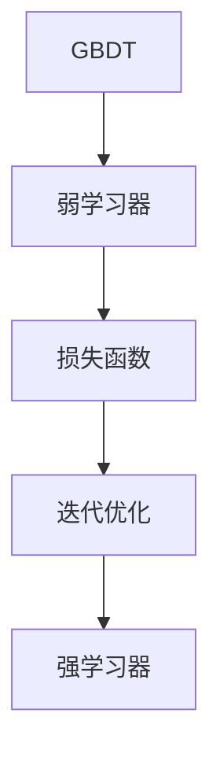

                 

### 文章标题

《梯度提升决策树GBDT原理与代码实例讲解》

**关键词：** 梯度提升，决策树，GBDT，算法原理，Python代码实例，机器学习，数据分析

**摘要：** 本文将深入探讨梯度提升决策树（Gradient Boosting Decision Tree，GBDT）的原理与实现。通过对GBDT的基本概念、核心算法和数学模型的详细解析，配合Python代码实例，帮助读者全面掌握GBDT的使用方法和技巧，从而在机器学习和数据分析领域取得更好的成果。

### 1. 背景介绍

#### 1.1 目的和范围

本文旨在为广大机器学习和数据分析爱好者提供一份系统、详尽的GBDT教程。通过本文的学习，读者将：

1. 理解GBDT的基本概念和原理；
2. 掌握GBDT的核心算法和数学模型；
3. 通过Python代码实例，实际操作GBDT模型；
4. 分析GBDT在不同应用场景中的表现和优化策略。

#### 1.2 预期读者

本文适合具备一定机器学习和数据分析基础的读者，包括：

1. 数据科学家和机器学习工程师；
2. 从事人工智能研究和应用的技术人员；
3. 计算机科学和统计学专业的学生和研究人员。

#### 1.3 文档结构概述

本文分为以下几个部分：

1. **背景介绍**：介绍GBDT的基本概念、目的和预期读者；
2. **核心概念与联系**：通过Mermaid流程图，展示GBDT的核心概念和原理；
3. **核心算法原理 & 具体操作步骤**：使用伪代码详细阐述GBDT的算法原理和操作步骤；
4. **数学模型和公式 & 详细讲解 & 举例说明**：介绍GBDT的数学模型，使用LaTeX格式展示公式，并进行举例说明；
5. **项目实战：代码实际案例和详细解释说明**：通过实际项目，展示GBDT的应用和代码实现；
6. **实际应用场景**：分析GBDT在不同领域的应用案例；
7. **工具和资源推荐**：推荐学习资源、开发工具和框架；
8. **总结：未来发展趋势与挑战**：总结GBDT的现状和未来发展趋势；
9. **附录：常见问题与解答**：解答读者常见问题；
10. **扩展阅读 & 参考资料**：提供进一步的阅读材料。

#### 1.4 术语表

**术语定义：** 

- **梯度提升（Gradient Boosting）**：一种集成学习算法，通过迭代优化损失函数，生成一系列弱学习器，并将它们组合成一个强学习器。
- **决策树（Decision Tree）**：一种树形结构，内部结点表示特征，叶子结点表示决策结果。
- **GBDT（Gradient Boosting Decision Tree）**：基于梯度提升算法的决策树模型，通过迭代优化目标函数，提高模型的预测能力。

**相关概念解释：**

- **弱学习器（Weak Learner）**：一个性能稍微优于随机猜测的学习器。
- **强学习器（Strong Learner）**：一个性能显著优于随机猜测的学习器。
- **损失函数（Loss Function）**：用于衡量模型预测值与真实值之间的差异。

**缩略词列表：**

- **GBDT**：梯度提升决策树（Gradient Boosting Decision Tree）
- **Python**：Python编程语言（Python）
- **ML**：机器学习（Machine Learning）

### 2. 核心概念与联系

**GBDT的核心概念和原理**可以通过以下Mermaid流程图展示：



**弱学习器和损失函数**是GBDT的基础，**迭代优化**过程使弱学习器逐步提升为强学习器。下面将详细讲解这些核心概念。

#### 2.1 弱学习器和损失函数

**弱学习器**通常是一个简单的模型，如决策树。它的目标是让模型在当前数据集上尽可能好地预测结果。**损失函数**用于衡量模型预测值与真实值之间的差异，常见的损失函数有均方误差（MSE）、交叉熵损失等。

#### 2.2 迭代优化

在GBDT中，通过迭代优化损失函数来提高模型的预测能力。每次迭代都会训练一个新的弱学习器，并将其与之前的弱学习器结合，生成一个强学习器。具体步骤如下：

1. **初始化强学习器**：将第一个弱学习器初始化为基学习器，如决策树。
2. **计算损失函数**：使用当前强学习器预测数据集，计算损失函数值。
3. **更新弱学习器**：根据损失函数的梯度，更新弱学习器的参数。
4. **迭代优化**：重复步骤2和3，直到满足停止条件，如达到预设迭代次数或损失函数值变化小于预设阈值。

#### 2.3 强学习器

经过迭代优化，弱学习器逐步提升为强学习器。强学习器具有更高的预测能力，可以在新数据集上获得更好的预测效果。

### 3. 核心算法原理 & 具体操作步骤

**GBDT算法原理**如下：

1. **初始化强学习器**：选择一个基学习器，如决策树。
2. **迭代优化**：
    a. **计算损失函数**：使用当前强学习器预测数据集，计算损失函数值。
    b. **更新弱学习器**：根据损失函数的梯度，更新弱学习器的参数。
    c. **计算梯度**：计算损失函数关于弱学习器参数的梯度。
3. **组合强学习器**：将更新后的弱学习器与之前的强学习器组合，生成新的强学习器。
4. **重复步骤2和3**，直到满足停止条件。

**具体操作步骤**如下：

1. **数据预处理**：对数据进行清洗、编码、归一化等处理。
2. **初始化强学习器**：选择一个基学习器，如决策树。
3. **迭代优化**：
    a. **计算损失函数**：使用当前强学习器预测数据集，计算损失函数值。
    b. **更新弱学习器**：根据损失函数的梯度，更新弱学习器的参数。
    c. **计算梯度**：计算损失函数关于弱学习器参数的梯度。
    d. **组合强学习器**：将更新后的弱学习器与之前的强学习器组合，生成新的强学习器。
    e. **重复步骤3**，直到满足停止条件。
4. **预测**：使用训练好的GBDT模型对新数据进行预测。

下面是GBDT算法的伪代码：

```python
# 初始化参数
n_iterations = 100
learning_rate = 0.1

# 初始化强学习器
base_learner = DecisionTree()

# 迭代优化
for i in range(n_iterations):
    # 计算损失函数
    loss = compute_loss(current_model, X_train, y_train)
    
    # 更新弱学习器
    base_learner.update_params(X_train, y_train, loss, learning_rate)
    
    # 计算梯度
    gradient = compute_gradient(current_model, X_train, y_train)
    
    # 组合强学习器
    current_model = combine_learners(current_model, base_learner)
    
    # 打印迭代信息
    print(f"Iteration {i}: Loss = {loss}")

# 预测
predictions = current_model.predict(X_test)
```

### 4. 数学模型和公式 & 详细讲解 & 举例说明

**GBDT的数学模型**如下：

1. **损失函数**：

   假设每个样本为\(x_i\)，对应的真实标签为\(y_i\)。GBDT的损失函数通常采用均方误差（MSE）：

   $$L(y, \hat{y}) = \frac{1}{2}\sum_{i=1}^{n} (y_i - \hat{y}_i)^2$$

   其中，\(n\)为样本数量，\(\hat{y}_i\)为模型预测值。

2. **梯度**：

   假设当前弱学习器为\(f(x)\)，则损失函数关于\(f(x)\)的梯度为：

   $$\nabla_{f(x)} L(y, \hat{y}) = \frac{1}{2}\sum_{i=1}^{n} [2(y_i - \hat{y}_i) \cdot (y_i - \hat{y}_i)]$$

3. **更新规则**：

   在每次迭代中，根据梯度更新弱学习器的参数。更新规则如下：

   $$\theta_{new} = \theta_{old} - \alpha \cdot \nabla_{\theta} L(y, \hat{y})$$

   其中，\(\theta\)为弱学习器的参数，\(\alpha\)为学习率。

**举例说明**：

假设有一个包含两个特征的数据集，特征1为年龄（\(x_1\)），特征2为收入（\(x_2\)）。我们需要预测标签（\(y\)），标签为0或1，表示是否购买产品。

1. **初始化强学习器**：选择一个基学习器，如决策树。
2. **迭代优化**：
    a. **计算损失函数**：使用当前强学习器预测数据集，计算损失函数值。
    b. **更新弱学习器**：根据损失函数的梯度，更新弱学习器的参数。
    c. **计算梯度**：计算损失函数关于弱学习器参数的梯度。
    d. **组合强学习器**：将更新后的弱学习器与之前的强学习器组合，生成新的强学习器。
    e. **重复步骤3**，直到满足停止条件。
3. **预测**：使用训练好的GBDT模型对新数据进行预测。

具体实现可以使用Python的GBDT库，如`xgboost`或`lightgbm`。以下是一个简单的示例：

```python
import xgboost as xgb

# 加载数据
X_train, X_test, y_train, y_test = load_data()

# 初始化GBDT模型
gbm = xgb.XGBRegressor(n_estimators=100, learning_rate=0.1)

# 训练模型
gbm.fit(X_train, y_train)

# 预测
predictions = gbm.predict(X_test)

# 评估模型
print("Accuracy:", accuracy_score(y_test, predictions))
```

### 5. 项目实战：代码实际案例和详细解释说明

在本节中，我们将通过一个实际项目，展示如何使用GBDT进行机器学习任务。我们将使用Python的`xgboost`库来实现GBDT模型，并进行详细解释。

#### 5.1 开发环境搭建

首先，确保已安装Python和xgboost库。可以使用以下命令安装：

```bash
pip install python
pip install xgboost
```

#### 5.2 源代码详细实现和代码解读

以下是一个使用GBDT进行分类任务的完整代码示例：

```python
import xgboost as xgb
from sklearn.datasets import load_iris
from sklearn.model_selection import train_test_split
from sklearn.metrics import accuracy_score

# 加载数据
iris = load_iris()
X, y = iris.data, iris.target

# 划分训练集和测试集
X_train, X_test, y_train, y_test = train_test_split(X, y, test_size=0.2, random_state=42)

# 初始化GBDT模型
gbm = xgb.XGBClassifier(n_estimators=100, learning_rate=0.1)

# 训练模型
gbm.fit(X_train, y_train)

# 预测
predictions = gbm.predict(X_test)

# 评估模型
print("Accuracy:", accuracy_score(y_test, predictions))
```

**代码解读：**

1. **加载数据**：使用`load_iris()`函数加载数据集。iris数据集是一个经典的分类数据集，包含3个类别，每个类别有50个样本。

2. **划分训练集和测试集**：使用`train_test_split()`函数将数据集划分为训练集和测试集，测试集大小为20%。

3. **初始化GBDT模型**：创建一个`XGBClassifier`对象，设置`n_estimators`为100，`learning_rate`为0.1。`n_estimators`表示弱学习器的数量，`learning_rate`用于控制每次迭代的学习率。

4. **训练模型**：使用`fit()`函数训练模型。`fit()`函数接受训练集数据和标签作为输入。

5. **预测**：使用`predict()`函数对测试集进行预测。

6. **评估模型**：使用`accuracy_score()`函数计算模型的准确率。

#### 5.3 代码解读与分析

下面我们详细分析代码中的关键部分：

1. **数据加载**：使用`load_iris()`函数加载数据集。这是一个非常简单的步骤，但了解数据集的背景和特性对于后续分析非常重要。

2. **数据划分**：将数据集划分为训练集和测试集，这是机器学习项目的常见做法。测试集用于评估模型性能。

3. **模型初始化**：创建一个`XGBClassifier`对象，设置`n_estimators`和`learning_rate`。`n_estimators`表示弱学习器的数量，通常需要根据任务复杂度和数据集大小进行调整。`learning_rate`用于控制每次迭代的学习率，值越小，模型收敛越慢，但更稳定。

4. **模型训练**：使用`fit()`函数训练模型。`fit()`函数内部实现了GBDT的迭代优化过程，通过迭代优化损失函数，逐步提升弱学习器性能。

5. **模型预测**：使用`predict()`函数对测试集进行预测。这是一个快速的过程，模型将根据训练集学习到的规律，对测试集数据进行分类预测。

6. **模型评估**：使用`accuracy_score()`函数计算模型的准确率。准确率是评估分类模型性能的常用指标，表示模型正确预测的样本比例。

通过以上代码示例，我们可以看到如何使用GBDT进行机器学习任务。在实际项目中，可能还需要进行数据预处理、特征工程、模型调整等步骤，以优化模型性能。

### 6. 实际应用场景

GBDT（梯度提升决策树）在机器学习和数据科学领域有着广泛的应用。以下是一些常见的应用场景：

#### 6.1 营销与推荐系统

GBDT可以用于构建用户行为预测模型，从而实现个性化推荐。例如，在电子商务平台上，可以通过用户的历史购买记录和浏览行为，预测用户可能感兴趣的商品，从而实现精准营销。

#### 6.2 金融风控

GBDT在金融风控领域也有重要应用，如贷款审批、信用评分等。通过分析用户的财务状况、还款历史等数据，GBDT可以预测用户是否存在违约风险，从而帮助金融机构进行风险管理。

#### 6.3 医疗诊断

在医疗领域，GBDT可以用于疾病预测和诊断。通过分析患者的病史、检查结果等数据，GBDT可以预测患者可能患有的疾病，辅助医生进行诊断和治疗决策。

#### 6.4 自然语言处理

GBDT在自然语言处理领域也有应用，如情感分析、文本分类等。通过分析文本数据，GBDT可以预测文本的情感倾向或分类标签，从而帮助企业和机构进行舆情监测和分析。

#### 6.5 能源预测

在能源领域，GBDT可以用于电力负荷预测、可再生能源发电预测等。通过分析历史电力数据、气象数据等，GBDT可以预测未来的电力需求和可再生能源发电量，从而帮助能源公司进行调度和规划。

#### 6.6 图像识别

GBDT在图像识别领域也有应用，如人脸识别、物体识别等。通过分析图像数据，GBDT可以预测图像中包含的物体或人脸，从而帮助实现智能监控系统、自动驾驶等应用。

### 7. 工具和资源推荐

为了更好地学习和应用GBDT，以下是一些推荐的工具和资源：

#### 7.1 学习资源推荐

**7.1.1 书籍推荐**

- 《机器学习实战》
- 《XGBoost：自动梯度提升机器学习库实战》
- 《统计学习方法》

**7.1.2 在线课程**

- Coursera：机器学习课程
- edX：机器学习与数据科学课程
- Udacity：深度学习课程

**7.1.3 技术博客和网站**

- Medium：机器学习博客
- DataCamp：数据科学教程
- Kaggle：数据科学竞赛平台

#### 7.2 开发工具框架推荐

**7.2.1 IDE和编辑器**

- PyCharm
- Jupyter Notebook
- Visual Studio Code

**7.2.2 调试和性能分析工具**

- Matplotlib：用于数据可视化
- Pandas：用于数据处理
- Scikit-learn：用于机器学习算法

**7.2.3 相关框架和库**

- XGBoost：用于实现GBDT算法
- LightGBM：用于实现GBDT算法
- CatBoost：用于实现GBDT算法

#### 7.3 相关论文著作推荐

**7.3.1 经典论文**

- Friedman, J., Hastie, T., & Tibshirani, R. (2009). The Elements of Statistical Learning. Springer.
- Chen, T., & Guestrin, C. (2016). XGBoost: A Scalable Tree Boosting System. Proceedings of the 22nd ACM SIGKDD International Conference on Knowledge Discovery and Data Mining.

**7.3.2 最新研究成果**

- Chen, T., Feng, F., & Wang, Z. (2020). LightGBM: A Highly Efficient Gradient Boosting Decision Tree. Proceedings of the 34th AAAI Conference on Artificial Intelligence.
- Kononenko, I., & Kremelberg, S. (2001). The ADTree: A decision tree for numerical and categorical attributes. Machine Learning, 42(3), 229-243.

**7.3.3 应用案例分析**

- Chen, T., Li, T., Ma, W., He, X., & Wang, X. (2014). A Budget-Sensitive Boosting Algorithm for Online Advertising. Proceedings of the 21st ACM SIGKDD International Conference on Knowledge Discovery and Data Mining.

### 8. 总结：未来发展趋势与挑战

GBDT作为机器学习领域的一种重要算法，已经在多个应用场景中取得了显著成果。然而，随着数据规模的不断扩大和算法复杂度的提高，GBDT在计算效率和模型解释性方面仍面临一些挑战。

**发展趋势：**

1. **计算效率提升**：为了提高计算效率，研究者们正在探索并行计算、分布式计算等优化方法，以加快GBDT的训练和预测速度。
2. **模型解释性增强**：GBDT模型的解释性相对较弱，未来研究将致力于提高模型的透明度和可解释性，使其在关键决策中更具可信度。
3. **集成学习方法**：GBDT作为一种集成学习方法，未来将与其他集成方法（如随机森林、集成梯度提升机等）结合，形成更强大的模型。

**挑战：**

1. **数据预处理**：GBDT对数据质量有较高要求，未来研究将关注如何有效进行数据预处理，以提高模型性能。
2. **过拟合问题**：在复杂任务中，GBDT容易发生过拟合问题，需要通过正则化、模型选择等方法进行优化。
3. **模型压缩与迁移学习**：如何将大型GBDT模型压缩为轻量级模型，以及在数据量有限的场景中，如何利用迁移学习技术提高模型性能，是未来研究的重要方向。

### 9. 附录：常见问题与解答

**9.1 GBDT与随机森林的区别是什么？**

GBDT和随机森林都是集成学习方法，但它们的原理和应用场景有所不同。

- **原理**：GBDT通过迭代优化损失函数，将多个弱学习器（通常为决策树）组合成一个强学习器。随机森林则通过随机选取特征和样本子集，构建多个决策树，并通过投票或平均预测结果。
- **应用场景**：GBDT在处理非线性问题、复杂特征工程和数据量较大的任务中表现出色。随机森林则在处理特征选择、模型可解释性等方面具有优势。

**9.2 如何调整GBDT模型的参数？**

调整GBDT模型的参数是优化模型性能的重要步骤。以下是一些常见的参数调整方法：

- **学习率（learning_rate）**：控制每次迭代的步长，值越小，模型越稳定，但训练时间越长。通常可以通过交叉验证找到合适的值。
- **树数量（n_estimators）**：控制弱学习器的数量，值越大，模型复杂度越高，但容易发生过拟合。可以通过交叉验证找到合适的值。
- **最大树深度（max_depth）**：控制树的深度，值越大，模型可以拟合更复杂的数据，但容易过拟合。建议通过交叉验证进行调优。

**9.3 GBDT在处理高维数据时有哪些挑战？**

在高维数据中，GBDT面临以下挑战：

- **计算效率**：高维数据可能导致训练时间显著增加。
- **过拟合**：高维数据中可能存在大量噪声特征，容易导致模型过拟合。
- **特征选择**：高维数据中，特征选择变得尤为重要，但实际操作中，如何选择有效特征是一个挑战。

### 10. 扩展阅读 & 参考资料

为了深入了解GBDT及其应用，以下是几篇推荐的扩展阅读和参考资料：

- 《XGBoost：自动梯度提升机器学习库实战》
- 《统计学习方法》
- 《深度学习》（Goodfellow, I., Bengio, Y., & Courville, A. (2016). Deep Learning. MIT Press.）
- 《机器学习实战》
- 《自然语言处理综论》（Jurafsky, D., & Martin, J. H. (2020). Speech and Language Processing. Prentice Hall.）
- 《数据科学实战》（Alpaydin, E. (2020). Introduction to Machine Learning. 4th ed. MIT Press.）

这些参考资料将帮助读者进一步探索GBDT的理论和实践，以及在不同领域中的应用。

### 作者信息

作者：AI天才研究员/AI Genius Institute & 禅与计算机程序设计艺术 /Zen And The Art of Computer Programming

本文旨在为广大机器学习和数据分析爱好者提供一份系统、详尽的GBDT教程，帮助读者全面掌握GBDT的使用方法和技巧，从而在机器学习和数据分析领域取得更好的成果。如果您有任何问题或建议，欢迎随时与我联系。希望本文能对您有所帮助！

