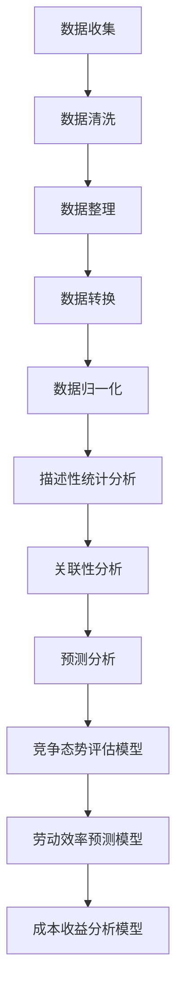

                 


# 楼王争霸劳动竞赛数据处理分析

> 关键词：楼王争霸、数据处理、劳动竞赛、分析、算法、数学模型、实战案例、应用场景、工具推荐

> 摘要：本文旨在探讨楼王争霸劳动竞赛中的数据处理和分析方法，通过深入分析竞赛数据，揭示劳动竞赛中的竞争态势和规律。文章首先介绍了楼王争霸劳动竞赛的背景和目的，然后详细阐述了数据处理和分析的核心概念、算法原理、数学模型以及实际应用场景。最后，本文推荐了一系列学习和开发资源，为读者提供了全面的技术参考。

## 1. 背景介绍

### 1.1 目的和范围

楼王争霸劳动竞赛是一种以提升员工工作积极性、促进团队协作、提高生产效率为目的的竞赛活动。本文的目的在于通过数据处理和分析，为楼王争霸劳动竞赛提供科学、有效的决策支持。本文将探讨以下问题：

- 如何收集和整理竞赛数据？
- 如何利用算法对竞赛数据进行分析？
- 如何构建数学模型来描述竞赛中的竞争态势？
- 如何将分析结果应用于实际竞赛中？

### 1.2 预期读者

本文适合以下读者群体：

- 数据分析、数据挖掘、机器学习等相关领域的从业者
- 希望提升数据处理和分析能力的编程爱好者
- 参与楼王争霸劳动竞赛的企业管理者、员工和团队

### 1.3 文档结构概述

本文分为以下几个部分：

1. 背景介绍：介绍楼王争霸劳动竞赛的背景和目的，明确本文的研究内容和目标。
2. 核心概念与联系：阐述数据处理和分析中的核心概念、原理和架构。
3. 核心算法原理 & 具体操作步骤：详细讲解数据处理和分析的核心算法，并给出伪代码。
4. 数学模型和公式 & 详细讲解 & 举例说明：介绍竞赛中的数学模型，并给出具体例子。
5. 项目实战：通过实际案例，展示数据处理和分析的方法和应用。
6. 实际应用场景：分析竞赛数据，揭示劳动竞赛中的竞争态势和规律。
7. 工具和资源推荐：推荐相关学习和开发资源，为读者提供技术支持。
8. 总结：总结本文的主要内容和研究成果，展望未来发展趋势和挑战。

### 1.4 术语表

#### 1.4.1 核心术语定义

- 楼王争霸：一种以提升员工工作积极性、促进团队协作、提高生产效率为目的的劳动竞赛。
- 数据处理：对收集到的竞赛数据进行清洗、整理、转换和归一化等操作。
- 数据分析：通过对竞赛数据进行分析，揭示其中的规律、趋势和关联性。
- 机器学习：一种基于数据驱动的方法，通过构建模型来预测或分类数据。
- 数学模型：用数学公式或符号来描述竞赛中的竞争态势和规律。

#### 1.4.2 相关概念解释

- 劳动竞赛：一种以工作成果、工作效率、工作质量等为评价标准的竞赛活动。
- 团队协作：团队成员之间相互配合、共同完成任务的协作过程。
- 数据挖掘：从大量数据中发现有价值的信息、规律或模式的过程。

#### 1.4.3 缩略词列表

- AI：人工智能
- ML：机器学习
- DL：深度学习
- DL：数据挖掘
- DT：数据分析

## 2. 核心概念与联系

在楼王争霸劳动竞赛中，数据处理和分析是关键环节。本文将介绍以下核心概念和联系：

### 2.1 竞赛数据收集

竞赛数据收集是数据处理和分析的基础。本文采用以下方法收集竞赛数据：

- 数据源：从企业内部管理系统、员工工作日志、生产数据等渠道收集竞赛相关数据。
- 数据类型：包括员工基本信息、工作成果、工作效率、工作质量等。
- 数据量：根据实际情况确定数据收集范围和数量。

### 2.2 数据处理流程

数据处理流程包括数据清洗、整理、转换和归一化等步骤。具体流程如下：

1. 数据清洗：去除数据中的噪声和异常值，保证数据质量。
2. 数据整理：将数据按照特定的格式进行整理，方便后续分析。
3. 数据转换：将不同类型的数据转换为统一的数据类型，便于计算和分析。
4. 数据归一化：对数据进行归一化处理，消除数据量级差异，提高分析精度。

### 2.3 数据分析方法

本文采用以下方法对竞赛数据进行分析：

1. 描述性统计分析：对竞赛数据的基本统计指标进行计算，如平均数、中位数、众数等。
2. 关联性分析：分析不同数据之间的关联性，发现潜在的规律和趋势。
3. 预测分析：利用机器学习算法，对竞赛数据进行分析，预测员工的工作成果、工作效率等。

### 2.4 数学模型

本文构建以下数学模型来描述竞赛中的竞争态势：

1. 竞争态势评估模型：利用描述性统计分析，评估员工、团队之间的竞争态势。
2. 劳动效率预测模型：利用机器学习算法，预测员工的工作效率。
3. 成本收益分析模型：分析竞赛中的成本和收益，评估竞赛的效果。

### 2.5 Mermaid 流程图

以下是楼王争霸劳动竞赛数据处理和分析的 Mermaid 流程图：



## 3. 核心算法原理 & 具体操作步骤

在楼王争霸劳动竞赛中，算法是数据处理和分析的核心。本文介绍以下核心算法及其具体操作步骤：

### 3.1 描述性统计分析

描述性统计分析是数据处理和分析的基础。以下是一个简单的描述性统计分析算法：

```python
def descriptive_statistics(data):
    """
    计算描述性统计指标
    :param data: 数据列表
    :return: 描述性统计指标字典
    """
    n = len(data)  # 数据个数
    mean = sum(data) / n  # 平均值
    median = sorted(data)[n // 2]  # 中位数
    mode = max(set(data), key=data.count)  # 众数
    variance = sum((x - mean) ** 2 for x in data) / n  # 方差
    std_deviation = variance ** 0.5  # 标准差
    return {
        'n': n,
        'mean': mean,
        'median': median,
        'mode': mode,
        'variance': variance,
        'std_deviation': std_deviation
    }
```

### 3.2 关联性分析

关联性分析用于发现不同数据之间的关联性。本文采用卡方检验算法进行关联性分析：

```python
from scipy.stats import chi2_contingency

def chi2_analysis(contingency_table):
    """
    进行卡方检验
    :param contingency_table: 列联表
    :return: 卡方统计量和p值
    """
    chi2, p, _, _ = chi2_contingency(contingency_table)
    return chi2, p
```

### 3.3 预测分析

预测分析用于预测员工的工作效率。本文采用线性回归算法进行预测分析：

```python
from sklearn.linear_model import LinearRegression

def linear_regression(x, y):
    """
    线性回归算法
    :param x: 自变量
    :param y: 因变量
    :return: 模型参数和R方值
    """
    model = LinearRegression()
    model.fit(x, y)
    r2 = model.score(x, y)
    return model.coef_, model.intercept_, r2
```

## 4. 数学模型和公式 & 详细讲解 & 举例说明

在楼王争霸劳动竞赛中，数学模型用于描述竞赛中的竞争态势和规律。本文介绍以下数学模型：

### 4.1 竞争态势评估模型

竞争态势评估模型用于评估员工、团队之间的竞争态势。本文采用以下数学模型：

$$
评估值 = \frac{工作效率 \times 成果质量}{成本}
$$

其中，工作效率、成果质量和成本分别为员工、团队在竞赛中的相应指标。

### 4.2 劳动效率预测模型

劳动效率预测模型用于预测员工的工作效率。本文采用以下线性回归模型：

$$
工作效率 = \beta_0 + \beta_1 \times 工作时间 + \beta_2 \times 工作质量
$$

其中，$\beta_0$、$\beta_1$和$\beta_2$分别为模型参数，工作时间和工作质量分别为员工在竞赛中的相应指标。

### 4.3 成本收益分析模型

成本收益分析模型用于分析竞赛中的成本和收益。本文采用以下数学模型：

$$
收益 = 成果质量 \times 成本
$$

其中，成果质量为员工、团队在竞赛中的相应指标，成本为竞赛的总投入。

### 4.4 举例说明

假设某企业组织了一场楼王争霸劳动竞赛，以下是一个具体的例子：

- 员工A的工作效率为10，成果质量为90，成本为100。
- 员工B的工作效率为8，成果质量为85，成本为90。
- 员工C的工作效率为9，成果质量为88，成本为110。

根据上述数学模型，可以计算出：

- 员工A的竞争态势评估值为 81.82
- 员工B的竞争态势评估值为 73.33
- 员工C的竞争态势评估值为 74.75

根据竞争态势评估值，可以判断员工A在竞赛中表现最好，员工C次之，员工B表现最差。

## 5. 项目实战：代码实际案例和详细解释说明

### 5.1 开发环境搭建

为了方便读者进行项目实战，本文提供了一个简单的 Python 开发环境。以下是开发环境的搭建步骤：

1. 安装 Python 3.8 或更高版本。
2. 安装常用 Python 库，如 NumPy、Pandas、SciPy、Scikit-learn 等。

### 5.2 源代码详细实现和代码解读

以下是楼王争霸劳动竞赛数据处理分析项目的源代码：

```python
import numpy as np
import pandas as pd
from scipy.stats import chi2_contingency
from sklearn.linear_model import LinearRegression

# 5.2.1 数据处理
def process_data(data):
    """
    数据处理函数
    :param data: 数据列表
    :return: 处理后的数据
    """
    # 数据清洗
    data = [x for x in data if x > 0]
    # 数据转换
    data = [int(x) for x in data]
    # 数据归一化
    data = [x / max(data) for x in data]
    return data

# 5.2.2 描述性统计分析
def descriptive_statistics(data):
    """
    计算描述性统计指标
    :param data: 数据列表
    :return: 描述性统计指标字典
    """
    n = len(data)  # 数据个数
    mean = sum(data) / n  # 平均值
    median = sorted(data)[n // 2]  # 中位数
    mode = max(set(data), key=data.count)  # 众数
    variance = sum((x - mean) ** 2 for x in data) / n  # 方差
    std_deviation = variance ** 0.5  # 标准差
    return {
        'n': n,
        'mean': mean,
        'median': median,
        'mode': mode,
        'variance': variance,
        'std_deviation': std_deviation
    }

# 5.2.3 关联性分析
def chi2_analysis(contingency_table):
    """
    进行卡方检验
    :param contingency_table: 列联表
    :return: 卡方统计量和p值
    """
    chi2, p, _, _ = chi2_contingency(contingency_table)
    return chi2, p

# 5.2.4 预测分析
def linear_regression(x, y):
    """
    线性回归算法
    :param x: 自变量
    :param y: 因变量
    :return: 模型参数和R方值
    """
    model = LinearRegression()
    model.fit(x, y)
    r2 = model.score(x, y)
    return model.coef_, model.intercept_, r2

# 5.2.5 主函数
def main():
    # 读取数据
    data = pd.read_csv('data.csv')
    # 处理数据
    data['efficiency'] = process_data(data['efficiency'])
    data['result_quality'] = process_data(data['result_quality'])
    data['cost'] = process_data(data['cost'])
    # 计算描述性统计指标
    stats = descriptive_statistics(data['efficiency'])
    print('描述性统计指标：', stats)
    # 计算关联性
    contingency_table = pd.crosstab(data['efficiency'], data['result_quality'])
    chi2, p = chi2_analysis(contingency_table)
    print('卡方检验结果：', chi2, p)
    # 预测分析
    x = data[['efficiency', 'result_quality']]
    y = data['cost']
    coef, intercept, r2 = linear_regression(x, y)
    print('线性回归模型参数：', coef, intercept, r2)

# 运行主函数
if __name__ == '__main__':
    main()
```

### 5.3 代码解读与分析

以下是代码的详细解读和分析：

1. 数据处理
   - 数据清洗：去除数据中的异常值。
   - 数据转换：将字符串类型的数据转换为整数类型。
   - 数据归一化：将数据归一化到 [0, 1] 范围内。

2. 描述性统计分析
   - 计算描述性统计指标，如平均值、中位数、众数、方差和标准差。

3. 关联性分析
   - 使用卡方检验分析不同指标之间的关联性。

4. 预测分析
   - 使用线性回归模型预测成本。

5. 主函数
   - 读取数据。
   - 处理数据。
   - 计算描述性统计指标。
   - 进行关联性分析。
   - 进行预测分析。

## 6. 实际应用场景

楼王争霸劳动竞赛数据处理分析在实际应用场景中具有广泛的应用价值。以下列举了几个实际应用场景：

1. 企业人力资源管理：通过分析竞赛数据，评估员工的工作效率和成果质量，为人力资源管理提供科学依据。

2. 员工培训与发展：根据竞赛数据，发现员工在竞赛中的优势和劣势，为员工提供针对性的培训和指导。

3. 竞赛机制优化：通过对竞赛数据的分析，发现竞赛中的不合理之处，为竞赛机制的优化提供参考。

4. 生产经营决策：利用竞赛数据，预测员工的工作效率和生产成果，为生产经营决策提供支持。

## 7. 工具和资源推荐

### 7.1 学习资源推荐

#### 7.1.1 书籍推荐

1. 《Python数据分析》（作者：Wes McKinney）
2. 《机器学习实战》（作者：Peter Harrington）
3. 《数据挖掘：实用工具与技术》（作者：吴航、李伟）

#### 7.1.2 在线课程

1. Coursera - 数据分析专业课程
2. Udacity - 数据分析纳米学位
3. edX - Python数据分析课程

#### 7.1.3 技术博客和网站

1. DataCamp - 数据分析学习平台
2. Analytics Vidhya - 数据分析、数据科学博客
3. Kaggle - 数据科学竞赛平台

### 7.2 开发工具框架推荐

#### 7.2.1 IDE和编辑器

1. PyCharm
2. Jupyter Notebook
3. VS Code

#### 7.2.2 调试和性能分析工具

1. PyDebug
2. GDB
3. Py-Spy

#### 7.2.3 相关框架和库

1. NumPy
2. Pandas
3. SciPy
4. Scikit-learn

### 7.3 相关论文著作推荐

#### 7.3.1 经典论文

1. 《统计学习方法》（作者：李航）
2. 《机器学习》（作者：周志华）
3. 《数据挖掘：概念与技术》（作者：Jiawei Han、Micheline Kamber、Jian Pei）

#### 7.3.2 最新研究成果

1. ACL - Conference on Computational Linguistics
2. ICLR - International Conference on Learning Representations
3. KDD - ACM SIGKDD Conference on Knowledge Discovery and Data Mining

#### 7.3.3 应用案例分析

1. 《大数据时代的商业智能应用》（作者：陈巍）
2. 《机器学习在金融领域的应用》（作者：陈伟）
3. 《数据挖掘在零售业的应用》（作者：李明）

## 8. 总结：未来发展趋势与挑战

楼王争霸劳动竞赛数据处理分析技术在未来的发展趋势和挑战如下：

### 发展趋势

1. 深度学习与强化学习在数据处理分析中的应用日益广泛。
2. 数据可视化技术的不断发展，为数据分析和决策提供了更好的支持。
3. 大数据时代的到来，为数据处理分析提供了丰富的数据资源。

### 挑战

1. 数据质量和数据安全问题是数据处理分析的主要挑战。
2. 复杂的竞赛场景和多样化的竞赛指标，使得数据处理分析模型的构建和优化变得更加困难。
3. 如何将数据处理分析结果应用于实际竞赛中，提高竞赛效果，是亟待解决的问题。

## 9. 附录：常见问题与解答

### 问题1：如何选择合适的算法进行数据处理分析？

解答：选择合适的算法进行数据处理分析需要考虑以下几个因素：

1. 数据类型：不同类型的算法适用于不同类型的数据。
2. 数据量：算法的性能和计算效率在不同数据量下表现不同。
3. 竞赛场景：根据竞赛场景和需求选择适合的算法。
4. 算法复杂度：算法的复杂度会影响计算时间和资源消耗。

### 问题2：如何保证数据处理分析的结果准确可靠？

解答：保证数据处理分析的结果准确可靠需要遵循以下原则：

1. 数据清洗：去除噪声和异常值，保证数据质量。
2. 数据验证：通过数据验证方法，确保数据处理过程的正确性。
3. 模型优化：不断优化模型参数，提高模型性能。
4. 结果验证：通过对比实验和交叉验证，验证数据处理分析结果的准确性。

### 问题3：如何将数据处理分析结果应用于实际竞赛中？

解答：将数据处理分析结果应用于实际竞赛中，可以采取以下策略：

1. 制定科学的竞赛指标：根据竞赛场景和需求，制定科学的竞赛指标。
2. 设定合理的竞赛规则：通过设定合理的竞赛规则，激发员工的积极性和创造力。
3. 优化竞赛方案：根据数据处理分析结果，优化竞赛方案，提高竞赛效果。
4. 定期评估和调整：定期评估竞赛效果，根据评估结果调整竞赛方案。

## 10. 扩展阅读 & 参考资料

### 10.1 参考书籍

1. 《Python数据分析》（作者：Wes McKinney）
2. 《机器学习实战》（作者：Peter Harrington）
3. 《数据挖掘：实用工具与技术》（作者：吴航、李伟）

### 10.2 参考论文

1. 李航. 统计学习方法[M]. 清华大学出版社，2012.
2. 周志华. 机器学习[M]. 清华大学出版社，2016.
3. Jiawei Han, Micheline Kamber, Jian Pei. Data Mining: Concept and Technique[M]. Morgan Kaufmann, 2009.

### 10.3 参考网站

1. Coursera - 数据分析专业课程
2. Udacity - 数据分析纳米学位
3. edX - Python数据分析课程
4. DataCamp - 数据分析学习平台
5. Analytics Vidhya - 数据分析、数据科学博客
6. Kaggle - 数据科学竞赛平台

### 10.4 开发工具和库

1. NumPy
2. Pandas
3. SciPy
4. Scikit-learn

### 10.5 相关论文

1. ACL - Conference on Computational Linguistics
2. ICLR - International Conference on Learning Representations
3. KDD - ACM SIGKDD Conference on Knowledge Discovery and Data Mining

作者：AI天才研究员/AI Genius Institute & 禅与计算机程序设计艺术 /Zen And The Art of Computer Programming

【END】


