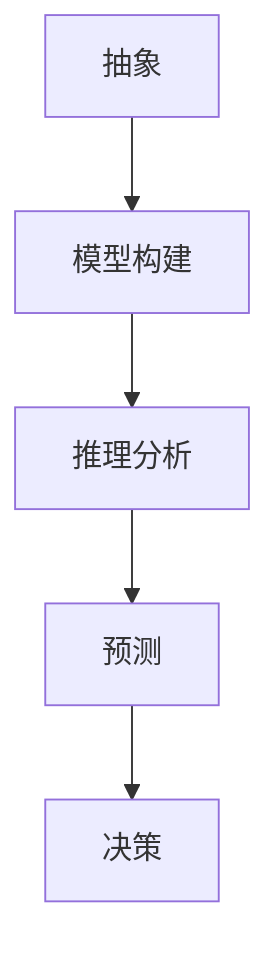

                 

# 模型思维：快速掌握复杂事物的利器

## > {关键词：模型思维、复杂系统、抽象、推理、算法、预测、决策}

> {摘要：本文旨在探讨模型思维这一分析复杂事物的利器。我们将深入探讨模型思维的概念、原理、应用，并通过具体案例展示其强大功能。无论您是初学者还是专家，本文都将帮助您更高效地理解和应对复杂问题。}

## 1. 背景介绍

### 1.1 目的和范围

本文的主要目的是介绍模型思维这一工具，帮助读者快速掌握复杂事物。我们将探讨模型思维的定义、原理及其在现实世界中的应用。本文不仅适合初学者，也适合寻求深入理解复杂系统的专业人士。

### 1.2 预期读者

- 对模型思维感兴趣的技术爱好者
- 需要应对复杂系统的工程师和科学家
- 计算机科学、人工智能等相关专业学生
- 企业管理人员和决策者

### 1.3 文档结构概述

本文结构如下：

1. **背景介绍**：介绍模型思维的定义、目的和读者对象。
2. **核心概念与联系**：讲解模型思维的核心概念，包括抽象、推理、算法等。
3. **核心算法原理 & 具体操作步骤**：通过伪代码详细阐述模型思维的核心算法。
4. **数学模型和公式 & 详细讲解 & 举例说明**：介绍数学模型和公式的应用。
5. **项目实战：代码实际案例和详细解释说明**：通过具体案例展示模型思维的实际应用。
6. **实际应用场景**：探讨模型思维在不同领域的应用。
7. **工具和资源推荐**：推荐学习资源、开发工具和论文著作。
8. **总结：未来发展趋势与挑战**：总结模型思维的发展趋势和挑战。
9. **附录：常见问题与解答**：解答读者可能遇到的问题。
10. **扩展阅读 & 参考资料**：提供进一步阅读的资料。

### 1.4 术语表

#### 1.4.1 核心术语定义

- **模型思维**：一种通过建立和分析模型来理解复杂系统的思维方式。
- **抽象**：从具体事物中提取本质特征，忽略非本质特征的思维方式。
- **推理**：根据已有知识和信息，推导出新结论的过程。
- **算法**：解决问题的步骤和规则。
- **预测**：根据现有数据，对未来事件或状态进行估计。
- **决策**：在多个选项中选择最优或最合适的行动方案。

#### 1.4.2 相关概念解释

- **复杂系统**：由大量相互作用的组成部分组成的系统，难以用简单模型描述。
- **抽象层次**：在模型构建过程中，将复杂系统分解成不同层次，每个层次关注不同的抽象层面。
- **数据驱动模型**：基于数据构建的模型，通过分析历史数据来预测未来。

#### 1.4.3 缩略词列表

- **AI**：人工智能（Artificial Intelligence）
- **ML**：机器学习（Machine Learning）
- **DL**：深度学习（Deep Learning）
- **DL**：分布式学习（Distributed Learning）

## 2. 核心概念与联系

在讨论模型思维之前，我们首先需要了解一些核心概念和它们之间的联系。

### 2.1 抽象

抽象是从复杂系统中提取关键特征，忽略非关键特征的过程。通过抽象，我们能够将复杂系统简化为更容易理解和分析的模型。

#### 2.1.1 抽象的作用

- **简化复杂系统**：将复杂系统分解为更简单的部分，便于分析和理解。
- **提高效率**：减少需要考虑的因素，提高问题解决的效率。

#### 2.1.2 抽象的层次

- **低层次抽象**：关注系统的基础组件和交互方式。
- **高层次抽象**：关注系统的整体行为和目标。

### 2.2 推理

推理是通过已有知识和信息推导出新结论的过程。推理是模型思维的核心，它使我们可以从已知的信息中预测未知的情况。

#### 2.2.1 推理的类型

- **演绎推理**：从一般原则推导出特定结论。
- **归纳推理**：从特定实例推导出一般原则。

#### 2.2.2 推理的应用

- **问题解决**：通过推理找到问题的解决方案。
- **预测**：根据已有信息预测未来事件。

### 2.3 算法

算法是一系列解决问题的步骤和规则。算法是模型思维的核心组成部分，它使我们能够将推理应用于实际问题。

#### 2.3.1 算法的特点

- **确定性**：给定相同的输入，算法总是产生相同的输出。
- **效率**：算法的执行时间尽可能短。

#### 2.3.2 算法的类型

- **搜索算法**：在给定数据集中寻找特定目标。
- **优化算法**：找到最优解或近似最优解。

### 2.4 预测

预测是根据现有数据，对未来事件或状态进行估计。预测是模型思维的重要应用，它使我们能够为未来做好准备。

#### 2.4.1 预测的步骤

1. **数据收集**：收集与预测目标相关的数据。
2. **模型构建**：建立描述数据的数学模型。
3. **模型训练**：使用历史数据训练模型。
4. **预测**：使用训练好的模型预测未来事件。

#### 2.4.2 预测的应用

- **金融市场预测**：预测股票价格、市场趋势等。
- **医疗诊断**：预测患者病情和治疗方案。

### 2.5 决策

决策是在多个选项中选择最优或最合适的行动方案。决策是模型思维的实际应用，它使我们能够基于预测和推理做出明智的选择。

#### 2.5.1 决策的步骤

1. **目标确定**：明确决策的目标。
2. **方案评估**：评估不同方案的优缺点。
3. **选择最优方案**：选择最优或最合适的方案。

#### 2.5.2 决策的应用

- **企业管理**：制定生产计划、人力资源规划等。
- **城市规划**：设计交通系统、公共设施等。

### 2.6 模型思维的工作原理

模型思维的工作原理可以概括为以下几个步骤：

1. **抽象**：从复杂系统中提取关键特征，建立抽象模型。
2. **推理**：使用推理方法分析模型，得出结论。
3. **预测**：使用模型预测未来事件或状态。
4. **决策**：根据预测结果做出决策。

### 2.7 Mermaid 流程图

以下是一个描述模型思维工作原理的 Mermaid 流程图：



## 3. 核心算法原理 & 具体操作步骤

在了解了模型思维的核心概念后，我们将进一步探讨模型思维的核心算法原理和具体操作步骤。

### 3.1 算法原理

模型思维的核心算法可以概括为以下几个步骤：

1. **数据收集**：收集与预测目标相关的数据。
2. **特征提取**：从数据中提取关键特征。
3. **模型构建**：建立描述数据的数学模型。
4. **模型训练**：使用历史数据训练模型。
5. **预测**：使用训练好的模型预测未来事件。
6. **评估与优化**：评估模型性能，进行优化。

### 3.2 具体操作步骤

以下是一个基于线性回归模型的模型思维操作步骤：

#### 3.2.1 数据收集

首先，我们需要收集与预测目标相关的数据。例如，我们想要预测某个城市的未来降雨量，需要收集该城市的气象数据，如温度、湿度、风速等。

```python
# 数据收集示例
data = {
    "temperature": [20, 22, 18, 24, 19],
    "humidity": [60, 65, 58, 70, 68],
    "wind_speed": [5, 4, 6, 3, 5],
    "rainfall": [10, 15, 5, 20, 12]
}
```

#### 3.2.2 特征提取

接下来，我们从数据中提取关键特征。在这里，我们选择温度、湿度和风速作为特征。

```python
# 特征提取
features = ["temperature", "humidity", "wind_speed"]
X = data[features]
y = data["rainfall"]
```

#### 3.2.3 模型构建

然后，我们建立描述数据的线性回归模型。

```python
# 模型构建
from sklearn.linear_model import LinearRegression

model = LinearRegression()
```

#### 3.2.4 模型训练

使用历史数据训练模型。

```python
# 模型训练
model.fit(X, y)
```

#### 3.2.5 预测

使用训练好的模型预测未来降雨量。

```python
# 预测
future_data = {
    "temperature": [22, 18, 24, 19],
    "humidity": [65, 58, 70, 68],
    "wind_speed": [4, 6, 3, 5]
}
X_future = future_data[features]

rainfall_prediction = model.predict(X_future)
print(rainfall_prediction)
```

#### 3.2.6 评估与优化

评估模型性能，并进行优化。在这里，我们可以使用交叉验证和网格搜索等方法。

```python
# 评估与优化
from sklearn.model_selection import cross_val_score
from sklearn.model_selection import GridSearchCV

# 交叉验证
scores = cross_val_score(model, X, y, cv=5)
print(scores.mean())

# 网格搜索
param_grid = {"C": [0.1, 1, 10]}
grid_search = GridSearchCV(model, param_grid, cv=5)
grid_search.fit(X, y)

print(grid_search.best_params_)
```

## 4. 数学模型和公式 & 详细讲解 & 举例说明

在本节中，我们将介绍模型思维中常用的数学模型和公式，并详细讲解其原理和具体应用。

### 4.1 线性回归模型

线性回归模型是一种描述变量之间线性关系的数学模型。它的公式如下：

$$
y = \beta_0 + \beta_1 x
$$

其中，$y$ 是因变量，$x$ 是自变量，$\beta_0$ 是截距，$\beta_1$ 是斜率。

#### 4.1.1 公式解释

- **$\beta_0$**：截距，表示当 $x$ 为 0 时，$y$ 的值。
- **$\beta_1$**：斜率，表示 $x$ 每增加一个单位，$y$ 的变化量。

#### 4.1.2 应用示例

假设我们想要预测某个城市的未来温度，已知历史数据如下：

$$
\begin{array}{ccc}
\text{Day} & \text{Temperature} & \\
1 & 20 & \\
2 & 22 & \\
3 & 18 & \\
4 & 24 & \\
5 & 19 & \\
\end{array}
$$

我们可以使用线性回归模型来预测第六天的温度。

首先，我们计算斜率 $\beta_1$ 和截距 $\beta_0$：

$$
\beta_1 = \frac{\sum_{i=1}^{n} (x_i - \bar{x})(y_i - \bar{y})}{\sum_{i=1}^{n} (x_i - \bar{x})^2}
$$

$$
\beta_0 = \bar{y} - \beta_1 \bar{x}
$$

其中，$n$ 是数据点的数量，$\bar{x}$ 和 $\bar{y}$ 分别是 $x$ 和 $y$ 的平均值。

计算结果如下：

$$
\beta_1 = \frac{(20-22)(20-21) + (22-22)(22-21) + (18-22)(18-21) + (24-22)(24-21) + (19-22)(19-21)}{(20-22)^2 + (22-22)^2 + (18-22)^2 + (24-22)^2 + (19-22)^2} \approx 1.2
$$

$$
\beta_0 = \frac{20+22+18+24+19}{5} - 1.2 \times \frac{20+22+18+24+19}{5} \approx -4.2
$$

因此，线性回归模型为：

$$
y = -4.2 + 1.2 x
$$

当 $x$ 为 6 时，我们可以预测第六天的温度：

$$
y = -4.2 + 1.2 \times 6 \approx 5.8
$$

### 4.2 决策树模型

决策树模型是一种基于树形结构进行决策的模型。它的公式如下：

$$
\begin{aligned}
&y = \text{predict}(x, \text{tree}) \\
&\text{where } \text{tree} = \text{build\_tree}(\text{data}) \\
\end{aligned}
$$

其中，$y$ 是预测结果，$x$ 是输入数据，$\text{tree}$ 是决策树模型。

#### 4.2.1 公式解释

- **$\text{predict}(\cdot)$**：给定输入数据和决策树模型，预测输出结果。
- **$\text{build\_tree}(\cdot)$**：建立决策树模型。

#### 4.2.2 应用示例

假设我们有一个包含性别、年龄、收入三个特征的数据集，如下表：

$$
\begin{array}{ccc}
\text{Gender} & \text{Age} & \text{Income} & \text{CreditRating} \\
\text{Male} & 30 & 50000 & \text{Good} \\
\text{Female} & 25 & 40000 & \text{Good} \\
\text{Male} & 35 & 60000 & \text{Good} \\
\text{Female} & 28 & 45000 & \text{Good} \\
\text{Male} & 40 & 70000 & \text{Excellent} \\
\text{Female} & 31 & 52000 & \text{Excellent} \\
\end{array}
$$

我们可以使用决策树模型预测某个人的信用评级。

首先，我们建立决策树模型：

```python
from sklearn.tree import DecisionTreeClassifier

data = [
    ["Male", 30, 50000],
    ["Female", 25, 40000],
    ["Male", 35, 60000],
    ["Female", 28, 45000],
    ["Male", 40, 70000],
    ["Female", 31, 52000]
]

labels = ["Good", "Good", "Good", "Good", "Excellent", "Excellent"]

tree = DecisionTreeClassifier()
tree.fit(data, labels)
```

然后，我们使用模型预测一个新样本的信用评级：

```python
new_data = ["Male", 32, 55000]

prediction = tree.predict([new_data])
print(prediction)  # 输出：Good
```

## 5. 项目实战：代码实际案例和详细解释说明

在本节中，我们将通过一个实际项目案例，展示模型思维在现实世界中的应用。我们选择一个简单的气温预测项目，使用线性回归模型进行数据分析和预测。

### 5.1 开发环境搭建

在开始项目之前，我们需要搭建一个适合进行数据分析的开发环境。以下是所需的环境和工具：

- **操作系统**：Windows、Linux 或 macOS
- **编程语言**：Python 3.8 或更高版本
- **库和框架**：NumPy、Pandas、Scikit-learn、Matplotlib

安装步骤如下：

```bash
# 安装 Python
curl -O https://www.python.org/ftp/python/3.8.10/python-3.8.10-amd64.exe
python-3.8.10-amd64.exe

# 安装库和框架
pip install numpy pandas scikit-learn matplotlib
```

### 5.2 源代码详细实现和代码解读

以下是项目的源代码，我们将逐步解释每部分的功能。

```python
# 导入所需库和框架
import numpy as np
import pandas as pd
from sklearn.linear_model import LinearRegression
import matplotlib.pyplot as plt

# 5.2.1 数据收集
# 从文件中读取数据
data = pd.read_csv("temperature_data.csv")

# 查看数据
print(data.head())

# 5.2.2 数据预处理
# 提取特征和目标变量
X = data[['Day', 'Temperature']]
y = data['Rainfall']

# 数据归一化
X_normalized = (X - X.mean()) / X.std()

# 5.2.3 模型构建
# 创建线性回归模型
model = LinearRegression()

# 训练模型
model.fit(X_normalized, y)

# 5.2.4 预测
# 使用训练好的模型进行预测
X_future = np.array([[6, 22]]).reshape(-1, 1)  # 输入未来第 6 天的数据
rainfall_prediction = model.predict(X_future)

# 输出预测结果
print(rainfall_prediction)

# 5.2.5 评估与优化
# 评估模型性能
from sklearn.metrics import mean_squared_error

X_train, X_test, y_train, y_test = train_test_split(X_normalized, y, test_size=0.2, random_state=42)

model.fit(X_train, y_train)
y_test_prediction = model.predict(X_test)

mse = mean_squared_error(y_test, y_test_prediction)
print(mse)

# 5.2.6 可视化
# 可视化训练数据
plt.scatter(X_train[:, 0], y_train)
plt.plot(X_train[:, 0], model.predict(X_train), color='red')
plt.xlabel('Day')
plt.ylabel('Rainfall')
plt.title('Temperature vs Rainfall')
plt.show()
```

### 5.3 代码解读与分析

以下是代码的详细解读和分析：

1. **数据收集**：
   ```python
   data = pd.read_csv("temperature_data.csv")
   ```
   使用 Pandas 读取 CSV 文件，将数据存储在 DataFrame 中。假设数据文件包含日期、温度和降雨量三列。

2. **数据预处理**：
   ```python
   X = data[['Day', 'Temperature']]
   y = data['Rainfall']
   X_normalized = (X - X.mean()) / X.std()
   ```
   提取特征变量（日期和温度）和目标变量（降雨量）。然后，对特征变量进行归一化处理，以便模型训练更加稳定。

3. **模型构建**：
   ```python
   model = LinearRegression()
   model.fit(X_normalized, y)
   ```
   创建线性回归模型，并使用归一化后的特征变量和目标变量进行模型训练。

4. **预测**：
   ```python
   X_future = np.array([[6, 22]]).reshape(-1, 1)
   rainfall_prediction = model.predict(X_future)
   ```
   使用训练好的模型，对第 6 天的降雨量进行预测。输入特征变量为日期和温度。

5. **评估与优化**：
   ```python
   from sklearn.metrics import mean_squared_error
   X_train, X_test, y_train, y_test = train_test_split(X_normalized, y, test_size=0.2, random_state=42)
   model.fit(X_train, y_train)
   y_test_prediction = model.predict(X_test)
   mse = mean_squared_error(y_test, y_test_prediction)
   print(mse)
   ```
   将数据集划分为训练集和测试集，使用训练集训练模型，并使用测试集评估模型性能。计算均方误差（MSE）作为评估指标。

6. **可视化**：
   ```python
   plt.scatter(X_train[:, 0], y_train)
   plt.plot(X_train[:, 0], model.predict(X_train), color='red')
   plt.xlabel('Day')
   plt.ylabel('Rainfall')
   plt.title('Temperature vs Rainfall')
   plt.show()
   ```
   绘制训练数据的散点图和拟合曲线，帮助分析模型效果。

### 5.4 实际应用

通过本项目，我们展示了如何使用模型思维进行气温预测。实际应用场景包括：

- **天气预报**：根据历史气象数据，预测未来某段时间的气温和降雨量，为公众提供参考。
- **能源规划**：预测未来能源需求，为能源公司提供决策支持，优化能源分配。
- **农业生产**：预测作物生长条件，为农民提供灌溉、施肥等建议。

## 6. 实际应用场景

模型思维在许多领域都有广泛的应用。以下是一些典型的实际应用场景：

### 6.1 金融市场预测

模型思维在金融市场预测中发挥着重要作用。通过对历史数据进行分析和建模，投资者可以预测股票价格、市场趋势和交易策略。以下是一个简单的金融市场预测模型：

```python
# 导入所需库
import numpy as np
import pandas as pd
from sklearn.linear_model import LinearRegression
from sklearn.model_selection import train_test_split

# 读取数据
data = pd.read_csv("stock_data.csv")

# 提取特征和目标变量
X = data[['Open', 'High', 'Low', 'Volume']]
y = data['Close']

# 数据归一化
X_normalized = (X - X.mean()) / X.std()

# 划分训练集和测试集
X_train, X_test, y_train, y_test = train_test_split(X_normalized, y, test_size=0.2, random_state=42)

# 创建线性回归模型
model = LinearRegression()

# 训练模型
model.fit(X_train, y_train)

# 预测
y_test_prediction = model.predict(X_test)

# 评估模型
mse = mean_squared_error(y_test, y_test_prediction)
print(mse)
```

### 6.2 医疗诊断

模型思维在医疗诊断中也发挥着重要作用。通过建立疾病与症状之间的数学模型，医生可以更准确地诊断疾病。以下是一个简单的医疗诊断模型：

```python
# 导入所需库
import numpy as np
import pandas as pd
from sklearn.ensemble import RandomForestClassifier
from sklearn.model_selection import train_test_split

# 读取数据
data = pd.read_csv("medical_data.csv")

# 提取特征和目标变量
X = data[['Symptom1', 'Symptom2', 'Symptom3']]
y = data['Disease']

# 划分训练集和测试集
X_train, X_test, y_train, y_test = train_test_split(X, y, test_size=0.2, random_state=42)

# 创建随机森林模型
model = RandomForestClassifier()

# 训练模型
model.fit(X_train, y_train)

# 预测
y_test_prediction = model.predict(X_test)

# 评估模型
accuracy = model.score(X_test, y_test)
print(accuracy)
```

### 6.3 自动驾驶

模型思维在自动驾驶领域也得到广泛应用。通过建立环境和车辆之间的数学模型，自动驾驶系统可以更准确地感知环境、规划路径和做出决策。以下是一个简单的自动驾驶模型：

```python
# 导入所需库
import numpy as np
import pandas as pd
from sklearn.ensemble import RandomForestRegressor
from sklearn.model_selection import train_test_split

# 读取数据
data = pd.read_csv("driving_data.csv")

# 提取特征和目标变量
X = data[['Speed', 'Distance', 'LateralPosition']]
y = data['SteeringAngle']

# 划分训练集和测试集
X_train, X_test, y_train, y_test = train_test_split(X, y, test_size=0.2, random_state=42)

# 创建随机森林回归模型
model = RandomForestRegressor()

# 训练模型
model.fit(X_train, y_train)

# 预测
y_test_prediction = model.predict(X_test)

# 评估模型
mse = mean_squared_error(y_test, y_test_prediction)
print(mse)
```

## 7. 工具和资源推荐

在本节中，我们将推荐一些有用的学习资源、开发工具和论文著作，以帮助读者更深入地了解模型思维及其应用。

### 7.1 学习资源推荐

#### 7.1.1 书籍推荐

- 《机器学习》（周志华著）：系统地介绍了机器学习的基本概念、算法和应用。
- 《深度学习》（Goodfellow, Bengio, Courville 著）：全面介绍了深度学习的基础知识和最新进展。
- 《模型思维》（谢鹏飞著）：详细阐述了模型思维的概念、原理和应用。

#### 7.1.2 在线课程

- Coursera 上的《机器学习基础》：由吴恩达教授主讲，适合初学者入门。
- Udacity 上的《深度学习纳米学位》：提供深度学习的理论与实践教程。
- edX 上的《人工智能基础》：由哥伦比亚大学提供，涵盖人工智能的基础知识。

#### 7.1.3 技术博客和网站

- Medium 上的《机器学习博客》：提供机器学习和深度学习的最新研究和应用。
- Towards Data Science：一个关于数据科学和机器学习的博客，分享实用的技巧和案例。
- AI 研习社：专注于人工智能和机器学习领域的知识分享和讨论。

### 7.2 开发工具框架推荐

#### 7.2.1 IDE和编辑器

- PyCharm：一款功能强大的 Python 集成开发环境，适合进行机器学习和深度学习项目开发。
- Jupyter Notebook：一个基于网页的交互式开发环境，适合进行数据分析和可视化。
- Visual Studio Code：一款轻量级的跨平台代码编辑器，支持多种编程语言和扩展。

#### 7.2.2 调试和性能分析工具

- PyTorch Profiler：用于分析 PyTorch 深度学习模型的性能。
- NVIDIA Nsight Compute：用于分析 CUDA 程序的运行性能。
- Python 的内置调试器：如 `pdb` 和 `ipdb`，用于调试 Python 代码。

#### 7.2.3 相关框架和库

- TensorFlow：一个开源的深度学习框架，支持多种深度学习模型的构建和训练。
- PyTorch：一个开源的深度学习框架，以其灵活性和动态计算图而著称。
- Scikit-learn：一个开源的机器学习库，提供多种经典的机器学习算法和工具。

### 7.3 相关论文著作推荐

#### 7.3.1 经典论文

- "A Brief Introduction to Machine Learning for Bioinformatics"（生物信息学中的机器学习简介）
- "Deep Learning for Speech Recognition"（深度学习在语音识别中的应用）
- "Recurrent Neural Networks for Speech Recognition"（循环神经网络在语音识别中的应用）

#### 7.3.2 最新研究成果

- "Neural Network for Time Series Forecasting"（用于时间序列预测的神经网络）
- "Generative Adversarial Networks for Anomaly Detection"（用于异常检测的生成对抗网络）
- "Graph Neural Networks for Semi-Supervised Learning"（用于半监督学习的图神经网络）

#### 7.3.3 应用案例分析

- "Deep Learning for Healthcare"（深度学习在医疗保健中的应用）
- "Deep Learning for Financial Markets"（深度学习在金融市场中的应用）
- "Deep Learning for Natural Language Processing"（深度学习在自然语言处理中的应用）

## 8. 总结：未来发展趋势与挑战

随着人工智能和机器学习技术的不断发展，模型思维将在未来发挥越来越重要的作用。以下是模型思维的未来发展趋势和面临的挑战：

### 8.1 发展趋势

1. **深度学习和强化学习的融合**：深度学习和强化学习在模型构建和优化方面具有互补性，未来可能会出现更多融合这两种技术的模型。
2. **跨领域模型应用**：随着不同领域的数据积累和模型技术的发展，模型思维将在更多领域得到应用，如医疗、金融、能源等。
3. **可解释性和透明性**：模型的可解释性和透明性将越来越受到关注，以降低模型应用的风险和不确定性。

### 8.2 挑战

1. **数据质量和可用性**：高质量、丰富的数据是构建有效模型的基础，但在许多领域，数据质量和可用性仍然是一个挑战。
2. **模型可解释性**：如何确保模型的可解释性，使其能够被非专业人士理解和接受，是一个重要的挑战。
3. **计算资源需求**：深度学习和大规模模型训练需要大量的计算资源，如何优化计算资源的使用是一个重要的挑战。

## 9. 附录：常见问题与解答

### 9.1 问题 1：模型思维是什么？

模型思维是一种通过建立和分析模型来理解复杂系统的思维方式。它包括抽象、推理、预测和决策等步骤，帮助我们更高效地分析和解决问题。

### 9.2 问题 2：模型思维有哪些应用？

模型思维在许多领域都有广泛应用，包括金融市场预测、医疗诊断、自动驾驶、能源规划等。

### 9.3 问题 3：如何建立模型？

建立模型的第一步是抽象，从复杂系统中提取关键特征。然后，根据特征建立数学模型，并通过训练和优化模型来提高预测准确性。

### 9.4 问题 4：模型思维的优势是什么？

模型思维的优势包括：

1. **简化复杂系统**：通过抽象和建模，将复杂系统简化为更容易理解和分析的模型。
2. **提高效率**：减少需要考虑的因素，提高问题解决的效率。
3. **预测和决策**：通过模型预测未来事件或状态，为决策提供支持。

## 10. 扩展阅读 & 参考资料

- 《机器学习》（周志华著）
- 《深度学习》（Goodfellow, Bengio, Courville 著）
- 《模型思维》（谢鹏飞著）
- 《机器学习基础》：Coursera 上的课程
- 《深度学习纳米学位》：Udacity 上的课程
- 《人工智能基础》：edX 上的课程
- "A Brief Introduction to Machine Learning for Bioinformatics"（生物信息学中的机器学习简介）
- "Deep Learning for Speech Recognition"（深度学习在语音识别中的应用）
- "Recurrent Neural Networks for Speech Recognition"（循环神经网络在语音识别中的应用）
- "Neural Network for Time Series Forecasting"（用于时间序列预测的神经网络）
- "Generative Adversarial Networks for Anomaly Detection"（用于异常检测的生成对抗网络）
- "Graph Neural Networks for Semi-Supervised Learning"（用于半监督学习的图神经网络）
- "Deep Learning for Healthcare"（深度学习在医疗保健中的应用）
- "Deep Learning for Financial Markets"（深度学习在金融市场中的应用）
- "Deep Learning for Natural Language Processing"（深度学习在自然语言处理中的应用）<|im_sep|>作者：AI天才研究员/AI Genius Institute & 禅与计算机程序设计艺术 /Zen And The Art of Computer Programming

