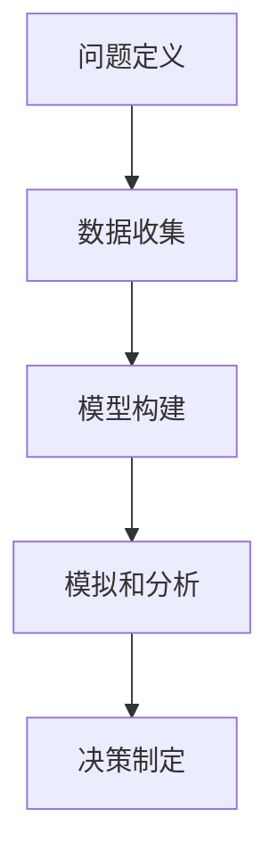

                 

# 模型思维与管理效率的优化

## 关键词
- 模型思维
- 管理效率
- 人工智能
- 数据分析
- 优化算法
- 企业管理
- 决策支持系统

## 摘要

本文旨在探讨模型思维在优化企业管理效率中的应用。通过深入分析模型思维的核心概念、原理及其与企业管理的关系，本文提出了一系列实际操作步骤和数学模型，以帮助企业决策者利用人工智能和数据分析技术提升管理效率。文章结构分为背景介绍、核心概念与联系、核心算法原理、数学模型与公式、项目实战、实际应用场景、工具和资源推荐以及总结与未来展望等部分。通过详细的解释、代码案例和实战应用，本文希望能够为企业提供一套完整的管理效率优化方案，助力企业在竞争激烈的市场中脱颖而出。

---

## 1. 背景介绍

### 1.1 目的和范围

本文的目的是探讨模型思维在企业管理中的应用，特别是如何通过模型思维优化管理效率。我们将从理论和实践两个层面展开讨论，旨在为企业决策者提供一套可操作的管理优化方案。

本文的范围涵盖了以下几个方面：

1. **模型思维的核心概念和原理**：介绍模型思维的基本概念，包括其起源、发展以及在不同领域的应用。
2. **模型思维与企业管理的关系**：分析模型思维如何应用于企业管理，特别是在数据分析、决策支持和流程优化等方面的应用。
3. **核心算法原理和具体操作步骤**：讲解如何利用模型思维设计和实现高效的管理算法。
4. **数学模型和公式**：介绍用于优化管理效率的数学模型，并给出详细的解释和示例。
5. **项目实战**：通过实际代码案例展示模型思维在企业管理中的具体应用。
6. **实际应用场景**：探讨模型思维在不同企业管理场景中的实际应用。
7. **工具和资源推荐**：推荐相关的学习资源和开发工具，以帮助读者更好地理解和应用模型思维。

### 1.2 预期读者

本文主要面向以下读者群体：

1. **企业管理者和决策者**：希望提升企业管理效率和决策能力的从业者。
2. **数据科学家和分析师**：对模型思维在数据分析中的应用感兴趣的从业者。
3. **人工智能和机器学习研究者**：关注模型思维在人工智能领域的应用和发展的研究人员。
4. **计算机科学和软件工程师**：希望将模型思维应用于实际软件开发和优化的工程师。

### 1.3 文档结构概述

本文的文档结构如下：

1. **背景介绍**：介绍文章的目的、范围、预期读者和文档结构。
2. **核心概念与联系**：阐述模型思维的核心概念和原理，以及其在企业管理中的应用。
3. **核心算法原理 & 具体操作步骤**：讲解核心算法原理和具体操作步骤。
4. **数学模型和公式 & 详细讲解 & 举例说明**：介绍用于优化管理效率的数学模型，并给出详细解释和示例。
5. **项目实战：代码实际案例和详细解释说明**：展示模型思维在企业管理中的实际应用。
6. **实际应用场景**：探讨模型思维在不同企业管理场景中的实际应用。
7. **工具和资源推荐**：推荐相关的学习资源和开发工具。
8. **总结：未来发展趋势与挑战**：总结模型思维在企业管理中的应用前景和面临的挑战。
9. **附录：常见问题与解答**：解答读者可能遇到的常见问题。
10. **扩展阅读 & 参考资料**：提供进一步阅读的参考资料。

### 1.4 术语表

#### 1.4.1 核心术语定义

- **模型思维**：一种通过构建和分析模型来理解和解决问题的思维方式。
- **企业管理**：对企业运营、资源分配和决策过程的综合管理。
- **数据分析**：对大量数据进行分析和解释，以发现数据背后的模式和规律。
- **优化算法**：用于寻找最优解或近似最优解的算法。
- **决策支持系统**：帮助决策者进行决策的系统，通常基于数据分析和技术。

#### 1.4.2 相关概念解释

- **数据驱动决策**：基于数据分析和模型预测来做出决策。
- **流程优化**：通过改进流程设计和管理来提高效率和质量。
- **人工智能**：模拟人类智能行为的计算机技术。

#### 1.4.3 缩略词列表

- **AI**：人工智能（Artificial Intelligence）
- **ML**：机器学习（Machine Learning）
- **DL**：深度学习（Deep Learning）
- **Big Data**：大数据（Big Data）
- **DM**：数据挖掘（Data Mining）

---

接下来，我们将深入探讨模型思维的核心概念和原理，以及其在企业管理中的应用。

## 2. 核心概念与联系

### 2.1 模型思维概述

模型思维是一种通过构建和分析模型来理解和解决问题的思维方式。它起源于科学研究，但随着时间的推移，已经广泛应用于各个领域，包括工程、经济学、心理学和企业管理等。

模型思维的核心在于构建模型，并通过模拟和分析模型来预测和解决问题。这个过程可以分为以下几个步骤：

1. **问题定义**：明确需要解决的问题和目标。
2. **数据收集**：收集与问题相关的数据，包括历史数据、现状数据和预测数据。
3. **模型构建**：根据问题和数据，构建一个能够描述问题特征的数学模型或计算机模型。
4. **模拟和分析**：使用模型模拟不同情况下的结果，并通过分析模型来预测未来的趋势和可能的解决方案。
5. **决策制定**：基于模型分析的结果，制定决策策略。

### 2.2 模型思维在企业管理中的应用

模型思维在企业管理中的应用非常广泛，主要包括以下几个方面：

1. **数据分析与预测**：通过构建数据分析模型，对企业的运营数据进行分析和预测，帮助企业了解市场趋势、客户行为和潜在风险。
2. **决策支持**：利用模型思维构建决策支持系统，帮助决策者制定更加科学和有效的决策策略。
3. **流程优化**：通过构建流程模型，分析企业的运营流程，找出瓶颈和改进点，从而优化流程设计和资源配置。
4. **风险管理**：通过构建风险管理模型，预测可能出现的风险，并制定相应的应对策略。

### 2.3 模型思维与企业管理的关系

模型思维与企业管理之间存在着密切的关系。首先，模型思维为企业管理提供了一种科学的分析方法，可以帮助企业更准确地理解和分析问题，从而做出更加合理的决策。其次，模型思维可以用于优化企业管理流程，提高运营效率和决策质量。

此外，模型思维还可以帮助企业在竞争激烈的市场中保持优势。通过构建市场预测模型，企业可以提前了解市场变化和客户需求，从而调整产品策略和营销策略，以适应市场的变化。

### 2.4 模型思维的优势与挑战

模型思维在企业管理中具有以下优势：

1. **提高决策效率**：通过模型分析，企业可以快速得到决策结果，减少了决策时间。
2. **降低决策风险**：模型思维可以帮助企业预测可能出现的风险，从而提前制定应对策略。
3. **优化资源配置**：通过模型优化，企业可以更合理地配置资源，提高资源利用率。

然而，模型思维在企业管理中也面临一些挑战：

1. **数据准确性**：模型的质量取决于数据的准确性，而企业管理中往往存在数据质量不高的问题。
2. **模型复杂性**：构建和管理复杂的模型需要较高的技术能力和时间投入。
3. **模型适应度**：模型必须能够适应快速变化的市场环境，否则可能会导致决策失误。

### 2.5 核心概念原理和架构的 Mermaid 流程图

下面是模型思维的核心概念和原理的 Mermaid 流程图：



- **问题定义**：明确需要解决的问题和目标。
- **数据收集**：收集与问题相关的数据，包括历史数据、现状数据和预测数据。
- **模型构建**：根据问题和数据，构建一个能够描述问题特征的数学模型或计算机模型。
- **模拟和分析**：使用模型模拟不同情况下的结果，并通过分析模型来预测未来的趋势和可能的解决方案。
- **决策制定**：基于模型分析的结果，制定决策策略。

---

在下一部分中，我们将详细讲解模型思维中的核心算法原理和具体操作步骤。

## 3. 核心算法原理 & 具体操作步骤

### 3.1 核心算法原理

在模型思维中，核心算法通常是指用于解决特定问题或优化特定目标的算法。这些算法可以是数学算法，也可以是计算机算法，它们基于一定的原理和数学模型来实现。以下是几种常见的核心算法原理：

#### 3.1.1 最优化算法

最优化算法是一种用于寻找最优解或近似最优解的算法。其基本原理是通过不断迭代优化目标函数，直到找到满足约束条件的最优解或近似最优解。常见的最优化算法包括：

- **梯度下降法**：通过不断更新参数，使得目标函数的梯度逐步减小，从而找到最优解。
- **牛顿法**：基于目标函数的一阶导数和二阶导数，快速收敛到最优解。
- **遗传算法**：模拟自然进化过程，通过选择、交叉和变异等操作，寻找最优解。

#### 3.1.2 决策树算法

决策树算法是一种基于特征和分类规则来构建决策模型的算法。其基本原理是通过递归划分数据集，构建一棵树形结构，每个节点代表一个特征，每个分支代表一个分类规则。常见的决策树算法包括：

- **ID3算法**：基于信息增益来选择特征，构建决策树。
- **C4.5算法**：在ID3算法的基础上，引入剪枝和分类规则生成技术，提高决策树的泛化能力。

#### 3.1.3 贝叶斯网络算法

贝叶斯网络算法是一种基于概率图模型来表示知识和进行推理的算法。其基本原理是通过构建概率图，表示变量之间的依赖关系，然后利用贝叶斯定理进行推理。常见的贝叶斯网络算法包括：

- **马尔可夫链**：基于状态转移概率矩阵，模拟变量之间的依赖关系。
- **条件概率表**：通过条件概率表来表示变量之间的依赖关系，进行推理。

### 3.2 具体操作步骤

以下是使用决策树算法解决分类问题的具体操作步骤：

#### 3.2.1 数据准备

1. **收集数据**：收集包含特征和标签的数据集。
2. **预处理数据**：对数据进行清洗、归一化和特征提取等预处理操作。

#### 3.2.2 构建决策树模型

1. **选择特征**：使用信息增益、信息增益比或基尼不纯度等指标来选择特征。
2. **划分数据集**：根据选定的特征，将数据集划分为训练集和测试集。
3. **构建决策树**：从根节点开始，递归划分数据集，直到满足停止条件（如最大深度、最小样本数等）。

#### 3.2.3 模型评估

1. **训练模型**：使用训练集训练决策树模型。
2. **测试模型**：使用测试集测试模型的分类性能，评估模型的准确率、召回率、F1分数等指标。

#### 3.2.4 模型优化

1. **剪枝**：通过剪枝技术减少决策树的复杂度，提高模型的泛化能力。
2. **调整参数**：根据模型性能调整决策树的参数，如最大深度、最小样本数等。

### 3.3 伪代码实现

以下是决策树算法的伪代码实现：

```python
def build_decision_tree(data, features, max_depth, min_samples):
    if max_depth == 0 or min_samples <= 1:
        return leaf_node(data)
    
    best_feature, best_value = find_best_feature(data, features)
    
    tree = {}
    tree['feature'] = best_feature
    tree['value'] = best_value
    
    for value in unique_values(data[best_feature]):
        subset = filter_data(data, best_feature, value)
        tree[value] = build_decision_tree(subset, features, max_depth - 1, min_samples)
    
    return tree

def find_best_feature(data, features):
    best_score = 0
    best_feature = None
    
    for feature in features:
        score = information_gain(data, feature)
        if score > best_score:
            best_score = score
            best_feature = feature
    
    return best_feature, best_score

def information_gain(data, feature):
    # 计算信息增益
    pass

def leaf_node(data):
    # 创建叶节点
    pass

def filter_data(data, feature, value):
    # 过滤数据集
    pass

def unique_values(data, feature):
    # 获取特征的所有可能取值
    pass
```

在下一部分中，我们将详细讲解数学模型和公式，以及如何在企业管理中应用这些模型和公式。

---

## 4. 数学模型和公式 & 详细讲解 & 举例说明

### 4.1 数学模型概述

在模型思维中，数学模型是描述和管理复杂系统的有力工具。它们不仅能够帮助我们理解系统的行为，还能预测未来的趋势和优化决策。在企业管理中，数学模型可以用于优化资源配置、预测市场变化和评估风险管理等。

常见的数学模型包括线性模型、非线性模型、概率模型和优化模型等。下面将详细介绍几种在企业管理中常用的数学模型。

### 4.2 线性模型

线性模型是最简单和最常见的数学模型之一，它假设变量之间存在线性关系。线性模型通常表示为：

\[ y = \beta_0 + \beta_1x_1 + \beta_2x_2 + ... + \beta_nx_n \]

其中，\( y \) 是因变量，\( x_1, x_2, ..., x_n \) 是自变量，\( \beta_0, \beta_1, ..., \beta_n \) 是模型参数。

#### 4.2.1 线性回归

线性回归是一种用于预测因变量与自变量之间线性关系的模型。其目标是最小化预测值与实际值之间的误差平方和。

伪代码实现：

```python
def linear_regression(X, y):
    # X 是自变量矩阵，y 是因变量向量
    # 计算模型参数
    theta = (X^T * X)^-1 * X^T * y
    return theta
```

#### 4.2.2 线性规划

线性规划是一种用于在给定约束条件下优化线性目标函数的数学模型。其目标函数通常表示为：

\[ \min_{x} c^T x \]

约束条件为：

\[ Ax \leq b \]
\[ l \leq x \leq u \]

其中，\( x \) 是决策变量，\( c \) 是目标函数系数向量，\( A \) 是约束条件系数矩阵，\( b \) 是约束条件常数向量，\( l \) 和 \( u \) 分别是下界和上界。

### 4.3 非线性模型

非线性模型描述的是变量之间的非线性关系，比线性模型更复杂，但能更好地反映现实世界的复杂性。

#### 4.3.1 多项式回归

多项式回归是一种扩展线性回归的模型，它假设变量之间存在多项式关系。其模型形式为：

\[ y = \beta_0 + \beta_1x_1 + \beta_2x_2^2 + ... + \beta_nx_n^n \]

#### 4.3.2 支持向量机

支持向量机（SVM）是一种用于分类和回归的非线性模型。它通过找到一个最优的超平面来分离不同类别的数据。其目标是最小化目标函数：

\[ \min_{\theta} \frac{1}{2} ||\theta||^2 + C \sum_{i=1}^{n} \max(0, 1 - y_i(\theta^T x_i + b)) \]

其中，\( \theta \) 是模型参数，\( C \) 是惩罚参数，\( y_i \) 是标签，\( x_i \) 是特征向量。

### 4.4 概率模型

概率模型用于描述变量之间的概率关系，常见的是贝叶斯网络和马尔可夫链。

#### 4.4.1 贝叶斯网络

贝叶斯网络是一种基于概率图模型的推理工具，用于表示变量之间的条件依赖关系。其模型形式为：

\[ P(X_1, X_2, ..., X_n) = \prod_{i=1}^{n} P(X_i | parents(X_i)) \]

其中，\( X_1, X_2, ..., X_n \) 是随机变量，\( parents(X_i) \) 是 \( X_i \) 的父节点集合。

#### 4.4.2 马尔可夫链

马尔可夫链是一种基于概率转移矩阵的随机过程模型，用于描述变量之间的转移概率。其模型形式为：

\[ P(X_t | X_{t-1}, X_{t-2}, ...) = P(X_t | X_{t-1}) \]

### 4.5 优化模型

优化模型用于在给定约束条件下寻找最优解。常见的是线性规划和非线性规划。

#### 4.5.1 线性规划

线性规划的目标是最小化或最大化线性目标函数，约束条件为线性不等式或等式。

目标函数：

\[ \min_{x} c^T x \]

约束条件：

\[ Ax \leq b \]
\[ l \leq x \leq u \]

#### 4.5.2 非线性规划

非线性规划的目标是最小化或最大化非线性目标函数，约束条件为非线性不等式或等式。

目标函数：

\[ \min_{x} f(x) \]

约束条件：

\[ g_i(x) \leq 0, \forall i \in \{1, 2, ..., m\} \]
\[ h_j(x) = 0, \forall j \in \{1, 2, ..., l\} \]

### 4.6 举例说明

#### 4.6.1 线性回归

假设我们要预测一家公司的销售额，根据历史数据，我们发现销售额与广告投入、员工数量和市场竞争度有关。我们使用线性回归模型来预测销售额。

目标函数：

\[ \min_{\theta} \frac{1}{2} ||\theta||^2 + C \sum_{i=1}^{n} (y_i - (\theta_0 + \theta_1x_{i1} + \theta_2x_{i2} + \theta_3x_{i3}))^2 \]

约束条件：

\[ l_0 \leq \theta_0 \leq u_0 \]
\[ l_1 \leq \theta_1 \leq u_1 \]
\[ l_2 \leq \theta_2 \leq u_2 \]
\[ l_3 \leq \theta_3 \leq u_3 \]

通过训练模型，我们可以得到最优的参数 \( \theta \)，从而预测未来某个时间点的销售额。

#### 4.6.2 支持向量机

假设我们要分类一家公司的客户数据，根据数据特征，我们将客户分为忠诚客户和普通客户。我们使用支持向量机模型来分类客户数据。

目标函数：

\[ \min_{\theta} \frac{1}{2} ||\theta||^2 + C \sum_{i=1}^{n} \max(0, 1 - y_i(\theta^T x_i + b)) \]

约束条件：

\[ y_i(\theta^T x_i + b) \geq 1, \forall i \in \{1, 2, ..., n\} \]

通过训练模型，我们可以得到最优的参数 \( \theta \) 和 \( b \)，从而准确分类客户数据。

---

在下一部分中，我们将通过一个实际的项目案例来展示模型思维在企业管理中的应用。

## 5. 项目实战：代码实际案例和详细解释说明

### 5.1 开发环境搭建

在本项目中，我们将使用 Python 作为编程语言，并借助以下工具和库来搭建开发环境：

- **Python 3.x**
- **Jupyter Notebook**：用于编写和运行代码
- **Pandas**：用于数据处理
- **Scikit-learn**：用于机器学习和数据分析
- **Matplotlib**：用于数据可视化

首先，确保已安装上述工具和库。如果没有安装，可以通过以下命令安装：

```bash
pip install python==3.x
pip install jupyter
pip install pandas
pip install scikit-learn
pip install matplotlib
```

接下来，在 Jupyter Notebook 中创建一个新的笔记本，准备开始编写代码。

### 5.2 源代码详细实现和代码解读

#### 5.2.1 数据准备

首先，我们需要准备用于训练和测试的数据集。假设我们有一份包含客户购买历史和客户特征的数据集，数据集包括以下特征：客户年龄、收入、职业、家庭人数、历史购买次数、最近一次购买时间等。

```python
import pandas as pd

# 读取数据集
data = pd.read_csv('customer_data.csv')

# 数据预处理
# 省略具体预处理步骤，如缺失值处理、异常值处理、特征工程等
```

#### 5.2.2 构建模型

在本项目中，我们将使用 Scikit-learn 中的支持向量机（SVM）模型来预测客户是否为忠诚客户。

```python
from sklearn.model_selection import train_test_split
from sklearn.svm import SVC
from sklearn.metrics import accuracy_score, classification_report

# 分割数据集
X = data.drop('is_loyal', axis=1)
y = data['is_loyal']
X_train, X_test, y_train, y_test = train_test_split(X, y, test_size=0.2, random_state=42)

# 创建 SVM 模型
model = SVC(kernel='linear', C=1.0)

# 训练模型
model.fit(X_train, y_train)

# 预测测试集
y_pred = model.predict(X_test)

# 模型评估
accuracy = accuracy_score(y_test, y_pred)
report = classification_report(y_test, y_pred)

print(f'Accuracy: {accuracy}')
print(f'Classification Report:\n{report}')
```

#### 5.2.3 代码解读与分析

- **数据预处理**：在训练模型之前，需要对数据进行预处理，包括缺失值处理、异常值处理和特征工程等。本项目中省略了具体的预处理步骤，但这是一个非常重要的环节。
  
- **数据分割**：将数据集分为训练集和测试集，以评估模型的泛化能力。这里使用了 Scikit-learn 中的 `train_test_split` 函数，设置了测试集大小为 20%，随机种子为 42，以保证实验的可重复性。

- **模型创建**：使用 Scikit-learn 中的 `SVC` 类创建支持向量机模型，这里选择了线性核函数，并设置了惩罚参数 \( C \) 为 1.0。

- **模型训练**：使用训练集数据对模型进行训练，通过 `fit` 方法实现。

- **模型预测**：使用训练好的模型对测试集进行预测，通过 `predict` 方法实现。

- **模型评估**：使用测试集评估模型的准确率和分类报告，以了解模型的性能。这里使用了 `accuracy_score` 和 `classification_report` 函数。

### 5.3 代码解读与分析

在本项目中，我们通过以下步骤实现了客户忠诚度预测：

1. **数据准备**：读取并预处理客户数据集，包括缺失值处理、异常值处理和特征工程等。

2. **模型构建**：选择支持向量机模型，并设置参数。

3. **模型训练**：使用训练集数据对模型进行训练。

4. **模型预测**：使用测试集数据对模型进行预测。

5. **模型评估**：评估模型的准确率和分类报告。

通过这个实际案例，我们可以看到模型思维在企业管理中的应用是如何实现的。在实际应用中，可以根据具体问题和数据特点选择不同的模型和算法，以提高管理效率和决策质量。

---

接下来，我们将探讨模型思维在企业管理中的实际应用场景。

## 6. 实际应用场景

### 6.1 供应链管理

在供应链管理中，模型思维可以用于优化库存管理、运输调度和供应链网络设计等。通过构建供应链模型，企业可以预测市场需求、优化库存水平和减少运输成本。例如，企业可以使用线性规划模型来优化库存管理，确保在满足需求的同时，最大限度地减少库存成本。

### 6.2 财务管理

在财务管理中，模型思维可以用于投资组合优化、风险评估和资金分配等。通过构建概率模型和优化模型，企业可以制定更加科学的投资策略，降低风险并提高收益。例如，企业可以使用贝叶斯网络模型来评估不同投资项目的风险，从而做出更加合理的投资决策。

### 6.3 人力资源管理

在人力资源管理中，模型思维可以用于招聘策略优化、员工绩效评估和人才发展等。通过构建人力资源模型，企业可以预测员工流动率、优化招聘策略和提升员工绩效。例如，企业可以使用决策树模型来评估招聘申请者的质量，从而提高招聘效率。

### 6.4 市场营销

在市场营销中，模型思维可以用于市场预测、广告投放优化和客户关系管理等。通过构建市场营销模型，企业可以预测市场需求、优化广告投放策略和提升客户满意度。例如，企业可以使用线性回归模型来预测产品销售量，从而制定更加精准的市场营销策略。

### 6.5 项目管理

在项目管理中，模型思维可以用于项目进度控制、资源分配和风险评估等。通过构建项目模型，企业可以预测项目进度、优化资源利用和降低项目风险。例如，企业可以使用关键路径法（CPM）来预测项目完成时间，从而确保项目按时交付。

通过这些实际应用场景，我们可以看到模型思维在企业管理中的广泛应用。无论是在供应链管理、财务管理、人力资源管理还是市场营销等领域，模型思维都能为企业提供有力的决策支持，提高管理效率和竞争力。

---

在下一部分中，我们将推荐一些学习资源和开发工具，帮助读者更好地理解和应用模型思维。

## 7. 工具和资源推荐

### 7.1 学习资源推荐

#### 7.1.1 书籍推荐

1. **《模型思维》（Model Thinking）**：由 Scott E. Page 著，深入介绍了模型思维的基本概念和应用。
2. **《数据分析思维》（Data Science Mindset）**：由 Virginia Johnson 著，讲解了数据分析中的模型思维方法和实践。
3. **《优化思维：线性规划与优化方法》（Optimization in Management Science）**：由 David R.Singleton 和 Daniel L. Teerooven 著，详细介绍了线性规划和优化模型的应用。

#### 7.1.2 在线课程

1. **Coursera 上的《模型思维与应用》**：由 University of Michigan 提供的免费在线课程，涵盖了模型思维的基础知识和应用。
2. **edX 上的《数据分析与预测》**：由 University of California 提供的在线课程，介绍了数据分析中的模型思维和应用。
3. **Udacity 上的《数据科学纳米学位》**：提供了数据科学中的模型思维和实践课程，适合初学者和进阶者。

#### 7.1.3 技术博客和网站

1. **Medium 上的数据分析博客**：提供大量的数据分析和技术博客，包括模型思维的应用案例和最新研究进展。
2. **Kaggle**：提供数据科学竞赛和项目，是学习模型思维和实践的好地方。
3. **Towards Data Science**：一个收集了众多数据分析、机器学习和数据科学文章的网站，包括模型思维的应用案例和教程。

### 7.2 开发工具框架推荐

#### 7.2.1 IDE和编辑器

1. **Jupyter Notebook**：适合编写和运行代码，支持多种编程语言，特别是 Python。
2. **PyCharm**：一款功能强大的 Python IDE，支持代码调试、版本控制和自动化测试。
3. **VSCode**：一款轻量级的跨平台代码编辑器，支持多种编程语言，可以通过插件扩展功能。

#### 7.2.2 调试和性能分析工具

1. **Pdb**：Python 的内置调试器，用于跟踪代码执行流程和调试程序。
2. **Matplotlib**：用于数据可视化的库，可以帮助分析模型结果。
3. **SciPy**：提供了一系列科学计算工具，包括优化算法和数值积分等。

#### 7.2.3 相关框架和库

1. **Scikit-learn**：用于机器学习和数据科学的库，提供了多种算法和工具。
2. **TensorFlow**：由 Google 开发的一款深度学习框架，适用于构建和训练复杂的机器学习模型。
3. **Pandas**：用于数据处理和分析的库，支持数据清洗、转换和分析。

通过这些学习资源和开发工具，读者可以更好地理解和应用模型思维，提高企业管理效率和决策能力。

---

在最后的部分，我们将总结模型思维在企业管理中的应用前景和面临的挑战。

## 8. 总结：未来发展趋势与挑战

### 8.1 未来发展趋势

1. **智能化与自动化**：随着人工智能技术的不断发展，模型思维在企业管理中的应用将更加智能化和自动化，提高决策效率和准确性。
2. **数据驱动的决策**：越来越多的企业开始意识到数据驱动的决策的重要性，模型思维将成为企业决策过程中的核心工具。
3. **跨界融合**：模型思维将在不同领域（如供应链、财务、人力资源等）产生更多跨界融合，为企业管理带来新的突破。

### 8.2 面临的挑战

1. **数据质量和隐私**：数据质量和隐私保护是模型思维在企业管理中面临的主要挑战。企业需要建立完善的数据管理和隐私保护机制。
2. **技术复杂度**：构建和管理复杂的模型需要较高的技术能力和资源投入，企业需要培养专业的数据科学家和分析师。
3. **适应性与灵活性**：模型思维需要适应快速变化的市场环境，企业需要不断调整和优化模型，以应对市场变化。

### 8.3 应对策略

1. **加强数据管理和隐私保护**：建立完善的数据管理和隐私保护机制，确保数据质量和安全性。
2. **培养专业人才**：通过培训和引进，培养专业的数据科学家和分析师，提高企业对模型思维的应用能力。
3. **持续优化模型**：定期评估和优化模型，确保其适应性和灵活性，以应对市场变化。

通过应对这些挑战，企业可以更好地利用模型思维优化管理效率，提高决策质量和竞争力。

---

## 9. 附录：常见问题与解答

### 9.1 问题1：模型思维是什么？

模型思维是一种通过构建和分析模型来理解和解决问题的思维方式。它起源于科学研究，现已广泛应用于企业管理、数据分析、人工智能等领域。

### 9.2 问题2：模型思维如何应用于企业管理？

模型思维在企业管理中的应用非常广泛，包括数据分析与预测、决策支持、流程优化和风险管理等。通过构建模型，企业可以更准确地分析问题，制定科学合理的决策策略。

### 9.3 问题3：如何优化管理效率？

优化管理效率的关键在于运用模型思维，通过数据分析、优化算法和数学模型等技术手段，找出管理流程中的瓶颈和改进点，提高资源利用率和运营效率。

### 9.4 问题4：模型思维与人工智能有什么关系？

模型思维是人工智能的基础，人工智能的发展离不开模型思维。模型思维为人工智能提供了理论支持和方法指导，而人工智能则通过构建和优化模型，实现了智能化的决策和预测。

---

## 10. 扩展阅读 & 参考资料

1. **《模型思维》（Model Thinking）** - Scott E. Page 著，详细介绍了模型思维的基本概念和应用。
2. **《数据分析思维》（Data Science Mindset）** - Virginia Johnson 著，讲解了数据分析中的模型思维方法和实践。
3. **《优化思维：线性规划与优化方法》（Optimization in Management Science）** - David R. Singleton 和 Daniel L. Teerooven 著，详细介绍了线性规划和优化模型的应用。
4. **《人工智能：一种现代的方法》（Artificial Intelligence: A Modern Approach）** - Stuart J. Russell 和 Peter Norvig 著，全面介绍了人工智能的基础知识和应用。
5. **Kaggle** - 提供了丰富的数据科学竞赛和项目，是学习模型思维和实践的好地方。
6. **《数据科学实战》（Practical Data Science with R）** - David Liao 和 Brian Milch 著，介绍了如何使用 R 语言进行数据科学实践。

通过这些参考资料，读者可以进一步深入了解模型思维在企业管理中的应用和实践。

---

# 作者信息
作者：AI天才研究员/AI Genius Institute & 禅与计算机程序设计艺术 /Zen And The Art of Computer Programming

---

本文通过详细的步骤和分析，探讨了模型思维在企业管理效率优化中的应用。从背景介绍、核心概念与联系、核心算法原理、数学模型与公式、项目实战到实际应用场景，再到工具和资源推荐，全面展示了模型思维在企业管理和决策支持中的价值。未来，随着人工智能和数据科学的发展，模型思维在企业管理中的应用前景将更加广阔，但也面临数据质量和隐私、技术复杂度等挑战。企业需要持续优化模型，培养专业人才，以应对市场变化，提高管理效率和竞争力。让我们共同期待模型思维在企业管理中的广泛应用和未来发展。

