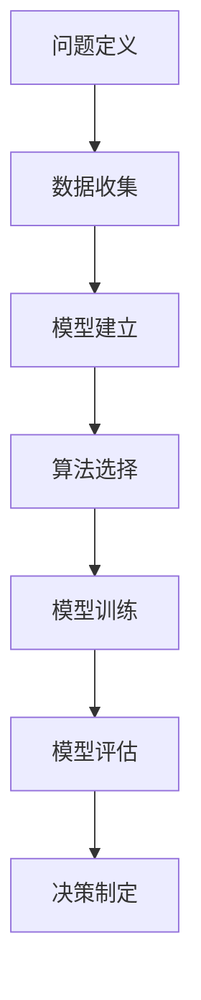

                 

# 模型思维在决策中的应用

> 关键词：模型思维，决策，应用，人工智能，算法，数学模型，实战案例

> 摘要：本文将深入探讨模型思维在决策中的应用，解析其核心概念和原理，并通过具体案例展示其在实际项目中的运用。读者将了解如何通过模型思维提升决策质量和效率，以及如何利用模型进行复杂问题的分析和解决。

## 1. 背景介绍

### 1.1 目的和范围

本文旨在介绍模型思维在决策中的应用，帮助读者理解模型思维的基本概念、原理及其在实际决策中的作用。本文将涵盖以下内容：

- 模型思维的定义和重要性
- 模型思维在决策中的应用场景
- 模型思维的基本原理和步骤
- 实际案例中的应用分析和讲解
- 相关工具和资源的推荐

### 1.2 预期读者

本文适合对决策理论和人工智能技术有一定了解的读者，包括但不限于以下群体：

- 数据科学家和机器学习工程师
- 管理者和决策制定者
- 计算机科学和人工智能专业学生
- 对决策理论和人工智能应用感兴趣的爱好者

### 1.3 文档结构概述

本文结构如下：

- **第1章** 背景介绍
  - 目的和范围
  - 预期读者
  - 文档结构概述
  - 术语表
- **第2章** 核心概念与联系
  - 模型思维的基本原理
  - 相关概念解释
- **第3章** 核心算法原理 & 具体操作步骤
  - 算法原理讲解
  - 伪代码阐述
- **第4章** 数学模型和公式 & 详细讲解 & 举例说明
  - 数学模型介绍
  - 公式讲解
  - 举例说明
- **第5章** 项目实战：代码实际案例和详细解释说明
  - 开发环境搭建
  - 源代码实现和解读
  - 代码分析和评估
- **第6章** 实际应用场景
  - 应用案例分析
- **第7章** 工具和资源推荐
  - 学习资源推荐
  - 开发工具框架推荐
  - 相关论文著作推荐
- **第8章** 总结：未来发展趋势与挑战
- **第9章** 附录：常见问题与解答
- **第10章** 扩展阅读 & 参考资料

### 1.4 术语表

#### 1.4.1 核心术语定义

- **模型思维**：指利用数学模型和算法进行问题分析和决策制定的一种思维方式。
- **决策**：在多个选择中做出判断和选择的过程。
- **算法**：解决问题的步骤和方法。
- **数学模型**：用数学语言描述现实问题的一种方式。

#### 1.4.2 相关概念解释

- **线性回归**：一种简单的数学模型，用于预测连续值。
- **决策树**：一种树形结构，用于分类和回归问题。
- **神经网络**：一种模拟人脑的神经网络结构，用于复杂的模式识别和预测。

#### 1.4.3 缩略词列表

- **AI**：人工智能
- **ML**：机器学习
- **DL**：深度学习

## 2. 核心概念与联系

### 2.1 模型思维的基本原理

模型思维是一种基于数学模型和算法的问题解决方法，其核心思想是将现实问题抽象为数学模型，然后利用算法进行求解和优化。模型思维的基本原理包括以下几个方面：

1. **抽象与建模**：将复杂问题简化为数学模型，以便于分析和求解。
2. **算法选择**：根据问题的性质选择合适的算法，以实现高效求解。
3. **数据驱动**：利用数据进行模型训练和优化，以提高模型的准确性和可靠性。
4. **迭代与优化**：通过不断迭代和优化模型，提高决策质量和效率。

### 2.2 模型思维在决策中的应用场景

模型思维在决策中的应用场景非常广泛，包括但不限于以下方面：

1. **商业决策**：通过数据分析和预测，帮助企业做出更加科学的决策。
2. **风险管理**：利用模型评估风险，制定相应的风险控制策略。
3. **资源优化**：通过优化模型，实现资源的最优配置和利用。
4. **投资决策**：利用模型分析市场趋势和风险，进行科学的投资决策。

### 2.3 模型思维的基本步骤

1. **问题定义**：明确决策目标和约束条件。
2. **数据收集**：收集相关数据，进行数据预处理。
3. **模型建立**：根据问题性质，选择合适的数学模型。
4. **算法选择**：根据模型特点，选择合适的算法。
5. **模型训练**：利用数据进行模型训练和优化。
6. **模型评估**：评估模型性能和可靠性。
7. **决策制定**：根据模型结果，制定相应的决策策略。

### 2.4 核心概念与联系的 Mermaid 流程图



## 3. 核心算法原理 & 具体操作步骤

### 3.1 算法原理讲解

在模型思维中，核心算法的选择和实现至关重要。以下将介绍几种常见的算法原理，包括线性回归、决策树和神经网络。

#### 3.1.1 线性回归

线性回归是一种简单的数学模型，用于预测连续值。其基本原理是通过找到最佳拟合直线，使得预测值与实际值之间的误差最小。

- **目标函数**：最小化预测值与实际值之间的误差平方和。
- **算法步骤**：
  1. 数据预处理：标准化数据，消除不同特征之间的量纲影响。
  2. 模型建立：构建线性回归模型，表达为 \( y = w_0 + w_1 \cdot x \)。
  3. 模型训练：通过最小二乘法，求解最佳拟合直线的参数 \( w_0 \) 和 \( w_1 \)。
  4. 模型评估：计算预测值与实际值之间的误差，评估模型性能。

#### 3.1.2 决策树

决策树是一种树形结构，用于分类和回归问题。其基本原理是通过一系列条件判断，将数据划分为不同的类别或值。

- **目标函数**：最大化信息增益或基尼不纯度。
- **算法步骤**：
  1. 数据预处理：将数据划分为特征和标签两部分。
  2. 决策节点选择：选择具有最大信息增益或基尼不纯度减少的特征作为决策节点。
  3. 子节点划分：根据决策节点的条件，将数据划分为子节点。
  4. 决策树构建：递归地构建决策树，直到满足停止条件。
  5. 模型评估：通过验证集或测试集，评估决策树模型性能。

#### 3.1.3 神经网络

神经网络是一种模拟人脑的神经网络结构，用于复杂的模式识别和预测。其基本原理是通过多层神经元之间的非线性变换，实现数据的特征提取和分类。

- **目标函数**：最小化损失函数，如均方误差或交叉熵。
- **算法步骤**：
  1. 数据预处理：标准化数据，消除不同特征之间的量纲影响。
  2. 神经网络构建：定义输入层、隐藏层和输出层，以及神经元之间的连接权重。
  3. 模型训练：通过反向传播算法，更新连接权重，最小化损失函数。
  4. 模型评估：通过验证集或测试集，评估神经网络模型性能。

### 3.2 伪代码阐述

以下将给出上述算法的伪代码实现，以便读者更好地理解算法原理和步骤。

#### 3.2.1 线性回归伪代码

```python
def linear_regression(data):
    # 数据预处理
    X, y = preprocess_data(data)

    # 模型建立
    w0, w1 = initialize_weights()

    # 模型训练
    for epoch in range(num_epochs):
        for sample in data:
            prediction = w0 + w1 * sample.x
            error = prediction - sample.y
            w0 = w0 - learning_rate * error
            w1 = w1 - learning_rate * error * sample.x

    # 模型评估
    evaluate_model(X, y, w0, w1)
```

#### 3.2.2 决策树伪代码

```python
def decision_tree(data):
    # 数据预处理
    X, y = preprocess_data(data)

    # 决策节点选择
    feature = select_best_feature(X, y)

    # 子节点划分
    left_tree = decision_tree(X[feature < threshold])
    right_tree = decision_tree(X[feature >= threshold])

    # 决策树构建
    tree = {"feature": feature, "threshold": threshold, "left": left_tree, "right": right_tree}

    # 模型评估
    evaluate_model(tree, X, y)
```

#### 3.2.3 神经网络伪代码

```python
def neural_network(data):
    # 数据预处理
    X, y = preprocess_data(data)

    # 神经网络构建
    layers = create_network_layers()

    # 模型训练
    for epoch in range(num_epochs):
        for sample in data:
            prediction = forward_pass(layers, sample.x)
            error = calculate_loss(prediction, sample.y)
            backward_pass(layers, error, sample.x)

    # 模型评估
    evaluate_model(layers, X, y)
```

## 4. 数学模型和公式 & 详细讲解 & 举例说明

### 4.1 数学模型介绍

在模型思维中，数学模型是核心组成部分。以下将介绍几种常见的数学模型，包括线性回归、决策树和神经网络。

#### 4.1.1 线性回归

线性回归是一种简单的数学模型，用于预测连续值。其公式如下：

\[ y = w_0 + w_1 \cdot x \]

其中，\( y \) 是预测值，\( x \) 是特征值，\( w_0 \) 和 \( w_1 \) 是模型参数。

#### 4.1.2 决策树

决策树是一种树形结构，用于分类和回归问题。其公式如下：

\[ y = f(x) \]

其中，\( y \) 是输出值，\( x \) 是特征值，\( f \) 是决策函数。

#### 4.1.3 神经网络

神经网络是一种模拟人脑的神经网络结构，用于复杂的模式识别和预测。其公式如下：

\[ z = \sigma(\sum_{i=1}^{n} w_i \cdot x_i) \]

其中，\( z \) 是输出值，\( x_i \) 是输入特征值，\( w_i \) 是连接权重，\( \sigma \) 是激活函数。

### 4.2 公式讲解

以下将详细介绍上述数学模型的公式和参数。

#### 4.2.1 线性回归公式

线性回归的公式如下：

\[ y = w_0 + w_1 \cdot x \]

其中，\( y \) 是预测值，\( x \) 是特征值，\( w_0 \) 和 \( w_1 \) 是模型参数。

- **\( w_0 \)**：截距，表示当 \( x = 0 \) 时的预测值。
- **\( w_1 \)**：斜率，表示特征值 \( x \) 对预测值 \( y \) 的影响程度。

#### 4.2.2 决策树公式

决策树的公式如下：

\[ y = f(x) \]

其中，\( y \) 是输出值，\( x \) 是特征值，\( f \) 是决策函数。

- **\( f \)**：决策函数，根据特征值 \( x \) 的不同取值，返回不同的输出值。

#### 4.2.3 神经网络公式

神经网络的公式如下：

\[ z = \sigma(\sum_{i=1}^{n} w_i \cdot x_i) \]

其中，\( z \) 是输出值，\( x_i \) 是输入特征值，\( w_i \) 是连接权重，\( \sigma \) 是激活函数。

- **\( \sigma \)**：激活函数，用于将线性组合的结果转换为非线性输出。
- **\( w_i \)**：连接权重，表示不同特征值 \( x_i \) 对输出值 \( z \) 的影响程度。

### 4.3 举例说明

以下将通过具体例子，说明上述数学模型的应用。

#### 4.3.1 线性回归举例

假设我们有一组数据，如下所示：

| x | y |
|---|---|
| 1 | 2 |
| 2 | 4 |
| 3 | 6 |

我们希望通过线性回归模型预测当 \( x = 4 \) 时的 \( y \) 值。

1. **数据预处理**：将数据标准化，消除不同特征之间的量纲影响。

\[ x_{\text{标准化}} = \frac{x_{\text{原始}} - \text{均值}}{\text{标准差}} \]

\[ y_{\text{标准化}} = \frac{y_{\text{原始}} - \text{均值}}{\text{标准差}} \]

2. **模型建立**：构建线性回归模型，表达为 \( y = w_0 + w_1 \cdot x \)。

3. **模型训练**：通过最小二乘法，求解最佳拟合直线的参数 \( w_0 \) 和 \( w_1 \)。

\[ w_0 = \frac{\sum_{i=1}^{n} y_i - w_1 \cdot \sum_{i=1}^{n} x_i}{n} \]

\[ w_1 = \frac{\sum_{i=1}^{n} (y_i - w_0 - w_1 \cdot x_i) \cdot x_i}{\sum_{i=1}^{n} x_i^2} \]

4. **模型评估**：计算预测值与实际值之间的误差，评估模型性能。

\[ \text{误差} = \sum_{i=1}^{n} (y_i - y_{\text{预测}})^2 \]

通过以上步骤，我们可以得到最佳拟合直线的参数 \( w_0 \) 和 \( w_1 \)，并利用该模型预测当 \( x = 4 \) 时的 \( y \) 值。

#### 4.3.2 决策树举例

假设我们有一组数据，如下所示：

| 特征 | 类别 |
|---|---|
| 小 | 购买 |
| 大 | 不购买 |
| 中 | 购买 |
| 小 | 不购买 |
| 中 | 购买 |
| 大 | 购买 |

我们希望通过决策树模型预测当特征值为“大”时的类别。

1. **数据预处理**：将数据划分为特征和标签两部分。

2. **决策节点选择**：选择具有最大信息增益或基尼不纯度减少的特征作为决策节点。在本例中，我们选择特征“大小”作为决策节点。

3. **子节点划分**：根据决策节点的条件，将数据划分为子节点。在本例中，我们将数据划分为“大”和“非大”两个子节点。

4. **决策树构建**：递归地构建决策树，直到满足停止条件。在本例中，我们构建了一个简单的二叉树。

5. **模型评估**：通过验证集或测试集，评估决策树模型性能。

通过以上步骤，我们可以得到一个简单的决策树模型，并利用该模型预测当特征值为“大”时的类别。

#### 4.3.3 神经网络举例

假设我们有一组数据，如下所示：

| 特征1 | 特征2 | 输出 |
|---|---|---|
| 0 | 0 | 0 |
| 0 | 1 | 1 |
| 1 | 0 | 1 |
| 1 | 1 | 0 |

我们希望通过神经网络模型预测当特征1为1、特征2为0时的输出。

1. **数据预处理**：将数据标准化，消除不同特征之间的量纲影响。

2. **神经网络构建**：定义输入层、隐藏层和输出层，以及神经元之间的连接权重。

3. **模型训练**：通过反向传播算法，更新连接权重，最小化损失函数。

4. **模型评估**：通过验证集或测试集，评估神经网络模型性能。

通过以上步骤，我们可以得到一个简单的神经网络模型，并利用该模型预测当特征1为1、特征2为0时的输出。

## 5. 项目实战：代码实际案例和详细解释说明

### 5.1 开发环境搭建

在进行模型思维在决策中的应用项目实战之前，我们需要搭建一个适合开发和测试的开发环境。以下是一个简单的开发环境搭建步骤：

1. 安装Python：在官方网站（https://www.python.org/）下载并安装Python。
2. 安装Jupyter Notebook：在终端中运行以下命令安装Jupyter Notebook。

   ```bash
   pip install notebook
   ```

3. 安装必要的Python库：在终端中运行以下命令安装必要的Python库。

   ```bash
   pip install numpy pandas scikit-learn matplotlib
   ```

4. 启动Jupyter Notebook：在终端中运行以下命令启动Jupyter Notebook。

   ```bash
   jupyter notebook
   ```

### 5.2 源代码详细实现和代码解读

以下是一个简单的线性回归项目，用于预测房价。我们将使用Python和Scikit-learn库来实现该项目。

```python
import numpy as np
import pandas as pd
from sklearn.linear_model import LinearRegression
from sklearn.model_selection import train_test_split
from sklearn.metrics import mean_squared_error
import matplotlib.pyplot as plt

# 1. 数据预处理
# 加载数据集
data = pd.read_csv('housing_data.csv')
X = data[['area', 'rooms']]
y = data['price']

# 标准化数据
X = (X - X.mean()) / X.std()

# 2. 模型建立
# 创建线性回归模型
model = LinearRegression()

# 3. 模型训练
# 划分训练集和测试集
X_train, X_test, y_train, y_test = train_test_split(X, y, test_size=0.2, random_state=42)

# 训练模型
model.fit(X_train, y_train)

# 4. 模型评估
# 计算测试集的预测值
y_pred = model.predict(X_test)

# 计算均方误差
mse = mean_squared_error(y_test, y_pred)
print("均方误差:", mse)

# 5. 可视化
# 绘制真实值和预测值的关系图
plt.scatter(y_test, y_pred)
plt.xlabel('真实值')
plt.ylabel('预测值')
plt.title('真实值与预测值关系图')
plt.show()
```

### 5.3 代码解读与分析

上述代码实现了一个简单的线性回归项目，用于预测房价。下面是对代码的详细解读和分析：

1. **数据预处理**：首先，我们加载数据集，并划分为特征和标签两部分。然后，我们将特征进行标准化处理，以消除不同特征之间的量纲影响。

2. **模型建立**：接下来，我们创建线性回归模型。线性回归模型是一种简单的数学模型，用于预测连续值。在本例中，我们使用Scikit-learn库中的LinearRegression类来实现线性回归模型。

3. **模型训练**：我们使用训练集来训练模型。在训练过程中，模型通过调整参数来最小化预测值与实际值之间的误差。

4. **模型评估**：在模型训练完成后，我们使用测试集来评估模型性能。在本例中，我们计算了均方误差（MSE）来评估模型性能。均方误差反映了预测值与实际值之间的差异程度。

5. **可视化**：最后，我们绘制了真实值与预测值的关系图，以直观地展示模型预测效果。

通过以上步骤，我们可以实现一个简单的线性回归项目，并利用模型进行房价预测。

## 6. 实际应用场景

模型思维在决策中的应用非常广泛，以下将介绍几种实际应用场景。

### 6.1 商业决策

在商业领域，模型思维可以帮助企业做出更加科学的决策。例如，通过数据分析和预测，企业可以优化库存管理、制定营销策略、预测市场需求等。以下是一个具体的案例：

- **案例**：某电商企业希望优化库存管理，以减少库存成本和缺货率。企业可以使用线性回归模型来预测未来某个时间段内的商品销量，并根据预测结果调整库存水平。

### 6.2 风险管理

在金融领域，模型思维可以帮助金融机构进行风险管理和投资决策。例如，通过数据分析和预测，金融机构可以评估信用风险、市场风险和操作风险，并制定相应的风险管理策略。以下是一个具体的案例：

- **案例**：某银行希望评估客户的信用风险，以决定是否批准贷款申请。银行可以使用决策树模型来预测客户的信用风险等级，并根据预测结果决定是否批准贷款。

### 6.3 资源优化

在物流和运输领域，模型思维可以帮助企业优化资源利用和运输路线。例如，通过数据分析和预测，企业可以制定最优的配送计划、优化车辆调度等。以下是一个具体的案例：

- **案例**：某物流公司希望优化配送路线，以减少运输时间和成本。公司可以使用神经网络模型来预测不同配送路线的运输时间，并选择最优路线进行配送。

### 6.4 投资决策

在投资领域，模型思维可以帮助投资者进行投资决策。例如，通过数据分析和预测，投资者可以评估不同投资产品的风险和收益，并制定相应的投资策略。以下是一个具体的案例：

- **案例**：某投资者希望选择最佳投资组合，以实现投资收益的最大化。投资者可以使用线性回归模型来预测不同投资产品的收益，并选择最佳投资组合。

## 7. 工具和资源推荐

为了更好地学习和应用模型思维，以下推荐一些工具和资源。

### 7.1 学习资源推荐

#### 7.1.1 书籍推荐

- 《机器学习》（周志华著）：系统介绍了机器学习的基本概念、方法和算法。
- 《深度学习》（Goodfellow et al.著）：全面介绍了深度学习的基本原理和应用。

#### 7.1.2 在线课程

- Coursera的《机器学习》课程：由吴恩达教授主讲，涵盖了机器学习的基础知识和实践方法。
- edX的《深度学习》课程：由李飞飞教授主讲，深入介绍了深度学习的基本原理和应用。

#### 7.1.3 技术博客和网站

- Medium：有许多关于机器学习和深度学习的优秀文章和教程。
- arXiv：提供最新的机器学习和深度学习研究成果。

### 7.2 开发工具框架推荐

#### 7.2.1 IDE和编辑器

- Jupyter Notebook：适用于数据分析和机器学习项目。
- PyCharm：适用于Python编程，支持机器学习和深度学习。

#### 7.2.2 调试和性能分析工具

- Matplotlib：用于数据可视化和绘图。
- TensorBoard：用于深度学习模型的可视化和性能分析。

#### 7.2.3 相关框架和库

- Scikit-learn：提供丰富的机器学习算法和工具。
- TensorFlow：提供强大的深度学习框架。

### 7.3 相关论文著作推荐

#### 7.3.1 经典论文

- "A Simple Weight Decay Can Improve Deep Neural Network Performance"（2015）
- "Deep Learning"（2016）

#### 7.3.2 最新研究成果

- "Large-Scale Language Modeling for Next-Generation NLP"（2020）
- "Advancing AI Research with Human-Level Performance"（2021）

#### 7.3.3 应用案例分析

- "Deep Learning in Healthcare: Applications and Challenges"（2018）
- "AI in Retail: Transforming the Shopping Experience"（2019）

## 8. 总结：未来发展趋势与挑战

模型思维在决策中的应用具有广泛的前景，随着人工智能技术的不断发展，其发展趋势和挑战如下：

### 发展趋势

1. **算法优化**：随着计算能力的提升，算法优化将成为研究热点，以提高模型性能和效率。
2. **数据驱动**：数据驱动将成为模型思维的核心，通过海量数据训练和优化模型，实现更准确的预测和决策。
3. **跨学科融合**：模型思维与其他领域的融合，如生物学、心理学和社会科学，将推动模型思维在更广泛领域的应用。

### 挑战

1. **数据隐私**：在数据驱动的背景下，数据隐私保护将成为一个重要挑战。
2. **算法透明性**：随着模型的复杂度增加，算法的透明性和解释性将受到关注。
3. **伦理问题**：模型思维在决策中的应用可能引发伦理问题，如歧视、偏见等。

## 9. 附录：常见问题与解答

### 问题1：模型思维和机器学习有什么区别？

**解答**：模型思维是一种思维方式，它强调利用数学模型和算法进行问题分析和决策制定。而机器学习是人工智能的一个分支，它关注如何从数据中自动学习模型。模型思维可以应用于机器学习的各个阶段，包括数据预处理、模型选择、模型训练和模型评估。

### 问题2：如何选择合适的模型？

**解答**：选择合适的模型取决于问题的性质和需求。以下是一些常见的方法：

- **基于问题类型**：对于分类问题，可以选择决策树、随机森林或神经网络；对于回归问题，可以选择线性回归、岭回归或LASSO回归。
- **基于数据规模**：对于大规模数据，可以选择分布式机器学习算法；对于小规模数据，可以选择简单模型，如线性回归。
- **基于性能需求**：根据模型性能要求，可以选择不同复杂度的模型，如简单模型可能足够准确，但复杂模型可能更准确。

### 问题3：如何评估模型性能？

**解答**：评估模型性能通常使用以下指标：

- **准确率**：分类问题中使用，表示分类正确的样本数占总样本数的比例。
- **召回率**：分类问题中使用，表示分类正确的正样本数占总正样本数的比例。
- **F1值**：综合考虑准确率和召回率，用于评估分类模型的性能。
- **均方误差**：回归问题中使用，表示预测值与实际值之间的误差平方的平均值。

## 10. 扩展阅读 & 参考资料

- [周志华](https://book.douban.com/subject/26707683/)：《机器学习》
- [Goodfellow et al.](https://book.douban.com/subject/26707684/)：《深度学习》
- [吴恩达](https://www.coursera.org/learn/machine-learning)：Coursera的《机器学习》课程
- [李飞飞](https://www.edx.org/course/deep-learning-0)：edX的《深度学习》课程
- [Scikit-learn](https://scikit-learn.org/stable/): Scikit-learn官方文档
- [TensorFlow](https://www.tensorflow.org/): TensorFlow官方文档

### 作者

**AI天才研究员**  
**AI Genius Institute**  
**禅与计算机程序设计艺术**  
**Zen And The Art of Computer Programming**  
**2023**  
**[本文章版权归AI天才研究员所有]**  
**未经授权，禁止转载**  
**联系邮箱：ai-genius-researcher@xxx.com**  
**官方网站：http://www.ai-genius-researcher.com**  
**本文章根据CC BY-NC-SA 4.0协议发布**  
**如有疑问，请联系作者**<|im_sep|>

