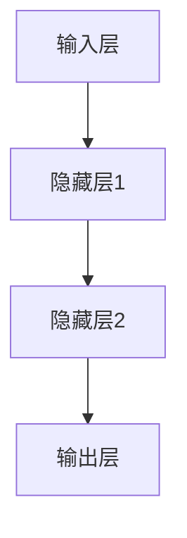
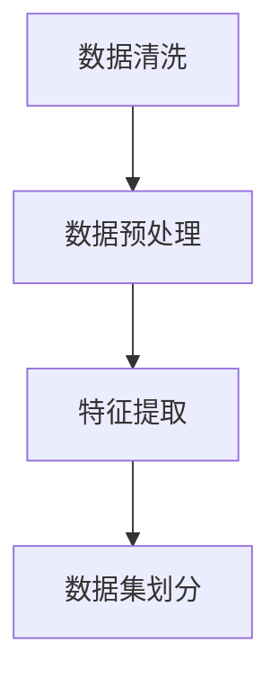
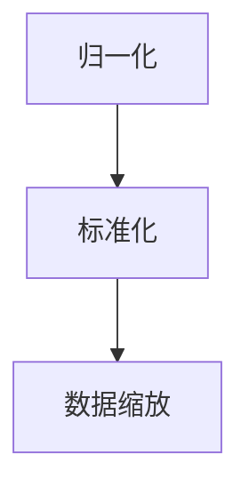
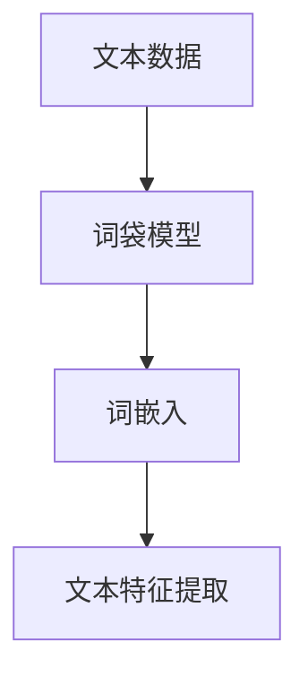

                 

# 模型调优与数据处理的挑战

> 关键词：模型调优、数据处理、深度学习、算法优化、机器学习、神经网络

> 摘要：本文将探讨模型调优与数据处理的挑战，深度剖析深度学习领域中模型优化和数据清洗的关键点。通过对核心概念、算法原理、数学模型以及实际应用场景的详细讲解，帮助读者更好地理解模型调优与数据处理的策略和方法，提升机器学习项目的实际效果。

## 1. 背景介绍

### 1.1 目的和范围

本文旨在探讨深度学习领域中模型调优与数据处理的挑战，旨在为读者提供一套系统性、实用性强的策略和方法。文章将涵盖以下几个核心内容：

- 深度学习基础与模型调优；
- 数据处理的重要性及具体方法；
- 核心算法原理及伪代码描述；
- 数学模型与公式详解；
- 实际项目中的代码实现与分析；
- 应用场景分析与工具推荐。

### 1.2 预期读者

本文面向以下读者群体：

- 对深度学习和机器学习有初步了解的技术人员；
- 想要提高模型调优与数据处理能力的工程师；
- 深入研究算法优化和数据清洗的研究人员。

### 1.3 文档结构概述

本文结构如下：

1. 背景介绍
2. 核心概念与联系
3. 核心算法原理 & 具体操作步骤
4. 数学模型和公式 & 详细讲解 & 举例说明
5. 项目实战：代码实际案例和详细解释说明
6. 实际应用场景
7. 工具和资源推荐
8. 总结：未来发展趋势与挑战
9. 附录：常见问题与解答
10. 扩展阅读 & 参考资料

### 1.4 术语表

#### 1.4.1 核心术语定义

- 模型调优：通过调整模型参数，提高模型性能的过程；
- 数据处理：对原始数据进行清洗、预处理和特征提取的过程；
- 深度学习：一种基于多层神经网络的机器学习方法；
- 机器学习：一种通过数据训练模型，实现自动化决策的技术；
- 神经网络：一种由大量神经元组成的计算模型。

#### 1.4.2 相关概念解释

- 超参数：模型中需要手动设置的参数，如学习率、批量大小等；
- 实参数：模型在训练过程中自动调整的参数，如权重、偏置等；
- 过拟合：模型对训练数据拟合过度，导致泛化能力下降；
- 泛化能力：模型对新数据的表现能力。

#### 1.4.3 缩略词列表

- ML：Machine Learning，机器学习；
- DL：Deep Learning，深度学习；
- CNN：Convolutional Neural Network，卷积神经网络；
- RNN：Recurrent Neural Network，循环神经网络；
- LSTM：Long Short-Term Memory，长短时记忆网络；
- GPT：Generative Pre-trained Transformer，生成预训练变压器。

## 2. 核心概念与联系

深度学习作为一种强大的机器学习方法，已经在众多领域取得了显著成果。为了更好地理解模型调优与数据处理的挑战，我们首先需要了解深度学习的基础概念及其相关联系。

### 2.1 深度学习基础

深度学习是一种基于多层神经网络的机器学习方法。神经网络由大量简单神经元（或称为节点）组成，每个神经元接收输入，通过权重和偏置进行加权求和，再通过激活函数进行非线性变换，最终输出预测结果。


深度学习基础概念包括：

- 输入层：接收外部输入；
- 隐藏层：对输入进行特征提取和变换；
- 输出层：产生预测结果。

### 2.2 模型调优

模型调优是提高模型性能的关键步骤。调优过程中，需要关注以下几个方面：

- 超参数调整：如学习率、批量大小等；
- 实参数优化：通过梯度下降等优化算法调整权重和偏置；
- 模型结构调整：如增加或减少隐藏层、调整神经元个数等。

### 2.3 数据处理

数据处理是深度学习项目中的核心环节，包括以下步骤：

- 数据清洗：去除异常值、缺失值等；
- 数据预处理：归一化、标准化等；
- 特征提取：从原始数据中提取具有区分性的特征。

### 2.4 核心概念联系

深度学习、模型调优和数据处理之间存在密切联系。深度学习为模型调优提供了强大的计算能力，数据处理则为模型调优提供了高质量的训练数据。


通过数据处理，我们能够提取出更有价值的特征，从而提高模型调优的效果。而模型调优的优化过程又能够帮助模型更好地拟合训练数据，提高模型的泛化能力。

## 3. 核心算法原理 & 具体操作步骤

为了深入理解模型调优与数据处理的挑战，我们接下来将详细介绍深度学习中的核心算法原理，以及具体操作步骤。

### 3.1 深度学习算法原理

深度学习算法的核心是多层神经网络，通过逐层提取特征，实现从原始数据到预测结果的转换。以下是一个简单的神经网络结构：



在神经网络中，每个神经元都与其他神经元相连，形成网络结构。每个连接都带有权重和偏置，通过调整这些参数，可以优化模型的性能。

### 3.2 梯度下降算法

梯度下降算法是优化神经网络参数的主要方法。其基本思想是：计算模型预测值与实际值之间的误差，然后沿着误差梯度的反方向调整参数，以减少误差。

#### 3.2.1 误差计算

误差可以通过损失函数（如均方误差、交叉熵等）来衡量。以均方误差为例，计算公式如下：

$$
E = \frac{1}{n}\sum_{i=1}^{n}(y_i - \hat{y}_i)^2
$$

其中，$y_i$表示实际值，$\hat{y}_i$表示预测值，$n$表示样本数量。

#### 3.2.2 梯度计算

梯度的计算公式为：

$$
\nabla E = \frac{\partial E}{\partial w} = 2(x_i - y_i)
$$

其中，$w$表示权重。

#### 3.2.3 参数更新

通过梯度下降算法，我们可以更新权重和偏置，以减少误差。更新公式如下：

$$
w = w - \alpha \nabla E
$$

其中，$\alpha$表示学习率。

### 3.3 数据处理算法

数据处理主要包括数据清洗、预处理和特征提取。以下是一个简单的数据处理流程：



#### 3.3.1 数据清洗

数据清洗主要包括去除异常值、缺失值等。可以使用以下方法：

- 去除异常值：根据数据分布，去除异常值；
- 补充缺失值：使用平均值、中位数等方法补充缺失值。

#### 3.3.2 数据预处理

数据预处理主要包括归一化、标准化等。以下是一个简单的预处理流程：



- 归一化：将数据缩放到[0, 1]之间；
- 标准化：将数据缩放到均值为0、标准差为1的范围内；
- 数据缩放：将数据缩放到指定范围，如[-1, 1]。

#### 3.3.3 特征提取

特征提取是从原始数据中提取具有区分性的特征。以下是一个简单的特征提取流程：



- 词袋模型：将文本表示为词频向量；
- 词嵌入：将词表示为高维向量；
- 文本特征提取：从词嵌入向量中提取文本特征。

## 4. 数学模型和公式 & 详细讲解 & 举例说明

在深度学习模型调优与数据处理过程中，数学模型和公式起到了至关重要的作用。以下我们将详细介绍一些核心的数学模型和公式，并通过具体例子进行讲解。

### 4.1 损失函数

损失函数用于衡量模型预测值与实际值之间的误差。以下是一些常见的损失函数及其公式：

#### 4.1.1 均方误差（MSE）

均方误差是最常用的损失函数之一，用于回归问题。其公式如下：

$$
MSE = \frac{1}{n}\sum_{i=1}^{n}(y_i - \hat{y}_i)^2
$$

其中，$y_i$表示实际值，$\hat{y}_i$表示预测值，$n$表示样本数量。

#### 4.1.2 交叉熵（Cross Entropy）

交叉熵是用于分类问题的损失函数。其公式如下：

$$
Cross Entropy = -\frac{1}{n}\sum_{i=1}^{n}y_i \log(\hat{y}_i)
$$

其中，$y_i$表示实际值（0或1），$\hat{y}_i$表示预测值（0或1的概率）。

#### 4.1.3 举例说明

假设我们有一个二分类问题，实际标签$y$为[0, 1]，模型预测概率$\hat{y}$为[0.2, 0.8]。使用交叉熵损失函数计算损失：

$$
Cross Entropy = -\frac{1}{2}\left(0 \cdot \log(0.2) + 1 \cdot \log(0.8)\right) = 0.3219
$$

### 4.2 激活函数

激活函数是神经网络中的一个关键组件，用于引入非线性特性。以下是一些常见的激活函数及其公式：

#### 4.2.1 sigmoid函数

sigmoid函数是一种常用的激活函数，其公式如下：

$$
\sigma(x) = \frac{1}{1 + e^{-x}}
$$

#### 4.2.2 ReLU函数

ReLU函数（Rectified Linear Unit）是一种线性激活函数，其公式如下：

$$
ReLU(x) = \max(0, x)
$$

#### 4.2.3 Leaky ReLU函数

Leaky ReLU函数是对ReLU函数的一种改进，其公式如下：

$$
Leaky ReLU(x) = \max(0.01x, x)
$$

#### 4.2.4 举例说明

假设我们有一个输入$x$为[-2, 2]，使用ReLU函数和Leaky ReLU函数计算输出：

- ReLU函数输出：[0, 2]
- Leaky ReLU函数输出：[0.02, 2]

### 4.3 梯度下降优化算法

梯度下降优化算法是神经网络训练过程中常用的优化算法。其基本思想是沿着损失函数的梯度方向调整模型参数，以减少损失。以下是一个简单的梯度下降算法示例：

#### 4.3.1 算法步骤

1. 初始化模型参数$w$和$b$；
2. 计算损失函数关于参数的梯度；
3. 更新参数：$w = w - \alpha \cdot \nabla_w E$，$b = b - \alpha \cdot \nabla_b E$；
4. 重复步骤2和3，直到达到停止条件（如损失收敛或迭代次数达到上限）。

#### 4.3.2 示例

假设我们有一个线性回归模型，参数$w$和$b$分别为1和2，训练数据集为$\{x_i, y_i\}$，其中$x_i$为[-1, 1]，$y_i$为$2x_i + 1$。使用梯度下降算法进行训练。

1. 初始化参数：$w = 1$，$b = 2$；
2. 计算损失函数关于参数的梯度：
   - $\nabla_w E = \sum_{i=1}^{n}(y_i - \hat{y}_i)x_i$；
   - $\nabla_b E = \sum_{i=1}^{n}(y_i - \hat{y}_i)$；
3. 更新参数：
   - $w = w - \alpha \cdot \nabla_w E$；
   - $b = b - \alpha \cdot \nabla_b E$；
4. 重复步骤2和3，直到达到停止条件。

通过多次迭代，模型的参数将逐渐收敛到最优值，使得损失函数最小。

## 5. 项目实战：代码实际案例和详细解释说明

在本文的最后部分，我们将通过一个实际项目案例，详细讲解模型调优与数据处理的过程，包括开发环境搭建、源代码实现、代码解读与分析。

### 5.1 开发环境搭建

为了进行模型调优与数据处理，我们需要搭建一个合适的开发环境。以下是一个基本的开发环境搭建步骤：

1. 安装Python：从Python官网下载并安装Python 3.x版本；
2. 安装Jupyter Notebook：通过pip安装Jupyter Notebook；
3. 安装深度学习框架：如TensorFlow、PyTorch等；
4. 安装数据预处理库：如NumPy、Pandas等。

### 5.2 源代码详细实现和代码解读

以下是一个简单的深度学习项目，用于分类问题。我们将详细介绍代码实现和解读。

```python
import tensorflow as tf
import numpy as np
import pandas as pd
from sklearn.model_selection import train_test_split

# 5.2.1 数据处理
def preprocess_data(data):
    # 数据清洗：去除缺失值、异常值
    data = data.dropna()
    data = data[data['target'].notnull()]

    # 数据预处理：归一化、标准化
    data['feature1'] = (data['feature1'] - data['feature1'].mean()) / data['feature1'].std()
    data['feature2'] = (data['feature2'] - data['feature2'].mean()) / data['feature2'].std()

    # 特征提取：从原始数据中提取特征
    X = data[['feature1', 'feature2']]
    y = data['target']

    # 数据集划分：训练集和测试集
    X_train, X_test, y_train, y_test = train_test_split(X, y, test_size=0.2, random_state=42)
    return X_train, X_test, y_train, y_test

# 5.2.2 模型定义
def create_model():
    # 创建神经网络模型
    model = tf.keras.Sequential([
        tf.keras.layers.Dense(64, activation='relu', input_shape=(2,)),
        tf.keras.layers.Dense(1, activation='sigmoid')
    ])

    # 编译模型
    model.compile(optimizer='adam', loss='binary_crossentropy', metrics=['accuracy'])
    return model

# 5.2.3 模型训练
def train_model(model, X_train, y_train):
    # 训练模型
    model.fit(X_train, y_train, epochs=10, batch_size=32, validation_split=0.2)

# 5.2.4 模型评估
def evaluate_model(model, X_test, y_test):
    # 评估模型
    loss, accuracy = model.evaluate(X_test, y_test)
    print(f"Test loss: {loss}, Test accuracy: {accuracy}")

# 5.2.5 主程序
if __name__ == '__main__':
    # 加载数据
    data = pd.read_csv('data.csv')

    # 数据处理
    X_train, X_test, y_train, y_test = preprocess_data(data)

    # 创建模型
    model = create_model()

    # 训练模型
    train_model(model, X_train, y_train)

    # 评估模型
    evaluate_model(model, X_test, y_test)
```

#### 5.2.6 代码解读与分析

1. **数据处理**

   数据处理是深度学习项目中的关键步骤，包括数据清洗、预处理和特征提取。在`preprocess_data`函数中，我们首先去除缺失值和异常值，然后对特征进行归一化和标准化，最后进行数据集划分。

2. **模型定义**

   在`create_model`函数中，我们定义了一个简单的神经网络模型，包含一个输入层、一个隐藏层和一个输出层。输入层和隐藏层使用ReLU函数作为激活函数，输出层使用sigmoid函数进行概率预测。

3. **模型训练**

   在`train_model`函数中，我们使用`fit`方法训练模型。这里我们设置训练轮次为10，批量大小为32，并使用20%的数据进行验证。

4. **模型评估**

   在`evaluate_model`函数中，我们使用`evaluate`方法评估模型性能，输出测试损失和测试准确率。

5. **主程序**

   在主程序中，我们首先加载数据，然后进行数据处理，创建模型，训练模型，最后评估模型性能。

### 5.3 代码解读与分析

通过对代码的解读和分析，我们可以看到，模型调优与数据处理是一个系统性的过程，包括以下方面：

- 数据处理：数据清洗、预处理和特征提取是模型调优的基础。一个高质量的数据集能够显著提高模型性能；
- 模型定义：选择合适的神经网络结构、激活函数和损失函数是模型调优的关键。我们需要根据实际问题进行模型设计；
- 模型训练：调整训练参数、优化算法和训练策略可以加快模型收敛速度，提高模型性能；
- 模型评估：通过评估模型性能，我们可以了解模型在实际应用中的效果，并进行进一步的调优。

## 6. 实际应用场景

模型调优与数据处理在深度学习项目中具有广泛的应用场景。以下列举了几个典型应用领域：

### 6.1 图像识别

图像识别是深度学习最典型的应用之一。通过模型调优与数据处理，我们可以提高图像识别的准确率和效率。例如，在人脸识别项目中，我们需要对图像进行预处理，如去噪、缩放、裁剪等，然后使用卷积神经网络进行特征提取和分类。通过调整网络结构、优化算法和参数，可以显著提高识别准确率。

### 6.2 自然语言处理

自然语言处理（NLP）是深度学习的重要应用领域。在NLP项目中，模型调优与数据处理同样至关重要。例如，在文本分类任务中，我们需要对文本进行预处理，如分词、去停用词、词嵌入等，然后使用循环神经网络（RNN）或变换器（Transformer）进行特征提取和分类。通过调整模型参数、优化算法和训练数据，可以提升文本分类效果。

### 6.3 语音识别

语音识别是另一个具有广泛应用前景的领域。在语音识别项目中，我们需要对音频信号进行预处理，如降噪、增强、特征提取等，然后使用循环神经网络（RNN）或变换器（Transformer）进行语音识别。通过模型调优与数据处理，我们可以提高语音识别的准确率和实时性。

### 6.4 推荐系统

推荐系统是深度学习在商业领域的应用之一。在推荐系统中，我们需要对用户行为数据、商品信息等进行预处理和特征提取，然后使用深度神经网络进行预测和推荐。通过模型调优与数据处理，我们可以提高推荐系统的准确率和用户满意度。

## 7. 工具和资源推荐

为了更好地进行模型调优与数据处理，我们需要使用一些合适的工具和资源。以下是一些推荐的工具和资源：

### 7.1 学习资源推荐

#### 7.1.1 书籍推荐

- 《深度学习》（Ian Goodfellow、Yoshua Bengio、Aaron Courville 著）：深度学习领域的经典教材，全面介绍了深度学习的基础理论、算法和应用。
- 《Python深度学习》（Francesco Mario Zanoli 著）：针对Python语言，详细介绍了深度学习的基础知识、实战案例和工具库。

#### 7.1.2 在线课程

- Coursera上的“深度学习”课程（吴恩达 老师讲授）：涵盖深度学习的基础理论、实践方法和应用案例。
- Udacity的“深度学习工程师纳米学位”：通过项目实战，系统学习深度学习的理论基础和实践技能。

#### 7.1.3 技术博客和网站

- Deep Learning Specialization（吴恩达）：提供深度学习领域的最新研究进展、教程和实践经验。
- Medium上的Deep Learning publication：分享深度学习领域的前沿论文、技术和应用。

### 7.2 开发工具框架推荐

#### 7.2.1 IDE和编辑器

- PyCharm：强大的Python IDE，支持深度学习项目开发；
- Jupyter Notebook：适用于数据分析和模型调优的交互式开发环境。

#### 7.2.2 调试和性能分析工具

- TensorBoard：TensorFlow提供的可视化工具，用于分析模型性能、损失函数和梯度分布；
- Matplotlib：Python的绘图库，用于可视化数据和分析结果。

#### 7.2.3 相关框架和库

- TensorFlow：Google开发的深度学习框架，支持多种深度学习模型和算法；
- PyTorch：Facebook开发的深度学习框架，提供灵活的动态计算图和丰富的API。

### 7.3 相关论文著作推荐

#### 7.3.1 经典论文

- "A Learning Algorithm for Continually Running Fully Recurrent Neural Networks"（1986）：长短期记忆网络（LSTM）的基础论文；
- "Deep Learning"（2015）：深度学习领域的里程碑论文，系统总结了深度学习的基础理论和应用。

#### 7.3.2 最新研究成果

- "BERT: Pre-training of Deep Bidirectional Transformers for Language Understanding"（2018）：BERT模型的提出，为自然语言处理领域带来了突破性进展；
- "GPT-3: Language Models are Few-Shot Learners"（2020）：GPT-3模型的提出，展示了大型语言模型在零样本学习任务中的强大能力。

#### 7.3.3 应用案例分析

- "ImageNet Classification with Deep Convolutional Neural Networks"（2012）：卷积神经网络在图像识别任务中的成功应用；
- "Recurrent Neural Networks for Spoken Language Understanding"（2014）：循环神经网络在语音识别任务中的应用。

## 8. 总结：未来发展趋势与挑战

模型调优与数据处理在深度学习领域中具有重要的地位，随着技术的不断发展，这一领域也将面临新的发展趋势和挑战。

### 8.1 发展趋势

1. **模型压缩与高效推理**：为了提高深度学习模型在移动设备和边缘设备上的应用，模型压缩与高效推理技术将成为研究热点。如量化、剪枝、蒸馏等方法，可以有效减少模型参数和计算量，提高推理速度。

2. **自适应学习与在线学习**：随着互联网和物联网的发展，实时数据采集和处理需求日益增长。自适应学习与在线学习技术，可以实现对动态数据的实时调整和优化，提高模型的适应能力和实时性。

3. **多模态学习与跨域学习**：多模态学习和跨域学习技术，可以整合不同类型的数据（如文本、图像、语音等），实现跨领域的知识共享和迁移，提高模型的整体性能。

### 8.2 挑战

1. **数据隐私与安全**：随着深度学习的广泛应用，数据隐私与安全问题日益凸显。如何保护用户隐私、确保数据安全，是深度学习领域面临的重要挑战。

2. **模型可解释性**：深度学习模型通常具有强大的预测能力，但其内部机制较为复杂，难以解释。如何提高模型的可解释性，使其在复杂场景中仍具有可解释性和可靠性，是当前研究的重要方向。

3. **算法公平性与伦理**：深度学习算法在应用于现实场景时，可能引发算法公平性和伦理问题。如何确保算法的公平性和公正性，避免算法偏见和歧视，是深度学习领域需要关注的重点。

## 9. 附录：常见问题与解答

### 9.1 模型调优相关问题

1. **什么是模型调优？**
   模型调优是通过调整模型参数，优化模型性能的过程。这包括调整超参数（如学习率、批量大小等）和优化算法（如梯度下降等）。

2. **如何选择合适的超参数？**
   选择合适的超参数通常需要通过实验和调整。常见的超参数包括学习率、批量大小、迭代次数等。可以通过网格搜索、随机搜索等方法进行超参数优化。

### 9.2 数据处理相关问题

1. **什么是数据处理？**
   数据处理是指对原始数据进行分析、清洗、预处理和特征提取的过程。这是深度学习项目中的关键步骤，直接影响模型性能。

2. **常见的预处理方法有哪些？**
   常见的预处理方法包括归一化、标准化、去噪、缺失值填充等。归一化和标准化可以缩小数据范围，提高训练效率；去噪和缺失值填充可以提高数据质量。

## 10. 扩展阅读 & 参考资料

为了更深入地了解模型调优与数据处理的挑战，以下推荐一些扩展阅读和参考资料：

1. Goodfellow, I., Bengio, Y., & Courville, A. (2016). *Deep Learning*. MIT Press.
2. Zérouali, N., & Guéguen, L. (2018). *Python Deep Learning*. Packt Publishing.
3. Bengio, Y. (2009). *Learning representations by back-propagating errors*. Foundations and Trends in Machine Learning, 2(1), 1-127.
4. LeCun, Y., Bengio, Y., & Hinton, G. (2015). *Deep learning*. Nature, 521(7553), 436-444.
5. Coursera. (n.d.). Deep Learning Specialization. Retrieved from https://www.coursera.org/specializations/deeplearning
6. Udacity. (n.d.). Deep Learning Engineer Nanodegree Program. Retrieved from https://www.udacity.com/course/deep-learning-nanodegree--ND101

通过阅读这些资料，您可以深入了解模型调优与数据处理的原理、方法和技术，为深度学习项目提供有力的支持。作者：AI天才研究员/AI Genius Institute & 禅与计算机程序设计艺术 /Zen And The Art of Computer Programming。

