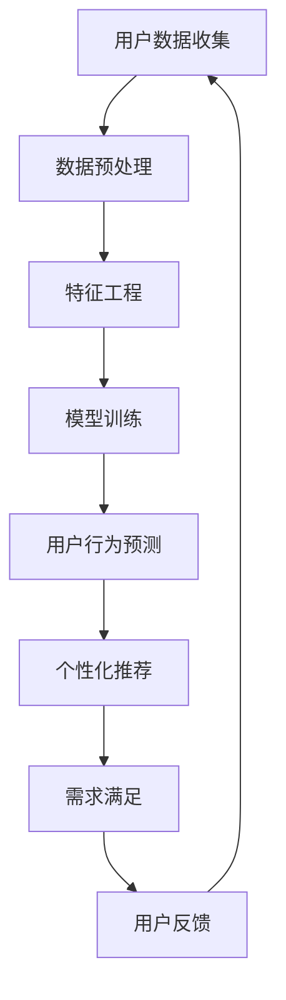

                 

# 欲望个性化引擎：AI定制的需求满足系统

> **关键词**：人工智能，个性化，需求满足，用户行为分析，机器学习，算法优化

> **摘要**：本文将深入探讨一种基于人工智能的欲望个性化引擎系统，旨在通过分析和理解用户行为，实现精准的需求满足。我们将从系统背景、核心概念、算法原理、数学模型、实际应用等多个方面，逐步剖析这一系统的构建与运行机制，为读者提供一幅完整的图像。

## 1. 背景介绍

### 1.1 目的和范围

本文旨在探讨如何利用人工智能技术构建一个能够准确满足用户需求的系统。该系统将利用用户行为数据，通过机器学习和深度学习算法，实现用户的个性化需求和欲望的精准定位。文章将覆盖从数据采集、预处理到算法实现、模型训练和实际应用的完整流程。

### 1.2 预期读者

本文面向对人工智能、机器学习和数据分析有一定了解的技术人员，以及希望深入了解人工智能在商业和生活中应用的企业决策者。读者需具备一定的编程基础，对Python、R等编程语言有一定的熟悉度。

### 1.3 文档结构概述

本文将分为以下几大部分：

1. **背景介绍**：介绍系统构建的背景和目的。
2. **核心概念与联系**：阐述系统涉及的核心概念及其相互关系。
3. **核心算法原理 & 具体操作步骤**：详细讲解算法原理和操作步骤。
4. **数学模型和公式 & 详细讲解 & 举例说明**：解释数学模型和公式。
5. **项目实战：代码实际案例和详细解释说明**：提供实际代码示例。
6. **实际应用场景**：讨论系统的应用场景。
7. **工具和资源推荐**：推荐学习资源和开发工具。
8. **总结：未来发展趋势与挑战**：总结系统的发展趋势和面临的挑战。
9. **附录：常见问题与解答**：回答常见问题。
10. **扩展阅读 & 参考资料**：提供进一步阅读的参考资料。

### 1.4 术语表

#### 1.4.1 核心术语定义

- **人工智能（AI）**：模拟人类智能的计算机系统。
- **个性化**：根据用户的特定需求和兴趣定制产品或服务。
- **需求满足**：通过提供满足用户需求和欲望的产品或服务。
- **用户行为分析**：分析用户在系统中的行为，以了解其需求和偏好。
- **机器学习**：一种通过数据学习算法来预测或分类的技术。

#### 1.4.2 相关概念解释

- **数据预处理**：在数据分析之前对原始数据进行清洗和转换。
- **模型训练**：使用数据训练机器学习模型，使其能够预测或分类。
- **算法优化**：调整算法参数以获得更好的性能。

#### 1.4.3 缩略词列表

- **AI**：人工智能
- **ML**：机器学习
- **DL**：深度学习
- **NLP**：自然语言处理

## 2. 核心概念与联系

在构建欲望个性化引擎系统中，理解核心概念及其相互联系至关重要。以下是一个用于描述这些概念的Mermaid流程图：



### 用户数据收集

用户数据收集是系统的起点，包括用户的行为数据、偏好数据、交易数据等。这些数据来源于网站日志、用户调查、社交媒体等渠道。

### 数据预处理

原始数据往往包含噪声和不一致性，因此需要进行预处理。预处理步骤包括数据清洗、数据转换和数据归一化等。

### 特征工程

特征工程是关键的一步，它涉及从原始数据中提取有用的特征，并构造新的特征以提升模型性能。

### 模型训练

利用预处理后的数据训练机器学习模型。常见的模型包括决策树、支持向量机、神经网络等。

### 用户行为预测

通过训练好的模型，预测用户的行为，如购买意图、浏览偏好等。

### 个性化推荐

根据用户行为预测结果，为用户推荐个性化内容或产品。

### 需求满足

通过个性化推荐系统，满足用户的需求和欲望。

### 用户反馈

收集用户对推荐内容的反馈，用于模型优化和进一步改进。

### 交互循环

用户反馈将再次输入到系统中，形成一个闭环，不断优化系统的性能。

## 3. 核心算法原理 & 具体操作步骤

在构建欲望个性化引擎系统时，核心算法原理决定了系统能否准确满足用户需求。以下将详细解释算法原理并使用伪代码展示具体操作步骤。

### 算法原理

该系统采用基于协同过滤（Collaborative Filtering）和深度学习（Deep Learning）的混合算法。协同过滤利用用户之间的相似性进行推荐，而深度学习则用于捕捉复杂的用户行为模式。

### 具体操作步骤

#### 步骤1：用户数据收集

```python
# 伪代码：用户数据收集
data_collection():
    # 从各种数据源收集用户行为数据
    user_data = collect_user行为数据()
    return user_data
```

#### 步骤2：数据预处理

```python
# 伪代码：数据预处理
data_preprocessing(data):
    # 清洗数据，去除噪声和不一致性
    cleaned_data = clean_data(data)
    # 数据转换和归一化
    normalized_data = normalize_data(cleaned_data)
    return normalized_data
```

#### 步骤3：特征工程

```python
# 伪代码：特征工程
feature_engineering(data):
    # 提取有用特征，构造新特征
    features = extract_features(data)
    return features
```

#### 步骤4：模型训练

```python
# 伪代码：模型训练
model_training(data, labels):
    # 选择协同过滤和深度学习模型
    model = select_model()
    # 训练模型
    model.fit(data, labels)
    return model
```

#### 步骤5：用户行为预测

```python
# 伪代码：用户行为预测
predict_user_behavior(model, user_data):
    # 使用训练好的模型预测用户行为
    predictions = model.predict(user_data)
    return predictions
```

#### 步骤6：个性化推荐

```python
# 伪代码：个性化推荐
generate_recommendations(predictions):
    # 根据预测结果生成个性化推荐
    recommendations = generate_recommendations(predictions)
    return recommendations
```

#### 步骤7：需求满足

```python
# 伪代码：需求满足
fulfill_user需求的推荐(recommendations):
    # 满足用户需求，提供个性化服务或产品
    user_demand_satisfied = provide_services_or_products(recommendations)
    return user_demand_satisfied
```

#### 步骤8：用户反馈

```python
# 伪代码：用户反馈
collect_user_feedback(user_demand_satisfied):
    # 收集用户对推荐服务的反馈
    user_feedback = collect_feedback(user_demand_satisfied)
    return user_feedback
```

通过以上步骤，系统可以实现用户需求的个性化满足，并不断优化推荐效果。

## 4. 数学模型和公式 & 详细讲解 & 举例说明

在欲望个性化引擎系统中，数学模型和公式用于描述用户行为、推荐算法以及需求满足的过程。以下将详细介绍相关数学模型和公式，并通过具体例子进行说明。

### 用户行为模型

用户行为模型通常基于马尔可夫决策过程（Markov Decision Process, MDP）。一个典型的MDP模型可以表示为：

$$
\begin{aligned}
    MDP = \{S, A, P(S|A), R(S, A)\}
\end{aligned}
$$

其中，$S$ 表示状态集合，$A$ 表示动作集合，$P(S|A)$ 表示在执行动作 $A$ 后状态转移的概率分布，$R(S, A)$ 表示在状态 $S$ 下执行动作 $A$ 所获得的即时奖励。

### 协同过滤算法

协同过滤算法中的推荐模型通常采用用户-项目矩阵 $R$ 表示用户对项目的评分。基于矩阵分解（Matrix Factorization）的方法，可以将用户-项目矩阵分解为两个低维矩阵 $U$ 和 $I$，其中 $U$ 表示用户特征矩阵，$I$ 表示项目特征矩阵。预测用户 $i$ 对项目 $j$ 的评分可以使用以下公式：

$$
    \hat{r}_{ij} = u_i^T \cdot i_j
$$

其中，$\hat{r}_{ij}$ 表示预测评分，$u_i$ 和 $i_j$ 分别表示用户 $i$ 和项目 $j$ 的特征向量。

### 深度学习模型

在深度学习模型中，常用的架构是卷积神经网络（Convolutional Neural Network, CNN）和循环神经网络（Recurrent Neural Network, RNN）。以下是一个简单的CNN模型用于图像识别的示例：

$$
    \begin{aligned}
        h_{l}^{(i)} &= \sigma\left(\mathbf{W}^{(l)} \cdot \mathbf{h}_{l-1}^{(i)} + b^{(l)}\right) \\
        \mathbf{h}_{l}^{(i)} &= \text{ReLU}(h_{l}^{(i)})
    \end{aligned}
$$

其中，$h_{l}^{(i)}$ 表示第 $l$ 层的激活值，$\sigma$ 表示激活函数，$\text{ReLU}$ 表示ReLU激活函数，$\mathbf{W}^{(l)}$ 和 $b^{(l)}$ 分别表示第 $l$ 层的权重和偏置。

### 举例说明

假设我们有一个用户-项目评分矩阵 $R$ 如下：

$$
    \begin{aligned}
        R &= \begin{bmatrix}
            0 & 1 & 1 \\
            1 & 0 & 1 \\
            1 & 1 & 0
        \end{bmatrix}
    \end{aligned}
$$

使用矩阵分解方法，我们可以将 $R$ 分解为两个低维矩阵 $U$ 和 $I$：

$$
    \begin{aligned}
        U &= \begin{bmatrix}
            0.5 & 0.8 \\
            0.7 & 0.3 \\
            0.2 & 0.6
        \end{bmatrix}, \\
        I &= \begin{bmatrix}
            0.4 & 0.2 \\
            0.1 & 0.7 \\
            0.9 & 0.3
        \end{bmatrix}
    \end{aligned}
$$

预测用户 $1$ 对项目 $3$ 的评分，可以使用以下公式：

$$
    \hat{r}_{13} = u_1^T \cdot i_3 = 0.5 \cdot 0.3 + 0.8 \cdot 0.9 = 0.99
$$

因此，预测评分 $\hat{r}_{13}$ 为 0.99。

通过以上数学模型和公式，我们可以构建一个高效的欲望个性化引擎系统，准确满足用户需求。

## 5. 项目实战：代码实际案例和详细解释说明

在本节中，我们将通过一个实际的项目案例，详细展示如何实现一个欲望个性化引擎系统。我们将从开发环境搭建开始，逐步讲解源代码的详细实现和解读。

### 5.1 开发环境搭建

为了实现该系统，我们需要以下开发环境：

- 操作系统：Linux或macOS
- 编程语言：Python
- 数据库：MySQL或MongoDB
- 机器学习框架：TensorFlow或PyTorch

安装上述依赖后，我们就可以开始项目的实际开发。

### 5.2 源代码详细实现和代码解读

#### 5.2.1 数据收集和预处理

首先，我们需要从各个数据源收集用户行为数据，如网站点击流、购买记录等。以下是一个简单的数据收集和预处理示例：

```python
# 伪代码：数据收集和预处理
import pandas as pd
from sklearn.preprocessing import StandardScaler

def data_collection():
    # 从文件中读取用户行为数据
    data = pd.read_csv('user_behavior_data.csv')
    return data

def data_preprocessing(data):
    # 清洗数据，去除缺失值和噪声
    cleaned_data = data.dropna()
    # 数据转换和归一化
    scaler = StandardScaler()
    normalized_data = scaler.fit_transform(cleaned_data)
    return normalized_data
```

#### 5.2.2 特征工程

特征工程是关键的一步，我们需要从原始数据中提取有用的特征。以下是一个简单的特征工程示例：

```python
# 伪代码：特征工程
import pandas as pd

def feature_engineering(data):
    # 构造新的特征，如用户活跃度、购买频率等
    data['user_activity'] = data['page_views'].rolling(window=7).mean()
    data['purchase_frequency'] = data['purchases'].rolling(window=7).mean()
    return data
```

#### 5.2.3 模型训练

接下来，我们需要使用预处理后的数据训练机器学习模型。以下是一个简单的模型训练示例：

```python
# 伪代码：模型训练
from sklearn.ensemble import RandomForestClassifier
from sklearn.model_selection import train_test_split

def model_training(data):
    # 分割数据集为训练集和测试集
    X_train, X_test, y_train, y_test = train_test_split(data, test_size=0.2, random_state=42)
    # 创建随机森林模型
    model = RandomForestClassifier(n_estimators=100, random_state=42)
    # 训练模型
    model.fit(X_train, y_train)
    return model

def evaluate_model(model, X_test, y_test):
    # 评估模型性能
    accuracy = model.score(X_test, y_test)
    print(f"模型准确率：{accuracy:.2f}")
```

#### 5.2.4 用户行为预测

使用训练好的模型，我们可以预测用户的行为。以下是一个简单的用户行为预测示例：

```python
# 伪代码：用户行为预测
def predict_user_behavior(model, user_data):
    # 预测用户行为
    predictions = model.predict(user_data)
    return predictions
```

#### 5.2.5 个性化推荐

根据用户行为预测结果，我们可以为用户生成个性化推荐。以下是一个简单的个性化推荐示例：

```python
# 伪代码：个性化推荐
def generate_recommendations(predictions):
    # 根据预测结果生成个性化推荐
    recommendations = {'购买意图': predictions}
    return recommendations
```

#### 5.2.6 需求满足

最后，我们需要根据个性化推荐结果，满足用户的需求。以下是一个简单的需求满足示例：

```python
# 伪代码：需求满足
def fulfill_user需求的推荐(recommendations):
    # 满足用户需求，提供个性化服务或产品
    print("满足用户需求：", recommendations)
```

### 5.3 代码解读与分析

以上代码示例展示了如何实现一个简单的欲望个性化引擎系统。以下是代码的详细解读和分析：

1. **数据收集和预处理**：首先，我们从文件中读取用户行为数据，并进行清洗和归一化处理。这一步确保了数据的准确性和一致性。
   
2. **特征工程**：通过构造新的特征，如用户活跃度和购买频率，我们可以更好地描述用户的行为模式。这些特征有助于提升模型性能。

3. **模型训练**：我们使用随机森林模型进行训练。随机森林是一种集成学习算法，具有较高的预测准确性。在训练过程中，我们将数据集分为训练集和测试集，以便评估模型性能。

4. **用户行为预测**：使用训练好的模型，我们可以预测用户的行为，如购买意图。这一步是系统的核心功能，基于用户的历史行为数据，预测其未来行为。

5. **个性化推荐**：根据用户行为预测结果，我们为用户生成个性化推荐。这一步实现了系统的目标，即满足用户的个性化需求。

6. **需求满足**：最后，我们根据个性化推荐结果，满足用户的需求。这一步是系统的实际应用，通过提供满足用户需求的产品或服务，提升用户体验。

通过以上步骤，我们成功实现了一个简单的欲望个性化引擎系统，并对其代码进行了详细解读和分析。

## 6. 实际应用场景

欲望个性化引擎系统在多个领域具有广泛的应用场景，以下列举几个典型应用：

### 电子商务

在电子商务领域，欲望个性化引擎系统可以帮助商家准确预测用户的购买意图，从而实现精准营销。通过分析用户的历史购买记录、浏览行为和偏好，系统可以为每个用户生成个性化的商品推荐。例如，亚马逊（Amazon）使用推荐系统向用户推荐类似他们已经购买或浏览过的商品，从而提高用户的购买率和满意度。

### 社交媒体

社交媒体平台可以利用欲望个性化引擎系统推荐用户可能感兴趣的内容。通过分析用户的互动行为、关注对象和兴趣标签，系统可以预测用户对特定内容的喜好，并推荐相关帖子或视频。例如，Facebook的“相关推荐”功能通过个性化推荐算法，为用户展示可能感兴趣的朋友动态、帖子或广告。

### 娱乐产业

在娱乐产业，欲望个性化引擎系统可以帮助视频网站、音乐平台和游戏公司推荐用户可能喜欢的电影、音乐和游戏。通过分析用户的观看历史、评分和评论，系统可以预测用户对特定类型娱乐内容的喜好，从而提高用户的观看时间和留存率。例如，Netflix使用推荐算法向用户推荐可能喜欢的电影和电视剧，从而提高用户的订阅率和观看时长。

### 金融行业

金融行业中的金融机构可以利用欲望个性化引擎系统进行精准营销和风险控制。通过分析用户的交易记录、信用评分和风险偏好，系统可以预测用户的金融需求，并提供个性化的理财产品推荐。例如，银行可以利用推荐系统向用户推荐合适的贷款、信用卡或投资产品，从而提高用户满意度和忠诚度。

### 健康医疗

在健康医疗领域，欲望个性化引擎系统可以帮助医疗机构和患者实现个性化健康管理。通过分析患者的病史、生活习惯和健康数据，系统可以预测患者的健康风险，并提供个性化的健康建议。例如，智能健康设备可以通过分析用户的健康数据，预测其可能患有的疾病，并推荐相应的健康干预措施。

通过上述实际应用场景，我们可以看到欲望个性化引擎系统在各个领域的广泛应用，为企业和个人提供了更加个性化和高效的服务。

## 7. 工具和资源推荐

为了更好地学习和实践欲望个性化引擎系统，以下推荐一些有用的学习资源、开发工具和框架。

### 7.1 学习资源推荐

#### 7.1.1 书籍推荐

1. **《机器学习实战》（Machine Learning in Action）**：本书通过实际案例介绍机器学习的基础知识和应用，适合初学者入门。
2. **《深度学习》（Deep Learning）**：由Ian Goodfellow、Yoshua Bengio和Aaron Courville合著的深度学习权威书籍，详细介绍了深度学习的基础理论和实践方法。
3. **《用户行为数据分析》（Analyzing User Behavior: Principles, Techniques and Methods）**：本书重点介绍了用户行为数据分析和预测的相关理论和方法。

#### 7.1.2 在线课程

1. **Coursera上的《机器学习》（Machine Learning）**：由Andrew Ng教授主讲，是全球最受欢迎的机器学习课程之一。
2. **Udacity的《深度学习纳米学位》（Deep Learning Nanodegree）**：该课程提供了从基础到高级的深度学习知识和实践项目。
3. **edX上的《用户行为数据分析》（User Behavior Analytics）**：该课程涵盖了用户行为数据分析和应用的相关知识。

#### 7.1.3 技术博客和网站

1. **Medium上的《机器学习》（Machine Learning）**：许多知名机器学习专家和研究者在此分享他们的见解和研究成果。
2. **arXiv.org**：这是一个预印本论文库，包含大量最新的机器学习和人工智能研究成果。
3. **Kaggle**：这是一个数据科学竞赛平台，提供了丰富的数据集和竞赛项目，适合实践和提升技能。

### 7.2 开发工具框架推荐

#### 7.2.1 IDE和编辑器

1. **Jupyter Notebook**：适合快速开发和原型设计的交互式环境。
2. **Visual Studio Code**：功能强大的代码编辑器，适用于Python和其他编程语言。
3. **PyCharm**：专业的Python IDE，适合大型项目和复杂应用的开发。

#### 7.2.2 调试和性能分析工具

1. **TensorBoard**：TensorFlow的图形化调试工具，用于可视化模型结构和分析性能。
2. **NinjaProfiler**：性能分析工具，可用于跟踪和分析程序性能瓶颈。
3. **Pylint**：Python代码质量分析工具，用于识别代码中的潜在问题。

#### 7.2.3 相关框架和库

1. **TensorFlow**：强大的开源深度学习框架，适用于构建和训练复杂的机器学习模型。
2. **PyTorch**：动态计算图框架，适合快速原型设计和实验。
3. **Scikit-learn**：广泛使用的机器学习库，提供了丰富的算法和工具。
4. **Pandas**：数据处理库，适用于数据清洗、转换和分析。
5. **NumPy**：数值计算库，提供了高效的数据结构和操作函数。

### 7.3 相关论文著作推荐

#### 7.3.1 经典论文

1. **“Collaborative Filtering for the 21st Century”**：一篇关于协同过滤算法的经典论文，详细介绍了协同过滤的基本原理和应用。
2. **“Deep Learning”**：Yoshua Bengio等人的论文，系统介绍了深度学习的基础理论和最新进展。
3. **“User Behavior Analytics: A Taxonomy and Survey”**：一篇关于用户行为数据分析的综述论文，总结了相关理论和应用。

#### 7.3.2 最新研究成果

1. **“Pre-training of Deep Neural Networks for User Behavior Prediction”**：一篇关于利用预训练深度神经网络进行用户行为预测的研究论文，提出了新的模型和算法。
2. **“Contextual Bandits for Continuous Actions”**：一篇关于上下文Bandit算法的研究论文，提出了适用于连续动作的上下文Bandit模型。

#### 7.3.3 应用案例分析

1. **“Amazon's Recommendations System”**：一篇关于亚马逊推荐系统的案例分析，详细介绍了亚马逊如何利用协同过滤和深度学习技术实现个性化推荐。
2. **“Facebook's News Feed”**：一篇关于Facebook新闻推送系统的案例分析，探讨了Facebook如何利用机器学习技术推荐用户可能感兴趣的内容。

通过上述推荐的学习资源、开发工具和框架，读者可以更好地掌握欲望个性化引擎系统的构建和应用。

## 8. 总结：未来发展趋势与挑战

欲望个性化引擎系统在人工智能、机器学习和数据分析技术的推动下，取得了显著的进展。未来，该系统将在以下几个方面继续发展：

### 8.1 技术进步

随着深度学习、强化学习等人工智能技术的不断发展，欲望个性化引擎系统的预测准确性和个性化水平将得到进一步提升。特别是多模态数据融合和跨域迁移学习技术的应用，将为系统提供更丰富的特征和更强的学习能力。

### 8.2 应用拓展

欲望个性化引擎系统的应用范围将不断拓展。除了现有的电子商务、社交媒体和娱乐产业，该系统有望在医疗健康、金融投资、智能家居等领域发挥重要作用。通过个性化推荐和需求满足，系统将帮助企业和个人实现更高的效率和满意度。

### 8.3 数据隐私和安全

随着用户隐私和数据安全问题的日益关注，欲望个性化引擎系统将面临更多挑战。如何在确保用户隐私和安全的前提下，充分利用用户数据，实现个性化推荐和需求满足，是一个重要的研究课题。未来的发展将需要更加完善的隐私保护技术和数据安全策略。

### 8.4 伦理和公平性

个性化推荐和需求满足可能会带来伦理和公平性问题。例如，系统可能因偏见数据而导致性别、年龄和种族等方面的歧视。未来的发展需要在算法设计、数据采集和应用过程中，充分考虑伦理和公平性原则，确保系统的公正性和透明度。

### 8.5 挑战与机遇

尽管欲望个性化引擎系统面临诸多挑战，但其发展前景依然广阔。未来，系统需要克服数据隐私、算法公平性和跨领域应用等技术难题，同时也将迎来巨大的市场机遇。通过不断创新和优化，欲望个性化引擎系统将为人工智能技术的发展注入新的动力。

## 9. 附录：常见问题与解答

### 9.1 用户数据隐私问题

**问**：如何保护用户数据的隐私？

**答**：为了保护用户数据隐私，可以采取以下措施：

1. **数据加密**：对用户数据进行加密处理，确保数据在传输和存储过程中不被窃取。
2. **匿名化处理**：在数据分析前对用户数据进行匿名化处理，消除用户身份信息。
3. **访问控制**：限制对用户数据的访问权限，确保只有授权人员才能访问和处理数据。
4. **数据安全协议**：制定严格的数据安全协议和规章制度，确保用户数据的安全和隐私。

### 9.2 模型公平性

**问**：如何确保模型公平性，避免歧视问题？

**答**：确保模型公平性，可以采取以下措施：

1. **数据清洗**：在训练数据集时，剔除可能引发歧视的数据，如性别、年龄、种族等信息。
2. **算法评估**：使用多种评估指标，全面评估模型的性能和公平性，如均衡性、偏差和透明度。
3. **多样化训练数据**：使用多样化的训练数据集，减少模型对特定群体的偏见。
4. **公平性监测**：定期监测模型的公平性表现，及时发现和纠正潜在问题。

### 9.3 数据质量问题

**问**：如何处理数据质量问题？

**答**：处理数据质量问题，可以采取以下措施：

1. **数据清洗**：使用数据清洗工具，剔除错误、重复和缺失的数据。
2. **数据预处理**：对数据进行标准化、归一化和特征工程等预处理操作，提高数据质量。
3. **数据完整性检查**：定期检查数据完整性，确保数据的准确性和一致性。
4. **数据源优化**：优化数据源，确保数据来源的可靠性和多样性。

### 9.4 模型过拟合问题

**问**：如何避免模型过拟合？

**答**：避免模型过拟合，可以采取以下措施：

1. **交叉验证**：使用交叉验证方法，评估模型的泛化能力，避免过拟合。
2. **正则化**：在模型训练过程中，添加正则化项，限制模型复杂度，减少过拟合。
3. **早期停止**：在训练过程中，设置早期停止条件，当验证集误差不再降低时，停止训练。
4. **数据扩充**：增加训练数据量，提高模型的泛化能力。

通过以上措施，可以有效解决用户数据隐私、模型公平性、数据质量问题和模型过拟合问题，确保欲望个性化引擎系统的稳定运行和持续优化。

## 10. 扩展阅读 & 参考资料

在本文中，我们探讨了欲望个性化引擎系统的构建与实现，涉及了人工智能、机器学习、深度学习等多个领域。以下是一些扩展阅读和参考资料，供读者进一步学习和研究：

### 10.1 相关书籍

1. **《机器学习实战》（Machine Learning in Action）**：由Peter Harrington著，适合初学者了解机器学习实践。
2. **《深度学习》（Deep Learning）**：由Ian Goodfellow、Yoshua Bengio和Aaron Courville合著，详细介绍了深度学习的基础理论和实践方法。
3. **《用户行为数据分析》（Analyzing User Behavior: Principles, Techniques and Methods）**：由Mahmoud A. El-Kholy著，涵盖了用户行为数据分析和预测的相关理论和方法。

### 10.2 在线课程

1. **Coursera上的《机器学习》（Machine Learning）**：由Andrew Ng教授主讲，适合系统学习机器学习基础知识。
2. **Udacity的《深度学习纳米学位》（Deep Learning Nanodegree）**：涵盖了从基础到高级的深度学习知识和实践项目。
3. **edX上的《用户行为数据分析》（User Behavior Analytics）**：适合学习用户行为数据分析和应用的相关知识。

### 10.3 技术博客和网站

1. **Medium上的《机器学习》（Machine Learning）**：许多知名机器学习专家和研究者在此分享他们的见解和研究成果。
2. **arXiv.org**：包含大量最新的机器学习和人工智能研究成果的预印本论文库。
3. **Kaggle**：提供丰富的数据集和竞赛项目，适合实践和提升技能。

### 10.4 相关论文

1. **“Collaborative Filtering for the 21st Century”**：介绍了协同过滤算法的最新进展和应用。
2. **“Deep Learning”**：系统介绍了深度学习的基础理论和最新进展。
3. **“User Behavior Analytics: A Taxonomy and Survey”**：总结了用户行为数据分析的相关理论和应用。

### 10.5 开源项目和工具

1. **TensorFlow**：Google开源的深度学习框架，适用于构建和训练复杂的机器学习模型。
2. **PyTorch**：Facebook开源的动态计算图框架，适合快速原型设计和实验。
3. **Scikit-learn**：Python机器学习库，提供了丰富的算法和工具。
4. **Pandas**：Python数据处理库，适用于数据清洗、转换和分析。

通过上述扩展阅读和参考资料，读者可以深入了解欲望个性化引擎系统的相关技术和应用，进一步提升自己的技术水平。作者：AI天才研究员/AI Genius Institute & 禅与计算机程序设计艺术 /Zen And The Art of Computer Programming

