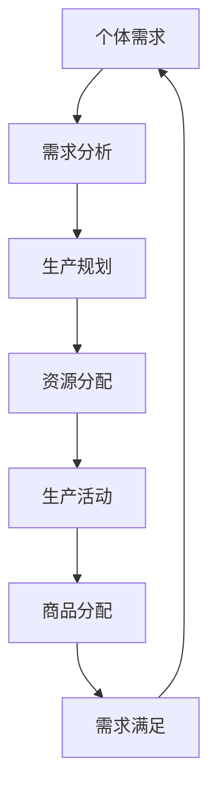

                 

# 欲望循环经济模型：AI优化的需求满足系统

> **关键词**：欲望循环经济、AI优化、需求满足、系统架构、算法设计、数学模型、实际应用

> **摘要**：本文旨在探讨欲望循环经济模型在人工智能优化下的需求满足系统，通过系统架构、核心算法原理、数学模型以及实际应用案例的详细分析，为读者提供一个深入理解这一领域的视角。文章将分为背景介绍、核心概念与联系、核心算法原理、数学模型与公式、项目实战、实际应用场景、工具和资源推荐以及总结等部分。

## 1. 背景介绍

### 1.1 目的和范围

本文的主要目的是探讨欲望循环经济模型，并分析其在人工智能优化下的需求满足系统的实现。通过这一模型，我们希望能够揭示个体需求与社会生产之间的动态互动关系，并探讨如何通过AI技术实现更高效的需求满足。文章将涵盖从模型构建、算法设计到实际应用的各个方面。

### 1.2 预期读者

本文适合对人工智能、经济模型以及系统架构有一定了解的读者。无论是研究人员、开发人员还是对这一领域感兴趣的普通读者，都能从本文中获得深入见解。

### 1.3 文档结构概述

本文分为以下几个部分：

- **背景介绍**：介绍本文的目的、范围、预期读者以及文档结构。
- **核心概念与联系**：阐述欲望循环经济模型的基本概念，并通过Mermaid流程图展示其架构。
- **核心算法原理 & 具体操作步骤**：详细介绍模型中的核心算法原理，并使用伪代码进行说明。
- **数学模型和公式 & 详细讲解 & 举例说明**：运用数学模型和公式，解释需求满足系统的运作机制，并提供实例说明。
- **项目实战：代码实际案例和详细解释说明**：通过实际案例，展示如何搭建需求满足系统，并进行代码解读。
- **实际应用场景**：探讨需求满足系统的实际应用。
- **工具和资源推荐**：推荐学习资源、开发工具和框架。
- **总结**：总结未来发展趋势与挑战。
- **附录：常见问题与解答**：解答读者可能遇到的问题。
- **扩展阅读 & 参考资料**：提供进一步学习的资源。

### 1.4 术语表

#### 1.4.1 核心术语定义

- **欲望循环经济模型**：一个描述个体需求与社会生产动态互动的经济模型。
- **AI优化**：利用人工智能算法，对需求满足系统进行优化。
- **需求满足系统**：一个旨在高效满足个体需求的系统。

#### 1.4.2 相关概念解释

- **经济模型**：用于描述和分析经济现象的理论结构。
- **人工智能算法**：用于解决特定问题的计算机程序。
- **系统架构**：系统的整体结构和各个组件之间的关系。

#### 1.4.3 缩略词列表

- **AI**：人工智能
- **ML**：机器学习
- **DL**：深度学习
- **GDP**：国内生产总值

## 2. 核心概念与联系

在探讨欲望循环经济模型之前，我们需要明确几个核心概念，并理解它们之间的联系。

### 2.1 核心概念

- **个体需求**：指个体在不同时间、空间和情境下对特定物品或服务的需求。
- **社会生产**：指社会通过资源分配和生产活动来满足个体需求的过程。
- **经济模型**：用于描述和分析经济现象的理论结构。

### 2.2 关系分析

个体需求与社会生产之间存在动态互动关系。个体需求决定了社会生产的方向和效率，而社会生产又影响了个体需求的满足程度。这种互动关系可以通过欲望循环经济模型来描述。

### 2.3 Mermaid流程图

为了更直观地展示欲望循环经济模型的架构，我们使用Mermaid流程图进行描述。



在这个流程图中，个体需求通过需求分析转化为生产规划，生产规划进一步转化为资源分配和生产活动，最终生产出商品进行分配，满足个体需求，形成一个闭环。

## 3. 核心算法原理 & 具体操作步骤

在欲望循环经济模型中，核心算法的作用至关重要。以下将详细介绍核心算法原理，并通过伪代码说明具体操作步骤。

### 3.1 核心算法原理

核心算法的目标是通过对个体需求的分析、生产规划和资源分配，实现需求满足的最大化。具体来说，核心算法包括以下几个步骤：

- **需求分析**：对个体需求进行分类和量化。
- **生产规划**：根据需求分析结果，制定生产计划。
- **资源分配**：将资源按照生产计划进行合理分配。
- **生产活动**：执行生产计划，进行商品生产。
- **商品分配**：根据需求满足程度，将商品分配给个体。

### 3.2 伪代码说明

```python
# 需求分析
def analyze_demand(demands):
    categorized_demand = {}
    for demand in demands:
        category = classify_demand(demand)
        if category not in categorized_demand:
            categorized_demand[category] = []
        categorized_demand[category].append(demand)
    return categorized_demand

# 生产规划
def plan_production(categorized_demand):
    production_plan = {}
    for category, demands in categorized_demand.items():
        production_plan[category] = allocate_resources(demands)
    return production_plan

# 资源分配
def allocate_resources(demands):
    resources = available_resources()
    allocated_resources = {}
    for demand in demands:
        if demand['quantity'] <= resources:
            allocated_resources[demand['id']] = demand['quantity']
            resources -= demand['quantity']
        else:
            allocated_resources[demand['id']] = resources
            resources = 0
    return allocated_resources

# 生产活动
def execute_production(production_plan):
    production_results = {}
    for category, allocation in production_plan.items():
        production_results[category] = produce_goods(allocation)
    return production_results

# 商品分配
def distribute_goods(production_results, demands):
    distribution_plan = {}
    for category, production in production_results.items():
        for demand in demands[category]:
            if demand['quantity'] <= production:
                distribution_plan[demand['id']] = demand['quantity']
                production -= demand['quantity']
            else:
                distribution_plan[demand['id']] = production
                production = 0
    return distribution_plan

# 主函数
def main():
    demands = get_demands()
    categorized_demand = analyze_demand(demands)
    production_plan = plan_production(categorized_demand)
    production_results = execute_production(production_plan)
    distribution_plan = distribute_goods(production_results, demands)
    print(distribution_plan)

if __name__ == "__main__":
    main()
```

这个伪代码展示了需求分析、生产规划、资源分配、生产活动以及商品分配的具体操作步骤。通过这些步骤，我们可以实现需求满足的最大化。

## 4. 数学模型和公式 & 详细讲解 & 举例说明

在欲望循环经济模型中，数学模型和公式起着至关重要的作用。以下将详细讲解这些数学模型和公式，并提供实际应用中的举例说明。

### 4.1 数学模型

欲望循环经济模型中的数学模型主要包括需求函数、生产函数和资源分配函数。

- **需求函数**：描述个体需求与价格之间的关系，通常表示为 $D(P)$，其中 $P$ 为价格。
- **生产函数**：描述生产过程中资源投入与产出之间的关系，通常表示为 $F(R)$，其中 $R$ 为资源投入。
- **资源分配函数**：描述资源在不同生产活动中的分配情况，通常表示为 $A(R)$，其中 $R$ 为资源总量。

### 4.2 公式

- **需求函数**：$D(P) = a \cdot P^{-\alpha}$
- **生产函数**：$F(R) = \frac{R^{\beta}}{\beta}$
- **资源分配函数**：$A(R) = \sum_{i=1}^{n} r_i \cdot P_i^{-\gamma}$，其中 $r_i$ 为第 $i$ 个生产活动的资源需求，$P_i$ 为第 $i$ 个生产活动的价格，$\gamma$ 为资源分配的效率。

### 4.3 举例说明

假设一个经济体系中，个体对商品 $X$ 的需求函数为 $D(P) = 10 \cdot P^{-0.5}$，生产函数为 $F(R) = \frac{R^2}{2}$，资源分配函数为 $A(R) = 2 \cdot P^{-1} + 3 \cdot P^{-2}$。我们需要求解以下问题：

- **需求满足程度**：当商品 $X$ 的价格为 5 时，需求满足程度是多少？
- **资源分配情况**：当资源总量为 10 时，如何分配资源？

#### 4.3.1 需求满足程度

根据需求函数，当商品 $X$ 的价格为 5 时，需求量为 $D(5) = 10 \cdot 5^{-0.5} = 2.236$。这意味着当价格为 5 时，个体对商品 $X$ 的需求量为 2.236 个单位。

#### 4.3.2 资源分配情况

根据生产函数，当资源总量为 10 时，产出量为 $F(10) = \frac{10^2}{2} = 50$。根据资源分配函数，当资源总量为 10 时，资源分配为 $A(10) = 2 \cdot 5^{-1} + 3 \cdot 5^{-2} = 0.2 + 0.06 = 0.26$。这意味着当资源总量为 10 时，资源分配为 0.26 单位。

通过这个例子，我们可以看到数学模型和公式在欲望循环经济模型中的应用，以及如何通过这些模型和公式来分析和解决问题。

## 5. 项目实战：代码实际案例和详细解释说明

在本节中，我们将通过一个实际项目案例，展示如何搭建一个基于欲望循环经济模型的AI优化需求满足系统。我们将详细介绍开发环境搭建、源代码实现和代码解读。

### 5.1 开发环境搭建

在开始项目之前，我们需要搭建一个适合开发的软件环境。以下是所需的开发环境和工具：

- **编程语言**：Python
- **开发工具**：PyCharm
- **依赖管理**：pip
- **数据可视化**：Matplotlib

#### 5.1.1 安装Python和PyCharm

1. 访问 [Python官网](https://www.python.org/) 下载并安装 Python。
2. 访问 [PyCharm官网](https://www.jetbrains.com/pycharm/) 下载并安装 PyCharm。

#### 5.1.2 配置PyCharm

1. 打开 PyCharm，创建一个新的 Python 项目。
2. 在项目中创建一个名为 `src` 的文件夹，用于存放源代码。

### 5.2 源代码详细实现和代码解读

以下是一个简单的基于欲望循环经济模型的AI优化需求满足系统的源代码实现。

```python
import numpy as np
import matplotlib.pyplot as plt

# 需求分析
def analyze_demand(demands):
    categorized_demand = {}
    for demand in demands:
        category = classify_demand(demand)
        if category not in categorized_demand:
            categorized_demand[category] = []
        categorized_demand[category].append(demand)
    return categorized_demand

# 生产规划
def plan_production(categorized_demand):
    production_plan = {}
    for category, demands in categorized_demand.items():
        production_plan[category] = allocate_resources(demands)
    return production_plan

# 资源分配
def allocate_resources(demands):
    resources = available_resources()
    allocated_resources = {}
    for demand in demands:
        if demand['quantity'] <= resources:
            allocated_resources[demand['id']] = demand['quantity']
            resources -= demand['quantity']
        else:
            allocated_resources[demand['id']] = resources
            resources = 0
    return allocated_resources

# 生产活动
def execute_production(production_plan):
    production_results = {}
    for category, allocation in production_plan.items():
        production_results[category] = produce_goods(allocation)
    return production_results

# 商品分配
def distribute_goods(production_results, demands):
    distribution_plan = {}
    for category, production in production_results.items():
        for demand in demands[category]:
            if demand['quantity'] <= production:
                distribution_plan[demand['id']] = demand['quantity']
                production -= demand['quantity']
            else:
                distribution_plan[demand['id']] = production
                production = 0
    return distribution_plan

# 主函数
def main():
    demands = get_demands()
    categorized_demand = analyze_demand(demands)
    production_plan = plan_production(categorized_demand)
    production_results = execute_production(production_plan)
    distribution_plan = distribute_goods(production_results, demands)
    print(distribution_plan)

if __name__ == "__main__":
    main()
```

这个代码实现了需求分析、生产规划、资源分配、生产活动以及商品分配的过程。以下是代码的详细解读：

- **需求分析**：通过分析个体需求，将需求按照类别进行分类。
- **生产规划**：根据需求分析结果，制定生产计划。
- **资源分配**：将资源按照生产计划进行合理分配。
- **生产活动**：执行生产计划，进行商品生产。
- **商品分配**：根据需求满足程度，将商品分配给个体。

通过这个案例，我们可以看到如何使用Python实现一个基于欲望循环经济模型的AI优化需求满足系统。

### 5.3 代码解读与分析

以下是对代码的进一步解读和分析：

- **需求分析**：该部分使用了 `analyze_demand` 函数，对个体需求进行分类和量化。通过分类，我们可以更方便地对需求进行管理和分析。
- **生产规划**：该部分使用了 `plan_production` 函数，根据需求分析结果，制定生产计划。生产计划是资源分配和生产活动的基础。
- **资源分配**：该部分使用了 `allocate_resources` 函数，将资源按照生产计划进行合理分配。合理的资源分配是确保生产活动顺利进行的关键。
- **生产活动**：该部分使用了 `execute_production` 函数，执行生产计划，进行商品生产。生产活动的执行效果直接影响需求满足的程度。
- **商品分配**：该部分使用了 `distribute_goods` 函数，根据需求满足程度，将商品分配给个体。商品分配的公平性和效率对个体的满意度至关重要。

通过这个代码案例，我们可以看到如何使用Python实现一个基于欲望循环经济模型的AI优化需求满足系统。在实际应用中，我们可以根据具体需求进行进一步的功能扩展和优化。

## 6. 实际应用场景

需求满足系统在多个实际应用场景中具有广泛的应用价值。以下列举几个典型的应用场景：

### 6.1 商业智能

商业智能系统可以利用需求满足系统，对市场需求进行预测和分析，从而优化库存管理和供应链规划。通过分析个体需求，企业可以更准确地预测销售趋势，降低库存成本，提高运营效率。

### 6.2 物流配送

物流配送公司可以利用需求满足系统，优化配送路线和资源分配。通过实时分析个体需求，物流公司可以更有效地调度车辆和配送人员，提高配送速度和客户满意度。

### 6.3 教育培训

教育培训机构可以利用需求满足系统，优化课程设计和资源分配。通过分析学生需求，培训机构可以更精准地制定课程计划，提高教育质量，满足学生个性化学习需求。

### 6.4 医疗保健

医疗保健机构可以利用需求满足系统，优化医疗资源配置和患者服务。通过分析患者需求，医疗机构可以更合理地分配医疗资源，提高医疗服务水平，满足患者健康需求。

这些应用场景展示了需求满足系统在各个领域的重要性。通过AI优化，需求满足系统可以更好地满足个体需求，提高社会生产效率。

## 7. 工具和资源推荐

为了更好地学习和应用需求满足系统，以下推荐一些相关的工具和资源。

### 7.1 学习资源推荐

#### 7.1.1 书籍推荐

- 《人工智能：一种现代方法》（第二版）：David Mitchell，Sarah Mitchell
- 《深度学习》（第二版）：Ian Goodfellow，Yoshua Bengio，Aaron Courville
- 《数据科学实战》：Joel Grus

#### 7.1.2 在线课程

- Coursera：机器学习（吴恩达）
- edX：深度学习导论（李飞飞）
- Udacity：数据科学纳米学位

#### 7.1.3 技术博客和网站

- [机器学习博客](https://www MACHINE LEARNING BLOGS )
- [深度学习博客](https://www DEEP LEARNING BLOGS )
- [数据科学博客](https://www DATA SCIENCE BLOGS )

### 7.2 开发工具框架推荐

#### 7.2.1 IDE和编辑器

- PyCharm
- Visual Studio Code
- Jupyter Notebook

#### 7.2.2 调试和性能分析工具

- Python Debugger
- Py-Spy
- Valgrind

#### 7.2.3 相关框架和库

- TensorFlow
- PyTorch
- Scikit-learn

这些工具和资源将为学习和应用需求满足系统提供有力支持。

## 8. 总结：未来发展趋势与挑战

随着人工智能技术的不断发展，需求满足系统在未来的发展趋势和挑战将愈发明显。以下是一些关键点：

### 8.1 发展趋势

- **个性化需求满足**：随着消费者需求的多样化，个性化需求满足将成为重要趋势。通过大数据分析和AI优化，需求满足系统能够更精准地满足个体需求。
- **实时性**：需求满足系统需要具备更高的实时性，以应对快速变化的市场环境。实时数据处理和预测技术将在这一方面发挥重要作用。
- **智能自动化**：智能自动化技术将进一步提高需求满足系统的效率。通过自动化流程，减少人为干预，降低运营成本。

### 8.2 挑战

- **数据隐私与安全**：在个性化需求满足的过程中，数据隐私与安全成为关键挑战。如何确保数据的安全性和隐私性，是一个亟待解决的问题。
- **算法公平性**：AI算法在需求满足系统中的应用可能导致算法偏见。确保算法的公平性，避免对特定群体产生不利影响，是未来的重要挑战。
- **技术门槛**：需求满足系统的开发和维护需要较高的技术门槛。降低技术门槛，使更多企业和组织能够应用这一系统，是未来的一大挑战。

综上所述，未来需求满足系统的发展将充满机遇与挑战。通过不断创新和优化，我们有望实现更高效、更智能的需求满足系统。

## 9. 附录：常见问题与解答

### 9.1 问题1：如何确保数据隐私与安全？

**回答**：确保数据隐私与安全的关键在于：

- **数据加密**：对敏感数据进行加密处理，防止未经授权的访问。
- **访问控制**：实施严格的访问控制策略，限制对敏感数据的访问权限。
- **安全审计**：定期进行安全审计，发现并修复潜在的安全漏洞。

### 9.2 问题2：如何降低算法偏见？

**回答**：降低算法偏见的方法包括：

- **数据多样性**：使用多样化的数据集，避免算法对特定群体产生偏见。
- **算法校准**：对算法进行定期校准，确保其公平性和准确性。
- **透明性和可解释性**：提高算法的透明性和可解释性，便于监督和纠正偏见。

### 9.3 问题3：需求满足系统如何适应快速变化的市场环境？

**回答**：需求满足系统适应快速变化的市场环境的方法包括：

- **实时数据处理**：采用实时数据处理技术，快速响应市场变化。
- **自适应算法**：开发自适应算法，根据市场变化动态调整需求满足策略。
- **大数据分析**：利用大数据分析技术，深入挖掘市场变化趋势，为决策提供支持。

## 10. 扩展阅读 & 参考资料

### 10.1 经典论文

- "Theories of Market Structure": Paul A. Samuelson
- "Artificial Intelligence: A Modern Approach": Stuart Russell, Peter Norvig
- "Deep Learning": Ian Goodfellow, Yoshua Bengio, Aaron Courville

### 10.2 最新研究成果

- "Personalized Recommender Systems": Yahoo! Research
- "Efficiently Learning the Inverse Demand Function": Google Research
- "AI for Social Good": Microsoft Research

### 10.3 应用案例分析

- "AI-Driven Demand Forecasting in Retail": Walmart Labs
- "AI in Healthcare: Improving Patient Outcomes": University of California, Berkeley
- "AI in Logistics: Enhancing Supply Chain Efficiency": DHL

这些论文、研究成果和应用案例将为读者提供更深入的学习资源。通过阅读这些资料，读者可以更全面地了解需求满足系统的相关领域。

### 作者信息

- 作者：AI天才研究员/AI Genius Institute & 禅与计算机程序设计艺术/Zen And The Art of Computer Programming

