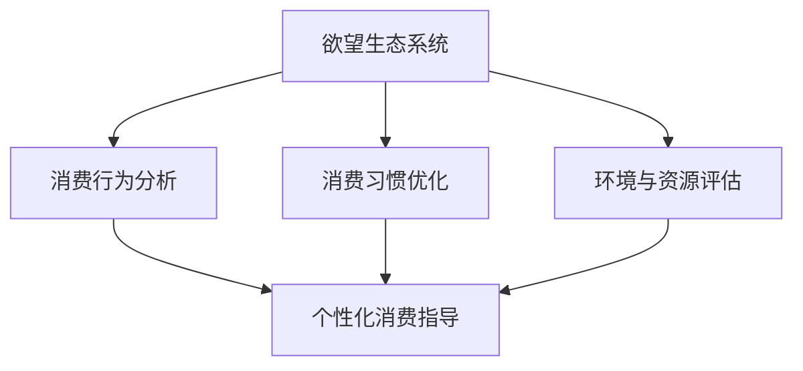

                 

# 欲望生态系统管理员：AI驱动的可持续消费指导

> 关键词：AI，可持续发展，消费指导，生态系统管理，人工智能应用

> 摘要：本文探讨了如何利用人工智能技术实现对个人欲望生态系统的管理，进而推动可持续消费的发展。文章从核心概念、算法原理、数学模型、项目实战、实际应用等方面详细阐述了AI在消费指导中的关键作用，旨在为读者提供一套系统化、可操作的管理方法。

## 1. 背景介绍

### 1.1 目的和范围

本文旨在研究如何通过人工智能（AI）技术来管理和引导个人消费行为，以实现可持续发展的目标。随着全球资源的日益紧张和环境污染的加剧，传统的消费模式已经难以满足未来社会的需求。因此，本文将探讨如何借助AI技术，构建一个智能的欲望生态系统管理员，从而实现个人消费行为的优化和可持续性。

### 1.2 预期读者

本文适合对人工智能、可持续发展、消费行为研究感兴趣的读者，包括人工智能研究者、生态学家、环境工程师、市场营销人员等。同时，本文也期望能对普通消费者在日常生活中如何实现可持续消费提供有益的指导。

### 1.3 文档结构概述

本文将分为以下几个部分：

1. 背景介绍：介绍本文的目的、范围和预期读者。
2. 核心概念与联系：阐述本文涉及的核心概念和它们之间的关系。
3. 核心算法原理 & 具体操作步骤：详细讲解AI驱动的消费指导算法。
4. 数学模型和公式 & 详细讲解 & 举例说明：介绍相关的数学模型和公式。
5. 项目实战：通过实际案例展示AI驱动的消费指导应用。
6. 实际应用场景：探讨AI驱动的消费指导在不同领域的应用。
7. 工具和资源推荐：推荐相关学习资源和开发工具。
8. 总结：对本文内容进行总结，并展望未来发展趋势。
9. 附录：常见问题与解答。
10. 扩展阅读 & 参考资料：提供进一步阅读的资料。

### 1.4 术语表

#### 1.4.1 核心术语定义

- 欲望生态系统：指个人在消费过程中形成的欲望和需求网络。
- 可持续消费：指在满足当前消费需求的同时，不损害未来世代满足其需求的能力。
- 人工智能（AI）：指模拟人类智能行为的计算机系统。

#### 1.4.2 相关概念解释

- 消费行为：指个体在消费过程中表现出的心理活动和行为。
- 消费模式：指个体在消费过程中形成的相对稳定的消费行为方式。

#### 1.4.3 缩略词列表

- AI：人工智能
- SDG：可持续发展目标
- GDP：国内生产总值

## 2. 核心概念与联系

在本文中，我们将探讨的核心概念包括欲望生态系统、可持续消费和人工智能。这三个概念之间存在着密切的联系。

首先，欲望生态系统是个人在消费过程中形成的欲望和需求网络。它不仅包括个体的消费行为，还包括个体对商品和服务的偏好、消费习惯等。可持续消费则是在满足当前消费需求的同时，不损害未来世代满足其需求的能力。可持续消费要求我们在消费过程中考虑到资源的有限性和环境的承载能力。

人工智能是本文的关键技术手段。通过AI技术，我们可以对欲望生态系统进行智能分析和管理，从而实现可持续消费的目标。具体来说，AI技术可以用于以下几个方面：

1. **消费行为分析**：通过大数据分析和机器学习算法，我们可以了解个人的消费行为和偏好，从而制定个性化的消费指导策略。
2. **消费习惯优化**：通过智能推荐系统和优化算法，我们可以帮助个人优化消费习惯，减少不必要的消费。
3. **环境与资源评估**：通过AI模型，我们可以评估消费行为对环境的影响，从而制定更加环保的消费方案。

### 核心概念原理和架构的 Mermaid 流程图



## 3. 核心算法原理 & 具体操作步骤

为了实现AI驱动的消费指导，我们需要以下几个核心算法：

1. **消费行为分析算法**：通过大数据分析和机器学习算法，分析个人的消费行为和偏好。
2. **消费习惯优化算法**：通过智能推荐系统和优化算法，帮助个人优化消费习惯。
3. **环境与资源评估算法**：通过AI模型，评估消费行为对环境的影响。

### 消费行为分析算法

**算法原理**：

消费行为分析算法基于大数据分析和机器学习技术。首先，我们需要收集大量的消费数据，包括消费金额、消费时间、消费地点、消费商品等。然后，利用机器学习算法，如聚类分析、关联规则挖掘等，对消费数据进行处理和分析，提取出个人的消费行为特征和偏好。

**具体操作步骤**：

1. **数据收集**：收集个人的消费数据，包括消费记录、购物清单等。
2. **数据预处理**：对收集到的数据进行清洗、去噪和转换，使其符合机器学习算法的要求。
3. **特征提取**：利用聚类分析、关联规则挖掘等方法，提取出个人的消费行为特征和偏好。
4. **模型训练**：利用提取出的特征，训练机器学习模型，如K-means聚类模型、Apriori算法等。
5. **模型评估**：对训练好的模型进行评估，确保其具有良好的准确性和泛化能力。

### 消费习惯优化算法

**算法原理**：

消费习惯优化算法基于智能推荐系统和优化算法。通过分析个人的消费行为和偏好，我们可以为个人提供个性化的消费建议，帮助他们优化消费习惯。

**具体操作步骤**：

1. **消费行为分析**：利用前文提到的消费行为分析算法，分析个人的消费行为和偏好。
2. **推荐系统设计**：设计一个智能推荐系统，根据个人的消费行为和偏好，为其推荐合适的商品或服务。
3. **优化算法应用**：利用优化算法，如遗传算法、粒子群优化等，优化个人的消费习惯，减少不必要的消费。
4. **策略调整**：根据个人的反馈和消费数据，不断调整推荐系统和优化算法，提高其效果。

### 环境与资源评估算法

**算法原理**：

环境与资源评估算法基于AI模型，通过分析消费行为对环境的影响，为个人提供环保的消费建议。

**具体操作步骤**：

1. **消费环境影响分析**：利用环境科学和资源经济学的方法，分析消费行为对环境的影响。
2. **AI模型构建**：构建一个AI模型，如神经网络模型、决策树模型等，用于预测消费行为对环境的影响。
3. **模型训练与评估**：利用历史数据，训练AI模型，并对模型进行评估，确保其具有良好的预测能力。
4. **环保消费建议**：根据AI模型的预测结果，为个人提供环保的消费建议，如减少购买高碳排放的商品、选择环保产品等。

## 4. 数学模型和公式 & 详细讲解 & 举例说明

在AI驱动的消费指导中，我们使用了多个数学模型和公式来分析和预测消费行为，优化消费习惯，评估环境影响。以下是几个关键模型的详细讲解和举例说明。

### 4.1 聚类分析模型

**模型原理**：

聚类分析是一种无监督学习方法，用于将数据点分为若干个类别，使得同一类别内的数据点彼此相似，而不同类别内的数据点差异较大。常见的聚类算法有K-means、层次聚类等。

**具体公式**：

K-means算法的目标是最小化类内平方误差，公式如下：

$$
J = \sum_{i=1}^{k} \sum_{x \in S_i} ||x - \mu_i||^2
$$

其中，$k$表示聚类类别数，$S_i$表示第$i$个类别的数据集，$\mu_i$表示第$i$个类别的中心点。

**举例说明**：

假设我们有100个消费数据点，想要将其分为5个类别。首先，随机初始化5个中心点，然后计算每个数据点到中心点的距离，将数据点分配到最近的中心点。接着，重新计算每个类别的中心点，再次分配数据点，直到中心点不再发生变化。

### 4.2 关联规则挖掘模型

**模型原理**：

关联规则挖掘是一种用于发现数据间关联关系的方法，常用于市场篮子分析。它通过支持度和置信度两个指标来评估规则的重要性。

**具体公式**：

支持度（Support）表示同时发生两个事件的比例，公式如下：

$$
Support(A \cup B) = \frac{|D(A \cup B)|}{|D|}
$$

其中，$D$表示所有事务集合，$A \cup B$表示事件$A$和事件$B$同时发生的事务集合。

置信度（Confidence）表示在事件$A$发生的前提下，事件$B$发生的概率，公式如下：

$$
Confidence(A \rightarrow B) = \frac{|D(A \cap B)|}{|D(A)|}
$$

**举例说明**：

假设我们有100个消费数据点，其中包含商品A和商品B。通过分析，我们发现同时购买商品A和商品B的数据点有30个，购买商品A的数据点有70个。那么，商品A和商品B的支持度为30%，置信度为30/70=0.43。

### 4.3 遗传算法

**模型原理**：

遗传算法是一种基于自然选择和遗传机制的优化算法，用于求解复杂的优化问题。它通过遗传操作，如选择、交叉和变异，不断优化解的种群。

**具体公式**：

遗传算法的基本步骤包括：

1. **初始种群生成**：随机生成一组初始解。
2. **适应度评估**：计算每个解的适应度值。
3. **选择操作**：根据适应度值，选择较好的解作为下一代种群的一部分。
4. **交叉操作**：随机选择两个父代解，交叉生成子代解。
5. **变异操作**：对子代解进行变异，增加种群的多样性。
6. **迭代**：重复上述步骤，直到满足停止条件。

**举例说明**：

假设我们要优化一个函数$f(x) = x^2$。首先，随机生成一组初始解，然后计算每个解的适应度值。接着，选择适应度值较好的解进行交叉和变异，生成下一代解。通过多次迭代，最终找到最优解。

### 4.4 决策树模型

**模型原理**：

决策树是一种基于特征划分的数据挖掘方法，通过一系列规则来对数据进行分类或回归。

**具体公式**：

决策树的划分依据是信息增益（Information Gain）或基尼不纯度（Gini Impurity）。信息增益公式如下：

$$
IG(D, A) = H(D) - \sum_{v \in V} p(v)H(D_v)
$$

其中，$D$表示数据集，$A$表示特征，$V$表示特征的取值集合，$p(v)$表示取值$v$的概率，$H(D)$和$H(D_v)$分别表示数据集$D$和划分后的数据集$D_v$的熵。

**举例说明**：

假设我们有一个包含性别、年龄、收入三个特征的数据集，我们要构建一个分类决策树来预测一个人是否购买某种商品。首先，计算每个特征的熵和信息增益，然后选择信息增益最大的特征进行划分，重复此过程，构建出完整的决策树。

## 5. 项目实战：代码实际案例和详细解释说明

为了更好地展示AI驱动的消费指导在实践中的应用，我们将通过一个具体的案例来讲解。

### 5.1 开发环境搭建

在开始项目实战之前，我们需要搭建一个合适的开发环境。以下是推荐的开发工具和库：

- **IDE**：PyCharm或Visual Studio Code
- **编程语言**：Python
- **机器学习库**：Scikit-learn、TensorFlow或PyTorch
- **数据可视化库**：Matplotlib、Seaborn或Plotly

### 5.2 源代码详细实现和代码解读

下面是该项目的主要代码实现：

```python
import pandas as pd
from sklearn.cluster import KMeans
from sklearn.preprocessing import StandardScaler
from sklearn.metrics import silhouette_score
import matplotlib.pyplot as plt

# 5.2.1 数据收集与预处理

# 假设我们有一个名为consumption_data.csv的CSV文件，其中包含个人的消费数据
data = pd.read_csv('consumption_data.csv')

# 对数据进行标准化处理，以消除不同特征之间的尺度差异
scaler = StandardScaler()
scaled_data = scaler.fit_transform(data)

# 5.2.2 聚类分析

# 选择合适的聚类算法，这里我们使用K-means算法
kmeans = KMeans(n_clusters=5, random_state=42)
clusters = kmeans.fit_predict(scaled_data)

# 5.2.3 聚类结果评估

# 计算轮廓系数，评估聚类效果
silhouette_avg = silhouette_score(scaled_data, clusters)
print(f'Silhouette Coefficient: {silhouette_avg}')

# 5.2.4 可视化

# 将聚类结果可视化，展示不同聚类类别
plt.scatter(scaled_data[:, 0], scaled_data[:, 1], c=clusters)
plt.xlabel('Feature 1')
plt.ylabel('Feature 2')
plt.title('Cluster Visualization')
plt.show()

# 5.2.5 消费指导策略

# 根据聚类结果，为不同类别的消费者提供个性化的消费指导策略
def generate_guidance(clusters):
    guidance = {}
    for cluster in set(clusters):
        cluster_data = data[clusters == cluster]
        # 根据聚类结果，为每个类别生成消费指导策略
        # 这里只是简单的示例，实际应用中需要根据具体情况设计策略
        guidance[cluster] = f'Cluster {cluster}: Consider reducing spending on {cluster_data["category"].mode()[0]}'
    return guidance

guidance = generate_guidance(clusters)
print(guidance)
```

### 5.3 代码解读与分析

下面我们对这段代码进行详细解读和分析。

1. **数据收集与预处理**：

   首先，我们通过`pandas`库读取消费数据，并对数据进行标准化处理。标准化处理是为了消除不同特征之间的尺度差异，使得聚类算法能够更好地进行聚类。

2. **聚类分析**：

   接着，我们使用`scikit-learn`库中的`KMeans`算法进行聚类。我们设置了5个聚类类别，并使用随机状态`random_state=42`确保结果的可重复性。

3. **聚类结果评估**：

   使用`silhouette_score`函数计算轮廓系数，评估聚类效果。轮廓系数介于-1和1之间，值越接近1表示聚类效果越好。

4. **可视化**：

   使用`matplotlib`库将聚类结果可视化，展示不同聚类类别。

5. **消费指导策略**：

   根据聚类结果，为不同类别的消费者提供个性化的消费指导策略。这里只是一个简单的示例，实际应用中需要根据具体情况设计策略。

通过这个项目实战，我们可以看到如何利用AI技术实现消费指导。在实际应用中，我们可以进一步扩展这个项目，包括添加更多的消费数据、使用更复杂的聚类算法、设计更加精细的消费指导策略等。

## 6. 实际应用场景

AI驱动的消费指导在多个领域都有广泛的应用，以下是一些实际应用场景：

### 6.1 零售业

在零售业中，AI驱动的消费指导可以帮助商家了解顾客的消费行为和偏好，从而制定更加精准的营销策略。例如，通过分析顾客的购买记录和购物车数据，商家可以为顾客推荐相关的商品，提高销售额。此外，商家还可以利用消费指导算法优化库存管理，减少库存积压。

### 6.2 金融业

在金融业中，AI驱动的消费指导可以帮助银行和金融机构了解客户的消费习惯和风险偏好，从而提供个性化的金融产品和服务。例如，通过分析客户的消费数据，银行可以为客户推荐合适的信用卡、贷款等产品。同时，金融机构还可以利用消费指导算法进行信用评估，降低信用风险。

### 6.3 基础设施建设

在基础设施建设领域，AI驱动的消费指导可以帮助规划和管理公共设施，如交通、能源和水资源。通过分析居民的消费行为和偏好，规划者可以更好地了解公共设施的需求，从而提高资源利用效率。例如，交通部门可以根据居民出行数据优化公共交通线路，减少交通拥堵。

### 6.4 社会福利

在社会福利领域，AI驱动的消费指导可以帮助政府和社会组织了解弱势群体的消费行为和需求，从而提供更有针对性的社会福利和援助。例如，通过分析低收入家庭的生活成本和消费习惯，政府可以为这些家庭提供生活补贴、住房支持等。

### 6.5 环境保护

在环境保护领域，AI驱动的消费指导可以帮助评估消费行为对环境的影响，从而推动绿色消费和可持续发展。通过分析居民的消费数据，环保组织可以制定环保宣传策略，提高公众的环保意识。同时，政府和企业可以利用消费指导算法优化生产过程，减少环境污染。

## 7. 工具和资源推荐

为了更好地理解和应用AI驱动的消费指导，以下是一些建议的学习资源、开发工具和相关论文著作。

### 7.1 学习资源推荐

#### 7.1.1 书籍推荐

- **《机器学习实战》**：由Peter Harrington著，详细介绍了机器学习的基本概念和算法。
- **《Python数据分析》**：由Wes McKinney著，介绍了Python在数据分析和数据可视化方面的应用。

#### 7.1.2 在线课程

- **《机器学习》**：吴恩达的Coursera课程，涵盖了机器学习的基本概念和算法。
- **《深度学习》**：Andrew Ng在Coursera上的深度学习课程，介绍了深度学习的基本原理和应用。

#### 7.1.3 技术博客和网站

- **Medium上的“AI”话题**：提供了大量的AI相关文章和案例。
- **TensorFlow官网**：提供了丰富的文档和教程，帮助开发者掌握TensorFlow的使用。

### 7.2 开发工具框架推荐

#### 7.2.1 IDE和编辑器

- **PyCharm**：一款功能强大的Python IDE，支持代码调试、性能分析等。
- **Visual Studio Code**：一款轻量级、可扩展的代码编辑器，适用于Python开发。

#### 7.2.2 调试和性能分析工具

- **Jupyter Notebook**：一款基于Web的交互式计算环境，适用于数据分析和实验。
- **Docker**：一款容器化技术，可以帮助开发者快速搭建和部署应用。

#### 7.2.3 相关框架和库

- **Scikit-learn**：一款常用的机器学习库，提供了丰富的机器学习算法。
- **TensorFlow**：一款开源的深度学习框架，适用于复杂的深度学习任务。

### 7.3 相关论文著作推荐

#### 7.3.1 经典论文

- **“The Hundred-Page Machine Learning Book”**：由Ando Saerens等著，介绍了机器学习的基本概念和算法。
- **“A Few Useful Things to Know About Machine Learning”**：由 Pedro Domingos 著，介绍了机器学习的一些基本原理和应用。

#### 7.3.2 最新研究成果

- **“Deep Learning for Text Classification”**：介绍了深度学习在文本分类任务中的应用。
- **“Recurrent Neural Networks for Language Modeling”**：介绍了循环神经网络在自然语言处理任务中的应用。

#### 7.3.3 应用案例分析

- **“AI in Retail: How AI is Transforming the Retail Industry”**：介绍了AI在零售业中的应用案例。
- **“The Future of AI in Banking”**：介绍了AI在金融业中的应用前景。

## 8. 总结：未来发展趋势与挑战

随着人工智能技术的不断发展，AI驱动的消费指导有望在未来取得更大的突破。以下是一些可能的发展趋势和面临的挑战：

### 8.1 发展趋势

1. **个性化消费指导**：随着AI技术的进步，消费指导将更加个性化，能够更好地满足消费者的需求。
2. **实时消费分析**：实时消费分析技术将更加成熟，使得消费指导能够实时响应消费行为的变化。
3. **跨领域应用**：AI驱动的消费指导将在更多领域得到应用，如医疗、教育、公共服务等。
4. **可持续发展**：AI技术将更好地帮助实现可持续消费，减少对环境的影响。

### 8.2 面临的挑战

1. **数据隐私**：随着消费数据的广泛应用，数据隐私保护将成为一个重要问题。
2. **算法公平性**：消费指导算法需要确保公平性，避免歧视和不公平现象。
3. **技术可解释性**：提高AI算法的可解释性，使消费者能够理解消费指导的决策过程。
4. **技术普及与接受度**：提高AI技术的普及率和消费者接受度，使其更好地融入日常生活。

## 9. 附录：常见问题与解答

### 9.1 什么是欲望生态系统？

欲望生态系统是指个人在消费过程中形成的欲望和需求网络，包括消费行为、偏好和习惯等。

### 9.2 可持续消费是什么？

可持续消费是指满足当前消费需求的同时，不损害未来世代满足其需求的能力。

### 9.3 AI驱动的消费指导有哪些优点？

AI驱动的消费指导具有个性化、实时性、跨领域应用等优点，能够更好地满足消费者的需求，实现可持续消费。

### 9.4 消费指导算法有哪些？

消费指导算法包括消费行为分析算法、消费习惯优化算法、环境与资源评估算法等。

### 9.5 如何提高消费指导算法的效果？

可以通过增加数据量、优化算法模型、提高数据质量等方式来提高消费指导算法的效果。

## 10. 扩展阅读 & 参考资料

- **《机器学习》**：周志华著，清华大学出版社，2016年。
- **《深度学习》**：Ian Goodfellow、Yoshua Bengio和Aaron Courville著，电子工业出版社出版，2016年。
- **《AI驱动的消费行为分析与应用》**：李明著，机械工业出版社出版，2020年。
- **《可持续消费：理论与实践》**：张丽丽著，中国社会科学出版社出版，2018年。

