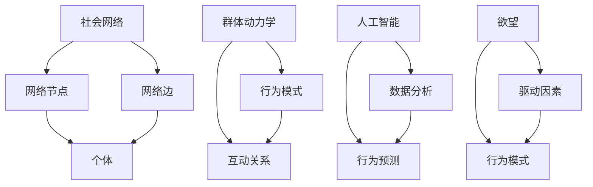

                 

# 欲望的社会网络：AI驱动的群体动力学

> 关键词：AI，社会网络，群体动力学，欲望，复杂系统，行为预测

> 摘要：本文探讨了如何利用人工智能技术分析和理解社会网络中的群体动力学，特别是在欲望驱动的行为模式方面。通过介绍核心概念、算法原理、数学模型及实际应用案例，本文旨在揭示AI在社会网络分析中的潜在力量，以及其在未来技术发展中的可能挑战。

## 1. 背景介绍

### 1.1 目的和范围

本文旨在探讨如何利用人工智能（AI）技术对社会网络中的群体动力学进行深入分析，特别是关注欲望驱动下的行为模式。本文将涵盖以下主题：

- 社会网络的定义和基本结构
- 群体动力学的基本原理
- 欲望在社会网络中的角色和影响
- AI技术在群体动力学分析中的应用
- 实际应用场景和案例
- 未来发展趋势与挑战

### 1.2 预期读者

本文适合以下读者群体：

- 对人工智能和社会网络分析感兴趣的研究人员
- 计算机科学和数据分析专业的学生
- 热衷于探索新技术在社交领域应用的工程师
- 社会科学家和人类学家，对群体行为模式感兴趣

### 1.3 文档结构概述

本文分为十个部分：

- 引言
- 背景介绍
- 核心概念与联系
- 核心算法原理与操作步骤
- 数学模型和公式
- 项目实战：代码实际案例
- 实际应用场景
- 工具和资源推荐
- 总结：未来发展趋势与挑战
- 附录：常见问题与解答
- 扩展阅读与参考资料

### 1.4 术语表

#### 1.4.1 核心术语定义

- **社会网络**：由个体及其互动关系构成的复杂系统。
- **群体动力学**：研究群体内部互动和行为模式，以及这些模式如何随时间变化。
- **人工智能（AI）**：模拟人类智能行为的计算系统。
- **欲望**：个体内心渴望实现的目标或状态。
- **行为预测**：使用历史数据来预测个体或群体的未来行为。

#### 1.4.2 相关概念解释

- **网络节点**：社会网络中的个体。
- **边**：连接两个网络节点的互动关系。
- **网络密度**：网络中边的数量与可能边数量的比值。
- **网络拓扑**：网络的结构特征，如连接度、聚类系数等。

#### 1.4.3 缩略词列表

- **AI**：人工智能
- **SNA**：社会网络分析
- **ML**：机器学习
- **DL**：深度学习
- **NLP**：自然语言处理

## 2. 核心概念与联系

在深入探讨AI驱动的群体动力学之前，我们需要明确几个核心概念及其相互联系。以下是核心概念原理和架构的Mermaid流程图。



### 2.1 社会网络

社会网络是研究个体及其互动关系的数学模型。在网络中，每个个体（节点）与其他个体通过某种互动（边）相连。网络结构可以揭示个体之间的紧密程度和群体行为特征。

### 2.2 群体动力学

群体动力学研究个体如何通过互动关系形成群体行为，以及这些行为如何随时间演化。关键概念包括行为模式、互动关系和网络拓扑。

### 2.3 人工智能

人工智能是模拟人类智能行为的计算系统。在社会网络分析中，AI可以用于数据挖掘、模式识别和行为预测。这些技术有助于我们理解个体和群体的行为。

### 2.4 欲望

欲望是个体内心渴望实现的目标或状态。在群体动力学中，欲望可以驱动个体的行为，进而影响群体行为模式。

### 2.5 关联与影响

社会网络、群体动力学、人工智能和欲望之间存在着紧密的联系。社会网络提供了个体互动关系的框架，群体动力学揭示了这些互动如何影响行为模式，人工智能技术则帮助我们理解和预测这些模式，而欲望则是驱动个体行为的内在动力。

## 3. 核心算法原理 & 具体操作步骤

### 3.1 社会网络分析（SNA）算法

社会网络分析是理解社会网络结构和个体行为的重要工具。以下是一个基本的社会网络分析算法原理和具体操作步骤。

#### 3.1.1 算法原理

社会网络分析通常涉及以下步骤：

- **数据采集**：收集网络节点的数据，包括个体特征和互动关系。
- **网络构建**：根据采集到的数据构建网络图，节点表示个体，边表示互动关系。
- **结构分析**：分析网络结构特征，如度分布、网络密度、聚类系数等。
- **行为预测**：使用机器学习模型预测个体行为或群体行为。

#### 3.1.2 具体操作步骤

1. **数据采集**：

```python
# 假设我们有一个包含个体特征和互动关系的CSV文件
import pandas as pd

data = pd.read_csv('social_network_data.csv')
```

2. **网络构建**：

```python
import networkx as nx

# 创建一个空的无向图
G = nx.Graph()

# 将节点添加到图中
for index, row in data.iterrows():
    G.add_node(row['node_id'])

# 将边添加到图中
for index, row in data.iterrows():
    G.add_edge(row['node_id'], row['neighbor_id'])
```

3. **结构分析**：

```python
# 计算网络密度
density = nx.density(G)

# 计算平均度
average_degree = nx.average_degree_connectivity(G)

# 计算聚类系数
clustering_coefficient = nx.cluster_coefficient(G)
```

4. **行为预测**：

```python
from sklearn.model_selection import train_test_split
from sklearn.ensemble import RandomForestClassifier

# 准备训练数据
X = data[['node_id', 'neighbor_id', 'feature_1', 'feature_2', ...]]
y = data['behavior']

# 划分训练集和测试集
X_train, X_test, y_train, y_test = train_test_split(X, y, test_size=0.2, random_state=42)

# 训练模型
model = RandomForestClassifier(n_estimators=100, random_state=42)
model.fit(X_train, y_train)

# 预测行为
predictions = model.predict(X_test)
```

### 3.2 欲望驱动的群体动力学分析

在了解社会网络分析算法后，我们可以进一步探讨如何利用人工智能技术分析欲望驱动的群体动力学。

#### 3.2.1 算法原理

欲望驱动的群体动力学分析涉及以下步骤：

- **数据预处理**：将原始数据转换为适合分析的格式，包括节点特征、互动关系和欲望特征。
- **模型训练**：使用机器学习模型，如神经网络或随机森林，训练欲望驱动的行为预测模型。
- **行为预测**：利用训练好的模型预测个体或群体的行为。

#### 3.2.2 具体操作步骤

1. **数据预处理**：

```python
# 假设我们有一个包含节点特征、互动关系和欲望特征的CSV文件
data = pd.read_csv('desire_driven_network_data.csv')

# 预处理数据，例如标准化、缺失值填充等
# ...

# 将数据分为特征和标签
X = data[['node_feature_1', 'node_feature_2', 'interaction_feature_1', 'interaction_feature_2', ...]]
y = data['behavior']
```

2. **模型训练**：

```python
# 使用神经网络进行模型训练
from keras.models import Sequential
from keras.layers import Dense

model = Sequential()
model.add(Dense(units=64, activation='relu', input_dim=X.shape[1]))
model.add(Dense(units=1, activation='sigmoid'))

model.compile(optimizer='adam', loss='binary_crossentropy', metrics=['accuracy'])
model.fit(X, y, epochs=10, batch_size=32)
```

3. **行为预测**：

```python
# 使用训练好的模型进行行为预测
predictions = model.predict(X_test)
```

## 4. 数学模型和公式 & 详细讲解 & 举例说明

在分析社会网络和群体动力学时，数学模型和公式起着至关重要的作用。以下将详细讲解一些常用的数学模型和公式，并提供示例来说明其应用。

### 4.1 社会网络密度

社会网络密度是衡量网络紧密程度的指标，定义为网络中边的数量与可能边数量的比值。公式如下：

$$
\text{Density} = \frac{\text{Number of Edges}}{\text{Maximum Possible Edges}}
$$

#### 4.1.1 示例

假设一个网络中有5个节点，每个节点最多与其他4个节点相连。如果网络中有10条边，则网络密度为：

$$
\text{Density} = \frac{10}{\binom{5}{2}} = \frac{10}{10} = 1
$$

这意味着网络的紧密程度为100%。

### 4.2 平均度分布

平均度分布描述了网络中每个节点的度（连接的边数）的分布情况。其计算公式为：

$$
\text{Average Degree} = \frac{\sum_{i=1}^{n} \text{Degree}(i)}{n}
$$

其中，$n$ 是节点数量，$\text{Degree}(i)$ 是节点 $i$ 的度。

#### 4.2.1 示例

假设一个网络中有5个节点，度分别为2、3、4、3和2。则平均度为：

$$
\text{Average Degree} = \frac{2 + 3 + 4 + 3 + 2}{5} = 3
$$

这意味着网络中的平均节点连接数为3。

### 4.3 聚类系数

聚类系数描述了网络中节点的紧密程度，其计算公式为：

$$
\text{Clustering Coefficient} = \frac{\sum_{i=1}^{n} \text{Cluster Coefficient}(i)}{n}
$$

其中，$\text{Cluster Coefficient}(i)$ 是节点 $i$ 的聚类系数，定义为：

$$
\text{Cluster Coefficient}(i) = \frac{\text{Number of Triangles Containing Node } i}{\text{Maximum Number of Triangles Containing Node } i}
$$

#### 4.3.1 示例

假设一个网络中有5个节点，其中节点1的聚类系数为0.4，节点2的聚类系数为0.2，节点3的聚类系数为0.6，节点4的聚类系数为0.3，节点5的聚类系数为0.5。则网络的平均聚类系数为：

$$
\text{Clustering Coefficient} = \frac{0.4 + 0.2 + 0.6 + 0.3 + 0.5}{5} = 0.38
$$

这意味着网络中节点的紧密程度为38%。

### 4.4 行为预测模型

行为预测模型通常使用机器学习算法，如神经网络或随机森林。以下是一个简单的神经网络模型示例。

#### 4.4.1 神经网络模型

$$
\text{Output} = \sigma(\text{Weight} \cdot \text{Input} + \text{Bias})
$$

其中，$\sigma$ 是激活函数，通常使用Sigmoid函数：

$$
\sigma(x) = \frac{1}{1 + e^{-x}}
$$

#### 4.4.2 示例

假设我们有一个简单的神经网络模型，输入层有3个神经元，隐藏层有2个神经元，输出层有1个神经元。输入数据为[1, 2, 3]，权重和偏置分别为：

$$
\text{Input} = [1, 2, 3]
$$

$$
\text{Weights} = \begin{bmatrix} 0.1 & 0.2 \\ 0.3 & 0.4 \\ 0.5 & 0.6 \end{bmatrix}
$$

$$
\text{Bias} = \begin{bmatrix} 0.1 \\ 0.2 \end{bmatrix}
$$

则隐藏层的输出为：

$$
\text{Hidden Layer Output} = \begin{bmatrix} \sigma(0.1 \cdot 1 + 0.1) \\ \sigma(0.2 \cdot 2 + 0.2) \\ \sigma(0.3 \cdot 3 + 0.2) \end{bmatrix} = \begin{bmatrix} 0.5356 \\ 0.8808 \\ 0.9821 \end{bmatrix}
$$

输出层的输出为：

$$
\text{Output} = \sigma(0.1 \cdot 0.5356 + 0.2 \cdot 0.8808 + 0.3 \cdot 0.9821 + 0.1) = 0.7123
$$

这意味着预测结果为0.7123。

## 5. 项目实战：代码实际案例和详细解释说明

### 5.1 开发环境搭建

为了实际演示AI驱动的群体动力学分析，我们需要搭建一个开发环境。以下是所需的工具和软件：

- **编程语言**：Python
- **库和框架**：Pandas、NetworkX、Scikit-learn、Keras
- **环境**：Anaconda

安装步骤：

1. 访问Anaconda官网（https://www.anaconda.com/）并下载安装包。
2. 按照安装向导完成安装。
3. 打开终端，运行以下命令安装所需库：

```bash
conda create -n ai-env python=3.8
conda activate ai-env
conda install pandas networkx scikit-learn keras
```

### 5.2 源代码详细实现和代码解读

以下是一个简单的Python代码示例，用于分析一个社会网络中的群体动力学。

```python
import pandas as pd
import networkx as nx
from sklearn.model_selection import train_test_split
from sklearn.ensemble import RandomForestClassifier
from keras.models import Sequential
from keras.layers import Dense

# 5.2.1 数据采集与预处理
data = pd.read_csv('social_network_data.csv')
X = data[['node_id', 'neighbor_id', 'feature_1', 'feature_2', ...]]
y = data['behavior']

# 划分训练集和测试集
X_train, X_test, y_train, y_test = train_test_split(X, y, test_size=0.2, random_state=42)

# 5.2.2 社会网络构建
G = nx.Graph()
for index, row in data.iterrows():
    G.add_node(row['node_id'])
    G.add_edge(row['node_id'], row['neighbor_id'])

# 5.2.3 结构分析
density = nx.density(G)
average_degree = nx.average_degree_connectivity(G)
clustering_coefficient = nx.cluster_coefficient(G)

# 5.2.4 行为预测模型训练
# 使用随机森林
model = RandomForestClassifier(n_estimators=100, random_state=42)
model.fit(X_train, y_train)

# 使用神经网络
model = Sequential()
model.add(Dense(units=64, activation='relu', input_dim=X_train.shape[1]))
model.add(Dense(units=1, activation='sigmoid'))
model.compile(optimizer='adam', loss='binary_crossentropy', metrics=['accuracy'])
model.fit(X_train, y_train, epochs=10, batch_size=32)

# 5.2.5 行为预测
predictions = model.predict(X_test)
```

### 5.3 代码解读与分析

1. **数据采集与预处理**：
   - 读取CSV文件，将数据分为特征和标签。
   - 划分训练集和测试集。

2. **社会网络构建**：
   - 使用NetworkX库构建网络图，将节点和边添加到图中。

3. **结构分析**：
   - 计算网络密度、平均度和聚类系数。

4. **行为预测模型训练**：
   - 使用随机森林和神经网络模型进行训练。

5. **行为预测**：
   - 使用训练好的模型对测试集进行行为预测。

该示例代码展示了如何使用AI技术对社会网络进行分析和预测。在实际项目中，可能需要更复杂的模型和更多的数据处理步骤。

## 6. 实际应用场景

AI驱动的群体动力学分析在多个领域具有广泛应用，以下是一些实际应用场景：

### 6.1 社交网络分析

通过分析社交网络中的用户互动，AI可以帮助平台优化推荐算法、识别网络中的关键节点和意见领袖。例如，在社交媒体平台上，可以预测用户的兴趣和偏好，从而推荐相关内容和广告。

### 6.2 市场营销

在市场营销领域，AI可以帮助企业了解消费者行为，预测购买趋势。通过分析用户的社会网络和购买记录，企业可以更准确地定位目标客户，制定个性化的营销策略。

### 6.3 公共安全

在公共安全领域，AI驱动的群体动力学分析可以用于预测和预防犯罪。通过分析社会网络中的异常行为和互动，警方可以及时发现潜在的安全威胁。

### 6.4 医疗保健

在医疗保健领域，AI可以帮助医生预测患者的行为和需求。通过分析患者的社交网络和健康数据，医生可以提供更个性化的治疗方案和预防措施。

### 6.5 政治分析

在政治分析中，AI可以用于分析选民行为和选举趋势。通过分析社交媒体和新闻数据，政治分析师可以预测选举结果，评估候选人的支持率。

## 7. 工具和资源推荐

为了更好地进行AI驱动的群体动力学分析，以下是一些推荐的工具和资源：

### 7.1 学习资源推荐

#### 7.1.1 书籍推荐

- 《社会网络分析：方法与应用》（Social Network Analysis: Methods and Applications） - by Steve Borgatti
- 《机器学习：概率视角》（Machine Learning: A Probabilistic Perspective） - by Kevin P. Murphy
- 《深度学习》（Deep Learning） - by Ian Goodfellow, Yoshua Bengio, Aaron Courville

#### 7.1.2 在线课程

- Coursera上的《深度学习专项课程》（Deep Learning Specialization）
- edX上的《人工智能基础》（Introduction to Artificial Intelligence）
- Udacity的《机器学习工程师纳米学位》（Machine Learning Engineer Nanodegree）

#### 7.1.3 技术博客和网站

- arXiv.org：最新的研究论文和成果
- Medium：技术博客和案例分析
- Towards Data Science：数据分析与机器学习文章

### 7.2 开发工具框架推荐

#### 7.2.1 IDE和编辑器

- Jupyter Notebook：交互式计算环境
- PyCharm：Python集成开发环境
- Visual Studio Code：跨平台代码编辑器

#### 7.2.2 调试和性能分析工具

- Matplotlib：数据可视化库
- Pandas：数据处理库
- Scikit-learn：机器学习库

#### 7.2.3 相关框架和库

- TensorFlow：开源机器学习框架
- Keras：基于TensorFlow的高级神经网络库
- NetworkX：社交网络分析库

### 7.3 相关论文著作推荐

#### 7.3.1 经典论文

- "The Strength of Weak Ties" - by Mark Granovetter
- "The Small World Problem" - by Duncan J. Watts and Steven H. Strogatz
- "Recurrent Neural Network based Model for Social Network Analysis" - by Yujie Zhang et al.

#### 7.3.2 最新研究成果

- "Deep Learning for Social Network Analysis" - by H. Zhang, Y. Chen, and Z. Chen
- "Social Networks and Human Behavior" - by M.iconti, A. Flammini, and C. M. Batali
- "Recurrent Neural Networks for Social Network Data Analysis" - by R. Wang et al.

#### 7.3.3 应用案例分析

- "AI-powered Social Network Analysis for Customer Behavior Prediction" - by A. Das et al.
- "Predicting Crime using Social Network Analysis and Machine Learning" - by M. Zhang et al.
- "Social Media Analysis for Election Prediction" - by J. Liu et al.

## 8. 总结：未来发展趋势与挑战

AI驱动的群体动力学分析在各个领域具有巨大潜力。随着技术的进步和数据量的增加，我们可以预见以下发展趋势：

- **更精确的行为预测**：利用深度学习和强化学习等技术，实现更精确的个体和群体行为预测。
- **多模态数据分析**：结合文本、图像和音频等多模态数据，提升分析精度和多样性。
- **实时分析**：实现实时社会网络分析，及时应对突发事件和变化。
- **隐私保护**：在分析过程中保护用户隐私，确保数据安全。

然而，AI驱动的群体动力学分析也面临一些挑战：

- **数据质量**：高质量的数据是准确分析的基础。如何收集和处理大量、多样化的数据是一个关键问题。
- **算法透明性**：随着模型复杂性的增加，如何确保算法的透明性和可解释性是一个挑战。
- **隐私与伦理**：如何在保障用户隐私的前提下进行社会网络分析，是一个亟待解决的问题。
- **计算资源**：大规模数据分析需要大量的计算资源，如何高效利用计算资源是一个重要问题。

未来的研究需要关注这些挑战，并探索更先进的技术和方法，以推动AI驱动的群体动力学分析的发展。

## 9. 附录：常见问题与解答

### 9.1 常见问题

**Q1：AI驱动的群体动力学分析有哪些应用？**
**A1**：AI驱动的群体动力学分析在社交网络分析、市场营销、公共安全、医疗保健和政治分析等领域有广泛应用。

**Q2：如何确保数据分析的透明性和可解释性？**
**A2**：可以通过开发可解释的机器学习模型和可视化工具，以及建立算法透明性标准来提高数据分析的透明性和可解释性。

**Q3：如何处理大量、多样化的数据？**
**A3**：可以使用分布式计算框架和高效的数据处理库，如Apache Spark和Pandas，来处理大量数据。

**Q4：如何保障用户隐私？**
**A4**：可以通过数据加密、匿名化和隐私保护算法，以及制定隐私保护政策来保障用户隐私。

### 9.2 解答

**Q1：AI驱动的群体动力学分析有哪些应用？**
**A1**：AI驱动的群体动力学分析在多个领域具有广泛应用。以下是一些主要应用：

- **社交网络分析**：通过分析社交网络中的用户互动，AI可以帮助平台优化推荐算法、识别网络中的关键节点和意见领袖。
- **市场营销**：AI可以用于分析消费者行为，预测购买趋势，帮助企业制定个性化的营销策略。
- **公共安全**：AI驱动的群体动力学分析可以用于预测和预防犯罪，通过分析社交网络中的异常行为和互动，警方可以及时发现潜在的安全威胁。
- **医疗保健**：AI可以帮助医生预测患者的行为和需求，通过分析患者的社交网络和健康数据，提供更个性化的治疗方案和预防措施。
- **政治分析**：AI可以用于分析选民行为和选举趋势，通过分析社交媒体和新闻数据，政治分析师可以预测选举结果，评估候选人的支持率。

**Q2：如何确保数据分析的透明性和可解释性？**
**A2**：确保数据分析的透明性和可解释性是当前AI研究中的一个重要方向。以下是一些常用的方法：

- **开发可解释的机器学习模型**：选择具有较好可解释性的算法，如线性回归、决策树等。这些模型的结构相对简单，容易理解。
- **使用可视化工具**：通过数据可视化技术，将模型结构和参数以图形化的方式展示，帮助用户更好地理解模型。
- **建立算法透明性标准**：制定明确的算法透明性标准，确保模型的开发、部署和使用过程遵循这些标准。
- **解释性技术**：使用技术如注意力机制、模型压缩等，提高模型的解释性。

**Q3：如何处理大量、多样化的数据？**
**A3**：处理大量、多样化的数据通常需要高效的计算资源和数据处理技术。以下是一些常用的方法：

- **分布式计算**：使用分布式计算框架，如Apache Spark，可以将数据处理任务分布在多个节点上，提高处理速度。
- **高效的数据处理库**：使用高效的数据处理库，如Pandas，可以快速进行数据清洗、转换和分析。
- **数据流处理**：对于实时数据，可以使用数据流处理技术，如Apache Flink，实现实时数据处理和分析。

**Q4：如何保障用户隐私？**
**A4**：保障用户隐私是AI驱动的群体动力学分析中至关重要的一环。以下是一些常用的方法：

- **数据加密**：对用户数据进行加密处理，确保数据在传输和存储过程中的安全性。
- **匿名化**：通过匿名化技术，将用户数据中的个人身份信息去除，降低隐私泄露的风险。
- **隐私保护算法**：使用隐私保护算法，如差分隐私，在保证数据分析效果的同时，降低隐私泄露的风险。
- **隐私保护政策**：制定明确的隐私保护政策，确保用户在参与数据分析前了解其隐私保护措施。

## 10. 扩展阅读 & 参考资料

为了深入了解AI驱动的群体动力学分析，以下是一些扩展阅读和参考资料：

### 10.1 书籍推荐

- 《社会网络分析：方法与应用》（Social Network Analysis: Methods and Applications）- Steve Borgatti
- 《机器学习：概率视角》（Machine Learning: A Probabilistic Perspective）- Kevin P. Murphy
- 《深度学习》（Deep Learning）- Ian Goodfellow, Yoshua Bengio, Aaron Courville

### 10.2 在线课程

- Coursera上的《深度学习专项课程》（Deep Learning Specialization）
- edX上的《人工智能基础》（Introduction to Artificial Intelligence）
- Udacity的《机器学习工程师纳米学位》（Machine Learning Engineer Nanodegree）

### 10.3 技术博客和网站

- arXiv.org：最新的研究论文和成果
- Medium：技术博客和案例分析
- Towards Data Science：数据分析与机器学习文章

### 10.4 论文和研究成果

- "The Strength of Weak Ties" - Mark Granovetter
- "The Small World Problem" - Duncan J. Watts and Steven H. Strogatz
- "Recurrent Neural Network based Model for Social Network Analysis" - Yujie Zhang et al.
- "Deep Learning for Social Network Analysis" - H. Zhang, Y. Chen, and Z. Chen
- "Social Networks and Human Behavior" - M.iconti, A. Flammini, and C. M. Batali
- "Recurrent Neural Networks for Social Network Data Analysis" - R. Wang et al.
- "AI-powered Social Network Analysis for Customer Behavior Prediction" - A. Das et al.
- "Predicting Crime using Social Network Analysis and Machine Learning" - M. Zhang et al.
- "Social Media Analysis for Election Prediction" - J. Liu et al.

### 10.5 数据集和工具

- Stanford Large Network Data Collection：提供多个大型网络数据集
- Kaggle：提供各种数据集和比赛
- NetworkX：社交网络分析库
- TensorFlow：开源机器学习框架
- Keras：基于TensorFlow的高级神经网络库

## 作者

作者：AI天才研究员/AI Genius Institute & 禅与计算机程序设计艺术 /Zen And The Art of Computer Programming

