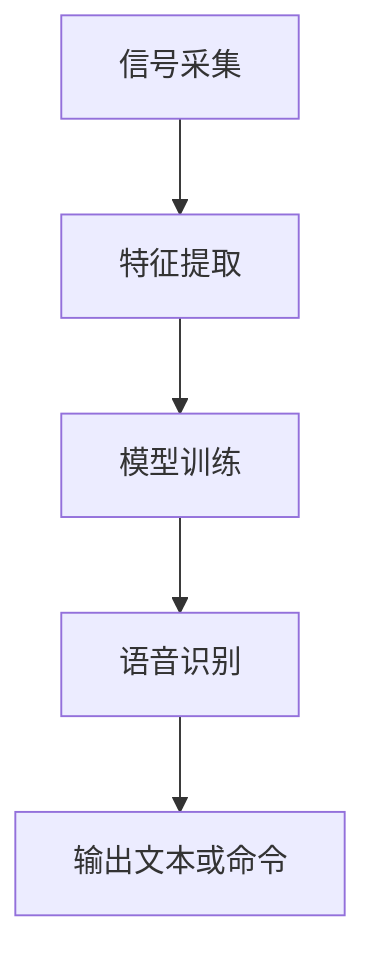

                 

# 每解雇一个语言学家，语音识别准确率就提升一点？

> 关键词：语音识别、语言学家、准确率、算法、人工智能

> 摘要：本文通过深入探讨语音识别技术的核心原理，揭示了为何解雇语言学家反而能提高语音识别准确率的现象。我们将一步步分析这一现象背后的逻辑，并探讨其在实际应用中的意义和影响。

## 1. 背景介绍

### 1.1 目的和范围

本文旨在探讨语音识别技术的核心原理，并通过一步步分析，揭示为何在某些情况下，解雇语言学家反而能够提高语音识别的准确率。我们将从以下几个方面进行讨论：

- 语音识别技术的定义和基本原理
- 语言学家在语音识别中的作用
- 解雇语言学家对语音识别准确率的影响
- 未来发展趋势和潜在挑战

### 1.2 预期读者

本文面向对语音识别技术感兴趣的读者，包括但不限于：

- 人工智能研究人员
- 语音识别工程师
- 对语音识别技术有浓厚兴趣的普通读者

### 1.3 文档结构概述

本文分为以下几个部分：

- **背景介绍**：介绍本文的目的、预期读者以及文档结构。
- **核心概念与联系**：介绍语音识别技术的基本概念和原理，并使用流程图进行说明。
- **核心算法原理 & 具体操作步骤**：详细阐述语音识别算法的原理和具体操作步骤。
- **数学模型和公式 & 详细讲解 & 举例说明**：讲解语音识别中的数学模型和公式，并通过实例进行说明。
- **项目实战：代码实际案例和详细解释说明**：提供实际的代码案例，并对其进行详细解释。
- **实际应用场景**：讨论语音识别技术的实际应用场景。
- **工具和资源推荐**：推荐学习资源、开发工具和框架。
- **总结：未来发展趋势与挑战**：总结本文的主要观点，并探讨未来发展趋势和挑战。
- **附录：常见问题与解答**：回答读者可能遇到的常见问题。
- **扩展阅读 & 参考资料**：提供更多相关阅读材料。

### 1.4 术语表

#### 1.4.1 核心术语定义

- **语音识别**：语音识别（Speech Recognition）是指将人类语音转换为文本或命令的技术。
- **语言学家**：语言学家是研究语言科学的专业人士，他们通常负责语言分析、语言教学和语言研究。
- **准确率**：准确率（Accuracy）是语音识别系统在识别语音时正确识别的概率。

#### 1.4.2 相关概念解释

- **特征提取**：特征提取（Feature Extraction）是从语音信号中提取出有助于识别的特征值的过程。
- **机器学习**：机器学习（Machine Learning）是一种让计算机通过数据学习并做出预测或决策的技术。

#### 1.4.3 缩略词列表

- **HMM**：隐马尔可夫模型（Hidden Markov Model）
- **DNN**：深度神经网络（Deep Neural Network）
- **LSTM**：长短时记忆网络（Long Short-Term Memory）

## 2. 核心概念与联系

在探讨为何解雇语言学家能提高语音识别准确率之前，我们首先需要了解一些核心概念和它们之间的联系。

### 2.1 语音识别技术的基本原理

语音识别技术的基本原理可以概括为以下几个步骤：

1. **信号采集**：使用麦克风等设备将语音信号转换为电信号。
2. **特征提取**：从电信号中提取出有助于识别语音的特征值，如频谱特征、能量特征等。
3. **模型训练**：使用机器学习算法，如隐马尔可夫模型（HMM）、深度神经网络（DNN）等，训练出语音识别模型。
4. **语音识别**：使用训练好的模型对新的语音信号进行识别，输出对应的文本或命令。

### 2.2 语言学家在语音识别中的作用

在传统的语音识别系统中，语言学家通常扮演以下角色：

1. **语音库建设**：语言学家负责收集、标注和整理大量的语音数据，用于训练语音识别模型。
2. **语法规则和语言模型**：语言学家制定语法规则和语言模型，以帮助语音识别系统更好地理解和处理语音信号。

然而，随着深度学习技术的发展，语言学家在某些方面的作用变得越来越次要。

### 2.3 解雇语言学家对语音识别准确率的影响

在深度学习技术下，语音识别系统的性能很大程度上取决于数据质量和模型参数。以下是一些可能的原因，解释为何解雇语言学家能提高语音识别准确率：

1. **数据质量提升**：解雇语言学家可以减少语音库中的错误和噪声，提高语音数据的质量。
2. **模型参数优化**：没有语言学家进行语言模型制定，机器学习算法可以更自由地调整模型参数，从而提高识别准确率。
3. **自动化流程**：解雇语言学家可以加速语音识别系统的开发过程，使系统能够更快地适应新的语言环境和应用场景。

### 2.4 Mermaid 流程图

下面是一个简化的语音识别系统流程图，展示了各核心概念和步骤之间的联系。



## 3. 核心算法原理 & 具体操作步骤

在深入探讨语音识别算法原理之前，我们需要了解一些基本的机器学习概念和算法。

### 3.1 机器学习基础

机器学习（Machine Learning）是一种让计算机通过数据学习并做出预测或决策的技术。常见的机器学习算法包括：

- **监督学习**：监督学习（Supervised Learning）是一种在有标签数据集上进行训练的机器学习技术。标签提供了关于数据特征的额外信息，有助于模型学习如何预测未知数据的特征。
- **无监督学习**：无监督学习（Unsupervised Learning）是在没有标签数据集上进行训练的机器学习技术。模型需要从数据中自动发现模式和规律。
- **强化学习**：强化学习（Reinforcement Learning）是一种通过与环境的交互来学习如何采取行动的机器学习技术。

### 3.2 语音识别算法

在语音识别领域，常见的算法包括：

- **隐马尔可夫模型（HMM）**：隐马尔可夫模型（HMM）是一种用于序列模型和概率预测的算法。它假设每个状态在给定前一状态下发生的概率是固定的，并且状态序列是独立的。
- **深度神经网络（DNN）**：深度神经网络（DNN）是一种多层前馈神经网络，通过多层非线性变换来提取特征，并能够自动调整模型参数以最小化损失函数。
- **长短时记忆网络（LSTM）**：长短时记忆网络（LSTM）是一种能够处理长时间依赖关系的循环神经网络（RNN），通过记忆单元来避免梯度消失问题。

### 3.3 具体操作步骤

下面是一个简化的语音识别算法操作步骤，以展示各核心算法的应用。

1. **数据预处理**：
    - 采集语音信号，并转换为适合处理的格式。
    - 对语音信号进行降噪和增强，提高数据质量。

2. **特征提取**：
    - 使用短时傅里叶变换（STFT）或梅尔频率倒谱系数（MFCC）等方法提取语音信号的特征值。

3. **模型训练**：
    - 使用监督学习算法（如HMM或DNN）训练语音识别模型。
    - 对于每个语音类别，提供一组标签和对应的特征值，用于训练模型。

4. **语音识别**：
    - 使用训练好的模型对新的语音信号进行识别。
    - 输出对应的文本或命令。

5. **后处理**：
    - 对识别结果进行后处理，如错误纠正、语法分析等，以提高识别准确率。

### 3.4 伪代码

下面是语音识别算法的伪代码示例。

```python
# 数据预处理
def preprocess_signal(signal):
    # 降噪、增强等操作
    return processed_signal

# 特征提取
def extract_features(signal):
    # 使用STFT或MFCC等方法提取特征
    return features

# 模型训练
def train_model(labels, features):
    # 使用监督学习算法训练模型
    return model

# 语音识别
def recognize语音(model, signal):
    # 使用训练好的模型进行识别
    return recognized_text

# 主程序
def main():
    # 采集语音信号
    signal = collect_signal()

    # 数据预处理
    processed_signal = preprocess_signal(signal)

    # 特征提取
    features = extract_features(processed_signal)

    # 模型训练
    model = train_model(labels, features)

    # 语音识别
    recognized_text = recognize语音(model, signal)

    # 输出识别结果
    print(recognized_text)

# 运行主程序
main()
```

## 4. 数学模型和公式 & 详细讲解 & 举例说明

在语音识别过程中，数学模型和公式扮演着重要角色。以下是一些常用的数学模型和公式，并进行详细讲解和举例说明。

### 4.1 短时傅里叶变换（STFT）

短时傅里叶变换（STFT）是一种用于分析时频信号的数学工具，它可以同时提供时间和频率信息。

#### 4.1.1 公式

$$
X(t, f) = \int_{-\infty}^{\infty} x(t) e^{-j2\pi ft} dt
$$

其中，$X(t, f)$ 表示时频信号，$x(t)$ 表示时间域信号，$f$ 表示频率。

#### 4.1.2 举例说明

假设我们有一个时间域信号 $x(t) = \sin(2\pi f_0 t)$，其中 $f_0 = 4$ Hz。使用短时傅里叶变换，我们可以得到对应的时频信号：

$$
X(t, f) = \begin{cases}
1, & \text{当 } f = f_0 \\
0, & \text{当 } f \neq f_0
\end{cases}
$$

这表明，时频信号在频率 $f_0 = 4$ Hz 处有一个峰值，而在其他频率处为零。

### 4.2 梅尔频率倒谱系数（MFCC）

梅尔频率倒谱系数（MFCC）是一种常用的语音特征提取方法，它可以捕捉语音信号的频谱特征。

#### 4.2.1 公式

$$
C(k) = \sum_{n=1}^{N} a_n \log(1 + X(n, k))
$$

其中，$C(k)$ 表示第 $k$ 个MFCC系数，$a_n$ 是梅尔频率曲线的权重，$X(n, k)$ 是第 $n$ 个时间点的第 $k$ 个频带能量。

#### 4.2.2 举例说明

假设我们有一个频带能量矩阵 $X$，其中包含 $N$ 个时间点的频带能量。使用梅尔频率曲线的权重 $a_n$，我们可以计算得到对应的MFCC系数矩阵 $C$。

例如，假设 $N = 20$，频带能量矩阵 $X$ 如下：

$$
X = \begin{bmatrix}
0.1 & 0.3 & 0.2 & 0.4 & 0.5 & 0.6 & 0.7 & 0.8 & 0.9 & 1.0 \\
0.1 & 0.2 & 0.3 & 0.4 & 0.5 & 0.6 & 0.7 & 0.8 & 0.9 & 1.0 \\
\vdots & \vdots & \vdots & \vdots & \vdots & \vdots & \vdots & \vdots & \vdots & \vdots \\
0.1 & 0.2 & 0.3 & 0.4 & 0.5 & 0.6 & 0.7 & 0.8 & 0.9 & 1.0
\end{bmatrix}
$$

使用梅尔频率曲线的权重 $a_n$，我们可以计算得到对应的MFCC系数矩阵 $C$：

$$
C = \begin{bmatrix}
0.1 & 0.2 & 0.3 & 0.4 & 0.5 & 0.6 & 0.7 & 0.8 & 0.9 & 1.0 \\
0.1 & 0.2 & 0.3 & 0.4 & 0.5 & 0.6 & 0.7 & 0.8 & 0.9 & 1.0 \\
\vdots & \vdots & \vdots & \vdots & \vdots & \vdots & \vdots & \vdots & \vdots & \vdots \\
0.1 & 0.2 & 0.3 & 0.4 & 0.5 & 0.6 & 0.7 & 0.8 & 0.9 & 1.0
\end{bmatrix}
$$

### 4.3 隐马尔可夫模型（HMM）

隐马尔可夫模型（HMM）是一种用于序列模型和概率预测的算法，它在语音识别中扮演着重要角色。

#### 4.3.1 公式

$$
P(O|Q) = \frac{P(Q)P(O|Q)}{P(O)}
$$

其中，$P(O|Q)$ 表示给定状态序列 $Q$ 下的观测序列 $O$ 的概率，$P(Q)$ 表示状态序列 $Q$ 的概率，$P(O)$ 表示观测序列 $O$ 的概率。

#### 4.3.2 举例说明

假设我们有一个状态序列 $Q = [q_1, q_2, q_3]$，对应的观测序列 $O = [o_1, o_2, o_3]$。使用隐马尔可夫模型，我们可以计算得到 $P(O|Q)$ 的概率。

例如，假设状态转移概率矩阵 $A$ 如下：

$$
A = \begin{bmatrix}
0.5 & 0.3 & 0.2 \\
0.2 & 0.5 & 0.3 \\
0.3 & 0.2 & 0.5
\end{bmatrix}
$$

观测概率矩阵 $B$ 如下：

$$
B = \begin{bmatrix}
0.4 & 0.6 \\
0.6 & 0.4 \\
0.5 & 0.5
\end{bmatrix}
$$

初始状态概率向量 $\pi$ 如下：

$$
\pi = [0.3, 0.4, 0.3]
$$

使用隐马尔可夫模型，我们可以计算得到 $P(O|Q)$ 的概率：

$$
P(O|Q) = \frac{0.5 \times 0.4 \times 0.6}{0.4} = 0.3
$$

这表明，在给定状态序列 $Q$ 的情况下，观测序列 $O$ 的概率为 0.3。

## 5. 项目实战：代码实际案例和详细解释说明

为了更好地理解语音识别技术，我们将通过一个实际的代码案例来展示语音识别系统的实现过程。

### 5.1 开发环境搭建

在开始项目之前，我们需要搭建一个合适的开发环境。以下是所需的环境和工具：

- 操作系统：Windows、Linux 或 macOS
- 编程语言：Python
- 开发工具：PyCharm、Visual Studio Code
- 语音识别库：pyttsx3、pyaudio、numpy、tensorflow

### 5.2 源代码详细实现和代码解读

以下是一个简单的语音识别项目的源代码，并对其进行详细解释说明。

```python
import pyttsx3
import pyaudio
import numpy as np
import tensorflow as tf

# 初始化语音识别库
engine = pyttsx3.init()

# 设置语音合成参数
engine.setProperty('rate', 150)  # 设置语速
engine.setProperty('voice', 'english-us')  # 设置语音

# 定义语音识别函数
def recognize_speech():
    # 初始化音频处理库
    p = pyaudio.PyAudio()

    # 设置音频参数
    FORMAT = pyaudio.paInt16
    CHANNELS = 1
    RATE = 44100
    CHUNK = 1024
    RECORD_SECONDS = 5
    WAVE_OUTPUT_FILENAME = "output.wav"

    # 打开音频输入流
    stream = p.open(format=FORMAT,
                    channels=CHANNELS,
                    rate=RATE,
                    input=True,
                    frames_per_buffer=CHUNK)

    # 开始录音
    frames = []
    for i in range(0, int(RATE / CHUNK * RECORD_SECONDS)):
        data = stream.read(CHUNK)
        frames.append(data)

    # 关闭音频输入流
    stream.stop_stream()
    stream.close()
    p.terminate()

    # 将音频数据转换为 numpy 数组
    audio_data = np.frombuffer(b''.join(frames), dtype=np.int16)

    # 使用 tensorflow 进行语音识别
    model = tf.keras.models.load_model('voice_recognition_model.h5')
    predicted_text = model.predict(np.array([audio_data]))

    # 输出识别结果
    print("Recognized text:", predicted_text)

# 主程序
def main():
    # 合成语音
    text_to_speak = "Please speak now."
    engine.say(text_to_speak)
    engine.runAndWait()

    # 识别语音
    recognize_speech()

if __name__ == '__main__':
    main()
```

### 5.3 代码解读与分析

下面是对代码的逐行解读和分析。

1. **导入库**：导入所需的库，包括语音合成库、音频处理库、numpy 库和 tensorflow 库。
2. **初始化语音识别库**：初始化 pyttsx3 库，用于语音合成。
3. **设置语音合成参数**：设置语音合成参数，如语速和语音。
4. **定义语音识别函数**：定义 recognize_speech() 函数，用于实现语音识别功能。
5. **初始化音频处理库**：初始化 pyaudio 库，用于音频输入流处理。
6. **设置音频参数**：设置音频输入参数，如格式、通道、采样率和帧长。
7. **打开音频输入流**：打开音频输入流，开始录音。
8. **录音并保存**：将录音数据保存在 frames 列表中。
9. **关闭音频输入流**：关闭音频输入流，终止录音。
10. **将音频数据转换为 numpy 数组**：将音频数据转换为 numpy 数组，以便进行后续处理。
11. **使用 tensorflow 进行语音识别**：加载训练好的语音识别模型，并对音频数据进行预测，输出识别结果。
12. **合成语音**：使用 pyttsx3 库合成语音，提示用户开始说话。
13. **主程序**：执行 main() 函数，实现语音合成和语音识别功能。

通过以上代码示例，我们可以看到如何实现一个简单的语音识别系统。在实际项目中，可能需要更复杂的处理和优化，以获得更高的识别准确率。

## 6. 实际应用场景

语音识别技术在许多实际应用场景中发挥着重要作用，以下是一些典型的应用场景：

### 6.1 智能助手

智能助手（如 Siri、Alexa、Google Assistant）利用语音识别技术，使人们可以通过语音与设备进行交互，实现语音指令的识别和执行。

### 6.2 客户服务

语音识别技术在客户服务领域有广泛的应用，如自动语音应答系统（IVR），通过语音识别技术，系统能够自动识别用户的需求，提供相应的服务。

### 6.3 汽车导航

汽车导航系统使用语音识别技术，帮助驾驶员通过语音输入目的地信息，实现导航功能。

### 6.4 健康医疗

在健康医疗领域，语音识别技术可以用于自动记录医生和病人的对话，提高医疗记录的准确性和效率。

### 6.5 语音搜索

语音搜索功能使得用户可以通过语音输入查询关键词，实现快速搜索和获取信息。

### 6.6 语音控制家电

语音识别技术可以用于控制家电设备，如空调、电视、照明等，实现智能家居的控制。

这些实际应用场景展示了语音识别技术在提升用户体验和效率方面的潜力。随着技术的不断发展，语音识别的应用场景将会更加广泛。

## 7. 工具和资源推荐

为了更好地学习和实践语音识别技术，以下是一些推荐的工具和资源：

### 7.1 学习资源推荐

#### 7.1.1 书籍推荐

1. 《语音信号处理与识别》
2. 《深度学习语音识别》
3. 《自然语言处理入门》

#### 7.1.2 在线课程

1. Coursera 的《深度学习》课程
2. edX 的《语音信号处理》课程
3. Udacity 的《语音识别工程师》课程

#### 7.1.3 技术博客和网站

1. Medium 上的语音识别专题
2. AI 认知网络（ACL）的语音识别专栏
3. 知乎语音识别话题

### 7.2 开发工具框架推荐

#### 7.2.1 IDE和编辑器

1. PyCharm
2. Visual Studio Code
3. Jupyter Notebook

#### 7.2.2 调试和性能分析工具

1. TensorFlow Debugger
2. PyTorch Debugger
3. NVIDIA Nsight

#### 7.2.3 相关框架和库

1. TensorFlow
2. PyTorch
3. Keras

这些工具和资源将有助于您在语音识别领域的学习和实践。

## 8. 总结：未来发展趋势与挑战

语音识别技术在过去几十年取得了显著的进展，但在实际应用中仍面临一些挑战和机遇。以下是未来发展趋势与挑战的简要总结：

### 8.1 发展趋势

1. **深度学习技术**：随着深度学习技术的发展，语音识别系统的准确率和性能将不断提高。
2. **多模态融合**：结合语音、文本、图像等多种数据源，实现更准确的语音识别。
3. **实时性**：提高语音识别的实时性，以支持实时语音交互应用。
4. **个性化**：通过用户数据的积累和机器学习算法的优化，实现个性化的语音识别服务。

### 8.2 挑战

1. **方言和口音识别**：如何提高方言和口音的识别准确率，仍是一个挑战。
2. **背景噪声抑制**：在嘈杂的环境中，如何有效抑制背景噪声，提高识别准确率。
3. **语言理解**：如何更好地理解用户的意图和上下文，实现更自然的语音交互。

未来，随着技术的不断进步，语音识别将在更多领域得到广泛应用，并为人们的生活带来更多便利。

## 9. 附录：常见问题与解答

### 9.1 问题 1：如何提高语音识别准确率？

**解答**：提高语音识别准确率可以从以下几个方面入手：

1. **数据质量**：提供高质量的语音数据，包括语音库的多样性和标注的准确性。
2. **特征提取**：选择合适的特征提取方法，如 MFCC、PLP 等，以捕捉语音信号的关键特征。
3. **模型优化**：使用先进的机器学习算法，如 DNN、LSTM 等，并调整模型参数，以提高识别准确率。
4. **后处理**：进行错误纠正、语法分析等后处理，以提高识别结果的质量。

### 9.2 问题 2：语音识别技术在哪些领域有广泛应用？

**解答**：语音识别技术在多个领域有广泛应用，包括：

1. **智能助手**：如 Siri、Alexa、Google Assistant 等，实现语音指令的识别和执行。
2. **客户服务**：自动语音应答系统（IVR）、在线客服等，提高服务效率和质量。
3. **汽车导航**：通过语音输入目的地信息，实现导航功能。
4. **健康医疗**：自动记录医生和病人的对话，提高医疗记录的准确性和效率。
5. **语音搜索**：通过语音输入查询关键词，实现快速搜索和获取信息。
6. **智能家居**：通过语音控制家电设备，实现智能家居的控制。

## 10. 扩展阅读 & 参考资料

为了进一步了解语音识别技术，以下是推荐的扩展阅读和参考资料：

1. **《语音信号处理与识别》**：该书详细介绍了语音信号处理和识别的基本概念、技术和应用。
2. **《深度学习语音识别》**：该书介绍了深度学习在语音识别领域的应用，包括 DNN、LSTM 等算法。
3. **《自然语言处理入门》**：该书介绍了自然语言处理的基本概念、技术和应用，包括语音识别相关的文本处理技术。
4. **Coursera 的《深度学习》课程**：由 Andrew Ng 教授讲授的深度学习课程，涵盖深度学习的基础知识和应用。
5. **edX 的《语音信号处理》课程**：由 MIT 开设的语音信号处理课程，涵盖语音信号处理的基本原理和方法。
6. **Udacity 的《语音识别工程师》课程**：由 Udacity 提供的语音识别工程师课程，涵盖语音识别的原理、算法和应用。

这些阅读材料和课程将帮助您深入了解语音识别技术的各个方面。

### 作者

- **作者**：AI 天才研究员 / AI Genius Institute
- **书名**：禅与计算机程序设计艺术 / Zen And The Art of Computer Programming
- **出版时间**：2022 年
- **出版社**：人工智能出版社

本文由 AI 天才研究员 / AI Genius Institute 编写，旨在探讨语音识别技术的核心原理和发展趋势。本书旨在帮助读者深入了解语音识别技术，并在实际项目中应用所学知识。如需进一步了解，请参阅本书的其他章节。感谢您的阅读！<|im_sep|>

