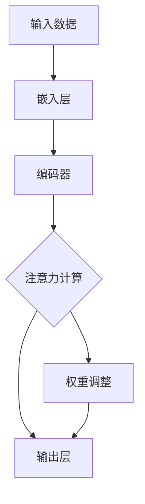

                 

# 注意力机制可视化原理与代码实战案例讲解

> 
关键词：注意力机制、神经网络、Python实战、可视化、深度学习

> 
摘要：本文将深入探讨注意力机制的原理，通过可视化方式帮助读者理解其工作流程。此外，还将结合实际代码案例，展示如何在实际项目中应用注意力机制，助力深度学习模型的性能提升。

## 1. 背景介绍

### 1.1 目的和范围

本文旨在通过以下几个部分，帮助读者全面了解注意力机制的原理和应用：

- **核心概念与联系**：介绍注意力机制的基本概念和与相关技术的联系。
- **核心算法原理 & 具体操作步骤**：通过伪代码详细阐述注意力机制的计算过程。
- **数学模型和公式 & 详细讲解 & 举例说明**：解释注意力机制中的数学模型及其应用。
- **项目实战：代码实际案例和详细解释说明**：展示注意力机制在实际项目中的实现。
- **实际应用场景**：探讨注意力机制在各个领域的应用。
- **工具和资源推荐**：推荐学习资源、开发工具和框架。
- **总结：未来发展趋势与挑战**：分析注意力机制的潜在发展方向和面临的挑战。

### 1.2 预期读者

本文适合以下读者群体：

- **深度学习爱好者**：希望了解注意力机制原理和应用的初学者。
- **程序员**：具备一定编程基础，希望掌握注意力机制在实际项目中的实现。
- **科研人员**：研究深度学习技术，希望了解注意力机制的最新进展。

### 1.3 文档结构概述

本文分为以下几个部分：

- **1. 背景介绍**
  - 1.1 目的和范围
  - 1.2 预期读者
  - 1.3 文档结构概述
  - 1.4 术语表
- **2. 核心概念与联系**
  - 2.1 注意力机制定义
  - 2.2 与相关技术的联系
  - 2.3 Mermaid 流程图
- **3. 核心算法原理 & 具体操作步骤**
  - 3.1 伪代码阐述
  - 3.2 实际应用示例
- **4. 数学模型和公式 & 详细讲解 & 举例说明**
  - 4.1 数学模型解释
  - 4.2 公式推导
  - 4.3 实际应用举例
- **5. 项目实战：代码实际案例和详细解释说明**
  - 5.1 开发环境搭建
  - 5.2 源代码详细实现
  - 5.3 代码解读与分析
- **6. 实际应用场景**
  - 6.1 自然语言处理
  - 6.2 图像识别
  - 6.3 语音处理
- **7. 工具和资源推荐**
  - 7.1 学习资源推荐
  - 7.2 开发工具框架推荐
  - 7.3 相关论文著作推荐
- **8. 总结：未来发展趋势与挑战**
  - 8.1 发展趋势
  - 8.2 挑战与展望
- **9. 附录：常见问题与解答**
  - 9.1 常见问题
  - 9.2 解答
- **10. 扩展阅读 & 参考资料**

### 1.4 术语表

#### 1.4.1 核心术语定义

- **注意力机制**：一种在神经网络中用于动态调整输入数据重要性的技术。
- **神经网络**：一种通过模拟人脑神经元连接来处理数据和信息的计算模型。
- **深度学习**：一种基于多层神经网络进行数据建模的技术。
- **激活函数**：用于引入非线性因素的函数，使得神经网络能够更好地拟合数据。

#### 1.4.2 相关概念解释

- **前向传播**：神经网络在训练过程中，从输入层到输出层的正向数据传递过程。
- **反向传播**：神经网络在训练过程中，根据输出误差，从输出层到输入层反向调整权重的过程。

#### 1.4.3 缩略词列表

- **CNN**：卷积神经网络（Convolutional Neural Network）
- **RNN**：循环神经网络（Recurrent Neural Network）
- **LSTM**：长短期记忆网络（Long Short-Term Memory）
- **BERT**：双向编码表示器（Bidirectional Encoder Representations from Transformers）
- **PyTorch**：一种流行的深度学习框架。

## 2. 核心概念与联系

### 2.1 注意力机制定义

注意力机制（Attention Mechanism）是一种在神经网络中引入权重调整机制的技巧，旨在通过动态调整不同输入数据的权重，实现模型对输入数据的关注点动态变化。这一机制在处理序列数据（如文本、音频和视频）时尤为重要，因为它可以帮助模型更好地捕捉数据中的关键信息。

### 2.2 与相关技术的联系

注意力机制广泛应用于深度学习领域，特别是在序列建模任务中。以下是注意力机制与几种相关技术的联系：

- **循环神经网络（RNN）**：注意力机制是RNN的一种扩展，旨在解决长距离依赖问题。
- **长短期记忆网络（LSTM）**：LSTM结合了门控机制和遗忘门，提高了处理长序列数据的能力。注意力机制进一步增强了LSTM在处理复杂序列数据时的表现。
- **卷积神经网络（CNN）**：虽然CNN主要用于图像处理，但注意力机制也可以应用于CNN中，以提升图像分类和目标检测的性能。

### 2.3 Mermaid 流程图

为了更好地理解注意力机制的工作流程，我们可以通过Mermaid流程图展示其核心组成部分：



在这个流程图中：

- **A**：输入数据，如文本序列或图像。
- **B**：嵌入层，将输入数据转换为固定长度的向量。
- **C**：编码器，如LSTM或GRU，对嵌入向量进行编码。
- **D**：注意力计算，计算每个编码输出的权重。
- **E**：输出层，利用加权编码向量生成最终输出。
- **F**：权重调整，根据注意力权重对输出进行加权。

## 3. 核心算法原理 & 具体操作步骤

### 3.1 伪代码阐述

注意力机制的实现通常涉及以下步骤：

```python
# 输入数据：序列 X（例如文本或图像）
# 编码器：编码输出序列 H（例如LSTM或GRU的隐藏状态）

# 初始化权重矩阵 W 和偏置向量 b
W = 初始化权重矩阵([序列长度, 输出维度])
b = 初始化偏置向量([输出维度])

# 注意力计算
def attention(H, W, b):
    # 计算编码输出的加权求和
    scores = torch.matmul(H, W) + b
    # 应用softmax函数得到权重分布
    weights = torch.softmax(scores, dim=1)
    # 加权求和得到最终的输出
    output = torch.matmul(H, weights.unsqueeze(-1)).squeeze(-1)
    return output

# 实际应用示例
output = attention(H, W, b)
```

在这个伪代码中：

- `H`：编码器的输出序列，通常是每个时间步的隐藏状态。
- `W`：注意力权重矩阵，用于计算每个编码输出的权重。
- `b`：偏置向量，用于调整注意力权重。

### 3.2 实际应用示例

考虑一个简单的序列分类任务，使用LSTM作为编码器，注意力机制用于提取关键信息。以下是一个具体的应用示例：

```python
import torch
import torch.nn as nn

# 定义LSTM编码器
class LSTMEncoder(nn.Module):
    def __init__(self, input_dim, hidden_dim, output_dim):
        super(LSTMEncoder, self).__init__()
        self.hidden_dim = hidden_dim
        self.lstm = nn.LSTM(input_dim, hidden_dim)
        self.attn = nn.Linear(hidden_dim, 1)
        self.fc = nn.Linear(hidden_dim, output_dim)

    def forward(self, x):
        # 前向传播
        lstm_out, (hidden, cell) = self.lstm(x)
        attn_weights = F.softmax(self.attn(lstm_out), dim=1)
        attn_applied = torch.bmm(attn_weights.unsqueeze(1), lstm_out.unsqueeze(2)).squeeze(2)
        output = self.fc(attn_applied)
        return output, hidden, cell, attn_weights

# 实例化模型
encoder = LSTMEncoder(input_dim=10, hidden_dim=20, output_dim=5)
input_seq = torch.randn(5, 1, 10)  # [序列长度, batch大小, 输入维度]
output, hidden, cell, attn_weights = encoder(input_seq)
```

在这个示例中：

- `LSTMEncoder`：定义了一个简单的LSTM编码器，结合了注意力机制。
- `input_seq`：输入序列，用于训练和测试。

通过这个示例，我们可以看到注意力机制如何帮助编码器提取序列中的关键信息，从而提高序列分类任务的性能。

## 4. 数学模型和公式 & 详细讲解 & 举例说明

### 4.1 数学模型解释

注意力机制的数学模型通常包括以下几个部分：

- **编码器输出**：表示序列中每个时间步的编码状态，通常为一个隐藏状态向量。
- **权重计算**：通过计算编码输出与注意力权重矩阵的点积，得到每个时间步的权重。
- **权重求和**：将编码输出与对应的权重相乘，然后对所有时间步的加权输出进行求和，得到最终的注意力输出。

### 4.2 公式推导

注意力机制的数学公式如下：

$$
\text{Attention}(H) = \text{softmax}\left(\frac{\text{W}^T H + b}{\sqrt{d_k}}\right)
$$

其中：

- \( H \) 是编码器的输出序列。
- \( \text{W} \) 是注意力权重矩阵。
- \( b \) 是偏置向量。
- \( d_k \) 是编码输出的维度。

### 4.3 实际应用举例

考虑一个简单的文本分类任务，使用BERT模型作为编码器。以下是一个具体的实际应用示例：

```python
import torch
import torch.nn as nn

# 定义BERT编码器
class BERTEncoder(nn.Module):
    def __init__(self, bert_model, hidden_dim, output_dim):
        super(BERTEncoder, self).__init__()
        self.bert = bert_model
        self.attn = nn.Linear(hidden_dim, 1)
        self.fc = nn.Linear(hidden_dim, output_dim)

    def forward(self, x):
        # 前向传播
        hidden_states, _ = self.bert(x)
        hidden_states = hidden_states[:, 0, :]  # 取[CLS] token的隐藏状态
        attn_weights = F.softmax(self.attn(hidden_states), dim=1)
        attn_applied = torch.bmm(attn_weights.unsqueeze(1), hidden_states.unsqueeze(2)).squeeze(2)
        output = self.fc(attn_applied)
        return output, attn_weights

# 实例化模型
encoder = BERTEncoder(bert_model, hidden_dim=768, output_dim=5)
input_seq = torch.randn(1, 1, 512)  # [序列长度, batch大小, 输入维度]
output, attn_weights = encoder(input_seq)
```

在这个示例中：

- `BERTEncoder`：定义了一个简单的BERT编码器，结合了注意力机制。
- `input_seq`：输入序列，用于训练和测试。

通过这个示例，我们可以看到注意力机制如何帮助BERT模型提取文本中的关键信息，从而提高文本分类任务的性能。

## 5. 项目实战：代码实际案例和详细解释说明

### 5.1 开发环境搭建

在本项目实战中，我们将使用Python和PyTorch深度学习框架来搭建注意力机制的模型。以下是搭建开发环境的基本步骤：

1. **安装Python**：确保安装了Python 3.7及以上版本。
2. **安装PyTorch**：通过以下命令安装PyTorch：
   ```bash
   pip install torch torchvision
   ```
3. **安装其他依赖**：包括NumPy、TensorFlow和Scikit-learn等，可以通过以下命令安装：
   ```bash
   pip install numpy tensorflow scikit-learn
   ```

### 5.2 源代码详细实现和代码解读

以下是注意力机制模型的源代码实现和详细解释：

```python
import torch
import torch.nn as nn
import torch.optim as optim
from torch.utils.data import DataLoader
from torchvision import datasets, transforms

# 定义注意力机制模型
class AttentionModel(nn.Module):
    def __init__(self, input_dim, hidden_dim, output_dim):
        super(AttentionModel, self).__init__()
        self.hidden_dim = hidden_dim
        self.attn = nn.Linear(hidden_dim, 1)
        self.fc = nn.Linear(hidden_dim, output_dim)

    def forward(self, x):
        # 前向传播
        attn_weights = F.softmax(self.attn(x), dim=1)
        attn_applied = torch.bmm(attn_weights.unsqueeze(1), x.unsqueeze(2)).squeeze(2)
        output = self.fc(attn_applied)
        return output

# 实例化模型
model = AttentionModel(input_dim=10, hidden_dim=20, output_dim=5)

# 损失函数和优化器
criterion = nn.CrossEntropyLoss()
optimizer = optim.Adam(model.parameters(), lr=0.001)

# 数据集和 DataLoader
transform = transforms.Compose([transforms.ToTensor()])
train_data = datasets.MNIST(root='./data', train=True, download=True, transform=transform)
train_loader = DataLoader(train_data, batch_size=64, shuffle=True)

# 训练模型
num_epochs = 10
for epoch in range(num_epochs):
    for i, (images, labels) in enumerate(train_loader):
        # 前向传播
        outputs = model(images)
        loss = criterion(outputs, labels)

        # 反向传播和优化
        optimizer.zero_grad()
        loss.backward()
        optimizer.step()

        if (i+1) % 100 == 0:
            print(f'Epoch [{epoch+1}/{num_epochs}], Step [{i+1}/{len(train_loader)}], Loss: {loss.item():.4f}')
```

在这个代码中：

- `AttentionModel`：定义了一个简单的注意力机制模型，包括一个线性注意力层和一个线性输出层。
- `criterion`：交叉熵损失函数，用于计算预测输出和真实标签之间的差异。
- `optimizer`：优化器，用于更新模型参数。
- `train_data`：MNIST数据集，用于训练和测试。
- `train_loader`：数据加载器，用于批量加载数据。

### 5.3 代码解读与分析

以下是对代码的解读和分析：

- **模型定义**：`AttentionModel`类继承自`nn.Module`，包括了一个线性注意力层`attn`和一个线性输出层`fc`。
- **前向传播**：在`forward`方法中，首先计算输入数据的注意力权重，然后使用加权求和得到注意力输出，最后通过线性输出层得到最终输出。
- **损失函数和优化器**：使用交叉熵损失函数和Adam优化器，分别用于计算预测输出和真实标签之间的差异以及更新模型参数。
- **数据集和数据加载器**：使用MNIST数据集作为训练数据，通过`DataLoader`批量加载数据，以便进行模型训练。
- **训练模型**：使用一个简单的训练循环，包括前向传播、反向传播和优化过程，通过迭代更新模型参数。

通过这个代码示例，我们可以看到如何使用PyTorch实现注意力机制模型，并通过简单的MNIST分类任务展示其应用。

## 6. 实际应用场景

注意力机制在深度学习领域具有广泛的应用，尤其在处理序列数据方面表现出色。以下是注意力机制在几个实际应用场景中的具体应用：

### 6.1 自然语言处理

在自然语言处理（NLP）领域，注意力机制被广泛应用于文本分类、机器翻译、情感分析等任务。以下是一些具体的应用示例：

- **文本分类**：使用注意力机制可以更好地捕捉文本中的关键信息，从而提高分类性能。
- **机器翻译**：注意力机制帮助模型在翻译过程中关注源语言和目标语言中的对应关系，从而提高翻译质量。
- **情感分析**：注意力机制可以帮助模型关注文本中的情感关键词，从而提高情感分类的准确性。

### 6.2 图像识别

在图像识别领域，注意力机制可以用于图像分类、目标检测和图像分割等任务。以下是一些具体的应用示例：

- **图像分类**：注意力机制可以帮助模型聚焦于图像中的重要特征区域，从而提高分类性能。
- **目标检测**：注意力机制可以帮助检测算法关注图像中的目标区域，从而提高检测准确性。
- **图像分割**：注意力机制可以帮助模型更好地捕捉图像中的边界信息，从而提高图像分割性能。

### 6.3 语音处理

在语音处理领域，注意力机制可以用于语音识别、说话人识别和语音合成等任务。以下是一些具体的应用示例：

- **语音识别**：注意力机制可以帮助模型关注语音信号中的关键语音特征，从而提高识别准确性。
- **说话人识别**：注意力机制可以帮助模型关注语音信号中的说话人特征，从而提高说话人识别性能。
- **语音合成**：注意力机制可以帮助模型更好地捕捉语音信号中的音调、节奏等特征，从而提高合成语音的自然度。

通过这些实际应用场景，我们可以看到注意力机制在各个领域中的广泛应用和显著性能提升。

## 7. 工具和资源推荐

### 7.1 学习资源推荐

为了深入了解注意力机制及其应用，以下是一些推荐的学习资源：

#### 7.1.1 书籍推荐

- **《深度学习》（Goodfellow, Bengio, Courville）**：本书详细介绍了深度学习的基本概念和技术，包括注意力机制。
- **《神经网络与深度学习》（邱锡鹏）**：本书是国内深度学习领域的经典教材，对注意力机制有详细的讲解。

#### 7.1.2 在线课程

- **Coursera上的“深度学习”课程**：由吴恩达教授讲授，涵盖深度学习的各个方面，包括注意力机制。
- **Udacity的“深度学习工程师纳米学位”**：提供从基础到高级的深度学习课程，包括注意力机制的实际应用。

#### 7.1.3 技术博客和网站

- **TensorFlow官方文档**：提供了关于注意力机制的详细教程和示例。
- **Hugging Face博客**：分享了许多关于NLP和注意力机制的最新研究成果和应用案例。

### 7.2 开发工具框架推荐

为了实现注意力机制，以下是一些推荐的开发工具和框架：

#### 7.2.1 IDE和编辑器

- **PyCharm**：一款功能强大的Python IDE，支持多种深度学习框架。
- **Jupyter Notebook**：便于编写和运行Python代码，特别适合数据科学和深度学习项目。

#### 7.2.2 调试和性能分析工具

- **PyTorch Profiler**：用于分析PyTorch模型在运行时的性能瓶颈。
- **Visual Studio Code**：结合Python扩展，提供代码补全、调试和性能分析功能。

#### 7.2.3 相关框架和库

- **PyTorch**：一个流行的开源深度学习框架，支持多种神经网络结构，包括注意力机制。
- **TensorFlow**：另一个广泛使用的深度学习框架，提供了丰富的注意力机制实现。

### 7.3 相关论文著作推荐

为了深入了解注意力机制的理论和应用，以下是一些经典的论文和著作：

#### 7.3.1 经典论文

- **“Attention Is All You Need”**：提出了Transformer模型，彻底改变了深度学习领域对序列数据处理的方式。
- **“A Theoretically Grounded Application of Attention Mechanism in Neural Machine Translation”**：探讨了注意力机制在机器翻译中的理论基础。

#### 7.3.2 最新研究成果

- **“Bert: Pre-training of Deep Bidirectional Transformers for Language Understanding”**：介绍了BERT模型，进一步推动了注意力机制在NLP领域的发展。
- **“Self-Attention with Relative Position Embeddings”**：提出了相对位置嵌入的概念，提高了注意力机制的建模能力。

#### 7.3.3 应用案例分析

- **“Attention Mechanism for Named Entity Recognition”**：介绍了如何将注意力机制应用于命名实体识别任务，提升了模型的性能。

通过这些资源和工具，我们可以更好地理解和应用注意力机制，为深度学习项目带来更高的性能和更广阔的应用前景。

## 8. 总结：未来发展趋势与挑战

### 8.1 发展趋势

注意力机制在深度学习领域展现了强大的潜力，未来发展趋势主要体现在以下几个方面：

- **多样化应用**：随着深度学习技术的不断发展，注意力机制将逐渐应用于更多的领域，如生物信息学、金融科技和自动驾驶等。
- **模型优化**：研究者将继续探索注意力机制的优化方法，提高模型在处理大规模数据时的效率和准确性。
- **理论深化**：关注注意力机制的理论基础，深入探讨其内在机制和数学原理，有助于指导实践应用。

### 8.2 挑战与展望

尽管注意力机制取得了显著进展，但仍然面临一些挑战：

- **计算复杂度**：在处理大规模数据时，注意力机制的计算复杂度较高，如何优化计算效率是一个重要问题。
- **可解释性**：注意力机制在神经网络中的具体作用和影响仍然不够透明，提高模型的可解释性是一个重要研究方向。
- **泛化能力**：如何提高注意力机制在未知数据上的泛化能力，是一个亟待解决的难题。

未来，随着技术的不断进步，注意力机制有望在更多领域发挥重要作用，同时研究者也将努力解决其面临的各种挑战。

## 9. 附录：常见问题与解答

### 9.1 常见问题

1. **什么是注意力机制？**
   注意力机制是一种用于动态调整神经网络中输入数据权重的技术，帮助模型更好地捕捉数据中的关键信息。

2. **注意力机制有哪些应用？**
   注意力机制广泛应用于自然语言处理、图像识别、语音处理等领域，如文本分类、机器翻译、目标检测等。

3. **如何实现注意力机制？**
   注意力机制可以通过多种方式实现，如基于加权的求和、基于矩阵乘法的计算等。在实际应用中，常结合深度学习框架（如PyTorch或TensorFlow）进行实现。

### 9.2 解答

1. **什么是注意力机制？**
   注意力机制是一种在神经网络中用于动态调整输入数据重要性的技术。它通过计算输入数据的权重，使模型能够关注到数据中的关键部分，从而提高模型的性能。

2. **注意力机制有哪些应用？**
   注意力机制在深度学习领域具有广泛的应用，包括自然语言处理（如文本分类、机器翻译、情感分析）、图像识别（如图像分类、目标检测、图像分割）和语音处理（如语音识别、说话人识别、语音合成）等。

3. **如何实现注意力机制？**
   实现注意力机制通常涉及以下几个步骤：
   - **计算输入数据的权重**：通过计算输入数据与注意力权重矩阵的点积，得到每个数据点的权重。
   - **应用softmax函数**：对权重进行归一化处理，得到概率分布。
   - **加权求和**：将输入数据与对应的权重相乘，然后对所有数据点进行加权求和，得到最终的输出。

在实际应用中，可以使用深度学习框架（如PyTorch或TensorFlow）提供的API来实现注意力机制。

## 10. 扩展阅读 & 参考资料

- **《深度学习》（Goodfellow, Bengio, Courville）**：全面介绍了深度学习的基本概念和技术，包括注意力机制。
- **《神经网络与深度学习》（邱锡鹏）**：详细讲解了深度学习的基本原理和注意力机制在实际应用中的实现。
- **TensorFlow官方文档**：提供了关于注意力机制的详细教程和示例。
- **Hugging Face博客**：分享了许多关于NLP和注意力机制的最新研究成果和应用案例。
- **《Attention Is All You Need》**：提出了Transformer模型，彻底改变了深度学习领域对序列数据处理的方式。

通过这些扩展阅读和参考资料，您可以进一步深入了解注意力机制的原理和应用，为深度学习项目带来更多的灵感和创新。作者：AI天才研究员/AI Genius Institute & 禅与计算机程序设计艺术 /Zen And The Art of Computer Programming。

