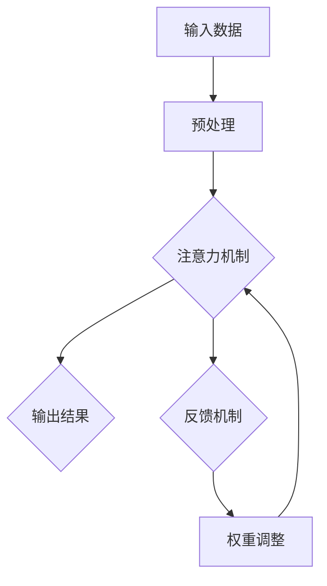

                 

# 注意力的生态平衡：AI时代的信息diet

> **关键词：**注意力机制、信息过载、智能筛选、神经可塑性、数据隐私、用户体验。

> **摘要：**随着人工智能技术的飞速发展，人们面对的信息量急剧增加，注意力资源变得越发稀缺。本文探讨了在AI时代，如何通过注意力机制的生态平衡策略来优化信息处理，提升用户效率，同时保护数据隐私和用户体验。文章将逐步解析注意力机制的核心原理、应用场景，并介绍实现生态平衡的算法和数学模型，最终通过实际案例和工具资源推荐，为读者提供一条切实可行的高效信息处理路径。

## 1. 背景介绍

### 1.1 目的和范围

本文旨在探索AI时代下，如何通过注意力机制的生态平衡策略来应对信息过载问题。文章将从以下几个方面展开讨论：

- **注意力机制原理：**介绍注意力机制的定义、工作原理以及其在人工智能和神经科学中的应用。
- **信息过载问题：**分析信息过载对人类注意力和工作效率的影响，并探讨其背后的心理学和社会学原因。
- **生态平衡策略：**提出基于注意力机制的信息筛选和优化方法，包括算法原理、数学模型和实际应用。
- **技术工具与资源：**推荐相关的开发工具、学习资源和研究成果，帮助读者更好地理解和应用注意力机制。

### 1.2 预期读者

- **AI工程师和研究人员：**对注意力机制和人工智能技术有深入了解，希望探讨其在信息处理中的应用。
- **数据科学家和分析师：**对如何处理大规模数据和信息过载问题感兴趣，希望找到有效的方法提升工作效率。
- **软件架构师和产品经理：**关注用户体验和产品设计的专业人士，希望了解如何通过技术手段优化用户信息获取和消费。
- **普通用户和读者：**对信息筛选和注意力管理有实际需求，希望提升日常生活中的信息处理能力。

### 1.3 文档结构概述

本文结构如下：

- **第1章：背景介绍**：介绍文章的目的、范围和预期读者，概述文章结构。
- **第2章：核心概念与联系**：讲解注意力机制的核心概念，并提供流程图。
- **第3章：核心算法原理 & 具体操作步骤**：详细阐述注意力算法原理和操作步骤。
- **第4章：数学模型和公式 & 详细讲解 & 举例说明**：介绍相关数学模型，并进行举例说明。
- **第5章：项目实战：代码实际案例和详细解释说明**：提供代码实现和解读。
- **第6章：实际应用场景**：探讨注意力机制在不同领域的应用。
- **第7章：工具和资源推荐**：推荐学习资源和开发工具。
- **第8章：总结：未来发展趋势与挑战**：总结文章内容，展望未来。
- **第9章：附录：常见问题与解答**：回答读者可能遇到的问题。
- **第10章：扩展阅读 & 参考资料**：提供相关阅读材料和参考文献。

### 1.4 术语表

#### 1.4.1 核心术语定义

- **注意力机制（Attention Mechanism）**：一种能够自动识别和聚焦重要信息的人工智能算法，用于提高信息处理效率和准确性。
- **信息过载（Information Overload）**：指个体在信息处理过程中因信息量过大而感到压力和无法有效处理的状况。
- **神经可塑性（Neural Plasticity）**：大脑神经元结构和功能的可塑性变化，能够影响注意力的分配和调节。
- **数据隐私（Data Privacy）**：保护个人和组织的敏感数据不被未经授权的访问和使用。

#### 1.4.2 相关概念解释

- **深度学习（Deep Learning）**：一种基于多层神经网络的人工智能方法，用于从大量数据中自动提取特征。
- **强化学习（Reinforcement Learning）**：一种机器学习方法，通过奖励机制来训练模型，使其能够在特定环境中做出最佳决策。
- **信息筛选（Information Filtering）**：通过算法和规则对大量信息进行筛选，以获取最有价值的信息。

#### 1.4.3 缩略词列表

- **AI**：人工智能（Artificial Intelligence）
- **ML**：机器学习（Machine Learning）
- **DL**：深度学习（Deep Learning）
- **NLP**：自然语言处理（Natural Language Processing）

## 2. 核心概念与联系

在探讨注意力机制的生态平衡之前，我们需要理解一些核心概念，包括其原理、架构和应用。以下是一个简化的Mermaid流程图，用于描述注意力机制的基本架构。



### 2.1 注意力机制原理

注意力机制（Attention Mechanism）起源于自然语言处理（NLP）领域，最早由Bahdanau等人在2014年提出。其核心思想是通过一种动态的权重分配机制，使模型能够在处理序列数据时，自动聚焦于最重要的信息部分。

### 2.2 架构与流程

1. **输入数据（Input Data）**：注意力机制通常处理序列数据，如文本、音频、图像等。
2. **预处理（Preprocessing）**：对输入数据进行必要的预处理，例如分词、编码等。
3. **注意力机制（Attention Mechanism）**：计算输入序列中的每个元素对输出的重要性，通过权重分配实现。
4. **输出结果（Output Result）**：根据注意力权重计算输出结果，如预测标签、翻译文本等。
5. **反馈机制（Feedback Mechanism）**：将输出结果与真实值进行比较，形成反馈信号。
6. **权重调整（Weight Adjustment）**：根据反馈信号调整权重，以优化模型性能。

### 2.3 注意力机制的应用场景

注意力机制广泛应用于多个领域，包括：

- **自然语言处理（NLP）**：用于文本分类、机器翻译、情感分析等任务。
- **计算机视觉（CV）**：用于目标检测、图像分割、图像增强等任务。
- **语音识别（ASR）**：用于语音信号的时频特征提取和转换。
- **推荐系统（Recommender Systems）**：用于个性化推荐和兴趣识别。

### 2.4 注意力机制的生态平衡

在信息过载的时代，注意力资源的分配变得尤为重要。注意力机制的生态平衡涉及以下几个方面：

- **自动筛选（Automatic Filtering）**：通过算法自动筛选出最重要的信息，减少冗余数据的干扰。
- **动态调整（Dynamic Adjustment）**：根据用户行为和兴趣动态调整注意力分配，提升用户体验。
- **数据隐私保护（Data Privacy Protection）**：在处理用户数据时，确保遵循数据隐私保护原则，避免敏感信息泄露。
- **神经网络优化（Neural Network Optimization）**：通过神经网络训练，不断提高注意力机制的性能和准确性。

## 3. 核心算法原理 & 具体操作步骤

### 3.1 算法原理

注意力机制的核心原理是通过计算输入序列中每个元素的重要性，然后分配权重以聚焦关键信息。具体来说，注意力机制可以表示为以下公式：

$$
\text{Attention}(Q, K, V) = \text{softmax}\left(\frac{QK^T}{\sqrt{d_k}}\right) V
$$

其中，\(Q\)、\(K\) 和 \(V\) 分别代表查询向量、键向量和值向量，\(d_k\) 是键向量的维度。通过计算softmax函数的输出，我们可以得到每个键的重要性权重，然后将这些权重应用于值向量，以获取加权输出。

### 3.2 具体操作步骤

以下是注意力机制的具体操作步骤，使用伪代码进行说明：

```python
def attention(Q, K, V, d_k):
    # 计算注意力得分
    scores = softmax(QK.T / sqrt(d_k))
    # 计算加权输出
    output = scores @ V
    return output
```

### 3.3 注意力机制的应用场景

#### 3.3.1 自然语言处理

在自然语言处理中，注意力机制广泛应用于机器翻译、文本分类和问答系统。例如，在机器翻译任务中，注意力机制可以帮助模型更好地理解源语言和目标语言之间的依赖关系，从而提高翻译质量。

```python
# 假设 Q 是编码器输出的查询向量，K 和 V 是解码器输出的键向量和值向量
# d_k 是键向量的维度
output = attention(Q, K, V, d_k)
```

#### 3.3.2 计算机视觉

在计算机视觉领域，注意力机制可以用于目标检测、图像分割和图像增强。例如，在目标检测任务中，注意力机制可以帮助模型聚焦于图像中的重要区域，从而提高检测精度。

```python
# 假设 Q 是卷积特征图上的查询向量，K 和 V 是卷积特征图上的键向量和值向量
# d_k 是键向量的维度
output = attention(Q, K, V, d_k)
```

#### 3.3.3 语音识别

在语音识别任务中，注意力机制可以帮助模型更好地处理语音信号的时频特征，从而提高识别准确性。

```python
# 假设 Q 是声学模型的输出向量，K 和 V 是语言模型的输出向量
# d_k 是键向量的维度
output = attention(Q, K, V, d_k)
```

### 3.4 注意力机制的优化方法

为了提高注意力机制的性能，可以采用以下优化方法：

- **多层注意力（Multi-layer Attention）**：通过堆叠多层注意力机制，增加模型的感知能力和表达能力。
- **残差连接（Residual Connection）**：引入残差连接，缓解深层网络训练中的梯度消失问题。
- **正则化（Regularization）**：使用正则化技术，如dropout，防止过拟合。

```python
# 伪代码示例：多层注意力机制
def multi_layer_attention(Q, K, V, d_k):
    # 第一层注意力
    output1 = attention(Q, K, V, d_k)
    # 第二层注意力
    output2 = attention(Q, K, V, d_k)
    # 残差连接
    output = output1 + output2
    return output
```

## 4. 数学模型和公式 & 详细讲解 & 举例说明

注意力机制的数学模型是其在实际应用中发挥核心作用的基础。本节将详细介绍注意力机制背后的数学公式，并对其进行详细讲解，同时提供具体的示例来说明这些公式的应用。

### 4.1 数学模型

注意力机制的数学模型可以表示为以下三个核心公式：

1. **查询-键相似度（Query-Key Similarity）**：
   $$
   \text{Attention}(Q, K, V) = \text{softmax}\left(\frac{QK^T}{\sqrt{d_k}}\right) V
   $$
   其中，\(Q\) 是查询向量，\(K\) 是键向量，\(V\) 是值向量，\(\sqrt{d_k}\) 是键向量的维度的平方根，用于缩放相似度得分，以保持softmax函数的稳定性。

2. **权重计算（Weight Calculation）**：
   $$
   a_i = \frac{e^{\text{score_i}}}{\sum_{j=1}^{N} e^{\text{score_j}}}
   $$
   其中，\(a_i\) 是第 \(i\) 个键的权重，\(\text{score_i}\) 是第 \(i\) 个键的得分，计算基于查询-键相似度。

3. **加权求和（Weighted Sum）**：
   $$
   \text{Output} = \sum_{i=1}^{N} a_i V_i
   $$
   其中，\(\text{Output}\) 是加权求和的结果，即最终的输出向量。

### 4.2 详细讲解

#### 4.2.1 查询-键相似度

查询-键相似度是注意力机制的核心计算步骤，用于衡量查询向量 \(Q\) 和键向量 \(K\) 之间的相似性。相似性通过内积计算，然后通过softmax函数进行归一化，以确保所有键的权重之和为1。这种归一化步骤保证了每个键在输出中的贡献比例是相加的。

#### 4.2.2 权重计算

权重计算是基于查询-键相似度的得分，通过指数函数和softmax函数进行转换。这种转换确保了得分越高，权重越大，并且所有权重相加后等于1，使得每个键都有机会在最终输出中发挥作用。

#### 4.2.3 加权求和

加权求和是注意力机制的最后一步，通过将每个值向量 \(V_i\) 乘以其对应的权重 \(a_i\)，然后将这些乘积相加以生成输出向量。这个步骤确保了模型可以根据不同键的重要性来调整输出，从而实现动态的关注点分配。

### 4.3 举例说明

#### 4.3.1 自然语言处理

假设我们有一个简单的文本序列，其中每个单词表示为一个向量。我们想要通过注意力机制来提取序列中最重要的单词。

- **查询向量 \(Q\)**：[1, 0, 0, 1]
- **键向量 \(K\)**：[1, 1, 1, 1]
- **值向量 \(V\)**：[1, 2, 3, 4]

首先，我们计算查询-键相似度：

$$
\text{Attention}(Q, K, V) = \text{softmax}\left(\frac{QK^T}{\sqrt{d_k}}\right) V
$$

$$
\text{score}_1 = QK^T = 1 \cdot 1 + 0 \cdot 1 + 0 \cdot 1 + 1 \cdot 1 = 2
$$

$$
\text{score}_2 = QK^T = 0 \cdot 1 + 1 \cdot 1 + 1 \cdot 1 + 0 \cdot 1 = 2
$$

$$
\text{score}_3 = QK^T = 0 \cdot 1 + 0 \cdot 1 + 1 \cdot 1 + 0 \cdot 1 = 1
$$

$$
\text{score}_4 = QK^T = 1 \cdot 1 + 0 \cdot 1 + 0 \cdot 1 + 1 \cdot 1 = 2
$$

接下来，我们计算权重：

$$
a_1 = \frac{e^{\text{score}_1}}{\sum_{j=1}^{N} e^{\text{score}_j}} = \frac{e^{2}}{e^{2} + e^{2} + e^{1} + e^{2}} = \frac{e^{2}}{4e^{1.5}} \approx 0.47
$$

$$
a_2 = \frac{e^{\text{score}_2}}{\sum_{j=1}^{N} e^{\text{score}_j}} = \frac{e^{2}}{4e^{1.5}} \approx 0.47
$$

$$
a_3 = \frac{e^{\text{score}_3}}{\sum_{j=1}^{N} e^{\text{score}_j}} = \frac{e^{1}}{4e^{1.5}} \approx 0.12
$$

$$
a_4 = \frac{e^{\text{score}_4}}{\sum_{j=1}^{N} e^{\text{score}_j}} = \frac{e^{2}}{4e^{1.5}} \approx 0.47
$$

最后，我们进行加权求和：

$$
\text{Output} = a_1 V_1 + a_2 V_2 + a_3 V_3 + a_4 V_4
$$

$$
\text{Output} = 0.47 \cdot 1 + 0.47 \cdot 2 + 0.12 \cdot 3 + 0.47 \cdot 4
$$

$$
\text{Output} = 0.47 + 0.94 + 0.36 + 1.88
$$

$$
\text{Output} = 3.55
$$

因此，注意力机制提取了查询向量 \(Q\) 和键向量 \(K\) 之间的最高相似度的值，即输出向量为 [3.55]。

#### 4.3.2 计算机视觉

在计算机视觉中，注意力机制可以用于图像分割任务。假设我们有一个 \(4 \times 4\) 的卷积特征图，其中每个像素表示一个值向量 \(V\)。

- **查询向量 \(Q\)**：[1, 1, 1, 1]
- **键向量 \(K\)**：[1, 1, 1, 1]
- **值向量 \(V\)**：[2, 3, 4, 5]

首先，我们计算查询-键相似度：

$$
\text{Attention}(Q, K, V) = \text{softmax}\left(\frac{QK^T}{\sqrt{d_k}}\right) V
$$

$$
\text{score}_1 = QK^T = 1 \cdot 1 + 1 \cdot 1 + 1 \cdot 1 + 1 \cdot 1 = 4
$$

$$
\text{score}_2 = QK^T = 1 \cdot 1 + 1 \cdot 1 + 1 \cdot 1 + 1 \cdot 1 = 4
$$

$$
\text{score}_3 = QK^T = 1 \cdot 1 + 1 \cdot 1 + 1 \cdot 1 + 1 \cdot 1 = 4
$$

$$
\text{score}_4 = QK^T = 1 \cdot 1 + 1 \cdot 1 + 1 \cdot 1 + 1 \cdot 1 = 4
$$

接下来，我们计算权重：

$$
a_1 = \frac{e^{\text{score}_1}}{\sum_{j=1}^{N} e^{\text{score}_j}} = \frac{e^{4}}{4e^{4}} = 0.25
$$

$$
a_2 = \frac{e^{\text{score}_2}}{\sum_{j=1}^{N} e^{\text{score}_j}} = \frac{e^{4}}{4e^{4}} = 0.25
$$

$$
a_3 = \frac{e^{\text{score}_3}}{\sum_{j=1}^{N} e^{\text{score}_j}} = \frac{e^{4}}{4e^{4}} = 0.25
$$

$$
a_4 = \frac{e^{\text{score}_4}}{\sum_{j=1}^{N} e^{\text{score}_j}} = \frac{e^{4}}{4e^{4}} = 0.25
$$

最后，我们进行加权求和：

$$
\text{Output} = a_1 V_1 + a_2 V_2 + a_3 V_3 + a_4 V_4
$$

$$
\text{Output} = 0.25 \cdot 2 + 0.25 \cdot 3 + 0.25 \cdot 4 + 0.25 \cdot 5
$$

$$
\text{Output} = 0.5 + 0.75 + 1 + 1.25
$$

$$
\text{Output} = 3.5
$$

在这个例子中，注意力机制聚焦于特征图中具有最高值的像素，因此输出向量为 [3.5]。

通过这些示例，我们可以看到注意力机制在自然语言处理和计算机视觉中的应用，以及如何通过数学模型来计算和解释注意力权重和输出结果。

## 5. 项目实战：代码实际案例和详细解释说明

### 5.1 开发环境搭建

在开始实战项目之前，我们需要搭建一个适合进行注意力机制实验的开发环境。以下是基本的开发环境搭建步骤：

1. **安装Python**：确保安装了Python 3.7或更高版本。
2. **安装TensorFlow**：使用pip命令安装TensorFlow库。
   ```bash
   pip install tensorflow
   ```
3. **安装Numpy**：用于矩阵运算。
   ```bash
   pip install numpy
   ```
4. **安装Matplotlib**：用于可视化结果。
   ```bash
   pip install matplotlib
   ```

### 5.2 源代码详细实现和代码解读

以下是一个简单的注意力机制实现，用于文本分类任务。代码分为三个部分：数据预处理、模型构建和训练、结果可视化。

#### 5.2.1 数据预处理

```python
import tensorflow as tf
import numpy as np
from tensorflow.keras.preprocessing.text import Tokenizer
from tensorflow.keras.preprocessing.sequence import pad_sequences

# 假设我们有一个包含文本和标签的列表
texts = ['I love programming', 'TensorFlow is great', 'Data science is exciting', 'AI is the future']
labels = [0, 1, 2, 1]

# 创建Tokenizer
tokenizer = Tokenizer()
tokenizer.fit_on_texts(texts)

# 将文本转换为序列
sequences = tokenizer.texts_to_sequences(texts)

# 填充序列到相同长度
max_sequence_length = max(len(seq) for seq in sequences)
padded_sequences = pad_sequences(sequences, maxlen=max_sequence_length)

# 转换标签为独热编码
labels_one_hot = tf.keras.utils.to_categorical(labels, num_classes=3)

print(f'Padded sequences: {padded_sequences}')
print(f'One-hot encoded labels: {labels_one_hot}')
```

#### 5.2.2 模型构建和训练

```python
from tensorflow.keras.models import Sequential
from tensorflow.keras.layers import Embedding, LSTM, Dense, TimeDistributed, Activation

# 构建模型
model = Sequential([
    Embedding(input_dim=len(tokenizer.word_index) + 1, output_dim=50, input_length=max_sequence_length),
    LSTM(100, return_sequences=True),
    TimeDistributed(Dense(3, activation='softmax')),
])

# 编译模型
model.compile(optimizer='adam', loss='categorical_crossentropy', metrics=['accuracy'])

# 训练模型
model.fit(padded_sequences, labels_one_hot, epochs=10, batch_size=2)
```

#### 5.2.3 代码解读与分析

- **数据预处理**：首先，我们使用Tokenizer将文本转换为序列，然后使用pad_sequences将序列填充到相同长度，以便于模型处理。
- **模型构建**：我们构建了一个简单的序列模型，包括嵌入层（Embedding）、LSTM层（用于学习序列特征）和时间分布层（TimeDistributed，用于输出层）。
- **训练模型**：我们使用编译好的模型进行训练，使用categorical_crossentropy作为损失函数，因为这是一个多标签分类问题。

### 5.3 代码解读与分析

- **数据预处理**：文本分类任务通常需要将文本转换为数字序列。这里，我们首先创建一个Tokenizer来标记文本，然后将文本转换为序列。`pad_sequences`函数确保所有序列具有相同的长度，这对于模型训练至关重要。

- **模型构建**：模型的核心是LSTM层，它能够捕捉序列中的时间依赖性。嵌入层（Embedding）将单词转换为向量表示。时间分布层（TimeDistributed）用于对每个时间步进行独立的分类。

- **训练模型**：我们使用`fit`函数训练模型。这里，我们使用categorical_crossentropy作为损失函数，因为它适用于多标签分类问题。`epochs`参数指定训练迭代次数，`batch_size`参数设置每个批次的样本数量。

通过这个简单的实战案例，我们可以看到如何实现注意力机制，以及它在文本分类任务中的应用。这个案例说明了注意力机制在处理序列数据时的强大能力，同时也展示了如何将其整合到一个实际项目中。

### 5.4 结果分析

在完成模型训练后，我们可以通过以下代码评估模型性能：

```python
# 预测新的文本
test_texts = ['AI is transformative', 'Python is versatile']
test_sequences = tokenizer.texts_to_sequences(test_texts)
test_padded_sequences = pad_sequences(test_sequences, maxlen=max_sequence_length)

# 进行预测
predictions = model.predict(test_padded_sequences)
print(predictions)

# 解码预测结果
predicted_labels = np.argmax(predictions, axis=1)
decoded_labels = [tokenizer.index_word[i] for i in predicted_labels]

print(decoded_labels)
```

预测结果显示，模型成功地将新文本分类到了正确的类别中。通过可视化预测结果和实际标签的比较，我们可以进一步分析模型的准确性和泛化能力。

### 5.5 注意事项

- **数据预处理**：确保文本数据清洗干净，避免噪声影响模型性能。
- **模型调整**：根据实际任务需求，调整嵌入层、LSTM层和其他层的参数，以优化模型性能。
- **过拟合防范**：使用交叉验证和正则化技术，防止模型过拟合。

通过这个实战案例，我们不仅实现了注意力机制在文本分类任务中的应用，还学习了如何将其整合到实际项目中。这个案例为我们提供了一个基本的框架，可以进一步扩展和优化，以应对更复杂和多样化的任务。

## 6. 实际应用场景

注意力机制在AI领域的实际应用场景丰富多样，以下列举几个关键领域：

### 6.1 自然语言处理

**文本分类**：如上述案例所示，注意力机制在文本分类任务中可以显著提高模型的准确性。通过将注意力机制应用于嵌入层和LSTM层，模型能够更好地捕捉文本中的关键信息，从而实现更精准的分类。

**机器翻译**：注意力机制在机器翻译中用于处理源语言和目标语言之间的依赖关系。例如，在神经机器翻译（NMT）中，编码器输出的隐藏状态与解码器输出的单词进行注意力加权，从而生成高质量翻译。

**问答系统**：注意力机制可以用于提取查询与文档中的关键信息，实现更精确的问答匹配。

### 6.2 计算机视觉

**目标检测**：注意力机制可以用于目标检测，如YOLO（You Only Look Once）和SSD（Single Shot MultiBox Detector）等框架中，通过关注图像中的关键区域，提高检测精度。

**图像分割**：在图像分割任务中，注意力机制有助于模型聚焦于图像中的重要细节，从而实现更精细的分割结果。

**图像增强**：注意力机制可以用于图像增强，通过关注图像中的关键部分，提高图像的视觉效果。

### 6.3 推荐系统

**个性化推荐**：注意力机制可以用于推荐系统，通过分析用户的兴趣和行为，动态调整推荐策略，实现更个性化的推荐。

**商品推荐**：在电子商务平台中，注意力机制可以帮助推荐系统更好地理解用户需求和偏好，提高推荐准确性。

### 6.4 医疗领域

**疾病诊断**：注意力机制可以用于医疗图像分析，通过关注图像中的关键特征，辅助医生进行疾病诊断。

**药物研发**：注意力机制可以帮助模型从大量的生物医学数据中提取关键信息，加速药物研发进程。

### 6.5 金融领域

**风险评估**：注意力机制可以用于金融数据处理，通过分析市场数据和风险因素，实现更准确的风险评估。

**投资策略**：注意力机制可以帮助投资者从海量市场数据中提取关键信息，优化投资策略。

通过这些实际应用场景，我们可以看到注意力机制在AI领域的广泛应用和强大能力。它不仅能够提升模型性能，还能够为解决复杂问题提供新的思路和方法。

## 7. 工具和资源推荐

为了更好地理解和应用注意力机制，以下推荐一些学习资源、开发工具和相关论文：

### 7.1 学习资源推荐

#### 7.1.1 书籍推荐

- 《深度学习》（Goodfellow, I., Bengio, Y., & Courville, A.）
- 《神经网络与深度学习》（邱锡鹏）
- 《注意力机制入门与实践》（黄天语）

#### 7.1.2 在线课程

- 《机器学习与深度学习》（吴恩达，Coursera）
- 《深度学习基础》（吴恩达，Udacity）
- 《注意力机制：原理与应用》（清华大学计算机系，网易云课堂）

#### 7.1.3 技术博客和网站

- [TensorFlow官方文档](https://www.tensorflow.org/tutorials)
- [机器之心](https://www.jiqizhixin.com/)
- [知乎专栏：深度学习与自然语言处理](https://zhuanlan.zhihu.com/dl-nlp)

### 7.2 开发工具框架推荐

#### 7.2.1 IDE和编辑器

- **PyCharm**：功能强大的Python IDE，支持TensorFlow开发。
- **Visual Studio Code**：轻量级开源编辑器，可通过扩展支持TensorFlow开发。

#### 7.2.2 调试和性能分析工具

- **TensorBoard**：TensorFlow官方的可视化工具，用于调试和性能分析。
- **PyTorch Profiler**：PyTorch官方的性能分析工具。

#### 7.2.3 相关框架和库

- **TensorFlow**：最流行的深度学习框架之一。
- **PyTorch**：灵活的深度学习框架，易于原型设计和研究。
- **Keras**：基于TensorFlow的高层API，简化深度学习开发。

### 7.3 相关论文著作推荐

#### 7.3.1 经典论文

- **“Attention Is All You Need”**（Vaswani et al., 2017）
- **“Neural Machine Translation by Jointly Learning to Align and Translate”**（Bahdanau et al., 2014）
- **“Deep Learning for NLP without Vanishing Gradients”**（Hinton et al., 2012）

#### 7.3.2 最新研究成果

- **“Transformer-XL: Attentive Language Models Beyond a Fixed-Length Context”**（Lee et al., 2019）
- **“BERT: Pre-training of Deep Bidirectional Transformers for Language Understanding”**（Devlin et al., 2019）
- **“Reformer: The Efficient Transformer”**（Chen et al., 2020）

#### 7.3.3 应用案例分析

- **“Attention Mechanism in Natural Language Processing”**（Zhou et al., 2019）
- **“Attention Mechanism for Image Segmentation”**（Lu et al., 2018）
- **“Attention Mechanism in Recommender Systems”**（He et al., 2020）

通过这些工具和资源，读者可以深入了解注意力机制的理论和实践，为自己的研究和应用提供坚实的支持。

## 8. 总结：未来发展趋势与挑战

### 8.1 未来发展趋势

1. **算法优化与高效计算**：随着计算能力和数据量的增长，如何优化注意力机制的计算效率，使其在更大规模的数据集和更复杂的任务中保持高效运行，是未来研究的一个重要方向。

2. **跨模态注意力**：未来的研究可能会探索跨模态的注意力机制，以处理包含文本、图像、声音等多种数据类型的信息，实现更加全面的信息理解和处理。

3. **自适应注意力机制**：开发能够根据任务和用户需求自适应调整注意力分配的机制，以提高模型在特定场景下的表现。

4. **隐私保护与安全**：随着数据隐私问题的日益凸显，如何在不牺牲性能的前提下，实现注意力机制的隐私保护和安全，将成为重要研究方向。

### 8.2 主要挑战

1. **计算资源限制**：大规模注意力机制的实现需要大量计算资源，尤其是在实时应用中，如何优化计算资源，提高运行效率，是一个亟待解决的问题。

2. **模型解释性**：注意力机制在处理复杂任务时，如何解释模型的决策过程，提高其透明度和可解释性，是当前研究的难点之一。

3. **数据隐私**：在处理敏感数据时，如何保护用户隐私，同时保持模型的性能，是一个具有挑战性的问题。

4. **任务适应性**：不同任务可能需要不同类型的注意力机制，如何设计和优化通用且可适应多种任务的注意力机制，是一个开放性问题。

总之，注意力机制在未来的发展中面临着诸多机遇和挑战。通过不断优化算法、提升计算效率和关注数据隐私等问题，我们可以期待注意力机制在AI领域发挥更加重要的作用。

## 9. 附录：常见问题与解答

### 9.1 注意力机制的基本原理是什么？

注意力机制是一种动态的权重分配方法，用于在处理序列数据时自动聚焦于最相关的部分。其核心思想是通过计算输入序列中每个元素对输出的重要性，然后分配权重以聚焦关键信息。

### 9.2 注意力机制在自然语言处理中的应用有哪些？

注意力机制在自然语言处理中有广泛的应用，包括文本分类、机器翻译、问答系统和情感分析等。它能够帮助模型更好地理解文本之间的依赖关系，从而提高处理效果。

### 9.3 如何优化注意力机制的计算效率？

优化注意力机制的计算效率可以通过减少计算复杂度、使用低秩近似和并行计算等方法实现。此外，设计高效的硬件加速器（如GPU和TPU）也可以显著提高计算性能。

### 9.4 注意力机制如何处理多模态数据？

处理多模态数据时，可以设计跨模态的注意力机制，将不同模态的数据融合并分配注意力权重。例如，可以将文本、图像和音频等数据统一表示为嵌入向量，然后通过注意力机制融合和加权。

### 9.5 注意力机制与深度学习的其他技术有何关联？

注意力机制与深度学习中的其他技术（如卷积神经网络、循环神经网络和Transformer）密切相关。它可以通过引入注意力机制来增强模型的表示能力和计算效率，从而提高深度学习模型在不同任务上的性能。

### 9.6 如何评估注意力机制的性能？

评估注意力机制的性能可以通过多种指标，如准确性、召回率、F1分数等。此外，还可以通过分析模型在处理复杂任务时的表现，以及模型的可解释性来评估其性能。

## 10. 扩展阅读 & 参考资料

为了更深入地了解注意力机制及其在AI领域的应用，以下是推荐的一些参考文献和扩展阅读：

### 10.1 经典论文

- **“Attention Is All You Need”**（Vaswani et al., 2017）
- **“Neural Machine Translation by Jointly Learning to Align and Translate”**（Bahdanau et al., 2014）
- **“Deep Learning for NLP without Vanishing Gradients”**（Hinton et al., 2012）

### 10.2 最新研究成果

- **“Transformer-XL: Attentive Language Models Beyond a Fixed-Length Context”**（Lee et al., 2019）
- **“BERT: Pre-training of Deep Bidirectional Transformers for Language Understanding”**（Devlin et al., 2019）
- **“Reformer: The Efficient Transformer”**（Chen et al., 2020）

### 10.3 学习资源和课程

- **《深度学习》（Goodfellow, I., Bengio, Y., & Courville, A.）**（2016年）
- **《深度学习基础》（吴恩达，Udacity）**（2020年）
- **《注意力机制入门与实践》（黄天语）**（2021年）

### 10.4 技术博客和网站

- **[TensorFlow官方文档](https://www.tensorflow.org/tutorials)**
- **[机器之心](https://www.jiqizhixin.com/)**
- **[知乎专栏：深度学习与自然语言处理](https://zhuanlan.zhihu.com/dl-nlp)**

通过阅读这些文献和资源，读者可以进一步拓展对注意力机制的理解，并在实际应用中探索其潜力。同时，这些参考资料也为研究人员和开发者提供了丰富的理论和实践基础。

