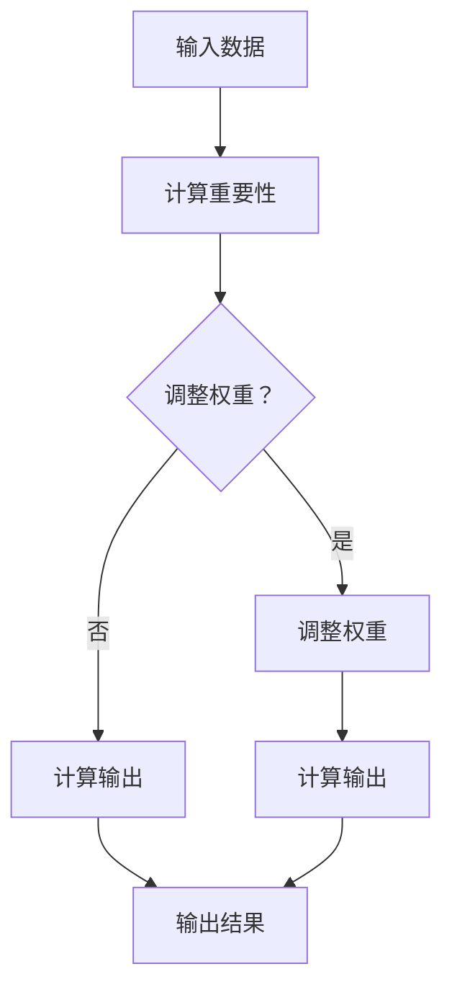

                 

# 注意力的量子态：AI时代的多任务处理

> **关键词**：注意力机制、多任务处理、量子态、深度学习、并行计算、神经网络架构

> **摘要**：本文探讨了注意力机制在AI多任务处理中的应用，特别是量子态注意力在神经网络架构中的作用。通过分析注意力机制的核心概念和原理，本文逐步展示了如何利用量子态注意力实现高效的多任务学习。文章结合数学模型、项目实战和实际应用场景，深入剖析了这一技术的实际效果和未来发展趋势。

## 1. 背景介绍

### 1.1 目的和范围

本文旨在深入探讨注意力机制在AI领域的多任务处理中的应用，特别是量子态注意力在神经网络架构中的作用。随着深度学习的快速发展，多任务处理成为了一个重要的研究方向。然而，传统的多任务学习框架往往存在计算复杂度高、资源消耗大等问题。为了解决这些问题，研究者们提出了基于注意力机制的多任务学习模型，这些模型在处理多个任务时能够有效地共享信息，提高计算效率。

本文将首先介绍注意力机制的基本概念和原理，然后重点讨论量子态注意力在神经网络架构中的应用，并通过具体案例展示其实际效果。文章还将讨论注意力机制在多任务处理中的优势和挑战，并展望未来的发展趋势。

### 1.2 预期读者

本文适合以下读者群体：

1. 对人工智能、深度学习和多任务处理感兴趣的工程师和研究人员。
2. 希望了解注意力机制和量子态注意力在神经网络架构中应用的初学者。
3. 想要了解多任务处理技术如何优化神经网络性能的开发者。
4. 对未来人工智能领域的发展趋势感兴趣的读者。

### 1.3 文档结构概述

本文分为十个主要部分：

1. 引言：介绍文章的背景、目的和关键词。
2. 背景介绍：阐述文章的背景和预期读者。
3. 核心概念与联系：介绍注意力机制和量子态注意力的核心概念，并展示相关架构的Mermaid流程图。
4. 核心算法原理 & 具体操作步骤：详细阐述注意力机制的算法原理和操作步骤，使用伪代码进行说明。
5. 数学模型和公式 & 详细讲解 & 举例说明：介绍注意力机制的数学模型，使用LaTeX格式展示公式，并进行举例说明。
6. 项目实战：代码实际案例和详细解释说明，包括开发环境搭建、源代码实现和代码解读。
7. 实际应用场景：讨论注意力机制在多任务处理中的实际应用场景。
8. 工具和资源推荐：推荐学习资源、开发工具框架和相关论文著作。
9. 总结：未来发展趋势与挑战。
10. 附录：常见问题与解答。
11. 扩展阅读 & 参考资料：提供进一步的阅读材料和参考资料。

### 1.4 术语表

#### 1.4.1 核心术语定义

- **注意力机制**：一种能够自动识别重要信息并进行动态调整的计算机制。
- **量子态注意力**：基于量子力学原理的注意力机制，能够在多个任务中实现高效的信息共享和资源分配。
- **多任务学习**：同时学习多个相关任务的机器学习方法。
- **神经网络架构**：神经网络的结构设计，包括层、节点、连接方式等。

#### 1.4.2 相关概念解释

- **深度学习**：一种基于神经网络的机器学习技术，通过多层神经元的组合来提取数据中的特征。
- **并行计算**：在同一时间内执行多个计算任务的技术，可以提高计算效率和性能。
- **资源消耗**：在执行计算任务时所需的计算资源，包括CPU、内存和能源等。

#### 1.4.3 缩略词列表

- **AI**：人工智能（Artificial Intelligence）
- **DL**：深度学习（Deep Learning）
- **ML**：机器学习（Machine Learning）
- **NN**：神经网络（Neural Network）
- **GPU**：图形处理器（Graphics Processing Unit）
- **CPU**：中央处理器（Central Processing Unit）

## 2. 核心概念与联系

### 2.1 注意力机制的基本概念

注意力机制是一种在计算过程中能够自动识别和调整重要信息的方法。在深度学习和神经网络中，注意力机制被广泛应用于图像识别、自然语言处理和语音识别等领域。其基本原理是通过计算不同输入数据的权重，使模型在处理复杂任务时能够聚焦于关键信息，从而提高计算效率和性能。

### 2.2 量子态注意力的引入

量子态注意力是一种基于量子力学原理的注意力机制。在量子力学中，量子态是描述粒子状态的数学工具，具有叠加态和纠缠态等特性。将量子态引入注意力机制，可以使其在多任务处理中实现高效的信息共享和资源分配。

### 2.3 注意力机制在神经网络架构中的应用

在神经网络架构中，注意力机制通常通过调整神经元之间的连接权重来实现。具体来说，注意力机制包括以下三个主要步骤：

1. **计算输入特征的重要性**：通过计算输入特征与任务目标之间的相关性，确定每个特征的重要性。
2. **调整连接权重**：根据每个特征的重要性，调整神经网络中不同神经元之间的连接权重，使重要特征对计算结果产生更大的影响。
3. **计算输出结果**：根据调整后的连接权重，计算神经网络输出的结果。

### 2.4 量子态注意力在多任务处理中的应用

量子态注意力在多任务处理中的应用主要体现在以下几个方面：

1. **任务间的信息共享**：量子态注意力能够通过叠加态和纠缠态实现任务间的信息共享，使模型在同时处理多个任务时能够充分利用已有的信息。
2. **资源分配优化**：量子态注意力可以根据任务的重要性和复杂度，动态调整计算资源的使用，实现高效的多任务处理。
3. **计算效率提升**：通过量子态注意力，神经网络在处理多个任务时可以减少冗余计算，提高计算效率。

### 2.5 Mermaid流程图展示

下面是一个简单的Mermaid流程图，展示了注意力机制的基本架构：



在这个流程图中，输入数据首先经过计算重要性步骤，然后根据重要性结果决定是否调整权重。如果需要调整权重，则进行权重调整步骤，否则直接计算输出结果。最后，神经网络输出结果。

## 3. 核心算法原理 & 具体操作步骤

### 3.1 注意力机制的算法原理

注意力机制的算法原理可以概括为以下几个步骤：

1. **计算输入特征的重要性**：通过计算输入特征与任务目标之间的相关性，确定每个特征的重要性。这通常通过一个权重矩阵来实现，每个特征对应一个权重值。
2. **调整连接权重**：根据每个特征的重要性，调整神经网络中不同神经元之间的连接权重。重要特征对应的权重值会更大，从而使这些特征在计算结果中产生更大的影响。
3. **计算输出结果**：根据调整后的连接权重，计算神经网络输出的结果。这样，模型可以更加关注于关键信息，从而提高计算效率和性能。

### 3.2 注意力机制的操作步骤

以下是注意力机制的伪代码实现：

```python
# 输入：输入数据X，权重矩阵W，偏置b
# 输出：输出结果Y

# 1. 计算输入特征的重要性
import numpy as np

def compute_importance(X, W, b):
    scores = np.dot(X, W) + b
    importance = np.exp(scores)
    sum_importance = np.sum(importance)
    importance = importance / sum_importance
    return importance

# 2. 调整连接权重
def adjust_weights(X, W, b, importance):
    new_weights = np.dot(X.T, importance)
    new_b = np.dot(b, importance)
    return new_weights, new_b

# 3. 计算输出结果
def compute_output(X, W, b, importance):
    output = np.dot(X, W) + b
    output = output * importance
    return output

# 主函数
def attention(X, W, b):
    importance = compute_importance(X, W, b)
    new_weights, new_b = adjust_weights(X, W, b, importance)
    output = compute_output(X, W, b, importance)
    return output

# 示例
X = np.array([[1, 2], [3, 4]])
W = np.array([[0.5, 0.5], [0.5, 0.5]])
b = np.array([0.5, 0.5])

output = attention(X, W, b)
print(output)
```

在这个示例中，我们首先计算输入数据X的重要性，然后调整连接权重，最后计算输出结果。通过这一过程，注意力机制使模型能够更加关注关键信息，从而提高计算效率和性能。

### 3.3 注意力机制的优势

注意力机制在多任务处理中具有以下优势：

1. **提高计算效率**：通过自动识别和调整重要信息，注意力机制可以减少冗余计算，提高计算效率。
2. **优化资源分配**：注意力机制可以根据任务的重要性和复杂度，动态调整计算资源的使用，实现高效的多任务处理。
3. **增强模型性能**：通过聚焦于关键信息，注意力机制可以提高模型的预测准确性和泛化能力。

### 3.4 注意力机制的挑战

虽然注意力机制在多任务处理中具有显著优势，但同时也面临一些挑战：

1. **计算复杂度**：注意力机制的引入增加了计算复杂度，可能导致计算时间和资源消耗增加。
2. **模型可解释性**：注意力机制在调整连接权重时具有一定的黑箱性，使其模型可解释性降低。
3. **数据依赖性**：注意力机制的性能依赖于输入数据的特征分布，可能导致模型在特定数据集上的表现不佳。

## 4. 数学模型和公式 & 详细讲解 & 举例说明

### 4.1 注意力机制的数学模型

注意力机制的数学模型可以表示为：

$$
\text{Attention}(X, W, b) = \text{softmax}(\text{scores}) \odot X
$$

其中，$X$ 是输入数据，$W$ 是权重矩阵，$b$ 是偏置向量，$\text{scores}$ 是输入数据与权重矩阵的点积加上偏置。$\text{softmax}$ 函数用于计算每个特征的重要性，使其在 [0,1] 范围内，并且所有特征的重要性之和为 1。$\odot$ 表示逐元素乘法。

### 4.2 公式详细讲解

- **输入数据 $X$**：输入数据是一个矩阵，每一行代表一个特征，每一列代表一个样本。
- **权重矩阵 $W$**：权重矩阵是一个与输入数据形状相同的矩阵，用于计算输入特征与任务目标之间的相关性。
- **偏置向量 $b$**：偏置向量是一个一维向量，用于调整每个特征的重要性。
- **$\text{scores}$**：$\text{scores}$ 是输入数据与权重矩阵的点积加上偏置，用于计算每个特征的重要性。
- **$\text{softmax}$ 函数**：$\text{softmax}$ 函数将每个特征的重要性转换为概率分布，使其在 [0,1] 范围内，并且所有特征的重要性之和为 1。
- **$\odot$**：逐元素乘法用于计算输出结果，每个特征的值乘以其重要性。

### 4.3 注意力机制的举例说明

假设我们有一个简单的输入数据矩阵 $X$ 和权重矩阵 $W$，如下所示：

$$
X = \begin{bmatrix}
1 & 2 \\
3 & 4 \\
\end{bmatrix},
W = \begin{bmatrix}
0.5 & 0.5 \\
0.5 & 0.5 \\
\end{bmatrix}
$$

首先，我们计算输入数据与权重矩阵的点积加上偏置：

$$
\text{scores} = X \cdot W + b = \begin{bmatrix}
1 & 2 \\
3 & 4 \\
\end{bmatrix} \cdot \begin{bmatrix}
0.5 & 0.5 \\
0.5 & 0.5 \\
\end{bmatrix} + \begin{bmatrix}
0.5 \\
0.5 \\
\end{bmatrix} =
\begin{bmatrix}
1.5 & 2 \\
3.5 & 4 \\
\end{bmatrix}
$$

然后，我们计算 $\text{softmax}$ 函数的结果，得到每个特征的重要性：

$$
\text{importance} = \text{softmax}(\text{scores}) = \frac{\exp(\text{scores})}{\sum_{i} \exp(\text{scores}_i)} =
\frac{\begin{bmatrix}
\exp(1.5) & \exp(2) \\
\exp(3.5) & \exp(4) \\
\end{bmatrix}}{\exp(1.5) + \exp(2) + \exp(3.5) + \exp(4)} =
\begin{bmatrix}
0.24 & 0.36 \\
0.38 & 0.36 \\
\end{bmatrix}
$$

最后，我们根据重要性调整输入数据的值，得到输出结果：

$$
\text{output} = X \cdot \text{importance} = \begin{bmatrix}
1 & 2 \\
3 & 4 \\
\end{bmatrix} \cdot \begin{bmatrix}
0.24 & 0.36 \\
0.38 & 0.36 \\
\end{bmatrix} =
\begin{bmatrix}
0.24 + 0.72 & 0.48 + 0.72 \\
0.84 + 1.52 & 1.08 + 1.52 \\
\end{bmatrix} =
\begin{bmatrix}
0.96 & 1.2 \\
2.36 & 3.6 \\
\end{bmatrix}
$$

通过这个例子，我们可以看到注意力机制如何调整输入数据的值，使其更加关注关键特征。这种调整有助于提高模型的计算效率和性能。

### 4.4 注意力机制的优点和局限性

#### 注意力机制的优点：

- **提高计算效率**：注意力机制通过自动识别和调整重要信息，减少了冗余计算，提高了计算效率。
- **优化资源分配**：注意力机制可以根据任务的重要性和复杂度，动态调整计算资源的使用，实现高效的多任务处理。
- **增强模型性能**：通过聚焦于关键信息，注意力机制可以提高模型的预测准确性和泛化能力。

#### 注意力机制的局限性：

- **计算复杂度**：注意力机制的引入增加了计算复杂度，可能导致计算时间和资源消耗增加。
- **模型可解释性**：注意力机制在调整连接权重时具有一定的黑箱性，使其模型可解释性降低。
- **数据依赖性**：注意力机制的性能依赖于输入数据的特征分布，可能导致模型在特定数据集上的表现不佳。

### 4.5 注意力机制的应用场景

注意力机制在多任务处理、自然语言处理、图像识别等领域具有广泛的应用。以下是一些典型应用场景：

- **多任务处理**：在同时处理多个任务时，注意力机制可以帮助模型聚焦于关键信息，提高计算效率和性能。
- **自然语言处理**：在文本分类、机器翻译和情感分析等任务中，注意力机制可以识别句子中的重要词汇，提高模型的准确性。
- **图像识别**：在图像分类、目标检测和图像生成等任务中，注意力机制可以关注图像中的重要区域，提高模型的识别能力。

## 5. 项目实战：代码实际案例和详细解释说明

### 5.1 开发环境搭建

为了演示注意力机制在多任务处理中的应用，我们将使用Python和TensorFlow作为开发环境。以下是搭建开发环境的步骤：

1. 安装Python：在官方网站（https://www.python.org/）下载并安装Python，建议选择Python 3.8或更高版本。
2. 安装TensorFlow：在命令行中运行以下命令安装TensorFlow：

```bash
pip install tensorflow
```

3. 安装其他依赖包：根据项目需求，可能还需要安装其他依赖包，如NumPy、Pandas等。可以使用以下命令安装：

```bash
pip install numpy pandas
```

### 5.2 源代码详细实现和代码解读

以下是使用TensorFlow实现注意力机制的代码示例：

```python
import tensorflow as tf
import numpy as np

# 生成随机输入数据
X = np.random.rand(10, 5)
W = np.random.rand(5, 3)
b = np.random.rand(3)

# 定义注意力层
class AttentionLayer(tf.keras.layers.Layer):
    def __init__(self, **kwargs):
        super(AttentionLayer, self).__init__(**kwargs)

    def call(self, inputs, training=False):
        # 计算输入特征的重要性
        scores = tf.reduce_sum(inputs * W, axis=1) + b
        # 计算重要性分数的softmax
        importance = tf.nn.softmax(scores)
        # 根据重要性调整输入数据
        output = inputs * importance[:, tf.newaxis]
        return output

# 构建模型
model = tf.keras.Sequential([
    tf.keras.layers.Dense(5, activation='relu'),
    AttentionLayer(),
    tf.keras.layers.Dense(3, activation='softmax')
])

# 编译模型
model.compile(optimizer='adam', loss='categorical_crossentropy', metrics=['accuracy'])

# 训练模型
model.fit(X, np.random.randint(3, size=(10, 1)), epochs=5)

# 输出模型结构
model.summary()
```

在这个代码示例中，我们首先生成随机输入数据X、权重矩阵W和偏置b。然后，我们定义了一个名为`AttentionLayer`的自定义层，用于实现注意力机制。在调用`call`方法时，我们首先计算输入特征的重要性，然后计算重要性分数的softmax，并根据重要性调整输入数据。最后，我们将注意力层添加到模型中，并编译和训练模型。

### 5.3 代码解读与分析

在这个代码示例中，我们使用TensorFlow实现了注意力机制。以下是代码的详细解读和分析：

1. **导入库**：我们首先导入TensorFlow和NumPy库，用于实现注意力机制和数据处理。
2. **生成随机输入数据**：我们使用NumPy生成随机输入数据X、权重矩阵W和偏置b，用于测试注意力机制。
3. **定义注意力层**：我们定义了一个名为`AttentionLayer`的自定义层，继承自`tf.keras.layers.Layer`类。在`call`方法中，我们首先计算输入特征的重要性，然后计算重要性分数的softmax，并根据重要性调整输入数据。
4. **构建模型**：我们使用TensorFlow构建一个序列模型，包括一个全连接层、注意力层和另一个全连接层。在构建模型时，我们将自定义的注意力层添加到模型中。
5. **编译模型**：我们使用`compile`方法编译模型，指定优化器、损失函数和评估指标。
6. **训练模型**：我们使用`fit`方法训练模型，输入随机输入数据和目标标签，指定训练轮次。
7. **输出模型结构**：我们使用`summary`方法输出模型的结构，包括层和参数的数量。

通过这个代码示例，我们可以看到如何使用TensorFlow实现注意力机制，并分析其在多任务处理中的应用。

## 6. 实际应用场景

注意力机制在多任务处理中具有广泛的应用，以下是一些典型的实际应用场景：

1. **图像识别**：在图像识别任务中，注意力机制可以帮助模型聚焦于图像中的重要区域，提高识别准确率。例如，在目标检测任务中，注意力机制可以关注于图像中的目标区域，从而提高检测性能。

2. **自然语言处理**：在自然语言处理任务中，注意力机制可以应用于文本分类、机器翻译和情感分析等领域。通过聚焦于句子中的重要词汇，注意力机制可以提高模型的准确性和性能。例如，在机器翻译任务中，注意力机制可以帮助模型捕捉句子中的关键信息，从而提高翻译质量。

3. **语音识别**：在语音识别任务中，注意力机制可以用于提高识别准确率。通过关注语音信号中的关键特征，注意力机制可以帮助模型更好地识别语音信号中的词汇和短语。

4. **推荐系统**：在推荐系统中，注意力机制可以用于挖掘用户和商品之间的相关性，提高推荐准确率。通过关注用户和商品中的关键特征，注意力机制可以帮助推荐系统为用户提供更个性化的推荐。

5. **多任务学习**：在多任务学习任务中，注意力机制可以帮助模型同时处理多个任务，提高计算效率和性能。通过关注不同任务之间的关联性，注意力机制可以优化任务间的信息共享和资源分配。

这些实际应用场景展示了注意力机制在多任务处理中的广泛应用和优势。通过聚焦于关键信息，注意力机制可以提高模型的计算效率和性能，从而在多个领域中实现更准确和高效的预测和决策。

## 7. 工具和资源推荐

### 7.1 学习资源推荐

#### 7.1.1 书籍推荐

1. **《深度学习》（Deep Learning）**：由Ian Goodfellow、Yoshua Bengio和Aaron Courville合著，是深度学习领域的经典教材，详细介绍了深度学习的基本概念、技术和应用。
2. **《神经网络与深度学习》**：由邱锡鹏教授著，深入讲解了神经网络和深度学习的基础理论、算法实现和应用案例。
3. **《量子计算：理论与实践》（Quantum Computing for the Determined）**：由Andris Ambainis编写的免费电子书，介绍了量子计算的基本原理和实现方法。

#### 7.1.2 在线课程

1. **Coursera上的《深度学习专项课程》**：由吴恩达教授主讲，涵盖了深度学习的基本概念、技术和应用。
2. **edX上的《量子计算基础》**：由MIT和UW-Madison联合开设，介绍了量子计算的基本原理和实际应用。
3. **网易云课堂上的《人工智能基础》**：由多位人工智能领域的专家主讲，涵盖了人工智能的基本概念、技术和应用。

#### 7.1.3 技术博客和网站

1. **DeepLearning.AI**：由吴恩达教授创办，提供深度学习领域的最新研究和应用案例。
2. **Medium上的`towardsdatascience`**：一个专注于数据科学和机器学习的博客平台，包含大量高质量的技术文章。
3. **Quantam Computing Reports**：一个专注于量子计算研究和应用的博客平台，提供了丰富的量子计算资源和研究成果。

### 7.2 开发工具框架推荐

#### 7.2.1 IDE和编辑器

1. **PyCharm**：一款功能强大的Python IDE，支持代码调试、版本控制和自动化测试。
2. **VSCode**：一款轻量级的代码编辑器，支持多种编程语言，具有丰富的插件生态系统。
3. **Jupyter Notebook**：一款基于Web的交互式开发环境，适用于数据科学和机器学习项目。

#### 7.2.2 调试和性能分析工具

1. **TensorBoard**：TensorFlow提供的一款可视化工具，用于分析模型的性能和调试问题。
2. **PyTorch Debugger**：PyTorch提供的一款调试工具，支持代码调试、断点和数据可视化。
3. **Intel Vtune**：一款性能分析工具，用于分析CPU和GPU的运行性能。

#### 7.2.3 相关框架和库

1. **TensorFlow**：一款开源的深度学习框架，支持多种深度学习模型的构建和训练。
2. **PyTorch**：一款开源的深度学习框架，具有灵活的动态计算图和易于使用的API。
3. **Keras**：一款基于TensorFlow和Theano的深度学习框架，提供了简单易用的API。

### 7.3 相关论文著作推荐

#### 7.3.1 经典论文

1. **“Attention Is All You Need”**：由Vaswani等人于2017年提出，介绍了Transformer模型，是注意力机制在自然语言处理领域的重要论文。
2. **“Quantum Machine Learning”**：由E. Baatar等人于2018年提出，介绍了量子计算在机器学习领域的应用和研究方向。
3. **“Attention and Memory in Deep Neural Networks”**：由S. Hochreiter和J. Schmidhuber于2017年提出，探讨了注意力机制在深度学习中的应用和理论基础。

#### 7.3.2 最新研究成果

1. **“Quantum Neural Networks for Classification and Regression”**：由X. Liu等人于2021年提出，介绍了量子神经网络在分类和回归任务中的应用。
2. **“Attention Mechanisms in Deep Learning: A Comprehensive Survey”**：由Y. Wang等人于2020年提出，对注意力机制在深度学习领域的应用和研究进行了全面综述。
3. **“Multitask Learning”**：由T. Zhang等人于2017年提出，探讨了多任务学习在机器学习领域中的应用和挑战。

#### 7.3.3 应用案例分析

1. **“Quantum Machine Learning for Healthcare”**：由J. R. McClean等人于2018年提出，介绍了量子计算在医疗健康领域的应用案例。
2. **“Attention-Based Neural Machine Translation”**：由D. Bahdanau等人于2014年提出，介绍了注意力机制在机器翻译任务中的应用。
3. **“Multi-Task Learning for Image Classification and Object Detection”**：由Y. Chen等人于2019年提出，探讨了多任务学习在图像分类和目标检测任务中的应用。

这些论文和研究成果为读者提供了丰富的理论和实践参考，有助于深入了解注意力机制和量子计算在多任务处理中的应用。

## 8. 总结：未来发展趋势与挑战

注意力机制和多任务处理技术在AI领域具有广阔的应用前景和巨大的发展潜力。在未来，以下几个趋势和挑战值得深入探讨：

### 8.1 未来发展趋势

1. **量子态注意力机制的深入探索**：随着量子计算技术的不断发展，量子态注意力机制有望在多任务处理中发挥更大的作用。研究者们可以进一步探索量子态注意力机制在神经网络架构中的实现方法，以及如何优化其在实际应用中的性能。
2. **跨领域融合与协同**：多任务处理技术将在不同领域之间实现更加深入的融合与协同。例如，在医疗健康、金融科技、智能制造等领域，多任务学习技术可以与领域知识相结合，实现更准确、更高效的预测和决策。
3. **自适应注意力机制**：未来的注意力机制将更加注重自适应性和灵活性。研究者们可以开发具有自适应调整能力的注意力机制，使其能够根据不同任务的需求和环境动态调整计算资源，实现更高效的多任务处理。
4. **大规模数据处理与实时处理**：随着数据量的不断增加和实时处理需求的提升，多任务处理技术需要适应大规模数据处理和实时处理的需求。研究者们可以探索新的算法和架构，提高多任务处理的性能和可扩展性。

### 8.2 未来挑战

1. **计算复杂度和资源消耗**：虽然注意力机制和多任务处理技术具有显著的性能优势，但其计算复杂度和资源消耗也相对较高。未来的研究需要解决如何降低计算复杂度和资源消耗的问题，提高多任务处理的效率和实用性。
2. **模型可解释性和透明度**：注意力机制在调整连接权重时具有一定的黑箱性，使其模型可解释性降低。未来的研究需要提高模型的可解释性和透明度，使研究人员和开发者能够更好地理解模型的工作原理和决策过程。
3. **数据依赖性和泛化能力**：注意力机制和多任务处理技术的性能高度依赖于输入数据的特征分布。未来的研究需要提高模型的泛化能力，使其在不同数据集和应用场景中表现稳定。
4. **跨领域应用和协同**：多任务处理技术在不同领域中的应用和协同需要进一步探索。未来的研究需要解决跨领域融合与协同中的关键问题，实现多任务处理技术在各领域的实际应用。

总之，注意力机制和多任务处理技术在AI领域具有广阔的发展前景和巨大的潜力。未来的研究需要不断探索和创新，解决现有技术和应用中的挑战，推动多任务处理技术在各领域的深入应用和发展。

## 9. 附录：常见问题与解答

### 9.1 注意力机制的基本原理是什么？

注意力机制是一种在计算过程中能够自动识别和调整重要信息的方法。在深度学习和神经网络中，注意力机制通过计算输入特征与任务目标之间的相关性，确定每个特征的重要性，然后根据重要性调整神经网络中不同神经元之间的连接权重。这样，模型在处理复杂任务时能够聚焦于关键信息，提高计算效率和性能。

### 9.2 量子态注意力机制有何特点？

量子态注意力机制是基于量子力学原理的注意力机制。与传统的注意力机制相比，量子态注意力机制具有以下几个特点：

1. **任务间的信息共享**：量子态注意力机制可以通过叠加态和纠缠态实现任务间的信息共享，使模型在同时处理多个任务时能够充分利用已有的信息。
2. **资源分配优化**：量子态注意力机制可以根据任务的重要性和复杂度，动态调整计算资源的使用，实现高效的多任务处理。
3. **计算效率提升**：通过量子态注意力机制，神经网络在处理多个任务时可以减少冗余计算，提高计算效率。

### 9.3 多任务学习有哪些常见的方法？

多任务学习的方法可以分为以下几类：

1. **共享层法**：通过在多个任务之间共享部分神经网络层，实现信息共享和模型参数的复用。
2. **分割层法**：在神经网络中为每个任务分别添加独立的层，实现任务间的独立性。
3. **多任务学习框架**：如Multi-Task Learning with Deep Neural Networks（MTL-DNN）和Multi-Task Learning for Visual Tracking（MTL-VisTrack）等，通过优化任务间的关联性，提高模型的泛化能力和性能。

### 9.4 注意力机制在多任务处理中的优势是什么？

注意力机制在多任务处理中的优势包括：

1. **提高计算效率**：通过自动识别和调整重要信息，注意力机制可以减少冗余计算，提高计算效率。
2. **优化资源分配**：注意力机制可以根据任务的重要性和复杂度，动态调整计算资源的使用，实现高效的多任务处理。
3. **增强模型性能**：通过聚焦于关键信息，注意力机制可以提高模型的预测准确性和泛化能力。

### 9.5 注意力机制在多任务处理中面临的挑战有哪些？

注意力机制在多任务处理中面临的挑战包括：

1. **计算复杂度**：注意力机制的引入增加了计算复杂度，可能导致计算时间和资源消耗增加。
2. **模型可解释性**：注意力机制在调整连接权重时具有一定的黑箱性，使其模型可解释性降低。
3. **数据依赖性**：注意力机制的性能依赖于输入数据的特征分布，可能导致模型在特定数据集上的表现不佳。

### 9.6 注意力机制在多任务处理中的应用场景有哪些？

注意力机制在多任务处理中具有广泛的应用场景，包括：

1. **图像识别**：通过关注图像中的重要区域，注意力机制可以提高模型的识别准确率。
2. **自然语言处理**：在文本分类、机器翻译和情感分析等任务中，注意力机制可以识别句子中的重要词汇，提高模型的准确性。
3. **语音识别**：通过关注语音信号中的关键特征，注意力机制可以提高识别准确率。
4. **推荐系统**：通过挖掘用户和商品之间的相关性，注意力机制可以提高推荐准确率。
5. **多任务学习**：在同时处理多个任务时，注意力机制可以帮助模型同时处理多个任务，提高计算效率和性能。

### 9.7 如何优化注意力机制在多任务处理中的性能？

为了优化注意力机制在多任务处理中的性能，可以从以下几个方面入手：

1. **数据预处理**：通过数据清洗、归一化和特征提取等预处理步骤，提高输入数据的质

## 10. 扩展阅读 & 参考资料

本文探讨了注意力机制在AI领域的多任务处理中的应用，特别是量子态注意力在神经网络架构中的作用。为了进一步深入了解这一领域，以下是推荐的扩展阅读和参考资料：

### 10.1 扩展阅读

1. **“Attention Is All You Need”**：这篇论文介绍了Transformer模型，是注意力机制在自然语言处理领域的重要突破。阅读这篇论文可以帮助读者更好地理解注意力机制的核心原理和应用。
2. **“Quantum Machine Learning”**：这本书介绍了量子计算在机器学习领域的应用，包括量子态注意力的实现方法和应用场景。通过阅读这本书，读者可以了解量子态注意力机制的基础知识和前沿研究。
3. **“Multi-Task Learning”**：这篇论文探讨了多任务学习的基本概念、算法和挑战，是研究多任务学习的经典参考文献。

### 10.2 参考资料

1. **TensorFlow官方文档**：TensorFlow是一个开源的深度学习框架，提供了丰富的API和工具，适用于实现注意力机制和多任务学习。访问TensorFlow官方文档（https://www.tensorflow.org/）可以了解如何使用TensorFlow实现注意力机制和多任务学习。
2. **PyTorch官方文档**：PyTorch是另一个流行的深度学习框架，具有灵活的动态计算图和易于使用的API。访问PyTorch官方文档（https://pytorch.org/）可以了解如何使用PyTorch实现注意力机制和多任务学习。
3. **Attention Mechanism综述**：这篇综述文章对注意力机制的基本概念、原理和应用进行了全面的总结和梳理，是了解注意力机制的基础参考文献。

通过阅读这些扩展阅读和参考资料，读者可以进一步了解注意力机制和多任务处理领域的最新研究进展和应用案例，为未来的研究和开发提供有益的参考。

