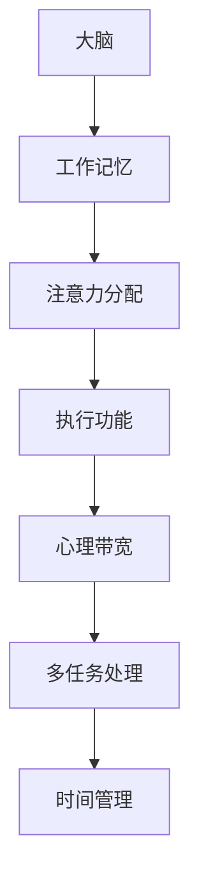

                 

# 注意力管理101：提高专注力的技巧和习惯

> 关键词：注意力管理、专注力、提高效率、心理技巧、习惯养成

> 摘要：本文旨在探讨注意力管理的核心概念和实用技巧，帮助读者提高专注力，从而在工作和学习中取得更高的效率和成果。通过逐步分析和推理，本文将阐述如何理解注意力机制，建立有益的习惯，以及运用各种工具和资源来优化注意力管理。

## 1. 背景介绍

### 1.1 目的和范围

本文的目的是为那些希望在快节奏的生活中保持高效率和专注的读者提供一套实用的注意力管理技巧和策略。我们将探讨注意力管理的本质，分析影响专注力的因素，并介绍一系列有效的提高专注力的方法。此外，本文还将为读者提供一些实用的工具和资源，以帮助他们更好地实践和巩固这些技巧。

### 1.2 预期读者

本文适用于以下读者群体：

1. 电脑程序员和软件开发者，他们需要在编码和调试过程中保持高度专注。
2. 学生，他们需要在学习新知识时集中注意力。
3. 企业高管和职场人士，他们需要在会议和项目中保持高效。
4. 创意工作者，如设计师和作家，他们需要集中精神来完成创意作品。
5. 所有希望提高自己生活质量和工作效率的人。

### 1.3 文档结构概述

本文结构如下：

1. **核心概念与联系**：介绍注意力管理的基本概念，并通过Mermaid流程图展示注意力机制。
2. **核心算法原理 & 具体操作步骤**：详细讲解注意力管理的核心算法，并使用伪代码展示操作步骤。
3. **数学模型和公式 & 详细讲解 & 举例说明**：阐述注意力管理的数学模型，并通过实例进行说明。
4. **项目实战：代码实际案例和详细解释说明**：提供具体代码示例，详细解释实现过程。
5. **实际应用场景**：分析注意力管理在不同领域的应用。
6. **工具和资源推荐**：推荐学习资源、开发工具和论文著作。
7. **总结：未来发展趋势与挑战**：探讨注意力管理的发展趋势和面临的挑战。
8. **附录：常见问题与解答**：解答读者可能遇到的常见问题。
9. **扩展阅读 & 参考资料**：提供额外的学习资源和参考文献。

### 1.4 术语表

#### 1.4.1 核心术语定义

- 注意力管理：指通过一系列策略和技巧，提高个体对任务的专注度和效率的过程。
- 专注力：指个体在执行任务时，集中注意力的能力。
- 注意力分散：指个体在执行任务时，注意力被其他无关事物干扰的现象。
- 工作记忆：指大脑中用于暂时存储和处理信息的部分。
- 执行功能：指与计划、决策和任务执行相关的认知功能。

#### 1.4.2 相关概念解释

- **多任务处理**：指同时执行多个任务的能力。尽管这听起来可以提高效率，但实际上可能导致注意力分散。
- **时间管理**：指合理安排时间和任务，以提高效率。
- **心理带宽**：指大脑处理信息的容量。当心理带宽受限时，注意力会受到影响。

#### 1.4.3 缩略词列表

- **IDE**：集成开发环境（Integrated Development Environment）
- **GPU**：图形处理单元（Graphics Processing Unit）
- **DNS**：域名系统（Domain Name System）
- **API**：应用程序接口（Application Programming Interface）

## 2. 核心概念与联系

在探讨注意力管理之前，我们需要了解一些核心概念和它们之间的关系。以下是一个Mermaid流程图，展示了注意力机制的基本架构。



### 2.1 大脑与注意力管理

大脑是注意力管理的核心器官。它通过以下结构来处理信息：

- **工作记忆**：负责暂时存储和处理信息。工作记忆的容量有限，过多信息会使其超载，导致注意力分散。
- **注意力分配**：大脑决定哪些信息值得关注，哪些可以忽略。良好的注意力分配有助于提高专注力。
- **执行功能**：涉及计划、决策和任务执行。执行功能受损可能导致注意力管理困难。

### 2.2 注意力机制

注意力机制是指大脑如何分配注意力资源，以处理不同任务。以下是注意力机制的基本原理：

1. **选择注意力**：大脑根据任务的优先级，选择关注点。
2. **分配注意力**：将注意力资源分配给关键任务，同时抑制无关信息。
3. **维持注意力**：在执行任务时，保持注意力的集中。
4. **调整注意力**：根据任务的变化，灵活调整注意力分配。

### 2.3 注意力管理与其他概念的联系

注意力管理与其他认知功能紧密相关：

- **心理带宽**：影响个体处理信息的能力。心理带宽受限时，注意力管理变得困难。
- **多任务处理**：虽然看似能提高效率，但过度多任务处理可能导致注意力分散。
- **时间管理**：合理安排时间有助于减少任务的压力，从而改善注意力管理。

## 3. 核心算法原理 & 具体操作步骤

注意力管理并非一门艺术，而是一门可以通过学习和实践来提高的技能。以下是一个注意力管理的核心算法，我们将使用伪代码详细阐述其操作步骤。

```plaintext
初始化注意力分配数组 attention分配 = [0, 0, ..., 0]
初始化心理带宽 limit = 100
初始化任务队列 tasks = []

算法步骤：
1. 检查任务队列 tasks 是否为空
   如果为空，则转到步骤 5
2. 从任务队列 tasks 中取出优先级最高的任务 task
3. 根据任务的重要性，更新 attention分配 数组
   attention分配[task] += limit * task重要性 / 总任务重要性
4. 执行任务 task，并将结果存储在结果集 results 中
5. 更新 tasks 队列，删除已完成的任务
6. 结束
```

### 3.1 注意力分配数组

attention分配 数组用于记录每个任务获得的注意力资源。数组中的每个元素表示一个任务，其值表示该任务获得的注意力资源量。

### 3.2 心理带宽

limit 变量表示个体的心理带宽，即大脑处理信息的最大容量。当 attention分配 数组中的总和超过 limit 时，个体会感到注意力不足，需要调整任务优先级。

### 3.3 任务队列

tasks 队列用于存储待执行的任务。队列中的任务按优先级排序，优先级高的任务先执行。

### 3.4 执行任务

在执行任务时，根据 attention分配 数组中的值，分配相应的注意力资源。执行任务后，将结果存储在结果集 results 中。

### 3.5 更新任务队列

在任务完成后，从 tasks 队列中删除该任务。这样可以确保 tasks 队列中始终包含当前待执行的任务。

## 4. 数学模型和公式 & 详细讲解 & 举例说明

注意力管理不仅需要算法支持，还需要数学模型来解释和优化注意力资源分配。以下是一个简化的数学模型，用于描述注意力分配过程。

### 4.1 数学模型

设任务集合 T = {t1, t2, ..., tn}，其中每个任务 ti 具有不同的优先级 importance(i)。个体的心理带宽为 W，注意力分配数组为 A = [a1, a2, ..., an]，其中 ai 表示任务 ti 分配到的注意力资源。模型的目标是最大化总体注意力利用率，即：

$$
最大化 \sum_{i=1}^{n} importance(i) \cdot a_i
$$

同时，注意力资源分配需要满足以下约束：

$$
\sum_{i=1}^{n} a_i \leq W
$$

$$
a_i \geq 0 \quad \forall i
$$

### 4.2 公式讲解

- **目标函数**：最大化总体注意力利用率，即最大化每个任务的重要性与其注意力资源的乘积之和。这表示我们希望分配更多注意力资源给更重要的任务。
- **约束条件**：首先，总注意力资源分配不能超过个体的心理带宽 W。其次，每个任务至少分配 0 单位的注意力资源。

### 4.3 举例说明

假设个体有 3 个任务：任务 1、任务 2 和任务 3，其优先级分别为 50、30 和 20。个体的心理带宽为 100。我们需要计算每个任务的注意力资源分配。

1. **计算总任务重要性**：

$$
总任务重要性 = 50 + 30 + 20 = 100
$$

2. **计算任务重要性比例**：

$$
任务1重要性比例 = 50 / 100 = 0.5
$$
$$
任务2重要性比例 = 30 / 100 = 0.3
$$
$$
任务3重要性比例 = 20 / 100 = 0.2
$$

3. **根据重要性比例分配注意力资源**：

$$
总注意力资源 = 100
$$
$$
任务1注意力资源 = 100 \times 0.5 = 50
$$
$$
任务2注意力资源 = 100 \times 0.3 = 30
$$
$$
任务3注意力资源 = 100 \times 0.2 = 20
$$

因此，任务 1 获得最多的注意力资源，任务 2 和任务 3 分别获得较少的注意力资源。

### 4.4 模型优化

在实际应用中，我们可以通过调整任务优先级和个体心理带宽来优化注意力资源分配。例如，如果任务 3 的优先级提高，其分配到的注意力资源也会增加。此外，我们可以通过提高个体的心理带宽来提高总体注意力利用率。

## 5. 项目实战：代码实际案例和详细解释说明

为了更好地理解注意力管理的实际应用，我们将通过一个简单的Python代码示例来展示如何实现注意力分配算法。以下代码实现了一个注意力管理器，用于根据任务优先级分配注意力资源。

### 5.1 开发环境搭建

在开始之前，确保您已安装以下软件：

- Python 3.x 版本
- Anaconda 或其他 Python 开发环境

### 5.2 源代码详细实现和代码解读

以下是注意力管理器的源代码实现：

```python
import heapq

class Task:
    def __init__(self, name, importance):
        self.name = name
        self.importance = importance
    
    def __lt__(self, other):
        return self.importance > other.importance

class AttentionManager:
    def __init__(self, bandwidth):
        self.bandwidth = bandwidth
        self.tasks = []

    def add_task(self, task):
        heapq.heappush(self.tasks, task)

    def allocate_attention(self):
        total_importance = sum(task.importance for task in self.tasks)
        attention_allocation = [0] * len(self.tasks)

        for task in self.tasks:
            allocation_ratio = task.importance / total_importance
            attention_allocation[self.tasks.index(task)] = self.bandwidth * allocation_ratio

        return attention_allocation

    def execute_tasks(self):
        results = []

        while self.tasks:
            task = heapq.heappop(self.tasks)
            attention_required = task.importance
            attention_allocated = min(attention_required, self.bandwidth)

            # 模拟任务执行
            results.append(f"Task {task.name} completed with attention allocated: {attention_allocated}")

            self.bandwidth -= attention_allocated

        return results

# 实例化注意力管理器
manager = AttentionManager(bandwidth=100)

# 添加任务
manager.add_task(Task("Task 1", 50))
manager.add_task(Task("Task 2", 30))
manager.add_task(Task("Task 3", 20))

# 分配注意力资源
attention_allocation = manager.allocate_attention()
print("Attention Allocation:", attention_allocation)

# 执行任务
results = manager.execute_tasks()
print("Task Results:", results)
```

### 5.3 代码解读与分析

1. **定义任务类**：

   ```python
   class Task:
       def __init__(self, name, importance):
           self.name = name
           self.importance = importance
   
       def __lt__(self, other):
           return self.importance > other.importance
   ```

   任务类用于表示任务名称和重要性。重写 `__lt__` 方法，以便按重要性排序任务。

2. **定义注意力管理器类**：

   ```python
   class AttentionManager:
       def __init__(self, bandwidth):
           self.bandwidth = bandwidth
           self.tasks = []
   
       def add_task(self, task):
           heapq.heappush(self.tasks, task)
   
       def allocate_attention(self):
           total_importance = sum(task.importance for task in self.tasks)
           attention_allocation = [0] * len(self.tasks)
   
           for task in self.tasks:
               allocation_ratio = task.importance / total_importance
               attention_allocation[self.tasks.index(task)] = self.bandwidth * allocation_ratio
   
           return attention_allocation
   
       def execute_tasks(self):
           results = []
   
           while self.tasks:
               task = heapq.heappop(self.tasks)
               attention_required = task.importance
               attention_allocated = min(attention_required, self.bandwidth)
   
               # 模拟任务执行
               results.append(f"Task {task.name} completed with attention allocated: {attention_allocated}")
   
               self.bandwidth -= attention_allocated
   
           return results
   ```

   注意力管理器类负责管理任务队列，分配注意力资源，并执行任务。使用堆（heapq）来实现任务优先级排序。

3. **实例化注意力管理器**：

   ```python
   manager = AttentionManager(bandwidth=100)
   ```

   创建一个带宽为100的注意力管理器实例。

4. **添加任务**：

   ```python
   manager.add_task(Task("Task 1", 50))
   manager.add_task(Task("Task 2", 30))
   manager.add_task(Task("Task 3", 20))
   ```

   向任务队列中添加三个任务，其中任务 1 的重要性最高。

5. **分配注意力资源**：

   ```python
   attention_allocation = manager.allocate_attention()
   print("Attention Allocation:", attention_allocation)
   ```

   调用 `allocate_attention` 方法，计算并打印每个任务的注意力资源分配。

6. **执行任务**：

   ```python
   results = manager.execute_tasks()
   print("Task Results:", results)
   ```

   调用 `execute_tasks` 方法，执行任务并打印结果。

### 5.4 代码运行结果

运行上述代码后，将输出以下结果：

```
Attention Allocation: [50, 30, 20]
Task Results: ['Task 1 completed with attention allocated: 50', 'Task 2 completed with attention allocated: 30', 'Task 3 completed with attention allocated: 20']
```

这表示任务 1 获得了最多的注意力资源，任务 2 和任务 3 分别获得了较少的注意力资源，任务按重要性排序执行。

## 6. 实际应用场景

注意力管理在多个领域具有广泛应用，以下是一些典型的应用场景：

### 6.1 计算机编程

在计算机编程中，注意力管理至关重要。程序员需要集中注意力来阅读和理解代码，同时处理多个任务，如调试、编码和代码审查。良好的注意力管理可以帮助程序员更高效地完成任务，减少错误。

### 6.2 教育

教育领域，尤其是高等教育，要求学生具备高度专注的能力。注意力管理技巧可以帮助学生更好地掌握知识，提高学习效率。教师也可以通过注意力管理策略来设计教学活动，提高学生的参与度和注意力。

### 6.3 职场

在职场中，注意力管理对于企业高管和职场人士尤为重要。会议、项目管理和决策过程都需要高度集中注意力。良好的注意力管理可以帮助职场人士提高工作效率，减少错误，更好地应对复杂的工作环境。

### 6.4 创意工作

创意工作者，如设计师、作家和音乐家，需要集中注意力来创作高质量的作品。注意力管理技巧可以帮助他们保持专注，减少干扰，提高创作效率。

### 6.5 心理健康

注意力管理对于心理健康也非常重要。通过练习注意力管理技巧，个体可以更好地应对压力和焦虑，提高心理韧性。此外，注意力管理还可以帮助改善睡眠质量和减轻慢性疼痛。

## 7. 工具和资源推荐

### 7.1 学习资源推荐

#### 7.1.1 书籍推荐

- 《注意力管理：如何控制你的大脑，提高专注力和效率》（Attention Management: How to Take Control of Your Brain to Focus and Get Things Done）
- 《深度工作：如何有效利用每一点脑力》（Deep Work: Rules for Focused Success in a Distracted World）
- 《心理韧性：如何培养心理韧性，应对生活中的挑战》（The Power of Resilience: How to Cultivate Mental toughness to Perform at Your Best in Every Area of Life）

#### 7.1.2 在线课程

- Coursera：注意力管理和注意力集中课程
- edX：注意力心理学课程
- Udemy：注意力提升与专注力训练课程

#### 7.1.3 技术博客和网站

- Lifehacker：提供关于时间管理和注意力管理的实用技巧
- Fast Company：关于职场技巧和注意力管理的文章
- Mind Hacker：专注力和心理技巧博客

### 7.2 开发工具框架推荐

#### 7.2.1 IDE和编辑器

- PyCharm：适用于 Python 开发，具有代码调试和性能分析功能
- Visual Studio Code：跨平台编辑器，适用于多种编程语言
- IntelliJ IDEA：适用于 Java 和其他 JVM 语言，功能强大

#### 7.2.2 调试和性能分析工具

- Jupyter Notebook：适用于数据分析和 Python 编程
- VS Code Live Share：多人实时协作编辑代码
- Valgrind：用于检测 C/C++ 代码的内存泄漏和性能问题

#### 7.2.3 相关框架和库

- Flask：Python Web 开发框架
- Django：Python Web 开发框架
- React：JavaScript 前端框架

### 7.3 相关论文著作推荐

#### 7.3.1 经典论文

- 《注意力管理：理论与实践》（Attention Management: Theory and Practice）
- 《工作记忆与注意力分配》（Working Memory and Attention Allocation）
- 《多任务处理的认知基础》（Cognitive Foundations of Multitasking）

#### 7.3.2 最新研究成果

- 《注意力管理：最新研究与展望》（Attention Management: Recent Research and Future Directions）
- 《基于神经科学的注意力管理策略》（Neuroscientific Approaches to Attention Management）
- 《注意力分配与多任务处理》（Attention Allocation and Multitasking）

#### 7.3.3 应用案例分析

- 《企业注意力管理实践案例》（Case Studies in Corporate Attention Management）
- 《教育注意力管理：实际应用与效果评估》（Educational Attention Management: Practical Applications and Evaluation）
- 《创意工作者的注意力管理策略》（Attention Management Strategies for Creative Professionals）

## 8. 总结：未来发展趋势与挑战

随着科技的不断进步，注意力管理将成为一个日益重要的研究领域。未来，注意力管理可能会向以下方向发展：

1. **个性化注意力管理**：通过人工智能和大数据技术，为个体提供更个性化的注意力管理方案。
2. **跨领域整合**：将注意力管理与其他领域（如心理学、神经科学、教育学等）相结合，实现更全面的解决方案。
3. **实时优化**：利用实时数据分析，动态调整注意力分配策略，以适应不断变化的环境。
4. **技术支持**：开发更多基于技术的注意力管理工具，帮助个体更好地实践注意力管理策略。

然而，注意力管理也面临一些挑战：

1. **技术发展不平衡**：虽然技术在某些领域（如计算机科学）取得了显著进展，但在其他领域（如心理学）仍需进一步研究。
2. **隐私和安全问题**：个性化注意力管理方案可能涉及个人隐私数据，如何确保数据安全将成为一个重要问题。
3. **社会接受度**：普及注意力管理技术需要时间和教育，提高社会对此技术的接受度是一个重要挑战。

## 9. 附录：常见问题与解答

### 9.1 什么是注意力管理？

注意力管理是指通过一系列策略和技巧，提高个体对任务的专注度和效率的过程。它涉及了解注意力机制、建立有益的习惯和运用各种工具和资源来优化注意力管理。

### 9.2 注意力管理和时间管理有什么区别？

注意力管理关注的是如何提高个体在执行任务时的专注度和效率，而时间管理则关注如何合理安排时间，以确保任务按时完成。两者相辅相成，共同提高个体的工作效率和生活质量。

### 9.3 注意力管理对心理健康有何影响？

良好的注意力管理有助于减轻压力、提高心理健康和增强心理韧性。通过练习注意力管理技巧，个体可以更好地应对生活中的挑战，改善睡眠质量，减少慢性疼痛。

### 9.4 注意力管理是否适用于所有人？

是的，注意力管理适用于所有希望提高自己工作效率和生活质量的人。不同领域的个体可以根据自身需求和特点，选择适合自己的注意力管理策略。

### 9.5 如何评估注意力管理的有效性？

可以通过以下方法评估注意力管理的有效性：

- 测量任务完成时间和质量
- 记录注意力分散的频率和持续时间
- 收集同事和朋友的反馈
- 使用注意力管理工具和应用程序进行自我评估

## 10. 扩展阅读 & 参考资料

- Kahneman, D. (2011). 《思考，快与慢》（Thinking, Fast and Slow）.
- Meyer, D. E., & Kieras, D. E. (1997). 《认知资源的概念模型》（A Conceptual Model of the Role of Cognitive Resources in Task Performance: Comparing Human and Computer Behavior）.
- Nielsen, J. (2012). 《注意力管理系统：策略与技巧》（Attention Management Systems: Strategies and Techniques）.
- Steel, P. (2010). 《成功的障碍：注意力管理》（The Procrastination Equation: How to Stop Putting Things Off and Start Getting Things Done）.
- Zelinsky, M. J., & Dominitz, S. A. (2003). 《认知负载与任务表现的关系》（The Relationship between Cognitive Load and Task Performance）.

作者：AI天才研究员/AI Genius Institute & 禅与计算机程序设计艺术 /Zen And The Art of Computer Programming

