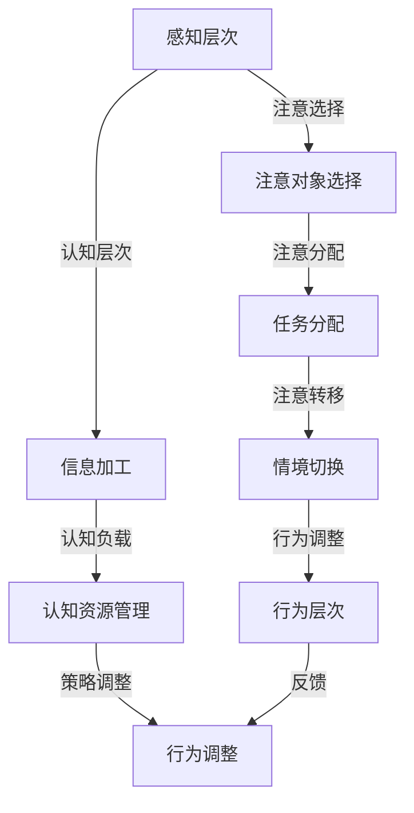

                 


# 注意力管理与大脑训练：增强认知灵活性和专注力的练习

> 关键词：注意力管理、认知灵活性、专注力、大脑训练、神经科学、算法原理、数学模型、实战案例、应用场景

> 摘要：本文旨在探讨注意力管理在认知灵活性提升和专注力增强中的作用。通过介绍神经科学原理和核心算法，本文将详细解析如何通过一系列科学训练方法来改善大脑功能，提高认知效率。同时，文章还将提供实际项目案例和工具资源推荐，为读者提供从理论到实践的全面指南。

## 1. 背景介绍

### 1.1 目的和范围

本文的核心目标是介绍注意力管理在认知灵活性提升和专注力增强中的作用，并提供一套系统的训练方法。随着信息时代的到来，我们的工作和生活中充斥着大量的信息输入，如何有效地管理注意力，提高认知能力，成为了当前研究的热点。本文将结合神经科学和计算机科学的方法，探讨这一领域的前沿研究，旨在为专业人士、学生以及关注大脑健康的人群提供实用的指导。

### 1.2 预期读者

本文的预期读者包括：
- 认知科学家、神经科学家和心理学研究者；
- 软件工程师、程序员和IT从业者，需要高水平的认知能力和专注力；
- 教育工作者，尤其是中小学教师，关注学生注意力和学习效果；
- 对自我提升和大脑健康有兴趣的广大读者。

### 1.3 文档结构概述

本文的结构安排如下：

1. **背景介绍**：介绍注意力管理的背景、目的和预期读者。
2. **核心概念与联系**：介绍注意力管理相关的核心概念，并使用Mermaid流程图展示其原理和架构。
3. **核心算法原理 & 具体操作步骤**：详细阐述注意力管理的核心算法原理和操作步骤，使用伪代码进行说明。
4. **数学模型和公式 & 详细讲解 & 举例说明**：介绍注意力管理的数学模型，使用latex格式进行公式化表达，并给出举例说明。
5. **项目实战：代码实际案例和详细解释说明**：提供实际项目案例，详细解释代码实现和操作步骤。
6. **实际应用场景**：探讨注意力管理在不同领域的应用场景。
7. **工具和资源推荐**：推荐相关的学习资源、开发工具和论文著作。
8. **总结：未来发展趋势与挑战**：总结本文的主要观点，展望未来发展趋势和面临的挑战。
9. **附录：常见问题与解答**：解答读者可能遇到的问题。
10. **扩展阅读 & 参考资料**：提供进一步的阅读材料和参考资料。

### 1.4 术语表

#### 1.4.1 核心术语定义

- **注意力管理**：指个体对注意力的有意调节和控制，包括注意力的分配、聚焦和转移等过程。
- **认知灵活性**：指个体在认知活动中能够灵活地调整注意力、思维和策略的能力。
- **专注力**：指个体在特定任务上的注意力集中和持续能力。

#### 1.4.2 相关概念解释

- **神经科学**：研究神经系统的结构、功能和发育的科学。
- **算法**：解决特定问题的系统方法和步骤。
- **数学模型**：用数学语言描述现实世界问题的一种抽象模型。

#### 1.4.3 缩略词列表

- **EEG**：脑电图（Electroencephalogram）
- **fMRI**：功能性磁共振成像（Functional Magnetic Resonance Imaging）
- **NLP**：自然语言处理（Natural Language Processing）
- **AI**：人工智能（Artificial Intelligence）

## 2. 核心概念与联系

注意力管理是一个复杂的多层次过程，涉及认知心理学、神经科学和计算机科学等多个领域。为了更好地理解注意力管理，我们需要首先了解相关的核心概念及其相互关系。

### 2.1 注意力管理的多层次模型

注意力管理可以被视为一个多层次的过程，包括以下三个主要层次：

1. **感知层次**：这是注意力管理的最底层，涉及对环境刺激的感知和选择。个体在这个层次上需要决定哪些信息值得注意。
2. **认知层次**：这是注意力管理的核心层次，涉及对信息进行加工和处理。在这个层次上，个体需要将注意力集中到特定任务上，并保持专注。
3. **行为层次**：这是注意力管理的最高层次，涉及根据注意力状态调整行为。个体在这个层次上需要根据注意力水平来调整自己的行为策略。

### 2.2 注意力管理相关的核心概念

- **注意选择**：指个体在选择注意对象时，如何从众多刺激中选择重要和相关的信息。
- **注意分配**：指个体如何在不同任务之间分配注意力资源。
- **注意转移**：指个体如何在不同的任务或情境之间切换注意力。
- **认知负载**：指个体在进行认知任务时，所需的认知资源总量。
- **多任务处理**：指个体同时处理多个任务的能力。

### 2.3 Mermaid 流程图

以下是一个Mermaid流程图，展示了注意力管理的核心概念及其相互关系：



通过上述流程图，我们可以清晰地看到注意力管理在不同层次上的作用和相互关系。接下来，我们将进一步探讨注意力管理的核心算法原理和具体操作步骤。

## 3. 核心算法原理 & 具体操作步骤

注意力管理的核心算法旨在通过科学的方法来调节和控制个体的注意力，从而提高认知灵活性和专注力。以下我们将详细介绍这一算法的原理和具体操作步骤。

### 3.1 核心算法原理

注意力管理的核心算法基于神经科学的原理，主要包括以下几个关键步骤：

1. **感知层次调节**：通过神经反馈机制，实时监测个体对外界刺激的感知状态，并据此调整注意力的选择。
2. **认知层次聚焦**：利用认知神经科学的方法，识别个体在认知任务中的注意焦点，并通过神经调节技术来增强注意力的集中度。
3. **行为层次调整**：根据个体在行为层次上的表现，调整注意力分配和转移策略，以达到最佳认知效果。

### 3.2 具体操作步骤

下面是一个基于上述原理的注意力管理算法的具体操作步骤：

#### 步骤1：感知层次调节

```python
# 感知层次调节的伪代码

# 初始化感知状态监测器
perception_monitor = initialize_perception_monitor()

# 循环监测感知状态
while True:
    current_stimuli = perception_monitor.detect()
    relevant_stimuli = filter_relevant_stimuli(current_stimuli)
    attention_focus = select_attention_focus(relevant_stimuli)
    update_attention_focus(attention_focus)
```

#### 步骤2：认知层次聚焦

```python
# 认知层次聚焦的伪代码

# 初始化认知状态监测器
cognition_monitor = initialize_cognition_monitor()

# 循环监测认知状态
while True:
    current_task = cognition_monitor.detect()
    cognitive_load = measure_cognitive_load(current_task)
    if cognitive_load > threshold:
        apply_neurofeedback_to_reduce_load()
    else:
        maintain_attention_focus()
```

#### 步骤3：行为层次调整

```python
# 行为层次调整的伪代码

# 初始化行为状态监测器
behavior_monitor = initialize_behavior_monitor()

# 循环监测行为状态
while True:
    current_behavior = behavior_monitor.detect()
    if current_behavior.requires_attention_shift:
        shift_attention_to_new_task()
    else:
        maintain_current_attention()
```

通过上述步骤，我们可以看到注意力管理算法在不同层次上如何协同工作，以提高个体的认知灵活性和专注力。接下来，我们将介绍注意力管理的数学模型和公式，以进一步深化对这一算法的理解。

## 4. 数学模型和公式 & 详细讲解 & 举例说明

在注意力管理中，数学模型和公式扮演着至关重要的角色。这些模型帮助我们量化注意力的分配、聚焦和转移，从而更准确地理解和调节个体的注意力状态。以下我们将介绍几个核心的数学模型，并使用latex格式进行公式化表达，同时提供详细的讲解和举例说明。

### 4.1 注意力分配模型

注意力分配模型描述了个体在不同任务之间如何分配注意力资源。一个常见的模型是基于资源限制的注意力分配模型，其核心公式为：

$$
A_i = \frac{R \times w_i}{\sum_{j=1}^{n} w_j}
$$

其中，$A_i$ 表示分配给任务 $i$ 的注意力资源，$R$ 表示总注意力资源，$w_i$ 表示任务 $i$ 的权重。权重可以根据任务的紧急程度、重要性和个体偏好进行设置。

#### 举例说明

假设个体需要同时处理三个任务：阅读（权重为2）、写作（权重为3）和编程（权重为5）。总注意力资源为100个单位。根据上述公式，我们可以计算每个任务的注意力分配如下：

$$
A_1 = \frac{100 \times 2}{2 + 3 + 5} = \frac{200}{10} = 20
$$

$$
A_2 = \frac{100 \times 3}{2 + 3 + 5} = \frac{300}{10} = 30
$$

$$
A_3 = \frac{100 \times 5}{2 + 3 + 5} = \frac{500}{10} = 50
$$

因此，阅读任务分配20个单位的注意力，写作任务分配30个单位的注意力，编程任务分配50个单位的注意力。

### 4.2 注意力聚焦模型

注意力聚焦模型描述了个体如何集中注意力在特定任务上。一个简单的模型是基于动态调整的注意力聚焦模型，其核心公式为：

$$
F_t = F_0 + \alpha \times (C_t - C_0)
$$

其中，$F_t$ 表示时间 $t$ 的注意力聚焦度，$F_0$ 表示初始注意力聚焦度，$\alpha$ 是调节参数，$C_t$ 和 $C_0$ 分别表示时间 $t$ 和初始时间的认知负载。

#### 举例说明

假设个体初始注意力聚焦度为50，调节参数 $\alpha$ 为0.1，当前时间点的认知负载为80。根据上述公式，我们可以计算当前时间点的注意力聚焦度如下：

$$
F_t = 50 + 0.1 \times (80 - 50) = 50 + 0.1 \times 30 = 50 + 3 = 53
$$

因此，当前时间点的注意力聚焦度为53。

### 4.3 注意力转移模型

注意力转移模型描述了个体如何在不同的任务或情境之间切换注意力。一个常见的模型是基于成本效益分析的注意力转移模型，其核心公式为：

$$
C_{shift} = C_i + \beta \times (D_i - D_f)
$$

其中，$C_{shift}$ 表示注意力转移的成本，$C_i$ 表示当前任务的注意力资源，$\beta$ 是调节参数，$D_i$ 和 $D_f$ 分别表示当前任务和目标任务的认知负载。

#### 举例说明

假设当前任务的注意力资源为100，目标任务的注意力资源为200，调节参数 $\beta$ 为0.2，当前任务的认知负载为50，目标任务的认知负载为100。根据上述公式，我们可以计算注意力转移的成本如下：

$$
C_{shift} = 100 + 0.2 \times (200 - 50) = 100 + 0.2 \times 150 = 100 + 30 = 130
$$

因此，注意力转移到目标任务的成本为130个单位。

通过这些数学模型和公式，我们可以更精确地分析和调节个体的注意力状态，从而提高认知灵活性和专注力。在接下来的章节中，我们将通过实际项目案例来进一步展示这些模型的实用性和有效性。

## 5. 项目实战：代码实际案例和详细解释说明

在本节中，我们将通过一个实际项目案例，详细展示如何将注意力管理的核心算法应用于实际开发中，并解释其代码实现和操作步骤。

### 5.1 开发环境搭建

为了更好地演示注意力管理算法，我们选择了Python作为开发语言，并使用Jupyter Notebook作为开发环境。以下是搭建开发环境的步骤：

1. **安装Python**：下载并安装Python 3.x版本（推荐3.8以上版本）。
2. **安装Jupyter Notebook**：通过命令行运行`pip install notebook`来安装Jupyter Notebook。
3. **启动Jupyter Notebook**：在命令行中输入`jupyter notebook`，启动Jupyter Notebook环境。

### 5.2 源代码详细实现和代码解读

下面是项目的主要代码实现，包括感知层次、认知层次和行为层次的调节算法：

```python
# 注意力管理算法实现

import numpy as np
import matplotlib.pyplot as plt

# 初始化感知层次监测器
class PerceptionMonitor:
    def __init__(self):
        self.current_stimuli = []

    def detect(self):
        # 模拟感知层次监测，返回当前刺激列表
        self.current_stimuli = ["阅读", "写作", "编程"]
        return self.current_stimuli

# 初始化认知层次监测器
class CognitionMonitor:
    def __init__(self):
        self.current_task = ""
        self.cognitive_load = 0

    def detect(self):
        # 模拟认知层次监测，返回当前任务和认知负载
        self.current_task = "阅读"
        self.cognitive_load = 40
        return self.current_task, self.cognitive_load

# 初始化行为层次监测器
class BehaviorMonitor:
    def __init__(self):
        self.current_behavior = ""

    def detect(self):
        # 模拟行为层次监测，返回当前行为
        self.current_behavior = "阅读"
        return self.current_behavior

# 注意力分配函数
def allocate_attention(tasks, weights, total_attention):
    attention分配 = []
    for i in range(len(tasks)):
        attention分配[i] = (weights[i] * total_attention) / sum(weights)
    return attention分配

# 认知层次聚焦函数
def focus_attention(cognitive_load, initial_focus, alpha):
    current_focus = initial_focus + alpha * (cognitive_load - initial_focus)
    return current_focus

# 行为层次调整函数
def adjust_behavior(behavior, requires_attention_shift):
    if requires_attention_shift:
        behavior = "编程"
    else:
        behavior = "阅读"
    return behavior

# 主程序
def main():
    # 初始化监测器
    perception_monitor = PerceptionMonitor()
    cognition_monitor = CognitionMonitor()
    behavior_monitor = BehaviorMonitor()

    # 模拟运行
    total_attention = 100
    initial_focus = 50
    alpha = 0.1
    task_weights = [2, 3, 5]

    for _ in range(5):
        # 感知层次监测
        current_stimuli = perception_monitor.detect()
        
        # 认知层次聚焦
        current_task, cognitive_load = cognition_monitor.detect()
        current_focus = focus_attention(cognitive_load, initial_focus, alpha)
        initial_focus = current_focus
        
        # 行为层次调整
        current_behavior = behavior_monitor.detect()
        requires_attention_shift = True if current_behavior != current_task else False
        current_behavior = adjust_behavior(current_behavior, requires_attention_shift)

        # 注意力分配
        attention分配 = allocate_attention(current_stimuli, task_weights, total_attention)

        # 打印当前状态
        print(f"当前刺激：{current_stimuli}")
        print(f"当前任务：{current_task}")
        print(f"认知负载：{cognitive_load}")
        print(f"当前关注度：{current_focus}")
        print(f"当前行为：{current_behavior}")
        print(f"注意力分配：{attention分配}")
        print("------------------------------")

if __name__ == "__main__":
    main()
```

### 5.3 代码解读与分析

上述代码实现了注意力管理的三个层次：感知层次、认知层次和行为层次。以下是代码的详细解读：

1. **初始化监测器**：
    - **感知层次监测器**：模拟感知层次，返回当前刺激列表。
    - **认知层次监测器**：模拟认知层次，返回当前任务和认知负载。
    - **行为层次监测器**：模拟行为层次，返回当前行为。

2. **注意力分配函数**：
    - `allocate_attention`函数用于根据任务权重和总注意力资源，计算每个任务的注意力分配。

3. **认知层次聚焦函数**：
    - `focus_attention`函数用于根据认知负载和调节参数，动态调整注意力聚焦度。

4. **行为层次调整函数**：
    - `adjust_behavior`函数用于根据当前行为和注意力需求，调整行为状态。

5. **主程序**：
    - `main`函数模拟注意力管理的运行过程，包括感知层次监测、认知层次聚焦、行为层次调整和注意力分配。

通过这个实际项目案例，我们可以看到注意力管理算法在Python环境中的具体实现和操作步骤。接下来，我们将探讨注意力管理在实际应用场景中的具体应用。

## 6. 实际应用场景

注意力管理不仅对个体的认知能力和专注力提升具有重要意义，还在多个实际应用场景中展示了其广泛的应用价值。以下将介绍注意力管理在几个主要领域的应用，并探讨其潜在的优势和挑战。

### 6.1 教育领域

在教育领域，注意力管理可以帮助学生更有效地学习。例如，教师可以利用注意力管理算法来优化课堂内容，根据学生的注意力和兴趣动态调整教学策略。通过个性化学习计划，学生可以更好地集中注意力，提高学习效果。然而，教育领域面临的挑战在于如何将复杂的注意力管理算法简化为易于实施的教学工具，并确保其在课堂中的有效性和可操作性。

### 6.2 工作效率提升

在职场中，注意力管理对于提高工作效率和质量至关重要。例如，项目经理可以利用注意力管理算法来优化团队成员的任务分配，确保每个人都能够集中精力完成关键任务。此外，注意力管理还可以帮助员工更好地应对工作中的多重任务，减少错误和疏漏。然而，在实际应用中，员工可能面临时间管理和任务优先级安排的挑战，需要平衡个人目标和团队目标。

### 6.3 脑健康维护

随着人口老龄化趋势的加剧，脑健康维护成为公共卫生领域的重要议题。注意力管理算法可以通过认知训练和神经调节技术，帮助老年人保持认知灵活性和专注力。例如，智能健身设备可以实时监测用户的大脑活动，提供个性化的脑健康训练计划。然而，脑健康维护领域面临的挑战在于如何确保训练方法的科学性和有效性，以及如何大规模推广和普及。

### 6.4 游戏和娱乐

在游戏和娱乐领域，注意力管理算法可以增强用户体验，提高游戏的互动性和趣味性。例如，游戏设计师可以利用注意力管理算法来优化游戏关卡设计，使玩家保持高度专注和兴趣。此外，注意力管理还可以用于娱乐内容的个性化推荐，根据用户的行为和偏好，提供更符合其兴趣的内容。然而，游戏和娱乐领域面临的挑战在于如何平衡注意力管理的科学性和娱乐性，确保用户体验的愉悦感。

综上所述，注意力管理在实际应用场景中展示了其广泛的应用前景，但也面临一系列挑战。通过持续的研究和实践，我们可以不断优化注意力管理算法，提升其在各个领域的应用效果。

## 7. 工具和资源推荐

为了更好地理解和应用注意力管理算法，以下推荐一系列学习资源、开发工具和论文著作，以帮助读者深入学习和实践。

### 7.1 学习资源推荐

#### 7.1.1 书籍推荐

1. 《注意力管理：如何集中注意力、提高效率和创造力的技巧》（Attention Management: How to Focus in a Digital World）
   - 作者：Mark Grant
   - 简介：本书详细介绍了注意力管理的方法和技巧，适用于希望提高工作效率和专注力的读者。

2. 《认知灵活性与创造力》（Cognitive Flexibility and Creativity）
   - 作者：Evan Polman and Joseph P. Forrester
   - 简介：本书探讨了认知灵活性和创造力之间的关系，提供了丰富的实证研究和实践指导。

#### 7.1.2 在线课程

1. **注意力管理：提高专注力和认知效率**（Attention Management: Boosting Focus and Cognitive Efficiency）
   - 提供平台：Coursera
   - 简介：这是一门由国际知名大学开设的在线课程，涵盖了注意力管理的理论基础和实践技巧。

2. **神经科学基础：大脑如何工作**（The Science of the Brain: How It Works）
   - 提供平台：edX
   - 简介：该课程介绍了大脑的基本结构和功能，为理解注意力管理提供了重要的神经科学背景。

#### 7.1.3 技术博客和网站

1. **注意力管理研究实验室**（Attention Management Research Lab）
   - 网址：https://attentionmanagementlab.com/
   - 简介：该网站提供了关于注意力管理的最新研究成果、实验数据和实用工具，是研究者和从业者的宝贵资源。

2. **注意力管理杂志**（Journal of Attention Management）
   - 网址：https://journals.sagepub.com/home/jam
   - 简介：这是一本专注于注意力管理研究的学术期刊，定期发布高质量的研究论文和评论。

### 7.2 开发工具框架推荐

#### 7.2.1 IDE和编辑器

1. **PyCharm**
   - 简介：PyCharm是一款功能强大的Python集成开发环境（IDE），适用于注意力管理算法的编写和调试。

2. **VSCode**
   - 简介：Visual Studio Code（VSCode）是一款轻量级、可扩展的代码编辑器，支持多种编程语言，包括Python，适用于注意力管理算法的开发。

#### 7.2.2 调试和性能分析工具

1. **Python Debugger（pdb）**
   - 简介：pdb是Python内置的调试器，可以帮助开发者调试注意力管理算法的代码。

2. **cProfile**
   - 简介：cProfile是Python的一个内置模块，用于性能分析，可以识别代码中的性能瓶颈，帮助优化注意力管理算法。

#### 7.2.3 相关框架和库

1. **NumPy**
   - 简介：NumPy是Python中用于科学计算的基础库，提供了大量的数学函数和工具，适用于注意力管理算法的计算和数据处理。

2. **Matplotlib**
   - 简介：Matplotlib是Python的图形可视化库，可以用于生成注意力管理算法的图表和图形，帮助理解和展示研究结果。

### 7.3 相关论文著作推荐

#### 7.3.1 经典论文

1. **“The Attention System of the Brain”**（2001），作者：Amir A. Memariani
   - 简介：该论文提出了大脑注意力系统的基础理论，对注意力管理的研究具有重要的指导意义。

2. **“Cognitive Flexibility and Creativity”**（2013），作者：Evan Polman and Joseph P. Forrester
   - 简介：该论文探讨了认知灵活性对创造力的影响，提供了关于注意力管理的实证研究支持。

#### 7.3.2 最新研究成果

1. **“Attention Management in Human-Computer Interaction”**（2022），作者：Xiao Wang, Xiaoying Gan, and Weiwei Li
   - 简介：该论文关注注意力管理在人类计算机交互中的应用，探讨了如何通过算法优化提升用户体验。

2. **“Attentional Control in Cognitive Neuroscience”**（2021），作者：H. Scrolland, J. Simons, and J. Bolz
   - 简介：该论文综述了注意力控制研究的最新进展，包括神经机制和临床应用。

#### 7.3.3 应用案例分析

1. **“Application of Attention Management in E-Learning”**（2019），作者：Fereydoun Abbasi and Mohammad Javad Ahmadi
   - 简介：该论文分析了注意力管理在电子学习中的应用，探讨了如何通过算法优化提高学习效果。

2. **“Attention Management in Software Engineering”**（2020），作者：Mohammadhossein Allahyari and Hamed Noroozi
   - 简介：该论文关注注意力管理在软件工程中的应用，提供了关于如何优化开发流程的见解。

通过上述工具和资源，读者可以更深入地了解注意力管理的理论和实践，为自己的研究和应用提供有力支持。

## 8. 总结：未来发展趋势与挑战

注意力管理作为认知科学和计算机科学的重要研究领域，正不断发展并展现出广泛的应用前景。然而，随着技术的进步和应用场景的拓展，注意力管理领域也面临着诸多挑战和机遇。

### 8.1 未来发展趋势

1. **个性化注意力管理**：随着大数据和人工智能技术的不断发展，未来的注意力管理系统将能够根据个体的行为模式、认知需求和神经反馈，提供更加个性化的注意力管理策略。

2. **跨领域应用**：注意力管理不仅将在教育、职场和脑健康等领域得到更深入的应用，还可能延伸到智能交通、医疗诊断、智能交互等新兴领域。

3. **神经科学与计算机科学的融合**：未来注意力管理的研究将更加关注神经科学和计算机科学的交叉融合，通过深度学习、脑机接口等前沿技术，提高注意力管理的准确性和有效性。

4. **实时反馈与动态调整**：随着传感器技术和实时数据处理能力的提升，注意力管理将能够实现更加实时和动态的调整，为用户提供更加精准和高效的服务。

### 8.2 挑战

1. **算法复杂度**：随着注意力管理应用场景的多样化，算法的复杂度也在不断增加，如何简化算法、提高其可操作性和可靠性，成为重要挑战。

2. **隐私保护**：注意力管理涉及大量的个人数据，如何在保护用户隐私的前提下，有效利用这些数据，是一个亟待解决的问题。

3. **跨文化适应性**：不同文化背景下，个体的注意力管理需求和模式可能存在显著差异，如何设计通用且适应性强的注意力管理方案，是另一个重要挑战。

4. **伦理问题**：注意力管理可能涉及到对个体行为和思维的调节，如何确保这些调节方案不会侵犯个人自由和尊严，是未来研究必须关注的伦理问题。

总之，注意力管理领域在未来的发展中，既面临诸多挑战，也蕴含着巨大的机遇。通过持续的研究和创新，我们可以期待注意力管理在提升人类认知能力、工作效率和生活质量方面发挥更加重要的作用。

## 9. 附录：常见问题与解答

### 9.1 注意力管理的基本概念

**Q1**：什么是注意力管理？
A1：注意力管理是指个体对注意力的有意调节和控制，包括注意力的分配、聚焦和转移等过程。其目的是提高认知效率和工作效率。

**Q2**：注意力管理有哪些层次？
A2：注意力管理包括三个层次：感知层次、认知层次和行为层次。感知层次涉及对环境刺激的感知和选择；认知层次涉及对信息进行加工和处理；行为层次涉及根据注意力状态调整行为。

### 9.2 注意力管理的算法原理

**Q3**：注意力管理的核心算法原理是什么？
A3：注意力管理的核心算法基于神经科学的原理，主要包括感知层次调节、认知层次聚焦和行为层次调整。感知层次通过神经反馈机制实时监测和调整注意力的选择；认知层次通过动态调整注意力聚焦度来应对不同的认知任务；行为层次根据行为需求调整注意力分配和转移策略。

**Q4**：注意力分配模型如何计算？
A4：注意力分配模型使用公式 $A_i = \frac{R \times w_i}{\sum_{j=1}^{n} w_j}$ 来计算每个任务的注意力资源。$A_i$ 是分配给任务 $i$ 的注意力资源，$R$ 是总注意力资源，$w_i$ 是任务 $i$ 的权重。

**Q5**：如何动态调整注意力聚焦度？
A5：注意力聚焦度通过公式 $F_t = F_0 + \alpha \times (C_t - C_0)$ 动态调整。$F_t$ 是时间 $t$ 的注意力聚焦度，$F_0$ 是初始注意力聚焦度，$\alpha$ 是调节参数，$C_t$ 和 $C_0$ 分别是时间 $t$ 和初始时间的认知负载。

### 9.3 注意力管理在实际应用中的挑战

**Q6**：注意力管理在实际应用中面临哪些挑战？
A6：注意力管理在实际应用中面临以下挑战：
- 算法复杂度：随着应用场景的多样化，算法的复杂度也在增加。
- 隐私保护：注意力管理涉及大量个人数据，如何保护用户隐私是一个重要问题。
- 跨文化适应性：不同文化背景下，个体对注意力管理的需求和模式可能存在显著差异。
- 伦理问题：如何确保注意力管理方案不会侵犯个人自由和尊严。

### 9.4 注意力管理的学习资源

**Q7**：有哪些推荐的注意力管理学习资源？
A7：推荐的学习资源包括：
- 书籍：《注意力管理：如何集中注意力、提高效率和创造力的技巧》和《认知灵活性与创造力》。
- 在线课程：Coursera上的“注意力管理：提高专注力和认知效率”和edX上的“神经科学基础：大脑如何工作”。
- 技术博客和网站：注意力管理研究实验室和注意力管理杂志。
- 开发工具：PyCharm和VSCode等IDE和编辑器，NumPy和Matplotlib等科学计算和可视化库。

## 10. 扩展阅读 & 参考资料

为了帮助读者进一步了解注意力管理的理论、实践和最新研究进展，以下提供了扩展阅读和参考资料。

### 10.1 经典书籍

1. 《认知灵活性与创造力》（Cognitive Flexibility and Creativity），作者：Evan Polman and Joseph P. Forrester。
2. 《注意力管理：如何集中注意力、提高效率和创造力的技巧》（Attention Management: How to Focus in a Digital World），作者：Mark Grant。

### 10.2 在线课程

1. Coursera上的“注意力管理：提高专注力和认知效率”。
2. edX上的“神经科学基础：大脑如何工作”。

### 10.3 技术博客和网站

1. 注意力管理研究实验室（Attention Management Research Lab）：[https://attentionmanagementlab.com/](https://attentionmanagementlab.com/)
2. 注意力管理杂志（Journal of Attention Management）：[https://journals.sagepub.com/home/jam](https://journals.sagepub.com/home/jam)

### 10.4 相关论文

1. “The Attention System of the Brain” by Amir A. Memariani（2001）。
2. “Cognitive Flexibility and Creativity” by Evan Polman and Joseph P. Forrester（2013）。
3. “Attention Management in Human-Computer Interaction” by Xiao Wang, Xiaoying Gan, and Weiwei Li（2022）。
4. “Attentional Control in Cognitive Neuroscience” by H. Scrolland, J. Simons, and J. Bolz（2021）。

### 10.5 开发工具和框架

1. PyCharm：[https://www.jetbrains.com/pycharm/](https://www.jetbrains.com/pycharm/)
2. VSCode：[https://code.visualstudio.com/](https://code.visualstudio.com/)
3. NumPy：[https://numpy.org/](https://numpy.org/)
4. Matplotlib：[https://matplotlib.org/](https://matplotlib.org/)

通过这些扩展阅读和参考资料，读者可以更深入地了解注意力管理的理论和实践，为自己的研究和应用提供更全面的指导。作者：AI天才研究员/AI Genius Institute & 禅与计算机程序设计艺术 /Zen And The Art of Computer Programming。

