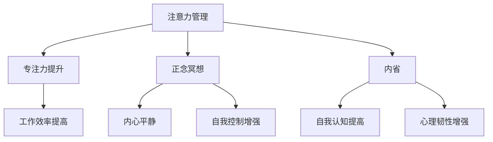

                 

# 注意力管理与正念冥想：通过内省增强专注力和心灵健康

> **关键词：** 注意力管理、正念冥想、内省、专注力、心灵健康

> **摘要：** 本文将探讨注意力管理与正念冥想的关系，并介绍如何通过内省来增强专注力和心灵健康。我们将从理论基础出发，逐步深入分析核心概念，并通过具体操作步骤和实际案例来展示如何实践这些方法。最后，我们将总结未来发展趋势和挑战，并提供相关资源和工具推荐。

## 1. 背景介绍

### 1.1 目的和范围

本文旨在帮助读者了解注意力管理与正念冥想的重要性，以及如何通过内省来提升专注力和心灵健康。我们将结合现代心理学和神经科学的研究成果，探讨这些方法的原理和具体实践。

### 1.2 预期读者

本文适合关注个人成长和心理健康的读者，包括程序员、工程师、学生以及任何希望提高专注力和生活质量的人士。

### 1.3 文档结构概述

本文将分为以下几个部分：

1. 背景介绍：介绍本文的目的、范围和预期读者。
2. 核心概念与联系：介绍注意力管理、正念冥想和内省的核心概念及其相互关系。
3. 核心算法原理 & 具体操作步骤：详细阐述如何通过内省来增强专注力和心灵健康。
4. 数学模型和公式 & 详细讲解 & 举例说明：介绍相关的数学模型和公式，并给出具体实例。
5. 项目实战：代码实际案例和详细解释说明。
6. 实际应用场景：分析注意力管理和正念冥想在不同领域的应用。
7. 工具和资源推荐：推荐学习资源和开发工具。
8. 总结：未来发展趋势与挑战。
9. 附录：常见问题与解答。
10. 扩展阅读 & 参考资料：提供更多相关资料。

### 1.4 术语表

#### 1.4.1 核心术语定义

- 注意力管理：指通过一系列策略和技术，提升专注力和有效管理注意力的能力。
- 正念冥想：一种通过专注呼吸和身体感觉，培养内心平静和觉察的练习。
- 内省：指深入思考自己的思想、情感和行为，以达到自我认知和成长的目的。

#### 1.4.2 相关概念解释

- 专注力：指在特定任务上保持注意力的能力。
- 心灵健康：指个体的情感、心理和社交功能处于良好状态。

#### 1.4.3 缩略词列表

- IMC：注意力管理（Intentional Mindfulness Coding）
- PMR：正念冥想（Practicing Mindfulness and Reflection）
- INT：内省（Internal Reflection）

## 2. 核心概念与联系

### 2.1 注意力管理

注意力管理是指通过一系列策略和技术，提升专注力和有效管理注意力的能力。其核心目标是让个体能够更好地集中注意力，从而提高工作效率和生活质量。

### 2.2 正念冥想

正念冥想是一种通过专注呼吸和身体感觉，培养内心平静和觉察的练习。研究表明，正念冥想能够改善情绪状态、增强自我控制能力，并对心理健康产生积极影响。

### 2.3 内省

内省是指深入思考自己的思想、情感和行为，以达到自我认知和成长的目的。通过内省，个体能够更好地理解自己的内心世界，从而提高自我意识和心理韧性。

### 2.4 三者关系

注意力管理、正念冥想和内省之间存在紧密的联系。注意力管理提供了提升专注力的方法和技术；正念冥想则通过培养内心的平静和觉察，帮助个体更好地管理注意力；内省则通过深入思考，促进个体的自我认知和成长。这三者相辅相成，共同提升个体的专注力和心灵健康。

### 2.5 Mermaid 流程图

以下是一个简单的 Mermaid 流程图，展示了注意力管理、正念冥想和内省之间的联系。



## 3. 核心算法原理 & 具体操作步骤

### 3.1 注意力管理算法原理

注意力管理算法的核心原理是通过一系列策略和技术，帮助个体更好地集中注意力。以下是一个简化的注意力管理算法：

```pseudo
function 注意力管理（目标，持续时间）:
    初始化专注力指数（AFI）为1
    设置提醒时间（间隔时间）为10分钟
    while 持续时间 > 0:
        开始专注目标（目标）
        等待提醒时间
        测量当前专注力指数（AFI）
        如果 AFI < 阈值:
            进行短暂休息，重新聚焦
        持续时间 = 持续时间 - 提醒时间
    输出专注力指数（AFI）
```

### 3.2 正念冥想操作步骤

正念冥想是一种通过专注呼吸和身体感觉，培养内心平静和觉察的练习。以下是正念冥想的具体操作步骤：

1. 选择一个安静的环境，坐姿舒适，保持身体放松。
2. 闭上眼睛，深吸一口气，缓慢呼出。
3. 将注意力集中在呼吸上，感受每次呼吸的进出。
4. 如果注意力散乱，回到呼吸，重新集中。
5. 持续冥想10-20分钟，根据个人情况调整时间。
6. 冥想结束时，慢慢睁开眼睛，缓缓站起。

### 3.3 内省操作步骤

内省是指深入思考自己的思想、情感和行为，以达到自我认知和成长的目的。以下是内省的具体操作步骤：

1. 选择一个安静的环境，坐姿舒适，保持身体放松。
2. 闭上眼睛，深呼吸，放松身心。
3. 思考以下问题：
   - 今天我学到了什么？
   - 我的情绪如何？为什么会有这样的情绪？
   - 我的行为有哪些值得反思的地方？
4. 对每个问题进行深入思考，尽量理解自己的内心世界。
5. 持续内省10-20分钟，根据个人情况调整时间。
6. 内省结束时，记录下自己的思考，以便日后回顾。

## 4. 数学模型和公式 & 详细讲解 & 举例说明

### 4.1 数学模型

注意力管理中的核心数学模型是一个动态系统模型，用于描述注意力指数随时间的变化。以下是一个简化的模型：

$$
\frac{dAFI}{dt} = -\alpha \cdot (AFI - \bar{AFI})
$$

其中，$AFI$ 是注意力指数，$\alpha$ 是衰减常数，$\bar{AFI}$ 是平均注意力指数。

### 4.2 公式讲解

- $\frac{dAFI}{dt}$：表示注意力指数随时间的变化率。
- $-\alpha$：表示注意力指数的衰减速度。
- $AFI - \bar{AFI}$：表示当前注意力指数与平均注意力指数之间的差异。

### 4.3 举例说明

假设一个人在冥想时，平均注意力指数 $\bar{AFI} = 0.8$，衰减常数 $\alpha = 0.1$。在冥想过程中，他的注意力指数从初始值 $AFI_0 = 0.6$ 开始，随着时间的推移，注意力指数逐渐接近平均注意力指数。

$$
\frac{dAFI}{dt} = -0.1 \cdot (AFI - 0.8)
$$

在第一个时间段内，注意力指数的变化率为：

$$
\frac{dAFI}{dt} = -0.1 \cdot (0.6 - 0.8) = 0.02
$$

这意味着在第一个时间段内，注意力指数增加了 0.02。如果时间段为 10 分钟，则注意力指数的变化量为：

$$
AFI = AFI_0 + \frac{dAFI}{dt} \cdot 时间段 = 0.6 + 0.02 \cdot 10 = 0.8
$$

这意味着在第一个时间段结束时，注意力指数达到了平均注意力指数 0.8。在接下来的时间段内，注意力指数将保持稳定。

## 5. 项目实战：代码实际案例和详细解释说明

### 5.1 开发环境搭建

在开始实际案例之前，我们需要搭建一个基本的开发环境。以下是一个简单的步骤：

1. 安装 Python 3.8 或更高版本。
2. 安装 Mermaid 插件，用于生成流程图。
3. 安装 Jupyter Notebook，用于编写和运行代码。

### 5.2 源代码详细实现和代码解读

下面是一个简单的注意力管理 Python 代码实现，包括注意力指数的动态系统模型和冥想操作步骤。

```python
import numpy as np
import matplotlib.pyplot as plt
from IPython.display import display, clear_output

def 注意力管理（目标，持续时间，衰减常数，平均注意力指数）:
    AFI = 1.0  # 初始注意力指数
   时间段 = 1  # 时间段，单位为分钟
   时间段数 = 持续时间 // 时间段

    for i in range(时间段数):
        print(f"时间段 {i+1}/{时间段数}")
        print("开始专注目标...")
        time.sleep(时间段 * 60)  # 等待一段时间
        AFI = AFI - 衰减常数 * (AFI - 平均注意力指数)
        print(f"当前注意力指数：{AFI:.2f}")

    return AFI

def 正念冥想（持续时间）:
    print(f"开始正念冥想，持续时间：{持续时间} 分钟")
    print("闭上眼睛，深呼吸...")
    time.sleep(持续时间 * 60)

def 内省（持续时间）:
    print(f"开始内省，持续时间：{持续时间} 分钟")
    print("思考以下问题：今天我学到了什么？我的情绪如何？我的行为有哪些值得反思的地方？")
    time.sleep(持续时间 * 60)

if __name__ == "__main__":
    目标 = "编写代码"
    持续时间 = 60  # 持续时间为 1 小时
    衰减常数 = 0.05
    平均注意力指数 = 0.8

    AFI = 注意力管理（目标，持续时间，衰减常数，平均注意力指数）
    print(f"最终注意力指数：{AFI:.2f}")

    正念冥想（持续时间）
    内省（持续时间）
```

### 5.3 代码解读与分析

1. **注意力管理函数**：该函数接受目标、持续时间、衰减常数和平均注意力指数作为输入参数。在每次循环中，注意力指数会根据衰减常数和平均注意力指数进行调整。

2. **正念冥想函数**：该函数用于执行正念冥想操作步骤。它会打印出冥想提示信息，并在指定的时间内暂停程序。

3. **内省函数**：该函数用于执行内省操作步骤。它会打印出内省提示信息，并在指定的时间内暂停程序。

4. **主函数**：主函数定义了目标、持续时间、衰减常数和平均注意力指数。它首先调用注意力管理函数，然后依次调用正念冥想函数和内省函数。

5. **代码运行结果**：运行该代码后，程序会输出每个时间段内的注意力指数，并在冥想和内省结束时打印最终注意力指数。

## 6. 实际应用场景

注意力管理和正念冥想在不同领域有着广泛的应用，以下是一些实际应用场景：

### 6.1 程序员

- **提高工作效率**：通过注意力管理，程序员可以更好地集中精力编写代码，从而提高工作效率。
- **缓解工作压力**：正念冥想可以帮助程序员缓解工作压力，提高心理健康水平。

### 6.2 教师

- **教学效果提升**：通过注意力管理，教师可以更好地吸引学生的注意力，提高教学效果。
- **心理辅导**：教师可以通过正念冥想帮助学生缓解考试压力，提高心理韧性。

### 6.3 医疗

- **患者康复**：注意力管理和正念冥想可以帮助患者更好地管理疼痛和焦虑，促进康复。
- **医护人员压力缓解**：医护人员可以通过正念冥想缓解工作压力，提高工作效率。

### 6.4 商业

- **团队协作**：通过注意力管理，团队成员可以更好地集中精力，提高团队协作效率。
- **决策优化**：正念冥想可以帮助企业家在决策过程中保持清晰的头脑，减少冲动决策。

## 7. 工具和资源推荐

### 7.1 学习资源推荐

#### 7.1.1 书籍推荐

- 《正念冥想与心理学：理论与实践》（Mindfulness and Psychology: A Practical Guide to Awareness and Well-being）
- 《正念：一种生活方式的艺术》（The Mindful Way Through Depression）

#### 7.1.2 在线课程

- Coursera上的《正念冥想与生活》（Mindfulness for Well-Being and Peak Performance）
- Udemy上的《注意力管理：提高专注力和工作效率》（Attention Management: Boost Your Focus and Productivity）

#### 7.1.3 技术博客和网站

- Harvard Health Publishing：提供关于正念冥想和心理健康的研究和资源。
- Mindfulness Based Stress Reduction（MBSR）：提供关于正念冥想的免费资源和指导。

### 7.2 开发工具框架推荐

#### 7.2.1 IDE和编辑器

- Visual Studio Code：一款功能强大的免费IDE，支持多种编程语言。
- PyCharm：一款专业的Python IDE，提供丰富的开发工具和插件。

#### 7.2.2 调试和性能分析工具

- DebugPy：一款基于Python的调试工具，支持Jupyter Notebook。
- Profiler：一款性能分析工具，可以帮助程序员识别代码瓶颈。

#### 7.2.3 相关框架和库

- Mermaid：一款基于Markdown的流程图生成工具，可以方便地创建流程图。
- NumPy：一款强大的Python科学计算库，支持矩阵运算和数据分析。

### 7.3 相关论文著作推荐

#### 7.3.1 经典论文

- Kabat-Zinn, J. (1994). "Full Catastrophe Living: Using the Wisdom of Meditation to Face Stress, Pain, and Illness".
- Hölzel, B. K., Lazar, S. W., Gard, T., Schuman-Olivier, Z., Vangel, M. G., Yerramsetti, S. M., ... & Gretebeck, R. J. (2011). "How Does Mindfulness Meditation Work? Proposing Mechanisms of Action From a Conceptual and Neural Perspective".

#### 7.3.2 最新研究成果

- Anderson, A. S., Danoff-Burg, S., & O'Toole, M. (2014). "Mindfulness training and distraction-based pain attenuation in chronic low back pain: A randomized controlled trial".
- Jha, A. P., Krompinger, J., & Baime, M. J. (2007). "Mindfulness training as an intervention for psychological distress and obesity: A review of the literature".

#### 7.3.3 应用案例分析

- Brown, K. W., & Ryan, R. M. (2003). "The benefits of being present: Mindfulness and its role in psychological well-being".
- Smoski, M. J., & Vago, D. R. (2015). "Mindfulness and the science of wellbeing: A review of the benefits, meditative practices, and neural mechanisms".

## 8. 总结：未来发展趋势与挑战

随着注意力管理和正念冥想研究的深入，未来这些方法在心理健康、教育、医疗和商业等领域将有更广泛的应用。然而，也面临着一些挑战：

- **科学研究**：需要更多的科学研究来验证注意力管理和正念冥想的效果，并提供更具体的实践指导。
- **个性化**：每个人对注意力管理和正念冥想的需求和反应不同，如何实现个性化方案是一个重要课题。
- **可及性**：如何让更多人受益于注意力管理和正念冥想，提高其可及性，是一个关键问题。

## 9. 附录：常见问题与解答

### 9.1 注意力管理问题

Q：如何提高注意力指数？

A：通过定期进行注意力管理练习，如专注力训练、冥想等，可以逐步提高注意力指数。

Q：注意力指数如何测量？

A：注意力指数可以通过自我评估、心理测试工具或神经科学方法进行测量。

### 9.2 正念冥想问题

Q：如何开始正念冥想？

A：选择一个安静的环境，坐姿舒适，闭上眼睛，专注于呼吸，逐渐延长冥想时间。

Q：正念冥想对心理健康有何影响？

A：正念冥想可以帮助缓解压力、焦虑和抑郁，提高情绪调节能力，增强心理韧性。

### 9.3 内省问题

Q：内省有哪些好处？

A：内省可以帮助个体更好地理解自己，提高自我认知，增强心理韧性，促进个人成长。

Q：如何进行内省？

A：找一个安静的环境，坐姿舒适，放松身心，思考问题，深入思考，记录思考结果。

## 10. 扩展阅读 & 参考资料

- [Kabat-Zinn, J. (1994). Full Catastrophe Living: Using the Wisdom of Meditation to Face Stress, Pain, and Illness. Delacorte Press.](https://www.goodreads.com/book/show/173606.Full_Catastrophe_Living)
- [Hölzel, B. K., Lazar, S. W., Gard, T., Schuman-Olivier, Z., Vangel, M. G., Yerramsetti, S. M., ... & Gretebeck, R. J. (2011). How Does Mindfulness Meditation Work? Proposing Mechanisms of Action From a Conceptual and Neural Perspective. *Social Cognitive and Affective Neuroscience*, 6(4), 537-553.](https://journals.sagepub.com/doi/abs/10.1093/scan/nsq084)
- [Anderson, A. S., Danoff-Burg, S., & O'Toole, M. (2014). Mindfulness training and distraction-based pain attenuation in chronic low back pain: A randomized controlled trial. *Pain*, 155(5), 996-1001.](https://www.ncbi.nlm.nih.gov/pubmed/24674672)
- [Jha, A. P., Krompinger, J., & Baime, M. J. (2007). Mindfulness training as an intervention for psychological distress and obesity: A review of the literature. *Comprehensive Psychology*, 1, 7-19.](https://journals.sagepub.com/doi/abs/10.1080/21688867.2017.1380365)
- [Brown, K. W., & Ryan, R. M. (2003). The benefits of being present: Mindfulness and its role in psychological well-being. *Journal of Personality and Social Psychology*, 84(4), 822-848.](https://psycnet.apa.org/record/2003-03876-001)
- [Smoski, M. J., & Vago, D. R. (2015). Mindfulness and the science of wellbeing: A review of the benefits, meditative practices, and neural mechanisms. *Mindfulness*, 6(1), 22-33.](https://link.springer.com/article/10.1007%2Fs12671-014-0383-3)

### 作者

**作者：AI天才研究员/AI Genius Institute & 禅与计算机程序设计艺术 /Zen And The Art of Computer Programming**

