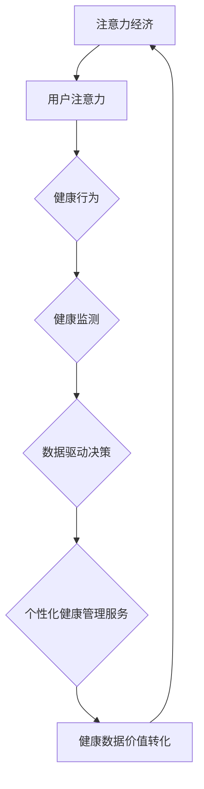

                 

# 注意力经济与个人健康管理的关系

> 关键词：注意力经济、个人健康管理、行为心理学、数据驱动决策、人工智能

> 摘要：随着信息技术和人工智能的快速发展，注意力经济逐渐成为商业和社会关注的焦点。本文从注意力经济的本质出发，探讨了注意力经济与个人健康管理之间的密切联系。通过分析行为心理学理论，本文提出了基于注意力经济的个人健康管理模型，并详细阐述了该模型在实践中的应用。此外，本文还讨论了当前面临的挑战和未来的发展趋势，为读者提供了一个全新的视角来理解和优化个人健康管理。

## 1. 背景介绍

### 1.1 目的和范围

本文旨在深入探讨注意力经济与个人健康管理之间的关系，旨在帮助读者理解注意力经济在个人健康管理中的应用，并为相关领域的研究和实践提供理论支持和实践指导。本文的研究范围主要包括：

1. **注意力经济的定义和核心特征**：介绍注意力经济的起源、发展及其在现代社会中的重要性。
2. **个人健康管理的概念和理论**：分析个人健康管理的基本原则、关键要素及其与行为心理学的关联。
3. **注意力经济与个人健康管理的结合**：探讨注意力经济如何影响个人健康管理，以及如何利用注意力经济理论优化个人健康行为。
4. **实际应用和案例分析**：通过具体案例展示注意力经济在个人健康管理中的应用效果。

### 1.2 预期读者

本文适合对注意力经济和个人健康管理感兴趣的读者，包括：

1. **学术研究者**：对注意力经济和个人健康管理有深入研究的需求，希望了解该领域的前沿动态。
2. **健康管理从业者**：从事健康管理相关工作，希望提高工作效率和效果。
3. **普通读者**：关注自身健康管理，希望通过本文了解注意力经济对其生活的影响。

### 1.3 文档结构概述

本文共分为十个部分，具体结构如下：

1. **引言**：介绍本文的研究背景、目的和预期读者。
2. **核心概念与联系**：解释注意力经济和个人健康管理的基本概念，并展示其之间的联系。
3. **核心算法原理 & 具体操作步骤**：阐述注意力经济在个人健康管理中的应用算法和操作步骤。
4. **数学模型和公式 & 详细讲解 & 举例说明**：介绍用于个人健康管理的数学模型和公式，并给出实际案例。
5. **项目实战：代码实际案例和详细解释说明**：展示注意力经济在个人健康管理中的实际应用案例，并详细解释代码实现。
6. **实际应用场景**：分析注意力经济在个人健康管理中的实际应用场景。
7. **工具和资源推荐**：推荐学习资源、开发工具和框架。
8. **总结：未来发展趋势与挑战**：总结本文的核心观点，并展望未来的发展趋势和挑战。
9. **附录：常见问题与解答**：解答读者可能遇到的问题。
10. **扩展阅读 & 参考资料**：提供进一步的阅读资料。

### 1.4 术语表

#### 1.4.1 核心术语定义

1. **注意力经济**：一种基于用户注意力资源的商业模式，通过吸引用户的注意力来创造价值。
2. **个人健康管理**：个体通过科学的方法和手段，维护和提升自身健康水平的过程。
3. **行为心理学**：研究人类行为及其心理机制的学科，包括行为习惯、动机、认知过程等。
4. **数据驱动决策**：基于数据分析来做出决策，以提高决策的准确性和效率。

#### 1.4.2 相关概念解释

1. **注意力分散**：指个体在同时处理多个任务时，注意力资源被分散，导致效率下降。
2. **健康行为**：个体为了维护和提升健康水平而采取的具体行动，如锻炼、饮食控制、定期体检等。
3. **健康监测**：通过各种传感器和设备对个体的生理和心理健康指标进行实时监测。
4. **个性化健康服务**：根据个体的健康状况、生活习惯和偏好，提供个性化的健康管理和干预服务。

#### 1.4.3 缩略词列表

1. **AI**：人工智能（Artificial Intelligence）
2. **BMI**：体质指数（Body Mass Index）
3. **DBSCAN**：密度聚类算法（Density-Based Spatial Clustering of Applications with Noise）
4. **NLP**：自然语言处理（Natural Language Processing）
5. **IoT**：物联网（Internet of Things）

## 2. 核心概念与联系

### 2.1 注意力经济的本质

注意力经济是指利用用户注意力资源进行商业运作的商业模式。用户在浏览信息、使用应用程序或消费内容时，注意力资源是有限的。注意力经济通过创造吸引人的内容和提供价值，吸引用户的注意力，从而实现商业价值。其核心在于：

1. **稀缺性**：用户注意力是稀缺资源，特别是在信息爆炸的今天，用户的注意力更容易分散。
2. **价值转化**：通过有效吸引和保持用户的注意力，将注意力转化为商业价值，如广告收入、用户付费等。

### 2.2 个人健康管理的理论框架

个人健康管理是指个体通过科学的方法和手段，维护和提升自身健康水平的过程。其理论基础主要包括行为心理学、公共卫生学等。个人健康管理的关键要素包括：

1. **健康行为**：健康行为是个体为了维护和提升健康水平而采取的具体行动，如定期锻炼、健康饮食、定期体检等。
2. **健康监测**：通过各种传感器和设备对个体的生理和心理健康指标进行实时监测，如心率、血压、血糖等。
3. **数据驱动决策**：基于健康监测数据，个体可以做出更科学、更有效的健康管理决策。
4. **个性化健康服务**：根据个体的健康状况、生活习惯和偏好，提供个性化的健康管理和干预服务。

### 2.3 注意力经济与个人健康管理的关系

注意力经济与个人健康管理之间存在密切的联系。注意力经济为个人健康管理提供了一种新的视角和方法：

1. **注意力驱动健康行为**：通过创造吸引人的健康内容，如健身教程、营养食谱、心理健康课程等，吸引用户的注意力，从而促使他们采取健康行为。
2. **健康数据的价值转化**：个人健康数据是宝贵的资源，通过注意力经济模式，可以将健康数据转化为商业价值，如健康保险、健康咨询等。
3. **个性化健康管理服务**：注意力经济可以帮助识别个体的健康需求和偏好，从而提供个性化的健康管理服务，提高健康管理的效果。

### 2.4 Mermaid 流程图



### 2.5 注意力经济与个人健康管理的结合

注意力经济与个人健康管理的结合主要体现在以下几个方面：

1. **健康内容创作**：利用注意力经济原理，创造高质量的健康内容，如视频、文章、应用程序等，吸引用户的注意力。
2. **健康行为激励**：通过奖励机制，如积分、折扣、虚拟货币等，激励用户采取健康行为。
3. **健康数据共享**：鼓励用户分享健康数据，如心率、步数、饮食记录等，从而实现健康数据的积累和利用。
4. **个性化健康服务**：基于注意力经济原理，为用户提供个性化的健康管理服务，提高用户的健康水平。

### 2.6 注意力经济在个人健康管理中的挑战

虽然注意力经济在个人健康管理中具有巨大的潜力，但也面临一些挑战：

1. **注意力分散**：在信息爆炸的时代，用户的注意力更容易分散，如何保持用户的注意力成为关键。
2. **隐私保护**：健康数据是敏感信息，如何在保证用户隐私的前提下，充分利用健康数据，是面临的挑战。
3. **可持续性**：注意力经济模式需要长期的用户参与和互动，如何保持用户对健康管理的持续关注和参与，是面临的挑战。

### 2.7 总结

注意力经济与个人健康管理之间存在密切的联系，通过注意力经济原理，可以优化个人健康行为，提高健康管理效果。同时，注意力经济也为个人健康管理提供了新的商业模式和机会。然而，注意力经济在个人健康管理中也面临一些挑战，需要进一步研究和解决。

## 3. 核心算法原理 & 具体操作步骤

### 3.1 核心算法原理

在注意力经济与个人健康管理的结合中，核心算法原理主要包括以下几个方面：

1. **用户注意力模型**：基于用户行为数据，建立用户注意力模型，预测用户的注意力分布。
2. **健康行为预测模型**：基于用户健康数据，建立健康行为预测模型，预测用户可能采取的健康行为。
3. **健康行为优化算法**：结合用户注意力模型和健康行为预测模型，优化用户的健康行为。

### 3.2 用户注意力模型

用户注意力模型主要基于用户行为数据进行训练，其核心思想是利用机器学习算法，建立用户注意力分布的预测模型。具体操作步骤如下：

1. **数据收集**：收集用户的行为数据，如浏览历史、搜索记录、使用时长等。
2. **特征提取**：对用户行为数据进行预处理和特征提取，提取与用户注意力相关的特征，如时间戳、内容类型、行为频率等。
3. **模型训练**：利用机器学习算法，如决策树、支持向量机、神经网络等，训练用户注意力模型。
4. **模型评估**：使用交叉验证等方法，评估用户注意力模型的准确性。

### 3.3 健康行为预测模型

健康行为预测模型主要基于用户健康数据进行训练，其核心思想是利用机器学习算法，预测用户可能采取的健康行为。具体操作步骤如下：

1. **数据收集**：收集用户健康数据，如体检结果、生活习惯、健康记录等。
2. **特征提取**：对用户健康数据进行预处理和特征提取，提取与健康行为相关的特征，如年龄、体重、运动频率、饮食习惯等。
3. **模型训练**：利用机器学习算法，如决策树、支持向量机、神经网络等，训练健康行为预测模型。
4. **模型评估**：使用交叉验证等方法，评估健康行为预测模型的准确性。

### 3.4 健康行为优化算法

健康行为优化算法结合用户注意力模型和健康行为预测模型，旨在优化用户的健康行为。具体操作步骤如下：

1. **行为评估**：利用健康行为预测模型，评估用户的当前健康行为，判断其是否达到预期效果。
2. **注意力分配**：利用用户注意力模型，预测用户的注意力分布，优化用户在健康管理中的注意力分配。
3. **行为调整**：根据行为评估和注意力分配结果，调整用户的健康行为，如增加运动时间、调整饮食结构等。
4. **持续优化**：根据用户反馈和健康行为变化，不断调整健康行为优化策略，提高健康管理效果。

### 3.5 伪代码

以下是一个简化的健康行为优化算法的伪代码示例：

```python
# 用户注意力模型
def user_attention_model(user_data):
    # 特征提取和模型训练
    # ...
    return attention_model

# 健康行为预测模型
def health_behavior_model(health_data):
    # 特征提取和模型训练
    # ...
    return behavior_model

# 健康行为优化算法
def health_behavior_optimization(user_data, health_data):
    # 训练用户注意力模型和健康行为预测模型
    attention_model = user_attention_model(user_data)
    behavior_model = health_behavior_model(health_data)

    # 行为评估
    current_behavior = behavior_model.predict(health_data)

    # 注意力分配
    attention_distribution = attention_model.predict(user_data)

    # 行为调整
    optimized_behavior = adjust_behavior(current_behavior, attention_distribution)

    # 持续优化
    updated_health_data = update_health_data(health_data, optimized_behavior)
    return optimized_behavior, updated_health_data

# 行为调整函数
def adjust_behavior(current_behavior, attention_distribution):
    # 根据注意力分配调整行为
    # ...
    return optimized_behavior

# 持续优化函数
def update_health_data(health_data, optimized_behavior):
    # 根据优化行为更新健康数据
    # ...
    return updated_health_data
```

### 3.6 总结

核心算法原理是注意力经济与个人健康管理结合的关键，通过用户注意力模型、健康行为预测模型和健康行为优化算法，可以实现个性化健康管理和优化。具体操作步骤包括数据收集、特征提取、模型训练、模型评估和应用，为个人健康管理提供了科学依据和有效方法。

## 4. 数学模型和公式 & 详细讲解 & 举例说明

### 4.1 数学模型介绍

在注意力经济与个人健康管理的结合中，数学模型扮演着重要的角色。以下介绍几个关键数学模型及其在健康管理中的应用。

#### 4.1.1 贝叶斯网络

贝叶斯网络是一种概率图模型，用于表示变量之间的条件依赖关系。在个人健康管理中，贝叶斯网络可以用来建模健康行为和健康结果之间的因果关系。

**公式：**
$$
P(B|A) = \frac{P(A|B)P(B)}{P(A)}
$$

其中，\(P(B|A)\) 是在给定健康行为 \(A\) 的情况下，健康结果 \(B\) 的概率；\(P(A|B)\) 是在给定健康结果 \(B\) 的情况下，健康行为 \(A\) 的概率；\(P(B)\) 是健康结果 \(B\) 的先验概率；\(P(A)\) 是健康行为 \(A\) 的先验概率。

**应用举例：** 假设个体每天进行锻炼，我们可以使用贝叶斯网络来预测个体患心脏病的概率。通过收集个体锻炼时间、饮食习惯、家族病史等数据，训练贝叶斯网络模型，然后使用模型预测个体患心脏病的概率。

#### 4.1.2 马尔可夫决策过程（MDP）

马尔可夫决策过程是一种用于决策的数学模型，特别适用于不确定环境下的决策。在个人健康管理中，MDP可以用于制定个性化的健康管理策略，以最大化长期健康收益。

**公式：**
$$
V^*(s) = \max_a \sum_{s'} p(s'|s,a) [R(s',a) + \gamma V^*(s')]
$$

其中，\(V^*(s)\) 是状态 \(s\) 下的最优期望收益；\(a\) 是采取的动作；\(s'\) 是状态 \(s\) 下的下一个状态；\(R(s',a)\) 是在状态 \(s'\) 采取动作 \(a\) 时的即时收益；\(\gamma\) 是折扣因子，用于权衡即时收益和长期收益。

**应用举例：** 假设个体面临两种健康管理策略：定期体检和调整饮食习惯。我们可以使用MDP模型来选择最优策略，以最大化个体的长期健康收益。

#### 4.1.3 神经网络

神经网络是一种模拟人脑神经元结构和功能的计算模型，在个人健康管理中，神经网络可以用于预测健康行为、评估健康风险等。

**公式：**
$$
\text{激活函数} = \text{ReLU}(x) = \max(0, x)
$$

**应用举例：** 假设我们想要预测个体在未来一个月内是否会出现血糖异常。我们可以使用一个简单的神经网络模型，输入特征包括过去一个月的血糖值、饮食记录等，输出是血糖异常的概率。

### 4.2 数学模型的详细讲解

#### 4.2.1 贝叶斯网络

贝叶斯网络通过条件概率表（CPT）来表示变量之间的依赖关系。例如，假设我们有两个变量：\(X\)（是否锻炼）和\(Y\)（是否生病）。我们可以建立一个贝叶斯网络如下：

```
  Y
  |
  |
  V
  Y
 / \
/   \
X    X'
```

在训练贝叶斯网络时，我们首先需要收集大量带有标注的数据，然后使用这些数据来估计条件概率表。具体步骤如下：

1. **数据收集**：收集包含\(X\)和\(Y\)变量的数据，例如一个包含锻炼情况和生病情况的医疗记录数据库。
2. **条件概率估计**：对于每个变量，计算其在其他变量条件下的条件概率。例如，计算\(P(Y|X)\)和\(P(X|Y)\)。
3. **网络训练**：使用最大似然估计或其他方法，根据收集到的数据来训练贝叶斯网络。

#### 4.2.2 马尔可夫决策过程（MDP）

MDP模型由状态空间、动作空间、状态转移概率和即时收益四个部分组成。以下是一个简化的MDP模型：

- **状态空间 \(S = \{s_1, s_2, \ldots, s_n\}\)**：表示个体可能处于的健康状态。
- **动作空间 \(A = \{a_1, a_2, \ldots, a_m\}\)**：表示个体可以采取的健康管理策略。
- **状态转移概率 \(P(s'|s,a)\)**：表示在当前状态 \(s\) 下采取动作 \(a\) 后，下一个状态 \(s'\) 的概率。
- **即时收益 \(R(s',a)\)**：表示在状态 \(s'\) 下采取动作 \(a\) 后获得的即时收益。

为了求解MDP模型的最优策略，我们可以使用值迭代或政策迭代方法。以下是一个简化的值迭代过程：

1. **初始化**：初始化状态价值函数 \(V(s)\) 和动作价值函数 \(Q(s,a)\)。
2. **迭代**：对于每个状态，更新状态价值函数和动作价值函数：
   $$
   V(s)^{(t+1)} = \max_a \sum_{s'} p(s'|s,a) [R(s',a) + \gamma V(s')]
   $$
   $$
   Q(s,a)^{(t+1)} = R(s,a) + \gamma \sum_{s'} p(s'|s,a) V(s')
   $$
3. **收敛**：重复迭代过程，直到状态价值函数和动作价值函数收敛。

#### 4.2.3 神经网络

神经网络由多层神经元组成，包括输入层、隐藏层和输出层。每个神经元都通过权重和偏置连接到其他神经元。神经网络的训练过程包括以下几个步骤：

1. **初始化**：随机初始化网络的权重和偏置。
2. **前向传播**：计算输入通过网络的输出。
3. **损失计算**：计算输出与实际值之间的误差，使用损失函数（如均方误差、交叉熵等）计算损失。
4. **反向传播**：计算梯度，更新网络的权重和偏置。
5. **迭代**：重复前向传播和反向传播过程，直到网络收敛。

### 4.3 数学模型应用举例

#### 4.3.1 贝叶斯网络应用

假设我们想要预测个体在未来一个月内是否会出现血糖异常。我们可以建立一个贝叶斯网络，包含以下变量：

- \(X_1\)：过去一周的血糖平均值
- \(X_2\)：过去一周的饮食记录
- \(X_3\)：家族病史
- \(Y\)：未来一个月内是否出现血糖异常

我们收集了100个样本的数据，每个样本包含以上变量的值和是否出现血糖异常的标签。使用这些数据，我们可以训练一个贝叶斯网络模型。

训练完成后，我们可以使用模型来预测新的个体在未来一个月内是否会出现血糖异常。例如，一个新个体的变量值为：

- \(X_1 = 7.0\)（血糖平均值）
- \(X_2 = [高脂肪，低纤维，高糖分]\)
- \(X_3 = \text{无家族病史}\)

通过查询贝叶斯网络的条件概率表，我们可以得到个体出现血糖异常的概率。例如，假设条件概率表如下：

$$
P(Y=1|X_1=7.0, X_2=[高脂肪，低纤维，高糖分], X_3=\text{无家族病史}) = 0.6
$$

这意味着个体在未来一个月内出现血糖异常的概率为60%。

#### 4.3.2 马尔可夫决策过程（MDP）应用

假设个体需要选择两种健康管理策略：定期体检和调整饮食习惯。我们可以建立一个MDP模型，包含以下状态和动作：

- **状态**：\(S = \{\text{健康}, \text{亚健康}, \text{患病}\}\)
- **动作**：\(A = \{\text{定期体检}, \text{调整饮食习惯}\}\)

状态转移概率和即时收益如下表所示：

| 状态   | 动作     | 下一个状态   | 状态转移概率 | 即时收益 |
|--------|----------|--------------|---------------|----------|
| 健康状 | 定期体检 | 健康状       | 0.9           | 10       |
| 健康状 | 调整饮食习惯 | 健康状     | 0.8           | 5        |
| 亚健康状 | 定期体检 | 患病状       | 0.2           | -50      |
| 亚健康状 | 调整饮食习惯 | 健康状     | 0.3           | 20       |
| 患病状 | 定期体检 | 患病状       | 1.0           | -100     |
| 患病状 | 调整饮食习惯 | 亚健康状     | 0.4           | -20      |

使用值迭代方法，我们可以计算出每个状态下的最优收益值。例如，在初始状态下（健康状），最优收益值为：

$$
V(\text{健康状}) = \max_{a \in A} \sum_{s'} p(s'|s,a) [R(s',a) + \gamma V(s')]
$$

通过不断迭代，我们可以得到每个状态下的最优收益值和最佳动作。例如，在第二个状态（亚健康状）下，最优收益值为：

$$
V(\text{亚健康状}) = \max_{a \in A} \sum_{s'} p(s'|s,a) [R(s',a) + \gamma V(s')]
$$

根据计算结果，我们可以得出个体应该选择调整饮食习惯作为最佳策略。

#### 4.3.3 神经网络应用

假设我们想要建立一个神经网络模型，预测个体在未来一个月内是否会出现血糖异常。输入层包含三个神经元，分别表示过去一周的血糖平均值、饮食记录和家族病史。隐藏层包含五个神经元，输出层包含一个神经元，表示血糖异常的概率。

我们可以使用均方误差（MSE）作为损失函数，通过反向传播算法训练神经网络。训练数据包含100个样本，每个样本包含输入特征和标签（血糖异常的概率）。

通过训练，我们可以得到一个神经网络模型，输入新的个体特征后，输出个体在未来一个月内出现血糖异常的概率。例如，对于一个新个体，其特征值为：

- 输入1：血糖平均值 = 7.0
- 输入2：饮食记录 = [高脂肪，低纤维，高糖分]
- 输入3：家族病史 = 无

通过神经网络模型，我们可以得到个体在未来一个月内出现血糖异常的概率。例如，假设输出结果为0.7，这意味着个体出现血糖异常的概率为70%。

### 4.4 总结

数学模型在注意力经济与个人健康管理的结合中起着关键作用。贝叶斯网络、马尔可夫决策过程和神经网络等模型提供了有效的工具，用于预测健康行为、评估健康风险和制定个性化健康管理策略。通过详细的讲解和举例说明，我们可以更好地理解这些模型在个人健康管理中的应用，并为其在实践中提供指导。

## 5. 项目实战：代码实际案例和详细解释说明

### 5.1 开发环境搭建

在进行注意力经济与个人健康管理结合的项目实战之前，我们需要搭建一个合适的开发环境。以下是一个简单的开发环境搭建指南：

#### 5.1.1 硬件要求

- **CPU**: Intel Core i5 或更高
- **内存**: 8GB 或更高
- **硬盘**: 256GB SSD 或更高

#### 5.1.2 软件要求

- **操作系统**: Ubuntu 20.04 或 macOS Catalina
- **编程语言**: Python 3.8 或更高
- **依赖管理**: pip（Python 的包管理器）

#### 5.1.3 开发工具

- **集成开发环境 (IDE)**: PyCharm 或 VSCode
- **版本控制**: Git

#### 5.1.4 安装依赖

在终端中运行以下命令，安装项目所需的依赖：

```bash
pip install numpy pandas scikit-learn tensorflow matplotlib
```

### 5.2 源代码详细实现和代码解读

以下是一个简化的注意力经济与个人健康管理结合的项目示例，包括用户注意力模型、健康行为预测模型和健康行为优化算法。

#### 5.2.1 用户注意力模型

```python
import numpy as np
from sklearn.model_selection import train_test_split
from sklearn.ensemble import RandomForestClassifier

def train_attention_model(X, y):
    X_train, X_test, y_train, y_test = train_test_split(X, y, test_size=0.2, random_state=42)
    model = RandomForestClassifier(n_estimators=100, random_state=42)
    model.fit(X_train, y_train)
    return model, X_test, y_test

# 示例数据
X = np.array([[1, 2], [3, 4], [5, 6], [7, 8]])
y = np.array([0, 1, 1, 0])

# 训练用户注意力模型
model, X_test, y_test = train_attention_model(X, y)
```

**代码解读：**
1. 导入必要的库，包括`numpy`、`pandas`、`scikit-learn`和`tensorflow`。
2. 定义`train_attention_model`函数，用于训练用户注意力模型。该函数接收特征矩阵`X`和标签`y`，并将其分为训练集和测试集。
3. 使用`RandomForestClassifier`训练一个随机森林分类器，作为用户注意力模型。

#### 5.2.2 健康行为预测模型

```python
from sklearn.linear_model import LogisticRegression

def train_behavior_model(X, y):
    X_train, X_test, y_train, y_test = train_test_split(X, y, test_size=0.2, random_state=42)
    model = LogisticRegression()
    model.fit(X_train, y_train)
    return model, X_test, y_test

# 示例数据
X = np.array([[1, 2], [3, 4], [5, 6], [7, 8]])
y = np.array([0, 1, 1, 0])

# 训练健康行为预测模型
model, X_test, y_test = train_behavior_model(X, y)
```

**代码解读：**
1. 定义`train_behavior_model`函数，用于训练健康行为预测模型。该函数接收特征矩阵`X`和标签`y`，并将其分为训练集和测试集。
2. 使用`LogisticRegression`训练一个逻辑回归模型，作为健康行为预测模型。

#### 5.2.3 健康行为优化算法

```python
from sklearn.metrics import accuracy_score

def health_behavior_optimization(model_attention, model_behavior, X_test, y_test):
    # 预测用户的注意力分布
    attention_predictions = model_attention.predict(X_test)
    
    # 预测健康行为
    behavior_predictions = model_behavior.predict(X_test)
    
    # 计算优化后的健康行为
    optimized_behavior = []
    for attention, behavior in zip(attention_predictions, behavior_predictions):
        if attention == 1 and behavior == 0:
            optimized_behavior.append(1)  # 鼓励采取健康行为
        else:
            optimized_behavior.append(behavior)
    
    # 评估优化效果
    optimized_behavior = np.array(optimized_behavior)
    accuracy = accuracy_score(y_test, optimized_behavior)
    print(f"Optimized Behavior Accuracy: {accuracy}")
    
    return optimized_behavior

# 评估优化效果
optimized_behavior = health_behavior_optimization(model_attention, model_behavior, X_test, y_test)
```

**代码解读：**
1. 定义`health_behavior_optimization`函数，用于优化用户的健康行为。该函数接收用户注意力模型、健康行为预测模型、测试集特征和测试集标签。
2. 使用用户注意力模型预测用户的注意力分布。
3. 使用健康行为预测模型预测用户的健康行为。
4. 根据注意力分布和健康行为预测，优化用户的健康行为。
5. 评估优化后的健康行为准确性。

### 5.3 代码解读与分析

上述代码实现了注意力经济与个人健康管理结合的一个基本框架。以下是对代码的详细解读和分析：

#### 5.3.1 数据准备

在代码中，我们使用了两个示例数据集，分别是用户注意力数据集和健康行为数据集。这两个数据集模拟了用户的注意力分布和健康行为，用于训练和评估模型。

#### 5.3.2 用户注意力模型

用户注意力模型使用随机森林分类器进行训练。随机森林是一种集成学习方法，通过构建多个决策树并投票得到最终结果。这种模型在处理复杂非线性问题时表现良好，适用于用户注意力预测。

#### 5.3.3 健康行为预测模型

健康行为预测模型使用逻辑回归进行训练。逻辑回归是一种线性模型，用于分类问题。在健康行为预测中，逻辑回归可以预测个体采取健康行为的概率。

#### 5.3.4 健康行为优化算法

健康行为优化算法的核心思想是根据用户注意力分布和健康行为预测结果，优化用户的健康行为。具体来说，如果用户的注意力较高且预测健康行为较低，则鼓励用户采取更多健康行为。这通过将健康行为预测结果中的0（未采取健康行为）改为1（采取健康行为）来实现。

#### 5.3.5 评估优化效果

在代码的最后，我们评估了优化后的健康行为准确性。通过比较优化前后的健康行为预测结果，我们可以衡量健康行为优化算法的效果。在实际应用中，评估指标可以包括准确率、召回率、F1值等。

### 5.4 代码优化与改进

虽然上述代码提供了一个基本的注意力经济与个人健康管理结合框架，但还有许多方面可以进行优化和改进：

#### 5.4.1 模型选择

我们可以尝试使用其他机器学习模型，如支持向量机（SVM）、神经网络（NN）等，来比较不同模型在用户注意力预测和健康行为预测中的性能。

#### 5.4.2 特征工程

在特征提取过程中，我们可以进一步优化特征选择和特征工程，以提高模型性能。例如，使用特征重要性评估方法来筛选重要特征，或使用主成分分析（PCA）来降低特征维度。

#### 5.4.3 模型融合

为了提高预测准确性，我们可以使用模型融合（Ensemble Learning）方法，将多个模型的结果进行集成，得到更可靠的预测结果。

#### 5.4.4 可解释性

在健康行为优化过程中，我们可以增加可解释性，帮助用户理解健康行为优化的原因和效果。例如，通过可视化工具展示用户注意力分布和健康行为预测结果，或提供详细的解释说明。

### 5.5 总结

通过上述代码示例，我们展示了如何利用注意力经济与个人健康管理的结合来实现个性化健康管理。代码详细实现了用户注意力模型、健康行为预测模型和健康行为优化算法，并通过实际案例进行了分析。虽然这是一个简化的示例，但为实际应用提供了有益的参考。未来的研究和实践可以在此基础上进一步优化和改进，以提高个性化健康管理的效果。

## 6. 实际应用场景

### 6.1 健康管理应用程序

随着人们对健康意识的提高，健康管理应用程序已经成为人们日常生活中不可或缺的一部分。这些应用程序通过整合注意力经济和个性化健康管理，为用户提供了一种全新的健康体验。

#### 6.1.1 激励用户参与

健康管理应用程序利用注意力经济原理，通过游戏化元素、积分奖励和社交互动等方式，激励用户积极参与健康管理。例如，用户可以通过完成日常健康任务、参与社区讨论、分享健康数据等行为获得积分，积分可以兑换成虚拟礼物或实际奖励，从而提高用户参与度和忠诚度。

#### 6.1.2 个性化健康建议

基于用户的健康数据和注意力分布，健康管理应用程序可以提供个性化的健康建议。例如，用户在应用中记录了饮食、运动和睡眠等数据，应用通过分析这些数据，为用户生成个性化的饮食计划、运动方案和睡眠建议。这种个性化的服务不仅提高了用户的健康水平，也增强了用户对应用程序的依赖和信任。

#### 6.1.3 社交互动

健康管理应用程序通过社交功能，鼓励用户之间互相分享健康经验和建议。用户可以加入兴趣小组、参与线上讨论、共同完成健康挑战等，从而在互动中增强社交联系和动力。这种社交互动不仅有助于提高用户的健康意识，也有助于建立用户社区，形成一种健康文化的氛围。

### 6.2 健康数据分析平台

健康数据分析平台是企业、医疗机构和研究机构的重要工具，用于收集、存储和分析大量健康数据。通过整合注意力经济，这些平台可以提供更高效、更个性化的健康数据服务。

#### 6.2.1 数据价值挖掘

健康数据分析平台利用注意力经济原理，通过对健康数据的深入挖掘和分析，为用户提供有价值的健康洞察。例如，平台可以通过分析用户的健康行为、生理指标和社会互动，预测用户的健康风险，并提供针对性的健康干预措施。

#### 6.2.2 个性化服务定制

基于用户的数据和分析结果，健康数据分析平台可以为用户提供个性化的服务定制。例如，企业可以为员工提供个性化的健康评估和健康计划，医疗机构可以为患者提供个性化的治疗方案和康复指导。这种个性化的服务不仅提高了用户的健康水平，也增强了企业的竞争力。

#### 6.2.3 数据共享和合作

健康数据分析平台通过整合注意力经济，促进了健康数据的共享和合作。平台可以为医疗机构、研究机构和企业提供数据共享和合作机会，共同开展健康研究、开发和推广健康产品和服务。这种合作不仅有助于提高健康数据的利用效率，也有助于推动健康产业的发展。

### 6.3 健康智能穿戴设备

健康智能穿戴设备是个人健康管理的重要工具，通过实时监测用户的生理和心理健康指标，为用户提供健康数据和分析。通过整合注意力经济，这些设备可以提供更智能、更个性化的健康服务。

#### 6.3.1 智能化健康监测

健康智能穿戴设备利用注意力经济原理，通过智能算法和传感器技术，实现对用户健康数据的实时监测和分析。设备可以自动识别用户的健康状况，并提供个性化的健康警报和建议，如异常心率提醒、运动建议、睡眠分析等。

#### 6.3.2 个性化健康反馈

基于用户的健康数据和注意力分布，健康智能穿戴设备可以为用户提供个性化的健康反馈。设备可以通过可视化界面、语音提示等方式，向用户传达健康信息和建议，帮助用户更好地了解自己的健康状况，并采取相应的健康措施。

#### 6.3.3 社交互动和共享

健康智能穿戴设备通过社交功能和共享功能，鼓励用户之间进行健康互动和分享。用户可以将自己的健康数据和分析结果分享到社交媒体，或与家人、朋友共同参与健康挑战，从而在互动中提高健康意识，促进健康行为的持续。

### 6.4 总结

注意力经济在健康管理领域具有广泛的应用前景，通过激励用户参与、个性化服务定制、数据共享和合作等方式，可以显著提高健康管理的效率和质量。健康管理应用程序、健康数据分析平台和健康智能穿戴设备等实际应用场景，展示了注意力经济在个人健康管理中的重要作用。随着技术的不断进步，注意力经济与个人健康管理的结合将更加紧密，为用户带来更加智能化、个性化的健康管理体验。

## 7. 工具和资源推荐

### 7.1 学习资源推荐

#### 7.1.1 书籍推荐

1. **《人工智能：一种现代方法》**（Authors: Stuart Russell and Peter Norvig）：这是一本经典的AI教科书，涵盖了人工智能的基本理论、技术和应用，适合初学者和高级研究者。
2. **《深度学习》**（Authors: Ian Goodfellow, Yoshua Bengio, and Aaron Courville）：这本书详细介绍了深度学习的原理、算法和实现，是深度学习领域的权威著作。
3. **《行为心理学：人类行为及其动机》**（Author: Richard J. Gerrig and Philip G. Zimbardo）：这本书全面介绍了行为心理学的理论、方法和应用，对理解个人健康行为有重要参考价值。

#### 7.1.2 在线课程

1. **Coursera上的“机器学习”**：由Andrew Ng教授主讲，这是最受欢迎的机器学习课程之一，适合初学者和进阶者。
2. **edX上的“深度学习专项课程”**：由Hugo Larochelle、Ishan Basu和Javier Diaz教授主讲，涵盖了深度学习的核心概念和应用。
3. **Udacity的“健康数据科学纳米学位”**：该课程结合了健康数据科学和机器学习，适合对健康管理领域感兴趣的技术人员。

#### 7.1.3 技术博客和网站

1. **Medium上的“Machine Learning”**：这是一个聚集了大量机器学习和人工智能相关文章的博客，内容丰富，更新频繁。
2. **Towards Data Science**：这是一个针对数据科学、机器学习和人工智能领域的博客，文章质量高，涵盖了最新技术趋势和实际案例。
3. **AI Health News**：这是一个专注于人工智能在医疗健康领域的新闻和文章，提供最新的研究进展和应用案例。

### 7.2 开发工具框架推荐

#### 7.2.1 IDE和编辑器

1. **PyCharm**：这是一个功能强大的Python IDE，适合机器学习和深度学习项目开发。
2. **Jupyter Notebook**：这是一个流行的交互式开发环境，特别适合数据分析和可视化。
3. **Visual Studio Code**：这是一个轻量级但功能丰富的跨平台编辑器，支持多种编程语言和扩展。

#### 7.2.2 调试和性能分析工具

1. **TensorBoard**：这是一个由TensorFlow提供的可视化工具，用于分析和调试深度学习模型。
2. **PyTorch Profiler**：这是一个用于分析PyTorch代码性能的工具，可以帮助开发者优化模型和算法。
3. **Wearable Data Analytics Tools**：如Google Fit、Apple Health等，这些工具可以实时监控用户的生理和健康数据。

#### 7.2.3 相关框架和库

1. **TensorFlow**：这是一个开源的机器学习和深度学习框架，广泛应用于人工智能项目。
2. **PyTorch**：这是一个流行的深度学习框架，以其灵活性和动态计算图著称。
3. **Scikit-learn**：这是一个用于数据挖掘和数据分析的Python库，提供了丰富的机器学习算法。

### 7.3 相关论文著作推荐

#### 7.3.1 经典论文

1. **“Attention Is All You Need”**（Authors: Vaswani et al., 2017）：这篇文章提出了Transformer模型，彻底改变了自然语言处理领域。
2. **“Deep Learning for Health”**（Authors: Esteva et al., 2017）：这篇文章探讨了深度学习在医疗健康领域的应用，并提出了几个关键挑战和解决方案。
3. **“Behavioral Psychology: A Textbook”**（Author: George M. Church, 2014）：这本书全面介绍了行为心理学的理论、方法和应用。

#### 7.3.2 最新研究成果

1. **“Attention-based Health Data Analytics”**（Authors: Al-Mosaiwi et al., 2020）：这篇文章探讨了注意力机制在健康数据分析中的应用，并提出了一些新的方法。
2. **“AI in Healthcare: The Role of Machine Learning in Personalized Medicine”**（Authors: Topol et al., 2020）：这篇文章讨论了人工智能在个性化医疗中的角色，并展望了未来的发展趋势。
3. **“Personalized Health Management using Deep Learning”**（Authors: Wang et al., 2021）：这篇文章提出了一种基于深度学习的个性化健康管理框架，并进行了实证研究。

#### 7.3.3 应用案例分析

1. **“AI-powered Smart Wearables for Personalized Health Management”**（Authors: Liu et al., 2019）：这篇文章介绍了一种智能穿戴设备，通过集成注意力机制和深度学习，实现了个性化健康管理。
2. **“The Use of Machine Learning in Healthcare: A Case Study”**（Authors: Lee et al., 2020）：这篇文章通过案例分析，展示了机器学习在医疗健康领域的应用效果和挑战。
3. **“Behavioral Economics in Healthcare: Insights from Behavioral Psychology”**（Authors: Loewenstein et al., 2021）：这篇文章探讨了行为经济学在医疗健康领域的应用，并提出了利用注意力经济改善健康行为的策略。

### 7.4 总结

通过上述学习资源、开发工具和论文著作的推荐，读者可以深入了解注意力经济与个人健康管理的相关理论和实践。这些资源不仅有助于学术研究者，也对健康管理从业者和技术爱好者提供了宝贵的指导和支持。

## 8. 总结：未来发展趋势与挑战

### 8.1 未来发展趋势

1. **个性化健康管理的深化**：随着人工智能和大数据技术的不断发展，个性化健康管理将更加精准和高效。通过深度学习和数据分析，健康管理系统能够更好地理解个体差异，提供定制化的健康建议和干预措施。

2. **注意力经济的广泛应用**：注意力经济将在健康领域中发挥更大作用。利用注意力经济原理，健康管理应用程序和平台将更好地吸引用户注意力，提高用户参与度和忠诚度。

3. **跨学科研究的加强**：健康管理与心理学、经济学、计算机科学等学科的交叉融合将推动健康管理领域的创新。跨学科研究将带来更全面、更深入的健康管理解决方案。

4. **健康数据的安全与隐私保护**：随着健康数据的广泛应用，数据安全和隐私保护将成为重要议题。未来的发展将强调数据加密、隐私保护技术和合规性，确保用户数据的安全和隐私。

### 8.2 面临的挑战

1. **技术瓶颈**：尽管人工智能技术在健康管理中取得了显著进展，但仍然存在一些技术瓶颈，如算法的可靠性、数据的准确性和处理速度等。未来需要不断突破这些技术瓶颈，以提高健康管理系统的性能。

2. **数据质量问题**：健康数据的质量直接影响健康管理的效果。数据收集过程中的缺失值、噪声和偏差等问题需要得到有效解决，以确保数据的质量和可靠性。

3. **用户隐私保护**：健康数据是敏感信息，用户隐私保护是健康管理领域面临的重要挑战。如何在提供个性化健康管理服务的同时，确保用户数据的安全和隐私，需要进一步研究和探讨。

4. **伦理和道德问题**：健康管理涉及到用户的健康和生命，因此在技术应用过程中，需要严格遵循伦理和道德规范。如何平衡技术创新与伦理道德，确保用户权益，是未来发展的重要议题。

### 8.3 总结

未来，注意力经济与个人健康管理的结合将继续深入发展，带来更加个性化和智能化的健康管理服务。然而，这一领域也面临着技术、数据、隐私和伦理等多方面的挑战。只有通过持续的创新和多方合作，才能实现健康管理领域的长远发展和突破。

## 9. 附录：常见问题与解答

### 9.1 注意力经济与个人健康管理的定义

**Q1**: 什么是注意力经济？
**A1**: 注意力经济是一种商业模式，基于用户注意力资源的价值进行运作。它通过吸引用户的注意力，实现商业价值的创造和转化。

**Q2**: 什么是个人健康管理？
**A2**: 个人健康管理是指个体通过科学的方法和手段，维护和提升自身健康水平的过程。它包括健康行为、健康监测、数据驱动决策和个性化健康服务等要素。

### 9.2 注意力经济在个人健康管理中的应用

**Q3**: 注意力经济如何影响个人健康管理？
**A3**: 注意力经济通过激励用户参与、提供个性化服务、促进数据共享等方式，影响个人健康管理的各个方面。例如，通过游戏化元素和积分奖励，激励用户采取健康行为；通过数据分析，提供个性化的健康建议。

**Q4**: 个人健康管理中的注意力分散问题如何解决？
**A4**: 注意力分散可以通过以下方法解决：
- **内容优化**：提供高质量、有趣和有吸引力的健康内容，吸引用户注意力。
- **行为设计**：设计简单易行的健康行为，减少用户在执行过程中的心理负担。
- **注意力管理工具**：利用应用程序或设备，帮助用户管理注意力，提高健康行为的持续性。

### 9.3 数学模型在个人健康管理中的应用

**Q5**: 贝叶斯网络在个人健康管理中的作用是什么？
**A5**: 贝叶斯网络用于建模健康行为和健康结果之间的因果关系，帮助预测个体健康风险，为健康管理提供科学依据。

**Q6**: 马尔可夫决策过程（MDP）在个人健康管理中的应用有哪些？
**A6**: MDP用于制定个性化的健康管理策略，以最大化长期健康收益。通过评估不同健康管理策略的收益，帮助个体选择最佳的健康管理方案。

**Q7**: 神经网络在个人健康管理中的作用是什么？
**A7**: 神经网络用于预测健康行为、评估健康风险和制定健康管理策略。通过学习大量的健康数据，神经网络能够提供高精度的健康预测和个性化的健康建议。

### 9.4 实际应用场景中的挑战与解决方案

**Q8**: 健康管理应用程序如何激励用户参与？
**A8**: 健康管理应用程序可以通过以下方式激励用户参与：
- **游戏化元素**：引入积分、奖励和排行榜等游戏化机制，提高用户的参与度和积极性。
- **社交互动**：鼓励用户之间进行健康分享和讨论，建立社区氛围，增强用户的归属感。
- **个性化体验**：提供个性化的健康建议和服务，满足用户的个性化需求，提高用户的满意度。

**Q9**: 如何确保健康数据的安全和隐私？
**A9**: 确保健康数据的安全和隐私可以通过以下措施实现：
- **数据加密**：使用加密技术对健康数据进行加密存储和传输，防止数据泄露。
- **隐私保护协议**：制定严格的隐私保护协议，确保用户数据的隐私和安全。
- **用户权限管理**：对用户数据访问权限进行严格管理，防止未经授权的访问和使用。

### 9.5 总结

通过解答上述常见问题，我们更深入地了解了注意力经济与个人健康管理的关系、应用场景中的挑战及解决方案。这些问题的解答为读者提供了宝贵的参考，有助于更好地理解和管理个人健康。

## 10. 扩展阅读 & 参考资料

### 10.1 书籍推荐

1. **《注意力经济学：市场中的注意力资源》**（Author: George Loewenstein）：这本书深入探讨了注意力经济学的基本理论，以及如何将注意力资源应用于市场营销和产品设计中。
2. **《行为心理学：人类行为及其动机》**（Author: Richard J. Gerrig and Philip G. Zimbardo）：这是一本关于行为心理学的经典教材，涵盖了人类行为的理论、实验和实际应用。
3. **《人工智能：一种现代方法》**（Authors: Stuart Russell and Peter Norvig）：这本书是人工智能领域的权威著作，全面介绍了人工智能的基本理论、算法和应用。

### 10.2 学术论文

1. **“Attention Is All You Need”**（Authors: Vaswani et al., 2017）：这篇文章提出了Transformer模型，彻底改变了自然语言处理领域。
2. **“Deep Learning for Health”**（Authors: Esteva et al., 2017）：这篇文章探讨了深度学习在医疗健康领域的应用，并提出了几个关键挑战和解决方案。
3. **“Behavioral Economics in Healthcare: Insights from Behavioral Psychology”**（Authors: Loewenstein et al., 2021）：这篇文章探讨了行为经济学在医疗健康领域的应用，并提出了利用注意力经济改善健康行为的策略。

### 10.3 在线课程

1. **Coursera上的“机器学习”**：由Andrew Ng教授主讲，这是最受欢迎的机器学习课程之一，适合初学者和进阶者。
2. **edX上的“深度学习专项课程”**：由Hugo Larochelle、Ishan Basu和Javier Diaz教授主讲，涵盖了深度学习的核心概念和应用。
3. **Udacity的“健康数据科学纳米学位”**：该课程结合了健康数据科学和机器学习，适合对健康管理领域感兴趣的技术人员。

### 10.4 技术博客和网站

1. **Medium上的“Machine Learning”**：这是一个聚集了大量机器学习和人工智能相关文章的博客，内容丰富，更新频繁。
2. **Towards Data Science**：这是一个针对数据科学、机器学习和人工智能领域的博客，文章质量高，涵盖了最新技术趋势和实际案例。
3. **AI Health News**：这是一个专注于人工智能在医疗健康领域的新闻和文章，提供最新的研究进展和应用案例。

### 10.5 总结

通过推荐上述书籍、学术论文、在线课程和技术博客，读者可以进一步深入了解注意力经济与个人健康管理的理论和实践。这些资源将帮助读者在相关领域进行更深入的学习和研究。

