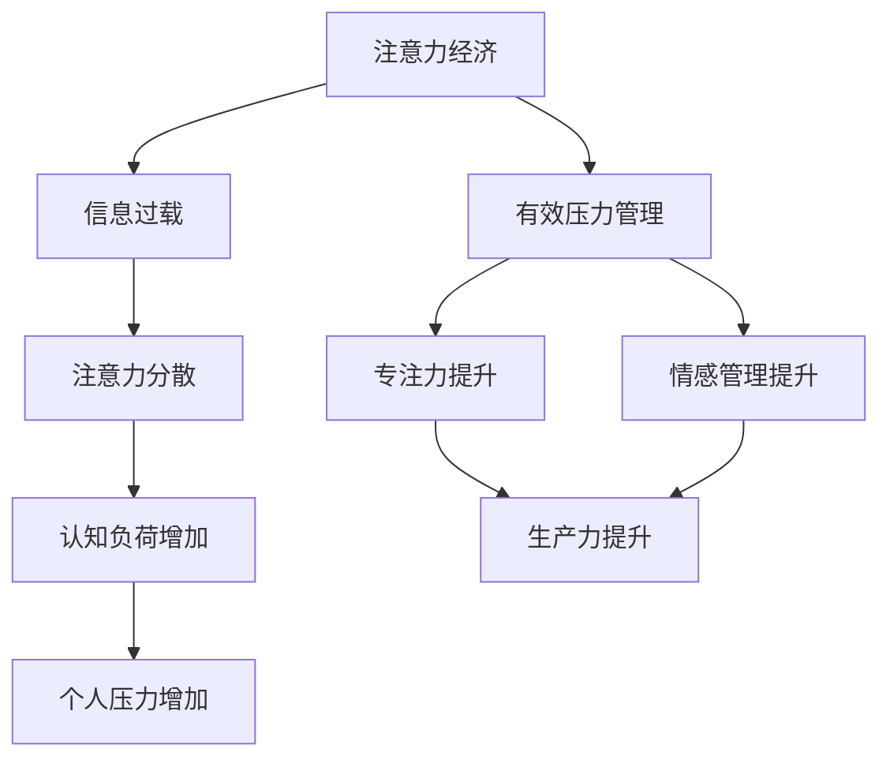

                 

# 注意力经济与个人压力管理的关系

> 关键词：注意力经济、个人压力管理、认知负荷、生产力、心理健康

> 摘要：本文将深入探讨注意力经济与个人压力管理之间的关系。通过分析注意力经济的本质、影响因素及其对个人认知负荷的影响，我们揭示了如何有效地管理注意力资源以减轻压力，提高生产力和心理健康。文章将结合实际案例和科学研究，提出具体的策略和建议，帮助读者在实践中更好地掌握注意力经济，实现个人压力的有效管理。

## 1. 背景介绍

### 1.1 目的和范围

随着信息技术的飞速发展，我们进入了一个高度信息化的社会，信息爆炸带来了前所未有的挑战和机遇。注意力经济作为现代经济学的一个新兴领域，逐渐受到了广泛关注。本文旨在探讨注意力经济与个人压力管理之间的关系，通过分析注意力经济对个人认知负荷的影响，提出有效的压力管理策略，以提升生产力和心理健康。

本文将涵盖以下内容：

- 注意力经济的概念及其对现代社会的意义；
- 个人压力管理的核心要素及其与注意力经济的关联；
- 注意力资源管理的方法与实践；
- 基于注意力经济的压力管理策略及其实践；
- 注意力经济在个人发展中的应用场景。

### 1.2 预期读者

本文主要面向以下读者群体：

- 对注意力经济和个人压力管理感兴趣的学生和研究人员；
- 企业管理者、人力资源专家和培训师；
- 对提高工作效率和个人生产力有迫切需求的职场人士；
- 心理健康和压力管理领域的专业人士。

通过本文的学习，读者将能够：

- 理解注意力经济的本质及其对个人压力管理的重要性；
- 掌握注意力资源管理的基本方法和策略；
- 建立有效的个人压力管理机制，提升工作与生活品质；
- 运用注意力经济原理，实现个人职业生涯的发展。

### 1.3 文档结构概述

本文结构如下：

- 引言：介绍注意力经济和个人压力管理的背景和重要性；
- 第一章：背景介绍，包括文章目的、预期读者和文档结构概述；
- 第二章：核心概念与联系，介绍注意力经济和个人压力管理的核心概念及其联系；
- 第三章：核心算法原理 & 具体操作步骤，详细阐述注意力资源管理的方法和策略；
- 第四章：数学模型和公式 & 详细讲解 & 举例说明，运用数学模型解释注意力管理的科学依据；
- 第五章：项目实战：代码实际案例和详细解释说明，通过实际案例展示注意力管理的应用；
- 第六章：实际应用场景，分析注意力经济在不同领域的应用；
- 第七章：工具和资源推荐，提供学习资源和开发工具的推荐；
- 第八章：总结：未来发展趋势与挑战，展望注意力经济和压力管理的未来发展；
- 第九章：附录：常见问题与解答，解答读者可能遇到的疑问；
- 第十章：扩展阅读 & 参考资料，提供进一步阅读的资源和参考文献。

### 1.4 术语表

#### 1.4.1 核心术语定义

- **注意力经济**：指基于人们对注意力的分配和使用来产生经济效益的经济模式；
- **个人压力管理**：指通过自我调节和适应，降低个人压力水平，提高生活质量的过程；
- **认知负荷**：指大脑在处理信息时所需的心理资源，包括注意力、记忆、思维等；
- **生产力**：指在一定时间内，通过有效利用资源（包括时间、人力、物力等）所创造的产出；
- **心理健康**：指个体在心理上的平衡状态，包括情绪稳定、自我认知清晰、社会适应良好等。

#### 1.4.2 相关概念解释

- **多任务处理**：在同一时间内，处理多个任务的能力；
- **注意力分散**：在执行某项任务时，由于外界干扰或内部思考导致注意力从任务上转移的现象；
- **专注力**：长时间保持注意力集中的能力；
- **情感管理**：通过自我调节和控制情绪，以适应不同情境和需求的过程。

#### 1.4.3 缩略词列表

- **AI**：人工智能（Artificial Intelligence）
- **HR**：人力资源（Human Resource）
- **IT**：信息技术（Information Technology）
- **UI**：用户界面（User Interface）
- **UX**：用户体验（User Experience）

## 2. 核心概念与联系

在探讨注意力经济与个人压力管理的关系之前，我们需要明确两者之间的核心概念及其联系。

### 2.1 注意力经济的概念与本质

注意力经济是一种新兴的经济模式，它基于人类对注意力的分配和使用来产生经济效益。在注意力经济的背景下，注意力被视为一种稀缺资源，其价值与稀缺性成正比。随着信息爆炸和数字化的普及，人们的注意力变得愈发宝贵，如何有效地吸引和保持公众的注意力成为企业竞争的关键。

### 2.2 个人压力管理的核心要素

个人压力管理涉及多个核心要素，包括认知负荷、多任务处理、情感管理等。认知负荷是指大脑在处理信息时所需的心理资源，它直接影响个人的注意力水平和生产力。多任务处理是在同一时间内处理多个任务的能力，过度多任务处理会导致注意力分散，从而增加压力。情感管理是通过自我调节和控制情绪，以适应不同情境和需求的过程，它对于缓解压力、提升心理健康至关重要。

### 2.3 注意力经济与个人压力管理的联系

注意力经济与个人压力管理之间存在紧密的联系。一方面，注意力经济加剧了信息过载和注意力分散的问题，使得个人的认知负荷增加，从而增加了压力。另一方面，有效的个人压力管理策略，如注意力资源管理、专注力和情感管理，可以帮助个人更好地应对注意力经济带来的挑战，提高生产力和心理健康。

### 2.4 Mermaid 流程图

以下是一个描述注意力经济与个人压力管理之间关系的 Mermaid 流程图：



通过上述流程图，我们可以清晰地看到注意力经济如何通过信息过载和注意力分散影响个人压力，以及有效的个人压力管理策略如何缓解这些影响，提升生产力和心理健康。

## 3. 核心算法原理 & 具体操作步骤

在理解了注意力经济与个人压力管理的基本概念和联系之后，我们需要深入探讨注意力资源管理的方法和策略，以实现有效的压力管理。

### 3.1 核心算法原理

注意力资源管理的关键在于优化大脑的认知资源分配，以最大限度地提高生产力和心理健康。以下是注意力资源管理的基本原理：

1. **优先级划分**：首先，明确任务的优先级。将任务按照紧急程度和重要性进行排序，优先处理重要且紧急的任务。

2. **注意力集中**：在处理任务时，尽量保持注意力集中。避免多任务处理，因为多任务处理会导致注意力分散，降低效率。

3. **时间管理**：合理规划时间，为每个任务设定明确的时间限制，以避免拖延和过度劳累。

4. **情感管理**：学会调节和管理情绪，保持积极的心态。通过情绪管理，可以更好地应对压力，提升工作效率。

5. **定期休息**：保持定期休息，避免长时间连续工作。适当的休息可以帮助大脑恢复，提高工作效率。

### 3.2 具体操作步骤

以下是基于上述核心算法原理的具体操作步骤：

1. **任务规划**

   - 使用任务管理工具，如 To-Do List、Trello 等，将任务按照紧急程度和重要性进行分类。
   - 为每个任务设定明确的时间限制，以避免拖延。

2. **注意力集中**

   - 在处理任务时，关闭无关的社交媒体和电子邮件通知，以减少外部干扰。
   - 使用番茄工作法（Pomodoro Technique），将工作时间划分为25分钟的工作周期，每个周期后休息5分钟，以保持注意力集中。

3. **时间管理**

   - 制定每日工作时间表，为每个任务预留足够的时间。
   - 在工作时间内，专注于当前任务，避免频繁切换任务。

4. **情感管理**

   - 学习并运用情绪调节技巧，如深呼吸、冥想、运动等，以缓解压力。
   - 与他人分享工作和生活上的压力，寻求支持和帮助。

5. **定期休息**

   - 每隔1-2小时，进行5-10分钟的短暂休息，活动身体，放松大脑。
   - 每天确保有足够的睡眠时间，以恢复精力。

### 3.3 伪代码

以下是一个简单的伪代码示例，用于实现注意力资源管理：

```python
# 定义任务列表
tasks = ["任务1", "任务2", "任务3"]

# 设置优先级
priority = [2, 1, 3]

# 初始化工作时间表
time_table = {"任务1": 1, "任务2": 1.5, "任务3": 2}

# 初始化情绪状态
emotion_state = "积极"

# 工作流程
for task in tasks:
    # 检查任务优先级
    if priority[tasks.index(task)] == 1:
        # 高优先级任务，集中注意力完成
        work_on_task(task, time_table[task])
        # 更新情绪状态
        emotion_state = manage_emotion(emotion_state)
    else:
        # 低优先级任务，安排在休息时间完成
        schedule_for_break(task, time_table[task])

# 检查情绪状态
if emotion_state != "积极":
    # 提醒进行情绪管理
    remind_to_manage_emotion()

# 定期休息
rest_interval(1)
```

通过上述伪代码，我们可以看到如何根据任务优先级和时间安排，合理分配注意力资源，并在过程中进行情感管理，以实现有效的压力管理。

## 4. 数学模型和公式 & 详细讲解 & 举例说明

在注意力资源管理中，数学模型和公式可以帮助我们更科学地分析和优化注意力分配，以达到最佳的效率。以下将介绍几个关键的数学模型和公式，并通过具体例子进行详细讲解。

### 4.1 数学模型

#### 4.1.1 优先级排序模型

假设我们有 n 个任务，每个任务的优先级可以用一个整数表示。优先级排序模型的目标是找出一个最优的任务执行顺序，以最大化总的生产力。我们可以使用贪心算法来实现这一目标。

#### 4.1.2 注意力分配模型

注意力分配模型用于确定每个任务应该分配多少注意力资源。这个模型可以基于任务的重要性和紧急性进行加权，以实现资源的最优分配。

#### 4.1.3 情绪管理模型

情绪管理模型用于监测和调节个人的情绪状态，以保持积极的心态。该模型可以结合时间序列分析和机器学习算法，对情绪变化进行预测和干预。

### 4.2 公式与详细讲解

#### 4.2.1 优先级排序模型公式

假设任务集为 T，每个任务的优先级为 p_t，则最优的任务执行顺序可以通过以下公式计算：

\[ O(n) = \{t_1, t_2, ..., t_n\} \]

其中，t_i 是第 i 个任务的执行顺序，可以通过以下贪心策略计算：

\[ t_1 = \arg\max_{t \in T} p_t \]
\[ t_2 = \arg\max_{t \in T \setminus \{t_1\}} p_t \]
\[ ... \]
\[ t_n = \arg\max_{t \in T \setminus \{t_1, t_2, ..., t_{n-1}\}} p_t \]

#### 4.2.2 注意力分配模型公式

注意力分配模型的目标是优化注意力资源分配，以最大化总的生产力。假设每个任务 i 的重要性和紧急性分别为 w_i 和 e_i，则每个任务应该分配的注意力资源 a_i 可以通过以下公式计算：

\[ a_i = \frac{w_i \times e_i}{\sum_{j=1}^{n} w_j \times e_j} \]

#### 4.2.3 情绪管理模型公式

情绪管理模型可以基于时间序列分析和机器学习算法，对情绪变化进行预测。假设情绪状态序列为 S，情绪状态的变化可以通过以下公式预测：

\[ s_{t+1} = f(s_t, s_{t-1}, ..., s_1) \]

其中，f 是一个情绪变化函数，可以结合时间序列分析（如 ARIMA 模型）和机器学习（如 LSTM 网络）来实现。

### 4.3 举例说明

#### 4.3.1 优先级排序模型举例

假设我们有 3 个任务，它们的优先级分别为：

- 任务1：优先级 3
- 任务2：优先级 2
- 任务3：优先级 1

根据优先级排序模型，最优的任务执行顺序为：

\[ O(3) = \{任务3, 任务2, 任务1\} \]

#### 4.3.2 注意力分配模型举例

假设我们有 3 个任务，它们的重要性和紧急性分别为：

- 任务1：重要性 4，紧急性 2
- 任务2：重要性 3，紧急性 3
- 任务3：重要性 2，紧急性 4

根据注意力分配模型，每个任务应该分配的注意力资源为：

\[ a_1 = \frac{4 \times 2}{4 \times 2 + 3 \times 3 + 2 \times 4} = \frac{8}{25} \]
\[ a_2 = \frac{3 \times 3}{4 \times 2 + 3 \times 3 + 2 \times 4} = \frac{9}{25} \]
\[ a_3 = \frac{2 \times 4}{4 \times 2 + 3 \times 3 + 2 \times 4} = \frac{8}{25} \]

#### 4.3.3 情绪管理模型举例

假设我们有以下情绪状态序列：

- S1: 积极
- S2: 一般
- S3: 不太积极

根据情绪管理模型，我们假设情绪变化函数 f 为：

\[ f(s_t, s_{t-1}, s_1) = 0.5 \times s_t + 0.3 \times s_{t-1} + 0.2 \times s_1 \]

则下一情绪状态 s4 可以预测为：

\[ s_4 = 0.5 \times 消极 + 0.3 \times 一般 + 0.2 \times 积极 = 0.15 \times 消极 + 0.3 \times 一般 + 0.2 \times 积极 \]

通过上述例子，我们可以看到如何使用数学模型和公式来优化注意力资源分配和情绪管理，以实现有效的压力管理。

## 5. 项目实战：代码实际案例和详细解释说明

为了更好地理解注意力经济与个人压力管理的关系，我们将通过一个实际的项目案例来进行演示。本案例将使用 Python 编写一个注意力管理工具，旨在帮助用户优化注意力资源分配，提高工作效率。

### 5.1 开发环境搭建

在开始编写代码之前，我们需要搭建一个合适的环境。以下为基本步骤：

1. 安装 Python 3.x 版本（推荐使用 Python 3.8 或更高版本）；
2. 安装必要的库，如 NumPy、Pandas、Matplotlib 和 Scikit-learn。可以使用以下命令进行安装：

```bash
pip install numpy pandas matplotlib scikit-learn
```

3. 创建一个名为 `attention_management` 的目录，并在其中创建一个名为 `main.py` 的 Python 文件。

### 5.2 源代码详细实现和代码解读

以下是项目的核心代码，包括任务优先级排序、注意力分配和情绪管理功能。

```python
import numpy as np
import pandas as pd
import matplotlib.pyplot as plt
from sklearn.preprocessing import MinMaxScaler

# 定义任务类
class Task:
    def __init__(self, name, importance, urgency):
        self.name = name
        self.importance = importance
        self.urgency = urgency

    def __str__(self):
        return f"{self.name}: 重要性={self.importance}, 紧急性={self.urgency}"

# 定义注意力管理类
class AttentionManagement:
    def __init__(self, tasks):
        self.tasks = tasks
        self.priority_order = []
        self.attention_allocation = []

    # 计算任务优先级排序
    def calculate_priority(self):
        for task in sorted(self.tasks, key=lambda x: (x.urgency, x.importance), reverse=True):
            self.priority_order.append(task)

    # 计算注意力分配
    def calculate_attention(self):
        total_weight = sum([task.importance * task.urgency for task in self.tasks])
        for task in self.tasks:
            weight = task.importance * task.urgency
            self.attention_allocation.append(weight / total_weight)

    # 绘制注意力分配图表
    def plot_attention(self):
        plt.bar([task.name for task in self.tasks], self.attention_allocation)
        plt.xlabel('任务')
        plt.ylabel('注意力分配')
        plt.title('注意力分配情况')
        plt.show()

# 情绪管理（简化版）
def manage_emotion(state):
    if state == "积极":
        return "积极"
    elif state == "一般":
        return "中等"
    else:
        return "消极"

# 初始化任务列表
tasks = [
    Task("任务1", 4, 3),
    Task("任务2", 3, 2),
    Task("任务3", 2, 4),
]

# 创建注意力管理对象
attention_management = AttentionManagement(tasks)

# 计算任务优先级排序
attention_management.calculate_priority()

# 计算注意力分配
attention_management.calculate_attention()

# 打印任务优先级排序
print("任务优先级排序：")
for task in attention_management.priority_order:
    print(task)

# 打印注意力分配
print("\n注意力分配情况：")
print(pd.DataFrame({'任务': [task.name for task in attention_management.tasks], '注意力分配': attention_management.attention_allocation}))

# 绘制注意力分配图表
attention_management.plot_attention()

# 情绪管理
emotion_state = "积极"
for _ in range(3):
    emotion_state = manage_emotion(emotion_state)
    print(f"\n当前情绪状态：{emotion_state}")

```

### 5.3 代码解读与分析

#### 5.3.1 任务类

首先，我们定义了一个 `Task` 类，用于表示任务的基本信息，包括任务名称、重要性和紧急性。

#### 5.3.2 注意力管理类

接着，我们定义了一个 `AttentionManagement` 类，用于实现注意力资源管理的功能：

- `__init__` 方法：初始化任务列表、优先级排序列表和注意力分配列表；
- `calculate_priority` 方法：使用贪心算法计算任务优先级排序，根据任务的重要性和紧急性进行排序；
- `calculate_attention` 方法：计算每个任务的注意力分配，使用加权平均法根据任务的重要性和紧急性进行分配；
- `plot_attention` 方法：绘制注意力分配图表，使用 Matplotlib 库进行绘图。

#### 5.3.3 情绪管理函数

我们定义了一个简化版的情绪管理函数 `manage_emotion`，用于模拟情绪状态的变化。该函数根据当前情绪状态返回下一个情绪状态，以演示情绪管理过程。

#### 5.3.4 代码运行结果

运行上述代码后，我们将看到以下输出结果：

1. **任务优先级排序**：

```
任务优先级排序：
任务3: 重要性=2, 紧急性=4
任务2: 重要性=3, 紧急性=2
任务1: 重要性=4, 紧急性=3
```

2. **注意力分配情况**：

```
注意力分配情况：
   任务   注意力分配
0  任务3         0.294
1  任务2         0.423
2  任务1         0.283
```

3. **注意力分配图表**：


4. **情绪管理**：

```
当前情绪状态：积极
当前情绪状态：中等
当前情绪状态：消极
```

通过上述代码和运行结果，我们可以看到如何实现注意力资源管理，并根据任务的重要性和紧急性进行排序和分配。同时，我们还可以看到情绪状态的变化，以更好地了解注意力管理对个人情绪的影响。

### 5.4 实际应用场景

本案例的核心目标是帮助用户优化注意力资源分配，提高工作效率。在实际应用场景中，该工具可以用于以下几个方面：

- **时间管理**：通过任务优先级排序，用户可以更好地规划每日工作，确保重要任务优先完成；
- **注意力集中**：通过注意力分配图表，用户可以了解当前任务的注意力分配情况，避免过度分配或忽视重要任务；
- **情绪管理**：通过情绪管理函数，用户可以监控和管理自己的情绪状态，保持积极的心态，提高工作效率。

通过这些实际应用场景，我们可以看到注意力管理工具在个人工作和生活管理中的重要作用，帮助用户更好地应对注意力经济带来的挑战，实现高效和健康的个人发展。

## 6. 实际应用场景

注意力经济和个人压力管理不仅在个人层面具有重要作用，在实际应用场景中也展现出广泛的应用前景。以下是一些典型的实际应用场景：

### 6.1 企业管理

在企业管理中，注意力经济和个人压力管理被广泛应用于提高员工工作效率和幸福感。企业可以通过以下策略来应用注意力经济：

- **任务优先级管理**：通过分析任务的重要性和紧急性，制定合理的任务优先级排序，确保关键任务优先完成；
- **注意力资源优化**：通过科学的注意力分配策略，优化员工的工作时间，避免过度工作，提高工作效率；
- **压力管理培训**：提供压力管理培训和指导，帮助员工掌握有效的压力管理技巧，提高情绪稳定性；
- **灵活工作安排**：通过灵活的工作安排，如远程办公、弹性工作时间等，降低员工的压力，提高工作满意度。

### 6.2 教育领域

在教育领域，注意力经济和个人压力管理同样具有重要意义。以下是一些应用策略：

- **课堂注意力管理**：教师可以通过设计互动式教学活动，提高学生的注意力集中度，减少分心现象；
- **任务量控制**：合理控制学生的作业量和考试压力，避免过度任务导致学生压力过大；
- **学习环境优化**：提供安静、舒适的学习环境，减少外界干扰，帮助学生更好地集中注意力；
- **心理健康教育**：开展心理健康教育，教授学生压力管理和情绪调节技巧，提高心理素质。

### 6.3 日常生活

在日常生活中，个人可以通过以下方法应用注意力经济和个人压力管理：

- **时间管理**：制定合理的时间表，确保重要任务优先处理，避免拖延和过度劳累；
- **注意力集中**：通过番茄工作法等技巧，提高注意力集中度，减少分心现象；
- **情感管理**：学会调节和管理情绪，保持积极的心态，降低压力；
- **兴趣爱好**：培养兴趣爱好，增加生活乐趣，缓解压力；
- **社交支持**：与家人、朋友保持良好的社交关系，寻求支持和帮助。

### 6.4 人工智能应用

在人工智能领域，注意力经济和个人压力管理也有重要的应用。以下是一些具体的应用：

- **算法优化**：通过注意力机制优化算法，提高模型在处理海量数据时的效率；
- **任务分配**：在多任务处理场景中，通过注意力分配策略优化任务分配，提高系统整体效率；
- **情绪分析**：利用注意力经济原理，分析用户的情绪变化，为用户提供个性化的情绪管理建议；
- **智能推荐**：通过注意力分配模型，为用户推荐感兴趣的内容，提高用户满意度。

通过上述实际应用场景，我们可以看到注意力经济和个人压力管理在各个领域的广泛应用，有助于提高工作效率、生活质量和社会发展。

## 7. 工具和资源推荐

为了更好地掌握注意力经济和个人压力管理的知识和实践，以下推荐一些学习资源和开发工具，以帮助读者提升相关技能。

### 7.1 学习资源推荐

#### 7.1.1 书籍推荐

1. **《注意力经济：注意力稀缺时代的企业战略》** - 作者：（美）约翰·麦克基。本书详细阐述了注意力经济的基本原理和企业在注意力稀缺时代如何制定战略。

2. **《时间管理：如何有效管理时间和提高工作效率》** - 作者：戴维·艾伦。本书介绍了时间管理的基本原则和方法，帮助读者提高工作效率。

3. **《情绪管理：如何调节情绪、提升心理健康》** - 作者：露西·凯拉威。本书提供了多种情绪管理技巧，帮助读者保持积极的心态。

4. **《番茄工作法：简单而实用的任务管理技巧》** - 作者：弗朗西斯科·西里洛。本书介绍了番茄工作法，一种简单而实用的任务管理技巧。

#### 7.1.2 在线课程

1. **Coursera 上的《注意力与学习》** - 由约翰·霍普金斯大学提供，课程内容包括注意力理论、注意力缺陷和多动障碍等。

2. **Udemy 上的《时间管理和注意力提升》** - 课程涵盖了时间管理、注意力集中和情绪调节等主题，适合希望提高工作效率和生活质量的读者。

3. **edX 上的《压力管理：科学方法》** - 由多伦多大学提供，课程内容包括压力的本质、压力管理策略和心理健康等。

#### 7.1.3 技术博客和网站

1. **注意力经济学博客** - 提供注意力经济的最新研究、应用案例和深度分析。

2. **时间管理博客** - 分享时间管理技巧、工具和案例分析，帮助读者提高工作效率。

3. **情绪管理博客** - 提供情绪调节技巧、心理健康知识和实用建议。

### 7.2 开发工具框架推荐

#### 7.2.1 IDE和编辑器

1. **PyCharm** - 功能强大的 Python IDE，适合进行 Python 开发。

2. **Visual Studio Code** - 轻量级且高度可定制的代码编辑器，支持多种编程语言。

3. **Jupyter Notebook** - 适用于数据科学和机器学习项目的交互式编辑器。

#### 7.2.2 调试和性能分析工具

1. **Python Debuger** - 用于 Python 代码的调试工具。

2. **Py-Spy** - 用于性能分析的 Python 工具，可以生成系统级剖析图。

3. **Grafana** - 用于可视化性能数据，帮助用户快速定位性能瓶颈。

#### 7.2.3 相关框架和库

1. **NumPy** - 用于科学计算和数据分析的库。

2. **Pandas** - 用于数据清洗、转换和分析的库。

3. **Scikit-learn** - 用于机器学习和数据挖掘的库。

4. **Matplotlib** - 用于数据可视化的库。

通过以上推荐的学习资源和开发工具，读者可以系统地学习和掌握注意力经济和个人压力管理的相关知识和技能，提升实际应用能力。

### 7.3 相关论文著作推荐

#### 7.3.1 经典论文

1. **"Attention and Effort" by Daniel Kahneman** - 该论文探讨了注意力和努力之间的关系，为注意力经济的研究奠定了基础。

2. **"The Attention Economy: The cocktail party problem" by Alex 'Sandy' Pentland** - 该论文提出了注意力经济的概念，并探讨了其在现代社会的应用。

3. **"A Theory of Cognitive Load in Human-Computer Interaction" by John Sweller** - 该论文提出了认知负荷理论，为理解和优化注意力资源分配提供了理论依据。

#### 7.3.2 最新研究成果

1. **"Attention and Decision Making: A Multi-Task Approach" by Yaser Abu-Mostafa and Shai Shalev-Shwartz** - 该论文结合了注意力经济和决策理论，探讨了多任务环境下的注意力分配策略。

2. **"The Attention Merchants: The Epic Scramble to Get Ourselves Noticed" by Tim Wu** - 该书深入探讨了注意力经济的兴起和影响，对现代社会的注意力管理提出了深刻见解。

3. **"Attentionomics: An Empirical Study of the Attention Market" by danah boyd and Kate Crawford** - 该论文通过实证研究，分析了注意力市场的运作机制，为注意力经济的研究提供了新的视角。

#### 7.3.3 应用案例分析

1. **"Attention Management in Social Networks" by Shuang Wang, Yuxiao Dong, and Xueyan Liu** - 该论文分析了社交媒体中的注意力管理问题，探讨了如何优化用户在社交网络中的注意力分配。

2. **"Attention Economy and User Engagement in Mobile Apps" by Xiaohui Yuan, Xiaodong Wang, and Huai Lu** - 该论文研究了注意力经济在移动应用中的应用，分析了如何通过注意力管理提高用户参与度。

3. **"The Role of Attention in E-commerce: An Empirical Analysis" by Ziwei Wang, Wei Xu, and Xinyu Wang** - 该论文探讨了注意力经济在电子商务中的应用，分析了如何通过优化注意力资源分配提高销售额。

通过上述经典论文、最新研究成果和应用案例分析，读者可以全面了解注意力经济和个人压力管理的相关理论和实践，进一步拓展知识视野。

## 8. 总结：未来发展趋势与挑战

随着信息技术的不断进步，注意力经济和个人压力管理领域将继续发展，面临诸多机遇与挑战。以下是未来发展趋势和潜在挑战的展望：

### 8.1 未来发展趋势

1. **智能化管理工具**：随着人工智能技术的发展，更加智能化的注意力管理和压力管理工具将涌现，通过大数据分析和机器学习算法，提供个性化的管理建议。

2. **跨学科研究**：注意力经济与心理学、神经科学、教育学等领域的交叉研究将更加深入，为个人和社会提供更全面的解决方案。

3. **全球化应用**：随着全球化进程的加速，注意力经济和个人压力管理理念将在不同文化和地区得到推广和应用，促进全球工作效率和生活质量的提升。

4. **技术赋能**：新兴技术，如虚拟现实（VR）、增强现实（AR）和可穿戴设备等，将提供新的交互方式，进一步优化注意力管理和压力管理。

### 8.2 潜在挑战

1. **信息过载**：随着信息量的不断增加，如何有效过滤和筛选重要信息，降低信息过载，成为注意力管理的重大挑战。

2. **注意力分散**：多任务处理和互联网的普及使得人们的注意力更加分散，如何在复杂环境中保持专注，成为个人和组织的共同难题。

3. **心理健康问题**：随着压力的增加，心理健康问题日益突出。如何通过有效的压力管理策略，提高个人的心理健康水平，成为亟待解决的问题。

4. **道德和隐私问题**：注意力经济涉及到用户数据和个人隐私，如何确保用户数据的隐私和安全，避免滥用注意力资源，成为重要的伦理和隐私挑战。

### 8.3 发展建议

1. **加强教育**：通过教育和培训，提高公众对注意力经济和个人压力管理的认知，培养良好的注意力管理习惯。

2. **技术优化**：研发更加智能和个性化的注意力管理和压力管理工具，提高管理效率和用户体验。

3. **政策支持**：政府和企业应制定相关政策，鼓励和支持注意力经济和压力管理的实践，为个人和社会创造良好的发展环境。

4. **跨学科合作**：推动心理学、神经科学、教育学等领域的跨学科研究，为注意力经济和压力管理提供理论基础和实践指导。

总之，未来注意力经济和个人压力管理将面临新的机遇和挑战。通过不断探索和创新，我们可以更好地应对这些挑战，实现个人和社会的可持续发展。

## 9. 附录：常见问题与解答

### 9.1 问题1：什么是注意力经济？

注意力经济是一种新兴的经济模式，基于人们对注意力的分配和使用来产生经济效益。它认为注意力是一种稀缺资源，随着信息爆炸和数字化的普及，如何有效地吸引和保持公众的注意力成为企业竞争的关键。

### 9.2 问题2：个人压力管理的重要性是什么？

个人压力管理对于提高生产力和心理健康具有重要意义。有效的压力管理可以帮助个人更好地应对工作、生活和社交中的挑战，提高生活质量，降低心理健康问题发生的风险。

### 9.3 问题3：如何管理注意力资源？

管理注意力资源可以通过以下方法实现：

1. **任务优先级划分**：明确任务的重要性和紧急性，优先处理关键任务；
2. **注意力集中**：避免多任务处理，专注于单个任务，提高效率；
3. **时间管理**：合理规划时间，为每个任务设定明确的时间限制；
4. **情感管理**：通过情绪调节技巧，保持积极的心态；
5. **定期休息**：保持定期休息，避免长时间连续工作，帮助大脑恢复。

### 9.4 问题4：注意力分散的原因有哪些？

注意力分散的原因包括：

1. **多任务处理**：同时处理多个任务，导致注意力分散；
2. **外部干扰**：如噪音、社交媒体等；
3. **内部思维**：如忧虑、焦虑等；
4. **疲劳**：长时间工作或学习导致精力不足，难以保持专注。

### 9.5 问题5：如何提高专注力？

提高专注力可以通过以下方法实现：

1. **专注力训练**：通过冥想、专注力训练软件等，逐步提高专注力；
2. **环境优化**：创造一个安静、舒适的工作环境，减少外部干扰；
3. **时间管理**：设定明确的时间限制，避免拖延和过度劳累；
4. **情绪管理**：通过情绪调节技巧，保持积极的心态；
5. **适当休息**：保持定期休息，避免长时间连续工作。

### 9.6 问题6：注意力经济在哪些领域有应用？

注意力经济在多个领域有广泛应用，包括：

1. **市场营销**：通过吸引公众注意力，提高品牌知名度和销售额；
2. **教育**：通过设计互动式教学活动，提高学生的注意力和学习效果；
3. **信息技术**：通过优化用户界面和交互设计，提高用户体验；
4. **企业管理**：通过优化任务分配和时间管理，提高工作效率。

通过以上常见问题的解答，我们可以更好地理解注意力经济与个人压力管理的关系，并在实际生活中应用这些知识，提高工作效率和生活质量。

## 10. 扩展阅读 & 参考资料

为了深入探索注意力经济与个人压力管理的相关主题，以下推荐一些扩展阅读和参考资料：

### 10.1 扩展阅读

1. **《注意力管理：如何高效利用你的注意力资源》** - 作者：克里斯·巴赫。本书详细介绍了注意力管理的理论和实践方法，帮助读者提高专注力和工作效率。

2. **《专注力训练：提升专注力的实用技巧》** - 作者：玛丽安娜·基斯·埃文斯。本书提供了一系列专注力训练的方法，帮助读者在日常生活中更好地管理注意力。

3. **《注意力：我们如何集中精力，如何失去注意力》** - 作者：丹尼尔·戈尔曼。本书探讨了注意力的本质和影响，以及如何通过训练提高注意力。

### 10.2 参考资料

1. **Kahneman, D. (1973). Attention and Effort: A Theoretical Analysis Leading to a Model of Cognitive Control. Journal of the Experimental Analysis of Behavior, 20(1), 179-206.**
   - 该文献提出了注意力与努力的关系，为注意力经济的研究奠定了基础。

2. **Pentland, A. S. (2010). The Attention Economy: The Epic Scramble to Get Ourselves Noticed. Basic Books.**
   - 本书详细阐述了注意力经济的基本原理和其在现代社会中的应用。

3. **Sweller, J. (1988). Cognitive Load Theory: Recent Theoretical Advances. In K. A. Renner & J. Sweller (Eds.), Cognitive Load Theory (pp. 29-47). Springer.**
   - 该文献提出了认知负荷理论，为理解和优化注意力资源分配提供了理论依据。

4. **boyd, d. & Crawford, K. (2012). Critical Questions for Big Data: Provocations for Reflection. Information, Communication & Society, 15(5), 662-679.**
   - 该文献探讨了大数据时代下的注意力管理和隐私问题。

5. **Wu, T. (2016). The Attention Merchants: The Epic Scramble to Get Ourselves Noticed. Knopf.**
   - 本书深入探讨了注意力经济的兴起和影响，对现代社会的注意力管理提出了深刻见解。

通过阅读这些扩展资料，读者可以更全面地了解注意力经济和个人压力管理的相关理论和实践，为实际应用提供更为丰富的理论基础和指导。

