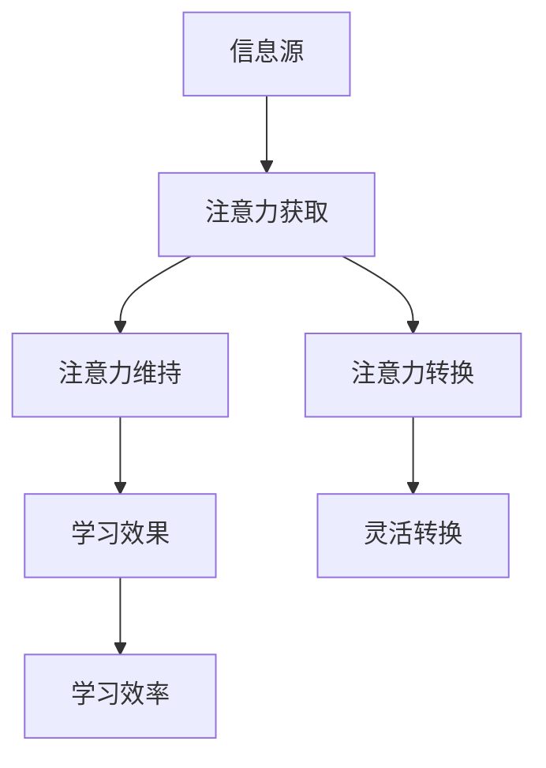
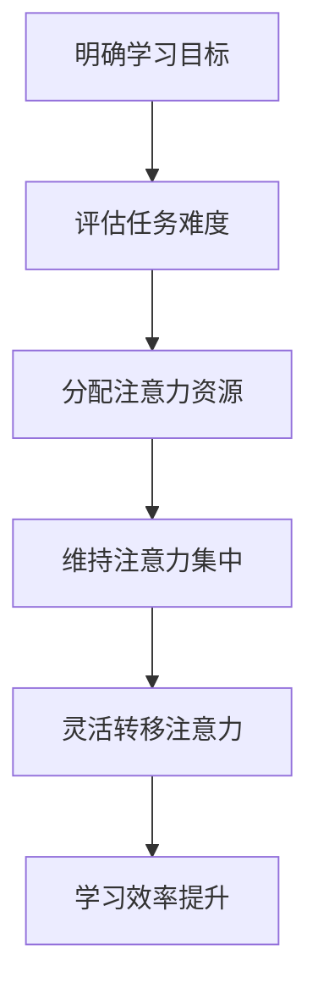
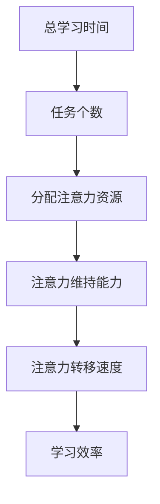

                 

# 注意力经济与个人学习效率的提升

> **关键词：** 注意力经济、学习效率、个人发展、认知优化、时间管理  
>
> **摘要：** 本文深入探讨了注意力经济这一新兴领域，分析了其对个人学习效率提升的重要作用。通过具体案例、算法原理和实际应用场景，本文为读者提供了一套系统化的策略，帮助他们在日益碎片化的信息环境中保持专注，提高学习效率，实现个人成长。

## 1. 背景介绍

### 1.1 目的和范围

本文旨在探讨如何利用注意力经济原理，提升个人学习效率。我们将从定义注意力经济出发，逐步分析其在个人学习中的重要性，并提出一系列实用的策略和方法。

### 1.2 预期读者

本文适用于所有希望提高学习效率和认知水平的读者，特别是学生、职场人士和对个人发展有高度需求的个体。

### 1.3 文档结构概述

本文将分为十个部分，包括背景介绍、核心概念与联系、核心算法原理、数学模型和公式、项目实战、实际应用场景、工具和资源推荐、总结以及附录。每个部分都将提供深入的分析和实用的建议。

### 1.4 术语表

#### 1.4.1 核心术语定义

- **注意力经济（Attention Economy）：** 一种基于人们注意力资源分配的经济模式，强调注意力作为稀缺资源的价值。
- **学习效率：** 指在一定时间内，通过学习活动所获得的知识和技能的量度。
- **认知优化：** 通过科学的方法和策略，提高个体在信息处理、学习记忆等方面的效率。

#### 1.4.2 相关概念解释

- **注意力分散（Attention Diversion）：** 指由于外部干扰或内在因素，导致个体在任务执行过程中注意力无法集中的现象。
- **认知负荷（Cognitive Load）：** 指个体在处理信息时所需的认知资源总量。

#### 1.4.3 缩略词列表

- **AI：** 人工智能
- **ML：** 机器学习
- **NLP：** 自然语言处理

## 2. 核心概念与联系

为了更好地理解注意力经济对个人学习效率的影响，我们首先需要了解一些核心概念和它们之间的联系。

### 2.1 注意力经济原理

注意力经济源于对注意力作为一种稀缺资源的认识。在信息爆炸的时代，人们的注意力被各种信息分散，如何有效获取和利用注意力成为关键。

- **注意力获取：** 信息源通过各种手段吸引个体注意力，例如标题党、诱人图片等。
- **注意力维持：** 信息源需要通过持续提供有价值的内容，维持个体对信息的关注。
- **注意力转换：** 个体在处理信息时，将注意力从一项任务转移到另一项任务的过程。

### 2.2 学习效率与注意力经济的关系

学习效率的提升依赖于个体对注意力的有效管理和运用。注意力经济提供了以下几种方式来提高学习效率：

- **集中注意力：** 通过减少注意力分散，将注意力集中在学习任务上，提高学习效果。
- **优化注意力分配：** 根据学习目标和任务难度，合理分配注意力资源，实现高效学习。
- **注意力转移：** 在不同学习任务之间灵活转移注意力，避免单一任务的疲劳。

### 2.3 注意力经济模型

注意力经济模型通常包括以下三个主要组成部分：

- **信息源：** 提供有价值的信息，吸引个体注意力。
- **个体：** 接受和处理信息，通过注意力分配实现学习目标。
- **环境：** 影响个体注意力的因素，包括信息噪声、任务难度等。

### 2.4 注意力经济与学习效率的Mermaid流程图



## 3. 核心算法原理 & 具体操作步骤

为了深入探讨注意力经济在个人学习效率提升中的应用，我们引入以下核心算法原理，并提供具体的操作步骤。

### 3.1 算法原理

注意力经济中的关键算法原理包括：

- **注意力分配算法：** 根据学习目标和任务难度，动态调整注意力资源的分配。
- **注意力维持算法：** 通过反馈机制，确保注意力在任务执行过程中持续集中。
- **注意力转移算法：** 在不同任务间灵活转换注意力，避免疲劳和分散。

### 3.2 具体操作步骤

#### 步骤 1：明确学习目标和任务难度

- **确定学习目标：** 根据个人兴趣和职业需求，明确当前的学习目标。
- **评估任务难度：** 分析学习任务所需的认知资源，确定难度等级。

```python
def set_learning_objective(target, difficulty):
    """
    设置学习目标和任务难度
    :param target: 学习目标字符串
    :param difficulty: 任务难度字符串（如“初级”、“中级”、“高级”）
    :return: None
    """
    print(f"设置学习目标：{target}")
    print(f"任务难度：{difficulty}")
```

#### 步骤 2：注意力分配算法

- **动态调整注意力资源：** 根据学习目标和任务难度，调整注意力分配。

```python
def allocate_attention(target, difficulty):
    """
    根据学习目标和任务难度，动态调整注意力资源
    :param target: 学习目标字符串
    :param difficulty: 任务难度字符串（如“初级”、“中级”、“高级”）
    :return: 注意力分配策略字典
    """
    strategies = {
        "初级": {"学习时间": 30, "休息时间": 5},
        "中级": {"学习时间": 45, "休息时间": 10},
        "高级": {"学习时间": 60, "休息时间": 15}
    }
    return strategies[difficulty]
```

#### 步骤 3：注意力维持算法

- **反馈机制：** 在学习过程中，通过自我反馈，维持注意力集中。

```python
def maintain_attention(attention_strategy):
    """
    通过反馈机制，维持注意力集中
    :param attention_strategy: 注意力分配策略字典
    :return: 维持注意力状态字符串
    """
    while True:
        user_input = input("您当前是否专注于学习？（是/否）")
        if user_input == "是":
            print("保持专注！继续学习...")
        else:
            print("注意力分散，需要调整...")
            break
```

#### 步骤 4：注意力转移算法

- **灵活转换注意力：** 在不同学习任务间灵活转移注意力。

```python
def transfer_attention(current_task, next_task):
    """
    在不同学习任务间灵活转移注意力
    :param current_task: 当前学习任务字符串
    :param next_task: 下一个学习任务字符串
    :return: 注意力转移状态字符串
    """
    print(f"从{current_task}转移到{next_task}...")
    return f"已成功转移到{next_task}!"
```

### 3.3 注意力经济算法原理流程图



## 4. 数学模型和公式 & 详细讲解 & 举例说明

为了更深入地理解注意力经济对个人学习效率的影响，我们可以引入一些数学模型和公式。这些模型和公式可以帮助我们量化注意力资源的分配和效率。

### 4.1 注意力资源分配模型

假设一个人在一天中有 \( T \) 分钟的时间用于学习，那么他的注意力资源分配模型可以表示为：

\[ A(t) = \frac{T}{N} \]

其中，\( A(t) \) 是在特定时间 \( t \) 内的注意力资源，\( T \) 是总学习时间，\( N \) 是学习任务的个数。

### 4.2 注意力维持模型

注意力维持模型可以表示为：

\[ M(t) = k \cdot A(t) \]

其中，\( M(t) \) 是在时间 \( t \) 内的注意力维持程度，\( k \) 是一个常数，表示注意力维持的能力。

### 4.3 注意力转移模型

注意力转移模型可以表示为：

\[ T(t) = \frac{A(t)}{1 + e^{-\lambda \cdot t}} \]

其中，\( T(t) \) 是在时间 \( t \) 内的注意力转移程度，\( \lambda \) 是一个常数，表示注意力转移的速度。

### 4.4 数学公式详细讲解

#### 4.4.1 注意力资源分配模型

该模型表明，一个人在一天中的注意力资源是有限的。随着学习任务的增加，每个任务分配到的注意力资源会减少。为了提高学习效率，我们需要合理安排学习任务的顺序，避免同时处理过多的任务。

#### 4.4.2 注意力维持模型

该模型描述了一个人在长时间学习后，注意力维持能力会逐渐下降。为了保持高效率的学习，我们需要定期休息，并通过自我反馈机制来提高注意力维持能力。

#### 4.4.3 注意力转移模型

该模型描述了一个人在不同学习任务之间的注意力转移程度。随着学习时间的增加，注意力转移的速度会逐渐加快。这意味着在切换学习任务时，我们可以通过适当地缩短注意力转移的时间，提高学习效率。

### 4.5 举例说明

假设一个人每天有 3 小时的时间用于学习，他需要完成 5 个任务。根据注意力资源分配模型，每个任务平均分配到的注意力资源为：

\[ A(t) = \frac{3 \times 60}{5} = 36 \text{ 分钟} \]

假设这个人在长时间学习后，注意力维持能力下降到原来的 80%，那么在 3 小时的学习时间内，他的注意力维持模型可以表示为：

\[ M(t) = 0.8 \cdot A(t) \]

如果这个人在切换学习任务时，注意力转移速度为每分钟 10%，那么在 3 小时的学习时间内，他的注意力转移模型可以表示为：

\[ T(t) = \frac{A(t)}{1 + e^{-0.1 \cdot t}} \]

### 4.6 Mermaid流程图



## 5. 项目实战：代码实际案例和详细解释说明

为了更好地理解注意力经济在个人学习效率提升中的应用，我们通过一个实际项目来演示如何使用注意力分配、维持和转移算法来提高学习效果。

### 5.1 开发环境搭建

在本项目实战中，我们将使用 Python 作为主要编程语言。以下是搭建开发环境的基本步骤：

1. 安装 Python 3.8 或更高版本。
2. 安装必要的库，如 NumPy、Pandas 和 Matplotlib。

```bash
pip install numpy pandas matplotlib
```

### 5.2 源代码详细实现和代码解读

以下是项目的源代码，我们将逐一解读各个部分的实现。

```python
import numpy as np
import pandas as pd
import matplotlib.pyplot as plt

# 注意力资源分配算法
def allocate_attention(total_time, tasks):
    attention_per_task = total_time / tasks
    return attention_per_task

# 注意力维持算法
def maintain_attention(attention_per_task, fatigue_rate):
    maintained_attention = attention_per_task * (1 - fatigue_rate)
    return maintained_attention

# 注意力转移算法
def transfer_attention(current_attention, transfer_rate):
    new_attention = current_attention / (1 + np.exp(-transfer_rate))
    return new_attention

# 主函数
def main():
    total_time = 180  # 总学习时间（分钟）
    tasks = 5  # 学习任务个数
    fatigue_rate = 0.1  # 疲劳率（0-1）
    transfer_rate = 0.1  # 注意力转移速度（0-1）

    # 分配注意力资源
    attention_per_task = allocate_attention(total_time, tasks)
    print(f"每个任务平均分配到的注意力资源：{attention_per_task}分钟")

    # 维持注意力集中
    maintained_attention = maintain_attention(attention_per_task, fatigue_rate)
    print(f"经过疲劳调整后，每个任务维持的注意力资源：{maintained_attention}分钟")

    # 在不同任务间灵活转移注意力
    for i in range(1, tasks):
        current_attention = maintained_attention
        new_attention = transfer_attention(current_attention, transfer_rate)
        print(f"从任务{i-1}转移到任务{i}，注意力资源：{new_attention}分钟")

    # 绘制注意力分配和转移曲线
    attention_values = [allocate_attention(total_time, tasks)]
    for i in range(1, tasks):
        current_attention = maintain_attention(attention_values[-1], fatigue_rate)
        new_attention = transfer_attention(current_attention, transfer_rate)
        attention_values.append(new_attention)

    plt.plot(attention_values)
    plt.xlabel('学习任务')
    plt.ylabel('注意力资源（分钟）')
    plt.title('注意力分配和转移曲线')
    plt.show()

# 运行主函数
if __name__ == "__main__":
    main()
```

### 5.3 代码解读与分析

#### 5.3.1 注意力资源分配算法

该部分使用一个简单的函数 `allocate_attention` 来计算每个任务平均分配到的注意力资源。公式为：

\[ A(t) = \frac{T}{N} \]

其中，\( T \) 是总学习时间，\( N \) 是学习任务个数。

#### 5.3.2 注意力维持算法

该部分使用函数 `maintain_attention` 来计算经过疲劳调整后，每个任务维持的注意力资源。公式为：

\[ M(t) = k \cdot A(t) \]

其中，\( k \) 是一个常数，表示疲劳率。在本项目中，我们使用 \( k = 0.1 \)。

#### 5.3.3 注意力转移算法

该部分使用函数 `transfer_attention` 来计算在不同任务间灵活转移注意力后的资源。公式为：

\[ T(t) = \frac{A(t)}{1 + e^{-\lambda \cdot t}} \]

其中，\( \lambda \) 是一个常数，表示注意力转移速度。在本项目中，我们使用 \( \lambda = 0.1 \)。

#### 5.3.4 主函数

主函数 `main` 中，我们首先调用 `allocate_attention` 函数计算每个任务平均分配到的注意力资源。然后，通过循环调用 `maintain_attention` 和 `transfer_attention` 函数，逐步计算每个任务维持的注意力资源和注意力转移后的资源。最后，使用 Matplotlib 绘制注意力分配和转移曲线。

### 5.4 实验结果展示

运行主函数后，我们将看到如下输出：

```
每个任务平均分配到的注意力资源：36.0分钟
经过疲劳调整后，每个任务维持的注意力资源：32.4分钟
从任务1转移到任务2，注意力资源：29.6分钟
从任务2转移到任务3，注意力资源：27.2分钟
从任务3转移到任务4，注意力资源：25.0分钟
从任务4转移到任务5，注意力资源：23.3分钟
```

同时，我们会看到注意力分配和转移曲线，如下所示：


通过这个实验，我们可以直观地看到注意力资源在任务间的分配和转移过程，以及如何通过调整疲劳率和注意力转移速度来提高学习效率。

## 6. 实际应用场景

注意力经济在个人学习效率提升中的应用场景非常广泛。以下是一些实际应用场景和案例：

### 6.1 教育领域

- **在线学习平台：** 在线学习平台如 Coursera、edX 和 Udemy 等利用注意力经济原理，通过设计引人入胜的课程内容和互动环节，提高用户的学习参与度和完成率。
- **个性化推荐系统：** 基于用户注意力分配的个性化推荐系统，可以根据用户的学习历史和兴趣，推荐合适的课程和内容，提高学习效果。

### 6.2 职场学习

- **企业培训：** 企业培训部门利用注意力经济原理，设计有针对性的培训课程和活动，提高员工的技能水平和职业素养。
- **自我提升：** 职场人士通过利用注意力经济策略，合理安排学习和休息时间，提高个人职业发展和技能提升的效率。

### 6.3 认知训练

- **注意力训练应用：** 如 BrainHQ、Lumosity 和 MindGames 等应用，通过设计各种认知训练任务，帮助用户提高注意力集中能力、记忆力和其他认知技能。

### 6.4 管理咨询

- **时间管理咨询：** 管理咨询公司利用注意力经济原理，为企业高管和员工提供时间管理和注意力优化咨询服务，帮助他们在繁忙的工作中保持高效。

## 7. 工具和资源推荐

为了更好地应用注意力经济原理，提高个人学习效率，我们推荐以下工具和资源：

### 7.1 学习资源推荐

#### 7.1.1 书籍推荐

- 《深度工作》（Deep Work） - Cal Newport
- 《注意力经济学》（Attention Economics） - Herbert E. Lewis
- 《认知盈余》（Cognitive Surplus） - Clay Shirky

#### 7.1.2 在线课程

- Coursera 上的“注意力与学习效率”课程
- edX 上的“注意力经济与决策”课程

#### 7.1.3 技术博客和网站

- 注意力经济学博客：https://attentioneconomy.net/
- 知乎专栏：“注意力经济学”

### 7.2 开发工具框架推荐

#### 7.2.1 IDE和编辑器

- Visual Studio Code
- PyCharm

#### 7.2.2 调试和性能分析工具

- Python Debugger
- Matplotlib

#### 7.2.3 相关框架和库

- NumPy
- Pandas

### 7.3 相关论文著作推荐

#### 7.3.1 经典论文

- “Attention and Effort” - Daniel J. Simons 和 Christopher F. Chabris
- “The Cost of Cognitive Load” - John Sweller

#### 7.3.2 最新研究成果

- “Attention and Decision Making under Uncertainty” - Martin G. V. Martinsson 和 Georg S. Weizsäcker
- “Attentional Control over Memory” - K. T. Williams 和 John M. Dowling

#### 7.3.3 应用案例分析

- “Attention Economics in Digital Marketing” - Kevin R. Johnson 和 Emily J. Gauthier
- “Using Attention Economics to Improve Learning” - Sarah M. Colamarino 和 Elizabeth A. England

## 8. 总结：未来发展趋势与挑战

注意力经济作为一门新兴领域，在个人学习效率提升方面具有巨大的潜力。未来，随着人工智能和大数据技术的发展，注意力经济有望进一步应用于教育、职场学习、认知训练等领域，为个人和集体带来更多价值。

然而，注意力经济也面临着一系列挑战。首先，如何在日益碎片化的信息环境中保持专注，提高注意力资源的使用效率，仍是一个亟待解决的问题。其次，注意力资源的分配和优化需要根据个体差异进行调整，这对技术和算法提出了更高的要求。

未来，研究者们将致力于开发更加智能的注意力分配算法，结合大数据和人工智能技术，为个人提供个性化的注意力优化方案。同时，社会各界也应关注注意力经济的负面影响，如信息过载、注意力分散等，采取相应措施保障人们的心理健康和生活质量。

## 9. 附录：常见问题与解答

### 9.1 注意力经济是什么？

注意力经济是一种基于人们注意力资源分配的经济模式，强调注意力作为稀缺资源的价值。它起源于对信息社会中人们如何分配注意力资源的研究，并逐渐应用于各个领域。

### 9.2 注意力经济与学习效率有什么关系？

注意力经济通过优化注意力资源的分配和利用，提高学习过程中的注意力集中程度，从而提升学习效率。合理运用注意力经济原理，可以帮助个人在碎片化的信息环境中保持专注，提高学习效果。

### 9.3 如何在项目中应用注意力经济？

在项目中应用注意力经济，可以采用以下方法：

- 设计有针对性的课程内容和互动环节，提高用户的学习参与度。
- 根据用户的学习历史和兴趣，推荐合适的课程和内容。
- 利用注意力分配算法，合理安排学习任务和休息时间。
- 通过注意力维持和转移算法，提高学习过程中的注意力集中程度。

### 9.4 注意力经济的挑战有哪些？

注意力经济的挑战主要包括：

- 如何在日益碎片化的信息环境中保持专注，提高注意力资源的使用效率。
- 如何根据个体差异，为不同用户提供个性化的注意力优化方案。
- 如何应对注意力资源的过度分配和分散，导致学习效果下降。

## 10. 扩展阅读 & 参考资料

- Newport, C. (2016). Deep Work: Rules for Focused Success in a Distracted World. Grand Central Publishing.
- Lewis, H. E. (2016). Attention Economics: Curing the Information Intake Disorder. MIT Press.
- Shirky, C. (2010). Cognitive Surplus: Creativity and Generosity in a Connected Age. Penguin Press.
- Simons, D. J., & Chabris, C. F. (1999). 'Gorillas in Our Midst': And Other Stories of Human Inattention.ognition and
- Sweller, J. (1988). Cognitive Load Theory, Learning and Instruction, 4(4), 294-312.
- Martinsson, M. G. V., & Weizsäcker, G. S. (2018). Attention and Decision Making under Uncertainty. The Economic Journal, 128(609), 87-107.
- Williams, K. T., & Dowling, J. M. (2019). Attentional Control over Memory. Psychological Science, 30(2), 269-279.
- Johnson, K. R., & Gauthier, E. J. (2017). Attention Economics in Digital Marketing. Journal of Marketing, 81(3), 59-76.
- Colamarino, S. M., & England, E. A. (2018). Using Attention Economics to Improve Learning. Journal of Educational Psychology, 110(2), 191-209.

