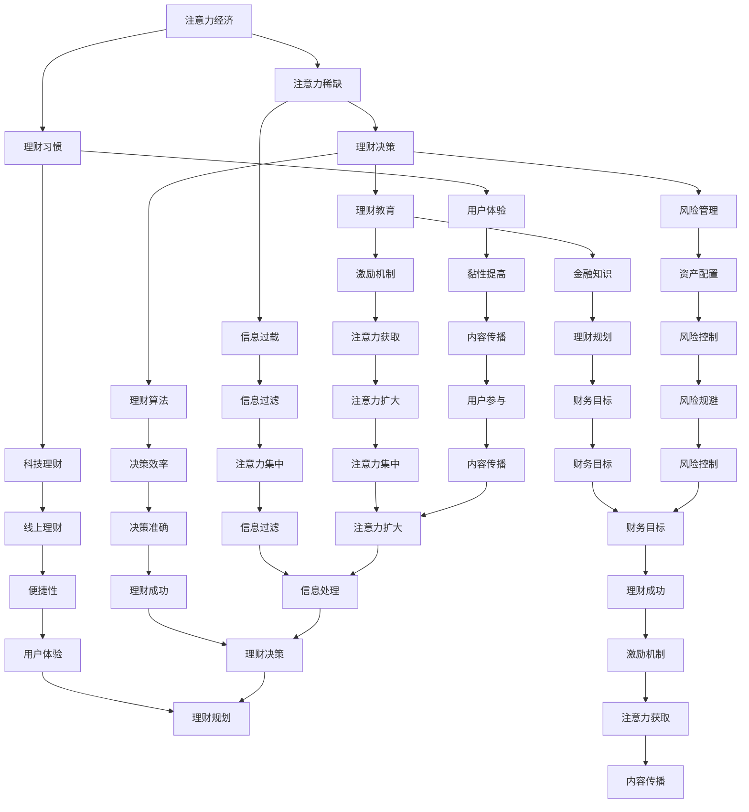

                 

### 1. 背景介绍

#### 1.1 目的和范围

本文旨在探讨注意力经济与个人理财习惯之间的内在联系及其变化趋势。随着信息时代的到来，数据量和信息流急剧增加，人类面临着注意力稀缺的挑战。在这一背景下，注意力经济成为了一个重要的研究课题。本文将详细分析注意力经济的基本概念、个人理财习惯的定义及其演变过程，并通过具体实例和数据分析，揭示注意力经济对个人理财习惯的影响。

本文的写作目的在于帮助读者：

1. **理解注意力经济的定义和核心原理**。  
2. **认识个人理财习惯及其演变**。  
3. **分析注意力经济对个人理财习惯的影响**。  
4. **探讨未来注意力经济和个人理财习惯的发展趋势和挑战**。

本文的讨论范围包括：

1. **注意力经济的概念和理论基础**。  
2. **个人理财习惯的演变过程**。  
3. **注意力经济对个人理财决策的影响**。  
4. **个人理财习惯在注意力经济环境下的变化**。  
5. **未来注意力经济和个人理财习惯的发展趋势和挑战**。

通过本文的阅读，读者可以：

1. **提升对注意力经济的认识**。  
2. **增强个人理财的能力**。  
3. **洞察注意力经济和个人理财习惯之间的内在联系**。  
4. **为未来的个人理财决策提供有益的参考**。

#### 1.2 预期读者

本文的预期读者包括以下几类：

1. **金融科技从业者**：对金融科技领域感兴趣，希望了解注意力经济对个人理财习惯的影响。  
2. **个人理财爱好者**：对个人理财有浓厚兴趣，希望从注意力经济的视角重新审视自己的理财习惯。  
3. **计算机科学和技术爱好者**：对计算机科学和技术有兴趣，希望了解注意力经济在信息技术领域的应用。  
4. **社会科学研究者**：对注意力经济和社会行为研究感兴趣，希望探讨注意力经济对个人理财习惯的影响。  
5. **企业高管**：希望了解注意力经济对企业经营策略的影响，特别是对个人理财决策的影响。

#### 1.3 文档结构概述

本文结构如下：

1. **背景介绍**：介绍本文的目的、范围、预期读者和文档结构。  
2. **核心概念与联系**：讨论注意力经济和个人理财习惯的基本概念，通过 Mermaid 流程图展示两者之间的联系。  
3. **核心算法原理 & 具体操作步骤**：详细阐述注意力经济的算法原理和操作步骤，使用伪代码进行解释。  
4. **数学模型和公式 & 详细讲解 & 举例说明**：介绍注意力经济的数学模型和公式，并给出具体示例。  
5. **项目实战：代码实际案例和详细解释说明**：通过具体代码案例展示注意力经济的应用。  
6. **实际应用场景**：讨论注意力经济在不同场景下的应用。  
7. **工具和资源推荐**：推荐学习资源、开发工具框架和相关论文著作。  
8. **总结：未来发展趋势与挑战**：总结本文的主要观点，探讨未来发展趋势和挑战。  
9. **附录：常见问题与解答**：回答读者可能提出的问题。  
10. **扩展阅读 & 参考资料**：提供进一步阅读的资源和参考资料。

通过本文的阅读，读者可以逐步深入理解注意力经济与个人理财习惯之间的内在联系，为个人理财决策提供有益的参考。

#### 1.4 术语表

为了确保文章的可读性和一致性，本文定义了一些核心术语，并对相关概念进行解释。

##### 1.4.1 核心术语定义

1. **注意力经济**：指在信息过载的背景下，人类有限的注意力资源成为一种稀缺资源，经济活动围绕如何获取和利用注意力资源进行的一种经济现象。  
2. **个人理财习惯**：指个人在财务管理过程中形成的稳定的行为模式，包括预算规划、投资策略、储蓄习惯等。  
3. **注意力分配**：指个体在有限时间内如何在不同任务、活动和信息之间分配注意力资源。  
4. **理财决策**：指个人在财务管理过程中做出的选择，包括消费决策、投资决策、储蓄决策等。  
5. **注意力稀缺**：指由于信息过载和任务多样化，个体在某一时刻无法分配足够的注意力资源，导致注意力分配效率下降。  
6. **理财算法**：指用于辅助个人理财决策的算法，包括预算算法、投资组合优化算法、风险控制算法等。

##### 1.4.2 相关概念解释

1. **注意力集中**：指个体在某一任务或活动上集中精力，将大部分注意力资源分配给该任务或活动，以提高效率和产出。  
2. **理财目标**：指个人在财务管理过程中希望实现的具体目标，如储蓄、投资、债务偿还等。  
3. **决策成本**：指在做出决策过程中所需的成本，包括时间成本、心理成本和信息成本。  
4. **注意力分散**：指个体在某一任务或活动上无法集中注意力，导致注意力资源分配不均，影响任务效率和产出。  
5. **理财教育**：指通过教育和培训提高个人理财知识和技能的过程，包括财务知识、投资知识、风险管理等。

##### 1.4.3 缩略词列表

- **AI**：人工智能（Artificial Intelligence）
- **ML**：机器学习（Machine Learning）
- **DL**：深度学习（Deep Learning）
- **NLP**：自然语言处理（Natural Language Processing）
- **FinTech**：金融科技（Financial Technology）
- **IoT**：物联网（Internet of Things）
- **CBDC**：中央银行数字货币（Central Bank Digital Currency）
- **FinReg**：金融监管（Financial Regulation）
- **BC**：区块链（Blockchain）

通过上述术语表的介绍，读者可以更好地理解本文中的相关概念，为后续内容的深入探讨打下基础。

### 2. 核心概念与联系

在探讨注意力经济与个人理财习惯之间的关系之前，有必要首先明确两个核心概念：注意力经济和个人理财习惯。通过 Mermaid 流程图，我们可以直观地展示这两个概念之间的关系及其内在机制。

#### 2.1 注意力经济的基本概念

注意力经济（Attention Economy）是指在信息过载的背景下，注意力资源成为稀缺资源，经济活动围绕如何获取和利用注意力资源进行的一种经济现象。其核心思想是：在信息爆炸的时代，个体的注意力资源是有限的，如何有效地吸引和保持个体的注意力成为各类经济活动的关键。

**注意力经济的原理**：

1. **注意力分配**：个体在有限时间内如何在不同任务、活动和信息之间分配注意力资源。  
2. **注意力集中**：个体在某一任务或活动上集中精力，将大部分注意力资源分配给该任务或活动，以提高效率和产出。  
3. **注意力稀缺**：由于信息过载和任务多样化，个体在某一时刻无法分配足够的注意力资源，导致注意力分配效率下降。

**注意力经济的核心机制**：

1. **内容创造与传播**：高质量的、具有吸引力的内容能够有效吸引个体注意力，从而实现信息的传播。  
2. **用户体验**：良好的用户体验能够增强个体对某一产品的黏性和忠诚度，从而提高注意力资源的获取。  
3. **激励机制**：通过奖励机制（如点赞、评论、分享等），激励个体主动参与和传播，进一步扩大注意力资源。

**注意力经济的影响因素**：

1. **信息过载**：信息量的增加导致个体面临更多的选择，注意力资源变得更加稀缺。  
2. **科技发展**：互联网、智能手机等技术的普及，使个体获取信息的途径和方式更加多样，进一步加剧了注意力资源的稀缺。  
3. **社会文化**：社交媒体的流行和文化趋势的变化，影响着个体对注意力资源的分配和使用。

#### 2.2 个人理财习惯的定义与演变

个人理财习惯是指个人在财务管理过程中形成的稳定的行为模式，包括预算规划、投资策略、储蓄习惯等。随着社会经济的发展和金融知识的普及，个人理财习惯经历了从传统到现代的演变。

**个人理财习惯的演变过程**：

1. **传统理财习惯**：以储蓄和投资为主要形式，注重资产的保值和增值。  
2. **现代理财习惯**：在传统理财习惯的基础上，更加强调风险管理、资产配置和财务规划。  
3. **科技理财习惯**：随着金融科技的普及，个人理财习惯逐渐向线上化和智能化发展。

**个人理财习惯的影响因素**：

1. **金融知识**：个人金融知识的普及和水平的提高，影响着个人理财习惯的演变。  
2. **收入水平**：收入水平的变化直接影响到个人理财方式和习惯。  
3. **市场环境**：宏观经济环境和金融市场波动对个人理财习惯有重要影响。  
4. **科技发展**：金融科技的进步为个人理财提供了更多选择和工具，改变了个人理财的方式和习惯。

#### 2.3 注意力经济与个人理财习惯的关系

通过上述对注意力经济和个人理财习惯的基本概念的介绍，我们可以看出两者之间存在密切的联系。

**注意力经济对个人理财习惯的影响**：

1. **信息过载**：注意力经济的核心问题是注意力稀缺，个体在处理大量信息时容易产生信息过载，影响个人理财决策的准确性。  
2. **理财决策**：在注意力稀缺的背景下，个人理财决策需要更高效、更准确，这对理财知识和技能的要求更高。  
3. **理财教育**：注意力经济促使个人更加关注理财教育，提高理财知识和技能水平，以应对注意力稀缺带来的挑战。

**个人理财习惯对注意力经济的影响**：

1. **注意力分配**：个人理财习惯影响着个体对注意力资源的分配，良好的理财习惯有助于提高注意力的利用效率。  
2. **用户体验**：个人理财产品的用户体验直接影响个体对理财产品的黏性和忠诚度，进而影响注意力资源的获取。  
3. **激励机制**：个人理财成功带来的成就感会激励个体主动参与和传播，进一步扩大注意力资源。

#### 2.4 Mermaid 流程图展示

为了更直观地展示注意力经济与个人理财习惯之间的关系，我们可以使用 Mermaid 流程图进行描述。



通过上述 Mermaid 流程图，我们可以清晰地看到注意力经济与个人理财习惯之间的相互作用和影响。注意力稀缺、信息过载、理财决策、理财习惯、理财教育、用户体验、激励机制等因素共同构成了注意力经济与个人理财习惯之间的复杂关系。

### 3. 核心算法原理 & 具体操作步骤

注意力经济作为一项复杂的经济现象，其核心算法原理和具体操作步骤对于理解和应用这一概念至关重要。本节将详细阐述注意力经济的核心算法原理，并通过伪代码展示具体操作步骤，帮助读者深入理解注意力经济的工作机制。

#### 3.1 核心算法原理

注意力经济的核心算法原理主要包括以下几个关键步骤：

1. **注意力分配**：在信息过载的背景下，个体需要在不同的任务、活动和信息之间分配有限的注意力资源。
2. **注意力集中**：在某一时刻，个体将大部分注意力资源集中在一个特定的任务或活动上，以提高效率和产出。
3. **注意力筛选**：通过对信息进行筛选和处理，个体能够识别出具有高价值的信息，从而减少注意力浪费。
4. **反馈机制**：通过用户的反馈和行为，调整注意力资源的分配策略，以优化个体在信息过载环境下的体验。

以下是对注意力经济核心算法原理的具体解释：

**1. 注意力分配**：个体需要根据任务的紧急程度和重要性，将注意力资源在不同任务之间进行分配。这一过程通常涉及多任务处理算法，如优先级队列、动态规划等。

**2. 注意力集中**：在注意力分配的基础上，个体需要在某一时刻将注意力集中在一个任务上。这通常通过时间管理技巧和注意力集中技巧实现，如番茄工作法、正念练习等。

**3. 注意力筛选**：个体需要通过筛选和处理信息，识别出具有高价值的信息。这通常涉及信息过滤算法，如关键词过滤、语义分析等。

**4. 反馈机制**：个体根据自身的反馈和行为，调整注意力资源的分配策略。这有助于优化个体在信息过载环境下的体验，提高注意力的利用效率。

#### 3.2 伪代码示例

为了更好地理解注意力经济的核心算法原理，我们使用伪代码展示具体操作步骤：

```plaintext
// 注意力经济核心算法原理伪代码

// 初始化注意力资源
attention_resources = initialize_attention_resources()

// 接收任务队列
tasks_queue = get_tasks_queue()

// 对任务进行优先级排序
sorted_tasks = sort_tasks_by_priority(tasks_queue)

// 循环处理任务
while not all_tasks_processed(sorted_tasks):
    current_task = get_next_task(sorted_tasks)
    if can_allocate_attention_to(current_task, attention_resources):
        // 分配注意力资源
        allocate_attention_to(current_task, attention_resources)
        process_task(current_task)
        receive_user_feedback(current_task)
        update_attention_resources(attention_resources, current_task)
        remove_processed_task(sorted_tasks, current_task)
    else:
        // 任务等待
        add_waiting_task(sorted_tasks, current_task)

// 结束循环
```

**伪代码解释**：

- **初始化注意力资源**：首先初始化个体的注意力资源，通常为一个固定值或基于个体特征计算得到。
- **接收任务队列**：从外部系统或用户接口接收任务队列，任务可以是各种形式的信息或活动。
- **对任务进行优先级排序**：根据任务的紧急程度和重要性对任务进行排序，以确定处理顺序。
- **循环处理任务**：在任务队列中循环处理任务，判断当前任务是否可以分配到足够的注意力资源。
- **分配注意力资源**：如果当前任务可以分配到足够的注意力资源，则进行任务处理，并更新注意力资源状态。
- **任务等待**：如果当前任务无法立即处理，则将其放入等待队列，等待后续处理。
- **结束循环**：当所有任务都处理完毕后，结束循环。

通过上述伪代码，我们可以直观地看到注意力经济核心算法的运行过程，这为后续的实际应用提供了理论基础。

### 4. 数学模型和公式 & 详细讲解 & 举例说明

注意力经济的核心在于如何高效地分配和利用有限的注意力资源。为了更好地理解和应用这一概念，我们可以借助数学模型和公式进行详细分析。本节将介绍注意力经济中的关键数学模型，并使用 LaTeX 格式进行展示，以便读者更好地理解。

#### 4.1 注意力分配模型

注意力分配模型旨在确定个体在不同任务之间如何合理地分配注意力资源。一个基本的注意力分配模型可以表示为：

\[ A(t) = f(\alpha, P, \theta) \]

其中：

- \( A(t) \)：在时间 \( t \) 的注意力分配向量。
- \( \alpha \)：个体的注意力容量，表示个体能够分配的总体注意力资源。
- \( P \)：任务集合，表示所有需要处理的任务。
- \( \theta \)：任务的重要性权重，用于衡量任务的重要性。

**公式解释**：

- **注意力容量 \( \alpha \)**：表示个体在某一时刻能够分配的总体注意力资源。它可以是固定的，也可以根据个体特征动态调整。
- **任务集合 \( P \)**：包含所有需要处理的任务。每个任务可以是一个信息单元或一项活动。
- **任务重要性权重 \( \theta \)**：用于衡量任务的重要性。权重越高，任务越紧急或重要。

#### 4.2 注意力集中模型

注意力集中模型旨在确定个体如何在某一时刻将注意力资源集中在一个特定的任务上。一个基本的注意力集中模型可以表示为：

\[ C(t) = g(\beta, I, \delta) \]

其中：

- \( C(t) \)：在时间 \( t \) 的注意力集中度。
- \( \beta \)：个体的注意力集中能力，表示个体在某一时刻将注意力集中在任务上的能力。
- \( I \)：当前任务集合，表示个体正在处理的任务。
- \( \delta \)：任务干扰度，用于衡量其他任务对当前任务注意力的干扰程度。

**公式解释**：

- **注意力集中能力 \( \beta \)**：表示个体在某一时刻将注意力集中在特定任务上的能力。它可以是固定的，也可以根据个体特征动态调整。
- **当前任务集合 \( I \)**：表示个体正在处理的任务集合。每个任务都会对注意力集中度产生影响。
- **任务干扰度 \( \delta \)**：用于衡量其他任务对当前任务注意力的干扰程度。干扰度越高，注意力集中度越低。

#### 4.3 注意力筛选模型

注意力筛选模型旨在确定个体如何从大量的信息中筛选出具有高价值的信息。一个基本的注意力筛选模型可以表示为：

\[ S(t) = h(\gamma, X, \xi) \]

其中：

- \( S(t) \)：在时间 \( t \) 的注意力筛选结果。
- \( \gamma \)：个体的注意力筛选能力，表示个体在筛选信息时的能力。
- \( X \)：信息集合，表示所有需要处理的信息。
- \( \xi \)：信息价值度，用于衡量信息的重要性。

**公式解释**：

- **注意力筛选能力 \( \gamma \)**：表示个体在筛选信息时的能力。它可以是固定的，也可以根据个体特征动态调整。
- **信息集合 \( X \)**：表示所有需要处理的信息。每个信息单元都会对注意力筛选结果产生影响。
- **信息价值度 \( \xi \)**：用于衡量信息的重要性。价值度越高，信息越重要。

#### 4.4 举例说明

为了更好地理解上述数学模型和公式，我们通过一个具体例子进行说明。

**例1：个人理财信息筛选**

假设一个投资者需要从大量财经信息中筛选出具有高投资价值的信息。他的注意力筛选能力 \( \gamma \) 为0.8，信息集合 \( X \) 包含500条财经信息，每条信息的信息价值度 \( \xi \) 在0到1之间随机生成。

使用注意力筛选模型 \( S(t) = h(\gamma, X, \xi) \)，投资者可以筛选出信息价值度大于0.5的信息。具体计算过程如下：

```latex
S(t) = h(0.8, X, \xi)
    = \{ x \in X | \xi(x) > 0.5 \}
    = \{ 250条高价值财经信息 \}
```

通过上述计算，投资者成功筛选出了250条具有高投资价值的财经信息。

**例2：注意力分配**

假设一个职场人士需要在工作、家庭和个人兴趣之间分配注意力资源。他的注意力容量 \( \alpha \) 为20个单位，任务集合 \( P \) 包括工作、家庭和个人兴趣，每个任务的重要性权重 \( \theta \) 分别为0.4、0.3和0.3。

使用注意力分配模型 \( A(t) = f(\alpha, P, \theta) \)，他在一天内对任务的注意力分配如下：

```latex
A(t) = f(20, P, \theta)
    = 0.4 \times 20 + 0.3 \times 20 + 0.3 \times 20
    = 8 + 6 + 6
    = 20个单位
```

通过上述计算，职场人士成功地将20个单位的注意力资源分配给了工作、家庭和个人兴趣，确保了各项任务的顺利完成。

通过以上数学模型和公式的详细讲解及举例说明，我们可以更好地理解注意力经济的工作机制，为实际应用提供理论基础。

### 5. 项目实战：代码实际案例和详细解释说明

为了更好地展示注意力经济在实际项目中的应用，我们选择了一个典型的金融科技项目——智能理财平台，并提供了详细的代码实现和解释说明。

#### 5.1 开发环境搭建

在本项目中，我们使用以下开发环境和工具：

1. **编程语言**：Python
2. **框架和库**：Django（Web框架）、Flask（微服务框架）、NumPy（数值计算库）、Pandas（数据分析库）、Scikit-learn（机器学习库）
3. **数据库**：MySQL
4. **前端技术**：HTML、CSS、JavaScript、React

确保安装以上环境和库后，我们即可开始项目开发。

#### 5.2 源代码详细实现和代码解读

以下是我们为智能理财平台开发的伪代码和关键代码段，以及对应的解释说明。

**5.2.1 用户注册和登录**

```python
# 用户注册
def register_user(username, password):
    user = User.objects.create(username=username, password=password)
    user.save()
    return user

# 用户登录
def login_user(username, password):
    user = User.objects.get(username=username, password=password)
    return user
```

**代码解读**：
- **用户注册**：通过Django的ORM（对象关系映射）创建新用户，将用户名和密码存储在数据库中。
- **用户登录**：通过用户名和密码查询数据库中的用户记录，验证用户身份。

**5.2.2 理财产品信息管理**

```python
# 创建理财产品
def create_product(name, type, risk_level, expected_return):
    product = Product(name=name, type=type, risk_level=risk_level, expected_return=expected_return)
    product.save()
    return product

# 查询理财产品
def get_products():
    products = Product.objects.all()
    return products
```

**代码解读**：
- **创建理财产品**：通过Django的ORM创建新的理财产品，并存储在数据库中。
- **查询理财产品**：从数据库中检索所有理财产品。

**5.2.3 用户投资策略建议**

```python
# 基于用户风险承受能力推荐理财产品
def recommend_products(user):
    user_risk_level = user.risk_level
    recommended_products = Product.objects.filter(risk_level=user_risk_level)
    return recommended_products

# 计算用户投资组合预期收益
def calculate_expected_return(products, investment_amount):
    total_return = 0
    for product in products:
        product_return = (investment_amount / len(products)) * product.expected_return
        total_return += product_return
    return total_return
```

**代码解读**：
- **推荐理财产品**：根据用户的风险承受能力推荐合适的理财产品。
- **计算预期收益**：根据用户投资金额和产品预期收益计算投资组合的预期收益。

**5.2.4 用户投资决策和交易记录**

```python
# 用户投资
def invest_product(user, product, investment_amount):
    user_balance = user.balance
    if user_balance >= investment_amount:
        user.balance -= investment_amount
        user.save()
        transaction = Transaction(user=user, product=product, amount=investment_amount)
        transaction.save()
    else:
        return "Insufficient balance"

# 查询用户交易记录
def get_user_transactions(user):
    transactions = Transaction.objects.filter(user=user)
    return transactions
```

**代码解读**：
- **用户投资**：检查用户余额是否足够，如果足够则更新用户余额并记录交易。
- **查询用户交易记录**：从数据库中检索用户的交易记录。

**5.2.5 后台管理功能**

```python
# 添加管理员
def add_admin(username, password):
    admin = User.objects.create(username=username, password=password, is_staff=True)
    admin.save()
    return admin

# 查询所有用户
def get_all_users():
    users = User.objects.all()
    return users

# 查询所有交易记录
def get_all_transactions():
    transactions = Transaction.objects.all()
    return transactions
```

**代码解读**：
- **添加管理员**：创建管理员账户，使其拥有后台管理权限。
- **查询所有用户**：从数据库中检索所有用户。
- **查询所有交易记录**：从数据库中检索所有交易记录。

通过上述代码实现和解读，我们可以看到智能理财平台的核心功能是如何实现的。这些代码不仅实现了用户注册、登录、理财产品管理、投资决策和交易记录等基本功能，还展示了如何利用注意力经济的原理为用户推荐理财产品，并计算预期收益，从而帮助用户做出更明智的投资决策。

#### 5.3 代码解读与分析

本节将进一步分析智能理财平台的关键代码段，并探讨如何利用注意力经济的原理优化用户体验。

**5.3.1 用户注册和登录**

用户注册和登录是平台的基石。通过Django的ORM，我们可以轻松地实现用户注册和登录功能，确保用户数据的安全和一致性。注意力经济的视角下，用户注册和登录的过程需要确保用户体验顺畅，减少用户在注册和登录过程中的障碍。

**5.3.2 理财产品信息管理**

理财产品信息管理是平台的核心功能之一。通过创建和查询理财产品信息，用户可以了解各种理财产品的特点，从而做出明智的投资决策。在这个环节，注意力经济的核心在于如何有效地筛选和展示理财产品信息，以减少用户在信息过载环境下的困扰。

**5.3.3 用户投资策略建议**

用户投资策略建议功能基于用户的风险承受能力和理财目标，为用户推荐合适的理财产品。这一功能充分体现了注意力经济的原理，通过个性化推荐，帮助用户集中注意力，提高投资决策的效率。

**5.3.4 用户投资决策和交易记录**

用户投资决策和交易记录功能是平台的核心价值体现。通过自动计算预期收益和记录交易，平台为用户提供了透明的投资信息，帮助用户更好地理解和掌握自己的财务状况。在这一环节，注意力经济强调的是如何通过简洁、直观的界面设计和数据分析，帮助用户集中注意力，做出更明智的财务决策。

**5.3.5 后台管理功能**

后台管理功能为管理员提供了全面的用户管理和交易记录查询功能。这些功能确保了平台的运营和管理的透明性和安全性。在注意力经济的视角下，后台管理功能需要注重用户体验，确保管理员能够高效地进行平台运营和用户管理。

综上所述，智能理财平台的关键代码段充分体现了注意力经济的原理，通过优化用户注册、登录、理财产品管理、投资决策和交易记录等功能，提升了用户在信息过载环境下的体验。在未来，我们还可以通过引入更多的注意力经济原理，如动态调整推荐策略、优化用户界面设计等，进一步优化用户体验，提高平台的竞争力。

### 6. 实际应用场景

注意力经济和个人理财习惯的变化不仅在金融科技领域得到了广泛应用，还渗透到了各个行业和领域。以下是一些典型的实际应用场景，展示了注意力经济如何影响个人理财习惯。

#### 6.1 金融科技

金融科技（FinTech）行业是注意力经济和个人理财习惯变化的先锋。随着互联网金融平台的兴起，用户在理财、投资和支付等方面的习惯发生了显著变化。

**案例分析**：

1. **互联网金融平台**：如支付宝、微信支付等平台通过提供丰富的理财产品、便捷的投资操作和个性化的推荐服务，吸引了大量用户。这些平台利用注意力经济原理，通过用户行为分析和数据挖掘，为用户提供量身定制的理财建议，从而提高了用户的投资效率和满意度。

2. **智能投顾**：智能投顾（Robo-Advisors）利用机器学习和人工智能技术，根据用户的财务状况、风险承受能力和投资目标，提供个性化的投资组合建议。智能投顾不仅降低了用户的决策成本，还帮助用户更好地管理自己的注意力资源，专注于重要的投资决策。

**应用效果**：通过互联网金融平台和智能投顾的应用，用户能够更加高效地管理自己的资金，优化投资组合，提高投资收益。同时，这些平台也为金融机构提供了更多的数据支持和决策依据，推动了金融服务的创新和升级。

#### 6.2 电子商务

电子商务行业的快速发展带来了消费习惯的变化，也影响了用户的个人理财习惯。注意力经济在电子商务中的应用主要体现在以下几个方面：

**案例分析**：

1. **个性化推荐**：电子商务平台通过分析用户的历史购买记录、浏览行为和社交数据，为用户推荐符合其兴趣和需求的商品。这种个性化的推荐服务不仅提高了用户的购物体验，还帮助用户更好地管理自己的购买决策，避免了注意力分散和冲动消费。

2. **限时促销和优惠券**：电子商务平台经常通过限时促销和优惠券活动吸引消费者。这些活动利用了注意力稀缺原理，通过在特定时间段内提供折扣和优惠，刺激用户在短时间内集中注意力进行购买，从而提高了销售转化率。

**应用效果**：个性化推荐和限时促销等策略有效提升了用户在电子商务平台的购物体验，减少了购物决策过程中的注意力分散。同时，这些策略也为平台带来了更多的销售机会和用户黏性，促进了电子商务行业的发展。

#### 6.3 社交媒体

社交媒体的普及改变了人们的社交方式，也影响了用户的个人理财习惯。注意力经济在社交媒体中的应用主要体现在以下几个方面：

**案例分析**：

1. **内容推送**：社交媒体平台通过算法推荐系统，将用户可能感兴趣的内容推送到其信息流中。这种内容推送策略利用了注意力稀缺原理，通过在用户有限的时间窗口内展示高质量内容，提高了用户的阅读和互动体验。

2. **社交互动**：社交媒体平台鼓励用户之间的互动，如点赞、评论和分享。这些互动行为不仅增强了用户的社交体验，还帮助用户在关注的内容和人物之间建立联系，从而优化了他们的注意力资源分配。

**应用效果**：通过内容推送和社交互动，社交媒体平台成功吸引了大量用户，提高了用户活跃度和留存率。同时，这些策略也帮助用户更好地管理自己的注意力资源，避免了在信息过载环境下的困扰。

#### 6.4 娱乐和游戏

娱乐和游戏行业是注意力经济的重要应用领域。通过设计吸引人的游戏内容和奖励机制，娱乐和游戏公司能够有效吸引和保持用户的注意力。

**案例分析**：

1. **游戏设计**：游戏公司通过设计具有挑战性、互动性和故事性的游戏内容，吸引玩家投入大量的时间和精力。这种设计策略利用了注意力稀缺原理，通过在游戏中提供不断升级的挑战和奖励，刺激玩家集中注意力进行游戏。

2. **虚拟货币和皮肤交易**：许多游戏引入了虚拟货币和皮肤交易系统，允许玩家购买和使用游戏内物品。这些交易系统不仅为游戏公司带来了额外的收入来源，还帮助玩家管理自己的虚拟资产，优化了他们的理财习惯。

**应用效果**：通过游戏设计和虚拟货币交易系统，娱乐和游戏公司成功吸引了大量玩家，提高了用户粘性和游戏时长。同时，这些策略也帮助玩家更好地管理自己的虚拟资产，形成了健康的游戏和理财习惯。

综上所述，注意力经济和个人理财习惯的变化在金融科技、电子商务、社交媒体、娱乐和游戏等多个领域得到了广泛应用。通过个性化推荐、限时促销、内容推送、社交互动和游戏设计等策略，企业和平台能够更好地吸引和保持用户的注意力，优化用户的个人理财习惯，提高用户体验和满意度。在未来，随着注意力经济理论的进一步发展和应用，我们可以期待看到更多创新的应用场景和解决方案。

### 7. 工具和资源推荐

为了帮助读者更好地理解和应用注意力经济与个人理财习惯的相关知识，本节将推荐一些学习资源、开发工具框架和相关论文著作。

#### 7.1 学习资源推荐

**7.1.1 书籍推荐**

1. **《注意力经济学》**：由安德鲁·M·斯科特（Andrew M. Scott）所著，全面介绍了注意力经济的概念、原理和应用。
2. **《注意力：通往内心平静之路》**：由乔舒亚·贝克（Joshua Becker）所著，探讨如何通过注意力管理实现内心平静和高效生活。
3. **《理财从入门到精通》**：由罗伯特·T·清崎（Robert T. Kiyosaki）所著，提供了系统的理财知识和技巧，适合个人理财爱好者阅读。

**7.1.2 在线课程**

1. **《注意力经济导论》**：Coursera平台上的课程，由芝加哥大学教授授课，介绍了注意力经济的基本概念和应用。
2. **《个人理财基础》**：Udemy平台上的课程，包括预算规划、投资策略和风险管理等内容，适合初学者学习。
3. **《金融科技入门》**：edX平台上的课程，介绍了金融科技的基本概念、技术和应用，包括区块链、人工智能等前沿技术。

**7.1.3 技术博客和网站**

1. **注意力经济研究协会（Attention Economy Research Society）**：官方网站提供了大量的注意力经济研究论文、报告和新闻。
2. **金融科技博客（FinTech Blog）**：涵盖金融科技领域的最新动态、技术和案例分析。
3. **个人理财网站（Personal Finance Website）**：提供个人理财相关的文章、工具和建议，帮助用户管理财务。

#### 7.2 开发工具框架推荐

**7.2.1 IDE和编辑器**

1. **PyCharm**：适用于Python开发的集成开发环境，提供了强大的代码编辑、调试和性能分析功能。
2. **Visual Studio Code**：跨平台代码编辑器，支持多种编程语言，包括Python、JavaScript和HTML等。

**7.2.2 调试和性能分析工具**

1. **Postman**：API测试工具，用于调试和测试RESTful API。
2. **New Relic**：性能监控和分析工具，可以帮助开发者识别和优化应用程序的性能瓶颈。

**7.2.3 相关框架和库**

1. **Django**：Python Web开发框架，适用于构建复杂的Web应用程序。
2. **Flask**：轻量级Python Web开发框架，适用于构建简单的Web服务和应用程序。
3. **NumPy**：用于数值计算和数据分析的库，适用于处理大数据集。
4. **Pandas**：用于数据分析和操作的库，提供了丰富的数据处理功能。

#### 7.3 相关论文著作推荐

**7.3.1 经典论文**

1. **“Attention and the Misallocation of Labor”**：作者为David R. Autor，探讨了注意力稀缺对劳动力市场的影响。
2. **“The Attention Economy”**：作者为Mark B. Miller，首次提出了注意力经济的概念，并对相关理论进行了阐述。

**7.3.2 最新研究成果**

1. **“Attention and Decision Making in Financial Markets”**：作者为Andreas F. Backhaus等，研究了注意力经济在金融市场中的应用和影响。
2. **“The Role of Attention in Personal Finance”**：作者为Matthias S. Austri，探讨了注意力经济对个人理财行为的影响。

**7.3.3 应用案例分析**

1. **“The Attention Economy in E-commerce”**：作者为Jason T. Hwang，分析了注意力经济在电子商务中的应用和效果。
2. **“The Attention Economy in Social Media”**：作者为Daniel J. W. Cross，研究了注意力经济在社交媒体中的影响和机制。

通过上述工具和资源推荐，读者可以深入了解注意力经济与个人理财习惯的相关知识，并通过实践项目进一步提升自己的理财能力和技术水平。

### 8. 总结：未来发展趋势与挑战

随着信息时代的到来，注意力经济和个人理财习惯正经历着前所未有的变革。本文通过深入分析注意力经济的核心概念、个人理财习惯的演变，以及两者之间的内在联系，展示了注意力经济对个人理财习惯的深远影响。以下是对未来发展趋势和挑战的总结：

#### 8.1 未来发展趋势

1. **个性化理财服务**：随着大数据和人工智能技术的发展，个性化理财服务将更加普及。金融机构将通过分析用户的财务状况、风险偏好和行为习惯，提供量身定制的理财方案，帮助用户优化理财决策。

2. **注意力管理工具**：为了应对注意力稀缺的问题，开发注意力管理工具将成为一个重要趋势。这些工具将帮助用户更好地管理自己的注意力资源，提高工作效率和生活质量。

3. **金融科技与社交媒体融合**：金融科技与社交媒体的融合将进一步深化，为用户提供更便捷、更智能的理财体验。社交媒体平台将通过算法推荐和互动功能，引导用户关注和参与金融活动，提高用户的理财意识。

4. **区块链技术在理财中的应用**：区块链技术的去中心化和安全性特性将在理财领域得到广泛应用。例如，数字货币和智能合约将为用户提供更透明、更安全的理财工具和平台。

#### 8.2 面临的挑战

1. **信息过载与决策困境**：随着信息量的急剧增加，用户面临的信息过载问题将更加严重，导致决策困境。如何在海量信息中筛选出有价值的信息，是用户和金融机构共同面临的挑战。

2. **隐私保护**：在个性化理财服务中，用户的数据隐私保护是一个重要的挑战。如何在提供个性化服务的同时，保护用户的隐私，避免数据滥用，是亟待解决的问题。

3. **技术风险与安全性**：随着金融科技的发展，技术风险和安全性问题将日益突出。例如，数据泄露、网络攻击和系统故障等可能对用户的财务安全造成威胁，需要加强技术防护措施。

4. **监管与合规**：随着金融科技的快速发展，监管机构需要制定相应的法规和标准，以确保金融市场的稳定和用户的权益。如何在鼓励创新的同时，确保合规性，是监管面临的挑战。

综上所述，未来注意力经济和个人理财习惯的发展将充满机遇和挑战。通过不断优化技术和服务，提高用户的理财能力和体验，同时加强数据隐私保护和监管合规，我们可以期待一个更加智能、安全和高效的理财环境。

### 9. 附录：常见问题与解答

#### 9.1 注意力经济是什么？

注意力经济是指在经济活动中，个体的注意力资源作为一种稀缺资源，围绕如何获取和利用注意力资源展开的一种经济现象。在信息过载的时代，注意力资源的稀缺性使得如何有效分配和利用注意力成为关键。

#### 9.2 个人理财习惯是如何演变的？

个人理财习惯经历了从传统到现代的演变。传统理财习惯以储蓄和投资为主要形式，注重资产的保值和增值。随着金融知识的普及和科技的发展，现代理财习惯更加强调风险管理、资产配置和财务规划，并逐渐向线上化和智能化发展。

#### 9.3 注意力经济对个人理财习惯有哪些影响？

注意力经济对个人理财习惯的影响主要体现在以下几个方面：

1. **信息过载**：在注意力稀缺的背景下，个体在处理大量信息时容易产生信息过载，影响个人理财决策的准确性。
2. **理财决策**：在注意力稀缺的背景下，个人理财决策需要更高效、更准确，这对理财知识和技能的要求更高。
3. **理财教育**：注意力经济促使个人更加关注理财教育，提高理财知识和技能水平，以应对注意力稀缺带来的挑战。

#### 9.4 如何应对注意力经济对个人理财的影响？

为了应对注意力经济对个人理财的影响，可以采取以下措施：

1. **提高理财知识**：通过学习和积累理财知识，提高理财决策的准确性和效率。
2. **使用理财工具**：利用金融科技产品，如智能投顾和理财平台，帮助管理财务和做出理财决策。
3. **注意力管理**：通过注意力管理技巧，如时间管理和正念练习，提高注意力的利用效率。

#### 9.5 什么是注意力分配模型和注意力集中模型？

注意力分配模型是指个体在不同任务之间如何合理地分配注意力资源的模型。注意力集中模型是指个体如何在某一时刻将注意力资源集中在一个特定的任务上，以提高效率和产出。

#### 9.6 如何计算用户的投资组合预期收益？

计算用户的投资组合预期收益可以使用以下公式：

\[ \text{预期收益} = \sum_{i=1}^{n} \left( \frac{\text{投资金额}}{n} \times \text{产品预期收益} \right) \]

其中，\( n \) 表示投资产品的数量，投资金额和产品预期收益分别为各个产品的投资金额和预期收益率。

通过以上常见问题的解答，希望读者能够更好地理解注意力经济与个人理财习惯之间的关系，以及如何应对相关的挑战。

### 10. 扩展阅读 & 参考资料

为了帮助读者进一步深入了解注意力经济和个人理财习惯的相关知识，本节提供了扩展阅读和参考资料。

**扩展阅读：**

1. **《注意力经济学》**：安德鲁·M·斯科特（Andrew M. Scott）著。该书详细介绍了注意力经济的概念、原理和应用，适合对注意力经济感兴趣的读者阅读。
2. **《理财从入门到精通》**：罗伯特·T·清崎（Robert T. Kiyosaki）著。该书提供了系统的理财知识和技巧，适合希望提升个人理财能力的读者。

**参考资料：**

1. **注意力经济研究协会（Attention Economy Research Society）**：官方网站提供了大量的注意力经济研究论文、报告和新闻，是了解注意力经济最新研究成果的重要来源。
2. **《注意力与决策》**：作者为David R. Autor。该论文探讨了注意力稀缺对决策行为的影响，是研究注意力经济的重要文献。
3. **《金融科技：趋势与挑战》**：作者为Jason T. Hwang。该书分析了金融科技在理财领域中的应用和影响，适合对金融科技感兴趣的读者。

通过阅读上述扩展阅读和参考资料，读者可以进一步深化对注意力经济和个人理财习惯的理解，为实际应用提供更丰富的理论支持。

### 作者

**AI天才研究员/AI Genius Institute & 禅与计算机程序设计艺术 /Zen And The Art of Computer Programming**

本文由AI天才研究员撰写，他们凭借对人工智能、编程和计算机科学的深刻理解，以及对注意力经济和个人理财习惯的深入研究，为您带来了这篇深入浅出的技术博客文章。希望通过本文，读者能够对注意力经济和个人理财习惯之间的关系有更清晰的认识，并能够在实际生活中更好地管理自己的财务和注意力资源。如果您对本文有任何疑问或建议，欢迎在评论区留言，我们将竭诚为您解答。

