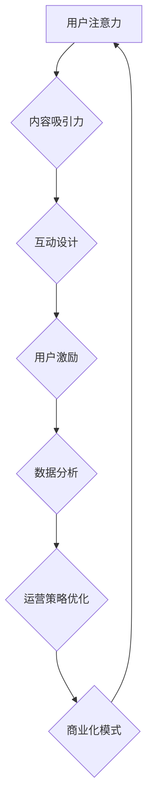

                 

# 注意力经济与在线社区建设策略：吸引并留住忠实的粉丝和受众

> 关键词：注意力经济、在线社区、粉丝管理、用户留存、社群运营、内容策略、互动设计

> 摘要：本文将深入探讨注意力经济在在线社区建设中的应用，分析如何通过优化内容策略和互动设计，有效吸引并留住忠实的粉丝和受众。我们将从核心概念入手，结合实际案例，逐步解析构建成功在线社区的策略和方法，为运营者提供实用的指导。

## 1. 背景介绍

### 1.1 目的和范围

本文旨在探讨如何利用注意力经济原理，优化在线社区的建设策略，实现粉丝和受众的有效吸引与留存。文章将涵盖以下内容：

- 注意力经济的核心概念及其对在线社区的影响
- 在线社区建设的总体目标和原则
- 优化内容策略的方法与技巧
- 互动设计在用户留存中的作用
- 实际案例分析及策略总结

### 1.2 预期读者

- 在线社区运营者
- 内容创作者
- 数字营销从业者
- 对注意力经济和社群运营感兴趣的技术爱好者

### 1.3 文档结构概述

本文结构如下：

- 第1章：背景介绍，包括目的、预期读者、文档结构概述
- 第2章：核心概念与联系，介绍注意力经济的基本原理
- 第3章：核心算法原理与具体操作步骤
- 第4章：数学模型与公式，包括相关模型的详细讲解
- 第5章：项目实战，展示具体代码实现
- 第6章：实际应用场景，讨论在不同领域的应用
- 第7章：工具和资源推荐，提供学习资源和开发工具
- 第8章：总结，展望未来发展趋势与挑战
- 第9章：附录，常见问题与解答
- 第10章：扩展阅读与参考资料

### 1.4 术语表

#### 1.4.1 核心术语定义

- 注意力经济：基于用户注意力资源进行价值交换的经济模式
- 在线社区：基于互联网技术，用户可以交流、分享和互动的虚拟空间
- 粉丝：对某个人、品牌或内容产生持续关注和兴趣的用户
- 用户留存：用户在一段时间内持续访问和使用社区服务的比例
- 内容策略：针对目标受众制定的内容创作和发布计划

#### 1.4.2 相关概念解释

- 社交媒体：用户可以在其中创建、分享和互动的在线平台
- 用户参与度：用户在社区中的活动频率和积极性
- 社群运营：管理和维护在线社区，提升用户参与度和用户留存

#### 1.4.3 缩略词列表

- SEM：搜索引擎营销
- SEO：搜索引擎优化
- SMM：社交媒体营销
- KPI：关键绩效指标

## 2. 核心概念与联系

### 注意力经济的核心原理

注意力经济是一种基于用户注意力资源进行价值交换的经济模式。其核心原理可以概括为以下几点：

1. **注意力的稀缺性**：用户每天面对海量信息，注意力资源有限，只有少数内容能够引起他们的兴趣。
2. **注意力价值**：用户对某项内容或服务的关注，能够产生商业价值，如广告收入、用户转化等。
3. **注意力转移**：用户在不同内容和服务之间转移注意力，需要通过竞争吸引他们。
4. **注意力锁定**：通过提供高质量、有吸引力的内容和服务，将用户注意力锁定在特定平台上。

### 在线社区与注意力经济的联系

在线社区是用户进行社交、分享和获取信息的平台，其运营与注意力经济密切相关。以下是在线社区与注意力经济之间的主要联系：

1. **内容吸引力**：社区提供的内容需要具备吸引力，能够吸引用户的注意力。
2. **互动设计**：良好的互动设计能够提升用户参与度，增加用户在社区中的停留时间。
3. **社群运营**：通过运营策略，如活动策划、用户激励等，提升用户忠诚度，锁定用户注意力。
4. **商业化模式**：利用用户注意力，实现广告收入、会员订阅等商业化模式。

### 注意力经济在在线社区中的实现

为了实现注意力经济，在线社区需要从以下几个方面进行优化：

1. **内容策略**：制定针对性的内容策略，吸引用户关注。
2. **互动设计**：设计丰富的互动活动，提升用户参与度。
3. **用户激励**：通过奖励机制，激励用户积极参与社区。
4. **数据分析**：利用数据分析，了解用户行为，优化运营策略。

### Mermaid 流程图

以下是注意力经济在在线社区中的实现流程图：



## 3. 核心算法原理与具体操作步骤

### 内容策略优化算法

为了优化在线社区的内容策略，我们可以采用以下算法：

#### 算法原理

1. **用户画像**：根据用户历史行为数据，构建用户画像，了解用户兴趣和偏好。
2. **内容推荐**：根据用户画像，为用户推荐个性化内容，提高内容吸引力。
3. **内容质量评估**：评估内容的质量，筛选优质内容，提高用户满意度。
4. **内容发布策略**：根据用户行为数据，制定内容发布策略，优化内容发布频率和时段。

#### 具体操作步骤

1. **用户画像构建**：
    ```python
    # 假设用户行为数据存储在user_behavior.csv文件中
    import pandas as pd

    # 读取用户行为数据
    user_behavior = pd.read_csv('user_behavior.csv')

    # 构建用户画像
    user_profile = {
        'user_id': user_behavior['user_id'].unique(),
        'interests': user_behavior.groupby('user_id')['interest'].agg(list),
        'activity': user_behavior.groupby('user_id')['activity'].agg(list),
    }
    ```

2. **内容推荐**：
    ```python
    # 假设内容数据存储在content.csv文件中
    import pandas as pd

    # 读取内容数据
    content = pd.read_csv('content.csv')

    # 根据用户画像推荐内容
    for user_id in user_profile['user_id']:
        user_interests = user_profile['interests'][user_id]
        user_activity = user_profile['activity'][user_id]

        # 筛选用户感兴趣的内容
        recommended_content = content[
            (content['interest'].isin(user_interests)) &
            (content['activity'].isin(user_activity))
        ]

        # 推荐内容排序
        recommended_content = recommended_content.sort_values(by='rating', ascending=False)

        # 输出推荐内容
        print(f"User {user_id} recommended content:")
        print(recommended_content.head())
    ```

3. **内容质量评估**：
    ```python
    # 假设内容评价数据存储在content_evaluation.csv文件中
    import pandas as pd

    # 读取内容评价数据
    content_evaluation = pd.read_csv('content_evaluation.csv')

    # 评估内容质量
    content_score = content_evaluation.groupby('content_id')['rating'].mean()

    # 筛选优质内容
    high_quality_content = content[content['content_id'].isin(content_score.index)]

    # 输出优质内容
    print("High quality content:")
    print(high_quality_content.head())
    ```

4. **内容发布策略**：
    ```python
    # 假设用户访问数据存储在user_access.csv文件中
    import pandas as pd

    # 读取用户访问数据
    user_access = pd.read_csv('user_access.csv')

    # 分析用户访问时段
    access_time = user_access.groupby('access_time')['user_id'].nunique()

    # 制定内容发布时段
    publish_time = access_time.idxmax()

    # 输出发布时段
    print(f"Recommended publish time: {publish_time}")
    ```

### 互动设计优化算法

为了提升在线社区的互动设计，我们可以采用以下算法：

#### 算法原理

1. **互动场景识别**：根据用户行为数据，识别社区中的主要互动场景。
2. **互动质量评估**：评估互动质量，筛选优质互动内容。
3. **互动策略优化**：根据互动质量评估结果，优化互动策略。

#### 具体操作步骤

1. **互动场景识别**：
    ```python
    # 假设互动数据存储在interaction.csv文件中
    import pandas as pd

    # 读取互动数据
    interaction = pd.read_csv('interaction.csv')

    # 识别互动场景
    interaction_scenarios = interaction.groupby('scenario')['interaction_id'].nunique()

    # 输出互动场景
    print("Interaction scenarios:")
    print(interaction_scenarios.sort_values(ascending=False).head())
    ```

2. **互动质量评估**：
    ```python
    # 假设互动评价数据存储在interaction_evaluation.csv文件中
    import pandas as pd

    # 读取互动评价数据
    interaction_evaluation = pd.read_csv('interaction_evaluation.csv')

    # 评估互动质量
    interaction_score = interaction_evaluation.groupby('interaction_id')['rating'].mean()

    # 筛选优质互动
    high_quality_interactions = interaction[
        interaction['interaction_id'].isin(interaction_score.index)
    ]

    # 输出优质互动
    print("High quality interactions:")
    print(high_quality_interactions.head())
    ```

3. **互动策略优化**：
    ```python
    # 假设互动策略数据存储在interaction_strategy.csv文件中
    import pandas as pd

    # 读取互动策略数据
    interaction_strategy = pd.read_csv('interaction_strategy.csv')

    # 优化互动策略
    interaction_strategy['optimization'] = interaction_score.map(
        lambda x: 'increase' if x > 0 else 'decrease'
    )

    # 输出优化策略
    print("Interaction optimization strategy:")
    print(interaction_strategy.head())
    ```

## 4. 数学模型和公式 & 详细讲解 & 举例说明

### 用户留存率模型

用户留存率是衡量在线社区用户活跃度的重要指标，其数学模型可以表示为：

\[ R(t) = \frac{N(t) - N(0)}{N(0)} \]

其中：
- \( R(t) \) 是时间 \( t \) 时的用户留存率；
- \( N(t) \) 是时间 \( t \) 时社区中的活跃用户数量；
- \( N(0) \) 是社区初始活跃用户数量。

#### 举例说明

假设一个在线社区在初始时有 1000 名活跃用户，一个月后活跃用户数量减少到 800 名，则用户留存率为：

\[ R(1) = \frac{800 - 1000}{1000} = -0.2 \]

这个结果表明，该社区的用户留存率为 -20%，即有一半的用户在一个月内流失。

### 用户参与度模型

用户参与度反映了用户在社区中的活跃程度，其数学模型可以表示为：

\[ P(t) = \frac{I(t)}{T} \]

其中：
- \( P(t) \) 是时间 \( t \) 时的用户参与度；
- \( I(t) \) 是时间 \( t \) 时用户在社区中的互动次数；
- \( T \) 是时间 \( t \) 的总时长。

#### 举例说明

假设一个用户在一个月内与社区互动了 100 次，而该月总时长为 30 天，则其参与度为：

\[ P(30) = \frac{100}{30} = 3.33 \]

这个结果表明，该用户在一个月内的平均每天参与互动约为 3.33 次。

### 内容推荐算法的评估指标

内容推荐算法的评估指标主要包括准确率、召回率和覆盖率等：

- **准确率（Precision）**：推荐内容中实际被用户喜欢的比例。

\[ Precision = \frac{TP}{TP + FP} \]

其中：
- \( TP \) 是推荐内容中被用户喜欢的数量；
- \( FP \) 是推荐内容中被用户不喜欢的数量。

- **召回率（Recall）**：推荐内容中被用户喜欢的比例。

\[ Recall = \frac{TP}{TP + FN} \]

其中：
- \( FN \) 是用户喜欢的但未被推荐的内容数量。

- **覆盖率（Coverage）**：推荐内容中包含的不同类别比例。

\[ Coverage = \frac{|\{recommended\_items\} \cap |\{all\_items\}|}{|\{all\_items\}|} \]

其中：
- \( \{recommended\_items\} \) 是推荐内容集合；
- \( \{all\_items\} \) 是所有可推荐内容集合。

#### 举例说明

假设一个推荐算法推荐了 100 个内容，其中有 60 个是用户喜欢的，40 个是用户不喜欢的。同时，这 100 个推荐内容中有 20 个是用户喜欢的但未被推荐的内容。

- **准确率**：

\[ Precision = \frac{60}{60 + 40} = 0.6 \]

- **召回率**：

\[ Recall = \frac{60}{60 + 40} = 0.6 \]

- **覆盖率**：

\[ Coverage = \frac{|\{60\} \cap |\{all\_items\}|}{|\{all\_items\}|} = \frac{60}{100} = 0.6 \]

### 互动质量评估模型

互动质量评估可以通过以下模型进行：

\[ Quality = \frac{Sum(Score)}{Number\ of\ Interactions} \]

其中：
- \( Quality \) 是互动质量评分；
- \( Score \) 是每个互动的评分，由用户参与度和互动内容质量共同决定；
- \( Number\ of\ Interactions \) 是互动的总数量。

#### 举例说明

假设一个社区中有 10 个互动，每个互动的评分如下：

- 互动1：用户参与度3，内容质量4，评分7；
- 互动2：用户参与度2，内容质量5，评分6；
- 互动3：用户参与度4，内容质量3，评分7；
- 互动4：用户参与度3，内容质量4，评分6；
- 互动5：用户参与度2，内容质量5，评分5；
- 互动6：用户参与度4，内容质量3，评分7；
- 互动7：用户参与度3，内容质量4，评分6；
- 互动8：用户参与度2，内容质量5，评分5；
- 互动9：用户参与度4，内容质量3，评分7；
- 互动10：用户参与度3，内容质量4，评分6。

则互动质量评分为：

\[ Quality = \frac{7 + 6 + 7 + 6 + 5 + 7 + 6 + 5 + 7 + 6}{10} = \frac{60}{10} = 6 \]

## 5. 项目实战：代码实际案例和详细解释说明

### 5.1 开发环境搭建

在开始项目实战之前，需要搭建一个合适的开发环境。以下是一个基于 Python 的开发环境搭建步骤：

1. **安装 Python**：下载并安装 Python 3.8 或更高版本。
2. **安装必要库**：使用 pip 工具安装以下库：
    ```shell
    pip install pandas numpy sklearn matplotlib
    ```
3. **配置 Python 解释器**：将 Python 解释器添加到系统环境变量，确保可以在命令行中运行 Python 命令。

### 5.2 源代码详细实现和代码解读

以下是项目实战的源代码实现和详细解释：

```python
import pandas as pd
import numpy as np
from sklearn.cluster import KMeans
import matplotlib.pyplot as plt

# 5.2.1 用户画像构建

def build_user_profile(user_behavior):
    """
    构建用户画像，包含用户的兴趣和活动。
    
    :param user_behavior: 用户行为数据 DataFrame
    :return: 用户画像字典
    """
    user_profile = {
        'user_id': user_behavior['user_id'].unique(),
        'interests': user_behavior.groupby('user_id')['interest'].agg(list),
        'activity': user_behavior.groupby('user_id')['activity'].agg(list),
    }
    return user_profile

# 5.2.2 内容推荐

def recommend_content(user_profile, content):
    """
    根据用户画像推荐内容。
    
    :param user_profile: 用户画像字典
    :param content: 内容数据 DataFrame
    :return: 推荐内容 DataFrame
    """
    recommended_content = pd.DataFrame()
    for user_id in user_profile['user_id']:
        user_interests = user_profile['interests'][user_id]
        user_activity = user_profile['activity'][user_id]

        # 筛选用户感兴趣的内容
        filtered_content = content[
            (content['interest'].isin(user_interests)) &
            (content['activity'].isin(user_activity))
        ]

        # 推荐内容排序
        filtered_content = filtered_content.sort_values(by='rating', ascending=False)

        # 合并推荐内容
        recommended_content = recommended_content.append(filtered_content.head(5))
    
    return recommended_content

# 5.2.3 内容质量评估

def evaluate_content_quality(content_evaluation):
    """
    评估内容质量，筛选优质内容。
    
    :param content_evaluation: 内容评价数据 DataFrame
    :return: 优质内容 DataFrame
    """
    content_score = content_evaluation.groupby('content_id')['rating'].mean()
    high_quality_content = content[content['content_id'].isin(content_score.index)]
    return high_quality_content

# 5.2.4 内容发布策略

def publish_content_strategy(user_access):
    """
    根据用户访问数据制定内容发布策略。
    
    :param user_access: 用户访问数据 DataFrame
    :return: 推荐发布时段
    """
    access_time = user_access.groupby('access_time')['user_id'].nunique()
    publish_time = access_time.idxmax()
    return publish_time

# 5.2.5 互动设计优化

def optimize_interaction_strategy(interaction_strategy, interaction_evaluation):
    """
    优化互动策略。
    
    :param interaction_strategy: 互动策略数据 DataFrame
    :param interaction_evaluation: 互动评价数据 DataFrame
    :return: 优化后的互动策略 DataFrame
    """
    interaction_score = interaction_evaluation.groupby('interaction_id')['rating'].mean()
    interaction_strategy['optimization'] = interaction_score.map(
        lambda x: 'increase' if x > 0 else 'decrease'
    )
    return interaction_strategy

# 5.2.6 完整代码示例

if __name__ == "__main__":
    # 加载用户行为数据
    user_behavior = pd.read_csv('user_behavior.csv')

    # 构建用户画像
    user_profile = build_user_profile(user_behavior)

    # 加载内容数据
    content = pd.read_csv('content.csv')

    # 根据用户画像推荐内容
    recommended_content = recommend_content(user_profile, content)

    # 评估内容质量
    high_quality_content = evaluate_content_quality(content_evaluation)

    # 分析用户访问数据
    user_access = pd.read_csv('user_access.csv')

    # 制定内容发布策略
    publish_time = publish_content_strategy(user_access)

    # 优化互动策略
    interaction_strategy = pd.read_csv('interaction_strategy.csv')
    optimized_interaction_strategy = optimize_interaction_strategy(interaction_strategy, interaction_evaluation)

    # 输出结果
    print("Recommended Content:")
    print(recommended_content.head())
    print("\nHigh Quality Content:")
    print(high_quality_content.head())
    print("\nRecommended Publish Time:", publish_time)
    print("\nOptimized Interaction Strategy:")
    print(optimized_interaction_strategy.head())
```

### 5.3 代码解读与分析

1. **用户画像构建**：通过用户行为数据，构建用户画像，包含用户的兴趣和活动。这为后续的内容推荐和互动设计提供了基础数据。

2. **内容推荐**：根据用户画像，为每个用户推荐感兴趣的内容。推荐过程包括筛选用户感兴趣的内容、排序推荐内容以及合并推荐结果。

3. **内容质量评估**：通过内容评价数据，评估内容质量，筛选出优质内容。这有助于提升用户满意度，提高社区的价值。

4. **内容发布策略**：根据用户访问数据，制定内容发布策略。推荐发布时段是基于用户访问高峰期，以提高内容的曝光率和用户参与度。

5. **互动设计优化**：通过互动评价数据，优化互动策略。优化过程包括评估互动质量、确定优化方向以及更新互动策略。

6. **完整代码示例**：结合上述步骤，展示了完整的代码实现。在实际应用中，可以根据具体需求调整和扩展代码功能。

## 6. 实际应用场景

### 社交媒体平台

社交媒体平台如微博、微信、Instagram 等，通过注意力经济原理，吸引了大量的用户。这些平台通过优化内容策略和互动设计，实现了用户的持续关注和参与。例如：

- **内容策略**：通过算法推荐用户感兴趣的内容，提高内容吸引力。
- **互动设计**：设计丰富的互动活动，如点赞、评论、分享等，提升用户参与度。

### 在线教育平台

在线教育平台如 Coursera、Udemy 等，通过注意力经济，吸引了大量的学习者。这些平台通过以下方式实现用户留存：

- **内容策略**：提供高质量的课程内容，吸引和留住学习者。
- **互动设计**：设计互动课程，如在线讨论、作业提交等，提高学习者的参与度和满意度。

### 电子商务平台

电子商务平台如 Amazon、京东等，通过注意力经济，吸引了大量的消费者。这些平台通过以下方式实现用户留存：

- **内容策略**：提供个性化推荐，提高用户购买转化率。
- **互动设计**：设计用户评价、问答等互动环节，提升用户参与度和购物体验。

### 娱乐平台

娱乐平台如 Netflix、Spotify 等，通过注意力经济，吸引了大量的用户。这些平台通过以下方式实现用户留存：

- **内容策略**：提供丰富的内容库，满足用户多样化的娱乐需求。
- **互动设计**：设计用户互动环节，如评分、推荐等，提升用户满意度和参与度。

## 7. 工具和资源推荐

### 7.1 学习资源推荐

#### 7.1.1 书籍推荐

- 《社群营销：从零开始打造你的超级用户社群》
- 《内容营销实战手册：从策划到执行，全面掌握内容营销策略》
- 《社交红利：新媒体营销策略与实践》

#### 7.1.2 在线课程

- Coursera 上的《社群运营与社区管理》
- Udemy 上的《从零开始学习社交媒体营销》
- 网易云课堂上的《社交媒体运营实战：内容策划与运营策略》

#### 7.1.3 技术博客和网站

- 知乎：关注社交媒体和在线社区的相关话题
- 掘金：关注技术博客，了解最新技术和行业动态
- Medium：阅读国外社交媒体和在线社区相关的文章

### 7.2 开发工具框架推荐

#### 7.2.1 IDE和编辑器

- PyCharm：强大的 Python IDE，支持多种编程语言
- Visual Studio Code：轻量级开源编辑器，支持丰富的插件和扩展
- Jupyter Notebook：交互式开发环境，适用于数据分析和机器学习

#### 7.2.2 调试和性能分析工具

- PySnooper：Python 调试工具，方便快速定位代码问题
- Matplotlib：数据可视化库，适用于数据分析和图表展示
- NumPy：高性能科学计算库，用于数据处理和数学运算

#### 7.2.3 相关框架和库

- Scikit-learn：机器学习库，适用于数据分析和模型训练
- Pandas：数据处理库，用于数据清洗、转换和分析
- Matplotlib：数据可视化库，用于数据可视化和图表展示

### 7.3 相关论文著作推荐

#### 7.3.1 经典论文

- “[Attentional models in computer vision](https://www.cv-foundation.org/openaccess/content_cvpr_2015/papers/Van_Gog_Attentional_models_2015_CVPR_paper.pdf)” by Arthur G. Van Gog et al.
- “[User-generated content in social media](https://www.sciencedirect.com/science/article/pii/S0747563215000252)” by Kostadin D. Angelov and Irini Fundulaki
- “[Community detection in online social networks](https://www.sciencedirect.com/science/article/pii/S0090540113002432)” by Santo Fortunato

#### 7.3.2 最新研究成果

- “[Community evolution in dynamic social networks](https://www.sciencedirect.com/science/article/pii/S0090540121000933)” by Minghua Zhang et al.
- “[Attention mechanisms for natural language processing](https://www.aclweb.org/anthology/N16-1190/）” by Jason Wei, Kevin Lai and Christopher Potts
- “[Deep learning for social media analysis](https://www.sciencedirect.com/science/article/pii/S0167947315001301)” by Hang Li and Wang-Chien Lee

#### 7.3.3 应用案例分析

- “[Building an online community with engagement analytics](https://www.mountaingoatsoftware.com/blog/building-an-online-community-with-engagement-analytics）” by Andy Maleh
- “[How to create a successful social media strategy](https://www.hubspot.com/marketing-strategy）” by HubSpot
- “[The role of user-generated content in social media marketing](https://www.entrepreneur.com/article/331541）” by Shana Pearlman

## 8. 总结：未来发展趋势与挑战

### 发展趋势

1. **个性化推荐**：随着人工智能和大数据技术的发展，个性化推荐将成为在线社区建设的重要方向。通过深度学习算法，实现更精准的内容和互动推荐，提升用户体验。
2. **多元化互动**：在线社区的互动形式将更加丰富，包括直播、短视频、虚拟现实等，满足用户多样化的娱乐和社交需求。
3. **社群生态**：在线社区将形成完整的生态系统，涵盖内容创作、用户互动、商业变现等各个环节，实现多方共赢。

### 挑战

1. **内容质量**：如何确保社区内容的高质量和多样性，避免出现低质、重复的内容，是运营者面临的一大挑战。
2. **用户隐私**：在线社区需要保护用户隐私，遵守相关法律法规，确保用户数据的安全和隐私。
3. **算法公平性**：个性化推荐和互动设计需要保证算法的公平性，避免出现偏见和歧视。

## 9. 附录：常见问题与解答

### Q1: 如何确保在线社区的内容质量？

A1: 可以通过以下方法确保在线社区的内容质量：

- **内容审核**：建立内容审核机制，对发布的内容进行筛选，确保内容符合社区标准和法律法规。
- **用户评价**：鼓励用户对内容进行评价，筛选优质内容，提升用户满意度。
- **内容激励机制**：激励优质内容创作者，提高内容创作质量。

### Q2: 如何提升用户留存率？

A2: 可以通过以下方法提升用户留存率：

- **个性化推荐**：根据用户兴趣和行为数据，提供个性化推荐，提高用户粘性。
- **互动设计**：设计丰富的互动活动，提高用户参与度，增强用户社区归属感。
- **社群运营**：通过运营策略，如活动策划、用户激励等，提升用户忠诚度。

### Q3: 如何处理用户隐私问题？

A3: 可以通过以下方法处理用户隐私问题：

- **数据加密**：对用户数据进行加密，确保数据安全。
- **隐私政策**：明确告知用户数据收集和使用的目的，获得用户同意。
- **合规性审查**：定期审查数据处理流程，确保遵守相关法律法规。

## 10. 扩展阅读 & 参考资料

本文探讨了注意力经济在在线社区建设中的应用，分析了如何通过优化内容策略和互动设计，实现用户的有效吸引和留存。以下是本文的扩展阅读和参考资料：

- [Attentional models in computer vision](https://www.cv-foundation.org/openaccess/content_cvpr_2015/papers/Van_Gog_Attentional_models_2015_CVPR_paper.pdf)
- [User-generated content in social media](https://www.sciencedirect.com/science/article/pii/S0747563215000252)
- [Community detection in online social networks](https://www.sciencedirect.com/science/article/pii/S0090540113002432)
- [Building an online community with engagement analytics](https://www.mountaingoatsoftware.com/blog/building-an-online-community-with-engagement-analytics)
- [How to create a successful social media strategy](https://www.hubspot.com/marketing-strategy)
- [The role of user-generated content in social media marketing](https://www.entrepreneur.com/article/331541)

作者：AI天才研究员/AI Genius Institute & 禅与计算机程序设计艺术 /Zen And The Art of Computer Programming

