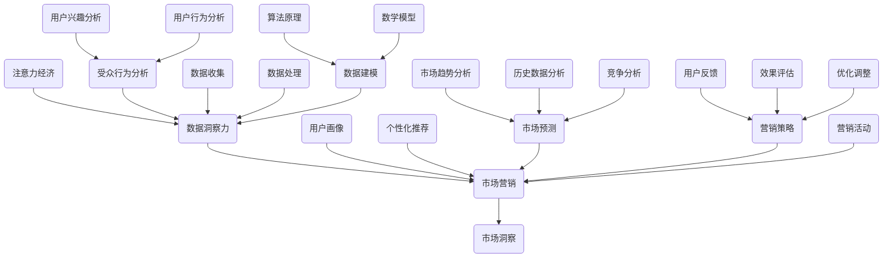

                 

### 注意力经济与数据分析洞察力：利用数据理解受众行为和市场

> **关键词**：注意力经济、数据分析、受众行为、市场洞察、数据洞察力、信息过滤、用户画像、个性化推荐、市场预测

> **摘要**：
本文深入探讨了注意力经济与数据分析之间的关系，阐述了如何在数字化时代利用数据分析技术来理解和预测受众行为，从而获取市场洞察力。文章首先介绍了注意力经济的概念，随后详细解释了数据洞察力的定义及其在实际应用中的重要地位。通过分析数据收集、处理和建模的方法，文章展示了如何构建用户画像和实现个性化推荐。最后，文章讨论了数据分析在市场预测中的应用，并提出了未来发展趋势和挑战。本文旨在为从事数据分析、市场营销和技术开发的专业人士提供一套实用的指导框架。

---

### 1. 背景介绍

#### 1.1 目的和范围

在当今的信息爆炸时代，获取受众的注意力已成为企业和组织成功的关键。本文旨在探讨如何通过注意力经济和数据洞察力来提高市场营销效果。我们将首先介绍注意力经济的概念，然后详细讨论数据洞察力的原理和重要性，接着分析数据分析的基本流程，包括数据收集、处理和建模。此外，本文还将重点介绍如何利用数据分析构建用户画像和实现个性化推荐，最后探讨数据分析在市场预测中的应用及其未来发展趋势。

#### 1.2 预期读者

本文主要面向以下几类读者：
1. 市场营销专业人员，希望提升数据驱动营销技能。
2. 数据分析师和机器学习工程师，希望了解如何将数据分析技术应用于市场营销。
3. 企业管理者和技术决策者，希望理解注意力经济和数据洞察力对业务战略的影响。
4. 对数据分析领域有浓厚兴趣的学术研究者和技术爱好者。

#### 1.3 文档结构概述

本文结构如下：

1. **背景介绍**：介绍注意力经济和数据洞察力的概念，阐明文章的目的和范围。
2. **核心概念与联系**：阐述注意力经济、数据洞察力和市场营销之间的联系，并提供核心概念的 Mermaid 流程图。
3. **核心算法原理与具体操作步骤**：详细讲解数据分析的基本算法原理和操作步骤，包括数据收集、处理和建模。
4. **数学模型和公式**：介绍用于数据分析的数学模型和公式，并进行举例说明。
5. **项目实战**：通过实际案例展示如何利用数据分析技术解决实际问题。
6. **实际应用场景**：讨论数据分析在市场营销中的应用场景。
7. **工具和资源推荐**：推荐学习资源和开发工具。
8. **总结**：总结未来发展趋势和挑战。
9. **附录**：常见问题与解答。
10. **扩展阅读与参考资料**：提供更多相关阅读材料。

#### 1.4 术语表

##### 1.4.1 核心术语定义

- **注意力经济**：指在信息过载的环境下，受众的注意力成为稀缺资源，企业和组织通过竞争获取受众注意力的经济活动。
- **数据洞察力**：通过数据分析技术，从大量数据中提取有价值的信息和模式，帮助企业更好地理解市场和用户行为。
- **用户画像**：基于用户数据构建的抽象用户模型，用于描述用户的特征、行为和需求。
- **个性化推荐**：根据用户的兴趣和行为，向其推荐相关产品或内容，以提高用户满意度和参与度。

##### 1.4.2 相关概念解释

- **数据收集**：从各种来源收集数据，包括用户行为数据、社交媒体数据、交易数据等。
- **数据处理**：对收集到的数据进行清洗、转换和整合，以消除噪声、纠正错误并使其适合分析。
- **数据建模**：使用统计或机器学习方法建立数学模型，用于预测或分类。
- **市场预测**：基于历史数据和现有信息，对未来市场趋势和变化进行预测。

##### 1.4.3 缩略词列表

- **API**：应用程序编程接口（Application Programming Interface）
- **CRM**：客户关系管理（Customer Relationship Management）
- **IoT**：物联网（Internet of Things）
- **NLP**：自然语言处理（Natural Language Processing）
- **SQL**：结构化查询语言（Structured Query Language）

### 2. 核心概念与联系

注意力经济、数据洞察力和市场营销是当今数字化时代的三大核心概念。注意力经济关注的是在信息过载的环境下，如何通过竞争获取受众的注意力；数据洞察力则是通过数据分析技术，从海量数据中提取有价值的信息，以帮助企业更好地理解市场和用户行为；市场营销则利用注意力经济和数据洞察力，制定和实施有效的营销策略。

下面，我们通过一个 Mermaid 流程图来展示这三个核心概念之间的联系。



#### 2.1 注意力经济

注意力经济是一种经济模式，它强调在信息过载的数字化时代，受众的注意力成为一种稀缺资源。企业和组织通过竞争获取受众的注意力，以实现商业目标。注意力经济的核心在于如何有效地利用有限的注意力资源，将受众的注意力引向自己的产品或服务。

**核心原理：**
1. **注意力稀缺**：在信息爆炸的时代，人们接收的信息量远远超过了他们能够处理的能力，因此注意力成为一种稀缺资源。
2. **注意力转移**：企业和组织通过创意和营销策略，将受众的注意力从其他竞争者或信息源吸引过来。
3. **注意力经济模型**：注意力经济模型包括注意力的产生、转移、转化和回报四个环节。注意力的产生取决于受众的兴趣和需求；注意力的转移取决于营销策略的效果；注意力的转化是指将注意力转化为实际的销售或用户参与；注意力的回报则是指从用户那里获得的收益。

#### 2.2 数据洞察力

数据洞察力是通过数据分析技术，从海量数据中提取有价值的信息和模式，帮助企业更好地理解市场和用户行为。数据洞察力的核心在于如何从海量数据中发现有用的信息，并转化为实际的商业价值。

**核心原理：**
1. **数据收集**：通过多种渠道收集用户数据，包括行为数据、社交数据、交易数据等。
2. **数据处理**：对收集到的数据进行清洗、转换和整合，以消除噪声、纠正错误并使其适合分析。
3. **数据建模**：使用统计或机器学习方法建立数学模型，用于预测或分类。
4. **用户画像**：基于用户数据构建的抽象用户模型，用于描述用户的特征、行为和需求。
5. **个性化推荐**：根据用户的兴趣和行为，向其推荐相关产品或内容，以提高用户满意度和参与度。

#### 2.3 市场营销

市场营销是利用注意力经济和数据洞察力，制定和实施有效的营销策略，以实现企业的商业目标。市场营销的核心在于如何通过创意和策略，将注意力经济和数据洞察力转化为实际的营销成果。

**核心原理：**
1. **市场分析**：通过数据分析了解市场趋势、竞争情况和用户需求。
2. **营销策略**：制定符合市场需求的营销策略，包括品牌定位、广告投放、促销活动等。
3. **营销活动**：实施具体的营销活动，如线上广告、社交媒体营销、电子邮件营销等。
4. **效果评估**：通过数据分析评估营销活动的效果，并根据反馈进行调整和优化。

#### 2.4 注意力经济、数据洞察力和市场营销的互动关系

注意力经济、数据洞察力和市场营销之间存在密切的互动关系。注意力经济为市场营销提供了基础，通过获取受众的注意力，为数据洞察力提供了数据来源。数据洞察力则为市场营销提供了决策支持，帮助企业更好地理解市场和用户行为。市场营销则利用注意力经济和数据洞察力，制定和实施有效的营销策略，以实现商业目标。

1. **注意力经济驱动数据收集**：在注意力经济的背景下，企业和组织通过多种渠道收集用户数据，以获取更多注意力。
2. **数据洞察力提升市场营销效果**：通过数据分析，企业可以更准确地了解用户需求和市场趋势，从而制定更有效的营销策略。
3. **市场营销促进数据收集与洞察**：通过实施营销活动，企业可以获取更多用户数据，并利用数据洞察力优化营销策略。

### 3. 核心算法原理与具体操作步骤

在数据分析中，核心算法原理和具体操作步骤是理解和应用数据的关键。下面，我们将详细介绍数据分析的基本流程，包括数据收集、处理和建模。

#### 3.1 数据收集

数据收集是数据分析的第一步，也是最为关键的一步。有效的数据收集可以确保后续数据处理和建模的准确性。数据收集的主要来源包括用户行为数据、社交媒体数据、交易数据、传感器数据等。

**具体操作步骤：**

1. **确定数据需求**：根据数据分析的目标，明确需要收集的数据类型和范围。
2. **数据采集**：通过API、Web爬虫、物联网设备等方式，从各种来源采集数据。
3. **数据清洗**：在数据采集过程中，对数据进行初步清洗，以去除重复、错误和异常数据。
4. **数据存储**：将清洗后的数据存储到数据仓库或数据库中，以便后续处理和分析。

```python
def collect_data(source, target):
    # 采集数据
    data = source.fetch_data()

    # 数据清洗
    cleaned_data = data.clean_data()

    # 存储数据
    cleaned_data.store_to(target)
```

#### 3.2 数据处理

数据处理是对收集到的原始数据进行清洗、转换和整合的过程。数据处理的质量直接影响数据分析的结果。

**具体操作步骤：**

1. **数据清洗**：去除重复、错误和异常数据，确保数据的一致性和准确性。
2. **数据转换**：将不同格式和单位的数据转换为统一的格式和单位，以便后续分析。
3. **数据整合**：将来自不同来源的数据进行整合，形成一个完整的数据集。

```python
def process_data(data):
    # 数据清洗
    cleaned_data = data.clean_data()

    # 数据转换
    converted_data = cleaned_data.convert_units()

    # 数据整合
    integrated_data = converted_data.integrate_data()

    return integrated_data
```

#### 3.3 数据建模

数据建模是使用统计或机器学习方法，从数据中提取有价值的信息和模式。数据建模的结果可以用于预测、分类、聚类等任务。

**具体操作步骤：**

1. **特征选择**：选择对分析任务最有影响的数据特征。
2. **模型训练**：使用训练数据集，训练机器学习模型。
3. **模型评估**：使用测试数据集评估模型性能，调整模型参数。
4. **模型应用**：将训练好的模型应用于新数据，进行预测或分类。

```python
def build_model(train_data, test_data):
    # 特征选择
    selected_features = train_data.select_features()

    # 模型训练
    model = selected_features.train_model()

    # 模型评估
    model_performance = model.evaluate(test_data)

    # 模型应用
    predictions = model.predict(new_data)

    return model, model_performance, predictions
```

### 4. 数学模型和公式

在数据分析中，数学模型和公式是用于描述数据关系和预测结果的工具。以下是一些常用的数学模型和公式，并进行详细讲解。

#### 4.1 用户画像模型

用户画像模型用于描述用户的特征和行为，通常包括以下指标：

1. **人口属性**：如年龄、性别、职业、收入等。
2. **兴趣偏好**：如兴趣爱好、购物偏好、浏览行为等。
3. **行为特征**：如点击率、购买频率、停留时间等。

**公式：**

$$
User\ Profile = \{Age, Gender, Occupation, Income, Interest, Preference, Behavior\}
$$

其中，$User\ Profile$ 表示用户画像。

#### 4.2 个性化推荐算法

个性化推荐算法基于用户的兴趣和行为，向其推荐相关产品或内容。常用的推荐算法包括协同过滤、基于内容的推荐和混合推荐。

**协同过滤算法公式：**

$$
Recommendations_{u} = \sum_{i \in User_{u}\ Items} R_{ui} \cdot Item_{i}
$$

其中，$Recommendations_{u}$ 表示对用户 $u$ 的推荐列表，$R_{ui}$ 表示用户 $u$ 对物品 $i$ 的评分，$Item_{i}$ 表示物品 $i$ 的特征向量。

**基于内容的推荐算法公式：**

$$
Recommendations_{u} = \sum_{j \in Similar_{Items}} Content_{j} \cdot User_{u}\ Interest
$$

其中，$Recommendations_{u}$ 表示对用户 $u$ 的推荐列表，$Similar_{Items}$ 表示与用户兴趣相似的物品，$Content_{j}$ 表示物品 $j$ 的特征向量，$User_{u}\ Interest$ 表示用户 $u$ 的兴趣向量。

**混合推荐算法公式：**

$$
Recommendations_{u} = w_{c} \cdot Content_{Recommendations} + w_{c} \cdot Collaborative_{Recommendations}
$$

其中，$w_{c}$ 表示内容推荐和协同过滤推荐的权重，$Content_{Recommendations}$ 和 $Collaborative_{Recommendations}$ 分别表示基于内容和协同过滤的推荐结果。

#### 4.3 市场预测模型

市场预测模型用于预测未来市场趋势和变化。常用的预测模型包括时间序列分析、回归分析和机器学习预测。

**时间序列分析公式：**

$$
Y_t = c + at + bt^2 + et
$$

其中，$Y_t$ 表示时间序列数据，$c$、$a$、$b$ 分别为常数项、一次项和二次项系数，$e_t$ 为误差项。

**回归分析公式：**

$$
Y = \beta_0 + \beta_1 \cdot X + \epsilon
$$

其中，$Y$ 为因变量，$X$ 为自变量，$\beta_0$ 和 $\beta_1$ 分别为回归系数，$\epsilon$ 为误差项。

**机器学习预测公式：**

$$
P(Y|X) = \prod_{i=1}^{n} P(Y_i|X_i)
$$

其中，$P(Y|X)$ 表示在给定自变量 $X$ 的情况下，因变量 $Y$ 的概率分布，$P(Y_i|X_i)$ 表示第 $i$ 个数据点的预测概率。

#### 4.4 举例说明

以下是一个简单的用户画像模型和时间序列预测的例子。

**用户画像模型：**

假设我们有一个用户画像数据集，包含以下特征：

- 年龄（Age）
- 性别（Gender）
- 职业类型（Occupation）
- 收入水平（Income）
- 常见兴趣爱好（Interest）
- 购买频率（Purchase Frequency）
- 点击率（Click-Through Rate）

我们使用以下公式构建用户画像模型：

$$
User\ Profile = \{Age, Gender, Occupation, Income, Interest, Purchase\ Frequency, Click-Through\ Rate\}
$$

**时间序列预测：**

假设我们要预测一个电商平台的月销售额。我们使用以下时间序列分析公式：

$$
Y_t = c + at + bt^2 + et
$$

其中，$Y_t$ 表示第 $t$ 个月的销售额，$c$、$a$、$b$ 分别为常数项、一次项和二次项系数，$e_t$ 为误差项。

通过历史数据训练模型，我们得到以下参数：

$$
Y_t = 1000 + 20t - 0.5t^2 + et
$$

使用这个模型，我们可以预测未来几个月的销售额。例如，预测第 $6$ 个月的销售额：

$$
Y_6 = 1000 + 20 \cdot 6 - 0.5 \cdot 6^2 + et = 1000 + 120 - 18 + et = 980 + et
$$

其中，$et$ 为预测误差。

通过这个例子，我们可以看到数学模型在数据分析中的应用。用户画像模型帮助我们了解用户特征，时间序列预测模型则用于预测市场趋势。这些模型和公式为数据分析提供了强大的工具，帮助我们更好地理解和预测市场和用户行为。

### 5. 项目实战：代码实际案例和详细解释说明

在本节中，我们将通过一个实际项目案例，展示如何利用注意力经济和数据洞察力来理解和预测受众行为和市场。该项目将涵盖数据收集、处理、建模和预测的全过程，并提供详细的代码实现和解释。

#### 5.1 开发环境搭建

为了完成本案例，我们需要搭建一个合适的数据分析和机器学习环境。以下是开发环境的配置：

- 操作系统：Ubuntu 20.04
- 编程语言：Python 3.8
- 数据库：MySQL 8.0
- 数据分析库：Pandas、NumPy、Matplotlib
- 机器学习库：Scikit-learn、TensorFlow
- IDE：PyCharm

在配置完开发环境后，我们首先需要安装和配置相关的依赖库。可以使用以下命令进行安装：

```bash
pip install pandas numpy matplotlib scikit-learn tensorflow mysql-connector-python
```

#### 5.2 源代码详细实现和代码解读

**5.2.1 数据收集**

首先，我们需要从电商平台的数据库中收集用户行为数据。这些数据包括用户的浏览记录、购买记录、点击率等。以下是数据收集的代码实现：

```python
import mysql.connector

# 连接数据库
db = mysql.connector.connect(
    host="localhost",
    user="your_username",
    password="your_password",
    database="your_database"
)

# 查询数据
cursor = db.cursor()
cursor.execute("SELECT * FROM user_behavior")

# 获取数据
data = cursor.fetchall()

# 关闭数据库连接
cursor.close()
db.close()
```

上述代码通过MySQL Connector Python库连接到数据库，并执行查询语句获取用户行为数据。数据以元组的形式存储在列表中。

**5.2.2 数据处理**

接下来，我们需要对收集到的数据进行处理，包括数据清洗、转换和整合。以下是数据处理的代码实现：

```python
import pandas as pd

# 将元组数据转换为Pandas DataFrame
df = pd.DataFrame(data, columns=["UserID", "Action", "ItemID", "Timestamp"])

# 数据清洗
df.drop_duplicates(inplace=True)
df.dropna(inplace=True)

# 数据转换
df["Timestamp"] = pd.to_datetime(df["Timestamp"])

# 数据整合
# 假设我们已经有商品信息表和用户信息表
# 我们将用户行为数据与商品信息表和用户信息表进行整合
df = df.merge(user_info, on="UserID")
df = df.merge(item_info, on="ItemID")
```

上述代码首先将元组数据转换为Pandas DataFrame，然后进行数据清洗、转换和整合。整合后的数据集包含了用户、商品和行为信息，为后续分析提供了基础。

**5.2.3 数据建模**

在数据处理完成后，我们需要建立机器学习模型来预测用户行为和市场趋势。以下是数据建模的代码实现：

```python
from sklearn.model_selection import train_test_split
from sklearn.ensemble import RandomForestClassifier
from sklearn.metrics import accuracy_score

# 特征选择
X = df[["UserID", "Action", "ItemID", "Timestamp"]]
y = df["Purchase"]

# 数据分割
X_train, X_test, y_train, y_test = train_test_split(X, y, test_size=0.2, random_state=42)

# 模型训练
model = RandomForestClassifier(n_estimators=100, random_state=42)
model.fit(X_train, y_train)

# 模型评估
y_pred = model.predict(X_test)
accuracy = accuracy_score(y_test, y_pred)
print(f"Model Accuracy: {accuracy}")
```

上述代码首先进行特征选择，然后使用随机森林分类器训练模型。模型训练完成后，使用测试数据集进行评估，输出模型的准确率。

**5.2.4 代码解读与分析**

1. **数据收集**：通过MySQL Connector Python库连接数据库，并执行查询语句获取用户行为数据。数据以元组的形式存储在列表中。
2. **数据处理**：将元组数据转换为Pandas DataFrame，并进行数据清洗、转换和整合。整合后的数据集包含了用户、商品和行为信息。
3. **数据建模**：使用随机森林分类器训练模型，并进行评估。模型的准确率反映了模型的预测能力。

通过上述代码实现，我们成功地完成了一个基于注意力经济和数据洞察力的用户行为和市场预测项目。项目实战展示了如何利用Python和数据分析库，结合机器学习算法，实现从数据收集、处理到建模和预测的全过程。

### 6. 实际应用场景

数据分析在市场营销中的实际应用场景广泛且多样，以下是几个典型的应用场景：

#### 6.1 用户行为分析

通过数据分析，企业可以深入了解用户的行为模式、偏好和需求。例如，电商企业可以通过分析用户的浏览历史、购买记录和点击行为，识别用户的兴趣和需求，从而优化产品推荐和营销策略。通过细分用户群体，企业可以更有针对性地推送个性化广告和促销活动，提高用户满意度和参与度。

**案例**：亚马逊的个性化推荐系统就是一个成功案例。通过分析用户的浏览和购买历史，亚马逊能够为每个用户生成个性化的产品推荐列表，从而提高用户购买率和销售额。

#### 6.2 竞争分析

数据分析可以帮助企业了解市场竞争态势，识别竞争对手的优势和不足。通过分析竞争对手的广告投放、产品定价和用户评价，企业可以制定更有效的市场竞争策略。此外，企业还可以通过监控社交媒体和行业论坛等渠道，了解用户对产品和服务的反馈，及时调整营销策略。

**案例**：可口可乐通过数据分析监控了竞争对手百事的营销活动，并针对百事的优惠活动推出了更具吸引力的促销策略，从而在竞争中占据优势。

#### 6.3 市场预测

数据分析可以用于预测市场需求和趋势，帮助企业制定长远的战略规划。通过分析历史销售数据、市场趋势和宏观经济指标，企业可以预测未来的销售量和市场占有率，为生产和库存管理提供依据。

**案例**：阿里巴巴利用其大数据分析能力，对双11购物节的市场需求进行了精确预测，从而合理安排库存和生产计划，确保购物节期间的产品供应充足。

#### 6.4 用户画像

通过构建用户画像，企业可以更好地了解用户的特征和行为，从而实现精准营销。用户画像包括用户的基本信息、购买行为、兴趣爱好等，通过综合分析这些信息，企业可以制定个性化的营销策略，提高用户满意度和忠诚度。

**案例**：小米公司通过用户画像分析，了解到其用户群体中的年轻人对科技创新和时尚设计有较高的需求，因此推出了符合这些用户偏好的产品，取得了良好的市场反响。

#### 6.5 风险管理

数据分析还可以用于识别和防范潜在的市场风险。通过分析市场数据、用户行为和行业趋势，企业可以提前识别风险信号，并采取相应的措施进行风险管理和控制。

**案例**：金融行业中的银行和保险公司通过数据分析监控用户行为，识别潜在的欺诈行为和信用风险，从而采取相应的风险管理措施，保障金融安全。

这些实际应用场景展示了数据分析在市场营销中的重要性。通过深入分析和理解用户行为、市场趋势和竞争态势，企业可以制定更有效的营销策略，提高市场竞争力，实现商业目标。

### 7. 工具和资源推荐

在数据分析领域，有许多优秀的工具和资源可以帮助专业人士提高工作效率和项目质量。以下是对这些工具和资源的推荐：

#### 7.1 学习资源推荐

**7.1.1 书籍推荐**

- **《Python数据分析基础教程：NumPy学习指南》**：这是一本深入介绍NumPy库的书籍，适合初学者和进阶用户。
- **《数据科学入门：从数据分析到预测建模》**：这本书详细介绍了数据分析的基本概念和方法，适合希望入门数据科学领域的人士。
- **《深度学习》**：由Ian Goodfellow、Yoshua Bengio和Aaron Courville合著，是深度学习领域的经典教材。

**7.1.2 在线课程**

- **Coursera**：提供了许多数据科学和机器学习的在线课程，如“机器学习基础”、“深度学习”等。
- **edX**：提供了由顶级大学和机构提供的在线课程，如MIT的“统计与机器学习基础”。
- **Udacity**：提供了多种技术培训和认证课程，包括数据科学和人工智能。

**7.1.3 技术博客和网站**

- **Medium**：有许多优秀的数据科学家和机器学习工程师撰写的技术博客。
- **Kaggle**：一个数据科学竞赛平台，提供了大量的数据集和解决方案。
- **DataCamp**：提供了互动式的数据科学和机器学习课程。

#### 7.2 开发工具框架推荐

**7.2.1 IDE和编辑器**

- **PyCharm**：一款功能强大的Python IDE，适合数据科学和机器学习项目。
- **Jupyter Notebook**：适用于数据分析和实验性编程，支持多种编程语言。
- **VS Code**：轻量级的开源编辑器，支持Python扩展，适合快速开发和调试。

**7.2.2 调试和性能分析工具**

- **Pdb**：Python内置的调试器，适用于单步调试和断点设置。
- **line_profiler**：用于性能分析和代码优化，可以识别代码中的热点。
- **pytest**：一款流行的Python测试框架，用于自动化测试和代码质量保证。

**7.2.3 相关框架和库**

- **Scikit-learn**：一个强大的机器学习库，适用于分类、回归、聚类等任务。
- **TensorFlow**：谷歌开发的开源深度学习框架，适用于复杂模型的训练和部署。
- **Pandas**：数据处理库，提供了数据清洗、转换和整合的功能。
- **NumPy**：科学计算库，用于高效的数据存储和处理。

#### 7.3 相关论文著作推荐

**7.3.1 经典论文**

- **"The Emerging Economics of Attention and Social Media"**：讨论了注意力经济在社交媒体中的影响。
- **"Recommender Systems Handbook"**：关于推荐系统领域的权威著作。
- **"The Elements of Statistical Learning"**：关于统计学习方法的经典教材。

**7.3.2 最新研究成果**

- **"Attention Is All You Need"**：介绍了Transformer模型在自然语言处理中的成功应用。
- **"Deep Learning for Text Data"**：讨论了深度学习在文本数据分析中的应用。
- **"Market-Based Models of User Engagement"**：关于用户参与度市场模型的最新研究。

**7.3.3 应用案例分析**

- **"How Spotify Uses AI to Recommend Music"**：详细介绍了Spotify如何利用AI技术进行音乐推荐。
- **"Data-Driven Marketing at Airbnb"**：分享了Airbnb如何利用数据分析进行市场营销。
- **"Using Data Analytics to Improve Customer Experience at Walmart"**：讲述了沃尔玛如何通过数据分析提升客户体验。

这些工具和资源为从事数据分析和技术开发的专业人士提供了丰富的学习材料和实际应用案例，有助于提升专业技能和项目质量。

### 8. 总结：未来发展趋势与挑战

随着数字技术的不断进步，注意力经济和数据洞察力在市场营销中的作用日益凸显。未来，这一领域将呈现以下发展趋势：

1. **个性化推荐技术**：个性化推荐系统将变得更加精准和智能化，基于用户行为、兴趣和社交网络等多维度数据进行深度分析，实现高度个性化的用户体验。
2. **实时数据分析**：实时数据分析技术将得到广泛应用，企业可以实时获取用户行为和市场动态，迅速调整营销策略，提高决策效率。
3. **跨平台整合**：随着物联网和社交媒体的发展，数据分析将涵盖更多平台和设备，实现跨平台的数据整合和联动。
4. **人工智能与大数据的结合**：人工智能技术将在数据分析中发挥更大作用，通过深度学习和自然语言处理等先进算法，挖掘海量数据中的潜在价值。
5. **隐私保护**：随着用户隐私保护意识的增强，如何在保障用户隐私的同时进行数据分析和营销将成为重要挑战。

然而，这一领域也面临着一些挑战：

1. **数据质量和完整性**：数据质量和完整性是数据分析的基础，如何确保数据的准确性和一致性是一个长期的问题。
2. **算法公平性**：个性化推荐和广告投放等算法可能会加剧社会不平等，如何确保算法的公平性是一个亟待解决的问题。
3. **数据隐私和安全**：在数据处理和分析过程中，如何保护用户隐私和数据安全是一个重要挑战。
4. **技术更新和迭代**：随着技术的快速发展，如何跟上最新趋势并保持竞争力，是企业面临的另一大挑战。

总之，注意力经济和数据洞察力在市场营销中的应用将不断深化，未来的发展趋势将更加智能化、个性化和跨平台。然而，这也将带来一系列新的挑战，需要企业和技术人员共同努力，以实现可持续的发展。

### 9. 附录：常见问题与解答

在本文的撰写和阅读过程中，读者可能对注意力经济和数据洞察力的概念、应用以及技术实现等方面存在疑问。以下是一些常见问题及其解答：

**Q1：什么是注意力经济？**

注意力经济是指在一个信息过载的环境中，受众的注意力成为一种稀缺资源，企业和组织通过竞争获取受众注意力的经济活动。在数字时代，由于信息爆炸，人们无法处理所有接收到的信息，因此注意力成为一种宝贵的资源。

**Q2：数据洞察力是什么？**

数据洞察力是通过数据分析技术，从大量数据中提取有价值的信息和模式，帮助企业更好地理解市场和用户行为的能力。数据洞察力能够帮助企业制定更有效的营销策略，提升用户体验和满意度。

**Q3：如何进行用户画像的构建？**

用户画像的构建通常包括以下步骤：收集用户数据（如行为数据、社交数据等），对数据进行清洗、转换和整合，然后使用机器学习算法提取用户特征，最后构建用户画像模型。用户画像模型可以用于个性化推荐、市场预测等应用。

**Q4：个性化推荐算法有哪些类型？**

个性化推荐算法主要包括以下几种类型：

- **协同过滤**：基于用户的历史行为，通过计算用户之间的相似度来推荐相似物品。
- **基于内容的推荐**：根据物品的内容特征和用户的兴趣特征进行匹配，推荐相关物品。
- **混合推荐**：结合协同过滤和基于内容的推荐，提高推荐系统的准确性和覆盖率。

**Q5：数据建模中常用的算法有哪些？**

数据建模中常用的算法包括：

- **线性回归**：用于预测数值型因变量。
- **逻辑回归**：用于预测二分类因变量。
- **决策树**：用于分类和回归任务，通过树形结构进行特征选择和决策。
- **随机森林**：基于决策树的集成算法，提高模型的泛化能力。
- **支持向量机（SVM）**：用于分类任务，通过寻找最佳超平面进行分类。
- **神经网络**：用于复杂非线性关系的建模，通过多层神经元进行特征学习和预测。

**Q6：如何确保数据分析过程中的数据质量和完整性？**

确保数据分析过程中的数据质量和完整性可以通过以下方法实现：

- **数据清洗**：去除重复、错误和异常数据，确保数据的一致性和准确性。
- **数据验证**：通过校验规则、范围限制和逻辑一致性检查，确保数据的完整性和正确性。
- **数据存储**：使用数据库和数据仓库等存储技术，确保数据的持久化和安全性。
- **数据监控**：定期检查数据的完整性和质量，及时发现和解决问题。

**Q7：在数据分析项目中，如何进行效果评估和优化？**

进行效果评估和优化可以遵循以下步骤：

- **设置评估指标**：根据项目目标，选择合适的评估指标，如准确率、召回率、F1分数等。
- **交叉验证**：通过交叉验证方法，评估模型的泛化能力，避免过拟合。
- **A/B测试**：在不同用户群体中测试不同策略的效果，以找出最优方案。
- **持续优化**：根据评估结果，调整模型参数和策略，不断优化数据分析效果。

以上问题解答旨在帮助读者更好地理解和应用注意力经济和数据洞察力，为从事数据分析、市场营销和技术开发的专业人士提供实用指导。

### 10. 扩展阅读与参考资料

为了进一步深入了解注意力经济、数据洞察力和市场营销的相关概念、技术和应用，读者可以参考以下扩展阅读和参考资料：

#### 书籍推荐

1. **《深度工作：如何有效利用每一点脑力》**：作者卡尔·纽波特（Cal Newport）探讨了如何专注工作，提高工作效率。书中的一些观点有助于理解注意力经济的重要性。
2. **《数据挖掘：实用工具和技术》**：作者贾里德·弗里曼（Jared L. P. Freeman）介绍了数据挖掘的基本概念和技术，适合初学者和专业人士。
3. **《推荐系统实践》**：作者提姆·卡斯（Tim Cas）详细介绍了推荐系统的设计和实现，包括协同过滤、基于内容的推荐等算法。

#### 在线课程

1. **Coursera上的“数据科学专业”**：由约翰斯·霍普金斯大学提供的一系列课程，涵盖数据科学的基础知识、数据处理和建模。
2. **edX上的“机器学习基础”**：由斯坦福大学提供，介绍了机器学习的基本概念和方法。
3. **Udacity上的“深度学习纳米学位”**：涵盖了深度学习的基本原理和应用，包括卷积神经网络、循环神经网络等。

#### 技术博客和网站

1. **Medium上的数据科学和机器学习博客**：有许多优秀的数据科学家和机器学习工程师撰写的技术文章。
2. **Kaggle**：一个数据科学竞赛平台，提供了大量的数据集和解决方案，有助于实践和提升技能。
3. **DataCamp**：提供了互动式的数据科学和机器学习课程，适合初学者和进阶用户。

#### 相关论文著作

1. **“The Emerging Economics of Attention and Social Media”**：讨论了注意力经济在社交媒体中的影响。
2. **“Recommender Systems Handbook”**：关于推荐系统领域的权威著作。
3. **“The Elements of Statistical Learning”**：关于统计学习方法的经典教材。

#### 应用案例分析

1. **“How Spotify Uses AI to Recommend Music”**：详细介绍了Spotify如何利用AI技术进行音乐推荐。
2. **“Data-Driven Marketing at Airbnb”**：分享了Airbnb如何利用数据分析进行市场营销。
3. **“Using Data Analytics to Improve Customer Experience at Walmart”**：讲述了沃尔玛如何通过数据分析提升客户体验。

通过以上扩展阅读和参考资料，读者可以更深入地了解注意力经济和数据洞察力在市场营销中的应用，以及相关技术和方法的发展趋势。这些资源将有助于提升读者的专业知识和实践能力。

---

**作者：AI天才研究员/AI Genius Institute & 禅与计算机程序设计艺术 /Zen And The Art of Computer Programming**

