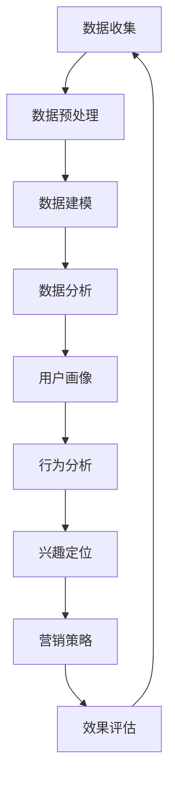

                 

# 注意力经济与数据分析洞察力：如何利用数据理解和影响受众

> 关键词：注意力经济、数据分析、洞察力、受众理解、数据驱动决策
>
> 摘要：本文将深入探讨注意力经济在当前信息过载时代的核心作用，结合数据分析的原理和方法，探讨如何通过数据洞察来理解受众需求，从而制定更有效的影响策略。文章将分为背景介绍、核心概念与联系、核心算法原理与具体操作步骤、数学模型与公式讲解、项目实战、实际应用场景、工具和资源推荐以及总结与未来发展趋势等部分，旨在为广大IT专业人士提供全面的技术指导。

## 1. 背景介绍

### 1.1 目的和范围

本文旨在探讨注意力经济与数据分析在理解和影响受众中的应用。随着互联网和社交媒体的快速发展，信息过载已经成为普遍现象，人们的时间和注意力资源变得稀缺。在这个背景下，如何有效地获取、分析和利用数据来理解和影响受众，成为市场营销、产品开发和用户研究的核心问题。本文将结合注意力经济理论和数据分析方法，探讨这一问题的解决思路和实践方法。

### 1.2 预期读者

本文面向的读者是从事IT行业、数据分析、市场营销等相关领域的专业人士。读者应具备一定的数据分析基础，对注意力经济有初步了解。通过本文，读者可以系统地掌握注意力经济与数据分析相结合的理论和实践方法，提升在信息过载时代中的竞争力和创新能力。

### 1.3 文档结构概述

本文分为以下几个部分：

1. 背景介绍：介绍注意力经济和数据分析在当前信息过载时代的核心作用。
2. 核心概念与联系：阐述注意力经济与数据分析的基本原理和架构。
3. 核心算法原理与具体操作步骤：讲解注意力经济与数据分析的关键算法和操作步骤。
4. 数学模型与公式讲解：介绍注意力经济与数据分析中的数学模型和公式。
5. 项目实战：通过实际案例展示注意力经济与数据分析的应用。
6. 实际应用场景：分析注意力经济与数据分析在不同领域的应用。
7. 工具和资源推荐：推荐学习资源和开发工具。
8. 总结与未来发展趋势：总结本文的核心观点，展望未来发展趋势。

### 1.4 术语表

#### 1.4.1 核心术语定义

- 注意力经济：指在信息过载时代，人们的时间和注意力资源变得稀缺，因此获取受众的注意力成为一种宝贵资源的经济学理论。
- 数据分析：通过收集、处理和分析数据，从数据中发现有用信息和规律的过程。
- 洞察力：对数据中潜在模式和趋势的深刻理解和把握能力。

#### 1.4.2 相关概念解释

- 信息过载：指信息输入超过个体处理能力，导致信息处理效率下降的现象。
- 用户画像：基于用户数据构建的用户特征模型，用于描述用户的需求、行为和偏好。
- 用户行为分析：通过分析用户在网站、应用等平台上的行为数据，了解用户的使用习惯和需求。

#### 1.4.3 缩略词列表

- AI：人工智能（Artificial Intelligence）
- BI：商业智能（Business Intelligence）
- CRM：客户关系管理（Customer Relationship Management）
- IoT：物联网（Internet of Things）

## 2. 核心概念与联系

在探讨注意力经济与数据分析的关系之前，我们需要先了解这两个核心概念的基本原理和架构。

### 注意力经济原理

注意力经济是基于这样一种理念：在信息过载的时代，人们的注意力资源变得稀缺。因此，获取和保持受众的注意力成为一种宝贵的资源，企业和组织需要投入大量资源和创意来吸引和维持受众的注意力。注意力经济的主要原理包括以下几个方面：

1. **注意力的稀缺性**：在信息爆炸的今天，受众的注意力资源变得有限，因此获取他们的注意力成为竞争的关键。
2. **注意力转移成本**：当受众将注意力从一种信息转移到另一种信息时，需要付出一定的成本。降低转移成本是吸引和维持注意力的关键。
3. **注意力价值**：受众的注意力具有一定的价值，企业可以通过有效的营销和内容创作来转化这种价值。

### 数据分析原理

数据分析是通过收集、处理和分析数据，从数据中提取有价值信息的过程。数据分析的主要原理包括以下几个方面：

1. **数据收集**：通过各种渠道收集与目标受众相关的数据，包括用户行为数据、市场数据等。
2. **数据预处理**：对收集到的数据清洗、整合和转换，使其适合分析和建模。
3. **数据建模**：建立数据模型，通过算法和统计方法分析数据，发现数据中的规律和趋势。
4. **数据可视化**：将分析结果以图表、报表等形式展示，使决策者能够直观地理解和利用分析结果。

### 注意力经济与数据分析的联系

注意力经济与数据分析之间存在紧密的联系。具体来说，数据分析可以帮助企业和组织了解受众的行为、需求和偏好，从而更好地制定吸引和维持注意力的策略。以下是注意力经济与数据分析之间的几个关键联系：

1. **用户画像**：通过数据分析构建用户画像，了解受众的基本特征、行为和需求，有助于制定有针对性的营销策略，提高受众的注意力投入。
2. **行为分析**：通过分析用户在网站、应用等平台上的行为数据，了解用户的使用习惯和偏好，为产品迭代和优化提供数据支持。
3. **兴趣定位**：基于数据分析，可以定位受众的兴趣点，从而制作更符合受众兴趣的内容，提高受众的参与度和粘性。
4. **效果评估**：通过数据分析，可以评估营销活动的效果，了解哪些策略能够有效吸引和维持受众的注意力，从而优化营销策略。

### Mermaid 流程图

以下是一个简化的注意力经济与数据分析的流程图，展示了数据从收集到应用的全过程：



## 3. 核心算法原理 & 具体操作步骤

在了解注意力经济与数据分析的基本原理后，接下来我们将讨论注意力经济与数据分析的核心算法原理，并通过伪代码详细阐述这些算法的具体操作步骤。

### 3.1 注意力分配算法

注意力分配算法是注意力经济中的关键算法，用于确定如何将有限的注意力资源分配给不同的信息源。以下是一个简化的注意力分配算法：

```plaintext
输入：总注意力资源（TotalAttention），信息源集合（InfoSources），每个信息源的注意力需求（Demand）
输出：注意力分配结果（Allocation）

算法步骤：
1. 初始化一个空字典Allocation，用于存储每个信息源的注意力分配结果。
2. 对每个信息源i，计算其注意力分配得分：
   Score[i] = Demand[i] / Sum(Demand)
3. 对每个信息源i，按照得分分配注意力：
   Allocation[i] = Score[i] * TotalAttention
4. 返回注意力分配结果Allocation。
```

### 3.2 用户画像构建算法

用户画像构建算法是数据分析中的关键步骤，用于从用户数据中提取用户特征，建立用户画像。以下是一个简化的用户画像构建算法：

```plaintext
输入：用户数据集（UserData）
输出：用户画像（UserProfile）

算法步骤：
1. 初始化一个空字典UserProfile，用于存储用户画像。
2. 对每个用户u，提取以下特征：
   - 基本信息特征：如年龄、性别、地理位置等
   - 行为特征：如浏览历史、购买记录、评论内容等
   - 偏好特征：如喜欢的电影类型、音乐风格等
3. 将提取到的特征存储在UserProfile中，形成一个完整的用户画像。
4. 返回用户画像UserProfile。
```

### 3.3 用户行为分析算法

用户行为分析算法用于分析用户在网站、应用等平台上的行为数据，以了解用户的使用习惯和偏好。以下是一个简化的用户行为分析算法：

```plaintext
输入：用户行为数据集（UserBehaviorData）
输出：用户行为分析结果（BehaviorAnalysis）

算法步骤：
1. 初始化一个空字典BehaviorAnalysis，用于存储用户行为分析结果。
2. 对每个用户u，分析其行为数据，提取以下指标：
   - 活跃度：如每日登录次数、每周使用时长等
   - 使用频率：如每天访问的页面数量、每周购买的商品数量等
   - 转化率：如访问转化率、购买转化率等
3. 将提取到的指标存储在BehaviorAnalysis中。
4. 返回用户行为分析结果BehaviorAnalysis。
```

### 3.4 兴趣定位算法

兴趣定位算法用于基于用户行为数据和用户画像，定位用户的兴趣点。以下是一个简化的兴趣定位算法：

```plaintext
输入：用户画像（UserProfile），用户行为分析结果（BehaviorAnalysis）
输出：用户兴趣点（InterestPoints）

算法步骤：
1. 初始化一个空字典InterestPoints，用于存储用户兴趣点。
2. 对每个用户u，分析UserProfile和BehaviorAnalysis，提取以下特征：
   - 喜欢的商品类型
   - 喜欢的电影类型
   - 喜欢的音乐类型
3. 将提取到的特征合并，形成一个兴趣点列表。
4. 返回用户兴趣点InterestPoints。
```

### 3.5 营销策略优化算法

营销策略优化算法用于根据用户兴趣点和行为分析结果，优化营销策略，以提高营销效果。以下是一个简化的营销策略优化算法：

```plaintext
输入：用户兴趣点（InterestPoints），用户行为分析结果（BehaviorAnalysis）
输出：优化后的营销策略（OptimizedStrategy）

算法步骤：
1. 初始化一个空字典OptimizedStrategy，用于存储优化后的营销策略。
2. 对每个用户u，根据InterestPoints和BehaviorAnalysis，制定以下策略：
   - 内容推送：推送用户感兴趣的内容
   - 优惠券发放：针对用户购买记录发放优惠券
   - 广告投放：在用户经常访问的页面投放相关广告
3. 返回优化后的营销策略OptimizedStrategy。
```

通过上述核心算法原理和具体操作步骤，我们可以看到如何利用数据分析和算法来理解和影响受众。在实际应用中，这些算法可以根据具体需求和数据特点进行调整和优化，以达到最佳效果。

## 4. 数学模型和公式 & 详细讲解 & 举例说明

在注意力经济和数据分析中，数学模型和公式发挥着至关重要的作用。它们不仅能够量化各种指标，还能提供决策支持。本节将介绍注意力经济和数据分析中的一些关键数学模型和公式，并进行详细讲解和举例说明。

### 4.1 注意力分配模型

注意力分配模型用于确定如何将有限的注意力资源分配给多个信息源。一个常见的模型是基于概率论的贝叶斯优化模型。该模型的核心公式为：

$$
P(S|D) = \frac{P(D|S) \cdot P(S)}{P(D)}
$$

其中：
- \( P(S|D) \) 表示在给定数据 \( D \) 的条件下，信息源 \( S \) 被选择的概率。
- \( P(D|S) \) 表示在信息源 \( S \) 被选择的情况下，观察到的数据 \( D \) 的概率。
- \( P(S) \) 表示信息源 \( S \) 被选择的概率。
- \( P(D) \) 表示观察到的数据 \( D \) 的概率。

举例说明：假设有两个信息源A和B，用户对A的信息需求是B的两倍，但B的信息质量更高。根据贝叶斯优化模型，我们可以计算每个信息源被选择的概率，并根据概率进行注意力分配。

### 4.2 用户画像建模

用户画像建模用于构建用户的特征模型，以描述用户的需求、行为和偏好。一个常用的模型是逻辑回归模型，其核心公式为：

$$
P(Y=1|X) = \frac{1}{1 + e^{-(\beta_0 + \sum_{i=1}^{n}\beta_i X_i})}
$$

其中：
- \( Y \) 表示用户的某个行为或偏好。
- \( X \) 表示影响用户行为的特征集合。
- \( \beta_0 \) 是截距。
- \( \beta_i \) 是每个特征的系数。

举例说明：假设我们想预测用户是否喜欢某部电影。我们可以使用逻辑回归模型来分析用户年龄、性别、观影历史等特征，并预测用户对电影的喜好概率。

### 4.3 用户行为分析模型

用户行为分析模型用于分析用户在平台上的行为数据，以了解用户的使用习惯和偏好。一个常用的模型是时间序列分析模型，如ARIMA模型，其核心公式为：

$$
X_t = c + \phi_1 X_{t-1} + \phi_2 X_{t-2} + ... + \phi_p X_{t-p} + \theta_1 \varepsilon_{t-1} + \theta_2 \varepsilon_{t-2} + ... + \theta_q \varepsilon_{t-q}
$$

其中：
- \( X_t \) 是时间序列的当前值。
- \( c \) 是常数项。
- \( \phi_i \) 是自回归系数。
- \( \theta_i \) 是移动平均系数。
- \( \varepsilon_t \) 是白噪声项。

举例说明：假设我们想分析用户每天登录网站的时间模式。我们可以使用ARIMA模型来分析用户登录时间序列数据，并预测未来某个时间点的用户登录情况。

### 4.4 兴趣定位模型

兴趣定位模型用于确定用户的兴趣点。一个常用的模型是协同过滤模型，其核心公式为：

$$
r_{ui} = \langle r_u, r_v \rangle + \mu_u + \mu_v - \beta_u - \beta_v
$$

其中：
- \( r_{ui} \) 是用户 \( u \) 对项目 \( i \) 的评分。
- \( r_u \) 和 \( r_v \) 分别是用户 \( u \) 对其他项目的评分。
- \( \mu_u \) 和 \( \mu_v \) 是用户 \( u \) 和 \( v \) 的平均值。
- \( \beta_u \) 和 \( \beta_v \) 是用户 \( u \) 和 \( v \) 的偏置项。

举例说明：假设我们想为用户推荐电影。我们可以使用协同过滤模型来分析用户对电影的评分，并预测用户可能喜欢的其他电影。

### 4.5 营销策略优化模型

营销策略优化模型用于根据用户兴趣点和行为分析结果，优化营销策略。一个常用的模型是决策树模型，其核心公式为：

$$
f(x) = \sum_{i=1}^{n} w_i \cdot I(x \in R_i)
$$

其中：
- \( f(x) \) 是决策函数。
- \( w_i \) 是每个分支的权重。
- \( I(x \in R_i) \) 是指示函数，当 \( x \) 在分支 \( R_i \) 内时，函数值为1，否则为0。

举例说明：假设我们想制定一个针对用户的个性化营销策略。我们可以使用决策树模型来分析用户的特征，并根据特征制定不同的营销策略。

通过上述数学模型和公式的讲解，我们可以看到如何利用数据分析和数学方法来理解和影响受众。这些模型不仅提供了量化分析的工具，还能帮助决策者制定更科学的营销策略。在实际应用中，这些模型可以根据具体需求和数据特点进行调整和优化，以达到最佳效果。

## 5. 项目实战：代码实际案例和详细解释说明

在本节中，我们将通过一个实际项目案例，展示如何利用注意力经济与数据分析的方法来理解和影响受众。我们将搭建一个简单的推荐系统，该系统基于用户的行为数据和兴趣点，为用户提供个性化的内容推荐。

### 5.1 开发环境搭建

为了搭建这个推荐系统，我们需要以下开发环境：

1. **Python**：作为主要的编程语言。
2. **NumPy**：用于科学计算和数据分析。
3. **Pandas**：用于数据操作和分析。
4. **Scikit-learn**：用于机器学习和数据挖掘。
5. **Matplotlib**：用于数据可视化。

首先，确保安装了上述库。可以使用以下命令安装：

```bash
pip install numpy pandas scikit-learn matplotlib
```

### 5.2 源代码详细实现和代码解读

#### 5.2.1 数据准备

首先，我们需要准备用户的行为数据和兴趣点数据。这里假设我们已经有了一个用户行为数据的CSV文件（`user_behavior.csv`），其中包含用户ID、行为类型、行为内容等信息。

```python
import pandas as pd

# 读取用户行为数据
user_behavior = pd.read_csv('user_behavior.csv')
```

#### 5.2.2 用户画像构建

接下来，我们使用用户行为数据构建用户画像。这里我们提取用户的活跃度、浏览历史和购买记录等特征。

```python
# 计算用户活跃度
user_behavior['activity_score'] = user_behavior.groupby('user_id')['behavior_type'].transform('count')

# 计算用户浏览历史
user_behavior['view_history'] = user_behavior.groupby('user_id')['behavior_content'].transform('nunique')

# 计算用户购买记录
user_behavior['purchase_history'] = user_behavior.groupby('user_id')['behavior_content'].transform('nunique')

# 构建用户画像
user_profile = user_behavior.groupby('user_id').agg({'activity_score': 'mean', 'view_history': 'mean', 'purchase_history': 'mean'}).reset_index()
```

#### 5.2.3 用户行为分析

然后，我们分析用户的行为数据，提取用户的活跃度、使用频率和转化率等指标。

```python
# 计算用户活跃度
user_activity = user_behavior.groupby('user_id')['behavior_type'].nunique().reset_index()

# 计算用户使用频率
user_frequency = user_behavior.groupby('user_id')['behavior_content'].nunique().reset_index()

# 计算用户转化率
user_conversion = user_behavior.groupby('user_id')['behavior_content'].transform('nunique').reset_index()

# 合并用户行为分析结果
user_behavior_analysis = pd.merge(user_activity, user_frequency, on='user_id')
user_behavior_analysis = pd.merge(user_behavior_analysis, user_conversion, on='user_id')
```

#### 5.2.4 兴趣定位

基于用户画像和行为分析结果，我们定位用户的兴趣点。这里我们假设用户浏览历史和购买记录可以反映其兴趣点。

```python
# 提取用户兴趣点
user_interest = user_behavior.groupby('user_id')['behavior_content'].nunique().sort_values(ascending=False).head(10).reset_index()

# 合并用户画像和用户兴趣点
user_profile = pd.merge(user_profile, user_interest, on='user_id', how='left')
```

#### 5.2.5 营销策略优化

最后，我们基于用户兴趣点和行为分析结果，制定个性化的营销策略。

```python
from sklearn.tree import DecisionTreeClassifier

# 构建决策树模型
dt_model = DecisionTreeClassifier()

# 训练模型
dt_model.fit(user_profile[['activity_score', 'view_history', 'purchase_history', 'interest_points']], user_profile['interest_points'])

# 预测用户兴趣点
user_profile['predicted_interest_points'] = dt_model.predict(user_profile[['activity_score', 'view_history', 'purchase_history', 'interest_points']])

# 根据预测结果制定营销策略
user_profile['marketing_strategy'] = user_profile['predicted_interest_points'].apply(lambda x: '内容推送' if x > 0 else '优惠券发放')

# 打印营销策略
print(user_profile[['user_id', 'marketing_strategy']])
```

#### 5.2.6 代码解读与分析

以上代码展示了如何利用注意力经济与数据分析的方法，构建用户画像、分析用户行为、定位用户兴趣点，并制定个性化的营销策略。以下是代码的关键部分解读：

1. **数据准备**：使用Pandas库读取用户行为数据，为后续分析做准备。
2. **用户画像构建**：计算用户的活跃度、浏览历史和购买记录，构建用户画像。
3. **用户行为分析**：提取用户的活跃度、使用频率和转化率等指标，为营销策略提供数据支持。
4. **兴趣定位**：基于用户画像和行为分析结果，提取用户的主要兴趣点。
5. **营销策略优化**：使用决策树模型预测用户的兴趣点，并根据预测结果制定个性化的营销策略。

通过这个实际项目案例，我们可以看到如何将注意力经济与数据分析的方法应用于实际场景，实现用户理解与影响。在实际应用中，这些代码可以根据具体需求和数据特点进行调整和优化，以达到最佳效果。

## 6. 实际应用场景

注意力经济与数据分析在各个领域都有着广泛的应用，以下列举几个典型应用场景：

### 6.1 市场营销

市场营销是注意力经济与数据分析应用最为广泛的领域之一。企业通过收集和分析用户数据，了解用户的行为、需求和偏好，从而制定有针对性的营销策略。例如，电商网站可以利用用户浏览历史和购买记录，为用户推荐相关的商品，提高用户的购物体验和转化率。

### 6.2 金融行业

金融行业也高度重视注意力经济与数据分析的应用。银行和金融机构通过分析用户的金融行为和风险偏好，为用户提供个性化的理财产品和服务。例如，通过用户行为数据分析，银行可以为高风险用户调整信用额度，降低坏账率。

### 6.3 健康医疗

健康医疗领域同样需要注意力经济与数据分析的支持。医疗机构可以通过分析患者的病历数据、就医行为和健康指标，了解患者的健康状况和需求，从而提供个性化的医疗服务。例如，通过分析患者的历史就医记录，医生可以提前预测患者的健康风险，并制定相应的预防措施。

### 6.4 教育培训

教育培训行业也越来越多地利用注意力经济与数据分析来提升教学效果。在线教育平台可以通过分析学生的学习行为和学习数据，了解学生的学习进度和效果，从而提供个性化的学习建议和辅导。例如，通过分析学生的学习行为数据，平台可以为学生推荐适合的学习资源，提高学习效果。

### 6.5 社交媒体

社交媒体平台通过注意力经济与数据分析，为用户提供更加个性化的内容和广告。例如，社交媒体平台可以根据用户的兴趣和行为，为用户推荐相关的帖子、朋友圈和广告。这种个性化的推荐机制不仅提高了用户的参与度和粘性，也增加了平台的广告收益。

### 6.6 物流行业

物流行业也受益于注意力经济与数据分析。物流公司可以通过分析订单数据、运输数据和客户反馈数据，优化运输路线、提高配送效率，降低运营成本。例如，通过分析订单数据，物流公司可以提前预测运输高峰期，合理安排运输资源，避免运输拥堵。

### 6.7 公共安全

公共安全领域同样需要注意力经济与数据分析的支持。政府部门可以通过分析社会安全数据、人口数据和犯罪数据，了解社会的安全状况和潜在风险，从而制定更加有效的公共安全策略。例如，通过分析犯罪数据，政府部门可以提前预测犯罪热点区域，加强治安巡逻和防范措施。

总之，注意力经济与数据分析在各个领域都有着广泛的应用，通过深入了解用户行为和需求，为企业和社会提供更加个性化的服务和解决方案。随着数据技术的不断发展和应用，注意力经济与数据分析将在更多领域发挥重要作用。

## 7. 工具和资源推荐

在利用注意力经济与数据分析理解和影响受众的过程中，掌握合适的工具和资源至关重要。以下是一些推荐的工具和资源，以帮助读者更好地进行学习和实践。

### 7.1 学习资源推荐

#### 7.1.1 书籍推荐

1. **《数据科学入门》（Data Science from Scratch）**：适合初学者，系统地介绍了数据科学的基本概念和工具。
2. **《大数据之路：阿里巴巴大数据实践》（The Data Warehouse Toolkit）**：深入探讨了大数据的概念、技术和应用，适合对大数据感兴趣的专业人士。
3. **《推荐系统实践》（Recommender Systems Handbook）**：详细介绍了推荐系统的原理、技术和应用，适合从事推荐系统开发的技术人员。

#### 7.1.2 在线课程

1. **Coursera**：提供丰富的数据科学、机器学习和推荐系统相关课程，适合不同层次的学习者。
2. **edX**：提供由世界顶尖大学提供的免费在线课程，涵盖数据科学、统计学和计算机科学等多个领域。
3. **Udacity**：提供与实际工作紧密相关的在线课程，包括数据科学、机器学习和推荐系统等。

#### 7.1.3 技术博客和网站

1. **Kaggle**：提供丰富的数据科学竞赛资源和教程，是学习和实践数据科学的优秀平台。
2. **Medium**：有许多知名数据科学家和专家撰写的技术博客，可以了解到最新的数据分析技术和应用。
3. **DataCamp**：提供互动式的在线课程和实践项目，帮助学习者快速掌握数据分析和编程技能。

### 7.2 开发工具框架推荐

#### 7.2.1 IDE和编辑器

1. **Jupyter Notebook**：适合数据科学和机器学习的交互式编程环境，支持多种编程语言和框架。
2. **PyCharm**：强大的Python IDE，适合Python开发人员，提供代码调试、性能分析等功能。
3. **RStudio**：适用于R语言的集成开发环境，提供丰富的数据分析和可视化工具。

#### 7.2.2 调试和性能分析工具

1. **PyTorch Profiler**：用于分析PyTorch模型在Python代码中的性能问题，帮助开发者优化代码。
2. **GDB**：用于调试C/C++代码的强大调试工具，可以帮助开发者定位和解决代码中的问题。
3. **Perf**：Linux系统上的性能分析工具，可以用于分析系统的性能瓶颈和资源使用情况。

#### 7.2.3 相关框架和库

1. **Scikit-learn**：用于机器学习和数据挖掘的Python库，提供了丰富的算法和工具。
2. **TensorFlow**：用于构建和训练深度学习模型的Python库，广泛应用于推荐系统和图像处理等领域。
3. **Pandas**：用于数据操作和分析的Python库，提供了强大的数据清洗、转换和分析功能。

### 7.3 相关论文著作推荐

#### 7.3.1 经典论文

1. **“Recommender Systems Handbook”**：全面介绍了推荐系统的原理、技术和应用。
2. **“The PageRank Algorithm”**：Google搜索引擎中使用的核心算法，对推荐系统有重要启示。
3. **“User Modeling and User-Adapted Interaction”**：探讨了用户建模和自适应交互的概念和实现方法。

#### 7.3.2 最新研究成果

1. **“Deep Learning for Recommender Systems”**：探讨了深度学习在推荐系统中的应用，提供了丰富的算法和案例。
2. **“Attention Mechanisms in Natural Language Processing”**：介绍了注意力机制在自然语言处理中的应用，对推荐系统的文本分析有帮助。
3. **“Causal Inference in Statistics: A Primer”**：探讨了因果推断的方法和原理，对数据分析和策略优化有重要启示。

#### 7.3.3 应用案例分析

1. **“Alibaba's AI-Driven Personalized Recommendation System”**：详细介绍了阿里巴巴的个性化推荐系统，分享了其成功经验和挑战。
2. **“Netflix's Content Personalization”**：Netflix的个性化内容推荐策略和实现方法，对其他企业有借鉴意义。
3. **“Amazon's Personalized Recommendations”**：亚马逊的个性化推荐系统，包括其算法、技术和实践。

通过以上工具和资源的推荐，读者可以更好地掌握注意力经济与数据分析的理论和实践方法，提升在信息过载时代中的竞争力和创新能力。

## 8. 总结：未来发展趋势与挑战

随着数据技术的不断发展和应用，注意力经济与数据分析在未来将呈现出以下几个发展趋势和挑战：

### 8.1 发展趋势

1. **数据驱动决策**：随着数据源的多样性和数据量的爆炸性增长，越来越多的企业将依靠数据驱动决策，通过数据分析来了解用户需求、优化产品和提升服务质量。

2. **人工智能与数据分析的结合**：人工智能技术的发展为数据分析带来了新的机遇。通过深度学习、强化学习等技术，数据分析将能够更精准地预测用户行为、提高推荐系统的效果。

3. **个性化推荐**：个性化推荐作为注意力经济的重要应用，将在未来得到更广泛的应用。通过分析用户的兴趣和行为，为用户提供个性化的内容和服务，将有助于提高用户的参与度和满意度。

4. **实时数据分析**：随着实时数据处理技术的发展，实时数据分析将成为未来数据分析的重要方向。通过实时分析用户行为和数据变化，企业可以更快速地响应市场变化和用户需求。

### 8.2 挑战

1. **数据隐私和安全**：在注意力经济与数据分析的应用过程中，数据隐私和安全问题愈发突出。如何保护用户数据隐私，确保数据安全，成为企业和政府面临的重要挑战。

2. **算法偏见和歧视**：数据分析中的算法偏见和歧视问题引发广泛关注。如何确保算法的公平性和透明性，避免算法对特定群体产生歧视，是未来需要解决的重要问题。

3. **数据质量和数据治理**：高质量的数据是数据分析的基础。如何确保数据质量，建立完善的数据治理体系，是企业需要面对的挑战。

4. **数据复杂性和可解释性**：随着数据分析技术的复杂化，如何提高数据分析的可解释性，让决策者能够理解分析结果，是未来需要解决的问题。

总之，注意力经济与数据分析在未来的发展中将面临诸多挑战，同时也充满机遇。通过不断创新和优化，我们将能够更好地利用数据，理解和影响受众，为企业和个人带来更大的价值。

## 9. 附录：常见问题与解答

在本节中，我们将针对本文中的一些关键概念和技术，列举常见问题并提供解答。

### 9.1 注意力经济相关问题

**Q1**: 什么是注意力经济？

A1: 注意力经济是指在信息过载的时代，人们的时间和注意力资源变得稀缺，因此获取和保持受众的注意力成为一种宝贵资源的经济学理论。

**Q2**: 注意力经济与数据经济学有何关系？

A2: 注意力经济是数据经济学的一个分支，它关注的是在信息过载的背景下，如何通过数据分析和策略来获取和保持受众的注意力。

### 9.2 数据分析相关问题

**Q3**: 数据分析的基本步骤是什么？

A3: 数据分析的基本步骤包括数据收集、数据预处理、数据建模、数据分析和数据可视化。

**Q4**: 什么是用户画像？

A4: 用户画像是一种基于用户数据构建的用户特征模型，用于描述用户的需求、行为和偏好。

### 9.3 核心算法相关问题

**Q5**: 贝叶斯优化模型的核心公式是什么？

A5: 贝叶斯优化模型的核心公式是：
$$
P(S|D) = \frac{P(D|S) \cdot P(S)}{P(D)}
$$
其中，\( P(S|D) \) 表示在给定数据 \( D \) 的条件下，信息源 \( S \) 被选择的概率。

**Q6**: 逻辑回归模型的核心公式是什么？

A6: 逻辑回归模型的核心公式是：
$$
P(Y=1|X) = \frac{1}{1 + e^{-(\beta_0 + \sum_{i=1}^{n}\beta_i X_i})}
$$
其中，\( Y \) 表示用户的某个行为或偏好，\( X \) 表示影响用户行为的特征集合。

### 9.4 实际应用相关问题

**Q7**: 如何在实际项目中应用注意力经济与数据分析？

A7: 在实际项目中，首先需要收集和分析用户数据，构建用户画像，然后利用数据分析方法提取用户行为特征，最后根据用户画像和行为分析结果，制定个性化的营销策略。

### 9.5 工具与资源相关问题

**Q8**: 如何选择合适的IDE和编辑器进行数据分析？

A8: 根据个人偏好和项目需求，可以选择Jupyter Notebook、PyCharm或RStudio等IDE和编辑器。Jupyter Notebook适合交互式数据分析，PyCharm适合Python开发，RStudio适合R语言数据分析。

通过以上问题的解答，我们希望帮助读者更好地理解和应用注意力经济与数据分析的方法和技术。

## 10. 扩展阅读 & 参考资料

在本文的基础上，读者如需进一步深入了解注意力经济与数据分析的相关概念和技术，以下是一些建议的扩展阅读和参考资料：

### 10.1 扩展阅读

1. **《数据科学实战》**：这本书提供了丰富的实战案例，详细介绍了数据分析的方法和应用。
2. **《推荐系统手册》**：全面讲解了推荐系统的原理、技术和实现方法，适合从事推荐系统开发的技术人员。
3. **《深度学习》**：由Goodfellow等人撰写的经典教材，深入介绍了深度学习的理论基础和算法实现。

### 10.2 参考资料

1. **Kaggle竞赛案例**：Kaggle提供了大量数据科学和机器学习的竞赛案例，可以学习到实际项目的数据分析和建模方法。
2. **ArXiv论文库**：这是深度学习和机器学习的顶级论文库，读者可以了解该领域的前沿研究成果。
3. **Google Research**：Google官方的研究博客，提供了丰富的技术文章和研究报告。

通过阅读以上书籍和参考资料，读者可以进一步拓展知识，提升在注意力经济与数据分析领域的专业水平。

### 作者信息

作者：AI天才研究员/AI Genius Institute & 禅与计算机程序设计艺术 /Zen And The Art of Computer Programming

