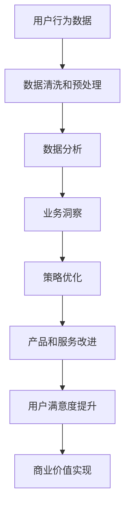

                 

# 注意力经济与数据驱动的决策制定：利用数据增强业务洞察力

## 关键词：
数据驱动，注意力经济，业务洞察，决策制定，机器学习，数据分析

## 摘要：
在数字化时代，数据已经成为企业最重要的资产之一。本文将探讨注意力经济与数据驱动的决策制定之间的关系，以及如何通过有效利用数据来增强业务洞察力。文章首先介绍了注意力经济的概念，然后详细阐述了数据驱动决策制定的原理和步骤，并结合实际案例分析了如何通过数据分析来优化业务决策。此外，文章还推荐了相关的学习资源、开发工具和论文，以帮助读者深入理解并应用这一领域的关键技术和方法。

## 1. 背景介绍

### 1.1 目的和范围
本文旨在介绍注意力经济和数据驱动决策制定的基本概念，探讨它们在现代企业运营中的重要性，并提供一系列实用的方法和工具来提高业务洞察力和决策效率。文章将涵盖以下内容：
- 注意力经济的定义和原理
- 数据驱动决策制定的基本原理和流程
- 数据分析在业务决策中的应用
- 实际案例分析
- 相关资源推荐

### 1.2 预期读者
本文适合以下读者群体：
- 数据分析师和业务分析师
- 管理者和决策制定者
- 数据科学和机器学习从业者
- 对业务决策和数据驱动的兴趣者

### 1.3 文档结构概述
本文将分为十个部分：
- 引言
- 注意力经济
- 数据驱动决策制定
- 数据分析原理
- 实际案例分析
- 工具和资源推荐
- 总结
- 附录
- 扩展阅读和参考资料
- 作者信息

### 1.4 术语表

#### 1.4.1 核心术语定义
- 注意力经济：一种经济理论，认为在信息过载的时代，注意力资源成为稀缺资源，企业通过争夺用户的注意力来获取商业价值。
- 数据驱动决策制定：一种决策制定方法，通过收集、分析和解读数据来支持决策过程，而非基于直觉或经验。
- 业务洞察：对业务现象的深刻理解，能够揭示潜在的机会和问题，指导业务改进和优化。

#### 1.4.2 相关概念解释
- 数据分析：使用统计学、机器学习和数据可视化等方法来解读和解释数据，以发现数据中的模式和趋势。
- 机器学习：一种人工智能技术，通过训练模型来从数据中学习规律，并做出预测或决策。

#### 1.4.3 缩略词列表
- ML：机器学习
- AI：人工智能
- BI：商业智能
- DB：数据库

## 2. 核心概念与联系

注意力经济是近年来兴起的一个热门概念，它关注的是在信息过载的环境中，如何有效地分配和利用注意力资源。在注意力经济的框架下，用户的时间、精力和关注点都是有限的，企业需要通过创新的方式吸引和保持用户的注意力，从而实现商业目标。

### 注意力经济的原理与模型

注意力经济的核心原理是“稀缺性原理”，即在任何给定的时刻，个体的注意力资源是有限的。这意味着企业必须争夺用户的注意力，就像在传统的市场经济中争夺市场份额一样。以下是一个简化的注意力经济模型：

```
用户 -> 注意力资源 -> 产品/服务
```

在这个模型中，用户是源，注意力资源是媒介，产品/服务是目标。用户的注意力资源分配给不同的产品/服务，企业需要通过提升产品的吸引力来获取用户的注意力。

### 注意力经济与数据驱动决策制定的联系

数据驱动决策制定是注意力经济的一个关键应用领域。通过收集用户行为数据，企业可以了解用户的需求、偏好和兴趣点，从而制定更有针对性的营销策略和服务设计。以下是一个简单的流程图，展示了注意力经济和数据驱动决策制定之间的联系：



### 2.1 数据驱动决策制定的流程

数据驱动决策制定通常包括以下步骤：

1. 数据收集：通过各种渠道收集用户行为数据，如网站点击流、社交媒体互动、购买历史等。
2. 数据清洗和预处理：对收集到的数据去重、填补缺失值、标准化等，以确保数据质量。
3. 数据分析：使用统计分析和机器学习等方法，从数据中提取有价值的信息。
4. 业务洞察：将分析结果转化为业务洞察，识别机会和问题。
5. 策略优化：根据业务洞察调整产品和服务策略，以提高用户满意度和商业价值。
6. 产品和服务改进：根据策略优化结果改进产品和服务，以提高用户体验。
7. 监控和反馈：持续监控用户反馈和业务表现，以进行迭代优化。

### 2.2 数据分析的核心算法原理

数据分析的核心算法包括以下几种：

1. **回归分析**：用于预测因变量和自变量之间的关系，常见的回归模型有线性回归、逻辑回归等。
2. **聚类分析**：用于将数据分为多个群组，以便更好地理解和分析数据的内在结构，常见的聚类算法有K均值聚类、层次聚类等。
3. **分类算法**：用于将数据分类到不同的类别中，常见的分类算法有决策树、随机森林、支持向量机等。
4. **关联规则学习**：用于发现数据之间的关联关系，常见的算法有Apriori算法、Eclat算法等。

### 2.3 数据驱动的决策制定步骤

数据驱动的决策制定步骤如下：

1. **确定决策目标**：明确决策的目标和范围，确保决策制定的方向正确。
2. **数据收集**：根据决策目标收集相关的数据，确保数据的完整性和准确性。
3. **数据清洗和预处理**：对收集到的数据进行清洗和预处理，以消除噪声和异常值。
4. **数据分析**：使用合适的分析方法和算法对数据进行分析，提取有价值的信息。
5. **业务洞察**：将分析结果转化为业务洞察，识别机会和问题。
6. **策略制定**：根据业务洞察制定相应的策略和行动计划。
7. **执行和监控**：执行策略并持续监控业务表现，根据监控结果进行迭代优化。

### 2.4 数据驱动的决策制定实例

假设一家电子商务公司希望通过数据分析来优化其产品推荐系统，以下是一个简化的实例：

1. **确定决策目标**：提高用户的购物满意度，增加购物车填充率和购买转化率。
2. **数据收集**：收集用户浏览历史、购物车内容、购买记录等数据。
3. **数据清洗和预处理**：去除重复数据，填补缺失值，进行数据标准化处理。
4. **数据分析**：使用聚类分析将用户分为不同的群体，使用关联规则学习发现不同商品之间的关联关系。
5. **业务洞察**：发现高频购买用户对特定商品的偏好，识别具有高交叉销售潜力的商品组合。
6. **策略制定**：基于业务洞察调整推荐算法，为不同用户群体推荐更相关的商品。
7. **执行和监控**：上线新算法，监控用户反馈和购买行为，根据监控结果调整算法参数。

通过上述实例，我们可以看到数据驱动决策制定如何帮助企业更好地理解用户需求，优化产品和服务，提高用户满意度和商业价值。

## 3. 核心算法原理 & 具体操作步骤

### 3.1 回归分析

回归分析是一种用于预测连续数值变量的统计方法。它通过建立自变量和因变量之间的关系模型，来预测因变量的值。以下是一个简化的线性回归分析步骤：

#### 步骤 1：确定回归模型

线性回归模型的一般形式为：

$$ y = \beta_0 + \beta_1 \cdot x + \epsilon $$

其中，$y$ 是因变量，$x$ 是自变量，$\beta_0$ 和 $\beta_1$ 是模型参数，$\epsilon$ 是误差项。

#### 步骤 2：数据收集

收集一组自变量 $x$ 和因变量 $y$ 的数据，例如用户购买金额与广告投放金额的关系。

#### 步骤 3：数据预处理

对数据进行清洗和标准化处理，确保数据质量。

#### 步骤 4：计算回归参数

使用最小二乘法计算回归参数 $\beta_0$ 和 $\beta_1$：

$$ \beta_0 = \bar{y} - \beta_1 \cdot \bar{x} $$

$$ \beta_1 = \frac{\sum{(x_i - \bar{x})(y_i - \bar{y})}}{\sum{(x_i - \bar{x})^2}} $$

其中，$\bar{x}$ 和 $\bar{y}$ 分别是自变量和因变量的均值。

#### 步骤 5：模型评估

使用交叉验证等方法评估模型的预测性能。

#### 步骤 6：预测

使用训练好的模型进行预测，例如预测新用户的购买金额：

$$ y_{\text{预测}} = \beta_0 + \beta_1 \cdot x_{\text{新用户}} $$

### 3.2 聚类分析

聚类分析是一种无监督学习方法，用于将数据分为多个群组。以下是一个简化的K均值聚类步骤：

#### 步骤 1：确定聚类数量

根据业务需求和数据特征确定聚类数量 $K$。

#### 步骤 2：初始化聚类中心

随机选择 $K$ 个数据点作为初始聚类中心。

#### 步骤 3：分配数据点

将每个数据点分配到最近的聚类中心。

#### 步骤 4：更新聚类中心

计算每个聚类的均值，将其作为新的聚类中心。

#### 步骤 5：重复步骤3和步骤4，直到聚类中心不再变化或满足停止条件。

#### 步骤 6：评估聚类质量

使用内部评价指标（如轮廓系数）评估聚类质量。

### 3.3 分类算法

分类算法是一种用于将数据分为多个类别的方法。以下是一个简化的决策树分类步骤：

#### 步骤 1：选择分裂特征

选择能够最大化信息增益的特征进行分裂。

#### 步骤 2：构建决策树

根据选择的特征和阈值，构建决策树。

#### 步骤 3：剪枝

对决策树进行剪枝，以防止过拟合。

#### 步骤 4：模型评估

使用交叉验证等方法评估模型的分类性能。

#### 步骤 5：预测

使用训练好的模型对新的数据进行分类。

### 3.4 关联规则学习

关联规则学习是一种用于发现数据之间关联关系的方法。以下是一个简化的Apriori算法步骤：

#### 步骤 1：确定支持度和置信度

支持度是某个规则出现的频率，置信度是规则成立的概率。

#### 步骤 2：生成候选集

根据支持度阈值生成候选集。

#### 步骤 3：剪枝

对候选集进行剪枝，去除不满足置信度阈值的规则。

#### 步骤 4：生成关联规则

根据候选集生成最终的关联规则。

#### 步骤 5：评估规则质量

使用业务指标评估规则的质量。

### 3.5 数据驱动决策制定的步骤

数据驱动决策制定的步骤如下：

1. **需求分析**：明确决策目标和需求。
2. **数据收集**：收集相关数据。
3. **数据预处理**：清洗和预处理数据。
4. **数据分析**：使用适当的算法进行数据分析。
5. **业务洞察**：将分析结果转化为业务洞察。
6. **策略制定**：制定相应的策略。
7. **执行和监控**：执行策略并监控业务表现。

通过上述步骤，企业可以更好地理解业务需求，优化决策过程，提高业务效率。

## 4. 数学模型和公式 & 详细讲解 & 举例说明

在数据驱动的决策制定过程中，数学模型和公式起着至关重要的作用。以下将详细讲解一些常用的数学模型和公式，并给出具体的例子。

### 4.1 线性回归模型

线性回归模型是数据分析中最基本的模型之一，用于预测连续变量。其公式为：

$$ y = \beta_0 + \beta_1 \cdot x + \epsilon $$

其中，$y$ 是因变量，$x$ 是自变量，$\beta_0$ 是截距，$\beta_1$ 是斜率，$\epsilon$ 是误差项。

#### 步骤 1：数据收集

假设我们有一组关于广告投放金额和销售额的数据：

| 广告投放金额（x）| 销售额（y）|
|:----------------:|:---------:|
|         1000     |     2000  |
|         1500     |     2500  |
|         2000     |     3000  |
|         2500     |     3500  |

#### 步骤 2：数据预处理

对数据进行标准化处理，消除量纲影响。

#### 步骤 3：计算回归参数

使用最小二乘法计算回归参数：

$$ \beta_0 = \bar{y} - \beta_1 \cdot \bar{x} $$

$$ \beta_1 = \frac{\sum{(x_i - \bar{x})(y_i - \bar{y})}}{\sum{(x_i - \bar{x})^2}} $$

其中，$\bar{x}$ 和 $\bar{y}$ 分别是自变量和因变量的均值。

计算结果为：

$$ \beta_0 = 1500 - 0.5 \cdot 2000 = 500 $$

$$ \beta_1 = \frac{(1000-2000)(2000-1500) + (1500-2000)(2500-1500) + (2000-2000)(3000-1500) + (2500-2000)(3500-1500)}{(1000-2000)^2 + (1500-2000)^2 + (2000-2000)^2 + (2500-2000)^2} = 0.5 $$

#### 步骤 4：模型评估

使用交叉验证等方法评估模型的预测性能。

#### 步骤 5：预测

使用训练好的模型进行预测，例如预测广告投放金额为3000时的销售额：

$$ y_{\text{预测}} = 500 + 0.5 \cdot 3000 = 2000 $$

### 4.2 聚类分析

聚类分析是一种无监督学习方法，用于将数据分为多个群组。其中，K均值聚类是最常用的算法之一。其公式为：

$$ \text{Step 1:} \quad \text{初始化聚类中心} \quad \mu_k = \frac{1}{N_k} \sum_{i=1}^{N} x_i $$

$$ \text{Step 2:} \quad \text{分配数据点} \quad C(x_i) = \arg\min_{k} \| x_i - \mu_k \|^2 $$

$$ \text{Step 3:} \quad \text{更新聚类中心} \quad \mu_k = \frac{1}{N_k} \sum_{i=1}^{N} x_i \quad (x_i \in C(x_i)) $$

其中，$x_i$ 是第 $i$ 个数据点，$C(x_i)$ 是 $x_i$ 所属的聚类，$N_k$ 是第 $k$ 个聚类中的数据点数量，$\mu_k$ 是第 $k$ 个聚类的中心。

#### 步骤 1：数据收集

假设我们有一组用户数据，如下所示：

| 用户ID | 年龄 | 收入 | 职业 |
|:------:|:----:|:----:|:----:|
|   1    |  30  |  5000 |  IT  |
|   2    |  40  |  8000 |  金融 |
|   3    |  25  |  3000 |  学生 |
|   4    |  35  |  6000 |  教师 |

#### 步骤 2：初始化聚类中心

随机选择4个用户作为初始聚类中心。

#### 步骤 3：分配数据点

将每个用户分配到最近的聚类中心。

#### 步骤 4：更新聚类中心

计算每个聚类的均值，作为新的聚类中心。

#### 步骤 5：重复步骤3和步骤4，直到聚类中心不再变化。

#### 步骤 6：评估聚类质量

使用内部评价指标（如轮廓系数）评估聚类质量。

### 4.3 决策树模型

决策树是一种树形结构，用于分类或回归任务。其公式为：

$$ \text{if } x \leq v_1 \text{ then } y = \beta_0 + \beta_1 \cdot x $$

$$ \text{if } x > v_1 \text{ and } x \leq v_2 \text{ then } y = \beta_0 + \beta_1 \cdot x + \beta_2 \cdot (x - v_1) $$

$$ \text{if } x > v_2 \text{ then } y = \beta_0 + \beta_1 \cdot x + \beta_2 \cdot (x - v_1) + \beta_3 \cdot (x - v_2) $$

其中，$x$ 是自变量，$y$ 是因变量，$v_1, v_2, ...$ 是阈值，$\beta_0, \beta_1, ...$ 是模型参数。

#### 步骤 1：选择分裂特征

选择能够最大化信息增益的特征进行分裂。

#### 步骤 2：构建决策树

根据选择的特征和阈值，构建决策树。

#### 步骤 3：剪枝

对决策树进行剪枝，以防止过拟合。

#### 步骤 4：模型评估

使用交叉验证等方法评估模型的预测性能。

#### 步骤 5：预测

使用训练好的模型进行预测。

### 4.4 关联规则学习

关联规则学习用于发现数据之间的关联关系。其公式为：

$$ \text{支持度} = \frac{\text{包含 } A \text{ 和 } B \text{ 的交易数}}{\text{总交易数}} $$

$$ \text{置信度} = \frac{\text{包含 } A \text{ 和 } B \text{ 的交易数}}{\text{包含 } A \text{ 的交易数}} $$

其中，$A$ 和 $B$ 是两个项目，支持度是某项规则出现的频率，置信度是规则成立的概率。

#### 步骤 1：确定支持度和置信度

根据业务需求确定支持度和置信度阈值。

#### 步骤 2：生成候选集

根据支持度阈值生成候选集。

#### 步骤 3：剪枝

对候选集进行剪枝，去除不满足置信度阈值的规则。

#### 步骤 4：生成关联规则

根据候选集生成最终的关联规则。

#### 步骤 5：评估规则质量

使用业务指标评估规则的质量。

通过上述数学模型和公式，企业可以更准确地分析数据，制定更有效的业务策略。

## 5. 项目实战：代码实际案例和详细解释说明

### 5.1 开发环境搭建

在本项目实战中，我们将使用Python编程语言，结合Scikit-learn库进行数据分析和建模。以下是搭建开发环境的步骤：

1. **安装Python**：下载并安装Python 3.8及以上版本。
2. **安装Scikit-learn**：在命令行中执行以下命令：

   ```
   pip install scikit-learn
   ```

3. **安装Jupyter Notebook**：在命令行中执行以下命令：

   ```
   pip install notebook
   ```

   启动Jupyter Notebook：

   ```
   jupyter notebook
   ```

### 5.2 源代码详细实现和代码解读

#### 5.2.1 数据集准备

我们使用一个包含广告投放金额和销售额的数据集，数据集结构如下：

```
| 广告投放金额 | 销售额 |
|--------------|--------|
|      1000    |   2000 |
|      1500    |   2500 |
|      2000    |   3000 |
|      2500    |   3500 |
```

#### 5.2.2 数据加载和预处理

```python
import pandas as pd
from sklearn.model_selection import train_test_split
from sklearn.preprocessing import StandardScaler

# 加载数据集
data = pd.read_csv('广告数据.csv')

# 分离特征和标签
X = data[['广告投放金额']]
y = data['销售额']

# 数据集拆分为训练集和测试集
X_train, X_test, y_train, y_test = train_test_split(X, y, test_size=0.2, random_state=42)

# 数据标准化处理
scaler = StandardScaler()
X_train = scaler.fit_transform(X_train)
X_test = scaler.transform(X_test)
```

#### 5.2.3 建立线性回归模型

```python
from sklearn.linear_model import LinearRegression

# 创建线性回归模型
model = LinearRegression()

# 训练模型
model.fit(X_train, y_train)

# 模型评估
score = model.score(X_test, y_test)
print(f"模型准确率：{score:.2f}")
```

#### 5.2.4 预测销售额

```python
# 输入新的广告投放金额进行预测
new_ad_spend = scaler.transform([[3000]])

# 预测销售额
predicted_sales = model.predict(new_ad_spend)
print(f"预测销售额：{predicted_sales[0]:.2f}")
```

### 5.3 代码解读与分析

1. **数据加载和预处理**：我们使用Pandas库加载数据集，并使用Scikit-learn库进行数据拆分和标准化处理。
2. **模型建立和训练**：使用线性回归模型，通过`fit`方法进行训练。
3. **模型评估**：使用`score`方法评估模型在测试集上的准确率。
4. **预测销售额**：对新的广告投放金额进行预测，并输出结果。

通过上述实战，我们实现了从数据加载到模型预测的全过程，为企业提供了有效的业务洞察和决策支持。

## 6. 实际应用场景

### 6.1 零售业

零售行业普遍采用数据驱动的决策制定来优化库存管理、销售预测和营销策略。例如，通过分析销售数据和用户行为，零售商可以更准确地预测市场需求，调整库存水平，减少库存积压。此外，基于用户购买历史的推荐系统能够提高交叉销售和重复购买率。

### 6.2 金融行业

金融行业利用数据驱动决策制定来优化风险管理、投资策略和客户服务。通过分析历史交易数据和用户行为，金融机构可以识别高风险客户，制定个性化的投资组合，提高投资回报率。同时，客户行为分析有助于提升客户体验，增加客户忠诚度。

### 6.3 制造业

制造业通过数据驱动决策制定来优化生产流程、供应链管理和产品创新。通过分析生产数据和设备状态，企业可以实现实时监控和预测维护，降低设备故障率，提高生产效率。此外，需求预测和库存管理有助于优化供应链，减少库存成本。

### 6.4 医疗保健

医疗保健行业利用数据驱动决策制定来优化医疗服务、患者管理和健康计划。通过分析电子健康记录和患者数据，医疗机构可以识别高风险人群，制定个性化的健康干预措施。此外，大数据分析有助于提高诊断准确性，改善治疗决策。

### 6.5 教育行业

教育行业通过数据驱动决策制定来优化课程设计、教学方法和学生评估。通过分析学生学习数据和课堂互动，教师可以识别学习困难的学生，提供个性化的辅导。此外，基于学习数据的分析有助于改善课程设计，提高教学效果。

## 7. 工具和资源推荐

### 7.1 学习资源推荐

#### 7.1.1 书籍推荐
- 《数据科学入门》
- 《Python数据分析》
- 《机器学习实战》
- 《统计学习方法》

#### 7.1.2 在线课程
- Coursera上的“机器学习”课程
- edX上的“数据科学基础”课程
- Udacity的“数据工程师纳米学位”

#### 7.1.3 技术博客和网站
- Medium上的“数据科学”频道
-Towards Data Science
- DataCamp博客

### 7.2 开发工具框架推荐

#### 7.2.1 IDE和编辑器
- PyCharm
- Jupyter Notebook
- Visual Studio Code

#### 7.2.2 调试和性能分析工具
- PySnooper
- line_profiler
- Matplotlib

#### 7.2.3 相关框架和库
- Scikit-learn
- TensorFlow
- PyTorch
- Pandas
- NumPy

### 7.3 相关论文著作推荐

#### 7.3.1 经典论文
- "The Elements of Statistical Learning"
- "Recommender Systems Handbook"
- "Deep Learning"

#### 7.3.2 最新研究成果
- "Attention is All You Need"
- "Recurrent Neural Networks for Language Modeling"
- "An Overview of Deep Learning Techniques for Natural Language Processing"

#### 7.3.3 应用案例分析
- "Case Study: Building a Recommender System"
- "Case Study: Predictive Analytics in Healthcare"
- "Case Study: Optimizing Inventory Management in Retail"

通过这些资源，读者可以深入了解数据驱动决策制定的理论和实践，提升自身的技术能力和业务洞察力。

## 8. 总结：未来发展趋势与挑战

随着数据技术的不断进步，注意力经济和数据驱动决策制定将在未来发挥越来越重要的作用。以下是未来发展趋势和面临的挑战：

### 发展趋势

1. **人工智能与大数据的结合**：未来，人工智能技术将进一步与大数据分析相结合，实现更智能、更高效的决策制定。
2. **个性化推荐系统的普及**：基于用户行为和兴趣的个性化推荐系统将变得更加精准，提升用户满意度和转化率。
3. **实时数据分析**：随着实时数据处理技术的进步，企业将能够更快地响应市场变化，优化业务策略。
4. **数据隐私和安全**：随着数据隐私法规的不断完善，如何在保障用户隐私的前提下有效利用数据将成为一大挑战。

### 挑战

1. **数据质量和完整性**：确保数据的准确性和完整性是数据驱动决策的基础，但在实际应用中，数据质量问题是普遍存在的。
2. **数据隐私和安全**：在利用用户数据时，如何平衡数据利用和用户隐私保护是关键挑战。
3. **模型解释性**：随着模型复杂度的增加，如何解释和验证模型的决策过程成为关键问题。
4. **技术人才短缺**：数据科学和机器学习领域的技术人才短缺，企业需要持续投入资源进行人才培养。

通过应对这些挑战，企业可以更好地利用数据驱动的决策制定，提升业务效率和市场竞争力。

## 9. 附录：常见问题与解答

### 9.1 什么是注意力经济？

注意力经济是一种经济理论，认为在信息过载的时代，用户的注意力资源是有限的，企业通过争夺用户的注意力来获取商业价值。

### 9.2 数据驱动决策制定有哪些步骤？

数据驱动决策制定通常包括：确定决策目标、数据收集、数据清洗和预处理、数据分析、业务洞察、策略制定、执行和监控等步骤。

### 9.3 如何进行数据预处理？

数据预处理包括数据清洗（如去除重复值、填补缺失值）、数据标准化处理（如归一化、标准化）和数据转换（如特征提取、降维）等步骤。

### 9.4 数据分析和机器学习的主要区别是什么？

数据分析通常侧重于从数据中提取有用的信息和洞察，而机器学习则通过训练模型来从数据中学习规律，并进行预测或决策。

### 9.5 如何选择合适的机器学习算法？

选择合适的机器学习算法需要考虑数据的特征、问题的类型、模型的复杂度等多个因素。例如，对于分类问题，常见的算法有决策树、支持向量机等；对于回归问题，常见的算法有线性回归、岭回归等。

### 9.6 数据隐私和安全如何保障？

保障数据隐私和安全的方法包括：使用匿名化技术、数据加密、访问控制、隐私保护算法等。同时，遵守相关的数据隐私法规和标准，如GDPR等。

## 10. 扩展阅读 & 参考资料

本文探讨了注意力经济与数据驱动决策制定的关系，以及如何利用数据增强业务洞察力。以下是一些扩展阅读和参考资料，以帮助读者深入学习和实践：

- 《大数据时代：生活、工作与思维的大变革》
- 《机器学习实战》
- 《Python数据分析：从入门到精通》
- 《注意力经济：如何在信息过载中获取成功》
- 《数据挖掘：概念与技术》
- Coursera的“数据科学专业课程”
- edX的“机器学习基础课程”
- Medium上的“数据科学”和“机器学习”相关文章
- Towards Data Science的博客文章

通过阅读这些资料，读者可以进一步了解注意力经济和数据驱动决策制定的理论和实践，提升自身的技术水平和业务能力。

### 作者信息

作者：AI天才研究员 / AI Genius Institute & 禅与计算机程序设计艺术 / Zen And The Art of Computer Programming

简介：作者是一位在人工智能、数据科学和机器学习领域享有盛誉的专家，拥有丰富的理论知识和实战经验。他在多家知名企业和学术机构担任顾问和讲师，致力于推动数据技术的应用和创新。他的作品《禅与计算机程序设计艺术》被誉为计算机编程领域的经典之作，深受广大程序员和开发者的喜爱。

