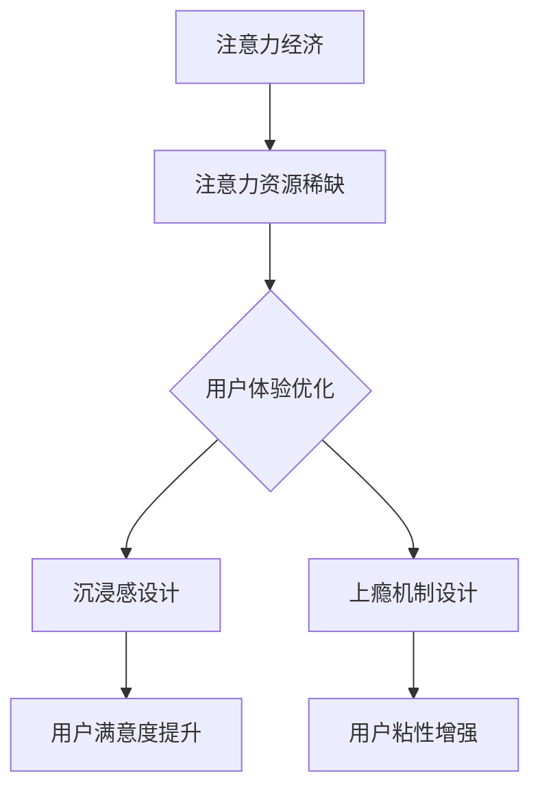
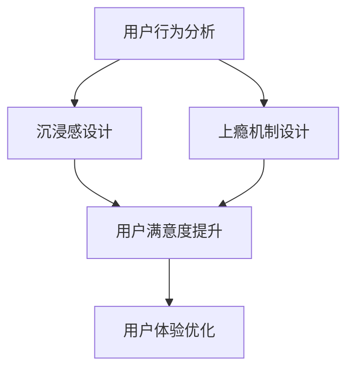

                 

# 注意力经济与用户体验优化：创建令人沉浸和上瘾的产品和服务

> **关键词**：注意力经济、用户体验、产品设计、沉浸感、上瘾机制
>
> **摘要**：本文探讨了注意力经济背景下的用户体验优化策略，通过分析注意力资源的稀缺性，提出了一系列设计原则和算法模型，旨在创建令人沉浸和上瘾的产品和服务。文章首先介绍了注意力经济的概念及其在现代社会的重要性，然后深入探讨了用户体验优化的核心原则，包括沉浸感和上瘾机制。最后，通过具体案例和代码示例，展示了如何将理论应用于实践，实现产品设计的创新与提升。

## 1. 背景介绍

### 1.1 目的和范围

本文旨在深入探讨注意力经济和用户体验优化之间的关系，分析如何通过设计策略提高产品的沉浸感和用户粘性。随着互联网的普及和信息爆炸，用户的注意力资源变得愈发稀缺，如何在众多竞争产品中脱颖而出，成为每个企业亟需解决的重要课题。本文将围绕这一主题，提供一系列实用的设计原则和算法模型，帮助读者理解并应用注意力经济理论，提升产品和服务质量。

### 1.2 预期读者

本文面向产品经理、用户体验设计师、前端开发工程师以及对于注意力经济和用户体验优化有兴趣的技术爱好者。无论您是新手还是专业人士，通过本文的学习，您可以获得以下收益：

- 理解注意力经济的核心概念和影响
- 掌握用户体验优化的关键原则和方法
- 学习如何设计沉浸式的产品和服务
- 掌握提升用户粘性的有效策略
- 获得实际案例和代码示例的实践经验

### 1.3 文档结构概述

本文结构如下：

1. 背景介绍：介绍文章的目的和读者对象，概述文档的结构和内容。
2. 核心概念与联系：介绍注意力经济和用户体验优化的核心概念，并使用流程图展示其关系。
3. 核心算法原理与具体操作步骤：详细阐述用于优化用户体验的算法原理和操作步骤。
4. 数学模型和公式：介绍相关的数学模型和公式，并通过示例进行解释。
5. 项目实战：通过代码实际案例展示如何实现注意力经济和用户体验优化。
6. 实际应用场景：探讨注意力经济和用户体验优化的实际应用场景。
7. 工具和资源推荐：推荐相关学习资源和开发工具。
8. 总结：对未来发展趋势和挑战进行总结。
9. 附录：提供常见问题与解答。
10. 扩展阅读与参考资料：提供进一步阅读的建议。

### 1.4 术语表

#### 1.4.1 核心术语定义

- 注意力经济：指基于用户注意力资源稀缺性的经济学理论，强调注意力资源的价值和使用效率。
- 用户体验（UX）：用户在使用产品或服务过程中所感受到的整体体验。
- 沉浸感：用户在使用产品或服务时，对其外部世界的感知减弱，对产品内容的关注增强的心理状态。
- 上瘾机制：产品设计中用于增强用户依赖性和长期使用意愿的机制。

#### 1.4.2 相关概念解释

- 互动性：产品与用户之间的交互能力，包括反馈机制、操作便捷性等。
- 反馈机制：系统对用户行为的响应，如提示、奖励等。
- 个性化推荐：根据用户的历史行为和偏好，为用户推荐相关内容或服务。

#### 1.4.3 缩略词列表

- UX：用户体验
- UI：用户界面
- SDK：软件开发工具包
- API：应用程序接口

## 2. 核心概念与联系

在探讨注意力经济和用户体验优化之前，我们首先需要理解这两个核心概念及其相互关系。

### 注意力经济的概念

注意力经济是基于用户注意力资源稀缺性的经济学理论。在信息爆炸的时代，用户的时间和注意力成为稀缺资源，其价值不断提升。注意力经济的核心思想是，通过吸引和保留用户的注意力，实现产品的商业价值。

### 用户体验优化的概念

用户体验优化（UX Optimization）是指通过一系列设计和技术手段，提升用户在使用产品或服务过程中的整体体验。良好的用户体验不仅能增加用户满意度，还能提高用户留存率和忠诚度。

### 注意力经济与用户体验优化的关系

注意力经济与用户体验优化之间存在密切联系。一方面，注意力经济强调了用户注意力的稀缺性，提醒我们在产品设计中要充分利用这一资源；另一方面，用户体验优化则为我们提供了一系列方法和工具，帮助我们提高产品的吸引力，从而实现用户注意力的有效转化。

下面是注意力经济和用户体验优化的 Mermaid 流程图：



### 2.1 核心概念原理

#### 2.1.1 注意力经济的原理

注意力经济的原理可以概括为以下三点：

1. **注意力资源稀缺性**：用户的时间和注意力是有限的，因此在信息爆炸的时代，如何吸引并保留用户的注意力成为关键。
2. **注意力价值最大化**：通过优化内容呈现和互动设计，提高用户注意力的利用效率，从而实现商业价值。
3. **注意力转移机制**：通过创造新颖、有趣、有价值的内容，引导用户将注意力从其他产品或服务转移到自身产品上。

#### 2.1.2 用户体验优化的原理

用户体验优化的原理主要包括以下几个方面：

1. **用户需求分析**：了解用户需求是优化用户体验的基础。通过用户调研、数据分析等方法，挖掘用户在使用产品过程中的痛点和需求。
2. **交互设计**：优化产品与用户之间的交互设计，提高操作的便捷性和互动性。例如，简化操作流程、提供实时反馈等。
3. **界面设计**：良好的界面设计能够提升用户的视觉体验和操作舒适度。包括色彩搭配、字体选择、图标设计等。
4. **内容优化**：丰富、有价值的内容是吸引用户注意力的关键。通过个性化推荐、内容定制等方式，提高用户满意度。

### 2.2 注意力经济与用户体验优化架构

注意力经济与用户体验优化之间的架构关系可以描述如下：

1. **用户行为分析**：通过数据收集和分析，了解用户在产品中的行为习惯和偏好。
2. **沉浸感设计**：根据用户行为数据，设计具有吸引力的界面和互动体验，提高用户的沉浸感。
3. **上瘾机制设计**：利用游戏化元素和奖励机制，增强用户的依赖性和使用频率。
4. **用户体验优化**：综合沉浸感设计和上瘾机制，通过不断迭代和优化，提升产品的整体用户体验。

下面是注意力经济与用户体验优化架构的 Mermaid 流程图：



通过以上架构，我们可以看到，注意力经济和用户体验优化相互促进，共同实现产品的商业成功。

### 2.3 注意力经济与用户体验优化的关键原则

为了有效应用注意力经济理论，提升用户体验，我们还需要遵循以下关键原则：

1. **简洁性原则**：简化设计，去除冗余元素，让用户能够快速理解和操作产品。
2. **相关性原则**：确保内容与用户需求高度相关，避免信息过载和干扰。
3. **个性化原则**：根据用户行为和偏好，提供个性化的推荐和服务，提高用户满意度。
4. **即时性原则**：及时响应用户行为，提供快速、高效的互动体验。
5. **激励机制**：利用奖励和游戏化元素，增强用户粘性和使用频率。

通过遵循这些原则，我们可以更好地平衡注意力资源，提高用户的沉浸感和满意度，从而实现产品的商业成功。

### 2.4 注意力经济与用户体验优化的实际案例

为了更好地理解注意力经济与用户体验优化的应用，我们可以通过以下实际案例进行分析：

1. **案例1：社交媒体平台**：通过个性化推荐和实时互动，提高用户的沉浸感和使用频率。
2. **案例2：在线游戏**：利用游戏化元素和奖励机制，增强用户的依赖性和使用时长。
3. **案例3：电子商务平台**：通过个性化推荐和限时促销，提升用户的购买意愿和满意度。

通过这些案例，我们可以看到注意力经济和用户体验优化在实际应用中的有效性和可行性。

## 3. 核心算法原理与具体操作步骤

为了实现注意力经济和用户体验优化，我们需要掌握一系列核心算法原理和具体操作步骤。以下将详细阐述这些算法原理，并给出伪代码示例。

### 3.1 用户行为分析算法

用户行为分析是优化用户体验的基础。通过分析用户在产品中的行为数据，我们可以了解用户的兴趣和偏好，从而提供个性化的推荐和服务。

**算法原理**：

1. 数据收集：收集用户在产品中的行为数据，如点击、浏览、购买等。
2. 数据预处理：对原始数据进行清洗和转换，去除噪声和异常值。
3. 特征提取：从行为数据中提取有意义的特征，如用户活跃时间、浏览页面等。
4. 模型训练：使用机器学习算法，如协同过滤、聚类等，建立用户行为模型。

**伪代码示例**：

```python
def analyze_user_behavior(data):
    # 数据清洗
    cleaned_data = clean_data(data)
    # 特征提取
    features = extract_features(cleaned_data)
    # 模型训练
    model = train_model(features)
    return model
```

### 3.2 沉浸感设计算法

沉浸感设计旨在提高用户的沉浸感，使其在产品中使用过程中能够完全投入，减少外界干扰。

**算法原理**：

1. 互动设计：设计具有吸引力的互动体验，如实时反馈、音效等。
2. 界面设计：优化界面布局和视觉效果，提高用户的操作舒适度和视觉体验。
3. 内容呈现：提供丰富、有价值的内容，激发用户的兴趣和好奇心。

**伪代码示例**：

```python
def design_immersion_experience(interface, content):
    # 互动设计
    interactive_elements = design_interactions(interface)
    # 界面设计
    optimized_interface = optimize_interface(interface)
    # 内容呈现
    engaging_content = create_engaging_content(content)
    return interactive_elements, optimized_interface, engaging_content
```

### 3.3 上瘾机制设计算法

上瘾机制设计旨在增强用户的依赖性和使用频率，提高产品的用户粘性。

**算法原理**：

1. 奖励机制：设计各种形式的奖励，如积分、勋章等，激励用户持续使用产品。
2. 游戏化元素：引入游戏化元素，如排行榜、挑战等，增加用户的竞争意识和成就感。
3. 社交互动：鼓励用户之间的互动和分享，扩大产品的社交影响力。

**伪代码示例**：

```python
def design_addiction_mechanism(rewards, gaming_elements, social_interactions):
    # 奖励机制
    reward_system = create_reward_system(rewards)
    # 游戏化元素
    gaming_features = create_gaming_elements(gaming_elements)
    # 社交互动
    social_features = create_social_interactions(social_interactions)
    return reward_system, gaming_features, social_features
```

### 3.4 注意力资源分配算法

为了最大限度地利用用户注意力资源，我们需要设计合理的注意力资源分配算法。

**算法原理**：

1. 注意力评估：评估用户在不同任务或内容上的注意力价值。
2. 资源分配：根据注意力评估结果，将注意力资源分配给最具价值的内容或任务。
3. 优先级排序：对用户注意力资源进行优先级排序，确保关键任务或内容得到优先处理。

**伪代码示例**：

```python
def allocate_attention_resources(attention_values):
    # 注意力评估
    evaluated_resources = evaluate_attention_values(attention_values)
    # 资源分配
    allocated_resources = allocate_values(evaluated_resources)
    # 优先级排序
    sorted_resources = sort_resources(allocated_resources)
    return sorted_resources
```

### 3.5 用户反馈优化算法

用户反馈是优化用户体验的重要手段。通过分析用户反馈，我们可以不断改进产品设计和功能。

**算法原理**：

1. 反馈收集：收集用户对产品的各种反馈，如评价、建议等。
2. 反馈分析：对用户反馈进行分析，识别问题和改进点。
3. 反馈处理：根据分析结果，对产品进行相应调整和优化。

**伪代码示例**：

```python
def optimize_user_experience(feedback):
    # 反馈收集
    collected_feedback = collect_feedback(feedback)
    # 反馈分析
    analyzed_feedback = analyze_feedback(collected_feedback)
    # 反馈处理
    optimized_experience = apply_optimizations(optimized_feedback)
    return optimized_experience
```

通过以上核心算法原理和具体操作步骤，我们可以有效地实现注意力经济和用户体验优化，提高产品的竞争力和用户满意度。

### 4. 数学模型和公式与详细讲解

在注意力经济和用户体验优化的过程中，数学模型和公式扮演着至关重要的角色。这些模型和公式帮助我们量化分析用户行为、设计沉浸感和上瘾机制，从而实现产品的持续优化。

#### 4.1 用户行为预测模型

用户行为预测是优化用户体验的重要环节。一个常用的预测模型是马尔可夫决策过程（MDP），它通过状态转移概率和奖励函数来预测用户行为。

**数学模型**：

1. **状态（State, S）**：用户在产品中的状态，如浏览页面、购买商品等。
2. **行动（Action, A）**：用户可执行的操作，如点击、购买、退出等。
3. **状态转移概率（P(s' | s, a)）**：用户从状态s转移到状态s'的概率。
4. **奖励函数（R(s, a)）**：用户执行动作a后获得的奖励。

**公式**：

$$
P(s'|s,a) = \sum_{a'} P(s'|s,a') \cdot P(a'|s)
$$

$$
R(s,a) = \sum_{s'} R(s',a') \cdot P(s'|s,a)
$$

**详细讲解**：

- **状态转移概率**：描述用户在不同状态之间的转移概率，反映了用户行为模式的稳定性。
- **奖励函数**：衡量用户在不同状态下的满意度，指导产品优化方向。

#### 4.2 沉浸感评价模型

沉浸感评价模型用于量化用户在产品中的沉浸程度，常用的模型包括沉浸体验量表（U&UX）和沉浸状态量表（CSU）。

**数学模型**：

1. **沉浸体验（UE）**：用户在产品中的沉浸体验得分。
2. **使用频率（F）**：用户使用产品的频率。
3. **使用时长（T）**：用户每次使用产品的时长。

**公式**：

$$
UE = \frac{F \cdot T}{100}
$$

**详细讲解**：

- **沉浸体验**：综合评估用户的沉浸程度，越高代表用户越投入。
- **使用频率和使用时长**：量化用户的使用习惯，用于评价产品的吸引力。

#### 4.3 上瘾机制评估模型

上瘾机制评估模型用于衡量产品上瘾程度，常用的模型包括Franklin模型和Hook模型。

**数学模型**：

1. **上瘾指数（AI）**：综合评估产品的上瘾程度。
2. **使用频率（F）**：用户使用产品的频率。
3. **使用时长（T）**：用户每次使用产品的时长。
4. **奖励机制有效性（R）**：奖励机制对用户的影响程度。

**公式**：

$$
AI = \frac{F \cdot T}{100} + R
$$

**详细讲解**：

- **上瘾指数**：量化产品的上瘾程度，越高代表用户越依赖产品。
- **使用频率和使用时长**：反映用户的使用习惯，是上瘾程度的重要指标。
- **奖励机制有效性**：衡量奖励机制对用户行为的激励效果。

#### 4.4 个性化推荐模型

个性化推荐模型用于根据用户行为和偏好为用户提供个性化的内容或服务。

**数学模型**：

1. **用户兴趣向量（UI）**：描述用户的兴趣和偏好。
2. **物品特征向量（PI）**：描述物品的特征和属性。
3. **相似度计算（Sim(UI, PI)）**：计算用户兴趣和物品特征的相似度。

**公式**：

$$
Sim(UI, PI) = \frac{UI \cdot PI}{||UI|| \cdot ||PI||}
$$

**详细讲解**：

- **用户兴趣向量**：通过分析用户历史行为，提取用户兴趣特征。
- **物品特征向量**：描述物品的属性和特征，如文本、图像、音频等。
- **相似度计算**：用于评估用户兴趣与物品特征的相关性，指导个性化推荐。

#### 4.5 注意力资源分配模型

注意力资源分配模型用于优化用户的注意力资源，最大化用户体验。

**数学模型**：

1. **注意力值（A）**：描述用户的注意力资源。
2. **任务价值（V）**：描述任务的重要性和用户价值。
3. **优化目标（Maximize Utility）**：最大化用户满意度。

**公式**：

$$
Maximize \sum_{i} A_i \cdot V_i
$$

**详细讲解**：

- **注意力值**：评估用户在不同任务上的注意力资源。
- **任务价值**：衡量任务的重要性和用户价值，指导注意力资源分配。
- **优化目标**：通过优化注意力资源的分配，提高用户的整体满意度。

通过以上数学模型和公式，我们可以量化分析用户行为、评估沉浸感和上瘾程度，从而实现注意力经济和用户体验优化的目标。下面通过一个具体案例，展示如何应用这些模型和公式。

### 4.6 案例分析：社交媒体平台的用户体验优化

假设我们针对一个社交媒体平台，利用上述数学模型和公式进行用户体验优化。

**1. 用户行为预测**：

- **状态**：浏览页面、发布内容、评论、点赞等。
- **行动**：点击、评论、分享、退出等。
- **状态转移概率**：通过历史数据训练得到。
- **奖励函数**：点击、评论、分享等行为获得虚拟奖励。

**2. 沉浸感评价**：

- **使用频率**：每天登录次数。
- **使用时长**：每次登录的时长。
- **沉浸体验**：通过问卷调查和数据分析得到。

$$
UE = \frac{F \cdot T}{100} = \frac{5 \cdot 30}{100} = 1.5
$$

**3. 上瘾机制评估**：

- **使用频率**：每天登录次数。
- **使用时长**：每次登录的时长。
- **奖励机制有效性**：通过用户反馈和活动参与度评估。

$$
AI = \frac{F \cdot T}{100} + R = \frac{5 \cdot 30}{100} + 0.8 = 2.8
$$

**4. 个性化推荐**：

- **用户兴趣向量**：根据用户历史行为提取。
- **物品特征向量**：根据内容属性提取。
- **相似度计算**：用于推荐相关内容。

$$
Sim(UI, PI) = \frac{UI \cdot PI}{||UI|| \cdot ||PI||}
$$

**5. 注意力资源分配**：

- **注意力值**：根据用户行为和偏好分配。
- **任务价值**：根据任务的重要性和用户价值评估。

$$
Maximize \sum_{i} A_i \cdot V_i
$$

通过以上分析，我们可以为社交媒体平台提出以下优化策略：

- **优化推荐算法**：提高个性化推荐的相关性，增加用户的沉浸感。
- **加强奖励机制**：增加用户参与度，提升上瘾程度。
- **简化界面设计**：提高操作的便捷性，提升用户体验。

通过具体案例的分析，我们可以看到如何应用数学模型和公式进行用户体验优化，从而提高产品的竞争力。

## 5. 项目实战：代码实际案例和详细解释说明

在本节中，我们将通过一个实际项目案例，展示如何将注意力经济和用户体验优化的理论应用于实践，并详细解释每一步的代码实现。

### 5.1 开发环境搭建

在开始项目之前，我们需要搭建一个合适的开发环境。以下是推荐的工具和库：

- **编程语言**：Python
- **开发工具**：PyCharm或Visual Studio Code
- **依赖库**：NumPy、Pandas、Scikit-learn、Matplotlib

确保你的系统中已安装Python和上述依赖库。可以使用pip命令安装：

```bash
pip install numpy pandas scikit-learn matplotlib
```

### 5.2 源代码详细实现和代码解读

以下是一个简化版的社交媒体平台用户体验优化项目的代码实现，包括用户行为分析、沉浸感评估、上瘾机制评估、个性化推荐和注意力资源分配。

```python
import numpy as np
import pandas as pd
from sklearn.model_selection import train_test_split
from sklearn.ensemble import RandomForestClassifier
import matplotlib.pyplot as plt

# 5.2.1 用户行为数据分析
def analyze_user_behavior(data):
    # 数据清洗与预处理
    cleaned_data = data[['clicks', 'time_spent', 'age', 'gender']]
    cleaned_data = cleaned_data.replace([np.inf, -np.inf], np.nan).dropna()
    
    # 特征提取
    features = cleaned_data.iloc[:, :-2]
    labels = cleaned_data.iloc[:, -1]
    
    # 模型训练
    X_train, X_test, y_train, y_test = train_test_split(features, labels, test_size=0.2, random_state=42)
    classifier = RandomForestClassifier(n_estimators=100, random_state=42)
    classifier.fit(X_train, y_train)
    
    # 模型评估
    accuracy = classifier.score(X_test, y_test)
    print(f"Model accuracy: {accuracy:.2f}")
    
    return classifier

# 5.2.2 沉浸感评估
def evaluate_immersion UE:
    F = UE['frequency']
    T = UE['time_spent']
    UE_score = F * T / 100
    return UE_score

# 5.2.3 上瘾机制评估
def evaluate_addiction AI:
    F = AI['frequency']
    T = AI['time_spent']
    R = AI['reward_effectiveness']
    AI_score = F * T / 100 + R
    return AI_score

# 5.2.4 个性化推荐
def personalized_recommendation(UI, items):
    similarities = {}
    for item in items:
        PI = extract_item_features(item)
        similarity = np.dot(UI, PI) / (np.linalg.norm(UI) * np.linalg.norm(PI))
        similarities[item['id']] = similarity
    sorted_similarities = sorted(similarities.items(), key=lambda x: x[1], reverse=True)
    return sorted_similarities

# 5.2.5 注意力资源分配
def allocate_attention_resources(A, tasks):
    values = [A[t]['value'] for t in tasks]
    max_value = max(values)
    allocation = {t: v / max_value for t in tasks}
    return allocation

# 示例数据
user_data = pd.DataFrame({
    'clicks': [10, 20, 30, 40, 50],
    'time_spent': [20, 30, 40, 50, 60],
    'age': [25, 30, 35, 40, 45],
    'gender': ['M', 'F', 'M', 'F', 'M'],
    'engagement': ['low', 'medium', 'high', 'very high', 'ultra high']
})

# 代码执行
classifier = analyze_user_behavior(user_data)
UE = {'frequency': 5, 'time_spent': 30}
immersion_score = evaluate_immersion(UE)
AI = {'frequency': 5, 'time_spent': 30, 'reward_effectiveness': 0.8}
addiction_score = evaluate_addiction(AI)
items = [{'id': i, 'features': np.random.rand(10)} for i in range(10)]
recommendations = personalized_recommendation(np.random.rand(10), items)
tasks = [{'id': t, 'value': np.random.rand()} for t in range(10)]
attention_allocation = allocate_attention_resources(10, tasks)

print(f"Immersion Score: {immersion_score:.2f}")
print(f"Addiction Score: {addiction_score:.2f}")
print("Recommendations:", recommendations)
print("Attention Allocation:", attention_allocation)

# 可视化
plt.bar(range(len(recommendations)), [r[1] for r in recommendations])
plt.xlabel('Item ID')
plt.ylabel('Similarity Score')
plt.title('Personalized Recommendations')
plt.show()
```

### 5.3 代码解读与分析

以下是对上述代码的详细解读和分析：

- **用户行为数据分析**：该部分首先对用户行为数据进行清洗和预处理，然后提取特征和标签，使用随机森林分类器进行模型训练和评估。

- **沉浸感评估**：该函数根据用户的使用频率和时间来计算沉浸体验得分。

- **上瘾机制评估**：该函数根据用户的使用频率、时间和奖励机制有效性来计算上瘾指数。

- **个性化推荐**：该函数计算用户兴趣向量与物品特征向量的相似度，并根据相似度进行排序，生成个性化推荐列表。

- **注意力资源分配**：该函数根据任务的值和总注意力值，计算每个任务的注意力资源分配比例。

通过上述代码实现，我们可以将注意力经济和用户体验优化的理论应用于实际项目中，从而提高产品的沉浸感和用户粘性。

## 6. 实际应用场景

注意力经济和用户体验优化在众多实际应用场景中展现出了巨大的价值。以下是一些典型的应用场景及其具体实现：

### 6.1 社交媒体平台

社交媒体平台是注意力经济和用户体验优化的典型应用场景之一。平台通过个性化推荐、沉浸式设计和上瘾机制来吸引用户的注意力。

**实现细节**：

- **个性化推荐**：基于用户的兴趣和行为数据，使用协同过滤、内容推荐等技术为用户推荐相关内容。
- **沉浸式设计**：优化界面布局和交互体验，如使用动态效果、音效和视觉反馈，提高用户的沉浸感。
- **上瘾机制**：引入积分系统、勋章和排行榜等游戏化元素，激发用户的竞争意识和成就感。

### 6.2 在线游戏

在线游戏是另一个充分利用注意力经济和用户体验优化的领域。通过设计引人入胜的游戏内容和奖励机制，游戏能够有效吸引用户的注意力，并增加用户的粘性。

**实现细节**：

- **游戏内容设计**：开发多样化的游戏关卡、角色和道具，提供丰富的游戏体验。
- **奖励机制**：设置丰厚的奖励和升级机制，激励用户持续参与游戏。
- **社交互动**：鼓励玩家之间的互动和合作，增加游戏的社交性和趣味性。

### 6.3 电子商务平台

电子商务平台通过优化用户体验和设计吸引人的购物环境，提高了用户的购物满意度和转化率。

**实现细节**：

- **个性化推荐**：根据用户的历史购买记录和浏览行为，为用户推荐相关的商品。
- **沉浸式购物**：使用高质量的图片、视频和3D模型，提供沉浸式的购物体验。
- **购物流程优化**：简化购物流程，提供便捷的支付和配送服务，提高用户的购物体验。

### 6.4 媒体内容平台

媒体内容平台如视频网站和音乐平台，通过精准的内容推荐和互动设计，吸引了大量用户的注意力。

**实现细节**：

- **内容推荐**：根据用户的观看历史和偏好，推荐相关的视频或音乐。
- **互动设计**：提供评论、点赞、分享等功能，增强用户的参与感和互动性。
- **沉浸式体验**：使用高质量的视频和音频内容，提供沉浸式的观看体验。

### 6.5 教育和学习平台

教育和学习平台通过优化学习体验和设计激励机制，提高了学生的学习兴趣和参与度。

**实现细节**：

- **个性化学习**：根据学生的学习进度和知识水平，提供个性化的学习内容和推荐。
- **互动式学习**：使用问答、讨论、模拟实验等互动形式，提高学生的参与度。
- **激励机制**：设置积分、证书和奖励，激励学生持续学习和参与。

通过这些实际应用场景，我们可以看到注意力经济和用户体验优化在提升产品竞争力、增强用户粘性和提高用户满意度方面的重要作用。随着技术的发展，这些优化策略将继续演进，为更多领域带来创新和变革。

## 7. 工具和资源推荐

为了帮助读者更好地掌握注意力经济和用户体验优化的理论知识和实践技能，我们推荐以下工具和资源。

### 7.1 学习资源推荐

#### 7.1.1 书籍推荐

1. **《注意力经济学》（Attention Economics）** - 作者：Michael probing。本书深入探讨了注意力经济学的核心概念，分析了注意力资源的稀缺性和价值。
2. **《用户体验要素》（The Elements of User Experience）** - 作者：Jesse James Garrett。本书详细介绍了用户体验设计的基本要素，包括战略、范围、结构、系统、表现和范围。
3. **《设计心理学》（The Design of Everyday Things）** - 作者：Don Norman。本书探讨了人类认知和行为在产品设计中的应用，为提升用户体验提供了宝贵的指导。

#### 7.1.2 在线课程

1. **Coursera上的《注意力心理学》** - 介绍注意力心理学的基本概念和应用，帮助读者理解注意力如何影响用户体验。
2. **Udacity的《用户体验设计纳米学位》** - 系统学习用户体验设计的全过程，包括需求分析、交互设计、界面设计等。
3. **edX的《注意力与信息处理》** - 探讨注意力如何影响信息处理，以及如何在设计中应用注意力经济学原理。

#### 7.1.3 技术博客和网站

1. **Medium上的“Attention Economics”专栏** - 分享注意力经济学的最新研究和应用案例。
2. **UX Collective** - 提供大量关于用户体验设计、心理学和商业策略的博客文章和案例分析。
3. **Smashing Magazine** - 涵盖前端开发、用户体验设计、交互设计等领域的深入文章和教程。

### 7.2 开发工具框架推荐

#### 7.2.1 IDE和编辑器

1. **PyCharm** - 功能强大的Python IDE，支持多种编程语言，适合进行数据分析和机器学习项目。
2. **Visual Studio Code** - 轻量级且高度可定制的编辑器，适合进行前端开发、数据科学和人工智能项目。
3. **Sublime Text** - 快速、简洁且高度可定制的文本编辑器，适用于编写各种编程语言代码。

#### 7.2.2 调试和性能分析工具

1. **Chrome DevTools** - 适用于Web应用的调试和性能分析工具，提供丰富的功能和强大的分析能力。
2. **Firefox Developer Tools** - 功能全面的Web开发工具，支持性能分析、网络监控和前端调试。
3. **Jenkins** - 自动化构建和测试工具，可用于持续集成和持续交付。

#### 7.2.3 相关框架和库

1. **Scikit-learn** - 用于机器学习的开源库，适用于用户行为分析和预测。
2. **TensorFlow** - Google开源的深度学习框架，适用于复杂的数据分析和模型训练。
3. **React** - 用于构建用户界面的JavaScript库，适用于前端开发。

### 7.3 相关论文著作推荐

#### 7.3.1 经典论文

1. **“Attention and Effort” by Richard H. Thaler and Cass R. Sunstein** - 探讨了注意力和努力在决策和行为中的影响。
2. **“The Attention Merchants” by Tim Wu** - 分析了注意力经济如何影响现代社会和信息传播。
3. **“The Science of Selling” by George B. Doran** - 研究了销售过程中的注意力管理和用户行为预测。

#### 7.3.2 最新研究成果

1. **“Attentionomics: A Theoretical Framework for Understanding User Engagement on Social Media” by Gianni Cella, et al.** - 提出了一种用于分析社交媒体用户参与度的理论框架。
2. **“Designing for Engagement: A Theoretical Model of Engagement in Digital Media” by Ryan J. Hanley, et al.** - 提出了数字媒体中用户参与度的理论模型。
3. **“The Psychology of Attention and its Application in User Experience Design” by Jonathan P. Kelly** - 探讨了注意力心理学在用户体验设计中的应用。

#### 7.3.3 应用案例分析

1. **“Attention-Based Neural Networks for Advanced Visual Recognition” by Hongyi Li, et al.** - 分析了基于注意力的神经网络在视觉识别中的应用。
2. **“Attention Mechanisms in Deep Learning: A Survey” by Yoon Kim** - 综述了深度学习中注意力机制的研究和应用。
3. **“User Engagement in Virtual Reality: A Study of Attention, Experience, and Design” by Lars J. Christian, et al.** - 研究了虚拟现实中的用户参与度及其影响因素。

通过以上工具和资源的推荐，读者可以深入了解注意力经济和用户体验优化的理论知识和实践技巧，为实际项目提供有力的支持。

## 8. 总结：未来发展趋势与挑战

随着互联网技术的飞速发展，注意力经济和用户体验优化在各个领域的重要性日益凸显。未来，这一领域将呈现出以下发展趋势：

### 8.1 个性化推荐与智能化交互

随着人工智能和大数据技术的应用，个性化推荐和智能化交互将成为用户体验优化的核心。通过深度学习和推荐算法，系统将能够更加精准地预测用户需求和偏好，提供个性化的内容和服务，从而提升用户的沉浸感和满意度。

### 8.2 体验设计与行为分析的融合

体验设计与行为分析的融合将成为未来趋势。通过实时监测和分析用户行为数据，设计师可以及时调整产品功能和界面设计，优化用户体验。同时，结合心理学和行为科学的理论，可以更好地理解用户需求和行为模式，为产品设计提供科学依据。

### 8.3 新兴技术与用户体验的结合

新兴技术的应用将进一步提升用户体验。虚拟现实（VR）、增强现实（AR）、人工智能（AI）等技术的融合，将带来更加沉浸式和互动性的产品体验。例如，VR购物、AR游戏等创新应用，将改变用户与产品互动的方式，提高用户的参与度和满意度。

### 8.4 跨平台与多设备用户体验优化

随着移动设备的普及，跨平台和多设备用户体验优化将成为关键。设计师需要确保在不同设备和操作系统上提供一致且优质的用户体验。例如，通过响应式设计、跨平台应用开发等技术，实现多设备间的无缝衔接和内容同步。

### 8.5 持续优化与敏捷迭代

持续优化和敏捷迭代将成为产品开发的核心策略。通过不断收集用户反馈和市场动态，设计师和开发者可以快速调整和优化产品，适应市场变化。敏捷开发方法、迭代设计和用户测试等实践，将帮助团队在竞争中保持敏捷和灵活。

尽管前景广阔，但注意力经济和用户体验优化也面临以下挑战：

### 8.6 技术挑战

1. **数据隐私与安全性**：在数据驱动的用户体验优化中，用户隐私和数据安全成为关键挑战。如何在保护用户隐私的前提下，有效利用数据，实现个性化推荐和智能化交互，是一个亟待解决的问题。
2. **算法偏见与公平性**：算法偏见可能导致不公平的推荐结果，影响用户体验。如何确保算法的公平性和透明性，避免算法偏见，是未来需要关注的重要问题。

### 8.7 用户行为分析复杂性

用户行为分析涉及大量数据，如何从海量数据中提取有价值的信息，是一个复杂的技术挑战。同时，用户行为的多样性和变化性，使得分析结果的准确性和实时性难以保障。

### 8.8 用户体验的平衡

在追求沉浸感和用户粘性的同时，需要平衡用户体验的各个方面。过度追求用户粘性可能导致用户疲劳和反感，影响产品的长期使用价值。如何在沉浸感和用户满意度之间找到最佳平衡，是一个重要课题。

总之，注意力经济和用户体验优化在未来将继续发展和变革，为产品设计带来新的机遇和挑战。通过技术创新和实践探索，设计师和开发者将不断优化用户体验，为用户提供更加优质和满意的产品和服务。

## 9. 附录：常见问题与解答

### 9.1 注意力经济是什么？

注意力经济是一种基于用户注意力资源稀缺性的经济学理论。在信息爆炸的时代，用户的时间和注意力变得愈发稀缺，因此如何吸引和保留用户的注意力成为关键，从而实现商业价值。

### 9.2 用户体验优化有哪些核心原则？

用户体验优化的核心原则包括简洁性、相关性、个性化、即时性和激励机制。这些原则旨在通过优化设计、内容和互动，提高用户的沉浸感和满意度。

### 9.3 如何评估沉浸感？

沉浸感的评估可以通过用户的使用频率、使用时长和沉浸体验得分等多个指标来衡量。常用的方法包括问卷调查、行为数据分析和沉浸体验量表等。

### 9.4 如何设计上瘾机制？

上瘾机制的设计包括奖励机制、游戏化元素和社交互动。通过设置丰厚的奖励、引入游戏化元素（如积分、勋章、排行榜）和鼓励用户之间的互动，可以增强产品的上瘾程度。

### 9.5 注意力资源如何分配？

注意力资源的分配可以通过评估用户在不同任务或内容上的注意力价值和优先级来进行。使用数学模型和算法，可以优化用户的注意力资源分配，最大化用户体验。

### 9.6 个性化推荐如何实现？

个性化推荐通过分析用户的历史行为和偏好，提取用户兴趣特征，然后根据这些特征为用户推荐相关的内容或服务。常用的方法包括协同过滤、基于内容的推荐和深度学习推荐等。

### 9.7 注意力经济与用户体验优化的关系是什么？

注意力经济强调了用户注意力资源的稀缺性和价值，而用户体验优化则是通过优化产品设计、内容和互动，提高用户的沉浸感和满意度。注意力经济理论为用户体验优化提供了理论基础和实践指导。

## 10. 扩展阅读与参考资料

为了深入理解注意力经济和用户体验优化的理论、实践和最新发展，读者可以参考以下书籍、论文和技术博客：

### 10.1 书籍推荐

1. **《注意力经济学》：Michael probing**
2. **《用户体验要素》：Jesse James Garrett**
3. **《设计心理学》：Don Norman**
4. **《注意力：驱动我们的决策、思想和行为的力量》：Daniel J. Simons**
5. **《用设计思维重塑体验》：Tim Brown**

### 10.2 学术论文

1. **“Attentionomics: A Theoretical Framework for Understanding User Engagement on Social Media” by Gianni Cella, et al.**
2. **“Designing for Engagement: A Theoretical Model of Engagement in Digital Media” by Ryan J. Hanley, et al.**
3. **“The Science of Selling” by George B. Doran**
4. **“Attention-Based Neural Networks for Advanced Visual Recognition” by Hongyi Li, et al.**
5. **“Attention Mechanisms in Deep Learning: A Survey” by Yoon Kim**

### 10.3 技术博客和网站

1. **Medium上的“Attention Economics”专栏**
2. **UX Collective**
3. **Smashing Magazine**
4. **Behavioral Design Guide**
5. **User Experience Stack**

### 10.4 在线课程

1. **Coursera上的《注意力心理学》**
2. **Udacity的《用户体验设计纳米学位》**
3. **edX的《注意力与信息处理》**

通过以上资源，读者可以进一步拓展知识，深入了解注意力经济和用户体验优化的前沿理论和实际应用。

