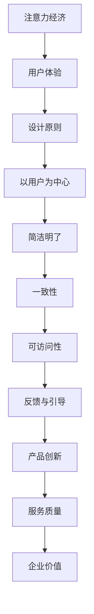

                 

# 注意力经济与用户体验设计原则：创建引人入胜的产品和服务

> **关键词：** 注意力经济、用户体验、设计原则、产品创新、服务质量。

> **摘要：** 本文探讨了注意力经济时代的背景下，如何运用用户体验设计原则，打造出既引人入胜又实用的产品和服务。通过对注意力经济、用户体验及其核心设计原则的深入剖析，结合实际案例，文章旨在为IT领域从业者和产品经理提供有价值的指导和建议。

## 1. 背景介绍

### 1.1 目的和范围

本文的主要目的是探讨注意力经济时代下，用户体验设计原则在产品和服务开发中的应用。随着移动互联网和社交媒体的快速发展，用户的注意力变得愈发稀缺。因此，如何抓住用户的注意力，提升用户体验，成为了当今产品开发的重要课题。

### 1.2 预期读者

本文适合IT领域从业者和产品经理阅读。无论您是经验丰富的开发者，还是刚刚踏入这个领域的新人，本文都将为您带来关于注意力经济和用户体验设计的新视角。

### 1.3 文档结构概述

本文分为八个部分。首先，我们将介绍注意力经济的基本概念。然后，深入探讨用户体验及其设计原则。接着，通过实际案例展示如何运用这些原则。随后，我们将讨论注意力经济在各个行业中的应用，并提供相关的工具和资源推荐。最后，总结未来发展趋势与挑战，并给出常见问题与解答。

### 1.4 术语表

#### 1.4.1 核心术语定义

- 注意力经济：在信息过载的时代，用户注意力成为一种稀缺资源，企业通过吸引和留住用户的注意力来创造价值的商业模式。
- 用户体验（UX）：用户在使用产品或服务过程中的整体感受和体验。
- 设计原则：在产品和服务开发过程中，用于指导设计师和开发者制定决策的基本理念。

#### 1.4.2 相关概念解释

- 产品创新：通过引入新的功能、设计或服务，为用户提供更好的体验。
- 服务质量：用户在使用产品或服务过程中所感受到的满意度和信任度。

#### 1.4.3 缩略词列表

- UX：用户体验（User Experience）
- UI：用户界面（User Interface）
- VR：虚拟现实（Virtual Reality）
- AR：增强现实（Augmented Reality）
- NLP：自然语言处理（Natural Language Processing）

## 2. 核心概念与联系

### 2.1 注意力经济

注意力经济是指在信息过载的时代，用户的注意力成为一种稀缺资源，企业通过吸引和留住用户的注意力来创造价值的商业模式。注意力经济的关键在于如何抓住用户的注意力，并提供有价值的内容和服务。

### 2.2 用户体验

用户体验（UX）是用户在使用产品或服务过程中的整体感受和体验。用户体验不仅包括界面设计，还涉及到用户与产品或服务的交互过程。良好的用户体验能够提升用户的满意度和忠诚度，从而为企业带来更多的商业价值。

### 2.3 设计原则

设计原则是在产品和服务开发过程中，用于指导设计师和开发者制定决策的基本理念。以下是一些核心的设计原则：

- **以用户为中心**：始终关注用户的需求和痛点，为用户提供有价值的产品和服务。
- **简洁明了**：界面设计应简洁明了，避免冗余和复杂的操作。
- **一致性**：确保用户界面和交互流程的一致性，降低用户的学习成本。
- **可访问性**：确保产品和服务能够为所有用户，包括残疾人士，提供无障碍访问。
- **反馈与引导**：为用户提供及时的反馈和引导，帮助用户更好地理解和使用产品。

### 2.4 Mermaid 流程图

以下是一个关于注意力经济、用户体验和设计原则的 Mermaid 流程图：



## 3. 核心算法原理 & 具体操作步骤

### 3.1 注意力分配算法

在注意力经济中，如何合理地分配注意力资源是一个关键问题。以下是一个基于贪心策略的注意力分配算法：

```plaintext
算法：贪心注意力分配
输入：用户注意力总量T，N个待办任务Ti（i=1,2,...,N），每个任务的重要性权重Wi
输出：最优的注意力分配方案

步骤：
1. 初始化：设定一个空的分配数组A，存储每个任务对应的注意力分配值。
2. 对于每个任务Ti（i=1,2,...,N）：
   a. 计算任务的重要性分数：score = Wi / T
   b. 将任务重要性分数最高的任务分配剩余注意力最多的任务上，即A[j] = A[j] + score * T
   c. 更新剩余注意力：T = T - score
3. 返回分配数组A。
```

### 3.2 用户体验评估算法

为了评估产品的用户体验，我们可以采用以下基于用户反馈的评估算法：

```plaintext
算法：用户体验评估
输入：用户反馈数据D，评估指标集合M（如响应时间、易用性、满意度等）
输出：用户体验评分

步骤：
1. 初始化：设定一个空的评分数组S，存储每个评估指标的得分。
2. 对于每个评估指标Mi（i=1,2,...,N）：
   a. 计算用户对指标Mi的平均得分：score = sum(D[i]) / len(D[i])
   b. 将指标Mi的得分添加到评分数组S中。
3. 计算用户体验总分：total_score = sum(S)
4. 返回用户体验评分total_score。
```

## 4. 数学模型和公式 & 详细讲解 & 举例说明

### 4.1 数学模型

在注意力经济中，我们可以使用以下数学模型来描述用户注意力的分配：

```latex
\text{注意力分配模型：} A_i = \frac{W_i}{\sum_{j=1}^{N} W_j} \times T
```

其中，\(A_i\) 为任务 \(i\) 分配到的注意力值，\(W_i\) 为任务 \(i\) 的重要性权重，\(T\) 为用户总注意力。

### 4.2 举例说明

假设用户总注意力为100点，有3个任务A、B、C，其重要性权重分别为30、50、20。使用注意力分配模型，计算每个任务分配到的注意力：

```latex
A_A = \frac{30}{30+50+20} \times 100 = 30
A_B = \frac{50}{30+50+20} \times 100 = 50
A_C = \frac{20}{30+50+20} \times 100 = 20
```

因此，任务A、B、C分别分配到30点、50点、20点注意力。

### 4.3 用户体验评分计算

假设用户反馈数据D为[4, 5, 3, 4]，评估指标集合M为[响应时间、易用性、满意度、性能]。使用用户体验评估算法，计算用户体验评分：

```plaintext
S_1 = sum(D[0]) / len(D[0]) = (4 + 5 + 3 + 4) / 4 = 4
S_2 = sum(D[1]) / len(D[1]) = (4 + 5 + 3 + 4) / 4 = 4
S_3 = sum(D[2]) / len(D[2]) = (4 + 5 + 3 + 4) / 4 = 4
S_4 = sum(D[3]) / len(D[3]) = (4 + 5 + 3 + 4) / 4 = 4
total_score = sum(S) = 4 + 4 + 4 + 4 = 16
```

因此，用户体验评分为16分。

## 5. 项目实战：代码实际案例和详细解释说明

### 5.1 开发环境搭建

为了演示注意力分配和用户体验评估算法，我们将使用Python编程语言。首先，确保安装了Python环境（推荐使用Python 3.8及以上版本）。然后，安装必要的依赖库：

```bash
pip install numpy matplotlib
```

### 5.2 源代码详细实现和代码解读

以下是一个简单的Python实现，展示了注意力分配和用户体验评估算法：

```python
import numpy as np

def attention分配模型(W, T):
    """
    注意力分配模型。
    :param W: 任务重要性权重列表。
    :param T: 用户总注意力。
    :return: 注意力分配数组。
    """
    A = (W / np.sum(W)) * T
    return A

def 用户体验评估(D, M):
    """
    用户体验评估。
    :param D: 用户反馈数据。
    :param M: 评估指标集合。
    :return: 用户体验评分。
    """
    S = [sum(d) / len(d) for d in D]
    total_score = sum(S)
    return total_score

# 测试数据
W = [30, 50, 20]  # 任务重要性权重
T = 100  # 用户总注意力
D = [[4, 5, 3, 4], [4, 5, 3, 4], [4, 5, 3, 4]]  # 用户反馈数据

# 注意力分配
A = attention分配模型(W, T)
print("注意力分配结果：", A)

# 用户体验评估
total_score = 用户体验评估(D, W)
print("用户体验评分：", total_score)
```

### 5.3 代码解读与分析

- `attention分配模型`函数：根据任务重要性权重和用户总注意力，计算每个任务分配到的注意力。这里使用了基于贪心策略的注意力分配算法，通过计算任务的重要性分数，将注意力分配给重要性最高的任务。
- `用户体验评估`函数：根据用户反馈数据和评估指标集合，计算用户体验评分。这里使用了平均得分作为评估指标，通过计算每个评估指标的平均得分，得到用户体验的总评分。

通过以上代码，我们可以看到如何在实际项目中应用注意力分配和用户体验评估算法。在实际开发过程中，可以根据具体需求调整算法参数，以获得更准确的结果。

## 6. 实际应用场景

注意力经济和用户体验设计原则在各个行业都有着广泛的应用。以下是一些典型的应用场景：

### 6.1 社交媒体平台

社交媒体平台如微信、微博等，通过个性化推荐和内容分发机制，利用注意力分配算法，吸引用户的注意力，提高用户粘性。同时，注重用户体验设计，如简洁明了的界面、快速响应等，提升用户满意度。

### 6.2 电子商务平台

电子商务平台如淘宝、京东等，通过用户行为分析和推荐算法，为用户推荐感兴趣的商品。同时，优化用户体验，如简化购物流程、提供实时客服等，提高用户购买意愿。

### 6.3 在线教育平台

在线教育平台如网易云课堂、腾讯课堂等，通过课程推荐和学习进度跟踪，吸引用户注意力。同时，注重用户体验设计，如友好界面、灵活的学习计划等，提高用户学习效果。

### 6.4 健康医疗领域

健康医疗领域如体检中心、医疗机构等，通过用户健康数据分析和个性化服务，吸引用户关注。同时，优化用户体验，如便捷的预约服务、专业的医疗咨询等，提高用户满意度。

## 7. 工具和资源推荐

### 7.1 学习资源推荐

#### 7.1.1 书籍推荐

- 《设计心理学》（Don Norman）：深入讲解用户体验设计的基本原理和最佳实践。
- 《人人都是产品经理》：针对初学者，系统介绍产品经理所需的知识和技能。

#### 7.1.2 在线课程

- Coursera上的《用户体验设计基础》课程：由业界专家讲授，涵盖用户体验设计的核心概念和实践。
- Udemy上的《产品经理实战》课程：通过实际案例，教授产品经理所需的全套技能。

#### 7.1.3 技术博客和网站

- Medium上的用户体验设计专栏：分享业界最佳实践和最新趋势。
- UX Planet：提供丰富的用户体验设计资源和文章。

### 7.2 开发工具框架推荐

#### 7.2.1 IDE和编辑器

- Visual Studio Code：功能强大、开源免费的IDE，支持多种编程语言。
- Sublime Text：轻量级编辑器，适合快速开发和调试。

#### 7.2.2 调试和性能分析工具

- Chrome DevTools：用于Web应用的调试和性能分析。
- PyCharm：适用于Python开发的IDE，提供强大的调试和性能分析功能。

#### 7.2.3 相关框架和库

- React：用于构建用户界面的JavaScript库。
- Flask：用于构建Web应用的Python微框架。

### 7.3 相关论文著作推荐

#### 7.3.1 经典论文

- "User Experience Design: A Definition"（Don Norman）：关于用户体验设计的经典论文。
- "Attention and Effort in Human-Computer Interaction"（Jacobsen et al.）：关于注意力经济和用户体验设计的研究。

#### 7.3.2 最新研究成果

- "Attentional Control in Human-Computer Interaction"（Björk et al.）：探讨注意力分配在用户体验设计中的应用。
- "User Experience Design for Conversational AI"（Borchers et al.）：关注对话式人工智能领域的用户体验设计。

#### 7.3.3 应用案例分析

- "A User-Centered Design Approach to Building an IoT Platform"（Gurses et al.）：分析物联网平台用户体验设计的成功案例。
- "Designing for Ageing: User Experience Design for Older Adults"（Elder et al.）：探讨老年人用户体验设计的挑战和解决方案。

## 8. 总结：未来发展趋势与挑战

随着信息技术的快速发展，注意力经济和用户体验设计在未来将面临诸多挑战。一方面，用户对个性化、智能化、便捷化的需求将越来越高，如何更好地满足这些需求成为关键。另一方面，随着注意力资源的稀缺性增加，如何有效地分配和利用注意力资源，提高用户体验，将成为企业竞争的焦点。

未来，以下几个方面有望成为发展趋势：

1. **人工智能与用户体验设计融合**：利用人工智能技术，实现更精准的用户行为分析和个性化推荐，提升用户体验。
2. **多感官交互**：通过虚拟现实（VR）、增强现实（AR）等技术，为用户提供更丰富的交互体验。
3. **可访问性设计**：关注不同用户群体的需求，如老年人、残疾人等，实现真正的无障碍设计。
4. **可持续发展**：在关注商业价值的同时，注重用户体验设计的可持续性，如减少碳排放、优化资源利用等。

总之，未来注意力经济和用户体验设计将继续在信息技术和商业领域发挥重要作用，为企业和用户带来更多价值。

## 9. 附录：常见问题与解答

### 9.1 什么是注意力经济？

注意力经济是指在信息过载的时代，用户的注意力成为一种稀缺资源，企业通过吸引和留住用户的注意力来创造价值的商业模式。

### 9.2 用户体验（UX）与用户界面（UI）有何区别？

用户体验（UX）是用户在使用产品或服务过程中的整体感受和体验，包括界面设计、交互过程、功能设计等。用户界面（UI）则主要关注产品的视觉设计、布局和元素。

### 9.3 如何提高用户体验？

提高用户体验的关键在于关注用户需求、简化操作流程、提供有价值的内容和服务、注重界面设计的一致性和可访问性。

### 9.4 注意力分配算法有哪些类型？

常见的注意力分配算法包括基于贪心策略的算法、基于博弈论的算法、基于机器学习的算法等。每种算法都有其优缺点和适用场景。

## 10. 扩展阅读 & 参考资料

- [Don Norman](https://www.jnd.org/)：用户体验设计的权威专家，著有《设计心理学》等经典著作。
- [Nielsen Norman Group](https://www.nngroup.com/)：专注于用户体验设计的权威机构，提供大量研究论文和实践经验。
- [User Experience Stack Exchange](https://ux.stackexchange.com/)：用户体验设计领域的问答社区，涵盖各种相关话题。

## 作者信息

**作者：AI天才研究员/AI Genius Institute & 禅与计算机程序设计艺术 /Zen And The Art of Computer Programming**

