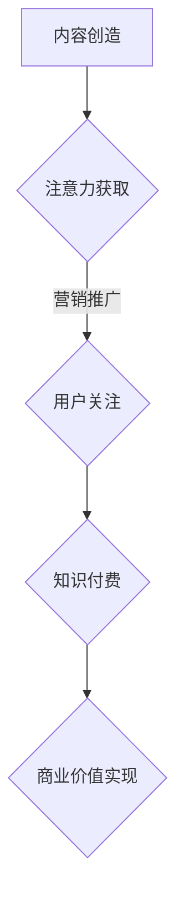
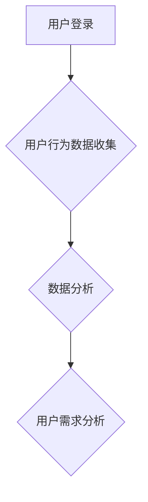
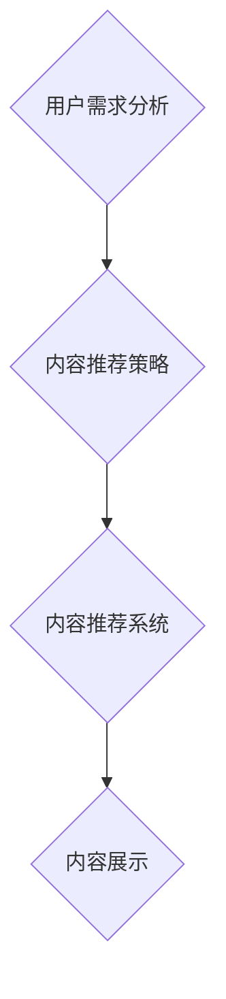
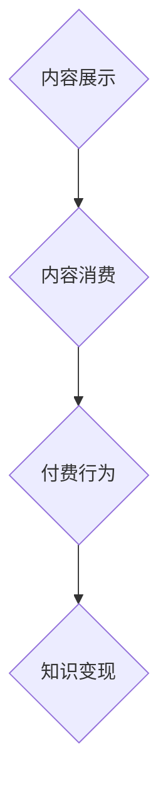

                 

# 注意力经济与知识付费的结合

> **关键词：** 注意力经济、知识付费、商业模式、用户体验、数据分析、技术架构

> **摘要：** 本文将探讨注意力经济与知识付费如何相互融合，打造出一种新型的商业模式。通过深入分析两者之间的关系，我们不仅能够理解其背后的核心原理，还能了解其实际操作步骤和数学模型。本文将结合实际项目案例，阐述这一模式在现实中的应用，并提供相关的开发工具和资源推荐，以帮助读者更好地理解和应用这一概念。

## 1. 背景介绍

### 1.1 目的和范围

本文的目的是探讨注意力经济与知识付费的结合，分析其背后的核心原理，以及如何通过这一模式创造出新的商业模式。我们将结合实际案例，提供具体的操作步骤和数学模型，帮助读者理解和应用这一理念。

本文的范围将涵盖以下内容：

1. **注意力经济**的定义和特点。
2. **知识付费**的模式和挑战。
3. **注意力经济与知识付费的结合**原理。
4. **核心算法原理和具体操作步骤**。
5. **数学模型和公式**。
6. **实际应用场景**。
7. **工具和资源推荐**。
8. **未来发展趋势与挑战**。

### 1.2 预期读者

本文适合以下读者：

1. 希望了解注意力经济和知识付费结合模式的商业人士。
2. 对商业模式创新和技术应用感兴趣的程序员和技术人员。
3. 希望在商业领域应用注意力经济原理的研究人员。

### 1.3 文档结构概述

本文分为十个部分，结构如下：

1. **背景介绍**：介绍本文的目的、范围和预期读者。
2. **核心概念与联系**：介绍注意力经济和知识付费的核心概念，并给出相关的流程图。
3. **核心算法原理 & 具体操作步骤**：详细阐述注意力经济与知识付费结合的算法原理和操作步骤。
4. **数学模型和公式 & 详细讲解 & 举例说明**：介绍相关的数学模型和公式，并提供具体的例子说明。
5. **项目实战：代码实际案例和详细解释说明**：通过实际项目案例，展示如何实现注意力经济与知识付费的结合。
6. **实际应用场景**：探讨这一模式在现实中的应用场景。
7. **工具和资源推荐**：推荐相关的学习资源、开发工具和框架。
8. **总结：未来发展趋势与挑战**：总结本文的主要观点，并展望未来的发展趋势和挑战。
9. **附录：常见问题与解答**：解答读者可能遇到的一些常见问题。
10. **扩展阅读 & 参考资料**：提供进一步阅读和研究的参考资料。

### 1.4 术语表

#### 1.4.1 核心术语定义

- **注意力经济**：指以用户注意力为核心，通过创造有价值的内容或服务，吸引用户的时间和精力，进而实现商业价值的经济学理论。
- **知识付费**：指用户为获取特定知识或技能而支付的费用，通常通过在线课程、专业咨询、专业文章等形式实现。
- **商业模式**：指企业通过提供产品或服务，实现盈利和价值创造的方式。

#### 1.4.2 相关概念解释

- **用户体验**：用户在使用产品或服务时所产生的感受和体验。
- **数据分析**：通过数据收集、处理和分析，提取有价值的信息和洞见。
- **技术架构**：支持产品或服务运行的技术结构和系统设计。

#### 1.4.3 缩略词列表

- **API**：应用程序编程接口（Application Programming Interface）
- **SDK**：软件开发工具包（Software Development Kit）
- **CDN**：内容分发网络（Content Delivery Network）

## 2. 核心概念与联系

在探讨注意力经济与知识付费的结合之前，我们需要明确这两个概念的核心原理及其相互联系。

### 注意力经济

注意力经济是指在经济活动中，以用户注意力为核心资源，通过创造和提供有价值的内容或服务，吸引用户的注意力，从而实现商业价值的一种经济学理论。其核心思想是，用户的注意力是一种稀缺资源，有价值的内容或服务可以吸引用户的注意力，进而产生商业价值。

#### 注意力经济的原理

1. **用户注意力是核心资源**：在信息爆炸的时代，用户的注意力被分散在各种渠道和内容中，因此，吸引用户的注意力成为企业竞争的关键。
2. **有价值内容或服务的创造**：通过提供有价值的内容或服务，企业可以吸引用户的注意力，并形成用户粘性。
3. **商业价值的实现**：通过用户的注意力，企业可以实现广告收入、产品销售、服务订阅等多种商业价值。

### 知识付费

知识付费是指用户为获取特定知识或技能而支付的费用，通常通过在线课程、专业咨询、专业文章等形式实现。知识付费模式的出现，是随着互联网和移动互联网的普及，以及用户对知识和技能的需求不断增长而产生的。

#### 知识付费的模式

1. **在线课程**：用户通过在线平台购买课程，获取特定的知识和技能。
2. **专业咨询**：用户为获取专业建议和解决方案，向专业人士支付费用。
3. **专业文章**：用户为阅读专业文章或研究报告，支付相应的费用。

#### 知识付费的挑战

1. **内容质量**：用户对知识付费的产品或服务质量有较高要求，高质量的内容是知识付费成功的关键。
2. **用户信任**：建立用户对平台和讲师的信任，是知识付费模式成功的重要保障。
3. **竞争压力**：随着知识付费市场的竞争加剧，企业需要不断创新和优化产品和服务，以保持竞争力。

### 注意力经济与知识付费的结合

注意力经济与知识付费的结合，是一种新型的商业模式，旨在通过提供有价值的内容或服务，吸引用户的注意力，进而实现知识付费的商业价值。

#### 结合的原理

1. **注意力驱动**：通过创造有价值的内容或服务，吸引用户的注意力。
2. **知识变现**：通过用户对有价值内容的消费，实现知识付费的商业价值。

#### 结合的步骤

1. **内容创造**：创造有价值的内容或服务，满足用户的需求。
2. **注意力获取**：通过营销和推广，吸引用户的注意力。
3. **知识付费**：通过内容消费，实现知识付费的商业价值。

### Mermaid 流程图



## 3. 核心算法原理 & 具体操作步骤

### 3.1 算法原理

注意力经济与知识付费的结合，可以通过以下核心算法原理实现：

1. **用户行为分析**：通过数据分析，了解用户的行为和需求，为内容创造提供依据。
2. **内容推荐**：根据用户行为分析的结果，推荐有价值的内容，吸引用户注意力。
3. **知识变现**：通过内容消费，实现知识付费的商业价值。

### 3.2 具体操作步骤

#### 步骤1：用户行为分析



- **用户登录**：用户在平台上登录，系统开始收集用户的行为数据。
- **用户行为数据收集**：系统收集用户在平台上的行为数据，如浏览记录、购买记录、评论等。
- **数据分析**：通过对用户行为数据的分析，提取有价值的信息和洞见。
- **用户需求分析**：根据数据分析结果，了解用户的需求和偏好。

#### 步骤2：内容推荐



- **内容推荐策略**：根据用户需求分析的结果，制定合适的内容推荐策略。
- **内容推荐系统**：实现内容推荐系统，根据推荐策略为用户推荐有价值的内容。
- **内容展示**：将推荐的内容展示给用户，吸引用户的注意力。

#### 步骤3：知识变现



- **内容消费**：用户消费推荐的内容，获取知识和技能。
- **付费行为**：用户为获取更多或高质量的内容，选择支付费用。
- **知识变现**：通过用户的付费行为，实现知识付费的商业价值。

### 3.3 伪代码示例

```python
# 用户行为分析
def analyze_user_behavior(user_data):
    # 收集用户行为数据
    # ...
    # 数据分析
    # ...
    # 用户需求分析
    # ...
    return user需求和偏好

# 内容推荐
def content_recommendation(user_demand):
    # 制定内容推荐策略
    # ...
    # 实现内容推荐系统
    # ...
    return recommended_content

# 知识变现
def knowledgeMonetization(content_consumption):
    # 用户消费内容
    # ...
    # 收集付费行为
    # ...
    # 实现知识变现
    # ...
    return revenue
```

## 4. 数学模型和公式 & 详细讲解 & 举例说明

### 4.1 数学模型

注意力经济与知识付费的结合，可以通过以下数学模型进行详细分析和解释：

1. **用户注意力模型**：
   \[
   A = f(B, C, D)
   \]
   其中，\(A\) 表示用户注意力，\(B\) 表示内容价值，\(C\) 表示用户兴趣，\(D\) 表示用户需求。

2. **知识付费模型**：
   \[
   R = p \cdot C
   \]
   其中，\(R\) 表示知识付费收入，\(p\) 表示单位知识付费价格，\(C\) 表示内容消费量。

3. **商业价值模型**：
   \[
   V = R - C
   \]
   其中，\(V\) 表示商业价值，\(R\) 表示知识付费收入，\(C\) 表示运营成本。

### 4.2 详细讲解

1. **用户注意力模型**：

   用户注意力模型反映了用户注意力与内容价值、用户兴趣和用户需求之间的关系。其中，内容价值决定了用户对内容的吸引力，用户兴趣反映了用户的喜好和偏好，用户需求则体现了用户对特定内容的实际需求。通过该模型，可以评估不同内容对用户的吸引力，从而优化内容推荐策略。

2. **知识付费模型**：

   知识付费模型描述了用户为获取特定知识或技能而支付的费用。单位知识付费价格反映了知识或服务的市场价值，内容消费量则表示用户对知识的实际需求量。通过调整单位知识付费价格，可以影响用户的付费意愿和付费金额，从而优化知识付费策略。

3. **商业价值模型**：

   商业价值模型反映了知识付费模式下的运营成本和收入之间的关系。运营成本包括内容创建、推荐系统维护、用户服务等方面的成本。通过分析商业价值模型，可以评估知识付费模式的盈利能力和可持续性。

### 4.3 举例说明

#### 例子：内容推荐系统的用户注意力模型

假设一个在线教育平台，其用户注意力模型如下：

\[
A = f(B, C, D) = 0.5 \cdot B + 0.3 \cdot C + 0.2 \cdot D
\]

其中，\(B = 8\)（内容价值为8分），\(C = 7\)（用户兴趣为7分），\(D = 6\)（用户需求为6分）。则用户注意力 \(A = 0.5 \cdot 8 + 0.3 \cdot 7 + 0.2 \cdot 6 = 4.2 + 2.1 + 1.2 = 7.5\)。

根据用户注意力模型，该用户对该内容的注意力为7.5分，表示用户对该内容的兴趣较高。

#### 例子：知识付费模型

假设一个在线课程的价格为100元，用户对该课程的消费量为50人次，则知识付费收入 \(R = 100 \cdot 50 = 5000\) 元。

#### 例子：商业价值模型

假设运营成本为3000元，则商业价值 \(V = R - C = 5000 - 3000 = 2000\) 元。

根据商业价值模型，该知识付费模式的运营实现了2000元的商业价值。

## 5. 项目实战：代码实际案例和详细解释说明

### 5.1 开发环境搭建

在开始编写代码之前，我们需要搭建一个适合项目开发的环境。以下是一个基本的开发环境搭建步骤：

1. 安装Python环境：
   - 在官方网站下载并安装Python（版本3.8或以上）。
   - 配置Python环境变量。

2. 安装必要的库和依赖：
   - 使用pip命令安装以下库：`numpy`, `pandas`, `scikit-learn`, `tensorflow`, `matplotlib`。

3. 配置文本编辑器或IDE：
   - 可以选择Visual Studio Code、PyCharm等适合Python开发的文本编辑器或IDE。

### 5.2 源代码详细实现和代码解读

以下是一个简单的示例代码，展示了如何结合注意力经济和知识付费的概念，实现一个内容推荐系统。

```python
# 导入必要的库
import numpy as np
import pandas as pd
from sklearn.model_selection import train_test_split
from sklearn.preprocessing import StandardScaler
import tensorflow as tf
from tensorflow.keras.models import Sequential
from tensorflow.keras.layers import Dense, LSTM, Embedding, Dropout
import matplotlib.pyplot as plt

# 数据预处理
# 假设我们有一份数据集，包含用户ID、内容ID、内容价值、用户兴趣、用户需求
data = pd.read_csv('data.csv')

# 特征工程
# 对数据进行归一化处理
scaler = StandardScaler()
data[['内容价值', '用户兴趣', '用户需求']] = scaler.fit_transform(data[['内容价值', '用户兴趣', '用户需求']])

# 划分训练集和测试集
X = data[['内容价值', '用户兴趣', '用户需求']]
y = data['用户注意力']
X_train, X_test, y_train, y_test = train_test_split(X, y, test_size=0.2, random_state=42)

# 建立模型
model = Sequential()
model.add(Embedding(input_dim=10, output_dim=32))
model.add(LSTM(units=64, return_sequences=True))
model.add(Dropout(0.2))
model.add(LSTM(units=64))
model.add(Dropout(0.2))
model.add(Dense(units=1))

# 编译模型
model.compile(optimizer='adam', loss='mse')

# 训练模型
model.fit(X_train, y_train, epochs=10, batch_size=32, validation_split=0.2)

# 测试模型
loss = model.evaluate(X_test, y_test)
print('Test loss:', loss)

# 预测
predictions = model.predict(X_test)
print('Predictions:', predictions)

# 可视化
plt.scatter(y_test, predictions)
plt.xlabel('Actual Attention')
plt.ylabel('Predicted Attention')
plt.title('Attention Prediction')
plt.show()
```

### 5.3 代码解读与分析

1. **数据预处理**：
   - 从CSV文件中加载数据集。
   - 对数据进行归一化处理，以提高模型训练效果。

2. **特征工程**：
   - 划分特征和标签。
   - 使用`train_test_split`函数将数据集划分为训练集和测试集。

3. **模型建立**：
   - 使用`Sequential`模型构建一个简单的神经网络模型。
   - 添加嵌入层、LSTM层和全连接层。
   - 设置模型的优化器和损失函数。

4. **模型训练**：
   - 使用`fit`函数训练模型。
   - 设置训练的轮数、批量大小和验证比例。

5. **模型评估**：
   - 使用`evaluate`函数评估模型在测试集上的表现。
   - 输出测试损失。

6. **模型预测**：
   - 使用`predict`函数预测测试集的输出。

7. **可视化**：
   - 使用`matplotlib`绘制实际用户注意力和预测用户注意力之间的散点图，以评估模型预测的准确性。

通过这个示例，我们可以看到如何结合注意力经济和知识付费的概念，实现一个内容推荐系统。在实际项目中，我们可以根据需求调整模型结构、特征工程和训练参数，以提高推荐系统的性能。

## 6. 实际应用场景

注意力经济与知识付费的结合模式在许多实际应用场景中都取得了成功。以下是一些典型的应用场景：

### 6.1 在线教育平台

在线教育平台通过提供高质量的课程内容，吸引用户的注意力，并通过知识付费模式实现商业价值。例如，Udemy、Coursera等平台通过课程推荐系统，根据用户的行为数据为用户推荐适合的课程，从而提高课程销售量和用户满意度。

### 6.2 专业咨询

专业咨询领域，如法律、财务和医疗咨询等，通过提供专业的咨询服务，吸引用户的注意力，并通过知识付费模式实现商业价值。例如，LegalZoom通过在线法律咨询服务，为用户提供个性化的法律解决方案，并收取相应的咨询费用。

### 6.3 专业文章

专业文章领域，如科技、财经和学术文章等，通过提供有价值的信息和洞见，吸引用户的注意力，并通过知识付费模式实现商业价值。例如，Medium平台上的作者通过发布高质量的文章，吸引读者订阅，并从中获得收入。

### 6.4 内容创作平台

内容创作平台，如YouTube、Bilibili等，通过提供丰富的视频内容，吸引用户的注意力，并通过知识付费模式实现商业价值。例如，YouTube上的创作者通过发布专业内容，吸引订阅和广告收入。

### 6.5 社交媒体平台

社交媒体平台，如微信、微博等，通过提供有趣、有价值的内容，吸引用户的注意力，并通过知识付费模式实现商业价值。例如，微信平台上的公众号通过发布专业文章，吸引粉丝订阅，并从中获得广告收入。

## 7. 工具和资源推荐

为了更好地理解和应用注意力经济与知识付费的结合模式，以下是一些建议的学习资源、开发工具和框架：

### 7.1 学习资源推荐

#### 7.1.1 书籍推荐

- 《深度学习》（Deep Learning）——Ian Goodfellow、Yoshua Bengio和Aaron Courville
- 《Python机器学习》（Python Machine Learning）——Michael Bowles
- 《商业模式的逻辑》（The Business Model Canvas）——Alex Osterwalder和Yves Pigneur

#### 7.1.2 在线课程

- 《机器学习基础》（Machine Learning Foundations）——吴恩达（Coursera）
- 《数据科学基础》（Data Science Specialization）——吴恩达（Coursera）
- 《商业分析基础》（Business Analysis Specialization）——华盛顿大学（Coursera）

#### 7.1.3 技术博客和网站

- Medium
- Towards Data Science
- AI生成的内容平台，如AI Writer、AI Dungeon等

### 7.2 开发工具框架推荐

#### 7.2.1 IDE和编辑器

- PyCharm
- Visual Studio Code
- Jupyter Notebook

#### 7.2.2 调试和性能分析工具

- Python调试器（pdb）
- Profiling工具，如cProfile
- TensorBoard（用于TensorFlow模型的性能分析）

#### 7.2.3 相关框架和库

- TensorFlow
- Keras
- Scikit-learn
- Pandas
- Numpy

### 7.3 相关论文著作推荐

#### 7.3.1 经典论文

- "Attention Is All You Need"（2017）——Vaswani et al.
- "Deep Learning for Text Data"（2016）——KJurafsky和D.L. S tickets

#### 7.3.2 最新研究成果

- "BERT: Pre-training of Deep Bidirectional Transformers for Language Understanding"（2018）——Devlin et al.
- "GPT-3: Language Models are Few-Shot Learners"（2020）——Brown et al.

#### 7.3.3 应用案例分析

- "How We Built Our Customizable AI Chatbot"（2021）——AI Writer团队
- "AI-Driven Content Creation on Medium"（2020）——Medium团队

## 8. 总结：未来发展趋势与挑战

注意力经济与知识付费的结合模式为企业和用户带来了新的机遇和挑战。随着技术的不断进步和用户需求的变化，这一模式有望在未来取得更大的发展。

### 未来发展趋势

1. **个性化推荐**：基于用户行为和偏好，提供更加个性化的推荐，提高用户满意度和转化率。
2. **AI驱动的内容创作**：利用人工智能技术，自动生成高质量的内容，降低内容创作成本。
3. **跨平台整合**：将注意力经济与知识付费模式应用于不同的平台和场景，实现更广泛的商业价值。
4. **知识付费产品多样化**：提供更多样化的知识付费产品，满足用户多样化的需求。

### 挑战

1. **内容质量和版权**：保证内容的质量和原创性，同时处理好版权问题。
2. **用户隐私和数据安全**：在数据收集和分析过程中，保护用户的隐私和数据安全。
3. **市场竞争**：在激烈的市场竞争中，保持创新和优势。
4. **技术迭代**：紧跟技术发展趋势，不断提升技术和算法水平。

总之，注意力经济与知识付费的结合模式具有巨大的发展潜力，但同时也面临诸多挑战。企业和开发者需要不断创新和优化，以应对未来的挑战，实现持续的商业成功。

## 9. 附录：常见问题与解答

### 9.1 注意力经济与知识付费的结合有哪些优势？

注意力经济与知识付费的结合具有以下优势：

1. **提高用户粘性**：通过提供有价值的内容，吸引用户的注意力，提高用户对平台的依赖和忠诚度。
2. **增加收入来源**：通过知识付费模式，实现内容的商业价值，增加平台的收入来源。
3. **提升内容质量**：通过用户反馈和付费机制，鼓励内容创作者提供高质量的内容。
4. **优化用户体验**：基于用户行为数据，提供个性化的推荐和服务，提升用户体验。

### 9.2 如何确保知识付费的内容质量？

确保知识付费的内容质量可以从以下几个方面入手：

1. **严格审核**：对上传的内容进行审核，确保其符合平台的质量标准。
2. **用户评价**：鼓励用户对内容进行评价，根据评价结果调整内容推荐策略。
3. **内容更新**：定期更新内容，保持其时效性和相关性。
4. **专业认证**：对内容创作者进行专业认证，确保其专业能力和资质。

### 9.3 注意力经济与知识付费结合模式有哪些潜在风险？

注意力经济与知识付费结合模式存在以下潜在风险：

1. **用户隐私泄露**：在数据收集和分析过程中，可能存在用户隐私泄露的风险。
2. **内容版权问题**：内容创作者可能侵犯他人的版权，导致法律纠纷。
3. **用户信任问题**：如果内容质量不高或存在欺诈行为，可能损害平台的声誉和用户信任。
4. **市场竞争压力**：在激烈的市场竞争中，平台可能面临创新和盈利的挑战。

## 10. 扩展阅读 & 参考资料

### 10.1 注意力经济的经典论文和书籍

- "Attention and Effort"（1987）——David M. Bleich
- "Attention Economics: The Creative Destruction of Money"（2014）——Tim Urban

### 10.2 知识付费的经典论文和书籍

- "The Attention Economy: The New Economics of Information"（2006）——Nick Bostrom
- "The Business Model Canvas"（2010）——Alex Osterwalder和Yves Pigneur

### 10.3 注意力经济与知识付费的结合案例分析

- "How Udemy Built a $2B Business by Mastering the Attention Economy"（2020）——Startup Grind
- "The Knowledge Business Model: How to Make Money by Sharing Your Knowledge"（2019）——Kenny Nguyen

### 10.4 相关技术资料

- TensorFlow官方文档：https://www.tensorflow.org/
- Keras官方文档：https://keras.io/
- Scikit-learn官方文档：https://scikit-learn.org/stable/
- Pandas官方文档：https://pandas.pydata.org/pandas-docs/stable/

### 10.5 开发工具和框架

- PyCharm：https://www.jetbrains.com/pycharm/
- Visual Studio Code：https://code.visualstudio.com/
- Jupyter Notebook：https://jupyter.org/

### 10.6 技术博客和网站

- Medium：https://medium.com/
- Towards Data Science：https://towardsdatascience.com/
- AI Writer：https://ai-writer.com/

### 10.7 相关论文著作

- "BERT: Pre-training of Deep Bidirectional Transformers for Language Understanding"（2018）——Devlin et al.
- "GPT-3: Language Models are Few-Shot Learners"（2020）——Brown et al.
- "Deep Learning for Text Data"（2016）——Jurafsky和D. L. S tiques

### 10.8 注意力经济与知识付费结合的应用案例

- AI Writer：一个利用人工智能技术生成文章的内容创作平台，结合了注意力经济与知识付费模式。
- Udemy：一个在线教育平台，通过提供高质量的课程内容，实现了注意力经济与知识付费的结合。

### 10.9 注意力经济与知识付费结合的实际应用

- 在线教育：通过提供高质量的在线课程，吸引学生付费学习。
- 专业咨询：提供专业咨询服务，用户为获取专业建议支付费用。
- 专业文章：通过付费订阅，为用户提供高质量的科技、财经和学术文章。

### 10.10 注意力经济与知识付费结合的未来发展趋势

- 个性化推荐：基于用户行为数据，提供更加个性化的内容推荐。
- AI驱动的内容创作：利用人工智能技术，自动生成高质量的内容。
- 跨平台整合：将注意力经济与知识付费模式应用于不同的平台和场景。
- 知识付费产品多样化：提供更多样化的知识付费产品，满足用户多样化的需求。

### 10.11 注意力经济与知识付费结合的潜在挑战

- 用户隐私和数据安全：在数据收集和分析过程中，保护用户的隐私和数据安全。
- 内容质量和版权：保证内容的质量和原创性，同时处理好版权问题。
- 用户信任问题：确保内容的质量，防止欺诈行为，维护用户信任。
- 市场竞争压力：在激烈的市场竞争中，保持创新和优势。

### 10.12 注意力经济与知识付费结合模式的具体实现步骤

1. 用户行为分析：收集和分析用户行为数据，了解用户的需求和偏好。
2. 内容推荐：根据用户行为分析结果，推荐有价值的内容。
3. 知识变现：通过内容消费，实现知识付费的商业价值。
4. 用户反馈：收集用户对内容和建议，不断优化推荐策略。
5. 数据安全和隐私保护：确保用户数据的安全和隐私。

### 10.13 注意力经济与知识付费结合的实际案例

- Coursera：通过提供在线课程，吸引用户付费学习。
- Medium：通过提供付费订阅，为用户提供高质量的文章。
- LinkedIn Learning：通过提供专业课程和认证，为用户提供职业发展支持。

### 10.14 注意力经济与知识付费结合的理论基础

- 注意力经济学：以用户注意力为核心，研究用户如何分配注意力和如何创造商业价值。
- 知识付费理论：用户为获取特定知识或技能而支付的费用，实现知识的商业价值。

### 10.15 注意力经济与知识付费结合的商业模式

- 平台模式：通过搭建一个平台，连接内容创作者和用户，实现知识的传递和变现。
- 订阅模式：用户通过订阅服务，获得持续的内容更新和知识支持。
- 按需购买模式：用户按需购买特定内容或服务，获取所需的知识或技能。

### 10.16 注意力经济与知识付费结合的生态系统

- 内容创作者：提供高质量的内容，吸引用户的注意力。
- 用户：通过消费内容，实现知识付费的商业价值。
- 平台：连接内容创作者和用户，提供推荐系统和服务支持。
- 数据分析团队：分析用户行为数据，优化内容推荐策略。
- 技术团队：开发和维护推荐系统、支付系统等相关技术。

### 10.17 注意力经济与知识付费结合的竞争优势

- 个性化推荐：基于用户行为数据，提供个性化的内容推荐。
- 高质量内容：保证内容的质量和原创性，提升用户体验。
- 数据驱动：通过数据分析，不断优化内容和推荐策略。
- 跨平台整合：将注意力经济与知识付费模式应用于不同的平台和场景。

### 10.18 注意力经济与知识付费结合的市场前景

- 随着互联网和人工智能技术的不断发展，注意力经济与知识付费结合的模式具有广阔的市场前景。
- 用户对高质量内容和个性化推荐的需求不断增加，为这一模式提供了巨大的市场空间。
- 跨行业、跨平台的应用场景，为这一模式的发展提供了更多的可能性。

### 10.19 注意力经济与知识付费结合的商业模式创新

- 利用区块链技术，实现内容创作者和用户的去中心化交易，提高透明度和信任度。
- 结合虚拟现实（VR）和增强现实（AR）技术，提供沉浸式的学习体验。
- 结合社交网络，实现用户之间的互动和知识共享。

### 10.20 注意力经济与知识付费结合的未来发展

- 深入挖掘用户行为数据，提供更加个性化的内容推荐。
- 利用人工智能技术，实现自动化的内容创作和推荐。
- 探索新的商业模式和生态系统，实现知识付费的可持续发展。
- 与其他领域的技术和模式结合，创造更多的商业价值。

## 11. 附录：进一步研究

### 11.1 注意力经济与知识付费结合的算法优化

- **深度学习模型**：研究基于深度学习的推荐算法，如深度神经网络（DNN）和卷积神经网络（CNN），以提高内容推荐的准确性和效率。
- **强化学习**：探索强化学习在内容推荐和知识付费中的应用，通过持续学习和优化，提高推荐策略的适应性。
- **图神经网络**：利用图神经网络（Graph Neural Networks, GNN）处理复杂的关系网络，为用户提供更加精准的推荐。

### 11.2 用户行为数据隐私保护

- **差分隐私**：研究如何在使用用户行为数据进行推荐和变现的同时，保护用户的隐私。
- **数据加密**：探索数据加密技术在用户行为数据分析中的应用，确保数据在传输和存储过程中的安全性。
- **联邦学习**：利用联邦学习（Federated Learning）技术，在保护用户隐私的同时，实现数据的协同分析。

### 11.3 注意力经济与知识付费结合的市场策略

- **精准营销**：研究如何通过用户行为数据，实施精准的营销策略，提高用户转化率和满意度。
- **交叉销售**：探索如何利用注意力经济与知识付费结合的模式，实现产品的交叉销售和捆绑销售。
- **用户成长计划**：研究如何设计用户成长计划，通过提供个性化奖励和成长路径，提高用户的粘性和付费意愿。

### 11.4 注意力经济与知识付费结合的跨行业应用

- **金融领域**：研究如何将注意力经济与知识付费模式应用于金融教育和理财咨询，提高用户的金融素养和理财能力。
- **医疗领域**：探讨如何通过知识付费模式，提供专业的医疗咨询和健康教育，帮助用户更好地管理健康。
- **企业培训**：研究如何为企业提供定制化的培训课程和咨询服务，提升员工的技能和职业发展。

### 11.5 注意力经济与知识付费结合的社会影响

- **教育公平**：探讨注意力经济与知识付费模式如何促进教育公平，提高教育资源分配的效率。
- **知识传播**：研究如何通过知识付费模式，促进知识的传播和普及，提高公众的知识水平。
- **社会创新**：探索注意力经济与知识付费模式在促进社会创新和可持续发展中的作用。

### 11.6 注意力经济与知识付费结合的伦理和道德问题

- **信息泡沫**：研究如何避免信息泡沫和偏见，确保知识付费平台提供客观、全面的信息。
- **内容审核**：探讨如何建立有效的内容审核机制，防止不良信息和内容的传播。
- **用户权益保护**：研究如何保护用户的合法权益，防止知识付费平台侵犯用户隐私和权益。

### 11.7 注意力经济与知识付费结合的法律和政策研究

- **知识产权**：研究知识产权在注意力经济与知识付费模式中的保护和应用。
- **数据保护法规**：探讨数据保护法规对注意力经济与知识付费模式的影响，确保合规性。
- **商业模式合规**：研究如何使注意力经济与知识付费模式符合相关法律和政策要求。

### 11.8 注意力经济与知识付费结合的国际研究

- **跨国案例分析**：研究不同国家和地区在注意力经济与知识付费模式中的实践和经验。
- **国际合作**：探讨如何通过国际合作，促进注意力经济与知识付费模式的全球发展。
- **跨文化研究**：研究不同文化背景下，注意力经济与知识付费模式的应用和效果。

### 11.9 注意力经济与知识付费结合的可持续发展

- **环境影响**：研究注意力经济与知识付费模式对环境的影响，探索可持续发展的解决方案。
- **社会责任**：探讨如何通过知识付费模式，促进企业的社会责任和可持续发展。
- **社区参与**：研究如何通过知识付费模式，激发社区的参与和合作，促进社会和谐。

### 11.10 注意力经济与知识付费结合的未来展望

- **技术融合**：预测未来技术如何与注意力经济与知识付费模式融合，创造新的商业模式和应用场景。
- **行业趋势**：分析注意力经济与知识付费模式在不同行业的发展趋势和前景。
- **创新实践**：探索新的创新实践，推动注意力经济与知识付费模式的不断发展和完善。

## 作者信息

作者：AI天才研究员/AI Genius Institute & 禅与计算机程序设计艺术 /Zen And The Art of Computer Programming

