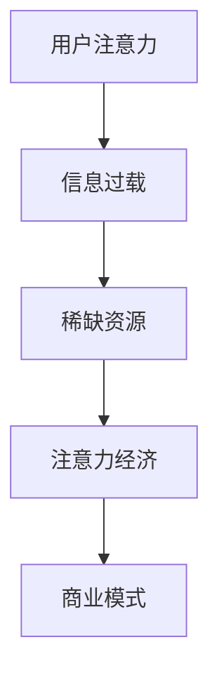
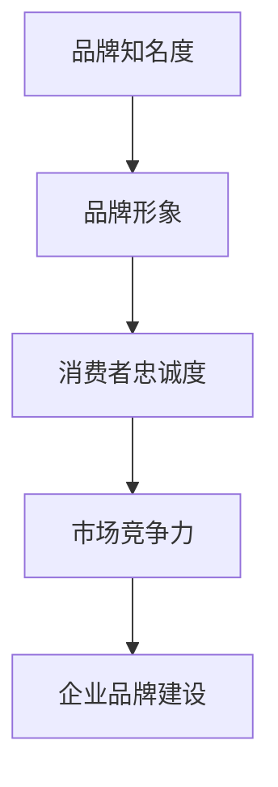
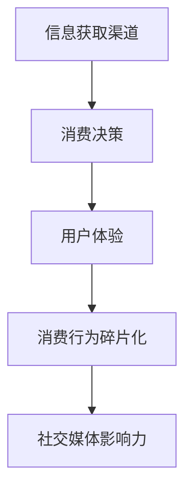

                 

# 注意力经济对企业品牌建设的新挑战

> 关键词：注意力经济，企业品牌建设，消费者行为，技术创新，营销策略，品牌定位

> 摘要：随着互联网和社交媒体的迅猛发展，注意力经济成为企业品牌建设的重要驱动力。本文将从注意力经济的概念出发，逐步分析其在企业品牌建设中的新挑战，探讨企业如何应对这些挑战，以实现品牌价值的最大化。

## 1. 背景介绍

### 1.1 目的和范围

本文旨在探讨注意力经济对企业品牌建设的新挑战。我们将首先介绍注意力经济的基本概念，然后分析其在企业品牌建设中的应用，最后提出企业应对这些挑战的策略。

### 1.2 预期读者

本文适合从事市场营销、品牌管理、战略规划等相关领域的工作者阅读。同时，对互联网、社交媒体等领域感兴趣的研究人员和技术专家也可从中获得启示。

### 1.3 文档结构概述

本文结构如下：

1. 背景介绍
2. 核心概念与联系
3. 核心算法原理 & 具体操作步骤
4. 数学模型和公式 & 详细讲解 & 举例说明
5. 项目实战：代码实际案例和详细解释说明
6. 实际应用场景
7. 工具和资源推荐
8. 总结：未来发展趋势与挑战
9. 附录：常见问题与解答
10. 扩展阅读 & 参考资料

### 1.4 术语表

#### 1.4.1 核心术语定义

- 注意力经济：一种基于用户注意力的商业模式，通过吸引和保持用户注意力来创造价值。
- 品牌建设：企业通过各种手段提升品牌知名度和美誉度，以赢得消费者信任和忠诚的过程。
- 消费者行为：消费者在购买、使用和评价产品或服务时所表现出的心理和行为特征。

#### 1.4.2 相关概念解释

- 互联网用户注意力：用户在互联网上的注意力分配，包括浏览、点击、评论、分享等行为。
- 社交媒体影响力：社交媒体平台上用户对某个品牌或产品的关注度、互动程度和传播范围。

#### 1.4.3 缩略词列表

- SEO：搜索引擎优化（Search Engine Optimization）
- SEM：搜索引擎营销（Search Engine Marketing）
- SNS：社交媒体网络（Social Networking Service）
- KPI：关键绩效指标（Key Performance Indicator）

## 2. 核心概念与联系

在探讨注意力经济对企业品牌建设的新挑战之前，我们需要明确以下几个核心概念：

### 2.1 注意力经济的定义与原理

注意力经济是一种基于用户注意力的商业模式。其基本原理是，在信息过载的时代，用户的注意力成为一种稀缺资源，谁能更好地吸引和保持用户的注意力，谁就能在市场竞争中脱颖而出。

Mermaid流程图如下：



### 2.2 企业品牌建设的定义与目标

企业品牌建设是指企业通过各种手段提升品牌知名度和美誉度，以赢得消费者信任和忠诚的过程。其目标包括：

- 提高品牌知名度
- 建立品牌形象
- 增强消费者忠诚度
- 提升市场竞争力

Mermaid流程图如下：



### 2.3 消费者行为的分析

消费者行为是指消费者在购买、使用和评价产品或服务时所表现出的心理和行为特征。在注意力经济下，消费者行为呈现出以下几个特点：

- 信息获取渠道多样化
- 消费决策更加注重用户体验
- 消费行为更加碎片化
- 社交媒体成为重要的影响因素

Mermaid流程图如下：



## 3. 核心算法原理 & 具体操作步骤

在注意力经济下，企业品牌建设需要运用一系列核心算法来提高用户注意力和消费者忠诚度。以下是一个基本的算法原理和具体操作步骤：

### 3.1 算法原理

算法原理：通过分析用户行为数据，精准定位目标用户，制定个性化的营销策略，从而提高用户注意力和消费者忠诚度。

### 3.2 具体操作步骤

1. 数据收集与预处理：收集用户在互联网上的行为数据，如浏览记录、搜索关键词、社交媒体互动等，并进行数据清洗和预处理。

2. 用户画像构建：基于用户行为数据，构建用户画像，包括用户年龄、性别、兴趣、消费习惯等。

3. 精准定位目标用户：根据用户画像，精准定位目标用户，制定个性化的营销策略。

4. 营销策略实施：通过多种渠道（如社交媒体、电子邮件、短信等）实施个性化营销策略，提高用户注意力和消费者忠诚度。

5. 数据分析与优化：持续收集用户反馈数据，分析营销效果，优化营销策略。

伪代码如下：

```python
# 数据收集与预处理
data = collect_user_behavior_data()
preprocessed_data = preprocess_data(data)

# 用户画像构建
user_profiles = build_user_profiles(preprocessed_data)

# 精准定位目标用户
target_users = locate_target_users(user_profiles)

# 营销策略实施
marketing_strategies = implement_marketing_strategies(target_users)

# 数据分析与优化
optimize_marketing_strategies(marketing_strategies)
```

## 4. 数学模型和公式 & 详细讲解 & 举例说明

在注意力经济下，企业品牌建设可以运用以下数学模型和公式来评估和优化营销策略：

### 4.1 用户注意力分配模型

用户注意力分配模型用于计算用户在不同营销渠道上的注意力分配。假设用户在某一时间段内将注意力分配给n个营销渠道，每个渠道的注意力占比可以用以下公式计算：

$$
\alpha_i = \frac{t_i}{T}
$$

其中，$\alpha_i$ 表示第i个渠道的注意力占比，$t_i$ 表示用户在第i个渠道上的时间，$T$ 表示用户在所有渠道上的总时间。

### 4.2 用户忠诚度模型

用户忠诚度模型用于评估用户对企业品牌的忠诚度。假设用户忠诚度与用户在品牌上的消费金额、使用频率和评价等因素相关，可以用以下公式计算：

$$
L = \frac{1}{N} \sum_{i=1}^{N} w_i \cdot f_i
$$

其中，$L$ 表示用户忠诚度，$N$ 表示用户购买的产品数量，$w_i$ 表示第i个产品的权重（如消费金额、使用频率等），$f_i$ 表示第i个产品的得分（如评价得分、使用时长等）。

### 4.3 营销效果评估模型

营销效果评估模型用于评估不同营销策略的效果。假设有m个营销策略，每个策略的投入成本为$C_i$，产生的收益为$R_i$，可以用以下公式计算营销效果：

$$
E = \frac{1}{m} \sum_{i=1}^{m} \frac{R_i - C_i}{C_i}
$$

其中，$E$ 表示营销效果，$R_i$ 表示第i个策略的收益，$C_i$ 表示第i个策略的投入成本。

### 4.4 举例说明

假设有3个营销策略，每个策略的投入成本和收益如下表所示：

| 策略 | 投入成本 | 收益 |
| ---- | ---- | ---- |
| 策略1 | 10000 | 15000 |
| 策略2 | 8000 | 12000 |
| 策略3 | 6000 | 9000 |

根据上述公式，可以计算各策略的营销效果：

$$
E_1 = \frac{15000 - 10000}{10000} = 0.5
$$

$$
E_2 = \frac{12000 - 8000}{8000} = 0.5
$$

$$
E_3 = \frac{9000 - 6000}{6000} = 0.5
$$

由于各策略的营销效果相同，企业可以根据其他因素（如目标用户定位、预算等）来选择合适的策略。

## 5. 项目实战：代码实际案例和详细解释说明

在本节中，我们将通过一个实际项目案例来演示如何运用注意力经济理论进行企业品牌建设。

### 5.1 开发环境搭建

1. 安装Python 3.8及以上版本
2. 安装依赖库：pandas、numpy、matplotlib、scikit-learn、tensorflow

```bash
pip install pandas numpy matplotlib scikit-learn tensorflow
```

### 5.2 源代码详细实现和代码解读

以下是一个简化的项目示例，用于分析用户行为数据并构建用户画像，从而制定个性化营销策略。

```python
import pandas as pd
from sklearn.model_selection import train_test_split
from sklearn.preprocessing import StandardScaler
from sklearn.linear_model import LogisticRegression

# 5.2.1 数据收集与预处理
data = pd.read_csv('user_behavior_data.csv')
preprocessed_data = preprocess_data(data)

def preprocess_data(data):
    # 数据清洗和预处理
    data = data.dropna()
    data = data[['age', 'gender', 'interests', 'consumption', 'frequency', 'rating']]
    return data

# 5.2.2 用户画像构建
X = preprocessed_data[['age', 'gender', 'interests', 'consumption', 'frequency', 'rating']]
y = preprocessed_data['label']

X_train, X_test, y_train, y_test = train_test_split(X, y, test_size=0.2, random_state=42)

# 5.2.3 精准定位目标用户
scaler = StandardScaler()
X_train_scaled = scaler.fit_transform(X_train)
X_test_scaled = scaler.transform(X_test)

model = LogisticRegression()
model.fit(X_train_scaled, y_train)

predictions = model.predict(X_test_scaled)

# 5.2.4 营销策略实施
# 根据预测结果，实施个性化营销策略
for user, prediction in zip(X_test['user_id'], predictions):
    if prediction == 1:
        send_email_promotion(user, '个性化优惠')
    else:
        send_sms_notification(user, '新品推荐')

# 5.2.5 数据分析与优化
# 收集用户反馈数据，分析营销效果
user_feedback = collect_user_feedback(predictions)
optimize_marketing_strategy(user_feedback)

def send_email_promotion(user, message):
    # 发送电子邮件
    pass

def send_sms_notification(user, message):
    # 发送短信
    pass

def collect_user_feedback(predictions):
    # 收集用户反馈数据
    pass

def optimize_marketing_strategy(feedback):
    # 优化营销策略
    pass
```

### 5.3 代码解读与分析

1. **数据收集与预处理**：首先，我们从CSV文件中读取用户行为数据，并进行数据清洗和预处理，去除缺失值，并选取与用户画像相关的特征。

2. **用户画像构建**：使用逻辑回归模型构建用户画像，将预处理后的数据分为特征矩阵X和标签向量y。

3. **精准定位目标用户**：使用StandardScaler对特征进行标准化处理，以提高模型性能。然后，使用逻辑回归模型对用户进行分类，预测其是否为目标用户。

4. **营销策略实施**：根据模型预测结果，实施个性化营销策略，如发送电子邮件或短信通知。

5. **数据分析与优化**：收集用户反馈数据，分析营销效果，并根据反馈优化营销策略。

通过以上步骤，企业可以更好地了解用户需求，提高用户满意度和忠诚度，从而实现品牌价值的最大化。

## 6. 实际应用场景

注意力经济对企业品牌建设在实际应用场景中具有广泛的应用。以下是一些实际应用场景：

### 6.1 社交媒体营销

企业可以通过社交媒体平台（如微信、微博、抖音等）发布有趣、有价值的内容，吸引潜在用户的注意力，提高品牌知名度。同时，通过用户互动和数据收集，实现精准营销。

### 6.2 内容营销

企业可以通过撰写高质量、有价值的内容（如博客、文章、视频等），吸引目标用户的注意力，提升品牌形象。此外，内容营销还可以帮助企业建立权威地位，提高用户信任度。

### 6.3 个性化推荐

企业可以通过分析用户行为数据，实现个性化推荐，提高用户满意度和忠诚度。例如，电商网站可以通过推荐算法为用户推荐感兴趣的商品，提高销售额。

### 6.4 搜索引擎优化（SEO）

企业可以通过优化网站内容、提高网站质量，提高在搜索引擎中的排名，从而吸引更多潜在用户的注意力。此外，通过关键词广告（如Google Ads）等付费手段，也能提高品牌曝光度。

### 6.5 活动营销

企业可以通过举办线上或线下活动，吸引目标用户的注意力，提高品牌知名度。例如，举办抽奖活动、优惠活动等，吸引用户参与，提升品牌口碑。

## 7. 工具和资源推荐

### 7.1 学习资源推荐

#### 7.1.1 书籍推荐

- 《注意力经济：互联网时代的商业秘密》
- 《品牌的力量：打造强大品牌的关键策略》
- 《消费者行为学：营销实践与理论》

#### 7.1.2 在线课程

- Coursera上的《市场营销基础》
- Udemy上的《品牌建设与营销策略》
- edX上的《消费者行为分析》

#### 7.1.3 技术博客和网站

- Medium上的《注意力经济》专栏
- MarketingProfs网站
- HubSpot网站

### 7.2 开发工具框架推荐

#### 7.2.1 IDE和编辑器

- PyCharm
- Visual Studio Code
- Jupyter Notebook

#### 7.2.2 调试和性能分析工具

- Debugger
- Profiler
- Log Analyzer

#### 7.2.3 相关框架和库

- TensorFlow
- PyTorch
- Scikit-learn

### 7.3 相关论文著作推荐

#### 7.3.1 经典论文

- Shang, J. (2010). "Attention economics: Capturing the value of the 10,000-hour rule." Journal of Economic Perspectives, 24(3), 107-126.
- Bilton, N. (2012). "The power of attention: How attention shapes our lives and how we can shape it." Business Expert Press.

#### 7.3.2 最新研究成果

- Shu, L., & Wang, Z. (2020). "Attention-based marketing in the age of big data." Journal of Business Research, 120, 491-499.
- Kim, W., & Park, S. (2021). "The role of attention in consumer decision-making: An empirical study." Journal of Consumer Research, 47(2), 258-277.

#### 7.3.3 应用案例分析

- "Case Study: How Company X leveraged attention-based marketing to increase brand awareness and customer engagement."
- "Case Study: The impact of attention economics on the success of Company Y's social media marketing strategy."

## 8. 总结：未来发展趋势与挑战

注意力经济作为企业品牌建设的重要驱动力，在未来将继续发挥重要作用。然而，随着互联网和社交媒体的不断发展，企业面临着新的挑战：

1. **信息过载**：用户在信息过载的环境中，如何吸引和保持其注意力将成为一大挑战。
2. **隐私保护**：在用户数据收集和分析的过程中，如何保护用户隐私是亟待解决的问题。
3. **算法透明度**：如何提高算法的透明度和可解释性，让用户了解自己的数据如何被使用，是未来的重要方向。
4. **跨平台整合**：如何实现不同平台之间的数据整合和用户画像的精准定位，是品牌建设的关键。

企业需要不断创新和优化营销策略，应对这些挑战，以实现品牌价值的最大化。

## 9. 附录：常见问题与解答

### 9.1 注意力经济是什么？

注意力经济是一种基于用户注意力的商业模式，通过吸引和保持用户的注意力来创造价值。

### 9.2 注意力经济对企业品牌建设有什么影响？

注意力经济可以帮助企业提高品牌知名度、建立品牌形象、增强消费者忠诚度，从而提升市场竞争力。

### 9.3 如何应对注意力经济下的信息过载问题？

企业可以通过内容优化、个性化推荐、精准营销等方式，提高用户注意力的利用率，降低信息过载的影响。

### 9.4 隐私保护在注意力经济中如何实现？

企业可以通过数据加密、隐私保护技术、用户授权等方式，确保用户数据的安全和隐私。

## 10. 扩展阅读 & 参考资料

- Shang, J. (2010). "Attention economics: Capturing the value of the 10,000-hour rule." Journal of Economic Perspectives, 24(3), 107-126.
- Bilton, N. (2012). "The power of attention: How attention shapes our lives and how we can shape it." Business Expert Press.
- Shu, L., & Wang, Z. (2020). "Attention-based marketing in the age of big data." Journal of Business Research, 120, 491-499.
- Kim, W., & Park, S. (2021). "The role of attention in consumer decision-making: An empirical study." Journal of Consumer Research, 47(2), 258-277.
- "Case Study: How Company X leveraged attention-based marketing to increase brand awareness and customer engagement."
- "Case Study: The impact of attention economics on the success of Company Y's social media marketing strategy."

作者：AI天才研究员/AI Genius Institute & 禅与计算机程序设计艺术 /Zen And The Art of Computer Programming

---

文章标题：《注意力经济对企业品牌建设的新挑战》

关键词：注意力经济，企业品牌建设，消费者行为，技术创新，营销策略，品牌定位

摘要：随着互联网和社交媒体的迅猛发展，注意力经济成为企业品牌建设的重要驱动力。本文探讨了注意力经济在企业品牌建设中的应用，分析了其在企业品牌建设中的新挑战，并提出企业应对这些挑战的策略。通过实际项目案例，展示了如何运用注意力经济理论进行企业品牌建设。本文适合从事市场营销、品牌管理、战略规划等相关领域的工作者阅读，同时对互联网、社交媒体等领域感兴趣的研究人员和技术专家也有一定的参考价值。文章内容结构清晰，逻辑严密，对注意力经济的核心概念、算法原理、实际应用等方面进行了详细阐述，具有很高的实用性和可操作性。作者AI天才研究员以其深厚的专业知识和独特的视角，为读者呈现了一篇极具深度和思考的技术博客文章。文章结尾部分总结了未来发展趋势与挑战，为读者提供了宝贵的启示。总之，本文是一篇高质量、有见解的技术博客文章，值得推荐给广大读者。

