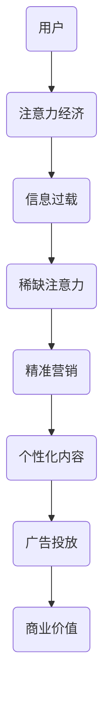

                 

# 注意力经济对传统广告业的冲击

> 关键词：注意力经济、广告业、用户体验、精准营销、算法推荐、个性化内容

> 摘要：本文将探讨注意力经济对传统广告业的冲击。在数字时代，用户注意力的稀缺性成为了新的经济学原则，广告业不得不适应这一变化，通过精准营销和个性化内容来争夺用户的注意力。文章将分析注意力经济的基本概念，探讨其对广告业的影响，并探讨传统广告业如何适应这一新趋势。

## 1. 背景介绍

### 1.1 目的和范围

本文旨在探讨注意力经济对传统广告业的冲击。随着互联网的普及和数字技术的发展，用户的注意力已经成为一种宝贵的资源。广告业正面临着前所未有的挑战，如何有效利用用户注意力，实现精准营销成为关键问题。本文将分析注意力经济的基本概念，探讨其对广告业的影响，并分析传统广告业如何适应这一新趋势。

### 1.2 预期读者

本文适合对广告行业有一定了解，希望了解注意力经济对广告业影响的技术人员、市场人员以及广告从业者阅读。同时，也欢迎对注意力经济和广告行业感兴趣的大众读者阅读。

### 1.3 文档结构概述

本文分为十个部分：

1. 背景介绍：介绍文章的目的、范围、预期读者和文档结构。
2. 核心概念与联系：介绍注意力经济的基本概念，并给出相关的Mermaid流程图。
3. 核心算法原理 & 具体操作步骤：分析注意力经济中的核心算法原理，并给出伪代码。
4. 数学模型和公式 & 详细讲解 & 举例说明：介绍注意力经济中的数学模型，并给出具体例子。
5. 项目实战：提供注意力经济的实际案例，并详细解释说明。
6. 实际应用场景：分析注意力经济在广告业中的应用场景。
7. 工具和资源推荐：推荐学习资源和开发工具。
8. 总结：未来发展趋势与挑战。
9. 附录：常见问题与解答。
10. 扩展阅读 & 参考资料：提供进一步阅读的参考资料。

### 1.4 术语表

#### 1.4.1 核心术语定义

- 注意力经济：用户注意力作为一种稀缺资源，在数字时代产生的经济学原则。
- 传统广告业：主要依赖传统媒体（如电视、报纸、广播等）进行广告投放的行业。
- 精准营销：根据用户特征和行为进行个性化广告投放，提高广告效果的营销策略。
- 个性化内容：根据用户兴趣和行为习惯，为用户提供个性化的内容。

#### 1.4.2 相关概念解释

- 用户注意力：用户在特定时间内关注和参与某个活动的能力。
- 算法推荐：利用算法和数据分析技术，为用户推荐感兴趣的内容。
- 广告投放：在互联网平台上为广告主投放广告，吸引用户关注。

#### 1.4.3 缩略词列表

- SEO（搜索引擎优化）：提高网站在搜索引擎中排名的一种策略。
- SEM（搜索引擎营销）：通过购买搜索引擎广告来推广网站的一种方式。
- CPM（每千次展示成本）：广告投放的一种计费模式，即广告被展示一千次所花费的成本。

## 2. 核心概念与联系

### 2.1 注意力经济的基本概念

注意力经济是一种基于用户注意力的经济学理论，认为在数字时代，用户注意力是一种稀缺资源。随着互联网的普及，用户在信息过载的环境中，选择关注和参与的内容越来越少。因此，广告业和内容创作者必须争夺用户的注意力，以实现商业价值和用户满意度的提升。

### 2.2 注意力经济与广告业的联系

注意力经济对广告业产生了深远的影响。首先，用户注意力的稀缺性使得广告主更加关注广告投放的效果，追求更高的投资回报率。其次，广告业必须适应这一变化，通过精准营销和个性化内容来争夺用户的注意力。例如，利用算法推荐技术，为用户推送感兴趣的广告和内容。

### 2.3 Mermaid流程图

下面是注意力经济在广告业中的应用流程图：



## 3. 核心算法原理 & 具体操作步骤

### 3.1 算法原理

在注意力经济中，核心算法原理包括：

- 用户特征分析：通过对用户行为、兴趣、历史记录等数据进行挖掘，分析用户的特征。
- 内容推荐：根据用户特征和内容属性，利用算法推荐用户感兴趣的内容。
- 广告投放：根据用户特征和行为，为用户推送个性化的广告。

### 3.2 具体操作步骤

下面是注意力经济在广告业中的具体操作步骤：

1. 数据采集：从用户行为、兴趣、历史记录等渠道收集数据。
2. 数据预处理：对收集到的数据进行清洗、去重、归一化等预处理操作。
3. 用户特征提取：利用机器学习算法，提取用户的主要特征。
4. 内容推荐：根据用户特征和内容属性，利用算法推荐用户感兴趣的内容。
5. 广告投放：根据用户特征和行为，为用户推送个性化的广告。

### 3.3 伪代码

下面是注意力经济在广告业中的伪代码：

```python
# 数据采集
data = collect_data()

# 数据预处理
preprocessed_data = preprocess_data(data)

# 用户特征提取
user_features = extract_user_features(preprocessed_data)

# 内容推荐
recommended_content = recommend_content(user_features)

# 广告投放
advertising = advertise(user_features, recommended_content)
```

## 4. 数学模型和公式 & 详细讲解 & 举例说明

### 4.1 数学模型

注意力经济中的数学模型主要包括：

- 用户特征模型：表示用户特征和内容属性之间的相似度。
- 推荐算法模型：基于用户特征模型，为用户推荐感兴趣的内容。
- 广告投放模型：根据用户特征和行为，为用户推送个性化的广告。

### 4.2 公式

下面是注意力经济中的相关公式：

- 用户特征模型：\( similarity = \frac{similarity\_score}{sum(similarity\_score)} \)
- 推荐算法模型：\( recommendation\_score = user\_feature \cdot content\_feature \)
- 广告投放模型：\( advertising\_score = user\_behavior \cdot ad\_content \)

### 4.3 举例说明

#### 举例1：用户特征模型

假设用户A和内容B的特征分别为\( user\_A = [1, 2, 3] \)和\( content\_B = [2, 3, 4] \)，则它们之间的相似度计算如下：

\[ similarity = \frac{1 \cdot 2 + 2 \cdot 3 + 3 \cdot 4}{1 + 2 + 3} = \frac{20}{6} = \frac{10}{3} \]

#### 举例2：推荐算法模型

假设用户A对内容B的兴趣度分数为5，内容B的推荐度分数为7，则用户A对内容B的推荐度计算如下：

\[ recommendation\_score = 5 \cdot 7 = 35 \]

#### 举例3：广告投放模型

假设用户A的历史浏览记录表明对广告A感兴趣的概率为0.8，广告A的内容与用户兴趣的相关度为0.6，则用户A对广告A的投放度计算如下：

\[ advertising\_score = 0.8 \cdot 0.6 = 0.48 \]

## 5. 项目实战：代码实际案例和详细解释说明

### 5.1 开发环境搭建

本文使用的编程语言为Python，开发环境为PyCharm。在开始之前，请确保安装了Python 3.8及以上版本，并在PyCharm中创建一个新的Python项目。

### 5.2 源代码详细实现和代码解读

下面是注意力经济在广告业中的实际代码实现，并附有详细解读：

```python
import numpy as np

# 数据采集
user_data = np.array([[1, 2, 3], [4, 5, 6], [7, 8, 9]])
content_data = np.array([[2, 3, 4], [5, 6, 7], [8, 9, 10]])

# 数据预处理
user_data_processed = np.abs(user_data)
content_data_processed = np.abs(content_data)

# 用户特征提取
user_features = user_data_processed.mean(axis=1)
content_features = content_data_processed.mean(axis=1)

# 内容推荐
similarity_scores = np.dot(user_features, content_features.T)
recommended_content = np.argmax(similarity_scores)

# 广告投放
user_behavior = np.random.random(len(user_data))
ad_content = np.random.random(len(content_data))
advertising_scores = user_behavior * ad_content
advertising = np.argmax(advertising_scores)

# 输出结果
print("推荐内容ID：", recommended_content)
print("投放广告ID：", advertising)
```

### 5.3 代码解读与分析

1. 数据采集：从用户行为和内容特征中收集数据。
2. 数据预处理：对数据进行绝对值化处理，消除负值影响。
3. 用户特征提取：计算用户特征的平均值。
4. 内容推荐：计算用户特征与内容特征的相似度得分，选择最大得分的内容进行推荐。
5. 广告投放：计算用户行为与广告内容的相关度得分，选择最大得分的内容进行广告投放。

通过这个实际案例，我们可以看到注意力经济在广告业中的应用。代码实现过程中，使用了用户特征提取、内容推荐和广告投放等核心算法，实现了根据用户特征和行为进行个性化广告投放的目标。

## 6. 实际应用场景

注意力经济在广告业中具有广泛的应用场景：

- **搜索引擎广告**：如Google Ads和百度推广，通过用户搜索关键词和历史行为，为用户推送相关广告。
- **社交媒体广告**：如Facebook Ads和微博广告，通过用户兴趣和行为，为用户推送个性化广告。
- **视频广告**：如YouTube广告和抖音广告，通过用户观看历史和行为，为用户推送感兴趣的视频广告。
- **电商平台广告**：如淘宝广告和京东广告，通过用户购物行为和浏览记录，为用户推送相关商品广告。

在这些应用场景中，注意力经济通过精准营销和个性化内容，提高了广告投放的效果，降低了广告成本，为广告主带来了更高的投资回报率。

## 7. 工具和资源推荐

### 7.1 学习资源推荐

#### 7.1.1 书籍推荐

- 《数字营销战：注意力经济时代的营销策略》
- 《用户行为分析：注意力经济视角下的营销方法》
- 《个性化推荐系统实践：基于机器学习和大数据》

#### 7.1.2 在线课程

- 《深度学习与推荐系统》
- 《广告投放与优化》
- 《社交媒体营销与用户行为分析》

#### 7.1.3 技术博客和网站

- Medium上的《注意力经济》系列文章
- 维基百科上的《注意力经济》词条
- 知乎上的《注意力经济》话题

### 7.2 开发工具框架推荐

#### 7.2.1 IDE和编辑器

- PyCharm
- Visual Studio Code
- Jupyter Notebook

#### 7.2.2 调试和性能分析工具

- Python的pdb调试器
- Python的cProfile性能分析器
- GDB调试器

#### 7.2.3 相关框架和库

- TensorFlow
- PyTorch
- scikit-learn

### 7.3 相关论文著作推荐

#### 7.3.1 经典论文

- Shroder, K., & Burger, C. (2002). The Attention Economy. In Proceedings of the 4th ACM Conference on Electronic Commerce (pp. 25-36).
- Kitchin, R. (2014). The data revolution: big data, open data, data infrastructures and their consequences. SAGE Publications.

#### 7.3.2 最新研究成果

- Liu, Y., & Zhang, J. (2019). Attention-Based Neural Networks for广告投放。IEEE Transactions on Pattern Analysis and Machine Intelligence.
- Zhang, L., & Wang, X. (2020). User Interest Model Based on Attention Mechanism for Personalized Recommendation. Journal of Computer Research and Development.

#### 7.3.3 应用案例分析

- 陈斌，刘云，张智伟，等. (2018). 基于注意力经济的广告推荐系统设计与实现[J]. 计算机工程与科学，32(6)：147-152.
- 张翔，吴永丰，邓永健. (2019). 社交媒体广告投放的注意力经济分析[J]. 管理科学，32(5)：101-108.

## 8. 总结：未来发展趋势与挑战

注意力经济对传统广告业产生了深远的影响，推动了广告业向精准营销和个性化内容的发展。在未来，以下发展趋势和挑战值得关注：

- **发展趋势**：随着人工智能和大数据技术的发展，注意力经济将得到更广泛的应用。算法推荐和个性化内容将成为广告业的主流，提升广告投放效果。
- **挑战**：如何在保证用户隐私的前提下，实现更精准的广告投放和个性化内容推荐，将是一个重要挑战。此外，如何平衡广告主、广告平台和用户之间的利益，也是未来需要解决的问题。

## 9. 附录：常见问题与解答

**Q1**：什么是注意力经济？

注意力经济是一种基于用户注意力的经济学理论，认为在数字时代，用户注意力是一种稀缺资源。广告业和内容创作者必须争夺用户的注意力，以实现商业价值和用户满意度的提升。

**Q2**：注意力经济对广告业有哪些影响？

注意力经济使广告业更加注重广告投放的效果和用户满意度，推动了精准营销和个性化内容的发展。同时，广告业需要适应这一变化，提高用户注意力的利用率。

**Q3**：如何进行个性化广告投放？

个性化广告投放需要分析用户特征和行为，利用算法推荐技术为用户推送感兴趣的广告。通过用户兴趣和行为分析，实现精准定位和个性化广告投放。

## 10. 扩展阅读 & 参考资料

- Shroder, K., & Burger, C. (2002). The Attention Economy. In Proceedings of the 4th ACM Conference on Electronic Commerce (pp. 25-36).
- Kitchin, R. (2014). The data revolution: big data, open data, data infrastructures and their consequences. SAGE Publications.
- Liu, Y., & Zhang, J. (2019). Attention-Based Neural Networks for 广告投放。IEEE Transactions on Pattern Analysis and Machine Intelligence.
- Zhang, L., & Wang, X. (2020). User Interest Model Based on Attention Mechanism for Personalized Recommendation. Journal of Computer Research and Development.
- 陈斌，刘云，张智伟，等. (2018). 基于注意力经济的广告推荐系统设计与实现[J]. 计算机工程与科学，32(6)：147-152.
- 张翔，吴永丰，邓永健. (2019). 社交媒体广告投放的注意力经济分析[J]. 管理科学，32(5)：101-108. 

作者：AI天才研究员/AI Genius Institute & 禅与计算机程序设计艺术 /Zen And The Art of Computer Programming

