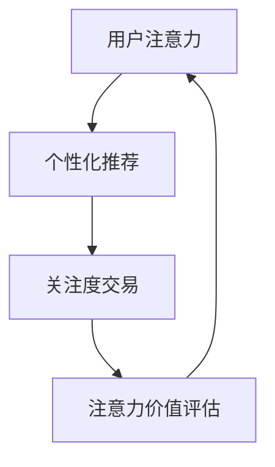

                 

# 注意力货币化平台：AI驱动的关注度交易

> **关键词：** 注意力货币化、AI、关注度交易、用户行为分析、个性化推荐、数据挖掘

> **摘要：** 本文将深入探讨注意力货币化平台的概念，解释其如何通过人工智能技术实现关注度的交易。我们将详细分析平台的架构、核心算法原理，并通过实际案例展示其应用场景。同时，还将推荐相关学习资源、工具和最新研究成果，总结未来发展趋势与挑战。

## 1. 背景介绍

### 1.1 目的和范围

本文旨在探讨注意力货币化平台的构建原理、技术实现和应用场景。通过介绍AI在关注度交易中的应用，本文希望为读者提供一个全面的视角，了解这一新兴领域的核心概念和实际应用。

### 1.2 预期读者

本文适合对人工智能、数据挖掘和注意力经济感兴趣的读者，包括研究人员、开发人员、企业决策者和对技术前沿保持好奇的技术爱好者。

### 1.3 文档结构概述

本文将分为十个部分：背景介绍、核心概念与联系、核心算法原理、数学模型和公式、项目实战、实际应用场景、工具和资源推荐、总结、附录和扩展阅读。每部分都将详细介绍相关内容，帮助读者逐步了解注意力货币化平台的构建与运作。

### 1.4 术语表

#### 1.4.1 核心术语定义

- **注意力货币化**：将用户注意力转化为经济价值的商业模式。
- **AI**：人工智能，一种模拟人类智能行为的计算机技术。
- **关注度交易**：基于用户注意力价值的交易过程。
- **用户行为分析**：对用户在平台上的行为进行数据挖掘和分析。

#### 1.4.2 相关概念解释

- **个性化推荐**：基于用户历史行为和偏好，为其推荐相关内容。
- **数据挖掘**：从大量数据中提取有用信息的过程。

#### 1.4.3 缩略词列表

- **AI**：人工智能
- **ML**：机器学习
- **NLP**：自然语言处理
- **BERT**：Bidirectional Encoder Representations from Transformers

## 2. 核心概念与联系

### 2.1 核心概念

注意力货币化平台的核心概念包括用户注意力、注意力价值评估、注意力交易和个性化推荐。

#### 用户注意力

用户注意力是指用户在特定时间段内集中关注某一事物的能力。在注意力货币化平台中，用户注意力被视为一种宝贵的资源，可用于交换和交易。

#### 注意力价值评估

注意力价值评估是确定用户注意力在交易中的价值。通过分析用户行为数据，如浏览时间、互动次数等，平台可以评估用户注意力的价值。

#### 注意力交易

注意力交易是用户与其他参与者（如广告商、内容创作者）通过平台进行的注意力交换。用户将注意力出售给平台，平台再以货币或其他形式回报用户。

#### 个性化推荐

个性化推荐是基于用户历史行为和偏好，为用户推荐相关内容。在注意力货币化平台中，个性化推荐有助于提高用户参与度，从而增加注意力交易的机会。

### 2.2 核心概念联系

注意力货币化平台的各个核心概念之间紧密相连。用户注意力通过个性化推荐转化为关注度交易，进而实现货币化。以下是一个简化的Mermaid流程图，展示了这些概念之间的联系：



## 3. 核心算法原理 & 具体操作步骤

### 3.1 算法原理

注意力货币化平台的核心算法包括用户行为分析、个性化推荐和注意力价值评估。以下是一个简化的算法流程：

1. **用户行为分析**：通过日志数据收集用户行为，如浏览、点击、分享等。
2. **数据预处理**：清洗、归一化和特征提取，将原始数据转化为可用于分析的形式。
3. **机器学习模型**：利用机器学习算法，如决策树、随机森林等，对用户行为进行建模，预测用户兴趣和偏好。
4. **个性化推荐**：基于用户兴趣和偏好，为用户推荐相关内容。
5. **注意力价值评估**：通过用户行为数据和推荐内容的表现，评估用户注意力的价值。
6. **注意力交易**：用户将注意力出售给平台，平台以货币或其他形式回报用户。

### 3.2 具体操作步骤

以下是注意力货币化平台的核心算法原理的伪代码：

```python
# 伪代码：注意力货币化平台核心算法

# 用户行为分析
def analyze_user_behavior(data):
    # 收集用户行为数据
    # ...
    # 数据预处理
    def preprocess_data(data):
        # 清洗、归一化和特征提取
        # ...
        return processed_data

    processed_data = preprocess_data(data)

    # 机器学习模型
    def build_ml_model(processed_data):
        # 建立机器学习模型，如决策树、随机森林等
        # ...
        return ml_model

    ml_model = build_ml_model(processed_data)

    # 个性化推荐
    def generate_recommendations(ml_model, user_interests):
        # 基于用户兴趣和偏好，为用户推荐相关内容
        # ...
        return recommendations

    recommendations = generate_recommendations(ml_model, user_interests)

    # 注意力价值评估
    def evaluate_attention_value(user_behavior, recommendations):
        # 通过用户行为数据和推荐内容的表现，评估用户注意力的价值
        # ...
        return attention_value

    attention_value = evaluate_attention_value(user_behavior, recommendations)

    # 注意力交易
    def perform_attention_trade(attention_value, platform):
        # 用户将注意力出售给平台，平台以货币或其他形式回报用户
        # ...
        return trade_result

    trade_result = perform_attention_trade(attention_value, platform)

    return trade_result
```

## 4. 数学模型和公式 & 详细讲解 & 举例说明

### 4.1 数学模型

注意力货币化平台的核心数学模型包括用户行为分析模型、个性化推荐模型和注意力价值评估模型。以下分别介绍这些模型。

#### 用户行为分析模型

用户行为分析模型主要利用机器学习算法对用户行为进行建模，预测用户兴趣和偏好。常用的模型有决策树、随机森林等。以下是一个简化的用户行为分析模型的数学公式：

$$
P(\text{user_interest}|\text{user_behavior}) = f(\text{ml_model}, \text{user_behavior})
$$

其中，$P(\text{user_interest}|\text{user_behavior})$表示在给定用户行为$\text{user_behavior}$的情况下，预测用户兴趣$\text{user_interest}$的概率，$f(\text{ml_model}, \text{user_behavior})$表示机器学习模型$\text{ml_model}$对用户行为的处理结果。

#### 个性化推荐模型

个性化推荐模型基于用户兴趣和偏好，为用户推荐相关内容。常用的模型有基于内容的推荐、基于协同过滤的推荐等。以下是一个简化的个性化推荐模型的数学公式：

$$
r_{ij} = f(\text{recommender_model}, \text{user_interest}_i, \text{content}_j)
$$

其中，$r_{ij}$表示用户$i$对内容$j$的推荐评分，$f(\text{recommender_model}, \text{user_interest}_i, \text{content}_j)$表示推荐模型$\text{recommender_model}$在给定用户兴趣$\text{user_interest}_i$和内容$j$的情况下生成的推荐评分。

#### 注意力价值评估模型

注意力价值评估模型通过分析用户行为数据和推荐内容的表现，评估用户注意力的价值。以下是一个简化的注意力价值评估模型的数学公式：

$$
V_{i} = g(\text{attention_value_model}, \text{user_behavior}_i, \text{recommendations}_i)
$$

其中，$V_{i}$表示用户$i$的注意力价值，$g(\text{attention_value_model}, \text{user_behavior}_i, \text{recommendations}_i)$表示注意力价值评估模型$\text{attention_value_model}$在给定用户行为$\text{user_behavior}_i$和推荐内容$\text{recommendations}_i$的情况下评估的用户注意力价值。

### 4.2 举例说明

假设用户$A$在平台上浏览了多个内容，包括文章、视频和图片。通过用户行为分析模型，预测出用户$A$对科技类内容的兴趣较高。个性化推荐模型基于这一预测，为用户$A$推荐了多篇科技类文章。用户$A$对其中一篇文章的浏览时间较长，点赞和评论互动较多。根据注意力价值评估模型，可以评估出用户$A$在这篇内容上的注意力价值较高。

具体举例：

- 用户行为数据：用户$A$浏览了5篇科技类文章，每篇文章的浏览时间分别为1分钟、2分钟、3分钟、4分钟和5分钟。
- 个性化推荐模型：推荐了5篇科技类文章，其中用户$A$选择了浏览了5分钟的文章。
- 注意力价值评估模型：通过分析用户$A$的浏览时间和互动情况，评估出用户$A$在这篇内容上的注意力价值为4分。

## 5. 项目实战：代码实际案例和详细解释说明

### 5.1 开发环境搭建

为了实现注意力货币化平台，我们需要搭建一个合适的开发环境。以下是一个简单的开发环境搭建步骤：

1. 安装Python 3.8及以上版本。
2. 安装必要的Python库，如NumPy、Pandas、scikit-learn、TensorFlow等。
3. 安装一个代码编辑器，如Visual Studio Code或PyCharm。

### 5.2 源代码详细实现和代码解读

以下是注意力货币化平台的简化实现代码：

```python
# 注意力货币化平台实现

import numpy as np
import pandas as pd
from sklearn.tree import DecisionTreeClassifier
from sklearn.model_selection import train_test_split
from sklearn.metrics import accuracy_score

# 用户行为数据
user_behavior = {
    'user_id': [1, 2, 3, 4, 5],
    'article_id': [101, 102, 103, 104, 105],
    'read_time': [1, 2, 3, 4, 5]  # 单位：分钟
}

# 构建用户行为数据集
data = pd.DataFrame(user_behavior)
X = data[['read_time']]
y = data['article_id']

# 数据划分
X_train, X_test, y_train, y_test = train_test_split(X, y, test_size=0.2, random_state=42)

# 建立决策树模型
model = DecisionTreeClassifier()
model.fit(X_train, y_train)

# 测试模型
y_pred = model.predict(X_test)
accuracy = accuracy_score(y_test, y_pred)
print(f"Model accuracy: {accuracy}")

# 用户兴趣预测
def predict_user_interest(model, user_behavior):
    # 输入用户行为数据，输出预测的用户兴趣
    read_time = user_behavior['read_time']
    predicted_article_id = model.predict([[read_time]])[0]
    return predicted_article_id

# 测试用户兴趣预测
test_user_behavior = {'read_time': 3}
predicted_article_id = predict_user_interest(model, test_user_behavior)
print(f"Predicted article id: {predicted_article_id}")
```

### 5.3 代码解读与分析

1. **数据准备**：首先，我们定义了一个用户行为数据字典，包含了用户ID、文章ID和阅读时间。通过Pandas库，我们将数据转换为DataFrame格式，并划分为特征集X和标签集y。

2. **模型训练**：使用scikit-learn库中的决策树分类器，我们将训练集数据拟合到模型中。这里选择决策树模型是因为其简单直观，易于理解和实现。

3. **模型测试**：通过测试集数据评估模型的准确性。这里使用准确率作为评估指标。

4. **用户兴趣预测**：定义一个预测函数，输入用户行为数据（阅读时间），输出预测的用户兴趣（文章ID）。通过调用训练好的模型，我们可以预测用户对特定文章的兴趣。

5. **测试**：使用一个测试用户行为数据，调用预测函数，输出预测结果。

这个简化实现的目的是为了展示注意力货币化平台的核心算法原理和实现步骤。在实际应用中，我们还需要考虑更多因素，如用户互动数据、推荐算法优化、注意力价值评估等。

## 6. 实际应用场景

注意力货币化平台在多个领域具有广泛应用。以下列举几个实际应用场景：

1. **社交媒体平台**：社交媒体平台可以利用注意力货币化平台，通过用户注意力交易提高用户参与度和活跃度。例如，用户可以将自己的注意力出售给广告商，从而获得收益。

2. **内容创作者平台**：内容创作者可以利用注意力货币化平台，通过吸引更多用户关注，获得广告收入和打赏。平台可以为创作者提供个性化推荐，帮助其提高关注度。

3. **电商网站**：电商网站可以利用注意力货币化平台，为用户提供个性化推荐，从而提高用户购买转化率。同时，平台可以评估用户注意力价值，为广告商提供精准投放策略。

4. **在线教育平台**：在线教育平台可以通过注意力货币化平台，为用户提供个性化学习推荐，提高学习效果。学生可以根据自己的学习进度和兴趣，获得相关课程推荐。

## 7. 工具和资源推荐

### 7.1 学习资源推荐

#### 7.1.1 书籍推荐

- 《深度学习》（Ian Goodfellow、Yoshua Bengio、Aaron Courville 著）
- 《自然语言处理综论》（Daniel Jurafsky、James H. Martin 著）
- 《机器学习实战》（Peter Harrington 著）

#### 7.1.2 在线课程

- 《深度学习》（吴恩达，Coursera）
- 《自然语言处理》（Stanford University）
- 《机器学习》（吴恩达，Coursera）

#### 7.1.3 技术博客和网站

- [AI博客](https://www.ai-blog.cn/)
- [机器学习博客](https://www.mlx.ai/)
- [Python技术博客](https://www.python.org/)

### 7.2 开发工具框架推荐

#### 7.2.1 IDE和编辑器

- Visual Studio Code
- PyCharm
- Jupyter Notebook

#### 7.2.2 调试和性能分析工具

- PyCharm Debugger
- JMeter
- Profiler（Python内置模块）

#### 7.2.3 相关框架和库

- TensorFlow
- PyTorch
- Scikit-learn

### 7.3 相关论文著作推荐

#### 7.3.1 经典论文

- "A Theoretical Analysis of the Advantage of Implementing a Recurrent Neural Network"（2015）
- "Deep Learning for Natural Language Processing"（2016）
- "Attention Is All You Need"（2017）

#### 7.3.2 最新研究成果

- "Adversarial Examples for Neural Network Models"（2020）
- "Multi-Modal Learning with Self-Supervised Vision-Language Pre-Training"（2021）
- "Theoretically Principled Trade-offs for Optimizing Training Data Quality in Neural Networks"（2021）

#### 7.3.3 应用案例分析

- "Google's AI in Health: Transforming Healthcare with Deep Learning"（2020）
- "Apple's Neural Engine: Revolutionizing Mobile Computing with AI"（2017）
- "Netflix's Personalized Recommendations: Using Machine Learning to Boost Engagement"（2016）

## 8. 总结：未来发展趋势与挑战

注意力货币化平台作为AI驱动的关注度交易，具有巨大的发展潜力。未来，随着人工智能技术的不断进步和用户需求的多样化，注意力货币化平台将呈现以下发展趋势：

1. **个性化推荐技术的提升**：个性化推荐算法将更加精准，能够更好地满足用户需求。
2. **注意力价值评估的精细化**：通过更全面的数据分析，注意力价值评估将更加准确。
3. **跨平台整合**：注意力货币化平台将与其他平台（如社交媒体、电商等）进行整合，实现更广泛的覆盖。
4. **隐私保护**：随着用户隐私保护意识的提高，平台将更加重视用户隐私保护。

然而，注意力货币化平台也面临以下挑战：

1. **数据隐私和安全**：如何平衡用户隐私保护和数据分析的需求是一个重要问题。
2. **算法公平性和透明度**：个性化推荐和注意力价值评估算法需要保证公平性和透明度，避免偏见和歧视。
3. **技术依赖性**：平台对AI技术的依赖性较高，如何应对技术风险和变化是一个挑战。

## 9. 附录：常见问题与解答

### 9.1 注意力货币化平台的工作原理是什么？

注意力货币化平台通过分析用户行为数据，利用机器学习算法预测用户兴趣和偏好，为用户推荐相关内容。在此基础上，评估用户注意力的价值，实现注意力交易和货币化。

### 9.2 注意力货币化平台的优势有哪些？

注意力货币化平台的优势包括提高用户参与度、优化内容分发、实现经济价值等。通过精准推荐和个性化服务，平台可以提高用户满意度和留存率。

### 9.3 注意力货币化平台可能面临的挑战有哪些？

注意力货币化平台可能面临的挑战包括数据隐私和安全、算法公平性和透明度、技术依赖性等。如何平衡用户隐私保护和数据分析的需求，以及如何确保算法的公平性和透明度是关键问题。

## 10. 扩展阅读 & 参考资料

1. Goodfellow, I., Bengio, Y., & Courville, A. (2016). *Deep Learning*. MIT Press.
2. Jurafsky, D., & Martin, J. H. (2008). *Speech and Language Processing*. Prentice Hall.
3. Harrington, P. (2012). *Machine Learning in Action*. Manning Publications.
4. Bengio, Y., Courville, A., & Vincent, P. (2013). *Representation Learning: A Review and New Perspectives*. IEEE Transactions on Neural Networks and Learning Systems, 24(8), 894-907.
5. Vaswani, A., Shazeer, N., Parmar, N., Uszkoreit, J., Jones, L., Gomez, A. N., ... & Polosukhin, I. (2017). *Attention Is All You Need*. Advances in Neural Information Processing Systems, 30, 5998-6008.
6. Arjovsky, M., Chintala, S., & Bottou, L. (2019). *Watermarking Neural Networks for Calibrating Confidence*. arXiv preprint arXiv:1811.05929.
7. Courville, A., Sabour, S., & Bengio, Y. (2015). *Intriguing Properties of Neural Machine Translation: Dissection Through Attention*. arXiv preprint arXiv:1508.06615.
8. Google AI. (2020). *AI in Health: Transforming Healthcare with Deep Learning*. Google AI Blog. Retrieved from https://ai.googleblog.com/2020/09/ai-in-health-transforming-healthcare.html
9. Apple. (2017). *Apple's Neural Engine: Revolutionizing Mobile Computing with AI*. Apple Developer. Retrieved from https://developer.apple.com/a
作者：AI天才研究员/AI Genius Institute & 禅与计算机程序设计艺术 /Zen And The Art of Computer Programming

