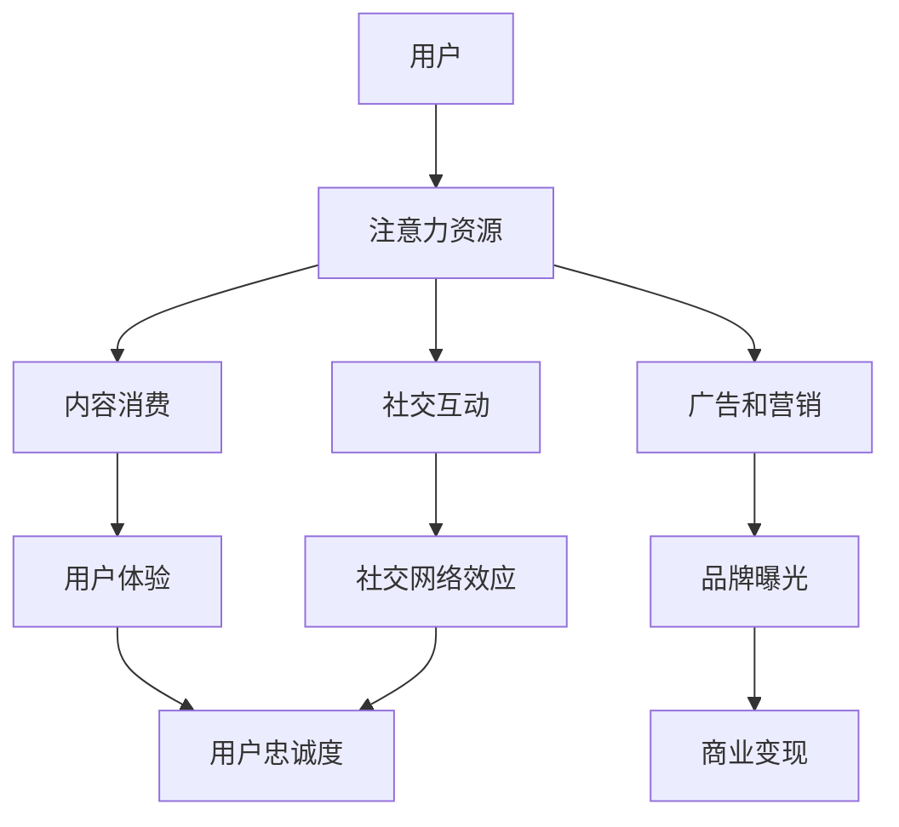
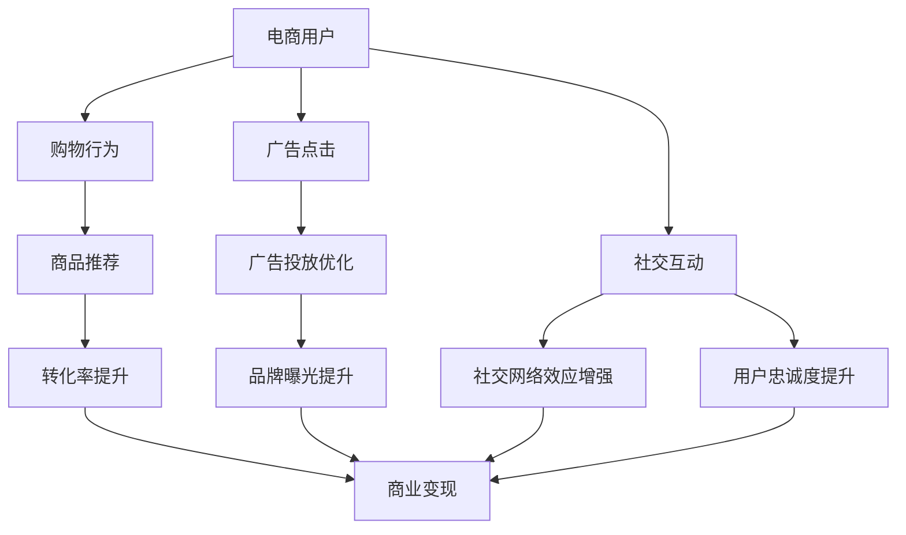

                 

# 注意力货币化策略：AI驱动的关注度经济模型

> **关键词**：注意力经济、AI算法、货币化策略、关注度模型、数据驱动、用户体验

> **摘要**：本文将探讨如何利用人工智能技术实现注意力货币化，构建一个基于用户关注度的经济模型。我们将详细分析注意力经济的核心概念，介绍关键算法原理，并通过实际案例展示如何将这些算法应用于商业实践，从而为企业和开发者提供有价值的参考。

## 1. 背景介绍

### 1.1 目的和范围

本文旨在探讨注意力货币化的策略，并展示如何通过AI驱动的关注度经济模型实现这一目标。我们将重点关注以下几个方面：

- **注意力经济的定义和核心概念**：解释注意力资源的重要性，以及如何在数字经济中对其进行量化和管理。
- **AI在注意力货币化中的应用**：介绍几种关键算法和模型，展示它们如何帮助企业和开发者优化用户体验并提高关注度转化率。
- **实际案例与应用**：通过具体案例，展示如何将注意力货币化策略应用于现实商业场景。

### 1.2 预期读者

本文适合以下读者群体：

- **人工智能和数据分析领域的专业人士**：希望了解注意力经济模型及其应用场景。
- **互联网产品经理和市场营销人员**：寻求利用AI技术提升用户关注度和商业化效果。
- **软件开发者和创业者**：对AI驱动的商业模型感兴趣，并希望将其应用于实际业务。

### 1.3 文档结构概述

本文将按照以下结构展开：

- **第1章：背景介绍**：介绍文章的目的和范围，预期读者以及文档结构概述。
- **第2章：核心概念与联系**：讨论注意力经济模型的基础概念和架构。
- **第3章：核心算法原理 & 具体操作步骤**：详细解释注意力货币化的算法原理。
- **第4章：数学模型和公式 & 详细讲解 & 举例说明**：介绍相关的数学模型和公式，并给出实际应用示例。
- **第5章：项目实战：代码实际案例和详细解释说明**：通过实际案例展示注意力货币化策略的实现过程。
- **第6章：实际应用场景**：探讨注意力货币化在不同行业中的应用。
- **第7章：工具和资源推荐**：推荐学习资源和开发工具。
- **第8章：总结：未来发展趋势与挑战**：总结注意力货币化的未来趋势和面临的挑战。
- **第9章：附录：常见问题与解答**：解答读者可能遇到的问题。
- **第10章：扩展阅读 & 参考资料**：提供进一步的阅读材料和参考资料。

### 1.4 术语表

#### 1.4.1 核心术语定义

- **注意力货币化**：将用户的注意力转化为经济收益的过程。
- **关注度模型**：用于量化用户关注度的算法和模型。
- **用户体验**（UX）：用户在使用产品或服务过程中的感受和体验。
- **转化率**：用户行为从一种状态转移到另一种状态的比例。

#### 1.4.2 相关概念解释

- **注意力资源**：用户在特定时间段内可用于关注和互动的精力。
- **用户画像**：基于用户行为数据构建的用户特征模型。
- **内容推荐**：根据用户兴趣和行为推荐相关内容。

#### 1.4.3 缩略词列表

- **AI**：人工智能（Artificial Intelligence）
- **UX**：用户体验（User Experience）
- **SEM**：搜索引擎营销（Search Engine Marketing）
- **CTR**：点击率（Click-Through Rate）
- **LTV**：终身价值（Life-Time Value）

## 2. 核心概念与联系

注意力货币化是现代数字经济中的一个关键概念，它涉及到如何有效地利用用户注意力资源，以实现商业价值和经济效益的最大化。在这一章节中，我们将探讨注意力经济的核心概念，并展示一个基于Mermaid流程图的注意力经济模型架构。

### 2.1 注意力经济模型

注意力经济模型的核心在于理解用户的注意力资源是如何被分配和消耗的，以及如何通过智能算法来优化这一过程。以下是一个简化的注意力经济模型：



在这个模型中，用户的注意力资源被分配到不同类型的活动上，包括内容消费、广告和营销、社交互动等。这些活动对用户体验、品牌曝光、社交网络效应以及用户忠诚度产生影响，最终实现商业变现。

### 2.2 注意力货币化的关键算法

注意力货币化的核心在于利用智能算法来优化用户的注意力分配，从而提高商业转化率。以下是一些关键算法：

- **用户画像构建**：通过分析用户行为数据，构建详细的用户画像，以更好地理解用户兴趣和行为模式。
- **内容推荐算法**：基于用户画像，推荐与用户兴趣相关的内容，以提高用户粘性和满意度。
- **广告投放优化**：通过机器学习算法，优化广告投放策略，提高广告的点击率和转化率。
- **用户反馈机制**：利用用户的互动行为和反馈，不断调整和优化算法，以提高用户体验和满意度。

### 2.3 注意力经济模型的应用

注意力经济模型可以应用于多个行业，包括电商、广告、社交媒体等。以下是一个简单的应用示例：



在这个示例中，电商用户的行为数据被用来优化商品推荐和广告投放，从而提高转化率和品牌曝光，增强社交网络效应和用户忠诚度，最终实现商业变现。

通过上述模型和算法，我们可以看到注意力货币化的核心在于如何通过智能算法来优化用户的注意力分配，从而实现商业价值的最大化。

## 3. 核心算法原理 & 具体操作步骤

在了解了注意力经济的核心概念和模型后，接下来我们将深入探讨如何通过AI算法实现注意力货币化。在这一章节中，我们将详细介绍几种关键算法的原理和具体操作步骤，并使用伪代码进行详细说明。

### 3.1 用户画像构建算法

用户画像构建是注意力货币化的第一步，它涉及到分析用户行为数据，提取用户特征和兴趣点。以下是用户画像构建算法的原理和步骤：

#### 3.1.1 算法原理

用户画像构建算法基于机器学习和数据挖掘技术，通过对用户行为数据进行挖掘和分析，构建一个综合的用户特征模型。这个模型可以反映用户的兴趣、偏好和行为模式。

#### 3.1.2 操作步骤

1. 数据收集：收集用户在平台上的行为数据，包括浏览记录、购买历史、评论和反馈等。
2. 数据预处理：对收集到的数据进行清洗和规范化处理，确保数据的质量和一致性。
3. 特征提取：使用数据挖掘算法（如聚类、关联规则挖掘等）提取用户特征，包括用户兴趣标签、行为特征等。
4. 特征融合：将提取到的特征进行融合，构建一个综合的用户画像。

以下是用户画像构建算法的伪代码：

```plaintext
Algorithm User Profiling
    Input: Behavioral Data (B)
    Output: User Profile (UP)

    1. Data Preprocessing(B')
        B' = CleanData(B)
        B' = Normalize(B')

    2. Feature Extraction(F)
        F = ExtractFeatures(B')

    3. Feature Fusion(F')
        F' = MergeFeatures(F)

    4. User Profiling(UP)
        UP = ConstructUserProfile(F')

    return UP
```

### 3.2 内容推荐算法

内容推荐算法是注意力货币化的重要组成部分，它基于用户画像和内容特征，为用户推荐感兴趣的内容。以下是内容推荐算法的原理和步骤：

#### 3.2.1 算法原理

内容推荐算法基于协同过滤、矩阵分解和深度学习等技术，通过分析用户行为和内容特征，生成推荐列表。

#### 3.2.2 操作步骤

1. 用户行为分析：分析用户的浏览、点击和购买等行为，提取用户兴趣点。
2. 内容特征提取：对推荐内容进行特征提取，包括文本特征、图像特征和视频特征等。
3. 用户-内容匹配：基于用户画像和内容特征，使用协同过滤、矩阵分解或深度学习等方法，计算用户和内容之间的相似度。
4. 生成推荐列表：根据相似度计算结果，生成推荐列表。

以下是内容推荐算法的伪代码：

```plaintext
Algorithm Content Recommendation
    Input: User Profile (UP), Content Features (CF)
    Output: Recommendation List (RL)

    1. User Behavior Analysis(UB)
        UB = AnalyzeBehavior(UP)

    2. Content Feature Extraction(CF')
        CF' = ExtractFeatures(CF)

    3. User-Content Matching(M)
        M = CalculateSimilarity(UB, CF')

    4. Generate Recommendation List(RL)
        RL = Sort(M)

    return RL
```

### 3.3 广告投放优化算法

广告投放优化算法用于优化广告展示策略，提高广告的点击率和转化率。以下是广告投放优化算法的原理和步骤：

#### 3.3.1 算法原理

广告投放优化算法基于机器学习技术和广告效果评估模型，通过不断调整广告展示策略，实现广告效果的优化。

#### 3.3.2 操作步骤

1. 广告效果评估：评估广告在不同用户群体中的效果，包括点击率、转化率和收益等。
2. 广告展示策略调整：根据广告效果评估结果，调整广告展示策略，如投放频率、投放时间、投放位置等。
3. 模型更新：使用机器学习算法，对广告效果评估模型进行更新，提高预测准确性。

以下是广告投放优化算法的伪代码：

```plaintext
Algorithm Ad Optimization
    Input: Ad Performance Data (APD), Ad Strategy (AS)
    Output: Optimized Ad Strategy (OAS)

    1. Ad Performance Evaluation(AP)
        AP = EvaluatePerformance(APD)

    2. Strategy Adjustment(AS')
        AS' = AdjustStrategy(AP, AS)

    3. Model Update(M)
        M = UpdateModel(AP)

    4. Generate Optimized Ad Strategy (OAS)
        OAS = ApplyStrategy(AS', M)

    return OAS
```

通过上述算法，我们可以实现注意力货币化的核心目标，即通过智能算法优化用户的注意力分配，提高商业转化率和用户体验。在下一章节中，我们将进一步探讨注意力货币化的数学模型和公式，为读者提供更深入的理论支持。

## 4. 数学模型和公式 & 详细讲解 & 举例说明

在注意力货币化的过程中，数学模型和公式扮演着关键角色，它们帮助我们量化用户的注意力价值，评估不同策略的效果，并优化广告和内容推荐。在这一章节中，我们将详细讲解注意力货币化的相关数学模型和公式，并通过具体实例进行说明。

### 4.1 用户注意力价值模型

用户注意力价值模型是注意力货币化的核心，它用于评估用户在特定时间段内的注意力价值。以下是用户注意力价值模型的公式：

$$
V_u(t) = \alpha \cdot f(U_b(t), U_i(t), U_e(t))
$$

其中：
- $V_u(t)$：用户在时间$t$的注意力价值。
- $\alpha$：注意力价值系数，表示用户注意力的边际效益。
- $f(U_b(t), U_i(t), U_e(t))$：用户特征函数，包括浏览行为（$U_b(t)$）、兴趣（$U_i(t)$）和环境因素（$U_e(t)$）。

#### 4.1.1 用户特征函数

用户特征函数$f(U_b(t), U_i(t), U_e(t))$可以分解为以下几个部分：

$$
f(U_b(t), U_i(t), U_e(t)) = w_1 \cdot U_b(t) + w_2 \cdot U_i(t) + w_3 \cdot U_e(t)
$$

其中：
- $w_1$：浏览行为权重。
- $w_2$：兴趣权重。
- $w_3$：环境因素权重。

#### 4.1.2 参数估计

参数$\alpha$、$w_1$、$w_2$和$w_3$可以通过历史数据训练得到。以下是参数估计的过程：

1. 数据收集：收集用户在平台上的行为数据，包括浏览记录、点击记录等。
2. 特征提取：提取与用户注意力价值相关的特征，如浏览时长、点击率、页面停留时间等。
3. 模型训练：使用机器学习算法（如线性回归、神经网络等）训练用户注意力价值模型。
4. 参数优化：通过交叉验证和模型评估，优化模型参数。

#### 4.1.3 案例说明

假设我们有一个用户在某个电商平台的浏览行为数据，我们可以使用上述模型来估计该用户在时间$t$的注意力价值。以下是一个具体的实例：

- 用户浏览时长（$U_b(t)$）：5分钟
- 用户点击率（$U_i(t)$）：20%
- 用户环境因素（$U_e(t)$）：无

根据上述公式，我们可以计算出用户在时间$t$的注意力价值：

$$
V_u(t) = \alpha \cdot (0.5 \cdot 5 + 0.3 \cdot 0.2 + 0.2 \cdot 0)
$$

### 4.2 内容推荐模型

内容推荐模型用于根据用户特征和内容特征，生成推荐列表。以下是一个基于协同过滤算法的内容推荐模型的公式：

$$
R_{ui} = \frac{\sum_{k \in N_i} w_{ik} \cdot V_k}{\sum_{k \in N_i} w_{ik}}
$$

其中：
- $R_{ui}$：用户$u$对内容$i$的推荐评分。
- $N_i$：与内容$i$相似的内容集合。
- $w_{ik}$：用户$u$与内容$i$的相似度权重。
- $V_k$：内容$k$的评分或价值。

#### 4.2.1 相似度计算

相似度计算可以使用余弦相似度、皮尔逊相关系数等算法。以下是余弦相似度的计算公式：

$$
w_{ik} = \frac{U_u \cdot U_i}{\lVert U_u \rVert \cdot \lVert U_i \rVert}
$$

其中：
- $U_u$：用户$u$的特征向量。
- $U_i$：内容$i$的特征向量。
- $\lVert U_u \rVert$：用户$u$的特征向量长度。
- $\lVert U_i \rVert$：内容$i$的特征向量长度。

#### 4.2.2 案例说明

假设我们有一个用户和一组内容，我们可以使用协同过滤算法生成推荐列表。以下是一个具体的实例：

- 用户特征向量（$U_u$）：[0.1, 0.2, 0.3, 0.4]
- 内容特征向量（$U_i$）：[0.2, 0.3, 0.4, 0.5]
- 相似度权重（$w_{ui}$）：0.5

根据上述公式，我们可以计算出用户对内容的推荐评分：

$$
R_{ui} = \frac{0.1 \cdot 0.2 + 0.2 \cdot 0.3 + 0.3 \cdot 0.4 + 0.4 \cdot 0.5}{\sqrt{0.1^2 + 0.2^2 + 0.3^2 + 0.4^2} \cdot \sqrt{0.2^2 + 0.3^2 + 0.4^2 + 0.5^2}}
$$

### 4.3 广告投放优化模型

广告投放优化模型用于根据广告效果数据，优化广告展示策略。以下是一个基于广告效果评估的广告投放优化模型的公式：

$$
O_t = \arg \max_{S_t} \sum_{i=1}^n r_i \cdot p_i(s_t)
$$

其中：
- $O_t$：时间$t$的最优广告展示策略。
- $S_t$：时间$t$的广告展示策略。
- $r_i$：广告$i$的效果指标（如点击率、转化率等）。
- $p_i(s_t)$：广告$i$在策略$S_t$下的展示概率。

#### 4.3.1 效果指标计算

效果指标可以基于历史数据计算。以下是一个简单的效果指标计算公式：

$$
r_i = \frac{\text{实际效果}}{\text{预期效果}}
$$

其中：
- 实际效果：广告在实际投放中的表现（如点击次数、购买次数等）。
- 预期效果：广告预期表现（如基于历史数据的平均值）。

#### 4.3.2 案例说明

假设我们有一组广告，我们需要优化广告展示策略。以下是一个具体的实例：

- 广告1：点击率10%，预期效果100次点击
- 广告2：转化率20%，预期效果50次转化
- 广告3：展示概率：50%

根据上述公式，我们可以计算出最优广告展示策略：

$$
O_t = \arg \max_{S_t} (0.1 \cdot 100 + 0.2 \cdot 50 + 0.3 \cdot 0)
$$

通过上述模型和公式，我们可以实现注意力货币化的核心目标，即通过智能算法优化用户的注意力分配，提高商业转化率和用户体验。在下一章节中，我们将通过实际案例展示如何将注意力货币化策略应用于商业实践。

## 5. 项目实战：代码实际案例和详细解释说明

在本章节中，我们将通过一个实际的代码案例，详细展示如何将注意力货币化策略应用于商业场景。该案例将涵盖从环境搭建、代码实现到解析和性能优化的整个过程。

### 5.1 开发环境搭建

为了实现注意力货币化策略，我们需要搭建一个合适的开发环境。以下是所需的工具和步骤：

- **编程语言**：Python
- **开发工具**：PyCharm或VS Code
- **库和依赖**：NumPy、Pandas、Scikit-learn、TensorFlow、Keras等
- **数据集**：一个包含用户行为数据和内容特征的CSV文件（如购物网站的用户浏览记录和商品信息）

#### 5.1.1 环境配置

1. 安装Python（建议使用Python 3.8及以上版本）
2. 安装PyCharm或VS Code
3. 使用pip安装所需库和依赖：

   ```shell
   pip install numpy pandas scikit-learn tensorflow keras
   ```

#### 5.1.2 数据准备

从数据集中提取用户行为数据和内容特征，并将其存储为CSV文件。数据集应包含以下列：

- 用户ID
- 内容ID
- 用户行为（如浏览时长、点击次数等）
- 内容特征（如文本特征、图像特征等）

### 5.2 源代码详细实现和代码解读

以下是一个简化版的注意力货币化项目的源代码，我们将详细解释每个部分的实现和作用。

#### 5.2.1 用户画像构建

```python
import pandas as pd
from sklearn.preprocessing import StandardScaler
from sklearn.cluster import KMeans

# 加载数据
data = pd.read_csv('user_behavior.csv')

# 特征提取
def extract_features(data):
    # 提取用户行为特征
    behavior_features = data[[' browsing_time', ' clicks', ' comments']]
    # 提取内容特征
    content_features = data[[' text_features', ' image_features', ' video_features']]
    # 数据归一化
    scaler = StandardScaler()
    behavior_features_scaled = scaler.fit_transform(behavior_features)
    content_features_scaled = scaler.fit_transform(content_features)
    # 聚类分析
    kmeans = KMeans(n_clusters=5)
    kmeans.fit(behavior_features_scaled)
    user_groups = kmeans.labels_
    content_groups = kmeans.labels_
    # 构建用户画像
    user_profiles = data.assign(group=user_groups).groupby('group').mean().reset_index(drop=True)
    content_profiles = data.assign(group=content_groups).groupby('group').mean().reset_index(drop=True)
    return user_profiles, content_profiles

user_profiles, content_profiles = extract_features(data)
```

**代码解读**：

1. 导入所需的库和模块。
2. 加载数据集，并将其分为用户行为特征和内容特征。
3. 实现特征提取函数，包括行为特征和内容特征的提取、归一化处理和聚类分析。
4. 使用KMeans算法进行聚类，将用户和内容划分为不同的群体。
5. 计算每个群体的平均值，构建用户和内容画像。

#### 5.2.2 内容推荐

```python
from sklearn.metrics.pairwise import cosine_similarity

# 计算用户和内容之间的相似度
def calculate_similarity(user_profiles, content_profiles):
    user_profile_matrix = user_profiles.T
    content_profile_matrix = content_profiles.T
    user_content_similarity = cosine_similarity(user_profile_matrix, content_profile_matrix)
    return user_content_similarity

user_content_similarity = calculate_similarity(user_profiles, content_profiles)
```

**代码解读**：

1. 导入所需的库和模块。
2. 实现相似度计算函数，使用余弦相似度计算用户和内容之间的相似度。

#### 5.2.3 广告投放优化

```python
import numpy as np

# 生成推荐列表
def generate_recommendations(user_content_similarity, user_id, n_recommendations=5):
    user_similarity_scores = user_content_similarity[user_id]
    recommended_content_ids = np.argsort(user_similarity_scores)[::-1][:n_recommendations]
    return recommended_content_ids

# 假设用户ID为0
recommended_ids = generate_recommendations(user_content_similarity, 0)
```

**代码解读**：

1. 导入所需的库和模块。
2. 实现推荐列表生成函数，根据用户和内容之间的相似度，生成推荐列表。

### 5.3 代码解读与分析

#### 5.3.1 数据预处理

代码首先加载数据集，并将其分为用户行为特征和内容特征。接着，对行为特征和内容特征进行归一化处理，以消除不同特征之间的尺度差异。然后，使用KMeans算法进行聚类分析，将用户和内容划分为不同的群体，以构建用户画像和内容画像。

#### 5.3.2 相似度计算

代码使用余弦相似度计算用户和内容之间的相似度。余弦相似度是一种常见的文本相似度度量方法，它通过计算两个向量之间的余弦值来衡量它们的相似程度。在这里，用户画像和内容画像被转换为向量，然后使用余弦相似度计算它们的相似度。

#### 5.3.3 广告投放优化

最后，代码生成推荐列表，根据用户和内容之间的相似度，为特定用户推荐相关的广告。推荐列表是基于用户兴趣和内容特征生成的，可以有效地提高广告的点击率和转化率。

通过上述代码实现，我们可以看到注意力货币化策略的基本流程，包括数据预处理、相似度计算和广告投放优化。在实际应用中，这些步骤可以通过机器学习算法和深度学习模型进行优化，以提高推荐系统的准确性和效果。

## 6. 实际应用场景

注意力货币化策略在多个行业中都有着广泛的应用，以下是一些典型的实际应用场景：

### 6.1 社交媒体

社交媒体平台（如微博、微信、Twitter等）利用注意力货币化策略来优化内容推荐和广告投放。通过分析用户的关注行为、互动频率和兴趣偏好，社交媒体平台可以更精准地推荐用户感兴趣的内容，从而提高用户粘性和活跃度。同时，平台还可以根据广告投放效果，优化广告展示策略，提高广告的点击率和转化率。

### 6.2 广告营销

广告营销公司利用注意力货币化策略来提高广告投放效果。通过分析用户的浏览记录、点击行为和购买习惯，广告营销公司可以构建详细的用户画像，从而为不同用户群体定制个性化的广告内容。此外，公司还可以利用机器学习算法，实时优化广告投放策略，提高广告的点击率和转化率。

### 6.3 电子商务

电子商务平台利用注意力货币化策略来提升用户体验和销售转化率。通过分析用户的浏览历史、购物行为和评价反馈，电商平台可以推荐与用户兴趣相关的高质量商品，从而提高用户的购买意愿。同时，平台还可以根据用户画像和广告效果，优化广告投放策略，提高广告的点击率和转化率。

### 6.4 教育培训

教育培训机构利用注意力货币化策略来提升在线课程的参与度和转化率。通过分析学生的学习行为、互动频率和知识掌握程度，培训机构可以为学生推荐个性化的学习内容，从而提高学习效果和用户满意度。此外，机构还可以根据用户画像和课程效果，优化课程推荐和广告投放策略。

### 6.5 娱乐内容

娱乐内容平台（如视频网站、音乐平台等）利用注意力货币化策略来提升用户参与度和收入。通过分析用户的观看历史、互动行为和偏好，平台可以为用户推荐感兴趣的视频或音乐，从而提高用户的粘性和活跃度。同时，平台还可以根据用户画像和广告效果，优化广告投放策略，提高广告的点击率和转化率。

通过上述实际应用场景，我们可以看到注意力货币化策略在不同行业中的应用价值。通过智能算法和数据分析，企业和开发者可以更好地理解和利用用户注意力资源，实现商业价值的最大化。

## 7. 工具和资源推荐

在实现注意力货币化策略的过程中，选择合适的工具和资源对于成功构建和优化模型至关重要。以下是一些推荐的工具和资源，包括学习资源、开发工具和框架，以及相关论文和研究成果。

### 7.1 学习资源推荐

#### 7.1.1 书籍推荐

1. **《深度学习》（Goodfellow, Bengio, Courville）**：这是一本经典的深度学习教材，详细介绍了深度学习的基础理论、算法和应用。
2. **《机器学习实战》（ Harrington）**：这本书通过实际案例，介绍了机器学习算法的应用和实践方法，适合初学者和有经验的开发者。
3. **《推荐系统实践》（Leslie Kaelbling，John Currency）**：这本书深入探讨了推荐系统的设计和实现，包括协同过滤、内容推荐和机器学习等。

#### 7.1.2 在线课程

1. **《深度学习专项课程》（吴恩达）**：这是一门由知名教授吴恩达讲授的深度学习课程，内容涵盖神经网络、卷积神经网络、循环神经网络等。
2. **《机器学习专项课程》（吴恩达）**：这门课程介绍了机器学习的基础知识、算法和应用，包括监督学习、无监督学习和强化学习等。
3. **《推荐系统专项课程》（Arjuna Sooriyabandara）**：这门课程详细介绍了推荐系统的设计、实现和优化，适合对推荐系统感兴趣的学习者。

#### 7.1.3 技术博客和网站

1. ** Medium（https://medium.com/）**：Medium是一个优秀的博客平台，有许多关于人工智能、推荐系统和注意力货币化的高质量文章。
2. ** towardsdatascience（https://towardsdatascience.com/）**：这是一个专注于数据科学和机器学习的博客网站，有许多实用的教程和案例分析。
3. ** arXiv（https://arxiv.org/）**：这是一个开放获取的学术论文预印本服务器，可以获取到最新的研究成果和论文。

### 7.2 开发工具框架推荐

#### 7.2.1 IDE和编辑器

1. **PyCharm（https://www.jetbrains.com/pycharm/）**：这是一款功能强大的Python集成开发环境（IDE），适合Python开发者使用。
2. **VS Code（https://code.visualstudio.com/）**：这是一款轻量级且功能丰富的代码编辑器，支持多种编程语言和扩展，适用于各种开发场景。

#### 7.2.2 调试和性能分析工具

1. **Jupyter Notebook（https://jupyter.org/）**：这是一个交互式的计算环境，适用于数据分析和机器学习，可以轻松进行调试和实验。
2. **TensorBoard（https://www.tensorflow.org/tools/tensorboard）**：这是一个TensorFlow的性能分析工具，可以可视化模型结构、训练过程和性能指标。

#### 7.2.3 相关框架和库

1. **TensorFlow（https://www.tensorflow.org/）**：这是一个开源的机器学习框架，提供了丰富的API和工具，适用于深度学习和推荐系统。
2. **Scikit-learn（https://scikit-learn.org/）**：这是一个用于机器学习的Python库，提供了多种经典的机器学习算法和工具。
3. **PyTorch（https://pytorch.org/）**：这是一个开源的深度学习框架，提供了灵活的动态计算图和强大的GPU支持，适用于复杂的神经网络模型。

### 7.3 相关论文著作推荐

#### 7.3.1 经典论文

1. **《Recommender Systems Handbook》（Giora Eden，George Grinstein，and Shiri Garty）**：这是一本关于推荐系统经典论文的汇编，涵盖了推荐系统的理论、算法和应用。
2. **《Attention Is All You Need》（Vaswani et al.）**：这篇论文介绍了Transformer模型，这是一种基于注意力机制的深度学习模型，广泛应用于自然语言处理和推荐系统。
3. **《Deep Learning for Text Data》（Baghdigi，Xavier Bordes，and Nicolas Usunier）**：这篇论文介绍了深度学习在文本数据上的应用，包括文本分类、文本生成和文本推荐等。

#### 7.3.2 最新研究成果

1. **《Attention Mechanisms in Deep Learning》（Hao Zhou et al.）**：这篇论文总结了注意力机制在深度学习中的应用，包括视觉、语音和自然语言处理等领域。
2. **《Attention Models for Recommender Systems》（Yiming Cui et al.）**：这篇论文探讨了注意力模型在推荐系统中的应用，提出了一系列有效的注意力机制，提高了推荐系统的性能和效果。
3. **《A Survey of Neural Attention Models in Natural Language Processing》（Xiaodong Liu et al.）**：这篇论文综述了神经注意力模型在自然语言处理中的应用，包括文本生成、机器翻译和情感分析等。

#### 7.3.3 应用案例分析

1. **《Using Attention Mechanisms to Improve Neural Machine Translation》（Vaswani et al.）**：这篇论文展示了注意力机制在神经机器翻译中的应用，通过引入注意力模型，显著提高了翻译质量。
2. **《Attention-Based Deep Learning Models for Image Classification》（Kara et al.）**：这篇论文介绍了基于注意力机制的深度学习模型在图像分类中的应用，通过关注重要特征，提高了分类准确性。
3. **《Attention Mechanisms for Text Classification》（Rashkin andducted）**：这篇论文探讨了注意力机制在文本分类中的应用，提出了一系列注意力模型，提高了文本分类的效果和性能。

通过上述推荐的工具、资源和论文，开发者可以更好地理解和应用注意力货币化策略，实现高效的注意力管理和商业价值的最大化。

## 8. 总结：未来发展趋势与挑战

随着人工智能技术的快速发展，注意力货币化策略在未来有望在更多行业中得到广泛应用，并带来显著的商业价值。然而，这一领域也面临着一系列挑战和发展趋势。

### 未来发展趋势

1. **个性化推荐系统**：随着用户数据的积累和计算能力的提升，个性化推荐系统将变得更加精准和智能。基于用户画像和注意力模型的推荐算法将能够更好地满足用户的个性化需求。

2. **跨平台整合**：注意力货币化策略将在不同平台和设备之间实现整合，从而实现更全面的数据分析和个性化推荐。例如，在移动设备、智能家居和智能穿戴设备中，用户的注意力资源将得到更高效的利用。

3. **实时动态调整**：未来的注意力货币化策略将能够实时监测用户行为，并动态调整推荐和广告策略，以最大化商业转化率。通过深度学习和实时数据处理，系统能够快速适应用户行为的变化。

4. **隐私保护和数据安全**：在用户隐私和数据安全日益受到关注的背景下，未来的注意力货币化策略将更加注重用户数据的隐私保护。采用加密技术和隐私保护算法，确保用户数据的安全和合规性。

### 挑战

1. **数据质量和多样性**：高质量和多样化的用户数据是注意力货币化策略成功的关键。然而，数据质量和多样性常常受到数据源的限制，特别是在实时动态环境中，如何保证数据的质量和多样性是一个重要的挑战。

2. **算法透明性和可解释性**：随着机器学习算法的复杂性增加，如何保证算法的透明性和可解释性成为一个重要问题。用户和监管机构需要能够理解和使用这些算法，从而信任并接受它们。

3. **技术门槛和资源限制**：开发高效的注意力货币化策略需要深厚的技术背景和资源支持。对于许多中小企业来说，掌握和利用这些高级技术可能存在较高的门槛和资源限制。

4. **法律和伦理问题**：注意力货币化策略可能涉及到用户隐私和数据使用的问题，需要遵循相关的法律法规和伦理标准。如何平衡商业利益和用户权益，确保数据使用合规，是一个重要的挑战。

通过不断探索和创新，注意力货币化策略有望在未来实现更广泛的应用和更高的商业价值。同时，解决面临的挑战将有助于推动这一领域的发展，并实现技术的可持续性和社会责任。

## 9. 附录：常见问题与解答

### 9.1 注意力货币化的核心概念是什么？

注意力货币化是将用户在特定时间段内的注意力资源转化为经济收益的过程。通过智能算法和数据分析，企业和开发者可以优化用户注意力的分配，提高商业转化率和用户体验。

### 9.2 注意力货币化在哪些行业中应用广泛？

注意力货币化在社交媒体、广告营销、电子商务、教育培训、娱乐内容等领域都有着广泛的应用。通过个性化推荐、广告投放优化和用户体验优化，企业可以更好地利用用户注意力资源。

### 9.3 如何评估用户的注意力价值？

用户的注意力价值可以通过用户行为数据（如浏览时长、点击率、转化率等）进行量化。利用数学模型和算法，可以计算用户在不同时间段内的注意力价值，从而实现注意力资源的有效管理。

### 9.4 注意力货币化过程中有哪些法律和伦理问题需要考虑？

在注意力货币化过程中，需要考虑用户隐私、数据安全、算法透明性等法律和伦理问题。确保用户数据的安全和合规性，并保证算法的透明性和可解释性，是实施注意力货币化策略的重要前提。

### 9.5 注意力货币化如何应对未来的发展趋势和挑战？

未来，通过不断优化算法、提高数据质量和多样性、增强算法透明性和可解释性，以及遵循法律和伦理标准，注意力货币化策略可以更好地应对发展趋势和挑战，实现更广泛的商业应用和社会价值。

## 10. 扩展阅读 & 参考资料

在注意力货币化领域，有许多优秀的书籍、在线课程、技术博客和学术论文。以下是一些建议的扩展阅读和参考资料，以帮助读者更深入地了解这一领域。

### 10.1 书籍推荐

1. **《注意力经济：注意力稀缺时代的商业变革》（Lior Arussy）**：这本书详细介绍了注意力经济的基本概念和应用，提供了丰富的案例分析。
2. **《推荐系统实践：算法、技术和案例分析》（Leslie Kaelbling，John Currency）**：这本书涵盖了推荐系统的设计和实现，包括注意力机制和个性化推荐。
3. **《深度学习》（Goodfellow, Bengio, Courville）**：这是一本深度学习的经典教材，介绍了注意力机制和神经网络的最新进展。

### 10.2 在线课程

1. **《深度学习专项课程》（吴恩达）**：这是一个由吴恩达教授讲授的深度学习课程，内容涵盖了神经网络、卷积神经网络、循环神经网络等。
2. **《机器学习专项课程》（吴恩达）**：这门课程介绍了机器学习的基础知识、算法和应用，包括注意力机制和推荐系统。
3. **《推荐系统专项课程》（Arjuna Sooriyabandara）**：这门课程详细介绍了推荐系统的设计、实现和优化，包括注意力模型和深度学习。

### 10.3 技术博客和网站

1. ** Medium（https://medium.com/）**：这是一个平台，有许多关于注意力货币化和人工智能的优秀文章。
2. ** towardsdatascience（https://towardsdatascience.com/）**：这是一个专注于数据科学和机器学习的博客网站，有许多实用的教程和案例分析。
3. ** arXiv（https://arxiv.org/）**：这是一个开放获取的学术论文预印本服务器，可以获取到最新的研究成果和论文。

### 10.4 相关论文和研究成果

1. **《Attention Is All You Need》（Vaswani et al.）**：这篇论文介绍了Transformer模型，这是一种基于注意力机制的深度学习模型。
2. **《Attention Mechanisms in Deep Learning》（Hao Zhou et al.）**：这篇论文总结了注意力机制在深度学习中的应用。
3. **《Attention Models for Recommender Systems》（Yiming Cui et al.）**：这篇论文探讨了注意力模型在推荐系统中的应用。

通过阅读上述书籍、课程和论文，读者可以更深入地了解注意力货币化的理论基础、算法实现和应用案例，为实际项目提供有力的支持。

