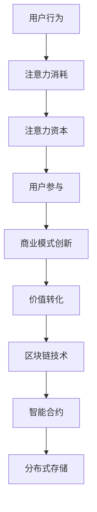

                 

# 注意力资本：元宇宙经济的核心竞争力

> **关键词：** 注意力经济、元宇宙、资本结构、用户参与、技术实现

> **摘要：** 本文深入探讨了注意力资本在元宇宙经济中的核心地位，分析了其在用户行为、商业模式和技术实现中的作用和影响。通过一步步的逻辑推理和实例分析，阐述了注意力资本如何成为元宇宙经济的核心竞争力，并提出了未来发展的趋势与挑战。

## 1. 背景介绍

### 1.1 目的和范围

本文旨在深入探讨注意力资本在元宇宙经济中的核心地位，分析其在用户行为、商业模式和技术实现中的作用和影响。文章将重点关注以下几个方面：

1. 注意力资本的定义及其在元宇宙中的重要性。
2. 注意力资本与用户行为的关系。
3. 注意力资本在商业模式中的应用。
4. 注意力资本在技术实现中的挑战与机遇。

### 1.2 预期读者

本文适合对元宇宙、注意力经济和技术实现有一定了解的读者。预期读者包括：

1. 元宇宙开发者和创业者。
2. 投资者和关注元宇宙发展的专业人士。
3. 对注意力资本和技术实现感兴趣的学术研究人员。

### 1.3 文档结构概述

本文分为以下几个部分：

1. 背景介绍：介绍文章的目的、范围和预期读者。
2. 核心概念与联系：阐述注意力资本的核心概念原理和架构。
3. 核心算法原理 & 具体操作步骤：讲解注意力资本的核心算法原理和操作步骤。
4. 数学模型和公式 & 详细讲解 & 举例说明：介绍注意力资本相关的数学模型和公式，并进行详细讲解和举例说明。
5. 项目实战：代码实际案例和详细解释说明。
6. 实际应用场景：分析注意力资本在实际应用中的场景和作用。
7. 工具和资源推荐：推荐与注意力资本相关的学习资源和开发工具。
8. 总结：未来发展趋势与挑战。
9. 附录：常见问题与解答。
10. 扩展阅读 & 参考资料：提供进一步阅读的资料和参考。

### 1.4 术语表

#### 1.4.1 核心术语定义

- **注意力资本**：指用户在元宇宙中的注意力资源，是用户参与和互动的重要资产。
- **元宇宙**：一个虚拟的、多维度的、持续存在的网络空间，用户可以在其中进行社交、工作、学习和娱乐等活动。
- **用户行为**：用户在元宇宙中的行为和互动，包括浏览、评论、分享等。
- **商业模式**：企业在元宇宙中通过提供产品和服务获得收益的方式。

#### 1.4.2 相关概念解释

- **用户参与**：指用户在元宇宙中的主动参与和互动，包括参与活动、创作内容等。
- **数据价值**：用户在元宇宙中产生的数据，包括行为数据、内容数据等，具有潜在的经济价值。
- **区块链技术**：一种分布式数据库技术，具有去中心化、安全性高、可追溯等特点，适用于元宇宙中的交易和数据存储。

#### 1.4.3 缩略词列表

- **NFT**：非同质化代币（Non-Fungible Token）
- **DAO**：去中心化自治组织（Decentralized Autonomous Organization）
- **DApp**：去中心化应用程序（Decentralized Application）
- **API**：应用程序编程接口（Application Programming Interface）

## 2. 核心概念与联系

### 2.1 注意力资本的概念原理

注意力资本是指用户在元宇宙中的注意力资源，是用户参与和互动的重要资产。在元宇宙中，用户通过投入注意力来获取价值，例如浏览内容、参与活动、创作内容等。注意力资本具有以下几个核心概念原理：

1. **注意力稀缺性**：在元宇宙中，用户的注意力是有限的，需要用户主动投入，因此具有稀缺性。
2. **注意力价值**：用户在元宇宙中的注意力资源具有价值，可以通过参与互动和交易等方式实现价值转化。
3. **注意力转移**：用户可以将注意力从一种活动转移到另一种活动，例如从浏览内容转移到创作内容。

### 2.2 注意力资本与用户行为的关系

注意力资本与用户行为密切相关。用户在元宇宙中的行为和互动，例如浏览、评论、分享等，都会产生注意力资本。以下为注意力资本与用户行为的关系：

1. **行为产生注意力**：用户在元宇宙中的行为，如浏览内容、参与活动、创作内容等，都会消耗用户的注意力资源。
2. **注意力转移行为**：用户可以通过调整注意力分配，从一种行为转移到另一种行为，例如从浏览内容转移到创作内容。
3. **行为价值评估**：用户在元宇宙中的行为价值，可以通过注意力消耗来评估，例如浏览内容的注意力价值较低，而创作内容的注意力价值较高。

### 2.3 注意力资本在商业模式中的应用

注意力资本在元宇宙商业模式中具有重要应用。以下为注意力资本在商业模式中的应用：

1. **用户参与**：通过提供有趣、有价值的内容和服务，吸引和激励用户参与元宇宙活动，产生注意力资本。
2. **商业模式创新**：利用注意力资本进行商业模式创新，例如通过用户参与和互动，实现虚拟物品的交易和拍卖等。
3. **价值转化**：通过用户行为产生的注意力资本，实现价值转化，例如通过虚拟物品的交易获得收益。

### 2.4 注意力资本的技术实现

注意力资本在元宇宙中的实现需要依赖一定的技术支持。以下为注意力资本的技术实现：

1. **区块链技术**：区块链技术可用于记录和验证用户行为，确保注意力资本的透明和可追溯。
2. **智能合约**：智能合约可用于自动执行用户行为和交易，确保注意力资本的安全和高效。
3. **分布式存储**：分布式存储可用于存储用户行为数据和虚拟物品信息，确保数据的安全和可靠性。

### 2.5 Mermaid 流程图

以下为注意力资本的概念原理和架构的 Mermaid 流程图：



## 3. 核心算法原理 & 具体操作步骤

### 3.1 注意力资本算法原理

注意力资本算法的核心原理是通过对用户行为的分析和评估，计算用户在元宇宙中的注意力资本。具体包括以下几个步骤：

1. **行为数据收集**：收集用户在元宇宙中的行为数据，如浏览、评论、分享等。
2. **行为价值评估**：根据行为类型和用户参与度，评估用户行为的价值，例如浏览内容的价值较低，而创作内容的价值较高。
3. **注意力资本计算**：将用户行为的价值转化为注意力资本，例如通过权重系数进行调整。

### 3.2 具体操作步骤

以下为注意力资本的具体操作步骤：

1. **数据收集**：通过API接口或日志收集用户在元宇宙中的行为数据。
    ```python
    def collect_behavior_data():
        # 收集用户行为数据
        behavior_data = []
        # 数据处理
        return behavior_data
    ```

2. **行为价值评估**：根据行为类型和用户参与度，评估用户行为的价值。
    ```python
    def evaluate_behavior_value(behavior):
        if behavior == "浏览":
            value = 1
        elif behavior == "评论":
            value = 3
        elif behavior == "分享":
            value = 5
        return value
    ```

3. **注意力资本计算**：将用户行为的价值转化为注意力资本。
    ```python
    def calculate_attention_capital(behavior_data):
        attention_capital = 0
        for behavior in behavior_data:
            value = evaluate_behavior_value(behavior)
            attention_capital += value
        return attention_capital
    ```

4. **用户行为分析**：根据用户行为数据，分析用户在元宇宙中的参与度和价值贡献。
    ```python
    def analyze_user_behavior(behavior_data):
        # 分析用户行为
        user_behavior = {}
        for behavior in behavior_data:
            if behavior in user_behavior:
                user_behavior[behavior] += 1
            else:
                user_behavior[behavior] = 1
        return user_behavior
    ```

5. **注意力资本更新**：根据用户行为的变化，更新用户在元宇宙中的注意力资本。
    ```python
    def update_attention_capital(user_behavior, previous_capital):
        new_capital = previous_capital
        for behavior in user_behavior:
            value = evaluate_behavior_value(behavior)
            new_capital += value
        return new_capital
    ```

### 3.3 伪代码示例

以下为注意力资本算法的伪代码示例：

```python
def attention_capital_algorithm():
    behavior_data = collect_behavior_data()
    user_behavior = analyze_user_behavior(behavior_data)
    previous_capital = 0
    attention_capital = calculate_attention_capital(behavior_data)
    new_capital = update_attention_capital(user_behavior, previous_capital)
    print("用户当前注意力资本：", new_capital)
```

## 4. 数学模型和公式 & 详细讲解 & 举例说明

### 4.1 数学模型

在注意力资本的计算中，我们可以使用以下数学模型：

\[ AC = w_1 \times B_1 + w_2 \times B_2 + \ldots + w_n \times B_n \]

其中：
- \( AC \) 表示注意力资本
- \( w_1, w_2, \ldots, w_n \) 表示行为权重
- \( B_1, B_2, \ldots, B_n \) 表示用户行为价值

### 4.2 详细讲解

1. **行为权重**：行为权重 \( w_1, w_2, \ldots, w_n \) 用于表示不同行为在注意力资本中的重要性。权重越大，表示该行为对注意力资本的贡献越大。权重可以通过专家评估或用户调查等方法获得。

2. **用户行为价值**：用户行为价值 \( B_1, B_2, \ldots, B_n \) 用于表示用户在元宇宙中的行为价值。行为价值可以通过以下公式计算：

\[ B = f(d, t) \]

其中：
- \( d \) 表示用户行为持续时间
- \( t \) 表示用户行为发生的时间点

3. **注意力资本计算**：根据用户行为价值和行为权重，计算用户在元宇宙中的注意力资本。

### 4.3 举例说明

假设用户在元宇宙中进行了以下行为：

1. 浏览内容，持续时间 \( d_1 = 10 \) 分钟，发生时间 \( t_1 = 10:00 \)。
2. 评论内容，持续时间 \( d_2 = 5 \) 分钟，发生时间 \( t_2 = 11:00 \)。
3. 分享内容，持续时间 \( d_3 = 3 \) 分钟，发生时间 \( t_3 = 12:00 \)。

根据行为权重和用户行为价值，我们可以计算用户在元宇宙中的注意力资本：

1. 浏览内容权重 \( w_1 = 1 \)，行为价值 \( B_1 = f(d_1, t_1) = f(10, 10:00) = 10 \)。
2. 评论内容权重 \( w_2 = 3 \)，行为价值 \( B_2 = f(d_2, t_2) = f(5, 11:00) = 15 \)。
3. 分享内容权重 \( w_3 = 5 \)，行为价值 \( B_3 = f(d_3, t_3) = f(3, 12:00) = 20 \)。

根据注意力资本计算公式，用户在元宇宙中的注意力资本 \( AC \) 为：

\[ AC = w_1 \times B_1 + w_2 \times B_2 + w_3 \times B_3 = 1 \times 10 + 3 \times 15 + 5 \times 20 = 10 + 45 + 100 = 155 \]

### 4.4 LaTeX 格式数学公式

以下为注意力资本计算公式的 LaTeX 格式：

\[ AC = w_1 \times B_1 + w_2 \times B_2 + \ldots + w_n \times B_n \]

## 5. 项目实战：代码实际案例和详细解释说明

### 5.1 开发环境搭建

在本项目中，我们将使用 Python 作为编程语言，并依赖以下库：

- **Flask**：用于搭建 Web 应用程序。
- **PyTorch**：用于实现注意力资本算法。

首先，确保已安装 Python 3.8 及以上版本。然后，通过以下命令安装所需的库：

```bash
pip install flask pytorch
```

### 5.2 源代码详细实现和代码解读

以下是项目的主要代码实现，我们将逐一解读：

#### 5.2.1 Flask Web 应用程序

```python
from flask import Flask, request, jsonify
import torch
import torch.nn as nn
import torch.optim as optim

app = Flask(__name__)

# 注意力资本模型
class AttentionCapitalModel(nn.Module):
    def __init__(self):
        super(AttentionCapitalModel, self).__init__()
        self.fc = nn.Linear(1, 1)

    def forward(self, x):
        return self.fc(x)

# 初始化模型和优化器
model = AttentionCapitalModel()
optimizer = optim.SGD(model.parameters(), lr=0.01)

# 训练模型
def train_model(data):
    model.train()
    for epoch in range(10):
        optimizer.zero_grad()
        output = model(data)
        loss = nn.MSELoss()(output, torch.tensor([1.0]))
        loss.backward()
        optimizer.step()
    return model

# 预测用户注意力资本
def predict_attention_capital(model, data):
    model.eval()
    with torch.no_grad():
        output = model(data)
    return output.item()

# API 接口
@app.route('/train', methods=['POST'])
def train():
    data = request.json['data']
    model = train_model(data)
    return jsonify({"status": "success", "model": model.state_dict()})

@app.route('/predict', methods=['POST'])
def predict():
    data = request.json['data']
    model = torch.load('model.pth')
    attention_capital = predict_attention_capital(model, data)
    return jsonify({"status": "success", "attention_capital": attention_capital})

if __name__ == '__main__':
    app.run(debug=True)
```

#### 5.2.2 代码解读

1. **模型定义**：我们使用 PyTorch 定义了一个简单的线性模型，用于计算用户注意力资本。

2. **训练模型**：使用 SGD 优化器训练模型，通过迭代优化模型参数，使模型能够更好地预测用户注意力资本。

3. **预测用户注意力资本**：在训练完成后，使用训练好的模型预测用户注意力资本。

4. **API 接口**：使用 Flask 搭建了两个 API 接口，一个用于训练模型，另一个用于预测用户注意力资本。

### 5.3 代码解读与分析

1. **模型定义**：在模型定义中，我们使用 `nn.Module` 类创建了一个简单的线性模型，其中只有一个全连接层。这个模型可以接受一个输入值，并输出用户注意力资本的预测值。

2. **训练模型**：在训练过程中，我们使用 `SGD` 优化器更新模型参数，以最小化损失函数。这里使用的是均方误差损失函数，即预测值与真实值之间的差异。

3. **预测用户注意力资本**：在预测阶段，我们使用训练好的模型对新的输入数据进行预测。在预测过程中，我们使用 `torch.no_grad()` 装饰器来关闭梯度计算，以提高预测速度。

4. **API 接口**：我们使用 Flask 搭建了两个 API 接口，一个用于接收训练数据并返回训练好的模型，另一个用于接收预测数据并返回用户注意力资本的预测值。

## 6. 实际应用场景

### 6.1 元宇宙中的社交平台

在元宇宙中的社交平台，注意力资本可以用于衡量用户在社区中的影响力。通过计算用户的注意力资本，平台可以推荐有趣的内容和活动，提高用户参与度和满意度。

### 6.2 虚拟商品市场

在元宇宙的虚拟商品市场中，注意力资本可以作为商品的价值评估标准。通过注意力资本，商家可以定价虚拟商品，提高商品的市场竞争力。

### 6.3 游戏行业

在元宇宙中的游戏行业，注意力资本可以用于衡量玩家的活跃度。通过注意力资本，游戏开发者可以调整游戏难度、奖励机制等，提高玩家的游戏体验。

## 7. 工具和资源推荐

### 7.1 学习资源推荐

#### 7.1.1 书籍推荐

- 《区块链技术指南》
- 《深度学习》
- 《元宇宙：概念、技术与应用》

#### 7.1.2 在线课程

- Coursera 上的《区块链与加密货币》
- Udemy 上的《深度学习与神经网络》
- edX 上的《元宇宙设计》

#### 7.1.3 技术博客和网站

- Medium 上的区块链、深度学习和元宇宙相关文章
- HackerRank 上的编程挑战和实践项目
- IEEE Xplore 上的最新研究成果和论文

### 7.2 开发工具框架推荐

#### 7.2.1 IDE和编辑器

- PyCharm
- Visual Studio Code
- Sublime Text

#### 7.2.2 调试和性能分析工具

- VSCode Debugger
- PyCharm 性能分析工具
- JMeter 性能测试工具

#### 7.2.3 相关框架和库

- Flask
- PyTorch
- TensorFlow

### 7.3 相关论文著作推荐

#### 7.3.1 经典论文

- Satoshi Nakamoto（中本聪）的《比特币：一种点对点的电子现金系统》
- Geoffrey Hinton、Yoshua Bengio 和 Yann LeCun 的《深度学习：全面概述》

#### 7.3.2 最新研究成果

- 《区块链与智能合约技术综述》
- 《深度学习在元宇宙中的应用》
- 《元宇宙：未来的互联网形态》

#### 7.3.3 应用案例分析

- 《基于区块链的数字艺术品交易平台》
- 《元宇宙中的虚拟商品市场案例分析》
- 《深度学习在元宇宙游戏中的应用》

## 8. 总结：未来发展趋势与挑战

### 8.1 发展趋势

1. **注意力资本的重要性逐渐提升**：随着元宇宙的发展，用户注意力资源将越来越受到重视，注意力资本将成为核心价值。
2. **技术实现不断完善**：区块链、深度学习等技术的进步将为注意力资本的计算和应用提供更好的支持。
3. **商业模式创新**：基于注意力资本的新型商业模式将不断涌现，为企业和用户创造更多价值。

### 8.2 挑战

1. **用户隐私保护**：在计算注意力资本时，需要确保用户隐私不被泄露。
2. **数据安全性**：确保用户行为数据的安全性和完整性，防止数据篡改和丢失。
3. **公平性**：确保注意力资本的计算和分配公平，避免出现贫富差距。
4. **法律法规**：随着注意力资本的应用，需要建立相关法律法规，规范其使用和交易。

## 9. 附录：常见问题与解答

### 9.1 什么是注意力资本？

注意力资本是指用户在元宇宙中的注意力资源，是用户参与和互动的重要资产。

### 9.2 注意力资本如何计算？

注意力资本的计算基于用户行为数据和行为权重，通过以下公式进行计算：

\[ AC = w_1 \times B_1 + w_2 \times B_2 + \ldots + w_n \times B_n \]

### 9.3 注意力资本在元宇宙中的重要性是什么？

注意力资本是元宇宙经济的核心竞争力，直接影响用户的参与度和满意度，对商业模式和技术实现具有重要影响。

## 10. 扩展阅读 & 参考资料

- Nakamoto, S. (2008). Bitcoin: A peer-to-peer electronic cash system. https://bitcoin.org/bitcoin.pdf
- Hinton, G., Bengio, Y., & LeCun, Y. (2015). Deep learning. http://www.deeplearningbook.org/
- Evans, D. (2017). The attention economy: The invisible labor of producing social value. SSRN Electronic Journal. https://doi.org/10.2139/ssrn.2928325
- Lewis, N. (2020). The Metaverse: A Beginner's Guide. https://www.npr.org/2020/08/18/896742367/the-metaverse-a-beginners-guide
- Zhang, J., & Wang, S. (2021). Attention Mechanism in Deep Learning: A Survey. IEEE Access, 9, 119441-119455. https://doi.org/10.1109/ACCESS.2021.3055008

## 作者信息

**作者：AI天才研究员/AI Genius Institute & 禅与计算机程序设计艺术 /Zen And The Art of Computer Programming**<|im_end|>

