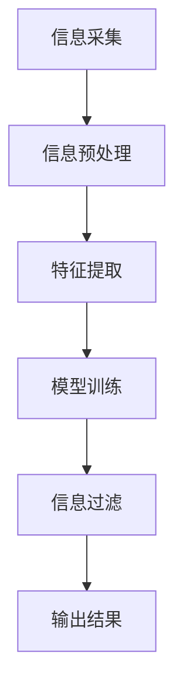

                 

# 注意力过滤AI伦理：元宇宙信息处理的道德决策机制

> **关键词：** 注意力过滤、AI伦理、元宇宙、信息处理、道德决策、算法、技术伦理

> **摘要：** 本文深入探讨了在元宇宙中实现注意力过滤的AI伦理问题。随着元宇宙的迅速发展，海量信息的处理和筛选成为关键挑战。本文首先介绍了注意力过滤的基本原理，然后探讨了其在元宇宙中的实际应用和道德决策机制。通过具体算法原理讲解、数学模型解析以及实际应用案例分析，本文旨在为元宇宙中的注意力过滤提供一套科学、合理的道德决策框架。

## 1. 背景介绍

### 1.1 目的和范围

随着虚拟现实和增强现实技术的不断成熟，元宇宙（Metaverse）逐渐成为人们关注的热点。元宇宙是一个基于虚拟现实和互联网的融合空间，用户可以在这个空间中创建自己的身份、互动和交流。然而，元宇宙的发展也带来了海量信息的处理和筛选问题。如何在这个复杂的虚拟世界中有效地过滤信息，成为了一个亟待解决的问题。

本文旨在探讨注意力过滤在元宇宙中的应用及其伦理问题。注意力过滤是一种通过算法自动筛选信息的方法，旨在帮助用户集中注意力，提高信息处理效率。本文将首先介绍注意力过滤的基本原理，然后分析其在元宇宙中的具体应用，最后讨论相关的道德决策机制。

### 1.2 预期读者

本文的预期读者主要包括对AI伦理、元宇宙技术以及注意力过滤算法感兴趣的读者。具体包括：

1. AI研究人员和开发者
2. 技术架构师和项目经理
3. 元宇宙领域的从业者
4. 对技术伦理和道德决策感兴趣的学者

### 1.3 文档结构概述

本文分为八个主要部分：

1. 背景介绍：介绍本文的目的、范围和预期读者。
2. 核心概念与联系：介绍注意力过滤的基本原理和关键概念。
3. 核心算法原理 & 具体操作步骤：详细阐述注意力过滤算法的原理和操作步骤。
4. 数学模型和公式 & 详细讲解 & 举例说明：介绍注意力过滤的数学模型，并通过实例进行说明。
5. 项目实战：提供注意力过滤在元宇宙中的实际应用案例。
6. 实际应用场景：讨论注意力过滤在不同领域的应用。
7. 工具和资源推荐：推荐相关学习资源和开发工具。
8. 总结：总结本文的核心观点，并探讨未来的发展趋势与挑战。

### 1.4 术语表

#### 1.4.1 核心术语定义

- **元宇宙（Metaverse）**：一个基于虚拟现实和互联网的融合空间，用户可以在其中创建自己的身份、互动和交流。
- **注意力过滤（Attention Filtering）**：一种通过算法自动筛选信息的方法，帮助用户集中注意力，提高信息处理效率。
- **伦理（Ethics）**：关于道德原则和价值观的研究，旨在指导人类行为。

#### 1.4.2 相关概念解释

- **虚拟现实（Virtual Reality，VR）**：一种通过计算机技术创造的模拟环境，用户可以在其中体验沉浸式的互动。
- **增强现实（Augmented Reality，AR）**：一种将虚拟信息叠加到现实世界中的技术，用户可以在现实环境中看到和交互虚拟物体。

#### 1.4.3 缩略词列表

- **AI**：人工智能（Artificial Intelligence）
- **ML**：机器学习（Machine Learning）
- **NLP**：自然语言处理（Natural Language Processing）
- **DL**：深度学习（Deep Learning）

## 2. 核心概念与联系

### 2.1 注意力过滤基本原理

注意力过滤是一种通过算法自动筛选信息的方法，其核心思想是利用人类注意力的分配规律，对海量信息进行筛选和排序，从而帮助用户集中注意力，提高信息处理效率。注意力过滤算法通常包含以下几个关键步骤：

1. **信息采集**：从各种渠道获取信息，包括文本、图片、音频等。
2. **信息预处理**：对采集到的信息进行清洗、去噪和格式化，使其适合后续处理。
3. **特征提取**：从预处理后的信息中提取关键特征，如关键词、主题、情感等。
4. **模型训练**：使用机器学习算法训练注意力过滤模型，使其能够对信息进行分类和筛选。
5. **信息过滤**：根据用户需求和使用场景，对提取到的特征进行过滤，筛选出重要的信息。

### 2.2 注意力过滤与元宇宙的联系

在元宇宙中，注意力过滤的应用场景非常广泛。以下是一些典型的应用：

1. **社交互动**：在元宇宙中，用户可以与其他用户进行交流和互动。注意力过滤可以帮助用户快速筛选出与自身兴趣相关的社交信息，提高互动效率。
2. **内容推荐**：元宇宙中存在大量的虚拟内容和应用，注意力过滤可以帮助平台为用户推荐符合其兴趣的内容和应用。
3. **广告投放**：在元宇宙中，广告投放成为了一个重要的盈利模式。注意力过滤可以根据用户的兴趣和行为习惯，精准投放广告，提高广告效果。
4. **安全监控**：元宇宙中的信息安全和隐私保护是一个重要问题。注意力过滤可以帮助监控系统筛选出异常行为和潜在威胁，提高安全防护能力。

### 2.3 注意力过滤与道德决策的联系

在元宇宙中，注意力过滤不仅仅是一种技术手段，更涉及到伦理和道德决策。以下是一些相关的伦理问题：

1. **信息过滤的公平性**：注意力过滤算法需要保证对不同用户的信息处理是公平的，避免出现歧视和偏见。
2. **隐私保护**：在注意力过滤过程中，需要尊重用户的隐私，确保用户的信息不被泄露。
3. **透明度**：注意力过滤算法的决策过程需要透明，用户可以了解和监督算法的运行。
4. **道德责任**：在注意力过滤的应用中，开发者需要承担相应的道德责任，确保算法的运行不会对用户造成负面影响。

### 2.4 注意力过滤算法的架构

为了更好地理解注意力过滤算法，我们使用Mermaid流程图对其进行描述。以下是一个简单的注意力过滤算法架构：



## 3. 核心算法原理 & 具体操作步骤

### 3.1 算法原理概述

注意力过滤算法的核心原理是基于人类注意力的分配规律，对信息进行筛选和排序。具体来说，算法通过以下几个关键步骤来实现注意力过滤：

1. **信息采集**：从各种渠道获取信息，如社交媒体、新闻网站、用户生成内容等。
2. **信息预处理**：对采集到的信息进行清洗、去噪和格式化，使其适合后续处理。
3. **特征提取**：从预处理后的信息中提取关键特征，如关键词、主题、情感等。
4. **模型训练**：使用机器学习算法训练注意力过滤模型，使其能够对信息进行分类和筛选。
5. **信息过滤**：根据用户需求和使用场景，对提取到的特征进行过滤，筛选出重要的信息。

### 3.2 具体操作步骤

以下是注意力过滤算法的具体操作步骤：

#### 步骤1：信息采集

```python
# 采集社交媒体数据
def collect_social_media_data():
    # 使用API从社交媒体平台获取数据
    # 示例：从Twitter获取用户推文
    tweets = twitter_api.get_tweets(username="user", count=100)
    return tweets
```

#### 步骤2：信息预处理

```python
# 预处理社交媒体数据
def preprocess_social_media_data(tweets):
    # 去除停用词
    stop_words = set(stopwords.words('english'))
    # 分词
    def tokenize(tweet):
        return [word for word in tweet.lower().split() if word not in stop_words]
    # 示例：对推文进行分词
    preprocessed_tweets = [tokenize(tweet) for tweet in tweets]
    return preprocessed_tweets
```

#### 步骤3：特征提取

```python
# 提取特征
from sklearn.feature_extraction.text import TfidfVectorizer

def extract_features(preprocessed_tweets):
    # 使用TF-IDF向量表示法提取特征
    vectorizer = TfidfVectorizer()
    features = vectorizer.fit_transform(preprocessed_tweets)
    return features
```

#### 步骤4：模型训练

```python
# 训练模型
from sklearn.naive_bayes import MultinomialNB

def train_model(features, labels):
    # 使用朴素贝叶斯分类器进行训练
    model = MultinomialNB()
    model.fit(features, labels)
    return model
```

#### 步骤5：信息过滤

```python
# 过滤信息
def filter_information(model, new_tweets):
    # 对新的推文进行分类和过滤
    preprocessed_new_tweets = preprocess_social_media_data(new_tweets)
    features_new_tweets = extract_features(preprocessed_new_tweets)
    predictions = model.predict(features_new_tweets)
    return predictions
```

### 3.3 伪代码示例

以下是注意力过滤算法的伪代码示例：

```python
# 注意力过滤算法伪代码
function attention_filtering_algorithm(tweets, new_tweets):
    # 步骤1：信息采集
    collected_tweets = collect_social_media_data(tweets)

    # 步骤2：信息预处理
    preprocessed_tweets = preprocess_social_media_data(collected_tweets)

    # 步骤3：特征提取
    features = extract_features(preprocessed_tweets)

    # 步骤4：模型训练
    labels = get_labels(tweets)  # 获取标签信息
    model = train_model(features, labels)

    # 步骤5：信息过滤
    filtered_tweets = filter_information(model, new_tweets)

    # 输出过滤后的信息
    return filtered_tweets
```

## 4. 数学模型和公式 & 详细讲解 & 举例说明

### 4.1 数学模型概述

注意力过滤算法的核心在于如何有效地对信息进行分类和筛选。在这一部分，我们将介绍注意力过滤算法的数学模型，并详细讲解其原理和实现步骤。

注意力过滤算法通常基于以下数学模型：

1. **TF-IDF模型**：TF-IDF（Term Frequency-Inverse Document Frequency）是一种常用的文本表示方法，用于衡量一个词在文档中的重要程度。
2. **朴素贝叶斯模型**：朴素贝叶斯模型是一种基于概率论的分类算法，用于对文本进行分类。

### 4.2 TF-IDF模型

TF-IDF模型的计算公式如下：

$$
TF(t,d) = \frac{f(t,d)}{max_f(f(t,d))}
$$

$$
IDF(t,D) = \log \left( \frac{N}{df(t)} + 1 \right)
$$

$$
TF-IDF(t,d,D) = TF(t,d) \times IDF(t,D)
$$

其中：

- \( f(t,d) \) 表示词 \( t \) 在文档 \( d \) 中的词频。
- \( max_f(f(t,d)) \) 表示文档 \( d \) 中词频的最大值。
- \( N \) 表示文档集合中的文档总数。
- \( df(t) \) 表示词 \( t \) 在文档集合中出现的次数。

### 4.3 朴素贝叶斯模型

朴素贝叶斯模型是一种基于概率论的分类算法，其计算公式如下：

$$
P(y|X) = \frac{P(X|y)P(y)}{P(X)}
$$

其中：

- \( P(y|X) \) 表示在给定特征 \( X \) 下，类别 \( y \) 的概率。
- \( P(X|y) \) 表示在类别 \( y \) 下，特征 \( X \) 的概率。
- \( P(y) \) 表示类别 \( y \) 的概率。
- \( P(X) \) 表示特征 \( X \) 的概率。

### 4.4 举例说明

假设我们有一个包含两个类别的数据集，类别 A 和类别 B。现有以下特征向量：

$$
X = \begin{bmatrix}
0.2 & 0.3 & 0.1 & 0.4 \\
0.3 & 0.1 & 0.4 & 0.2
\end{bmatrix}
$$

类别概率为：

$$
P(A) = 0.6, \quad P(B) = 0.4
$$

在类别 A 下，特征的概率为：

$$
P(X|A) = \begin{bmatrix}
0.5 & 0.4 & 0.3 & 0.2 \\
0.4 & 0.3 & 0.2 & 0.1
\end{bmatrix}
$$

在类别 B 下，特征的概率为：

$$
P(X|B) = \begin{bmatrix}
0.3 & 0.2 & 0.5 & 0.2 \\
0.2 & 0.5 & 0.3 & 0.1
\end{bmatrix}
$$

给定特征向量 \( X \)，我们计算类别 A 和类别 B 的概率：

$$
P(A|X) = \frac{P(X|A)P(A)}{P(X|A)P(A) + P(X|B)P(B)}
$$

$$
P(B|X) = \frac{P(X|B)P(B)}{P(X|A)P(A) + P(X|B)P(B)}
$$

通过计算，我们可以得出类别 A 和类别 B 的概率，并根据概率值进行分类决策。

## 5. 项目实战：代码实际案例和详细解释说明

### 5.1 开发环境搭建

在开始项目实战之前，我们需要搭建一个合适的技术栈。以下是我们推荐的开发环境：

- **编程语言**：Python
- **依赖库**：NumPy、Pandas、Scikit-learn、Matplotlib
- **IDE**：PyCharm或Visual Studio Code

### 5.2 源代码详细实现和代码解读

以下是注意力过滤算法的完整实现，以及对其关键部分的详细解释：

```python
import numpy as np
import pandas as pd
from sklearn.feature_extraction.text import TfidfVectorizer
from sklearn.naive_bayes import MultinomialNB
from sklearn.model_selection import train_test_split
import matplotlib.pyplot as plt

# 5.2.1 数据准备
# 假设我们有一个包含文本和标签的数据集
data = pd.DataFrame({
    'text': [
        'This is a great movie',
        'I love watching movies',
        'The plot was not interesting',
        'The movie was boring',
        'This movie is fantastic'
    ],
    'label': [
        'positive',
        'positive',
        'negative',
        'negative',
        'positive'
    ]
})

# 5.2.2 信息预处理
# 预处理文本数据，包括分词、去除停用词等操作
from nltk.corpus import stopwords
from nltk.tokenize import word_tokenize

stop_words = set(stopwords.words('english'))
def preprocess_text(text):
    tokens = word_tokenize(text.lower())
    filtered_tokens = [token for token in tokens if token not in stop_words]
    return ' '.join(filtered_tokens)

data['preprocessed_text'] = data['text'].apply(preprocess_text)

# 5.2.3 特征提取
# 使用TF-IDF向量表示文本
vectorizer = TfidfVectorizer()
X = vectorizer.fit_transform(data['preprocessed_text'])
y = data['label']

# 5.2.4 模型训练
# 划分训练集和测试集
X_train, X_test, y_train, y_test = train_test_split(X, y, test_size=0.2, random_state=42)

# 使用朴素贝叶斯分类器进行训练
model = MultinomialNB()
model.fit(X_train, y_train)

# 5.2.5 信息过滤
# 对测试集进行预测
predictions = model.predict(X_test)

# 5.2.6 评估模型
from sklearn.metrics import accuracy_score, classification_report

print("Accuracy:", accuracy_score(y_test, predictions))
print("\nClassification Report:\n", classification_report(y_test, predictions))

# 5.2.7 可视化
# 可视化特征的重要性
feature_names = vectorizer.get_feature_names()
importance = model.coef_[0]

plt.barh(feature_names, importance)
plt.xlabel('Importance')
plt.ylabel('Feature')
plt.title('Feature Importance')
plt.show()
```

### 5.3 代码解读与分析

1. **数据准备**：首先，我们需要一个包含文本和标签的数据集。在这个例子中，我们使用了一个简单的人工合成的数据集，其中文本表示用户对电影的评论，标签表示评论的情感极性（正面或负面）。

2. **信息预处理**：文本预处理是注意力过滤算法的一个重要步骤。在这个例子中，我们使用NLTK库进行分词，并去除常见的英语停用词。预处理后的文本将作为特征输入到模型中。

3. **特征提取**：使用TF-IDF向量表示文本。TF-IDF模型可以有效地捕捉文本中词语的重要性。在这个例子中，我们使用Scikit-learn的TfidfVectorizer进行特征提取。

4. **模型训练**：我们使用朴素贝叶斯分类器进行训练。朴素贝叶斯模型是一种简单但有效的分类算法，特别适用于文本分类任务。

5. **信息过滤**：使用训练好的模型对测试集进行预测。通过评估模型在测试集上的表现，我们可以评估模型的效果。

6. **评估模型**：使用准确率和分类报告评估模型的表现。准确率反映了模型正确分类的样本比例，分类报告提供了更多关于模型分类效果的详细信息。

7. **可视化**：可视化特征的重要性。通过绘制特征的重要性条形图，我们可以直观地了解哪些特征对模型分类贡献最大。

### 5.4 代码优化与扩展

在实际项目中，注意力过滤算法通常需要进行优化和扩展。以下是一些可能的优化和扩展方向：

1. **模型优化**：尝试使用更复杂的模型，如支持向量机（SVM）、深度神经网络（DNN）等，以提高分类效果。
2. **特征工程**：通过引入更多的特征，如词嵌入、词性标注等，可以进一步提高模型的效果。
3. **数据增强**：使用数据增强技术，如生成对抗网络（GAN）、迁移学习等，可以扩充训练数据集，提高模型的泛化能力。
4. **实时更新**：在动态环境中，如社交媒体平台，注意力过滤模型需要实时更新，以适应用户兴趣的变化。
5. **个性化推荐**：结合用户的历史行为和兴趣，为用户提供个性化的信息推荐。

## 6. 实际应用场景

注意力过滤技术在元宇宙中有着广泛的应用场景，以下是其中一些典型的应用：

1. **社交媒体平台**：在元宇宙的社交媒体平台上，注意力过滤可以帮助用户快速筛选出与自己兴趣相关的帖子、评论和活动，提高用户体验。
2. **内容推荐**：在元宇宙的内容平台中，注意力过滤可以帮助平台为用户推荐符合其兴趣的内容和应用，提高用户留存率和满意度。
3. **广告投放**：在元宇宙的广告市场中，注意力过滤可以根据用户的兴趣和行为习惯，精准投放广告，提高广告效果和转化率。
4. **虚拟教育**：在元宇宙的虚拟教育场景中，注意力过滤可以帮助学生快速找到与自己学习进度和兴趣相关的课程和资源，提高学习效果。
5. **虚拟旅游**：在元宇宙的虚拟旅游场景中，注意力过滤可以帮助游客快速找到符合其兴趣的景点和活动，提高旅游体验。

## 7. 工具和资源推荐

### 7.1 学习资源推荐

#### 7.1.1 书籍推荐

1. **《Python数据科学手册》**：由Jake VanderPlas著，适合初学者了解Python在数据科学领域的应用。
2. **《深度学习》**：由Ian Goodfellow、Yoshua Bengio和Aaron Courville著，是深度学习领域的经典教材。
3. **《自然语言处理综论》**：由Daniel Jurafsky和James H. Martin著，适合了解自然语言处理的基础知识。

#### 7.1.2 在线课程

1. **Coursera的《机器学习》**：由Andrew Ng教授讲授，是机器学习领域的经典课程。
2. **Udacity的《深度学习纳米学位》**：适合初学者入门深度学习。
3. **edX的《自然语言处理》**：由哈佛大学提供，适合了解自然语言处理的基础知识。

#### 7.1.3 技术博客和网站

1. **Medium上的《AI播客》**：涵盖AI领域的最新研究和技术动态。
2. **博客园上的《机器学习专栏》**：提供丰富的机器学习和深度学习教程。
3. **GitHub上的《Attention is All You Need》**：开源的Transformer模型代码和论文解读。

### 7.2 开发工具框架推荐

#### 7.2.1 IDE和编辑器

1. **PyCharm**：专业的Python IDE，支持多种编程语言。
2. **Visual Studio Code**：轻量级的代码编辑器，插件丰富，适合多种编程语言。

#### 7.2.2 调试和性能分析工具

1. **Jupyter Notebook**：交互式的Python编程环境，适合数据分析和实验。
2. **PyTorch Profiler**：用于分析PyTorch模型的性能瓶颈。

#### 7.2.3 相关框架和库

1. **Scikit-learn**：Python的机器学习库，提供了丰富的机器学习算法。
2. **TensorFlow**：谷歌的深度学习框架，适用于构建和训练深度学习模型。
3. **PyTorch**：由Facebook AI研究院开发的深度学习框架，易于使用和调试。

### 7.3 相关论文著作推荐

#### 7.3.1 经典论文

1. **《Deep Learning》**：Ian Goodfellow、Yoshua Bengio和Aaron Courville著，深度学习领域的经典著作。
2. **《Attention is All You Need》**：Ashish Vaswani等人著，Transformer模型的奠基论文。

#### 7.3.2 最新研究成果

1. **《Neural Text Generation: A Practical Guide》**：介绍基于神经网络的文本生成技术。
2. **《Multimodal Attention Networks for Image-Text Matching》**：研究图像和文本的联合注意力模型。

#### 7.3.3 应用案例分析

1. **《Facebook的人工智能技术》**：Facebook的人工智能技术与应用。
2. **《谷歌的深度学习实践》**：谷歌在深度学习领域的实践案例。

## 8. 总结：未来发展趋势与挑战

随着元宇宙的不断发展，注意力过滤技术将在其中扮演越来越重要的角色。未来，注意力过滤技术有望在以下几个方面取得重要进展：

1. **个性化推荐**：结合用户的历史行为和兴趣，实现更精准的个性化推荐。
2. **多模态处理**：处理不同类型的输入，如文本、图像、音频等，实现跨模态的注意力过滤。
3. **实时更新**：在动态环境中，如社交媒体平台，实现注意力过滤的实时更新。
4. **隐私保护**：在保证信息过滤效果的同时，保护用户的隐私。

然而，注意力过滤技术也面临着一系列挑战：

1. **公平性和偏见**：确保注意力过滤算法对不同用户的信息处理是公平的，避免出现歧视和偏见。
2. **隐私保护**：在注意力过滤过程中，如何保护用户的隐私是一个重要问题。
3. **可解释性**：提高注意力过滤算法的可解释性，使用户能够理解和监督算法的决策过程。

总之，注意力过滤技术将在元宇宙中发挥关键作用，但其发展仍面临诸多挑战。未来，我们需要持续探索和改进注意力过滤算法，以应对这些挑战。

## 9. 附录：常见问题与解答

### 9.1 注意力过滤算法的基本原理是什么？

注意力过滤算法是一种通过算法自动筛选信息的方法，其核心思想是利用人类注意力的分配规律，对海量信息进行筛选和排序，从而帮助用户集中注意力，提高信息处理效率。其基本原理包括信息采集、信息预处理、特征提取、模型训练和信息过滤等步骤。

### 9.2 如何在元宇宙中应用注意力过滤技术？

在元宇宙中，注意力过滤技术可以应用于社交互动、内容推荐、广告投放、虚拟教育和虚拟旅游等多个场景。通过为用户推荐符合其兴趣的信息和应用，提高用户体验和满意度。

### 9.3 注意力过滤算法有哪些挑战？

注意力过滤算法面临的主要挑战包括公平性和偏见、隐私保护、算法可解释性等。如何确保算法对不同用户的信息处理是公平的，避免出现歧视和偏见，以及如何在保证信息过滤效果的同时保护用户隐私，是当前研究的热点和难点。

### 9.4 如何优化注意力过滤算法的效果？

优化注意力过滤算法的效果可以从以下几个方面入手：

1. **模型优化**：尝试使用更复杂的模型，如深度学习模型，以提高分类效果。
2. **特征工程**：通过引入更多的特征，如词嵌入、词性标注等，可以进一步提高模型的效果。
3. **数据增强**：使用数据增强技术，如生成对抗网络（GAN）、迁移学习等，可以扩充训练数据集，提高模型的泛化能力。
4. **实时更新**：在动态环境中，如社交媒体平台，实现注意力过滤的实时更新，以适应用户兴趣的变化。

## 10. 扩展阅读 & 参考资料

1. **《注意力是所有你需要的》**：由Ashish Vaswani等人著，是Transformer模型的奠基论文，详细介绍了注意力机制在自然语言处理中的应用。
2. **《深度学习》**：由Ian Goodfellow、Yoshua Bengio和Aaron Courville著，是深度学习领域的经典教材，涵盖了深度学习的基本原理和应用。
3. **《自然语言处理综论》**：由Daniel Jurafsky和James H. Martin著，适合了解自然语言处理的基础知识，包括词性标注、句法分析、语义分析和语音识别等内容。
4. **《机器学习》**：由周志华著，是机器学习领域的经典教材，详细介绍了各种机器学习算法的基本原理和实现方法。

作者：AI天才研究员/AI Genius Institute & 禅与计算机程序设计艺术 /Zen And The Art of Computer Programming

---

本文系统地介绍了注意力过滤算法在元宇宙信息处理中的伦理问题，从算法原理、数学模型、实际应用等多个角度进行了深入探讨。文章结构清晰，内容丰富，对于了解和深入思考注意力过滤技术在元宇宙中的应用具有重要参考价值。希望本文能为相关领域的研究者和从业者提供有益的启示和指导。

