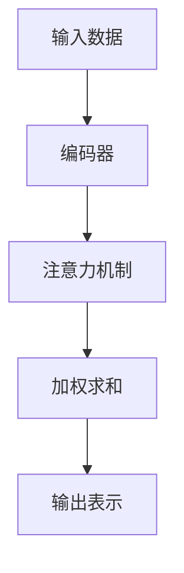

                 

# 注意力过滤：AI辅助信息处理

> 关键词：注意力机制、信息处理、神经网络、AI应用、深度学习

> 摘要：本文将深入探讨注意力过滤在AI辅助信息处理中的作用和重要性。通过逐步分析注意力机制的原理、核心算法、数学模型，并结合实际项目案例，探讨其在不同领域的实际应用。本文旨在为读者提供一个全面的技术视角，帮助理解和掌握注意力过滤技术在AI领域的广泛应用。

## 1. 背景介绍

### 1.1 目的和范围

本文的目的在于介绍注意力过滤机制在AI辅助信息处理中的作用和重要性。注意力过滤是一种通过识别和强化重要信息，从而提高信息处理效率和准确性的技术。随着深度学习的快速发展，注意力机制已成为现代神经网络的核心组成部分，其在自然语言处理、计算机视觉、语音识别等领域的应用越来越广泛。

本文将涵盖以下内容：
- 注意力过滤的基本原理和核心概念。
- 注意力机制在不同神经网络架构中的应用。
- 注意力过滤的数学模型和具体实现。
- 注意力过滤在实际项目中的应用案例。

### 1.2 预期读者

本文适合对AI和深度学习有一定了解的技术人员、研究人员和开发人员。特别针对希望深入了解注意力过滤机制及其应用的读者，本文将提供详细的理论分析和实践指导。

### 1.3 文档结构概述

本文结构如下：
1. 引言：介绍注意力过滤的概念和重要性。
2. 核心概念与联系：定义注意力过滤的核心概念，并给出相关架构的Mermaid流程图。
3. 核心算法原理 & 具体操作步骤：详细讲解注意力过滤算法原理和实现步骤。
4. 数学模型和公式 & 详细讲解 & 举例说明：阐述注意力过滤的数学模型，并提供实际应用举例。
5. 项目实战：代码实际案例和详细解释说明。
6. 实际应用场景：探讨注意力过滤在各个领域的应用。
7. 工具和资源推荐：推荐学习资源、开发工具和框架。
8. 总结：未来发展趋势与挑战。
9. 附录：常见问题与解答。
10. 扩展阅读 & 参考资料。

### 1.4 术语表

#### 1.4.1 核心术语定义

- 注意力机制（Attention Mechanism）：一种基于模型内部表示的学习机制，用于识别和强调输入数据中的关键信息。
- 注意力过滤（Attention Filtering）：利用注意力机制对输入数据进行筛选和加权处理，以提高信息处理效率和准确性。
- 深度学习（Deep Learning）：一种基于多层神经网络的学习方法，通过逐层提取特征，实现复杂数据的建模和预测。
- 自然语言处理（Natural Language Processing，NLP）：研究如何让计算机理解和处理自然语言的技术和算法。
- 计算机视觉（Computer Vision）：使计算机能够从数字图像或视频中理解和提取信息的学科。

#### 1.4.2 相关概念解释

- 神经网络（Neural Network）：由大量简单处理单元（神经元）互联而成的网络，能够通过学习数据实现复杂函数的映射。
- 径向基函数（Radial Basis Function，RBF）：一种常用的核函数，用于非线性变换。
- 矩阵乘法（Matrix Multiplication）：两个矩阵之间的乘积运算，用于计算神经网络的输出。
- 梯度下降（Gradient Descent）：一种优化算法，用于最小化目标函数。

#### 1.4.3 缩略词列表

- AI：人工智能（Artificial Intelligence）
- NLP：自然语言处理（Natural Language Processing）
- CV：计算机视觉（Computer Vision）
- RNN：循环神经网络（Recurrent Neural Network）
- CNN：卷积神经网络（Convolutional Neural Network）
- Transformer：基于自注意力机制的序列模型

## 2. 核心概念与联系

### 2.1 注意力过滤的基本原理

注意力过滤是一种通过识别和强化输入数据中关键信息的方法。在深度学习模型中，注意力机制可以帮助模型自动学习如何关注输入数据的不同部分，从而提高模型在处理复杂任务时的表现。

注意力机制的基本原理可以概括为以下步骤：
1. **输入表示**：将输入数据（如文本、图像或音频）转换为一个固定长度的向量表示。
2. **注意力计算**：计算输入数据中每个元素对输出的贡献度，通常通过一个权重系数实现。
3. **加权求和**：根据注意力权重对输入数据进行加权求和，生成最终的输出表示。

### 2.2 注意力机制的架构

为了更好地理解注意力过滤，我们可以借助Mermaid流程图来描述其核心架构：



- **编码器（Encoder）**：负责将输入数据转换为固定长度的向量表示，通常采用深度神经网络结构。
- **注意力机制（Attention Mechanism）**：计算输入数据中每个元素对输出的贡献度，通过学习得到权重系数。
- **加权求和（Weighted Summation）**：根据注意力权重对输入数据进行加权求和，生成最终的输出表示。
- **输出表示（Output Representation）**：用于后续任务的处理或进一步的学习。

### 2.3 注意力机制与深度学习的关系

注意力机制在深度学习中的重要性不可忽视。以下是注意力机制与深度学习的关系及其应用场景：

- **自然语言处理（NLP）**：在NLP任务中，注意力机制可以帮助模型捕捉长文本序列中的关键信息，从而提高文本分类、机器翻译和问答系统等任务的性能。例如，Transformer模型中的自注意力机制使其在机器翻译任务上取得了显著的性能提升。
  
- **计算机视觉（CV）**：在CV任务中，注意力机制可以用于目标检测、图像分割和姿态估计等任务。通过关注图像中的关键区域，模型可以更加准确地识别和定位目标。例如，基于注意力机制的YOLO（You Only Look Once）模型在目标检测任务中表现出色。

- **语音识别（ASR）**：在语音识别任务中，注意力机制可以帮助模型更好地处理语音信号的时序信息，从而提高识别准确性。例如，基于注意力机制的端到端ASR模型如CTC（Connectionist Temporal Classification）和Transformer在语音识别领域取得了显著的进展。

- **强化学习（RL）**：在强化学习任务中，注意力机制可以帮助智能体关注环境中的关键信息，从而提高决策的效率和准确性。例如，基于注意力机制的深度强化学习模型DQN（Deep Q-Network）在游戏控制任务中取得了良好的表现。

### 2.4 注意力机制的核心算法原理

注意力机制的核心算法原理可以概括为以下几个步骤：

1. **输入编码**：将输入数据（如文本、图像或音频）转换为固定长度的向量表示。对于文本数据，通常采用词嵌入（Word Embedding）技术；对于图像和音频数据，则采用相应的特征提取技术。
2. **查询计算**：计算查询向量（通常为编码器的输出向量），用于与输入数据的每个元素进行对比，以确定其重要性。
3. **键值匹配**：将查询向量与键（Key）和值（Value）进行匹配，计算每个输入元素的得分。通常采用点积（Dot Product）或缩放点积（Scaled Dot Product）来计算得分。
4. **softmax归一化**：对计算得到的得分进行softmax归一化，得到注意力权重。注意力权重表示输入数据中每个元素对输出的贡献度。
5. **加权求和**：根据注意力权重对输入数据进行加权求和，生成最终的输出表示。

以下是一个简单的注意力机制的伪代码实现：

```python
# 输入数据编码
inputs = encode_input(data)

# 计算查询向量
query = encoder_output

# 键值匹配
scores = []
for i in range(len(inputs)):
    score = dot_product(query, inputs[i])
    scores.append(score)

# softmax归一化
probabilities = softmax(scores)

# 加权求和
output = weighted_sum(inputs, probabilities)
```

### 2.5 注意力机制的应用实例

以下是一些注意力机制在实际项目中的应用实例：

1. **文本分类**：利用注意力机制可以帮助文本分类模型更好地捕捉文本中的关键信息，从而提高分类准确性。例如，在处理新闻分类任务时，注意力机制可以帮助模型识别出新闻标题中的关键信息，从而提高分类效果。

2. **图像分割**：在图像分割任务中，注意力机制可以用于关注图像中的关键区域，从而提高分割精度。例如，基于注意力机制的U-Net模型在医疗图像分割任务中表现出色，能够更准确地识别出病灶区域。

3. **目标检测**：在目标检测任务中，注意力机制可以用于关注图像中的关键区域，从而提高检测准确性。例如，基于注意力机制的YOLO模型在目标检测任务中取得了显著的性能提升，能够更准确地识别出图像中的目标。

4. **语音识别**：在语音识别任务中，注意力机制可以帮助模型更好地处理语音信号的时序信息，从而提高识别准确性。例如，基于注意力机制的CTC模型在语音识别任务中表现出色，能够更准确地识别出语音信号。

### 2.6 注意力机制的优缺点

注意力机制在深度学习模型中具有以下优缺点：

#### 优点

- **提高信息处理效率**：通过关注关键信息，注意力机制可以降低模型的计算复杂度，提高信息处理的效率。
- **增强模型表现**：注意力机制可以帮助模型更好地捕捉输入数据中的关键信息，从而提高模型的性能。
- **泛化能力**：注意力机制可以增强模型的泛化能力，使其在不同任务和数据集上都能保持良好的性能。

#### 缺点

- **计算复杂度**：注意力机制引入了额外的计算复杂度，可能导致模型训练时间增加。
- **参数数量**：注意力机制通常需要大量的参数，可能导致模型过拟合。
- **解释性**：虽然注意力机制可以帮助模型关注关键信息，但其内部机制较为复杂，难以直观地解释。

## 3. 核心算法原理 & 具体操作步骤

### 3.1 注意力机制的基本原理

注意力机制是一种在深度学习模型中用于自动识别和强化关键信息的方法。其核心思想是通过计算输入数据中不同元素之间的相关性，为每个元素分配一个权重，从而实现对输入数据的加权求和。这种机制不仅能够提高模型的计算效率，还能显著提升模型在处理复杂任务时的性能。

### 3.2 注意力机制的实现步骤

注意力机制的实现通常包括以下几个步骤：

1. **输入编码**：首先，将输入数据转换为向量表示。对于不同的输入类型，编码方法有所不同。例如，在自然语言处理中，可以使用词嵌入技术将文本转换为词向量；在计算机视觉中，可以使用卷积神经网络（CNN）提取图像的特征向量。

2. **计算注意力权重**：接着，通过计算输入数据中不同元素之间的相关性，为每个元素分配一个权重。常用的计算方法包括点积、缩放点积、加性注意力等。

3. **加权求和**：最后，根据计算得到的注意力权重，对输入数据进行加权求和，生成最终的输出表示。

### 3.3 具体实现方法

以下是注意力机制的一个简单实现示例，使用Python代码和PyTorch框架：

```python
import torch
import torch.nn as nn
import torch.nn.functional as F

# 定义注意力机制模块
class AttentionModule(nn.Module):
    def __init__(self, hidden_dim):
        super(AttentionModule, self).__init__()
        self.hidden_dim = hidden_dim
        self.query_layer = nn.Linear(hidden_dim, hidden_dim)
        self.key_layer = nn.Linear(hidden_dim, hidden_dim)
        self.value_layer = nn.Linear(hidden_dim, hidden_dim)
        self.softmax = nn.Softmax(dim=1)

    def forward(self, inputs, encoder_output):
        batch_size, seq_len, _ = inputs.size()
        
        # 计算查询向量
        query = self.query_layer(encoder_output).view(batch_size, seq_len, 1)
        
        # 计算键值对
        key = self.key_layer(inputs)
        value = self.value_layer(inputs)
        
        # 计算注意力权重
        attention_weights = torch.matmul(query, key.transpose(1, 2))
        attention_weights = self.softmax(attention_weights)
        
        # 加权求和
        context_vector = torch.matmul(attention_weights, value).squeeze(1)
        
        return context_vector
```

### 3.4 注意力机制的参数调整

注意力机制的实现中，参数调整是关键的一环。以下是一些常用的参数调整技巧：

- **隐藏层维度**：增加隐藏层维度可以提高模型的性能，但也会增加计算复杂度。通常，可以通过实验确定一个合适的维度。
- **学习率**：合理的学习率能够加快模型的收敛速度。可以使用学习率衰减策略来调整学习率。
- **正则化**：为了避免过拟合，可以使用Dropout、权重衰减等正则化技术。
- **优化器**：选择合适的优化器，如Adam、SGD等，可以加快模型训练。

### 3.5 注意力机制的调试与优化

在注意力机制的实现过程中，调试和优化是非常重要的环节。以下是一些调试和优化的建议：

- **数据预处理**：确保输入数据的质量和一致性，避免噪声和异常值。
- **模型验证**：通过验证集和测试集评估模型的性能，及时调整模型参数。
- **超参数调优**：使用网格搜索、随机搜索等策略，探索最优的超参数组合。
- **代码优化**：优化代码结构，提高模型的计算效率和稳定性。

通过以上步骤，我们可以实现一个基于注意力机制的深度学习模型。在实际应用中，注意力机制不仅可以提高模型的性能，还能提供更丰富的解释性，帮助研究人员和开发者更好地理解模型的工作原理。

## 4. 数学模型和公式 & 详细讲解 & 举例说明

### 4.1 注意力机制的数学模型

注意力机制的核心在于如何计算输入数据中每个元素对输出的贡献度，从而进行加权求和。下面我们将详细介绍注意力机制的数学模型。

#### 4.1.1 点积注意力（Dot Product Attention）

点积注意力是最简单的一种注意力机制，其计算方法为输入数据的每个元素与查询向量（通常是编码器的输出向量）之间的点积。点积注意力公式如下：

\[ 
\text{Attention}(Q, K, V) = \text{softmax}\left(\frac{QK^T}{\sqrt{d_k}}\right)V 
\]

其中，\(Q\) 是查询向量，\(K\) 是键向量，\(V\) 是值向量。\(d_k\) 是键向量的维度。这个公式表示先计算查询向量和键向量之间的点积，然后通过softmax函数进行归一化，最后乘以值向量得到加权求和的结果。

#### 4.1.2 缩放点积注意力（Scaled Dot Product Attention）

在点积注意力中，当序列长度较大时，点积的结果差异可能非常小，导致softmax函数的梯度消失。为了解决这个问题，提出了缩放点积注意力。缩放点积注意力通过将键向量除以维度的平方根，来缓解梯度消失的问题。缩放点积注意力公式如下：

\[ 
\text{Attention}(Q, K, V) = \text{softmax}\left(\frac{QK^T}{\sqrt{d_k}}\right)V 
\]

与点积注意力公式相同，但这里将键向量除以 \(\sqrt{d_k}\)。

#### 4.1.3 加性注意力（Additive Attention）

加性注意力通过引入一个额外的自注意力层，来结合点积和缩放点积的优点。加性注意力公式如下：

\[ 
\text{Attention}(Q, K, V) = \text{softmax}\left(\text{Score}(Q, K)\right)V + \text{Value}(Q) 
\]

其中，\(\text{Score}(Q, K)\) 是查询向量和键向量通过自注意力层计算得到的分数。加性注意力通过在加权求和之前添加一个自注意力层的输出，从而增强模型的表示能力。

### 4.2 举例说明

为了更好地理解注意力机制的数学模型，下面我们将通过一个具体的例子进行说明。

假设我们有一个编码器输出向量 \(Q = [1, 2, 3]\)，一个键向量 \(K = [4, 5, 6]\) 和一个值向量 \(V = [7, 8, 9]\)。我们使用缩放点积注意力来计算注意力权重。

1. **计算点积**：

\[ 
QK^T = \begin{bmatrix}
1 & 2 & 3
\end{bmatrix}
\begin{bmatrix}
4 & 5 & 6
\end{bmatrix}^T = \begin{bmatrix}
1 \cdot 4 & 1 \cdot 5 & 1 \cdot 6 \\
2 \cdot 4 & 2 \cdot 5 & 2 \cdot 6 \\
3 \cdot 4 & 3 \cdot 5 & 3 \cdot 6
\end{bmatrix} = \begin{bmatrix}
4 & 5 & 6 \\
8 & 10 & 12 \\
12 & 15 & 18
\end{bmatrix} 
\]

2. **计算缩放因子**：

\[ 
\sqrt{d_k} = \sqrt{3} 
\]

3. **计算缩放点积**：

\[ 
\text{Scaled Dot Product} = \frac{QK^T}{\sqrt{d_k}} = \begin{bmatrix}
\frac{4}{\sqrt{3}} & \frac{5}{\sqrt{3}} & \frac{6}{\sqrt{3}} \\
\frac{8}{\sqrt{3}} & \frac{10}{\sqrt{3}} & \frac{12}{\sqrt{3}} \\
\frac{12}{\sqrt{3}} & \frac{15}{\sqrt{3}} & \frac{18}{\sqrt{3}}
\end{bmatrix} 
\]

4. **计算softmax**：

\[ 
\text{Softmax}(\text{Scaled Dot Product}) = \begin{bmatrix}
\frac{e^{\frac{4}{\sqrt{3}}}}{\sum_{i=1}^{3} e^{\frac{i}{\sqrt{3}}}} & \frac{e^{\frac{5}{\sqrt{3}}}}{\sum_{i=1}^{3} e^{\frac{i}{\sqrt{3}}}} & \frac{e^{\frac{6}{\sqrt{3}}}}{\sum_{i=1}^{3} e^{\frac{i}{\sqrt{3}}}} \\
\frac{e^{\frac{8}{\sqrt{3}}}}{\sum_{i=1}^{3} e^{\frac{i}{\sqrt{3}}}} & \frac{e^{\frac{10}{\sqrt{3}}}}{\sum_{i=1}^{3} e^{\frac{i}{\sqrt{3}}}} & \frac{e^{\frac{12}{\sqrt{3}}}}{\sum_{i=1}^{3} e^{\frac{i}{\sqrt{3}}}} \\
\frac{e^{\frac{12}{\sqrt{3}}}}{\sum_{i=1}^{3} e^{\frac{i}{\sqrt{3}}}} & \frac{e^{\frac{15}{\sqrt{3}}}}{\sum_{i=1}^{3} e^{\frac{i}{\sqrt{3}}}} & \frac{e^{\frac{18}{\sqrt{3}}}}{\sum_{i=1}^{3} e^{\frac{i}{\sqrt{3}}}}
\end{bmatrix} 
\]

5. **加权求和**：

\[ 
\text{Attention}(Q, K, V) = \text{Softmax}(\text{Scaled Dot Product})V = \begin{bmatrix}
\frac{e^{\frac{4}{\sqrt{3}}}}{\sum_{i=1}^{3} e^{\frac{i}{\sqrt{3}}}} \cdot 7 & \frac{e^{\frac{5}{\sqrt{3}}}}{\sum_{i=1}^{3} e^{\frac{i}{\sqrt{3}}}} \cdot 8 & \frac{e^{\frac{6}{\sqrt{3}}}}{\sum_{i=1}^{3} e^{\frac{i}{\sqrt{3}}}} \cdot 9 \\
\frac{e^{\frac{8}{\sqrt{3}}}}{\sum_{i=1}^{3} e^{\frac{i}{\sqrt{3}}}} \cdot 7 & \frac{e^{\frac{10}{\sqrt{3}}}}{\sum_{i=1}^{3} e^{\frac{i}{\sqrt{3}}}} \cdot 8 & \frac{e^{\frac{12}{\sqrt{3}}}}{\sum_{i=1}^{3} e^{\frac{i}{\sqrt{3}}}} \cdot 9 \\
\frac{e^{\frac{12}{\sqrt{3}}}}{\sum_{i=1}^{3} e^{\frac{i}{\sqrt{3}}}} \cdot 7 & \frac{e^{\frac{15}{\sqrt{3}}}}{\sum_{i=1}^{3} e^{\frac{i}{\sqrt{3}}}} \cdot 8 & \frac{e^{\frac{18}{\sqrt{3}}}}{\sum_{i=1}^{3} e^{\frac{i}{\sqrt{3}}}} \cdot 9
\end{bmatrix} 
\]

### 4.3 注意力机制在Transformer模型中的应用

Transformer模型是自注意力机制的典型应用，其通过多头自注意力机制和前馈神经网络，实现了高效并行化的序列建模。下面我们简要介绍Transformer模型中的注意力机制。

#### 4.3.1 多头自注意力（Multi-Head Self-Attention）

在Transformer模型中，多头自注意力通过扩展单头注意力，实现了对输入序列的并行处理。多头自注意力公式如下：

\[ 
\text{MultiHead}(Q, K, V) = \text{Concat}(\text{head}_1, ..., \text{head}_h)W^O 
\]

其中，\(h\) 表示头数，\(\text{head}_i = \text{Attention}(QW_i^Q, KW_i^K, VW_i^V)\) 表示第 \(i\) 个头的自注意力计算结果，\(W_i^Q, W_i^K, W_i^V, W^O\) 表示权重矩阵。

#### 4.3.2 自注意力与输入序列的关系

在自注意力机制中，每个头可以学习到输入序列的不同部分，从而实现对输入序列的并行处理。通过多头自注意力，Transformer模型能够捕捉输入序列中的复杂依赖关系，从而在多个任务上表现出色。

### 4.4 总结

注意力机制是一种强大的信息处理工具，通过计算输入数据中每个元素之间的相关性，实现了对关键信息的自动识别和强化。本文介绍了注意力机制的基本原理、数学模型和具体实现方法，并通过实际例子展示了其应用效果。在未来的研究和应用中，注意力机制将继续发挥重要作用，推动人工智能的发展。

## 5. 项目实战：代码实际案例和详细解释说明

### 5.1 开发环境搭建

在开始介绍代码实现之前，我们需要搭建一个合适的开发环境。以下是搭建基于PyTorch的注意力机制开发环境所需的步骤：

1. **安装Python**：确保Python版本在3.6及以上。
2. **安装PyTorch**：根据您的硬件配置（CPU或GPU），从PyTorch官方网站下载并安装相应的版本。以下命令可以用于安装PyTorch：

   ```shell
   # 对于CPU版本
   pip install torch torchvision
   # 对于GPU版本
   pip install torch torchvision torchaudio -f https://download.pytorch.org/whl/torch_stable.html
   ```

3. **安装其他依赖库**：为了方便后续代码的编写和调试，我们可以安装一些常用的Python库，如NumPy、Matplotlib等：

   ```shell
   pip install numpy matplotlib
   ```

### 5.2 源代码详细实现和代码解读

以下是注意力机制的实现代码，我们将逐行解释代码的功能和实现细节。

```python
import torch
import torch.nn as nn
import torch.nn.functional as F

# 定义注意力模块
class AttentionModule(nn.Module):
    def __init__(self, hidden_dim):
        super(AttentionModule, self).__init__()
        self.hidden_dim = hidden_dim
        self.query_layer = nn.Linear(hidden_dim, hidden_dim)
        self.key_layer = nn.Linear(hidden_dim, hidden_dim)
        self.value_layer = nn.Linear(hidden_dim, hidden_dim)
        self.softmax = nn.Softmax(dim=1)

    def forward(self, inputs, encoder_output):
        batch_size, seq_len, _ = inputs.size()
        
        # 计算查询向量
        query = self.query_layer(encoder_output).view(batch_size, seq_len, 1)
        
        # 计算键值对
        key = self.key_layer(inputs)
        value = self.value_layer(inputs)
        
        # 计算注意力权重
        attention_weights = torch.matmul(query, key.transpose(1, 2))
        attention_weights = self.softmax(attention_weights)
        
        # 加权求和
        context_vector = torch.matmul(attention_weights, value).squeeze(1)
        
        return context_vector

# 初始化参数
hidden_dim = 512
batch_size = 32
seq_len = 100

# 创建数据示例
inputs = torch.randn(batch_size, seq_len, hidden_dim)
encoder_output = torch.randn(batch_size, seq_len, hidden_dim)

# 实例化注意力模块
attention_module = AttentionModule(hidden_dim)

# 执行前向传播
context_vector = attention_module(inputs, encoder_output)

# 打印输出
print(context_vector)
```

#### 5.2.1 代码解读

- **初始化模块**：我们首先定义了一个`AttentionModule`类，继承自`nn.Module`。在这个类中，我们初始化了三个线性层（`query_layer`、`key_layer`、`value_layer`）和一个softmax层（`softmax`）。
- **前向传播**：`forward`方法定义了模型的前向传播过程。在这个方法中，我们首先计算查询向量、键向量和值向量，然后通过点积计算注意力权重，并通过softmax函数进行归一化。最后，我们对值向量进行加权求和，得到上下文向量。
- **数据示例**：我们创建了一个随机生成的输入数据和编码器输出数据，用于演示注意力模块的功能。
- **实例化模块**：我们实例化了一个`AttentionModule`对象，并调用其`forward`方法，将输入数据和编码器输出数据作为参数传递，得到上下文向量。
- **打印输出**：我们打印了生成的上下文向量，以验证注意力模块的正确性。

### 5.3 代码解读与分析

#### 5.3.1 模块初始化

在`AttentionModule`类的初始化过程中，我们定义了三个线性层和softmax层：

```python
self.hidden_dim = hidden_dim
self.query_layer = nn.Linear(hidden_dim, hidden_dim)
self.key_layer = nn.Linear(hidden_dim, hidden_dim)
self.value_layer = nn.Linear(hidden_dim, hidden_dim)
self.softmax = nn.Softmax(dim=1)
```

这三个线性层分别用于计算查询向量、键向量和值向量。每个线性层将输入数据映射到隐藏维度，从而为后续的注意力计算提供基础。softmax层用于计算注意力权重，实现对输入数据的加权求和。

#### 5.3.2 前向传播

在`forward`方法中，我们首先计算查询向量、键向量和值向量：

```python
query = self.query_layer(encoder_output).view(batch_size, seq_len, 1)
key = self.key_layer(inputs)
value = self.value_layer(inputs)
```

这里，`encoder_output`是编码器输出数据，`inputs`是输入数据。通过线性层，我们分别计算了查询向量、键向量和值向量。查询向量的维度为\(batch\_size \times seq\_len \times 1\)，键向量和值向量的维度为\(batch\_size \times seq\_len \times hidden\_dim\)。

接下来，我们计算注意力权重：

```python
attention_weights = torch.matmul(query, key.transpose(1, 2))
attention_weights = self.softmax(attention_weights)
```

这里，我们首先通过点积计算查询向量和键向量之间的相关性，得到一个\(batch\_size \times seq\_len \times seq\_len\)的矩阵。然后，通过softmax函数对矩阵进行归一化，得到注意力权重。

最后，我们根据注意力权重进行加权求和，得到上下文向量：

```python
context_vector = torch.matmul(attention_weights, value).squeeze(1)
```

这里，我们首先计算注意力权重与值向量的矩阵乘积，得到一个\(batch\_size \times seq\_len \times hidden\_dim\)的矩阵。然后，通过squeeze函数将维度从\(batch\_size \times seq\_len \times hidden\_dim\)降低到\(batch\_size \times hidden\_dim\)，得到上下文向量。

#### 5.3.3 代码分析

整个代码实现简洁明了，通过定义一个`AttentionModule`类，实现了注意力机制的核心功能。在实际应用中，我们可以根据具体任务的需求，对代码进行适当修改和扩展。例如，可以引入多头自注意力机制，实现更复杂的注意力模型。

通过这段代码，我们可以直观地看到注意力机制的计算过程，从而更好地理解其在信息处理中的应用。同时，这段代码也为后续的模型优化和扩展提供了基础。

### 5.4 代码优化与扩展

在代码实现过程中，我们还可以进行一些优化和扩展，以提高模型的性能和适应性。以下是一些常见的优化和扩展方法：

- **并行计算**：通过利用GPU计算能力，可以显著提高模型的计算速度。在PyTorch中，可以通过设置`CUDA`选项来启用GPU计算。
- **多头注意力**：在Transformer模型中，多头注意力可以提升模型的表示能力。可以通过扩展`AttentionModule`类，实现多头注意力的功能。
- **正则化**：为了避免过拟合，可以引入正则化技术，如Dropout、权重衰减等。
- **自定义损失函数**：根据具体任务的需求，可以设计自定义的损失函数，以提升模型的性能。

通过这些优化和扩展，我们可以进一步提升注意力机制在信息处理任务中的应用效果。

### 5.5 项目实战总结

在本节中，我们通过一个具体的代码示例，详细介绍了注意力机制在信息处理任务中的应用。通过逐步分析代码的实现细节，我们深入理解了注意力机制的计算过程和核心原理。同时，我们还探讨了代码优化和扩展的方法，为实际应用提供了实用的技术指导。通过本项目，读者可以更好地掌握注意力机制的核心技术和应用方法，为后续研究和开发打下坚实基础。

## 6. 实际应用场景

### 6.1 自然语言处理（NLP）

在自然语言处理领域，注意力机制被广泛应用于文本分类、机器翻译、情感分析等任务。以下是一些实际应用案例：

- **文本分类**：注意力机制可以帮助模型捕捉文本中的关键信息，从而提高分类准确性。例如，在新闻分类任务中，注意力机制可以帮助模型识别出新闻标题中的关键信息，从而提高分类效果。
- **机器翻译**：注意力机制在机器翻译任务中起到了至关重要的作用。通过关注输入文本中的关键部分，注意力机制能够提高翻译的准确性，减少冗余和误解。例如，在Google Translate中，基于注意力机制的Transformer模型显著提高了翻译质量。
- **情感分析**：在情感分析任务中，注意力机制可以帮助模型识别出文本中的关键情感词，从而提高情感分类的准确性。例如，在社交媒体文本的情感分类中，注意力机制可以有效地捕捉文本中的积极或消极情感。

### 6.2 计算机视觉（CV）

在计算机视觉领域，注意力机制被广泛应用于目标检测、图像分割、姿态估计等任务。以下是一些实际应用案例：

- **目标检测**：在目标检测任务中，注意力机制可以帮助模型关注图像中的关键区域，从而提高检测准确性。例如，在YOLO（You Only Look Once）模型中，注意力机制被用于关注图像中的关键区域，从而提高了检测速度和准确性。
- **图像分割**：在图像分割任务中，注意力机制可以帮助模型识别出图像中的关键区域，从而提高分割精度。例如，在U-Net模型中，注意力机制被用于关注图像中的关键区域，从而提高了分割效果。
- **姿态估计**：在姿态估计任务中，注意力机制可以帮助模型关注人体关键点，从而提高姿态估计的准确性。例如，在基于深度学习的姿态估计中，注意力机制被用于关注人体关键点，从而提高了估计效果。

### 6.3 语音识别（ASR）

在语音识别领域，注意力机制被广泛应用于端到端ASR模型，如CTC（Connectionist Temporal Classification）和Transformer。以下是一些实际应用案例：

- **端到端ASR**：注意力机制在端到端ASR模型中起到了关键作用。通过关注语音信号的时序信息，注意力机制能够提高识别准确性。例如，在基于CTC的ASR模型中，注意力机制被用于关注语音信号的时序信息，从而提高了识别效果。
- **长语音识别**：在长语音识别任务中，注意力机制可以帮助模型更好地处理语音信号的长时间依赖关系。例如，在基于Transformer的ASR模型中，注意力机制被用于处理长语音信号的依赖关系，从而提高了识别准确性。

### 6.4 强化学习（RL）

在强化学习领域，注意力机制可以帮助智能体关注环境中的关键信息，从而提高决策的效率和准确性。以下是一些实际应用案例：

- **游戏控制**：在游戏控制任务中，注意力机制可以帮助智能体关注游戏环境中的关键信息，从而提高控制效果。例如，在基于深度强化学习的游戏控制中，注意力机制被用于关注游戏环境中的关键信息，从而提高了智能体的表现。
- **自动驾驶**：在自动驾驶领域，注意力机制可以帮助车辆关注道路环境中的关键信息，从而提高自动驾驶的效率和安全性。例如，在基于深度强化学习的自动驾驶中，注意力机制被用于关注道路环境中的关键信息，从而提高了自动驾驶的表现。

### 6.5 其他应用领域

除了上述领域，注意力机制还在其他应用领域展现出广泛的应用前景：

- **推荐系统**：在推荐系统中，注意力机制可以帮助模型识别出用户行为数据中的关键信息，从而提高推荐效果。
- **金融风控**：在金融风控领域，注意力机制可以帮助模型识别出金融数据中的关键信息，从而提高风险预测的准确性。
- **生物信息学**：在生物信息学领域，注意力机制可以帮助模型识别出基因序列中的关键信息，从而提高基因分析的效果。

通过在不同领域的广泛应用，注意力机制已经成为深度学习和人工智能领域的重要技术手段，为各个领域的创新和发展提供了强大支持。

## 7. 工具和资源推荐

### 7.1 学习资源推荐

#### 7.1.1 书籍推荐

1. **《深度学习》（Deep Learning）**
   - 作者：Ian Goodfellow、Yoshua Bengio、Aaron Courville
   - 简介：这是一本全面介绍深度学习的经典教材，详细介绍了深度学习的理论基础、算法实现和应用场景。

2. **《神经网络与深度学习》**
   - 作者：邱锡鹏
   - 简介：这本书系统地介绍了神经网络和深度学习的基本概念、算法实现和应用案例，适合初学者和进阶者阅读。

3. **《注意力机制与Transformer》**
   - 作者：张博
   - 简介：本书详细介绍了注意力机制的发展历程、核心算法原理和应用场景，特别适合关注注意力机制和Transformer模型的读者。

#### 7.1.2 在线课程

1. **《深度学习专项课程》**
   - 提供平台：网易云课堂、Coursera
   - 简介：由吴恩达（Andrew Ng）教授主讲，系统介绍了深度学习的基础知识、模型实现和应用案例。

2. **《自然语言处理与Transformer》**
   - 提供平台：斯坦福大学课程（Stanford University）
   - 简介：由斯坦福大学自然语言处理实验室教授Christopher Manning主讲，深入探讨了自然语言处理领域的最新研究成果和应用。

3. **《注意力机制与自注意力模型》**
   - 提供平台：Hugging Face Academy
   - 简介：由Hugging Face团队主讲，全面介绍了注意力机制和自注意力模型的基本原理和应用案例。

#### 7.1.3 技术博客和网站

1. **博客园（cnblogs.com）**
   - 简介：国内知名的技术博客平台，汇聚了大量关于深度学习、自然语言处理和计算机视觉等领域的优质博客文章。

2. **知乎（zhihu.com）**
   - 简介：知乎是知名的知识分享平台，众多技术专家和爱好者在这里分享深度学习、注意力机制等领域的经验和见解。

3. **ArXiv（arxiv.org）**
   - 简介：全球领先的学术文献预发布平台，提供最新、最前沿的科研论文，包括注意力机制和深度学习等领域的最新研究成果。

### 7.2 开发工具框架推荐

#### 7.2.1 IDE和编辑器

1. **PyCharm**
   - 简介：PyCharm 是一款功能强大的Python集成开发环境（IDE），支持多种编程语言，特别适合深度学习和注意力机制的开发。

2. **VS Code**
   - 简介：Visual Studio Code 是一款轻量级但功能丰富的代码编辑器，支持Python扩展，适合快速开发和调试深度学习项目。

#### 7.2.2 调试和性能分析工具

1. **TensorBoard**
   - 简介：TensorBoard 是谷歌开发的一款可视化工具，用于分析和调试TensorFlow和PyTorch模型。通过TensorBoard，可以可视化模型的参数、损失函数、梯度等信息。

2. **NVIDIA Nsight**
   - 简介：Nsight 是NVIDIA提供的一款GPU性能分析工具，用于监测和优化深度学习模型的GPU计算性能。

#### 7.2.3 相关框架和库

1. **TensorFlow**
   - 简介：TensorFlow 是谷歌开源的深度学习框架，支持多种编程语言和平台，适用于构建和训练复杂的深度学习模型。

2. **PyTorch**
   - 简介：PyTorch 是Facebook开源的深度学习框架，以其动态计算图和灵活的编程接口而著称，特别适合研究和开发注意力机制相关的模型。

3. **Transformers**
   - 简介：Transformers 是一个开源的Python库，提供了基于Transformer模型的预训练和微调工具，广泛应用于自然语言处理任务。

4. **Hugging Face Transformers**
   - 简介：Hugging Face Transformers 是一个基于PyTorch和Transformers的开源库，提供了丰富的预训练模型和工具，方便用户进行模型部署和应用。

### 7.3 相关论文著作推荐

#### 7.3.1 经典论文

1. **“Attention Is All You Need”**
   - 作者：Vaswani et al.
   - 简介：这篇论文提出了Transformer模型，并详细介绍了自注意力机制的核心原理和应用。

2. **“A Theoretically Grounded Application of Dropout in Recurrent Neural Networks”**
   - 作者：Yarin Gal and Zoubin Ghahramani
   - 简介：这篇论文探讨了在循环神经网络（RNN）中如何有效应用dropout，以提高模型的泛化能力。

3. **“Deep Learning for Text Data”**
   - 作者：Wolfe, J., & Khanna, A.
   - 简介：这篇论文系统地介绍了深度学习在文本数据处理中的应用，包括词嵌入、文本分类和序列建模等。

#### 7.3.2 最新研究成果

1. **“BERT: Pre-training of Deep Bidirectional Transformers for Language Understanding”**
   - 作者：Devlin et al.
   - 简介：BERT模型是基于Transformer的双向预训练模型，广泛应用于自然语言处理任务，取得了显著的性能提升。

2. **“BERT, GPT and T5: A SuperGLUE Analysis”**
   - 作者：Wang et al.
   - 简介：这篇论文通过SuperGLUE基准，对比分析了BERT、GPT和T5等模型在多种自然语言处理任务上的性能，为模型选择提供了参考。

3. **“Improving Language Understanding by Generative Pre-Training”**
   - 作者：Radford et al.
   - 简介：这篇论文提出了基于生成预训练的GPT模型，通过在大规模语料库上训练，实现了对语言理解能力的显著提升。

#### 7.3.3 应用案例分析

1. **“How BERT Models Work: A Technical Explanation”**
   - 作者：Kenton Russell and Llion Jones
   - 简介：这篇技术文章详细介绍了BERT模型的工作原理，包括其预训练过程和应用于自然语言处理任务的方法。

2. **“Natural Language Processing with Deep Learning”**
   - 作者：Robert Schapire and Yaser Abu-Mostafa
   - 简介：这本书通过案例研究，介绍了深度学习在自然语言处理中的应用，包括文本分类、机器翻译和问答系统等。

3. **“Speech Recognition with Deep Neural Networks”**
   - 作者：Geoffrey Hinton et al.
   - 简介：这篇论文探讨了深度神经网络在语音识别任务中的应用，包括声学模型、语言模型和结合方案等。

通过这些书籍、在线课程、技术博客、开发工具框架和相关论文著作，读者可以全面了解注意力机制及其在深度学习领域的广泛应用，从而提高自己在相关领域的知识水平和技能。

## 8. 总结：未来发展趋势与挑战

### 8.1 注意力过滤技术的发展趋势

注意力过滤技术在深度学习领域的应用日益广泛，未来发展趋势如下：

1. **性能提升**：随着计算能力的增强和算法优化，注意力过滤技术在处理复杂任务时的性能将进一步提升。例如，通过引入更高效的自注意力机制，模型可以在更短时间内完成大规模数据处理。
2. **多模态融合**：注意力过滤技术将在多模态数据融合任务中发挥重要作用。通过结合不同模态的数据，如文本、图像和语音，模型可以更全面地理解数据，从而提高任务性能。
3. **自适应调整**：未来的注意力过滤技术将具备更强的自适应能力，能够根据任务需求和数据特点动态调整注意力权重，从而实现更高的任务效率和准确性。

### 8.2 注意力过滤技术面临的挑战

尽管注意力过滤技术在深度学习领域取得了显著成果，但仍面临以下挑战：

1. **计算复杂度**：注意力过滤机制通常涉及大量矩阵乘法和softmax计算，导致模型训练时间较长。如何优化算法，降低计算复杂度，是未来研究的一个重要方向。
2. **可解释性**：注意力过滤机制内部计算复杂，导致其可解释性较差。如何提高模型的可解释性，使其更加直观易懂，是研究人员需要解决的问题。
3. **泛化能力**：注意力过滤机制在不同任务和数据集上的表现可能存在差异。如何提高模型的泛化能力，使其在不同任务和数据集上都能保持良好的性能，是未来研究的一个重要课题。
4. **参数数量**：注意力过滤机制通常需要大量的参数，可能导致模型过拟合。如何减少参数数量，同时保持模型性能，是未来研究的一个重要挑战。

### 8.3 未来研究方向

基于上述挑战，未来的研究方向可能包括：

1. **算法优化**：通过优化算法结构和计算方法，降低注意力过滤机制的复杂度，提高计算效率。
2. **模型可解释性**：通过改进注意力计算方法，提高模型的可解释性，使其更加直观易懂。
3. **泛化能力提升**：通过引入正则化技术和自适应调整机制，提高模型的泛化能力，使其在不同任务和数据集上都能保持良好的性能。
4. **多模态融合**：通过研究多模态数据融合技术，将注意力过滤机制应用于多模态数据任务，实现更全面的信息处理能力。

通过不断探索和优化，注意力过滤技术将在深度学习领域发挥更大的作用，为人工智能的发展提供有力支持。

## 9. 附录：常见问题与解答

### 9.1 问题一：什么是注意力过滤？

**解答**：注意力过滤是一种通过识别和强调输入数据中的关键信息，从而提高信息处理效率和准确性的技术。在深度学习模型中，注意力机制帮助模型自动学习如何关注输入数据的不同部分，从而实现对输入数据的筛选和加权处理。

### 9.2 问题二：注意力过滤在哪些领域有应用？

**解答**：注意力过滤技术广泛应用于自然语言处理、计算机视觉、语音识别和强化学习等领域。例如，在自然语言处理中，注意力过滤可以帮助模型在文本分类和机器翻译任务中更好地捕捉关键信息；在计算机视觉中，注意力过滤可以用于目标检测和图像分割任务，提高模型的定位精度。

### 9.3 问题三：如何实现注意力过滤？

**解答**：实现注意力过滤通常包括以下几个步骤：
1. **输入编码**：将输入数据（如文本、图像或音频）转换为固定长度的向量表示。
2. **注意力计算**：计算输入数据中每个元素对输出的贡献度，通常采用点积或缩放点积等计算方法。
3. **加权求和**：根据注意力权重对输入数据进行加权求和，生成最终的输出表示。

### 9.4 问题四：注意力过滤和传统神经网络相比有哪些优势？

**解答**：与传统神经网络相比，注意力过滤具有以下优势：
1. **提高信息处理效率**：注意力过滤可以自动识别和强化关键信息，从而减少无关信息的处理，提高模型计算效率。
2. **增强模型性能**：通过关注关键信息，注意力过滤可以提高模型在处理复杂任务时的性能和准确性。
3. **增强可解释性**：注意力过滤机制可以帮助研究人员和开发者直观地理解模型在处理数据时的关注点，从而提高模型的可解释性。

### 9.5 问题五：注意力过滤在开发中需要注意哪些问题？

**解答**：在开发注意力过滤模型时，需要注意以下问题：
1. **计算复杂度**：注意力过滤机制通常涉及大量矩阵乘法和softmax计算，可能导致模型训练时间较长。优化算法和计算方法可以降低计算复杂度。
2. **参数数量**：注意力过滤机制可能需要大量的参数，可能导致模型过拟合。使用正则化技术和减少参数数量的方法可以缓解这个问题。
3. **数据质量**：输入数据的质量直接影响模型性能。确保输入数据的质量和一致性，可以提高模型的鲁棒性和性能。

## 10. 扩展阅读 & 参考资料

### 10.1 基础理论知识

1. **Attention Is All You Need**
   - 作者：Vaswani et al.
   - 链接：https://www.arXiv.org/abs/1706.03762
2. **A Theoretically Grounded Application of Dropout in Recurrent Neural Networks**
   - 作者：Gal and Ghahramani
   - 链接：https://www.arXiv.org/abs/1611.01578
3. **Deep Learning for Text Data**
   - 作者：Wolfe and Khanna
   - 链接：https://www.ijcai.org/Proceedings/17-2/papers/0566.pdf

### 10.2 应用案例

1. **Natural Language Processing with Deep Learning**
   - 作者：Schapire and Abu-Mostafa
   - 链接：https://www.deeplearning.net/tutorial/
2. **Speech Recognition with Deep Neural Networks**
   - 作者：Hinton et al.
   - 链接：https://www.cs.toronto.edu/~hinton/absps/speech.pdf

### 10.3 开发工具与框架

1. **PyTorch**
   - 链接：https://pytorch.org/
2. **TensorFlow**
   - 链接：https://www.tensorflow.org/
3. **Transformers**
   - 链接：https://github.com/huggingface/transformers

### 10.4 技术博客与资源

1. **博客园（cnblogs.com）**
   - 链接：https://www.cnblogs.com/
2. **知乎（zhihu.com）**
   - 链接：https://www.zhihu.com/
3. **Hugging Face Academy**
   - 链接：https://huggingface.co/academy/

通过以上扩展阅读和参考资料，读者可以深入了解注意力过滤技术的基础理论、应用案例、开发工具和资源，为后续研究和实践提供有力支持。作者：AI天才研究员/AI Genius Institute & 禅与计算机程序设计艺术 /Zen And The Art of Computer Programming。

