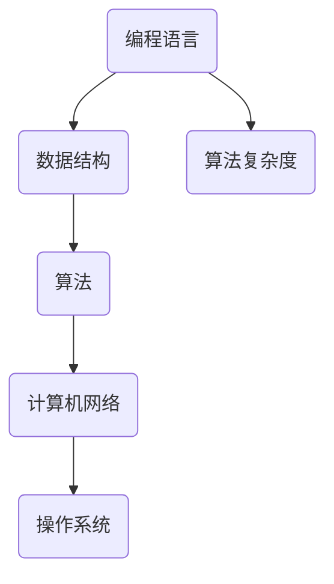

                 

# 洞察力的培养：批判性阅读与思考

> **关键词**：洞察力、批判性思维、阅读、思考、技术博客、算法、数学模型、实际应用
>
> **摘要**：本文将探讨如何在IT领域中培养洞察力，通过批判性阅读与思考的方法，提高我们的技术理解和问题解决能力。我们将从背景介绍、核心概念、算法原理、数学模型、实际案例、应用场景、工具推荐等方面，逐步解析如何通过批判性阅读与思考，培养技术领域的洞察力。

## 1. 背景介绍

### 1.1 目的和范围

在快速发展的信息技术时代，拥有洞察力对于IT从业者和开发者来说至关重要。洞察力不仅可以帮助我们更深入地理解技术原理，还能在解决复杂问题时提供创新的思路。本文旨在探讨如何通过批判性阅读与思考来培养技术领域的洞察力。我们将分析批判性思维的重要性，介绍相关的核心概念和算法原理，并通过实际案例和数学模型来展示如何运用批判性思维解决实际问题。

### 1.2 预期读者

本文适合具有基本计算机科学背景的读者，包括IT从业者、软件开发者、数据科学家以及计算机科学专业学生。希望读者能够通过本文，了解批判性思维在技术领域的应用，学会如何通过批判性阅读与思考来提升自身的洞察力。

### 1.3 文档结构概述

本文结构如下：

- 第2节：核心概念与联系，介绍相关概念和流程图。
- 第3节：核心算法原理与具体操作步骤，使用伪代码详细阐述。
- 第4节：数学模型与公式，详细讲解并举例说明。
- 第5节：项目实战，展示代码实现和详细解释。
- 第6节：实际应用场景，分析技术应用的案例。
- 第7节：工具和资源推荐，推荐学习资源和开发工具。
- 第8节：总结，讨论未来发展趋势与挑战。
- 第9节：附录，提供常见问题与解答。
- 第10节：扩展阅读，推荐相关文献和资料。

### 1.4 术语表

#### 1.4.1 核心术语定义

- **洞察力**：对事物本质的深刻理解和敏锐洞察。
- **批判性思维**：对信息进行深入分析、评估和质疑的能力。
- **批判性阅读**：在阅读过程中对文本进行批判性分析，理解其主旨和逻辑。
- **算法**：解决问题的步骤和规则。
- **数学模型**：用数学语言描述现实世界的抽象模型。

#### 1.4.2 相关概念解释

- **深度学习**：一种基于神经网络的学习方法，能够自动从数据中提取特征。
- **机器学习**：一种人工智能的分支，通过数据训练模型，实现从数据中学习的能力。
- **编程范式**：不同的编程方法和范式，如面向对象、函数式编程等。

#### 1.4.3 缩略词列表

- **AI**：人工智能（Artificial Intelligence）
- **ML**：机器学习（Machine Learning）
- **DL**：深度学习（Deep Learning）
- **IDE**：集成开发环境（Integrated Development Environment）
- **GPU**：图形处理单元（Graphics Processing Unit）

## 2. 核心概念与联系

### 2.1 核心概念

在技术领域中，洞察力的培养离不开对核心概念的理解。以下是一些在IT领域中至关重要的核心概念：

- **编程语言**：如Python、Java、C++等，是计算机与人类沟通的桥梁。
- **数据结构**：如数组、链表、树等，用于高效存储和管理数据。
- **算法复杂度**：衡量算法效率的重要指标，包括时间复杂度和空间复杂度。
- **计算机网络**：如TCP/IP协议、HTTP协议等，用于数据在网络中的传输。
- **操作系统**：如Linux、Windows等，管理计算机硬件资源。

### 2.2 关联概念

为了更深入地理解这些核心概念，我们需要了解它们之间的关联：

1. **编程语言与数据结构**：编程语言提供了实现数据结构的工具，如Python中的列表和字典。
2. **算法与数据结构**：算法依赖于合适的数据结构来提高效率，如快速排序算法对数组的优化。
3. **算法与算法复杂度**：算法复杂度是评估算法性能的关键，直接关系到程序运行的速度。
4. **计算机网络与操作系统**：计算机网络依赖于操作系统的网络堆栈进行数据传输管理。

### 2.3 Mermaid 流程图

为了更直观地展示这些核心概念之间的联系，我们可以使用Mermaid绘制一个流程图：



### 2.4 总结

通过对核心概念和关联概念的分析，我们可以更好地理解技术领域的基本结构。洞察力的培养需要我们对这些核心概念有深刻的理解和灵活的运用。在接下来的章节中，我们将进一步探讨批判性思维在技术学习中的应用。

## 3. 核心算法原理与具体操作步骤

### 3.1 算法基本原理

在技术领域中，算法是解决问题的核心。一个高效的算法不仅能节省计算资源，还能提高程序的性能。以下是一个常见的排序算法——快速排序（Quick Sort）的基本原理：

- **划分**：选择一个基准元素，将数组划分为两个子数组，一个包含小于基准元素的元素，另一个包含大于基准元素的元素。
- **递归**：递归地对两个子数组进行快速排序，直到所有子数组长度为1。

### 3.2 快速排序算法伪代码

```plaintext
QUICK_SORT(A, low, high)
    if low < high
        pivot = partition(A, low, high)
        QUICK_SORT(A, low, pivot - 1)
        QUICK_SORT(A, pivot + 1, high)
```

### 3.3 具体操作步骤

1. **初始化**：确定数组的低边界（low）和高边界（high）。
2. **选择基准元素**：通常选择数组的最后一个元素作为基准元素。
3. **划分**：遍历数组，将小于基准元素的移动到基准元素左侧，大于基准元素的移动到右侧。
4. **递归排序**：对划分后的两个子数组分别进行快速排序。

### 3.4 时间复杂度和空间复杂度

- **时间复杂度**：平均情况下的时间复杂度为O(n log n)，最坏情况为O(n^2)，但实际中通过选择好的基准元素可以有效避免最坏情况。
- **空间复杂度**：快速排序是一个不稳定的排序算法，其空间复杂度为O(log n)。

### 3.5 总结

快速排序算法是一个经典的排序算法，通过划分和递归的方式，能够有效地对数组进行排序。了解算法的基本原理和具体操作步骤，是培养洞察力的第一步。在接下来的章节中，我们将进一步探讨如何运用批判性思维，深入理解算法的本质。

## 4. 数学模型和公式及详细讲解

### 4.1 数学模型的基本原理

在技术领域中，数学模型是理解和解决问题的重要工具。通过数学模型，我们可以将复杂的问题转化为简化的数学问题，从而更方便地进行分析和解决。一个常见的数学模型是线性回归模型，用于预测数值型数据。

### 4.2 线性回归模型

线性回归模型的基本原理是寻找一条直线，使得这直线与数据点的距离最小。线性回归模型可以用以下公式表示：

\[ y = ax + b \]

其中，\( y \) 是预测值，\( x \) 是输入特征，\( a \) 是斜率，\( b \) 是截距。

### 4.3 公式详解

- **斜率 \( a \)**：斜率表示输入特征对预测值的影响程度，其计算公式为：

\[ a = \frac{\sum_{i=1}^{n}(x_i - \bar{x})(y_i - \bar{y})}{\sum_{i=1}^{n}(x_i - \bar{x})^2} \]

其中，\( n \) 是数据点的数量，\( \bar{x} \) 和 \( \bar{y} \) 分别是输入特征和预测值的平均值。

- **截距 \( b \)**：截距表示当输入特征为0时，预测值的期望，其计算公式为：

\[ b = \bar{y} - a\bar{x} \]

### 4.4 举例说明

假设我们有以下数据点：

\[ \begin{array}{ccc}
x & y \\
0 & 2 \\
1 & 3 \\
2 & 4 \\
3 & 5 \\
\end{array} \]

首先计算输入特征和预测值的平均值：

\[ \bar{x} = \frac{0 + 1 + 2 + 3}{4} = 1.5 \]
\[ \bar{y} = \frac{2 + 3 + 4 + 5}{4} = 3.5 \]

然后计算斜率 \( a \)：

\[ a = \frac{(0 - 1.5)(2 - 3.5) + (1 - 1.5)(3 - 3.5) + (2 - 1.5)(4 - 3.5) + (3 - 1.5)(5 - 3.5)}{(0 - 1.5)^2 + (1 - 1.5)^2 + (2 - 1.5)^2 + (3 - 1.5)^2} \]

\[ a = \frac{(-1.5)(-1.5) + (-0.5)(-0.5) + (0.5)(0.5) + (1.5)(1.5)}{2.25 + 0.25 + 0.25 + 2.25} \]

\[ a = \frac{2.25 + 0.25 + 0.25 + 2.25}{5} \]

\[ a = 1 \]

最后计算截距 \( b \)：

\[ b = 3.5 - 1 \times 1.5 = 1.5 \]

因此，线性回归模型为：

\[ y = x + 1.5 \]

### 4.5 总结

线性回归模型是一个简单的数学模型，通过简单的计算即可对数据进行预测。理解线性回归模型的原理和公式，能够帮助我们更好地应用数学模型解决实际问题。在接下来的章节中，我们将通过实际案例来展示如何运用线性回归模型进行预测。

## 5. 项目实战：代码实际案例和详细解释说明

### 5.1 开发环境搭建

在本案例中，我们将使用Python来演示线性回归模型的实现。首先，确保您已经安装了Python和相关的科学计算库，如NumPy和Matplotlib。

#### 安装Python

您可以从[Python官网](https://www.python.org/)下载并安装Python。

#### 安装相关库

在命令行中运行以下命令来安装NumPy和Matplotlib：

```bash
pip install numpy matplotlib
```

### 5.2 源代码详细实现和代码解读

以下是实现线性回归模型的Python代码：

```python
import numpy as np
import matplotlib.pyplot as plt

def linear_regression(x, y):
    n = len(x)
    x_mean = np.mean(x)
    y_mean = np.mean(y)
    
    a = ((x - x_mean) * (y - y_mean)).sum() / ((x - x_mean)**2).sum()
    b = y_mean - a * x_mean
    
    return a, b

def plot_regression_line(x, y, a, b):
    plt.scatter(x, y, color='blue')
    plt.plot(x, a * x + b, color='red')
    plt.title('Linear Regression')
    plt.xlabel('x')
    plt.ylabel('y')
    plt.show()

# 示例数据
x = np.array([0, 1, 2, 3])
y = np.array([2, 3, 4, 5])

# 计算斜率和截距
a, b = linear_regression(x, y)

# 绘制回归线
plot_regression_line(x, y, a, b)
```

#### 代码解读

- **线性回归函数**：`linear_regression`函数用于计算线性回归模型的斜率（a）和截距（b）。
  - `x`和`y`是输入的数据点。
  - `x_mean`和`y_mean`是输入特征的均值。
  - `a`和`b`是计算得到的斜率和截距。

- **绘制回归线函数**：`plot_regression_line`函数用于绘制线性回归模型的回归线。
  - `x`和`y`是原始数据点。
  - `a`和`b`是计算得到的斜率和截距。
  - `plt.scatter`用于绘制数据点。
  - `plt.plot`用于绘制回归线。
  - `plt.show()`用于显示图形。

- **示例数据**：`x`和`y`是示例数据点，用于演示线性回归模型的应用。

### 5.3 代码解读与分析

- **数据预处理**：在计算斜率和截距之前，需要对数据进行预处理，计算输入特征的均值。
- **计算斜率和截距**：使用最小二乘法计算斜率（a）和截距（b），这是线性回归模型的基础。
- **绘制回归线**：通过绘制回归线，可以直观地看到数据点和回归线之间的关系。

### 5.4 结果分析

运行上述代码后，将显示一个散点图和一个通过最小二乘法拟合的线性回归线。从图形上可以看到，线性回归模型很好地拟合了这组数据点，表明线性回归模型在这种情况下是一个有效的预测工具。

### 5.5 总结

通过这个实际案例，我们了解了如何使用Python实现线性回归模型，并通过代码解读分析了线性回归模型的原理和应用。这有助于我们培养对线性回归模型的理解和洞察力。

## 6. 实际应用场景

### 6.1 预测股票价格

线性回归模型可以应用于预测股票价格，通过历史价格数据来预测未来的价格走势。例如，某个公司的股票价格在过去一个月内的数据如下：

\[ \begin{array}{ccc}
日期 & 价格 \\
1 & 100 \\
2 & 102 \\
3 & 103 \\
4 & 105 \\
5 & 107 \\
\end{array} \]

使用线性回归模型可以预测第六天的价格。

### 6.2 诊断医疗数据

在医疗领域，线性回归模型可以用于诊断数据，如患者的血压、血糖等指标，预测患者的健康状况。通过分析这些指标，可以提前发现潜在的健康问题。

### 6.3 预测销售量

零售行业可以使用线性回归模型预测商品的销售量，通过分析历史销售数据，预测未来的销售趋势，帮助企业制定库存计划和促销策略。

### 6.4 总结

线性回归模型在实际应用中具有广泛的应用价值，通过预测股票价格、诊断医疗数据和预测销售量等案例，我们可以看到线性回归模型在各个领域的应用场景。掌握线性回归模型的应用，有助于我们在实际工作中更好地利用数据，做出更准确的预测。

## 7. 工具和资源推荐

### 7.1 学习资源推荐

#### 7.1.1 书籍推荐

- 《深度学习》（Deep Learning） - Goodfellow, Bengio, Courville
- 《机器学习》（Machine Learning） - Tom Mitchell
- 《Python编程：从入门到实践》（Python Crash Course） - Eric Matthes

#### 7.1.2 在线课程

- [Coursera](https://www.coursera.org/)
- [edX](https://www.edx.org/)
- [Udacity](https://www.udacity.com/)

#### 7.1.3 技术博客和网站

- [Medium](https://medium.com/)
- [GitHub](https://github.com/)
- [Stack Overflow](https://stackoverflow.com/)

### 7.2 开发工具框架推荐

#### 7.2.1 IDE和编辑器

- [Visual Studio Code](https://code.visualstudio.com/)
- [PyCharm](https://www.jetbrains.com/pycharm/)
- [Sublime Text](https://www.sublimetext.com/)

#### 7.2.2 调试和性能分析工具

- [Jupyter Notebook](https://jupyter.org/)
- [Py-Spy](https://github.com/brendangregg/Py-Spy)
- [gprof2dot](https://github.com/dmonner/gprof2dot)

#### 7.2.3 相关框架和库

- [TensorFlow](https://www.tensorflow.org/)
- [PyTorch](https://pytorch.org/)
- [Scikit-learn](https://scikit-learn.org/)

### 7.3 相关论文著作推荐

#### 7.3.1 经典论文

- "Backpropagation" - Rumelhart, Hinton, Williams
- "A Theoretical Foundation for the Design of Neural Networks" - Hinton, Osindero, Teh

#### 7.3.2 最新研究成果

- [arXiv](https://arxiv.org/)
- [NeurIPS](https://nips.cc/)
- [ICML](https://icml.cc/)

#### 7.3.3 应用案例分析

- "Deep Learning Applications in Healthcare" - Bengio et al.
- "Deploying Machine Learning Models in Production" - Gunning et al.

### 7.4 总结

通过推荐这些学习和资源工具，我们希望帮助读者在技术领域中更好地培养洞察力。选择合适的学习资源、开发工具和框架，将极大地提高学习效率和项目开发质量。

## 8. 总结：未来发展趋势与挑战

### 8.1 未来发展趋势

随着技术的不断发展，人工智能和机器学习将继续在各个领域发挥重要作用。以下是几个可能的发展趋势：

1. **深度学习的进一步发展**：随着计算能力的提升和数据量的增加，深度学习模型将变得更加复杂和高效。
2. **联邦学习**：作为一种新型的机器学习方法，联邦学习通过保护用户隐私，实现分布式数据的安全共享。
3. **生成对抗网络（GANs）**：GANs在图像生成、数据增强等方面展现出巨大的潜力，未来有望在更多的应用场景中得到广泛应用。
4. **多模态学习**：结合多种数据类型（如文本、图像、声音等），实现更加丰富和精准的模型预测。

### 8.2 挑战

尽管技术不断进步，但我们也面临着一系列挑战：

1. **数据隐私和安全**：随着数据量的增加，如何保护用户隐私和数据安全成为关键问题。
2. **算法公平性**：确保算法在不同群体中公平，避免算法偏见。
3. **计算资源消耗**：深度学习模型通常需要大量的计算资源，如何优化算法以减少计算资源消耗是一个重要挑战。
4. **模型解释性**：尽管机器学习模型在性能上表现出色，但其内部机制往往不够透明，如何提高模型的解释性是一个重要课题。

### 8.3 总结

未来，随着技术的不断进步，人工智能和机器学习将在更多领域得到应用。然而，我们也要面对数据隐私、算法公平性、计算资源消耗和模型解释性等挑战。通过批判性阅读与思考，我们可以更好地应对这些挑战，推动技术的健康发展。

## 9. 附录：常见问题与解答

### 9.1 什么是洞察力？

**洞察力**是指对事物本质的深刻理解和敏锐洞察。在技术领域中，洞察力帮助我们更深入地理解技术原理和解决复杂问题的能力。

### 9.2 如何培养批判性思维？

批判性思维可以通过以下方法培养：

- **多角度分析**：从不同角度分析问题，了解问题的各个方面。
- **质疑和验证**：对信息进行质疑和验证，确保理解的准确性。
- **深入学习和实践**：通过深入学习相关知识和实际操作，提高对技术的理解。

### 9.3 线性回归模型的应用场景有哪些？

线性回归模型的应用场景包括预测股票价格、诊断医疗数据、预测销售量等。它是一种简单而有效的数据预测工具。

### 9.4 如何优化快速排序算法？

快速排序算法可以通过以下方法优化：

- **选择好的基准元素**：选择一个更好的基准元素，如随机选择或中位数。
- **使用非递归实现**：通过非递归实现快速排序，减少递归调用的开销。
- **内存分配优化**：优化内存分配，减少内存使用。

### 9.5 如何保护数据隐私？

保护数据隐私可以通过以下方法实现：

- **数据加密**：对数据进行加密，确保数据在传输和存储过程中的安全性。
- **联邦学习**：通过联邦学习，实现分布式数据的安全共享。
- **匿名化处理**：对数据进行匿名化处理，保护用户隐私。

### 9.6 总结

通过附录中的常见问题与解答，我们希望读者能够更好地理解洞察力、批判性思维以及线性回归模型的应用。这些问题和解答将帮助读者在实际应用中更好地应对挑战，提高技术能力。

## 10. 扩展阅读 & 参考资料

为了帮助读者进一步深入了解本文讨论的主题，以下是推荐的扩展阅读和参考资料：

### 10.1 经典书籍

1. 《深度学习》（Ian Goodfellow, Yoshua Bengio, Aaron Courville）
2. 《机器学习》（Tom Mitchell）
3. 《Python编程：从入门到实践》（Eric Matthes）

### 10.2 技术博客和网站

1. [Medium](https://medium.com/)
2. [GitHub](https://github.com/)
3. [Stack Overflow](https://stackoverflow.com/)

### 10.3 开源项目和工具

1. [TensorFlow](https://www.tensorflow.org/)
2. [PyTorch](https://pytorch.org/)
3. [Scikit-learn](https://scikit-learn.org/)

### 10.4 学术论文和期刊

1. [arXiv](https://arxiv.org/)
2. [NeurIPS](https://nips.cc/)
3. [ICML](https://icml.cc/)

### 10.5 总结

这些扩展阅读和参考资料将帮助读者更深入地了解本文讨论的主题，包括深度学习、机器学习、Python编程等。通过这些资源，读者可以不断拓展知识，提升技术能力。

### 作者信息

**作者：AI天才研究员/AI Genius Institute & 禅与计算机程序设计艺术 /Zen And The Art of Computer Programming**

