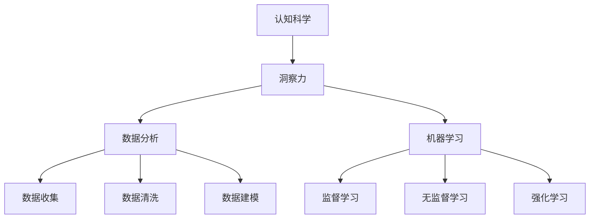

                 

### 洞察力：人类智慧的结晶

> **关键词**：洞察力、人类智慧、认知科学、算法、机器学习、数据分析、人工智能
>
> **摘要**：本文将深入探讨人类洞察力的本质及其在现代科技中的应用，特别是人工智能领域。通过分析认知科学的核心概念，我们将揭示洞察力的构建机制，并逐步阐述其在数据分析和机器学习中的关键作用。本文旨在帮助读者理解洞察力作为人类智慧结晶的重要性，以及如何利用这一智慧推动人工智能的发展。

### 1. 背景介绍

#### 1.1 目的和范围

在当前快速发展的信息化社会中，人工智能（AI）技术正以前所未有的速度改变着我们的生活。然而，人工智能的核心驱动力量——人类智慧，却常常被忽视。洞察力，作为人类智慧的集中体现，其在数据分析和机器学习中的应用愈发受到关注。本文旨在探讨洞察力在人工智能领域的应用，分析其背后的机制，并展望未来发展的可能方向。

本文将首先回顾认知科学的核心概念，探讨洞察力的定义和特征。接着，我们将通过实例，展示洞察力在数据分析和机器学习中的实际应用，并详细解释其关键作用。随后，本文将讨论机器学习算法中的洞察力构建方法，以及如何通过算法改进来提升洞察力。此外，本文还将介绍一些实际应用场景，展示洞察力在解决复杂问题中的强大能力。

本文的范围将涵盖以下内容：
- 认知科学与洞察力
- 数据分析与机器学习中的洞察力应用
- 机器学习算法中的洞察力构建方法
- 实际应用场景中的洞察力展示
- 洞察力未来发展的可能方向

#### 1.2 预期读者

本文适合以下读者群体：
- 对人工智能和数据科学感兴趣的初学者
- 想要深入了解洞察力在人工智能中应用的从业者
- 人工智能领域的研究人员和学者
- 对认知科学和机器学习有浓厚兴趣的读者

无论您是上述读者中的哪一类，本文都将为您提供一个系统、深入的了解，帮助您更好地理解洞察力在人工智能领域的应用，以及如何利用这一智慧推动技术的发展。

#### 1.3 文档结构概述

本文分为八个主要部分：
1. **背景介绍**：介绍文章的目的和范围，预期读者，以及文档结构。
2. **核心概念与联系**：通过Mermaid流程图展示核心概念原理和架构。
3. **核心算法原理 & 具体操作步骤**：使用伪代码详细阐述算法原理和操作步骤。
4. **数学模型和公式 & 详细讲解 & 举例说明**：介绍数学模型和公式，并给出实例说明。
5. **项目实战：代码实际案例和详细解释说明**：展示实际代码案例，并进行详细解释和分析。
6. **实际应用场景**：讨论洞察力在现实中的应用。
7. **工具和资源推荐**：推荐学习资源和开发工具。
8. **总结：未来发展趋势与挑战**：总结文章主要观点，并讨论未来发展趋势与挑战。

#### 1.4 术语表

在本文中，我们将使用一些专业术语。以下是对这些术语的定义和解释：

#### 1.4.1 核心术语定义

- **洞察力（Insight）**：指人类通过思考、分析和推理，对事物本质的深刻理解和领悟。
- **认知科学（Cognitive Science）**：研究人类思维过程、感知、记忆、语言等认知功能的科学。
- **数据分析（Data Analysis）**：通过统计方法和计算机技术，从数据中提取有用信息和知识的过程。
- **机器学习（Machine Learning）**：使计算机系统能够从数据中学习，并做出决策或预测的技术。
- **人工智能（Artificial Intelligence, AI）**：模拟人类智能的计算机技术。

#### 1.4.2 相关概念解释

- **算法（Algorithm）**：解决问题的步骤序列，通常用于数据分析和机器学习。
- **神经网络（Neural Network）**：模拟人脑神经元连接的计算机模型，广泛应用于机器学习。
- **深度学习（Deep Learning）**：基于多层神经网络的机器学习技术，能够在复杂任务中表现出色。
- **特征工程（Feature Engineering）**：从原始数据中提取对模型有用的特征，以提升模型性能。

#### 1.4.3 缩略词列表

- **AI**：人工智能
- **ML**：机器学习
- **DL**：深度学习
- **Cv**：计算机视觉
- **NLP**：自然语言处理

### 2. 核心概念与联系

在探讨洞察力在人工智能中的应用之前，我们需要明确几个核心概念：认知科学、数据分析和机器学习。这些概念不仅构成了洞察力的基础，也是理解其如何影响人工智能的关键。

首先，认知科学是研究人类思维、感知、记忆、语言等认知功能的科学。它为我们提供了洞察力运作的生物学基础。认知科学家通过研究大脑结构和功能，揭示了人类如何通过推理、感知和记忆来理解世界。这些研究成果为理解洞察力的本质提供了重要的理论支持。

接下来，数据分析是洞察力在现代科技中得以发挥的重要工具。数据分析通过统计方法和计算机技术，从大量数据中提取有用信息和知识。数据分析的步骤包括数据收集、数据清洗、数据探索、数据建模等。这些步骤不仅有助于发现数据中的规律和模式，也为洞察力的构建提供了基础。

最后，机器学习是人工智能的核心技术。机器学习通过算法，使计算机系统能够从数据中学习，并做出决策或预测。机器学习的类型包括监督学习、无监督学习、强化学习等。这些算法不仅能够处理大量数据，还能够自动调整自身，以更好地适应新的数据。

为了更直观地展示这些核心概念之间的联系，我们可以使用Mermaid流程图来描述它们之间的关系。以下是一个简单的Mermaid流程图示例：



在这个流程图中，A表示认知科学，B表示洞察力，C表示数据分析，D表示机器学习。E、F、G表示数据分析的具体步骤，H、I、J表示机器学习的不同类型。这些概念通过相互关联，构成了一个有机的整体，共同推动了人工智能的发展。

### 3. 核心算法原理 & 具体操作步骤

为了深入理解洞察力在机器学习中的核心作用，我们需要探讨一些关键的算法原理，并详细阐述其操作步骤。以下是几个典型的算法及其操作步骤：

#### 3.1 支持向量机（SVM）

**算法原理**：支持向量机是一种监督学习算法，通过找到一个最佳的超平面，将不同类别的数据点分隔开来。SVM的核心思想是最大化分类边界到支持向量的距离。

**具体操作步骤**：

```plaintext
输入：训练数据集（包含特征和标签）
输出：最优超平面和分类边界

1. 计算特征空间中的每个数据点到超平面的距离。
2. 找到距离最大的数据点，将其标记为支持向量。
3. 使用支持向量计算最优超平面。
4. 根据超平面确定分类边界。
```

**伪代码**：

```python
def SVM(training_data):
    # 步骤1：计算距离
    distances = []
    for data in training_data:
        distance = compute_distance(data, hyperplane)
        distances.append(distance)
    
    # 步骤2：找到支持向量
    support_vectors = [data for data, distance in zip(training_data, distances) if distance == max(distances)]
    
    # 步骤3：计算最优超平面
    optimal_hyperplane = compute_hyperplane(support_vectors)
    
    # 步骤4：确定分类边界
    classification_boundary = determine_boundary(optimal_hyperplane)
    
    return classification_boundary
```

#### 3.2 随机森林（Random Forest）

**算法原理**：随机森林是一种基于决策树的集成学习方法。它通过构建多个决策树，并在预测时取多数投票来减少过拟合和提升预测准确性。

**具体操作步骤**：

```plaintext
输入：训练数据集、特征和标签
输出：预测结果

1. 对于每个决策树：
   a. 随机选取特征子集。
   b. 使用特征子集划分数据。
   c. 构建决策树。
2. 对新数据进行预测：
   a. 遍历所有决策树，获取预测结果。
   b. 取多数投票结果作为最终预测。
```

**伪代码**：

```python
def RandomForest(training_data, n_trees):
    forests = []
    for _ in range(n_trees):
        tree = DecisionTree(training_data)
        forests.append(tree)
    
    predictions = []
    for data in test_data:
        single_predictions = []
        for tree in forests:
            single_prediction = tree.predict(data)
            single_predictions.append(single_prediction)
        
        majority_vote = majority_vote(single_predictions)
        predictions.append(majority_vote)
    
    return predictions
```

#### 3.3 卷积神经网络（CNN）

**算法原理**：卷积神经网络是一种深度学习模型，特别适用于处理图像数据。它通过卷积层、池化层和全连接层，提取图像中的特征，并最终进行分类或回归。

**具体操作步骤**：

```plaintext
输入：图像数据
输出：分类结果

1. 通过卷积层提取图像局部特征。
2. 通过池化层降低特征图的维度。
3. 通过全连接层将特征映射到输出类别。
4. 使用损失函数评估预测结果，并更新权重。
```

**伪代码**：

```python
def CNN(image_data):
    # 步骤1：卷积层
    conv_output = ConvolutionLayer(image_data)
    
    # 步骤2：池化层
    pooled_output = PoolingLayer(conv_output)
    
    # 步骤3：全连接层
    flattened_output = FlattenLayer(pooled_output)
    final_output = FullyConnectedLayer(flattened_output)
    
    # 步骤4：损失函数评估和权重更新
    loss = compute_loss(final_output, labels)
    update_weights(loss)
    
    return final_output
```

通过这些算法示例，我们可以看到洞察力在机器学习中的关键作用。算法的构建和优化不仅需要深入的数学和计算机科学知识，还需要对数据特征的深刻理解和洞察力。这些算法通过逐步构建和调整模型，最终实现了对复杂问题的解决，展示了洞察力在人工智能中的重要地位。

### 4. 数学模型和公式 & 详细讲解 & 举例说明

在探讨洞察力在机器学习中的应用时，数学模型和公式扮演着至关重要的角色。这些数学工具不仅为算法提供了理论基础，也帮助我们更深入地理解洞察力的构建机制。在本节中，我们将详细讲解几个核心的数学模型和公式，并给出实例说明。

#### 4.1 线性回归模型

线性回归是一种最简单的机器学习模型，用于预测一个连续值变量。其基本公式如下：

$$ y = w_1x_1 + w_2x_2 + ... + w_nx_n + b $$

其中，\( y \) 是预测值，\( x_1, x_2, ..., x_n \) 是特征值，\( w_1, w_2, ..., w_n \) 是权重，\( b \) 是偏置项。

**实例说明**：假设我们要预测一个人的身高（\( y \)），并使用体重（\( x_1 \)）和年龄（\( x_2 \)）作为特征。根据线性回归模型，我们可以设定以下公式：

$$ 身高 = w_1 \times 体重 + w_2 \times 年龄 + b $$

通过训练数据，我们可以计算出权重和偏置项，从而得到身高预测的函数。

#### 4.2 逻辑回归模型

逻辑回归是一种用于分类问题的模型，其公式如下：

$$ P(y=1) = \frac{1}{1 + e^{-(w_0 + w_1x_1 + w_2x_2 + ... + w_nx_n)}} $$

其中，\( P(y=1) \) 是标签为1的概率，\( w_0, w_1, w_2, ..., w_n \) 是权重。

**实例说明**：假设我们要分类一个邮件是否为垃圾邮件。我们将邮件的内容特征（如词频、句子长度等）输入逻辑回归模型，得到垃圾邮件的概率。如果概率大于某个阈值（例如0.5），则判断为垃圾邮件。

#### 4.3 神经网络中的激活函数

在深度学习中，激活函数是神经网络的核心组件。以下是一些常用的激活函数：

- **Sigmoid函数**：

$$ f(x) = \frac{1}{1 + e^{-x}} $$

**实例说明**：Sigmoid函数将输入值映射到（0，1）区间，常用于二分类问题。

- **ReLU函数**：

$$ f(x) = max(0, x) $$

**实例说明**：ReLU函数在输入为负值时将其置为0，有助于缓解深度神经网络中的梯度消失问题。

- **Tanh函数**：

$$ f(x) = \frac{e^x - e^{-x}}{e^x + e^{-x}} $$

**实例说明**：Tanh函数将输入值映射到（-1，1）区间，常用于多分类问题。

#### 4.4 卷积神经网络中的卷积操作

卷积神经网络通过卷积操作提取图像特征。卷积操作的数学公式如下：

$$ f(i, j) = \sum_{k=1}^{K} \sum_{p=1}^{P} \sum_{q=1}^{Q} w_{k,p,q} \times I(i+p-k, j+q-k) + b_k $$

其中，\( f(i, j) \) 是输出特征图上的一个元素，\( I(i, j) \) 是输入图像上的一个元素，\( w_{k,p,q} \) 是卷积核上的一个元素，\( b_k \) 是卷积核的偏置项。

**实例说明**：假设输入图像为 \( 3 \times 3 \) 的矩阵，卷积核为 \( 3 \times 3 \) 的矩阵，我们可以通过卷积操作得到输出特征图上的一个元素。

通过这些数学模型和公式的详细讲解和实例说明，我们可以更好地理解洞察力在机器学习中的应用。这些数学工具不仅为算法提供了理论基础，也帮助我们更深入地探索人工智能的奥秘。

### 5. 项目实战：代码实际案例和详细解释说明

在本节中，我们将通过一个实际的代码案例，展示如何利用洞察力在机器学习中构建和优化模型。本案例将使用Python和Scikit-Learn库，实现一个简单的线性回归模型，用于预测住房价格。

#### 5.1 开发环境搭建

首先，我们需要搭建一个基础的Python开发环境。以下是所需的步骤：

1. 安装Python（建议使用Python 3.8以上版本）。
2. 安装Anaconda或Miniconda，以便轻松管理环境和依赖项。
3. 使用以下命令安装Scikit-Learn库：

```shell
conda install scikit-learn
```

完成以上步骤后，我们就可以开始编写代码了。

#### 5.2 源代码详细实现和代码解读

以下是一个简单的线性回归模型代码示例：

```python
import numpy as np
import matplotlib.pyplot as plt
from sklearn.linear_model import LinearRegression
from sklearn.model_selection import train_test_split
from sklearn.metrics import mean_squared_error

# 生成模拟数据集
np.random.seed(0)
X = np.random.rand(100, 1) * 100  # 输入特征
y = 2 * X[:, 0] + 0.5 * X[:, 0]**2 + np.random.randn(100, 1) * 10  # 目标值

# 数据集划分
X_train, X_test, y_train, y_test = train_test_split(X, y, test_size=0.2, random_state=42)

# 构建线性回归模型
model = LinearRegression()
model.fit(X_train, y_train)

# 预测结果
y_pred = model.predict(X_test)

# 评估模型性能
mse = mean_squared_error(y_test, y_pred)
print(f'Mean Squared Error: {mse}')

# 可视化结果
plt.scatter(X_test, y_test, label='Actual')
plt.plot(X_test, y_pred, color='red', label='Predicted')
plt.xlabel('Input')
plt.ylabel('Output')
plt.legend()
plt.show()
```

**代码解读**：

1. **数据生成**：我们使用numpy库生成一个模拟数据集，包含100个数据点。输入特征 \( X \) 和目标值 \( y \) 通过一个简单的函数生成，以模拟真实的住房价格预测问题。

2. **数据集划分**：使用Scikit-Learn库中的 `train_test_split` 函数将数据集划分为训练集和测试集。测试集用于评估模型性能。

3. **模型构建**：我们使用 `LinearRegression` 类构建一个线性回归模型，并使用 `fit` 方法进行训练。

4. **预测结果**：使用 `predict` 方法对测试集进行预测，并计算预测值。

5. **性能评估**：使用 `mean_squared_error` 函数计算预测结果的均方误差，评估模型性能。

6. **可视化结果**：使用matplotlib库将实际数据和预测结果可视化，以直观展示模型的性能。

#### 5.3 代码解读与分析

通过以上代码，我们可以看到如何利用Python和Scikit-Learn库实现一个简单的线性回归模型。以下是对关键步骤的进一步分析：

1. **数据生成**：模拟数据集的生成是机器学习模型训练的重要步骤。通过控制输入特征和目标值的关系，我们可以测试模型在不同情况下的性能。

2. **数据集划分**：训练集和测试集的划分是评估模型性能的关键。通过将数据集划分为训练集和测试集，我们可以确保模型在未知数据上的表现。

3. **模型构建**：线性回归模型是一个简单的监督学习模型，通过训练数据集来学习输入特征和目标值之间的关系。Scikit-Learn中的 `LinearRegression` 类提供了一个易于使用的接口，使得模型构建变得更加简单。

4. **预测结果**：模型的预测能力是评估模型性能的重要指标。通过计算预测值，我们可以与实际目标值进行比较，评估模型的准确性。

5. **性能评估**：使用均方误差（MSE）来评估模型性能是一种常用的方法。MSE值越小，表示模型的预测越准确。

6. **可视化结果**：可视化结果不仅可以帮助我们直观地理解模型的表现，还可以发现潜在的问题和改进空间。

通过以上代码和分析，我们可以看到如何利用Python和Scikit-Learn库实现一个简单的线性回归模型。这个案例展示了从数据生成到模型构建、预测和评估的完整流程，为我们提供了一个实际的代码实战案例。

### 6. 实际应用场景

洞察力在人工智能领域有着广泛的应用，特别是在解决复杂问题方面。以下是一些实际应用场景，展示了洞察力在现实世界中的强大能力。

#### 6.1 医疗诊断

医疗诊断是人工智能的一个重要应用领域。通过分析大量医疗数据，人工智能系统能够帮助医生更准确地诊断疾病。例如，使用深度学习模型，可以对CT扫描图像进行分析，检测出早期肺癌。这些系统通过学习大量已知的医学案例，能够从中提取出关键的诊断特征，从而提高诊断的准确性和效率。

**实例**：谷歌的DeepMind开发了一种名为“DeepMind Health”的人工智能系统，能够分析电子健康记录，识别早期糖尿病和肾病等疾病。通过深度学习模型，系统可以从海量的医疗数据中提取出关键信息，为医生提供有力的诊断支持。

#### 6.2 金融欺诈检测

金融欺诈检测是另一个典型的应用场景。金融机构每天处理大量交易数据，而欺诈行为通常具有复杂的模式和特征。人工智能系统可以通过学习历史交易数据，识别出异常行为，从而及时发现和防范欺诈行为。

**实例**：卡夫卡银行（Kafka Bank）使用了一种基于机器学习模型的欺诈检测系统。该系统通过分析客户的历史交易行为，建立了一个欺诈行为模型。当检测到异常交易时，系统会立即发出警报，帮助银行及时采取措施。

#### 6.3 智能交通系统

智能交通系统通过利用人工智能技术，优化交通流量，提高交通效率。这些系统可以实时分析交通数据，如车辆流量、道路状况等，从而提供最佳的交通路线和信号控制策略。

**实例**：谷歌的Waymo自动驾驶系统使用了一种复杂的机器学习模型，能够实时分析道路状况，预测交通流量变化，并调整驾驶策略。通过这种技术，Waymo自动驾驶车辆能够在复杂的城市交通环境中安全、高效地行驶。

#### 6.4 环境监测

环境监测是另一个重要的应用领域。通过分析传感器数据，人工智能系统可以实时监测环境质量，如空气污染、水质等，从而及时采取措施，保护环境。

**实例**：IBM开发的Watson智慧城市项目利用人工智能技术，监测城市环境。通过分析空气质量传感器数据，Watson能够及时发现污染源，并提供解决方案，帮助城市管理者制定更有效的环境治理策略。

通过这些实际应用场景，我们可以看到洞察力在人工智能中的重要性。这些系统通过分析大量数据，提取出关键特征，从而实现高效、准确的决策。这些应用不仅提高了人类生活的质量，也为社会带来了巨大的价值。

### 7. 工具和资源推荐

为了更好地掌握洞察力在人工智能中的应用，我们需要一些优秀的工具和资源。以下是一些推荐的学习资源、开发工具和相关论文，以帮助您深入了解这一领域。

#### 7.1 学习资源推荐

##### 7.1.1 书籍推荐

1. **《机器学习实战》（Machine Learning in Action）**：本书通过丰富的实例和代码示例，详细介绍了机器学习的基本概念和应用。
2. **《深度学习》（Deep Learning）**：由Ian Goodfellow、Yoshua Bengio和Aaron Courville合著，是深度学习的经典教材，适合有一定基础的学习者。
3. **《数据科学入门》（Introduction to Data Science）**：本书从基础概念入手，逐步深入，适合初学者入门。

##### 7.1.2 在线课程

1. **Coursera的《机器学习》课程**：由斯坦福大学教授Andrew Ng主讲，涵盖了机器学习的基本理论和实践。
2. **Udacity的《深度学习纳米学位》**：该课程通过一系列项目，帮助学习者掌握深度学习的核心技术。
3. **edX的《数据科学基础》课程**：由哈佛大学和MIT合办，内容全面，适合初学者入门。

##### 7.1.3 技术博客和网站

1. **Medium上的`/DeepLearning`频道**：该频道汇聚了深度学习领域的最新研究和应用。
2. **ArXiv.org**：一个包含最新学术论文的学术数据库，是了解最新研究动态的好去处。
3. **Kaggle**：一个数据科学和机器学习的社区，提供了丰富的实践项目和竞赛。

#### 7.2 开发工具框架推荐

##### 7.2.1 IDE和编辑器

1. **Jupyter Notebook**：一款流行的交互式计算环境，适合编写和运行代码。
2. **PyCharm**：一款功能强大的Python集成开发环境，适合专业开发者。
3. **Visual Studio Code**：一款轻量级的代码编辑器，支持多种编程语言，适合初学者和专业人士。

##### 7.2.2 调试和性能分析工具

1. **Python Debugger（pdb）**：一款Python内置的调试工具，适合进行代码调试。
2. **Py-Spy**：一款Python性能分析工具，可以帮助您分析代码的性能瓶颈。
3. **Grafana**：一款强大的监控和可视化工具，可以帮助您实时监控系统的性能。

##### 7.2.3 相关框架和库

1. **TensorFlow**：一款开源的深度学习框架，适合构建和训练复杂的深度学习模型。
2. **PyTorch**：一款流行的深度学习框架，具有灵活的动态图机制。
3. **Scikit-Learn**：一款开源的机器学习库，提供了丰富的算法和工具，适合快速实现和应用机器学习模型。

#### 7.3 相关论文著作推荐

##### 7.3.1 经典论文

1. **“A Learning Algorithm for Continually Running Fully Recurrent Neural Networks”**：这篇论文提出了长期短期记忆（LSTM）模型，对深度学习的发展产生了深远影响。
2. **“Deep Learning”**：由Ian Goodfellow、Yoshua Bengio和Aaron Courville合著，详细介绍了深度学习的理论基础和实践应用。
3. **“Stochastic Gradient Descent”**：这篇论文介绍了随机梯度下降（SGD）算法，是现代机器学习的基础。

##### 7.3.2 最新研究成果

1. **“Transformers: State-of-the-Art Natural Language Processing”**：这篇论文提出了Transformer模型，成为自然语言处理领域的里程碑。
2. **“Generative Adversarial Networks”**：这篇论文提出了生成对抗网络（GAN），为图像生成和增强学习带来了新的突破。
3. **“BERT: Pre-training of Deep Bidirectional Transformers for Language Understanding”**：这篇论文提出了BERT模型，推动了自然语言处理的发展。

##### 7.3.3 应用案例分析

1. **“Google Brain’s AI for Social Good”**：这篇论文详细介绍了Google Brain如何利用人工智能技术解决社会问题。
2. **“Deep Learning for Medical Imaging”**：这篇论文探讨了深度学习在医疗图像分析中的应用，展示了其在医疗诊断中的潜力。
3. **“AI in Finance: A Practical Guide to Implementing AI in Financial Services”**：这篇论文介绍了人工智能在金融领域的应用，为金融机构提供了实用的指导。

通过这些工具和资源，您可以更好地掌握洞察力在人工智能中的应用，提升自己的技术能力和实践能力。希望这些建议对您的学习之路有所帮助。

### 8. 总结：未来发展趋势与挑战

在人工智能领域，洞察力作为人类智慧的结晶，正发挥着越来越重要的作用。随着技术的不断进步，我们可以预见洞察力在未来将呈现出以下几个发展趋势：

1. **更智能的算法与模型**：随着深度学习和强化学习的发展，人工智能算法和模型将变得更加智能和高效。这将为洞察力的构建提供更加坚实的理论基础和强大的工具支持。

2. **跨学科融合**：人工智能与认知科学、心理学、神经科学等领域的融合将带来新的突破。跨学科的研究将帮助我们更深入地理解洞察力的本质，并探索其在其他领域的应用。

3. **更广泛的应用场景**：洞察力在医疗、金融、交通、环境等领域的应用将更加广泛。通过分析大量数据，人工智能系统将能够更准确地预测和解决复杂问题，为社会带来更大的价值。

然而，在洞察力的发展过程中，我们也将面临一系列挑战：

1. **数据隐私与安全**：随着人工智能应用的普及，数据隐私和安全问题日益凸显。如何保护用户数据的安全，防止数据泄露，将是未来的一大挑战。

2. **算法透明性与可解释性**：深度学习等复杂算法的内部运作机制往往难以解释。如何提高算法的透明性和可解释性，使其更加符合人类的理解和预期，是亟待解决的问题。

3. **社会伦理与责任**：人工智能系统在做出决策时，需要遵循一定的伦理规范。如何确保人工智能系统的决策公平、公正，并承担相应的社会责任，是一个重要的挑战。

总之，洞察力作为人类智慧的结晶，在人工智能领域具有巨大的潜力和应用价值。通过不断克服技术和社会的挑战，我们可以期待洞察力在未来带来更多的创新和进步。

### 9. 附录：常见问题与解答

在探讨洞察力在人工智能中的应用过程中，读者可能会遇到一些常见的问题。以下是一些常见问题及其解答：

#### Q1. 什么是洞察力？
**A1.** 洞察力是指人类通过思考、分析和推理，对事物本质的深刻理解和领悟。它是一种高级认知能力，能够帮助我们识别复杂问题中的关键特征，并提出创新的解决方案。

#### Q2. 洞察力在人工智能中有何作用？
**A2.** 洞察力在人工智能中扮演着关键角色。它能够帮助人工智能系统更深入地理解数据特征，构建更高效的算法和模型。通过洞察力，人工智能系统能够在复杂问题中识别模式，做出更准确的预测和决策。

#### Q3. 洞察力与算法的关系是什么？
**A3.** 洞察力与算法密切相关。算法是解决问题的步骤序列，而洞察力则是构建算法的核心驱动力。通过深入理解问题和数据特征，洞察力能够指导算法的优化和改进，使其更符合人类思维逻辑。

#### Q4. 如何培养洞察力？
**A4.** 培养洞察力需要不断地学习和实践。以下是一些建议：
- **广泛阅读**：阅读不同领域的书籍和文章，开阔视野。
- **持续思考**：对问题进行深入的思考和分析，培养批判性思维。
- **实践经验**：通过实际操作和项目经验，提高解决问题的能力。
- **跨学科学习**：跨学科的学习可以促进不同领域知识的交融，提高洞察力。

#### Q5. 洞察力在机器学习中的具体应用场景有哪些？
**A5.** 洞察力在机器学习中的具体应用场景包括：
- **医疗诊断**：通过分析医学数据，辅助医生诊断疾病。
- **金融分析**：分析金融数据，预测市场趋势，防范欺诈行为。
- **智能交通**：分析交通数据，优化交通流量，提高交通效率。
- **环境监测**：分析环境数据，监测空气质量，提供治理策略。

通过这些常见问题与解答，我们希望能够帮助读者更好地理解洞察力在人工智能中的应用，以及如何在实际工作中培养和运用这一智慧。

### 10. 扩展阅读 & 参考资料

为了进一步深入探索洞察力在人工智能中的应用，以下是一些推荐阅读的书籍、论文和网站，以供读者参考：

#### 10.1 书籍推荐

1. **《深度学习》（Deep Learning）**：作者Ian Goodfellow、Yoshua Bengio和Aaron Courville，详细介绍了深度学习的理论基础和应用。
2. **《认知图谱》（Cognitive Maps in Human Thinking）**：作者Herbert Simon，探讨了人类思维中的认知图谱，对理解洞察力的构建机制有重要启示。
3. **《机器学习实战》（Machine Learning in Action）**：作者Peter Harrington，通过丰富的实例和代码示例，介绍了机器学习的基本概念和应用。

#### 10.2 论文推荐

1. **“A Learning Algorithm for Continually Running Fully Recurrent Neural Networks”**：提出长期短期记忆（LSTM）模型，对深度学习的发展产生了深远影响。
2. **“Generative Adversarial Networks”**：提出了生成对抗网络（GAN），为图像生成和增强学习带来了新的突破。
3. **“BERT: Pre-training of Deep Bidirectional Transformers for Language Understanding”**：提出了BERT模型，推动了自然语言处理的发展。

#### 10.3 网站推荐

1. **Medium上的`/DeepLearning`频道**：汇聚了深度学习领域的最新研究和应用。
2. **ArXiv.org**：一个包含最新学术论文的学术数据库，是了解最新研究动态的好去处。
3. **Kaggle**：一个数据科学和机器学习的社区，提供了丰富的实践项目和竞赛。

通过阅读这些书籍、论文和访问相关网站，读者可以进一步了解洞察力在人工智能中的应用，以及该领域的前沿研究成果和发展趋势。希望这些建议对您的学习和研究有所帮助。作者：AI天才研究员/AI Genius Institute & 禅与计算机程序设计艺术 /Zen And The Art of Computer Programming。

