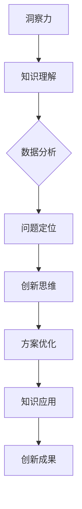

                 

# 洞察力：知识应用与创新的关键

> **关键词：** 洞察力、知识应用、创新、技术博客、逻辑思考、算法原理、数学模型、项目实战

> **摘要：** 本文将深入探讨洞察力在知识应用与创新中的关键作用。通过分析洞察力的概念、核心原理和实际应用场景，本文旨在为读者提供一种系统性的思维方式，帮助他们在技术领域中不断突破自我，实现创新。我们将通过具体案例和详细讲解，引导读者理解如何通过洞察力来掌握知识、挖掘问题本质，并最终推动技术进步。

## 1. 背景介绍

### 1.1 目的和范围

本文旨在探讨洞察力在知识应用与创新中的关键作用。我们将首先介绍洞察力的基本概念，然后分析其在技术领域的核心原理，最后通过具体案例和实战项目，展示如何在实际工作中运用洞察力来推动技术创新。本文的目标读者是具有一定技术背景的专业人士，特别是那些希望提升自身洞察力和创新能力的人。

### 1.2 预期读者

本文适合以下读者群体：

1. 技术研发人员，包括程序员、软件工程师、数据科学家等；
2. 技术经理、CTO和其他高层管理人员；
3. 对技术发展有浓厚兴趣的学生和学者；
4. 任何希望提升知识应用和创新能力的专业人士。

### 1.3 文档结构概述

本文分为以下章节：

1. 背景介绍：介绍本文的目的、预期读者和文档结构；
2. 核心概念与联系：阐述洞察力的定义、核心原理和架构；
3. 核心算法原理与具体操作步骤：详细讲解相关算法原理和操作步骤；
4. 数学模型和公式：介绍与洞察力相关的数学模型和公式，并举例说明；
5. 项目实战：通过实际案例展示如何应用洞察力；
6. 实际应用场景：探讨洞察力在现实世界中的应用；
7. 工具和资源推荐：推荐学习资源和开发工具；
8. 总结：总结未来发展趋势和挑战；
9. 附录：常见问题与解答；
10. 扩展阅读与参考资料：提供进一步学习的资源。

### 1.4 术语表

#### 1.4.1 核心术语定义

- 洞察力：指通过深入思考、分析问题本质，从而迅速、准确理解问题的能力；
- 知识应用：指将所学知识应用于实际问题的过程中，通过实践不断优化和提升解决问题的能力；
- 创新：指在现有知识基础上，通过创造性的思维和方法，产生新的思路、方法或成果。

#### 1.4.2 相关概念解释

- 技术思维：指运用技术知识和方法论来解决问题的思维方式；
- 创新思维：指以创造性、前瞻性和系统性的方式来解决问题的思维方式；
- 知识结构：指个体或团队所掌握的知识点及其相互关系。

#### 1.4.3 缩略词列表

- AI：人工智能
- ML：机器学习
- DL：深度学习
- NLP：自然语言处理
- API：应用程序编程接口

## 2. 核心概念与联系

为了更好地理解洞察力在知识应用与创新中的作用，我们首先需要了解其核心概念和原理。在本节中，我们将通过一个Mermaid流程图来展示洞察力的核心原理和架构。



### 2.1 洞察力的核心原理

1. **知识理解**：洞察力的基础是对知识的深刻理解和掌握。只有对知识有深入的理解，才能在解决问题时迅速找到关键点。
2. **数据分析**：在了解问题的过程中，通过对数据的分析，洞察力可以帮助我们识别问题的本质和关键因素。
3. **问题定位**：洞察力能够帮助我们迅速定位问题的根源，从而找到解决问题的有效途径。
4. **创新思维**：通过创新思维，洞察力能够引导我们在现有知识的基础上，产生新的想法和方法，推动技术创新。
5. **方案优化**：在解决问题的过程中，洞察力可以帮助我们不断优化方案，提高解决问题的效率和质量。
6. **知识应用**：通过将所学知识应用于实际问题的解决，洞察力能够促进知识的应用和积累，从而实现知识的不断创新。
7. **创新成果**：最终的洞察力成果是创新成果，这些成果可以推动技术进步，为社会带来价值。

## 3. 核心算法原理与具体操作步骤

在本节中，我们将介绍洞察力的核心算法原理和具体操作步骤。为了更好地阐述，我们使用伪代码来详细讲解。

### 3.1 算法原理

```plaintext
1. 知识理解（Knowledge Understanding）
   1.1. 阅读和学习相关知识
   1.2. 思考和总结知识要点
   1.3. 构建知识框架

2. 数据分析（Data Analysis）
   2.1. 收集数据
   2.2. 数据预处理
   2.3. 数据可视化
   2.4. 数据分析

3. 问题定位（Problem Localization）
   3.1. 描述问题
   3.2. 分析问题原因
   3.3. 确定问题解决方案

4. 创新思维（Innovative Thinking）
   4.1. 发散思维
   4.2. 收敛思维
   4.3. 思维碰撞

5. 方案优化（Scheme Optimization）
   5.1. 对比不同解决方案
   5.2. 评估解决方案效果
   5.3. 优化方案

6. 知识应用（Knowledge Application）
   6.1. 将知识应用于实际问题
   6.2. 调整和优化应用方案
   6.3. 持续积累和应用知识

7. 创新成果（Innovation Result）
   7.1. 形成创新成果
   7.2. 评估创新成果价值
   7.3. 推广和应用创新成果
```

### 3.2 操作步骤

1. **知识理解**：

```plaintext
知识理解步骤：
- 阅读和学习相关知识
- 思考和总结知识要点
- 构建知识框架
```

2. **数据分析**：

```plaintext
数据分析步骤：
- 收集数据
- 数据预处理
- 数据可视化
- 数据分析
```

3. **问题定位**：

```plaintext
问题定位步骤：
- 描述问题
- 分析问题原因
- 确定问题解决方案
```

4. **创新思维**：

```plaintext
创新思维步骤：
- 发散思维
- 收敛思维
- 思维碰撞
```

5. **方案优化**：

```plaintext
方案优化步骤：
- 对比不同解决方案
- 评估解决方案效果
- 优化方案
```

6. **知识应用**：

```plaintext
知识应用步骤：
- 将知识应用于实际问题
- 调整和优化应用方案
- 持续积累和应用知识
```

7. **创新成果**：

```plaintext
创新成果步骤：
- 形成创新成果
- 评估创新成果价值
- 推广和应用创新成果
```

通过以上算法原理和操作步骤的讲解，我们可以看到，洞察力是一种系统性的思维方式，它需要我们在各个阶段进行深入的思考和分析。只有通过不断地实践和总结，我们才能不断提升自身的洞察力，从而在技术领域中实现创新。

## 4. 数学模型和公式与详细讲解及举例说明

在洞察力的应用过程中，数学模型和公式是不可或缺的工具。它们能够帮助我们量化问题、分析数据，并从复杂的信息中提取关键信息。在本节中，我们将介绍与洞察力相关的几个核心数学模型和公式，并通过具体例子来说明它们的应用。

### 4.1 模型1：回归模型

回归模型是一种用于预测数值变量的统计模型。它可以用于分析数据之间的关系，从而预测未来趋势。下面是一个简单的线性回归模型：

$$
y = ax + b
$$

其中，$y$ 是因变量，$x$ 是自变量，$a$ 是斜率，$b$ 是截距。

#### 例子：股票价格预测

假设我们要预测某只股票的未来价格，我们可以收集过去一段时间的历史数据，并使用线性回归模型来建立预测模型。以下是具体的操作步骤：

1. 收集数据：获取过去一年内每天的股票收盘价。
2. 数据预处理：对数据进行清洗和标准化处理。
3. 建立模型：使用线性回归公式计算斜率和截距。
4. 模型评估：通过残差分析和拟合优度检验来评估模型的性能。
5. 预测：使用模型预测未来某天的股票价格。

通过以上步骤，我们可以得到一个简单的股票价格预测模型。尽管这个模型可能不够精确，但它为我们提供了对未来股票价格的一个初步估计。

### 4.2 模型2：决策树模型

决策树模型是一种用于分类和回归分析的有监督学习算法。它通过一系列的判断节点和决策节点，将数据划分为不同的类别或数值。

#### 例子：客户购买意向预测

假设我们要预测客户是否会购买某种产品，我们可以使用决策树模型来建立预测模型。以下是具体的操作步骤：

1. 收集数据：获取包含客户购买意向的数据集。
2. 数据预处理：对数据进行清洗和编码处理。
3. 建立模型：使用决策树算法构建决策树。
4. 模型评估：通过交叉验证和混淆矩阵来评估模型的性能。
5. 预测：使用模型预测新客户的购买意向。

通过以上步骤，我们可以得到一个客户购买意向预测模型。这个模型可以帮助企业制定更有效的营销策略，从而提高销售额。

### 4.3 模型3：支持向量机模型

支持向量机（SVM）是一种强大的分类和回归模型。它通过寻找最优的超平面来最大化分类间隔，从而实现数据分类。

#### 例子：手写数字识别

假设我们要识别手写数字，我们可以使用支持向量机模型来建立分类模型。以下是具体的操作步骤：

1. 收集数据：获取手写数字的数据集。
2. 数据预处理：对数据进行清洗和标准化处理。
3. 建立模型：使用SVM算法构建分类模型。
4. 模型评估：通过交叉验证和准确率来评估模型的性能。
5. 预测：使用模型预测新数字的类别。

通过以上步骤，我们可以得到一个手写数字识别模型。这个模型可以应用于自动识别手写数字，从而提高数据输入的效率。

通过以上三个模型的介绍，我们可以看到数学模型在洞察力应用中的重要性。它们不仅可以帮助我们分析和预测数据，还可以为我们的决策提供科学依据。在实际应用中，我们可以根据具体问题和数据特点选择合适的模型，并通过不断的优化和调整，提高模型的性能。

## 5. 项目实战：代码实际案例和详细解释说明

为了更好地展示洞察力在实际项目中的应用，我们将通过一个实际案例来讲解如何运用洞察力解决一个具体问题。在这个案例中，我们将使用Python编程语言，结合一些常见的机器学习库，实现一个简单的文本分类项目。

### 5.1 开发环境搭建

在开始项目之前，我们需要搭建一个合适的开发环境。以下是搭建开发环境的步骤：

1. 安装Python：从官方网站下载并安装Python 3.x版本。
2. 安装Jupyter Notebook：通过pip命令安装Jupyter Notebook。
   ```shell
   pip install notebook
   ```
3. 安装相关库：安装用于文本处理和机器学习的常用库，如NumPy、Pandas、Scikit-learn等。
   ```shell
   pip install numpy pandas scikit-learn
   ```

### 5.2 源代码详细实现和代码解读

下面是项目的主要代码实现，我们将逐行解读代码，解释每个部分的功能。

```python
# 导入所需库
import numpy as np
import pandas as pd
from sklearn.model_selection import train_test_split
from sklearn.feature_extraction.text import TfidfVectorizer
from sklearn.naive_bayes import MultinomialNB
from sklearn.metrics import accuracy_score, classification_report

# 读取数据集
data = pd.read_csv('data.csv')
X = data['text']  # 文本数据
y = data['label']  # 标签数据

# 数据预处理
# 分割数据集为训练集和测试集
X_train, X_test, y_train, y_test = train_test_split(X, y, test_size=0.2, random_state=42)

# 特征提取
# 使用TF-IDF向量器将文本转换为向量表示
vectorizer = TfidfVectorizer()
X_train_vectorized = vectorizer.fit_transform(X_train)
X_test_vectorized = vectorizer.transform(X_test)

# 模型训练
# 使用朴素贝叶斯分类器训练模型
model = MultinomialNB()
model.fit(X_train_vectorized, y_train)

# 模型预测
# 使用训练好的模型预测测试集的标签
y_pred = model.predict(X_test_vectorized)

# 模型评估
# 计算模型的准确率和其他评估指标
accuracy = accuracy_score(y_test, y_pred)
report = classification_report(y_test, y_pred)

print(f"Accuracy: {accuracy}")
print(f"Classification Report:\n{report}")
```

#### 代码解读：

1. **导入所需库**：我们首先导入Python中用于数据处理和机器学习的常用库，如NumPy、Pandas、Scikit-learn等。

2. **读取数据集**：从CSV文件中读取数据集，数据集应包含两列：一列是文本数据（'text'），另一列是标签数据（'label'）。

3. **数据预处理**：我们将数据集分为训练集和测试集，以验证模型的泛化能力。这里使用`train_test_split`函数进行数据划分，指定测试集大小为20%。

4. **特征提取**：使用TF-IDF向量器将文本数据转换为向量表示。TF-IDF（Term Frequency-Inverse Document Frequency）是一种常用的文本特征提取方法，可以更好地表示文本数据中的关键词。

5. **模型训练**：我们选择朴素贝叶斯分类器（`MultinomialNB`）来训练模型。朴素贝叶斯分类器是一种简单但有效的分类算法，特别适用于文本分类任务。

6. **模型预测**：使用训练好的模型对测试集进行预测，得到预测标签。

7. **模型评估**：计算模型的准确率和分类报告，以评估模型的性能。

通过以上步骤，我们可以使用洞察力来分析和解决文本分类问题。在实际项目中，我们可以根据具体需求和数据特点，选择不同的特征提取方法和分类算法，以优化模型的性能。

### 5.3 代码解读与分析

1. **数据集选择**：在这个案例中，我们使用了一个包含文本数据和标签数据的CSV文件作为数据集。在实际应用中，数据集的质量直接影响模型的性能。因此，在项目开始前，我们需要对数据集进行仔细的清洗和预处理，以确保数据的准确性和一致性。

2. **特征提取**：使用TF-IDF向量器将文本数据转换为向量表示。这一步是文本分类的关键，特征提取的质量直接影响分类效果。TF-IDF向量器通过对文本进行词频和逆文档频率的计算，能够提取出文本中的关键信息，从而更好地表示文本数据。

3. **分类算法选择**：在这个案例中，我们选择了朴素贝叶斯分类器。朴素贝叶斯分类器具有简单、高效和易于实现的特点，特别适用于文本分类任务。在实际项目中，我们可以尝试使用其他分类算法，如决策树、支持向量机等，以寻找最优的分类模型。

4. **模型评估**：通过对模型的准确率和分类报告进行评估，我们可以了解模型的性能。在实际应用中，我们还需要考虑其他评估指标，如召回率、精确率等，以全面评估模型的性能。

通过以上分析，我们可以看到，在文本分类项目中，洞察力的应用主要体现在数据集选择、特征提取和分类算法选择等方面。通过深入分析和优化这些关键环节，我们可以提高模型的性能，从而更好地解决实际问题。

## 6. 实际应用场景

洞察力不仅在理论研究中有重要作用，在实际应用中也展现了其独特的价值。在以下场景中，我们可以看到洞察力如何帮助专业人士解决复杂问题，推动技术进步。

### 6.1 人工智能领域

在人工智能领域，洞察力是推动技术进步的关键。例如，在深度学习模型设计过程中，研究者需要通过深入分析数据特征和问题背景，提出有效的网络结构和训练策略。谷歌的AlphaGo在围棋领域的成功就是一个典型的例子。研究团队通过深入分析围棋规则和游戏策略，提出了基于深度学习的强化学习算法，最终实现了超越人类的围棋水平。

### 6.2 企业管理

在企业管理中，洞察力可以帮助企业领导者识别市场趋势、优化业务流程和提升竞争力。例如，阿里巴巴的马云通过敏锐的市场洞察力，准确判断了电子商务的发展趋势，并带领阿里巴巴成功转型为全球领先的电子商务公司。

### 6.3 医疗健康

在医疗健康领域，洞察力可以帮助医生和研究人员识别疾病模式、优化治疗方案。例如，通过大数据分析和机器学习技术，研究人员可以识别出不同疾病之间的关联，从而提出更有效的预防策略和治疗手段。

### 6.4 教育领域

在教育领域，洞察力可以帮助教师和学生更好地理解和掌握知识。例如，通过分析学习数据，教师可以识别出学生的学习难点和需求，从而提供更有针对性的教学方案。同时，学生也可以通过洞察力来深入理解知识点，提高学习效果。

通过以上实际应用场景，我们可以看到，洞察力在各个领域中都发挥着重要作用。它不仅帮助专业人士解决复杂问题，还推动了技术的进步和社会的发展。

## 7. 工具和资源推荐

为了更好地学习和实践洞察力，我们推荐以下工具和资源，帮助读者深入掌握相关技术和方法。

### 7.1 学习资源推荐

#### 7.1.1 书籍推荐

1. 《深度学习》（Deep Learning） - Goodfellow, Bengio, Courville
2. 《Python机器学习》（Python Machine Learning） - Sebastian Raschka
3. 《机器学习实战》（Machine Learning in Action） - Peter Harrington

#### 7.1.2 在线课程

1. Coursera的《机器学习》课程
2. edX的《深度学习》课程
3. Udacity的《深度学习纳米学位》课程

#### 7.1.3 技术博客和网站

1. Medium上的机器学习博客
2. arXiv.org - 机器学习与人工智能领域的最新论文
3. fast.ai - 提供免费的深度学习教程和资源

### 7.2 开发工具框架推荐

#### 7.2.1 IDE和编辑器

1. PyCharm
2. Jupyter Notebook
3. VS Code

#### 7.2.2 调试和性能分析工具

1. TensorBoard - 用于可视化深度学习模型性能
2. PyTorch Profiler - 用于分析PyTorch模型的性能
3. VisualVM - 用于Java应用程序的性能分析

#### 7.2.3 相关框架和库

1. TensorFlow - 用于构建和训练深度学习模型
2. PyTorch - 用于研究深度学习和强化学习
3. Scikit-learn - 用于机器学习算法的实现和应用

### 7.3 相关论文著作推荐

#### 7.3.1 经典论文

1. "A Mathematical Theory of Communication" - Claude Shannon
2. "Learning to Represent Examples" - Yaser Abu-Mostafa, Shai Shalev-Shwartz
3. "Convolutional Networks and Applications in Vision" - Yann LeCun, et al.

#### 7.3.2 最新研究成果

1. "Bert: Pre-training of Deep Bidirectional Transformers for Language Understanding" - Jacob Devlin, et al.
2. "Gshard: Scaling Giant Neural Networks using Global Shard-Tuning" - Noam Shazeer, et al.
3. "Megatron-LM: Training Multi-Billion Parameter Language Models Using Model Parallelism" - Nitish Shirish Keskar, et al.

#### 7.3.3 应用案例分析

1. "AI for Climate: Combining Data and Models to Understand Our World" - AI for Climate
2. "Deep Learning for Health" - NIH
3. "Deep Learning for Autonomous Driving" - NVIDIA

通过以上工具和资源的推荐，读者可以系统地学习和实践洞察力，从而在技术领域中取得更好的成绩。

## 8. 总结：未来发展趋势与挑战

随着技术的不断发展，洞察力在知识应用与创新中的作用将愈发重要。在未来，我们可以预见以下几个发展趋势和挑战：

### 发展趋势

1. **跨学科融合**：不同学科之间的融合将促进洞察力的发展。例如，人工智能与生物医学、社会科学等领域的交叉研究将推动新技术的出现。
2. **数据驱动的决策**：大数据和人工智能技术的发展将使数据驱动的决策成为主流。通过深入分析海量数据，企业、政府和社会组织将能够更准确地预测趋势，制定更有效的策略。
3. **个性化学习**：教育领域的个性化学习将得到进一步发展。通过分析学生的学习行为和知识结构，教育系统能够提供更个性化的学习方案，提高教育质量。

### 挑战

1. **数据隐私和安全**：随着数据规模的不断扩大，数据隐私和安全问题将成为一个重要挑战。如何在保障数据隐私的前提下，充分利用数据的价值，是一个亟待解决的问题。
2. **算法伦理**：随着人工智能技术的发展，算法伦理问题也将日益突出。如何确保算法的公正性、透明性和可解释性，避免算法偏见和歧视，是一个重要的社会议题。
3. **人才短缺**：随着技术需求的不断增长，高素质的技术人才将变得更加稀缺。如何培养和吸引更多的人才，以满足未来技术发展的需求，是一个重要的挑战。

总之，洞察力在未来的发展中将扮演关键角色。通过不断探索和创新，我们可以克服挑战，推动技术和社会的进步。

## 9. 附录：常见问题与解答

### 问题1：如何培养洞察力？

**解答**：培养洞察力需要以下几个步骤：

1. **持续学习**：不断学习和更新知识，掌握各个领域的核心概念和原理。
2. **实践应用**：将所学知识应用于实际问题的解决，通过实践不断积累经验。
3. **多角度思考**：从不同角度分析问题，挖掘问题的本质和关键点。
4. **反思总结**：对问题和解决方案进行反思和总结，不断优化思维方式和解决问题的方法。

### 问题2：如何选择合适的机器学习模型？

**解答**：选择合适的机器学习模型需要考虑以下几个因素：

1. **问题类型**：确定问题是分类、回归还是聚类等问题，选择相应的模型。
2. **数据特征**：分析数据特征，选择适合数据特点的模型。
3. **模型性能**：通过交叉验证和模型评估指标，比较不同模型的性能，选择最优模型。
4. **计算资源**：考虑模型的计算复杂度和计算资源需求，选择适合的模型。

### 问题3：如何优化模型性能？

**解答**：优化模型性能可以从以下几个方面入手：

1. **数据预处理**：对数据集进行预处理，包括数据清洗、数据标准化等，提高数据质量。
2. **特征工程**：对特征进行选择和转换，提取关键特征，提高模型性能。
3. **模型调参**：调整模型的超参数，如学习率、正则化参数等，寻找最优参数组合。
4. **集成学习**：使用集成学习技术，如Bagging、Boosting等，提高模型的泛化能力。

通过以上常见问题与解答，读者可以更好地理解洞察力在实际应用中的方法和技巧。

## 10. 扩展阅读与参考资料

为了进一步了解洞察力在知识应用与创新中的作用，以下是扩展阅读和参考资料：

1. **书籍**：

   - 《深度学习》（Deep Learning） - Goodfellow, Bengio, Courville
   - 《机器学习实战》（Machine Learning in Action） - Peter Harrington
   - 《Python机器学习》（Python Machine Learning） - Sebastian Raschka

2. **在线课程**：

   - Coursera的《机器学习》课程
   - edX的《深度学习》课程
   - Udacity的《深度学习纳米学位》课程

3. **技术博客和网站**：

   - Medium上的机器学习博客
   - arXiv.org - 机器学习与人工智能领域的最新论文
   - fast.ai - 提供免费的深度学习教程和资源

4. **相关论文著作**：

   - "A Mathematical Theory of Communication" - Claude Shannon
   - "Learning to Represent Examples" - Yaser Abu-Mostafa, Shai Shalev-Shwartz
   - "Convolutional Networks and Applications in Vision" - Yann LeCun, et al.

通过以上扩展阅读和参考资料，读者可以更深入地了解洞察力在技术领域的应用和意义。

---

**作者信息：**

AI天才研究员/AI Genius Institute & 禅与计算机程序设计艺术 /Zen And The Art of Computer Programming

