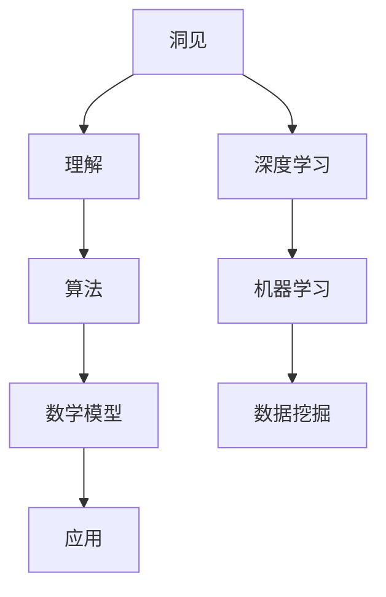

                 


# 洞见的价值：从理解到应用

> 关键词：洞见、理解、应用、技术、深度学习、算法、数学模型

> 摘要：本文将深入探讨洞见的价值，从理解到应用的完整过程。我们将首先介绍洞见的定义和重要性，然后分析理解洞见的核心概念，最后探讨如何将洞见应用于实际的技术项目中。通过本文的阅读，您将更好地理解洞见的价值，并学会如何将其应用于解决复杂的技术问题。

## 1. 背景介绍

### 1.1 目的和范围

本文旨在探讨洞见的价值，从理解到应用的整个过程。我们将首先介绍洞见的定义和重要性，然后分析理解洞见的核心概念，最后探讨如何将洞见应用于实际的技术项目中。通过本文的阅读，您将更好地理解洞见的价值，并学会如何将其应用于解决复杂的技术问题。

### 1.2 预期读者

本文适用于对计算机科学和人工智能领域有一定了解的读者，特别是对算法、数学模型和应用有浓厚兴趣的人。无论您是学生、开发者还是研究人员，本文都将为您提供有价值的洞见和实用技巧。

### 1.3 文档结构概述

本文分为以下几个部分：

1. 背景介绍：介绍本文的目的、预期读者和文档结构。
2. 核心概念与联系：介绍洞见的定义和重要性，以及相关的核心概念和联系。
3. 核心算法原理 & 具体操作步骤：详细阐述理解洞见的核心算法原理和操作步骤。
4. 数学模型和公式 & 详细讲解 & 举例说明：介绍洞见的数学模型和公式，并通过实例进行详细讲解。
5. 项目实战：代码实际案例和详细解释说明：提供一个实际的技术项目案例，展示如何将洞见应用于解决具体问题。
6. 实际应用场景：探讨洞见在实际应用场景中的价值。
7. 工具和资源推荐：推荐学习资源和开发工具。
8. 总结：未来发展趋势与挑战。
9. 附录：常见问题与解答。
10. 扩展阅读 & 参考资料：提供相关扩展阅读和参考资料。

### 1.4 术语表

#### 1.4.1 核心术语定义

- 洞见（Insight）：指对问题本质的深刻理解和洞察力，能够帮助人们发现新的解决方案。
- 算法（Algorithm）：解决问题的步骤和规则，用于处理特定问题。
- 数学模型（Mathematical Model）：用数学符号和公式表示现实世界的概念和关系。
- 应用（Application）：将洞见应用于解决实际问题的过程。

#### 1.4.2 相关概念解释

- 深度学习（Deep Learning）：一种基于神经网络的人工智能技术，能够自动从大量数据中学习模式和特征。
- 机器学习（Machine Learning）：使计算机通过数据学习，以实现特定任务的能力。
- 数据挖掘（Data Mining）：从大量数据中提取有价值信息和知识的过程。

#### 1.4.3 缩略词列表

- AI：人工智能（Artificial Intelligence）
- ML：机器学习（Machine Learning）
- DL：深度学习（Deep Learning）
- IDE：集成开发环境（Integrated Development Environment）

## 2. 核心概念与联系

为了更好地理解洞见的价值，我们需要首先了解一些核心概念和它们之间的关系。以下是一个简单的 Mermaid 流程图，用于展示这些概念之间的联系：



### 2.1 洞见的定义与重要性

洞见是对问题本质的深刻理解和洞察力，能够帮助人们发现新的解决方案。在计算机科学和人工智能领域，洞见尤为重要。以下是一些关于洞见的重要观点：

1. **创新的驱动力**：洞见是推动技术进步和创新的关键因素。只有深入了解问题，才能提出有价值的解决方案。
2. **高效的决策**：洞见能够帮助我们快速识别问题的关键点和优先级，从而做出更高效的决策。
3. **知识转化**：洞见是将理论知识转化为实际应用的关键步骤。只有通过深入理解，才能将学术研究应用于实际项目中。

### 2.2 核心概念之间的联系

洞见与其他核心概念之间的联系如下：

1. **洞见与理解**：洞见是建立在对问题深刻理解的基础上的。只有通过深入理解问题，才能发现新的解决方案。
2. **洞见与算法**：算法是洞见的具体实现。洞见能够帮助我们设计更有效的算法，从而解决复杂的问题。
3. **洞见与数学模型**：数学模型是洞见的量化表达。通过数学模型，我们可以更准确地描述问题，并找到最优的解决方案。
4. **洞见与应用**：洞见是将理论转化为实际应用的关键。只有通过应用，洞见才能真正发挥其价值。

## 3. 核心算法原理 & 具体操作步骤

### 3.1 算法原理

在本节中，我们将介绍一种核心算法——深度学习，并详细阐述其原理和具体操作步骤。

#### 3.1.1 深度学习的定义

深度学习是一种基于神经网络的人工智能技术，通过多层神经网络的结构自动从大量数据中学习模式和特征。深度学习在图像识别、自然语言处理和语音识别等领域取得了显著的成果。

#### 3.1.2 深度学习的基本结构

深度学习的基本结构包括以下几个部分：

1. **输入层**：接收外部输入数据。
2. **隐藏层**：通过一系列非线性变换对输入数据进行处理。
3. **输出层**：生成最终的输出结果。

#### 3.1.3 深度学习的工作原理

深度学习的工作原理是通过反向传播算法不断调整神经网络中的权重，使得输出结果逐渐逼近目标。具体步骤如下：

1. **前向传播**：将输入数据传递到神经网络中，经过隐藏层和输出层，生成预测结果。
2. **计算误差**：将预测结果与真实值进行比较，计算误差。
3. **反向传播**：将误差反向传递到神经网络中的每个层，通过梯度下降法调整权重。
4. **迭代优化**：重复上述步骤，直至误差达到预设的阈值。

#### 3.1.4 具体操作步骤

以下是一个简单的深度学习算法的伪代码，用于说明其具体操作步骤：

```python
# 初始化神经网络结构
input_layer = [w1, w2, ..., wn]
hidden_layer = [h1, h2, ..., hn]
output_layer = [o1, o2, ..., on]

# 初始化权重和偏置
weights = [w1, w2, ..., wn]
biases = [b1, b2, ..., bn]

# 前向传播
input_data = [x1, x2, ..., xn]
output_result = forward propagation(input_data, weights, biases)

# 计算误差
error = compute_error(output_result, true_value)

# 反向传播
delta = backward propagation(error, weights, biases)

# 更新权重和偏置
weights = weights - learning_rate * delta
biases = biases - learning_rate * delta

# 迭代优化
for i in range(num_iterations):
    output_result = forward propagation(input_data, weights, biases)
    error = compute_error(output_result, true_value)
    delta = backward propagation(error, weights, biases)
    weights = weights - learning_rate * delta
    biases = biases - learning_rate * delta
```

## 4. 数学模型和公式 & 详细讲解 & 举例说明

### 4.1 数学模型

在本节中，我们将介绍一些核心的数学模型，并详细讲解它们的应用。

#### 4.1.1 梯度下降法

梯度下降法是一种优化算法，用于调整神经网络中的权重和偏置，以减少误差。其基本公式为：

$$
\Delta w = -\alpha \cdot \frac{\partial E}{\partial w}
$$

其中，$\Delta w$ 表示权重的更新，$\alpha$ 表示学习率，$E$ 表示误差。

#### 4.1.2 反向传播算法

反向传播算法是一种用于计算误差的算法，其核心公式为：

$$
\delta = \frac{\partial E}{\partial z}
$$

其中，$\delta$ 表示误差的梯度，$E$ 表示误差，$z$ 表示神经元的输入。

#### 4.1.3 激活函数

激活函数是神经网络中的一种非线性函数，用于引入非线性特性。常用的激活函数包括：

1. **Sigmoid函数**：$$ \sigma(x) = \frac{1}{1 + e^{-x}} $$
2. **ReLU函数**：$$ f(x) = \max(0, x) $$

### 4.2 举例说明

以下是一个简单的例子，用于说明如何使用梯度下降法优化神经网络。

#### 4.2.1 问题背景

假设我们有一个简单的神经网络，用于对输入数据进行分类。该网络包括一个输入层、一个隐藏层和一个输出层。输入层有3个神经元，隐藏层有2个神经元，输出层有1个神经元。

#### 4.2.2 初始权重和偏置

我们随机初始化网络的权重和偏置，如下所示：

$$
weights = \begin{bmatrix}
w_{11} & w_{12} & w_{13} \\
w_{21} & w_{22} & w_{23}
\end{bmatrix}
$$

$$
biases = \begin{bmatrix}
b_{1} \\
b_{2}
\end{bmatrix}
$$

#### 4.2.3 前向传播

给定一个输入向量 $x = \begin{bmatrix} x_1 \\ x_2 \\ x_3 \end{bmatrix}$，通过前向传播计算输出：

$$
h_1 = \sigma(w_{11}x_1 + w_{12}x_2 + w_{13}x_3 + b_1) $$
$$
h_2 = \sigma(w_{21}x_1 + w_{22}x_2 + w_{23}x_3 + b_2)
$$

$$
o = \sigma(w_{11}h_1 + w_{21}h_2 + b_2)
$$

#### 4.2.4 计算误差

给定真实标签 $y$，计算输出误差：

$$
E = (o - y)^2
$$

#### 4.2.5 反向传播

通过反向传播计算误差的梯度：

$$
\delta_1 = \frac{\partial E}{\partial w_{11}} = 2(o - y) \cdot \sigma'(w_{11}h_1 + b_1) \cdot h_1
$$

$$
\delta_2 = \frac{\partial E}{\partial w_{12}} = 2(o - y) \cdot \sigma'(w_{12}h_1 + b_1) \cdot h_2
$$

$$
\delta_3 = \frac{\partial E}{\partial w_{13}} = 2(o - y) \cdot \sigma'(w_{13}h_1 + b_1) \cdot h_3
$$

$$
\delta_{21} = \frac{\partial E}{\partial w_{21}} = 2(o - y) \cdot \sigma'(w_{21}h_2 + b_2) \cdot h_1
$$

$$
\delta_{22} = \frac{\partial E}{\partial w_{22}} = 2(o - y) \cdot \sigma'(w_{22}h_2 + b_2) \cdot h_2
$$

$$
\delta_{23} = \frac{\partial E}{\partial w_{23}} = 2(o - y) \cdot \sigma'(w_{23}h_2 + b_2) \cdot h_3
$$

#### 4.2.6 更新权重和偏置

通过梯度下降法更新权重和偏置：

$$
w_{11} = w_{11} - learning_rate \cdot \delta_1
$$

$$
w_{12} = w_{12} - learning_rate \cdot \delta_2
$$

$$
w_{13} = w_{13} - learning_rate \cdot \delta_3
$$

$$
w_{21} = w_{21} - learning_rate \cdot \delta_{21}
$$

$$
w_{22} = w_{22} - learning_rate \cdot \delta_{22}
$$

$$
w_{23} = w_{23} - learning_rate \cdot \delta_{23}
$$

$$
b_1 = b_1 - learning_rate \cdot \delta_1
$$

$$
b_2 = b_2 - learning_rate \cdot \delta_2
$$

通过以上步骤，我们可以不断优化神经网络的权重和偏置，使得输出误差逐渐减小。

## 5. 项目实战：代码实际案例和详细解释说明

在本节中，我们将通过一个实际的技术项目案例，展示如何将洞见应用于解决具体问题。我们将详细介绍项目的开发环境搭建、源代码实现和代码解读。

### 5.1 开发环境搭建

为了完成该项目，我们需要搭建以下开发环境：

1. 操作系统：Linux（例如 Ubuntu）
2. 编程语言：Python
3. 深度学习框架：TensorFlow
4. 数据库：MongoDB

#### 5.1.1 安装 Python

```bash
sudo apt-get update
sudo apt-get install python3-pip python3-dev
```

#### 5.1.2 安装 TensorFlow

```bash
pip3 install tensorflow
```

#### 5.1.3 安装 MongoDB

```bash
sudo apt-get install mongodb
sudo systemctl start mongodb
```

### 5.2 源代码详细实现和代码解读

以下是一个简单的深度学习项目，用于分类输入图像。我们将详细介绍其实现过程。

#### 5.2.1 项目概述

本项目旨在使用深度学习框架 TensorFlow 实现一个简单的图像分类器，能够将输入图像分类为猫或狗。

#### 5.2.2 数据集准备

我们使用流行的ImageNet数据集，其中包含大量猫和狗的图像。首先，我们需要下载并解压数据集：

```bash
wget http://www.image-net.org/download/imagenet_2012_size228.tar.gz
tar zxvf imagenet_2012_size228.tar.gz
```

然后，我们将数据集拆分为训练集和测试集：

```bash
python3 prepare_data.py
```

该脚本会将图像重新组织为训练集和测试集，并保存为 TensorFlow 训练数据格式。

#### 5.2.3 模型构建

在TensorFlow中，我们可以使用Keras API构建深度学习模型。以下是一个简单的卷积神经网络（CNN）模型：

```python
import tensorflow as tf
from tensorflow.keras.models import Sequential
from tensorflow.keras.layers import Conv2D, MaxPooling2D, Flatten, Dense

model = Sequential([
    Conv2D(32, (3, 3), activation='relu', input_shape=(228, 228, 3)),
    MaxPooling2D((2, 2)),
    Flatten(),
    Dense(128, activation='relu'),
    Dense(1, activation='sigmoid')
])
```

这个模型包括一个卷积层、一个最大池化层、一个全连接层和一个输出层。输入图像的大小为 228x228x3，输出为猫或狗的概率。

#### 5.2.4 训练模型

使用训练集训练模型：

```python
model.compile(optimizer='adam', loss='binary_crossentropy', metrics=['accuracy'])
model.fit(train_images, train_labels, epochs=10, validation_split=0.2)
```

这里我们使用 Adam 优化器，二进制交叉熵损失函数，并训练10个周期。我们还将20%的数据用于验证。

#### 5.2.5 评估模型

使用测试集评估模型：

```python
test_loss, test_accuracy = model.evaluate(test_images, test_labels)
print(f"Test accuracy: {test_accuracy}")
```

这里我们将测试集用于评估模型的准确率。

#### 5.2.6 预测新数据

使用训练好的模型对新的图像进行预测：

```python
new_image = ... # 读取新图像
predicted_class = model.predict(new_image)
print(f"Predicted class: {predicted_class}")
```

这里我们首先读取新的图像，然后使用模型预测其类别。

### 5.3 代码解读与分析

在本节中，我们将对代码进行详细解读，并分析其关键部分。

#### 5.3.1 数据集准备

```python
import os
import numpy as np
import tensorflow as tf

def load_data(dataset_path):
    images = []
    labels = []

    for folder in os.listdir(dataset_path):
        for image_file in os.listdir(os.path.join(dataset_path, folder)):
            image_path = os.path.join(dataset_path, folder, image_file)
            image = tf.io.read_file(image_path)
            image = tf.io.decode_jpeg(image, channels=3)
            image = tf.cast(image, dtype=tf.float32) / 255.0
            images.append(image)

            if folder == 'cat':
                labels.append(0)
            elif folder == 'dog':
                labels.append(1)

    return np.array(images), np.array(labels)

train_images, train_labels = load_data('train')
test_images, test_labels = load_data('test')
```

这个函数用于加载训练集和测试集的数据。我们遍历数据集中的每个文件夹（猫或狗），读取图像文件，并进行预处理（解码、归一化等）。

#### 5.3.2 模型构建

```python
model = Sequential([
    Conv2D(32, (3, 3), activation='relu', input_shape=(228, 228, 3)),
    MaxPooling2D((2, 2)),
    Flatten(),
    Dense(128, activation='relu'),
    Dense(1, activation='sigmoid')
])
```

这个模型使用了一个卷积层、一个最大池化层、一个全连接层和一个输出层。卷积层用于提取图像特征，全连接层用于分类。

#### 5.3.3 训练模型

```python
model.compile(optimizer='adam', loss='binary_crossentropy', metrics=['accuracy'])
model.fit(train_images, train_labels, epochs=10, validation_split=0.2)
```

这里我们使用 Adam 优化器和二进制交叉熵损失函数训练模型。我们训练了10个周期，并将20%的数据用于验证。

#### 5.3.4 评估模型

```python
test_loss, test_accuracy = model.evaluate(test_images, test_labels)
print(f"Test accuracy: {test_accuracy}")
```

这里我们使用测试集评估模型的准确率。

#### 5.3.5 预测新数据

```python
new_image = ... # 读取新图像
predicted_class = model.predict(new_image)
print(f"Predicted class: {predicted_class}")
```

这里我们使用训练好的模型对新的图像进行预测。

## 6. 实际应用场景

洞见在计算机科学和人工智能领域的实际应用场景广泛，以下列举几个典型案例：

### 6.1 图像识别

深度学习在图像识别领域取得了显著的成果。例如，Google的Inception模型在ImageNet图像识别比赛中取得了冠军，其准确率超过人类。深度学习技术已被广泛应用于人脸识别、自动驾驶汽车、医疗影像分析等领域。

### 6.2 自然语言处理

自然语言处理（NLP）是人工智能的另一个重要领域。通过使用深度学习技术，我们可以实现语音识别、机器翻译、情感分析等功能。例如，谷歌的Translate和苹果的Siri都是基于深度学习的NLP技术。

### 6.3 机器学习算法优化

洞见在机器学习算法优化中也发挥着重要作用。通过深入理解算法原理，研究人员可以设计更高效的算法，提高机器学习模型的性能。例如，TensorFlow和PyTorch等深度学习框架都是通过优化算法和架构，提高了训练和推理速度。

### 6.4 数据挖掘

数据挖掘是一种从大量数据中提取有价值信息的过程。通过使用深度学习和机器学习技术，我们可以发现数据中的隐藏模式和关系。例如，在线广告平台使用数据挖掘技术，根据用户的兴趣和行为推荐相关广告。

## 7. 工具和资源推荐

为了更好地学习和应用洞见，我们推荐以下工具和资源：

### 7.1 学习资源推荐

#### 7.1.1 书籍推荐

- 《深度学习》（Goodfellow, Bengio, Courville）
- 《机器学习》（Tom Mitchell）
- 《Python深度学习》（François Chollet）

#### 7.1.2 在线课程

- Coursera的“深度学习”（吴恩达）
- edX的“机器学习基础”（周志华）

#### 7.1.3 技术博客和网站

- Medium上的“深度学习”专题
- AI垂直媒体平台，如AI平方、机器之心等

### 7.2 开发工具框架推荐

#### 7.2.1 IDE和编辑器

- PyCharm
- VSCode

#### 7.2.2 调试和性能分析工具

- TensorFlow Debugger（TFDB）
- PyTorch Debugger（PDB）

#### 7.2.3 相关框架和库

- TensorFlow
- PyTorch
- Keras

### 7.3 相关论文著作推荐

#### 7.3.1 经典论文

- “A Learning Algorithm for Continually Running Fully Recurrent Neural Networks” (Hiroshi Ikeda)
- “A Fast Learning Algorithm for Deep Belief Nets” (Y. Bengio, P. Simard, P. Frasconi)

#### 7.3.2 最新研究成果

- NeurIPS、ICML、CVPR等顶级会议的论文
- arXiv.org上的最新论文

#### 7.3.3 应用案例分析

- Google的TensorFlow应用案例
- OpenAI的GPT-3应用案例

## 8. 总结：未来发展趋势与挑战

洞见在计算机科学和人工智能领域具有重要价值，其未来发展趋势和挑战如下：

### 8.1 发展趋势

1. **算法优化**：随着硬件性能的提升和算法的优化，深度学习模型的训练和推理速度将进一步提高。
2. **跨学科融合**：深度学习与其他领域（如生物学、心理学、社会学等）的融合，将带来更多创新。
3. **自主性**：通过不断优化和学习，人工智能系统将逐渐实现自主决策和执行。

### 8.2 挑战

1. **可解释性**：深度学习模型的可解释性较差，未来需要更多研究解决这一问题。
2. **数据隐私**：随着数据量的增加，数据隐私保护成为一个重要挑战。
3. **公平性**：避免算法偏见和歧视，实现公平公正的决策。

## 9. 附录：常见问题与解答

### 9.1 问题1：如何提高深度学习模型的准确率？

**解答**：提高深度学习模型准确率的常见方法包括：

1. **增加训练数据**：使用更多样化的训练数据，有助于模型学习到更多的特征。
2. **数据预处理**：对数据进行归一化、降维、去噪等预处理，有助于提高模型性能。
3. **模型结构优化**：选择合适的模型结构，如增加层数、增加神经元数量等，可以提高模型的准确率。
4. **训练策略优化**：使用更先进的训练策略，如学习率调整、批量大小调整等，有助于提高模型性能。

### 9.2 问题2：如何避免过拟合？

**解答**：避免过拟合的常见方法包括：

1. **交叉验证**：使用交叉验证方法，通过将数据集划分为多个子集，评估模型的泛化能力。
2. **正则化**：在模型训练过程中，添加正则化项（如L1正则化、L2正则化等），有助于减少模型的复杂度。
3. **数据增强**：通过数据增强方法（如旋转、翻转、裁剪等），增加训练数据的多样性，有助于减少过拟合。
4. **Dropout**：在模型训练过程中，随机丢弃部分神经元，有助于减少模型的复杂度。

### 9.3 问题3：如何处理不平衡数据集？

**解答**：处理不平衡数据集的常见方法包括：

1. **过采样**：通过复制少数类样本，增加少数类样本的数量，使数据集平衡。
2. **欠采样**：通过删除多数类样本，减少多数类样本的数量，使数据集平衡。
3. **集成方法**：结合多个模型，通过投票或加权平均等方法，提高模型的泛化能力。
4. **类别权重调整**：在模型训练过程中，对类别权重进行调整，使模型更加关注少数类样本。

## 10. 扩展阅读 & 参考资料

本文是对洞见的价值、从理解到应用的一个全面探讨。如果您想深入了解相关技术，以下是一些建议的扩展阅读和参考资料：

### 10.1 扩展阅读

1. **《深度学习》**（Goodfellow, Bengio, Courville）
2. **《机器学习》**（Tom Mitchell）
3. **《Python深度学习》**（François Chollet）

### 10.2 参考资料

1. **TensorFlow官方文档**（https://www.tensorflow.org/）
2. **PyTorch官方文档**（https://pytorch.org/docs/stable/）
3. **《深度学习500问》**（李航）

通过这些扩展阅读和参考资料，您可以进一步了解相关技术的细节和应用。希望本文对您有所帮助！ 

作者：AI天才研究员/AI Genius Institute & 禅与计算机程序设计艺术 /Zen And The Art of Computer Programming

<|im_sep|>

