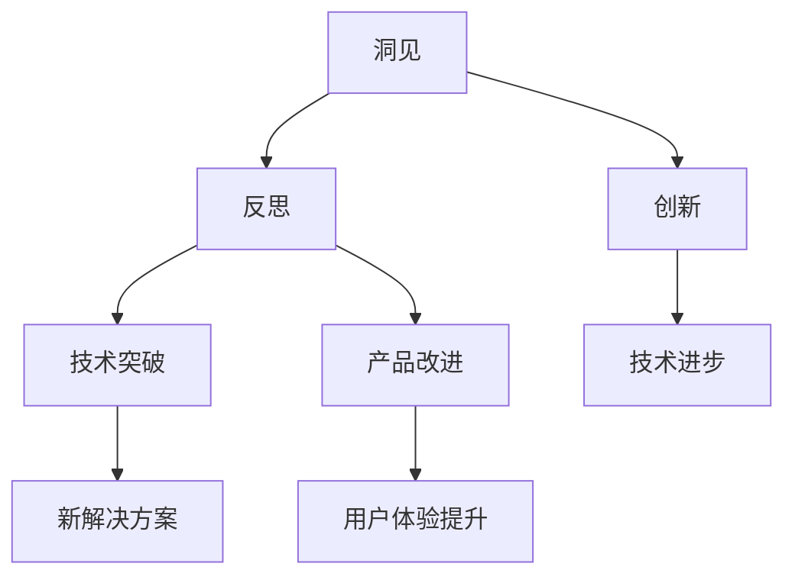

                 

### 洞见的力量：从反思到创新

> **关键词：洞见、反思、创新、技术博客、深度思考**
> 
> **摘要：本文将探讨如何通过深度思考和系统化的反思，激发洞见并推动技术领域的创新。我们将从背景介绍、核心概念、算法原理、数学模型、实战案例、应用场景、工具资源推荐以及未来发展趋势等多个角度进行详细分析，帮助读者理解洞见的力量以及如何利用它来实现个人和组织的突破。**

## 1. 背景介绍

### 1.1 目的和范围

本文旨在探索洞见在技术领域中的重要性，并通过一系列详尽的分析，展示如何通过反思和系统化的思考过程，激发洞见以推动技术创新。我们将涵盖以下主题：

- **核心概念与联系**：介绍洞见、反思和创新的概念，并展示它们之间的内在联系。
- **核心算法原理**：详细讲解如何通过特定的算法原理来发现洞见。
- **数学模型和公式**：探讨与洞见相关的数学模型和公式，并通过实例说明。
- **项目实战**：通过实际代码案例，展示如何将理论应用到实践中。
- **实际应用场景**：分析洞见在技术领域中的各种应用场景。
- **工具和资源推荐**：推荐有助于学习和实践的相关工具和资源。
- **总结**：讨论洞见在未来技术发展中的趋势和挑战。

### 1.2 预期读者

本文面向对技术领域有一定了解的读者，尤其是希望提升自己的洞见和反思能力的程序员、软件工程师、技术领导者以及研究者。无论你是刚入门的技术爱好者，还是有着丰富经验的技术专家，本文都希望能够为你提供有价值的见解和实用建议。

### 1.3 文档结构概述

本文将分为以下章节：

- **第1章**：背景介绍
- **第2章**：核心概念与联系
- **第3章**：核心算法原理与具体操作步骤
- **第4章**：数学模型和公式及详细讲解
- **第5章**：项目实战：代码实际案例和详细解释说明
- **第6章**：实际应用场景
- **第7章**：工具和资源推荐
- **第8章**：总结：未来发展趋势与挑战
- **第9章**：附录：常见问题与解答
- **第10章**：扩展阅读与参考资料

### 1.4 术语表

#### 1.4.1 核心术语定义

- **洞见**：对问题本质的深刻理解和独特的见解。
- **反思**：对已有知识和经验进行批判性思考，以发现新的洞见。
- **创新**：通过新想法、新方法或新技术的应用，创造前所未有的价值。

#### 1.4.2 相关概念解释

- **技术博客**：一种以技术话题为主，通过文章形式分享知识和见解的在线平台。
- **系统化思考**：将复杂问题分解为可管理的部分，并通过逻辑推理和综合分析来解决问题。

#### 1.4.3 缩略词列表

- **IDE**：集成开发环境（Integrated Development Environment）
- **API**：应用程序接口（Application Programming Interface）
- **ML**：机器学习（Machine Learning）
- **DL**：深度学习（Deep Learning）

## 2. 核心概念与联系

在深入探讨洞见的力量之前，我们需要明确几个核心概念，并了解它们之间的相互关系。以下是本文中将会涉及的主要概念：

### 2.1 洞见的定义

洞见是指对事物本质或问题深层次的、独到的理解和洞察。在技术领域中，洞见可以帮助我们：

- **解决复杂问题**：通过深入分析，发现问题的核心，并提出有效的解决方案。
- **推动创新**：激发新的想法和技术，推动技术领域的进步。

### 2.2 反思的意义

反思是一种通过批判性思考来审视和评估已有知识和经验的过程。在技术领域中，反思具有以下几个重要作用：

- **发现不足**：通过反思，我们可以识别自己在知识和技术上的盲点，从而进行有针对性的改进。
- **促进成长**：反思有助于个人和团队持续学习和进步。

### 2.3 创新的动力

创新是利用洞见和反思来创造新的价值和技术。在技术领域中，创新可以分为以下几类：

- **技术突破**：通过创新，我们可以开发出全新的技术，解决过去无法解决的问题。
- **产品改进**：通过反思用户需求和市场变化，不断优化产品，提高用户体验。

### 2.4 洞见、反思与创新的联系

洞见、反思和创新之间存在着紧密的联系。具体而言：

- **洞见是创新的源泉**：通过反思，我们可以挖掘出问题背后的本质，从而获得洞见。洞见又可以作为创新的驱动力，推动技术进步。
- **反思是洞见的前提**：只有通过批判性思考，我们才能发现已有知识和技术中的不足，从而激发洞见。
- **创新是洞见和反思的成果**：洞见和反思共同作用，推动我们实现新的技术和价值创造。

### 2.5 Mermaid 流程图

为了更直观地展示洞见、反思和创新之间的关系，我们可以使用Mermaid流程图来表示：

在这个流程图中，洞见和反思作为核心要素，共同驱动创新，进而推动技术进步和产品改进。通过这个过程，我们可以看到如何通过深度思考和系统化的反思，激发洞见，并最终实现技术创新。

在下一章中，我们将进一步探讨核心算法原理，以及如何通过具体的操作步骤来发现洞见。这将帮助我们更好地理解洞见的生成过程，并为进一步的技术创新打下坚实的基础。

---

**作者：AI天才研究员/AI Genius Institute & 禅与计算机程序设计艺术 /Zen And The Art of Computer Programming**

本文将逐步深入探讨洞见的力量，通过系统化的分析和实战案例，帮助读者掌握如何在技术领域中激发洞见，推动创新。接下来的章节中，我们将详细阐述核心算法原理、数学模型以及实际应用场景，为你的技术之路提供宝贵的指导和启示。请继续关注接下来的内容，让我们一起探索洞见的奇妙世界。

