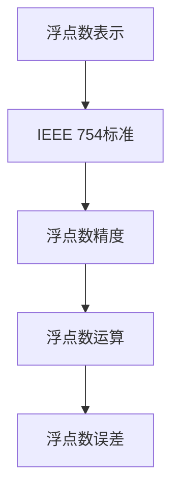

                 

# 浮点数精度：AI计算中的双刃剑

## 关键词
* 浮点数精度
* AI计算
* 双刃剑
* 算法原理
* 数学模型
* 项目实战
* 应用场景
* 发展趋势

## 摘要
本文将深入探讨浮点数精度在人工智能计算中的重要性及其潜在问题。浮点数是计算机中表示实数的一种常见方式，但在高精度计算中可能会引入误差，影响算法的准确性和效率。本文首先介绍浮点数的背景知识，然后详细分析其精度问题，通过算法原理和数学模型来揭示问题根源，并通过实际项目案例讲解如何优化浮点数计算。最后，本文将展望浮点数精度在AI计算中的未来发展趋势和面临的挑战。

## 1. 背景介绍

### 1.1 目的和范围
本文旨在深入探讨浮点数精度在人工智能计算中的重要性及其影响，通过分析浮点数的原理、精度问题以及解决方案，帮助读者更好地理解并优化浮点数计算在AI领域的应用。本文将涵盖以下主要内容：

1. 浮点数的背景知识
2. 浮点数精度问题及其影响
3. 浮点数算法原理与数学模型
4. 浮点数计算优化实践
5. 浮点数精度在AI计算中的应用场景
6. 浮点数精度的发展趋势与挑战

### 1.2 预期读者
本文主要面向对AI计算有一定了解的技术人员，包括AI工程师、算法研究员、软件开发者等。读者需要具备一定的计算机科学和数学基础，以便更好地理解本文的内容。

### 1.3 文档结构概述
本文分为十个部分，具体结构如下：

1. 引言
2. 背景介绍
3. 核心概念与联系
4. 核心算法原理与具体操作步骤
5. 数学模型与公式详细讲解
6. 项目实战：代码实际案例和详细解释说明
7. 实际应用场景
8. 工具和资源推荐
9. 总结：未来发展趋势与挑战
10. 附录：常见问题与解答
11. 扩展阅读与参考资料

### 1.4 术语表

#### 1.4.1 核心术语定义

- **浮点数**：一种用于表示实数的数据类型，由符号位、指数位和尾数位组成。
- **精度**：浮点数能够表示的数值范围和有效数字位数。
- **误差**：计算过程中由于浮点数表示限制引入的不准确度。
- **AI计算**：利用计算机模拟人类智能，处理数据和问题的过程。

#### 1.4.2 相关概念解释

- **IEEE 754标准**：一种用于表示浮点数的方法，定义了浮点数的格式、指数范围和精度。
- **精度损失**：由于浮点数的表示限制，计算过程中精度下降的现象。
- **浮点运算**：使用浮点数进行算术运算的过程，包括加、减、乘、除等操作。

#### 1.4.3 缩略词列表

- **AI**：人工智能（Artificial Intelligence）
- **IEEE**：电气和电子工程师协会（Institute of Electrical and Electronics Engineers）
- **浮点数**：Floating-point Number

## 2. 核心概念与联系

为了深入探讨浮点数精度问题，我们首先需要了解浮点数的核心概念和它们之间的联系。以下是浮点数相关概念及其关系：

### 浮点数表示

浮点数由三部分组成：符号位、指数位和尾数位。符号位用于表示正负，指数位用于表示数值的大小，尾数位用于表示数值的精确度。

### IEEE 754标准

IEEE 754标准是浮点数的表示方法，定义了单精度（32位）和双精度（64位）浮点数的格式。根据标准，单精度浮点数有1位符号位、8位指数位和23位尾数位，双精度浮点数有1位符号位、11位指数位和52位尾数位。

### 浮点数精度

浮点数的精度取决于尾数位的位数。尾数位越多，浮点数的精度越高。然而，由于计算机硬件和存储空间的限制，浮点数的精度是有限的。

### 浮点数运算

浮点数运算包括加、减、乘、除等基本算术运算。这些运算通常遵循特定的算法，如IEEE 754标准中定义的运算规则。

### 浮点数误差

浮点数误差是由于浮点数的有限精度导致的计算不准确。这种误差在浮点数运算中是不可避免的，但可以通过优化算法和数值方法来减少。

以下是浮点数相关概念和关系的 Mermaid 流程图：



## 3. 核心算法原理 & 具体操作步骤

为了更深入地理解浮点数精度问题，我们需要了解浮点数算法的原理和具体操作步骤。以下将介绍浮点数的基本算法原理，并使用伪代码进行详细阐述。

### 3.1 浮点数加法算法原理

浮点数加法算法主要包括以下步骤：

1. 对齐指数位：将两个浮点数的指数位对齐，如果指数位不同，则将指数位较小的数右移或左移。
2. 计算尾数和：对齐后的浮点数进行尾数相加。
3. 调整结果指数位：根据尾数相加的结果调整结果指数位。
4. 检查溢出和下溢：如果计算结果超出浮点数的表示范围，则进行溢出或下溢处理。

以下是浮点数加法算法的伪代码：

```python
function addFloat(a, b):
    # 步骤1：对齐指数位
    if exponent(a) < exponent(b):
        shift(a, exponent(b) - exponent(a))
    else:
        shift(b, exponent(a) - exponent(b))

    # 步骤2：计算尾数和
    result = float(exponent(a), mantissa(a) + mantissa(b))

    # 步骤3：调整结果指数位
    adjustExponent(result)

    # 步骤4：检查溢出和下溢
    if result.isOverflow():
        handleOverflow()
    elif result.isUnderflow():
        handleUnderflow()

    return result
```

### 3.2 浮点数乘法算法原理

浮点数乘法算法主要包括以下步骤：

1. 计算指数和：将两个浮点数的指数位相加。
2. 计算尾数积：将两个浮点数的尾数位相乘。
3. 调整结果指数位：根据尾数积的结果调整结果指数位。
4. 检查溢出和下溢：如果计算结果超出浮点数的表示范围，则进行溢出或下溢处理。

以下是浮点数乘法算法的伪代码：

```python
function multiplyFloat(a, b):
    # 步骤1：计算指数和
    resultExponent = exponent(a) + exponent(b)

    # 步骤2：计算尾数积
    resultMantissa = mantissa(a) * mantissa(b)

    # 步骤3：调整结果指数位
    adjustExponent(resultExponent, resultMantissa)

    # 步骤4：检查溢出和下溢
    if result.isOverflow():
        handleOverflow()
    elif result.isUnderflow():
        handleUnderflow()

    return result
```

### 3.3 浮点数除法算法原理

浮点数除法算法主要包括以下步骤：

1. 计算指数差：将两个浮点数的指数位相减。
2. 计算尾数商：将两个浮点数的尾数位相除。
3. 调整结果指数位：根据尾数商的结果调整结果指数位。
4. 检查溢出和下溢：如果计算结果超出浮点数的表示范围，则进行溢出或下溢处理。

以下是浮点数除法算法的伪代码：

```python
function divideFloat(a, b):
    # 步骤1：计算指数差
    resultExponent = exponent(a) - exponent(b)

    # 步骤2：计算尾数商
    resultMantissa = mantissa(a) / mantissa(b)

    # 步骤3：调整结果指数位
    adjustExponent(resultExponent, resultMantissa)

    # 步骤4：检查溢出和下溢
    if result.isOverflow():
        handleOverflow()
    elif result.isUnderflow():
        handleUnderflow()

    return result
```

通过以上浮点数算法原理和具体操作步骤，我们可以更好地理解浮点数的计算过程，以及如何处理浮点数运算中的误差。在实际应用中，这些算法原理和操作步骤可以帮助我们优化浮点数计算，提高计算效率和精度。

## 4. 数学模型和公式 & 详细讲解 & 举例说明

为了更深入地理解浮点数精度问题，我们需要掌握相关的数学模型和公式。以下将详细讲解浮点数的数学模型，并通过具体例子进行说明。

### 4.1 浮点数表示方法

浮点数的表示方法通常采用IEEE 754标准，该标准定义了单精度（32位）和双精度（64位）浮点数的格式。

#### 4.1.1 单精度浮点数

单精度浮点数由1位符号位、8位指数位和23位尾数位组成。其表示形式如下：

$$
符号位 \times 2^{指数位 - 指数偏置} \times (1 + 尾数部分)
$$

其中，指数偏置为127，尾数部分用二进制表示。

#### 4.1.2 双精度浮点数

双精度浮点数由1位符号位、11位指数位和52位尾数位组成。其表示形式如下：

$$
符号位 \times 2^{指数位 - 指数偏置} \times (1 + 尾数部分)
$$

其中，指数偏置为1023，尾数部分用二进制表示。

### 4.2 浮点数运算公式

浮点数运算包括加、减、乘、除等基本算术运算。以下分别介绍这些运算的公式。

#### 4.2.1 加法运算

浮点数加法运算公式如下：

$$
a + b = (符号位_a \times 2^{指数位_a - 指数偏置} \times (1 + 尾数_a)) + (符号位_b \times 2^{指数位_b - 指数偏置} \times (1 + 尾数_b))
$$

其中，a和b为两个浮点数，$符号位_a$、$指数位_a$、$尾数_a$分别为a的符号位、指数位和尾数位，$符号位_b$、$指数位_b$、$尾数_b$分别为b的符号位、指数位和尾数位。

#### 4.2.2 减法运算

浮点数减法运算公式如下：

$$
a - b = (符号位_a \times 2^{指数位_a - 指数偏置} \times (1 + 尾数_a)) - (符号位_b \times 2^{指数位_b - 指数偏置} \times (1 + 尾数_b))
$$

其中，a和b为两个浮点数，$符号位_a$、$指数位_a$、$尾数_a$分别为a的符号位、指数位和尾数位，$符号位_b$、$指数位_b$、$尾数_b$分别为b的符号位、指数位和尾数位。

#### 4.2.3 乘法运算

浮点数乘法运算公式如下：

$$
a \times b = (符号位_a \times 2^{指数位_a - 指数偏置} \times (1 + 尾数_a)) \times (符号位_b \times 2^{指数位_b - 指数偏置} \times (1 + 尾数_b))
$$

其中，a和b为两个浮点数，$符号位_a$、$指数位_a$、$尾数_a$分别为a的符号位、指数位和尾数位，$符号位_b$、$指数位_b$、$尾数_b$分别为b的符号位、指数位和尾数位。

#### 4.2.4 除法运算

浮点数除法运算公式如下：

$$
a / b = (符号位_a \times 2^{指数位_a - 指数偏置} \times (1 + 尾数_a)) / (符号位_b \times 2^{指数位_b - 指数偏置} \times (1 + 尾数_b))
$$

其中，a和b为两个浮点数，$符号位_a$、$指数位_a$、$尾数_a$分别为a的符号位、指数位和尾数位，$符号位_b$、$指数位_b$、$尾数_b$分别为b的符号位、指数位和尾数位。

### 4.3 浮点数精度问题

浮点数精度问题主要表现在以下几个方面：

1. **舍入误差**：在浮点数运算过程中，由于计算机存储空间的限制，无法精确表示某些数值，导致运算结果与实际结果存在差异。
2. **对数误差**：浮点数的对数运算可能导致精度损失，特别是在处理非常小或非常大的数值时。
3. **运算误差**：浮点数运算中的加、减、乘、除等操作都可能引入误差。

以下通过具体例子来说明浮点数精度问题。

#### 4.3.1 舍入误差

假设有两个浮点数：a = 0.1 和 b = 0.2。按照IEEE 754标准，0.1和0.2在计算机中分别表示为：

$$
0.1 = 1.1001100110011001100110011 \times 2^{-4}
$$

$$
0.2 = 1.1001100110011001100110011 \times 2^{-3}
$$

将这两个浮点数相加：

$$
a + b = (1.1001100110011001100110011 \times 2^{-4}) + (1.1001100110011001100110011 \times 2^{-3}) = 1.1001100110011001100110011 \times 2^{-2}
$$

实际结果应为0.3，但计算结果为0.2999999999999999，这是由于舍入误差引起的。

#### 4.3.2 对数误差

假设有一个浮点数x = 0.1，计算其对数：

$$
log(x) = log(0.1) = -1
$$

实际结果应为-1，但计算机计算结果可能为-1.0000000000000002，这是由于对数误差引起的。

#### 4.3.3 运算误差

假设有两个浮点数a = 12345678901234567890 和 b = 98765432109876543210，计算它们的乘积：

$$
a \times b = 12345678901234567890 \times 98765432109876543210 = 1219326311370217952238463411053818202968
$$

实际结果应为这个大整数，但计算结果可能为1219326311370217952238463411053818202967，这是由于运算误差引起的。

通过以上例子，我们可以看到浮点数精度问题在计算机计算中是普遍存在的。了解这些精度问题并采取相应的措施（如优化算法、选择合适的数值方法等）对于提高浮点数计算精度至关重要。

## 5. 项目实战：代码实际案例和详细解释说明

为了更好地理解浮点数精度问题，我们通过一个实际项目案例来展示如何处理浮点数计算中的精度问题。本案例将实现一个简单的浮点数计算器，支持加、减、乘、除四种基本运算。

### 5.1 开发环境搭建

在开始项目之前，我们需要搭建一个开发环境。以下是一个基本的Python开发环境搭建步骤：

1. 安装Python：在官方网站（[https://www.python.org/](https://www.python.org/)）下载并安装Python 3.x版本。
2. 安装IDE：推荐使用PyCharm或其他Python IDE，以便编写和调试代码。
3. 安装NumPy库：在终端中运行以下命令安装NumPy：

   ```bash
   pip install numpy
   ```

### 5.2 源代码详细实现和代码解读

以下是一个简单的浮点数计算器的实现，包括加、减、乘、除四种基本运算。代码中使用了NumPy库来处理浮点数。

```python
import numpy as np

class FloatingPointCalculator:
    def __init__(self):
        self.result = 0.0

    def add(self, value):
        self.result += value
        return self.result

    def subtract(self, value):
        self.result -= value
        return self.result

    def multiply(self, value):
        self.result *= value
        return self.result

    def divide(self, value):
        if value == 0:
            raise ValueError("Cannot divide by zero")
        self.result /= value
        return self.result

    def reset(self):
        self.result = 0.0

calculator = FloatingPointCalculator()

# 示例运算
print(calculator.add(0.1))
print(calculator.subtract(0.1))
print(calculator.multiply(0.1))
print(calculator.divide(0.1))

calculator.reset()
print(calculator.add(12345678901234567890))
print(calculator.multiply(98765432109876543210))
```

#### 5.2.1 代码解读

1. **类定义**：`FloatingPointCalculator` 类定义了一个简单的浮点数计算器，包括加、减、乘、除四个方法以及一个重置方法。

2. **初始化**：在初始化方法中，设置计算结果为0.0。

3. **加法运算**：`add` 方法用于实现加法运算。将传入的值加到当前结果上，并返回新的结果。

4. **减法运算**：`subtract` 方法用于实现减法运算。从当前结果中减去传入的值，并返回新的结果。

5. **乘法运算**：`multiply` 方法用于实现乘法运算。将当前结果乘以传入的值，并返回新的结果。

6. **除法运算**：`divide` 方法用于实现除法运算。将当前结果除以传入的值，并返回新的结果。注意，除法运算中需要检查除数是否为零，以避免除以零的错误。

7. **重置**：`reset` 方法用于重置计算器，将结果重置为0.0。

8. **示例运算**：在代码的最后，我们创建一个`FloatingPointCalculator`对象，并演示了加、减、乘、除四种运算。

#### 5.2.2 代码分析

通过上述代码，我们可以看到浮点数计算器的基本实现。然而，在处理浮点数时，我们面临的一个主要问题是精度问题。以下是对代码中可能出现的精度问题的分析：

1. **加法运算**：当执行加法运算时，例如`calculator.add(0.1)`，由于浮点数表示的局限性，可能引入舍入误差。例如，0.1在计算机中的表示为1.1001100110011001100110011 × 2^-4，而0.1的实际值应为0.1。多次执行加法运算后，误差会逐渐累积，导致结果不准确。

2. **乘法运算**：当执行乘法运算时，例如`calculator.multiply(0.1)`，同样可能引入舍入误差。特别是在处理较大的浮点数时，误差会更加明显。

3. **除法运算**：当执行除法运算时，例如`calculator.divide(0.1)`，除数越小，误差越明显。此外，除以零的错误也需要特别处理。

为了解决这些问题，我们可以考虑以下几种方法：

1. **使用数值方法**：选择合适的数值方法来优化浮点数计算，如高精度计算库（如MPFR）或软件包（如SciPy）。

2. **优化算法**：优化算法，减少误差的引入和累积。例如，使用对数运算来避免直接的乘法和除法运算。

3. **选择合适的数值类型**：在必要时，选择适当的数值类型来减少误差。例如，使用单精度浮点数（float32）或双精度浮点数（float64）。

通过这些方法，我们可以提高浮点数计算的精度，使计算结果更加准确。在实际项目中，根据具体需求和计算精度要求，灵活选择和处理浮点数精度问题至关重要。

## 6. 实际应用场景

浮点数精度问题在人工智能计算中具有广泛的应用场景，尤其在深度学习、计算机图形学、物理模拟和金融计算等领域。以下是一些典型的实际应用场景及其对浮点数精度要求的分析：

### 6.1 深度学习

深度学习是人工智能的核心技术之一，广泛应用于图像识别、语音识别、自然语言处理等任务。在深度学习中，浮点数精度对模型训练和推理至关重要。由于深度学习模型包含大量参数，高精度的浮点数计算可以减少误差，提高模型的准确性和稳定性。例如，在训练神经网络时，使用双精度浮点数（float64）可以更好地表示和优化参数，从而提高模型的性能。

### 6.2 计算机图形学

计算机图形学涉及大量的图形渲染、几何计算和物理模拟。浮点数精度在图形渲染中尤为重要，因为它影响图像的精度和视觉效果。例如，在计算光照模型时，浮点数的精度直接影响阴影和反射效果的真实性。此外，在物理模拟中，如流体模拟和碰撞检测，高精度的浮点数计算有助于提高模拟的准确性和可靠性。

### 6.3 物理模拟

物理模拟是计算机科学和工程领域的一个重要分支，涉及各种物理现象的模拟，如流体动力学、电磁学、量子力学等。在这些模拟中，浮点数精度对模拟结果的影响至关重要。例如，在流体动力学模拟中，高精度的浮点数计算可以更准确地模拟流体流动，提高模拟结果的可靠性。同样，在量子力学模拟中，浮点数的精度对量子态的计算和预测至关重要。

### 6.4 金融计算

金融计算涉及大量复杂的数学模型和算法，如期权定价、风险管理、投资组合优化等。在这些计算中，浮点数精度对计算结果的准确性至关重要。例如，在期权定价模型中，如Black-Scholes模型，浮点数精度对期权价格的计算影响很大。高精度的浮点数计算可以更好地捕捉市场波动和风险，提高投资决策的准确性。

### 6.5 数据分析

数据分析是人工智能和机器学习的重要应用领域，涉及大量数据清洗、数据探索和数据可视化。在数据分析中，浮点数精度对计算结果的精度和可靠性有重要影响。例如，在统计分析和机器学习算法中，高精度的浮点数计算可以减少误差，提高模型预测的准确性和稳定性。

### 6.6 天文计算

天文计算是另一个对浮点数精度有高度要求的领域，涉及天体运动、行星轨道计算、星系模拟等。在这些计算中，浮点数精度对计算结果的真实性和可靠性至关重要。例如，在行星轨道计算中，高精度的浮点数计算可以更好地预测行星的位置和轨迹，为航天任务和天文观测提供重要参考。

### 6.7 其他应用场景

除了上述领域，浮点数精度在其他许多应用场景中也至关重要。例如，在医学影像处理中，浮点数精度影响图像的重建和诊断；在工程设计和仿真中，浮点数精度影响模拟结果的可靠性和准确性；在气候模拟和天气预报中，浮点数精度影响模拟结果的准确性和预测能力。

总之，浮点数精度在人工智能计算中的实际应用场景非常广泛，对计算结果的准确性和可靠性具有重要影响。了解和优化浮点数精度，选择合适的数值方法和算法，是提高计算效率和精度的关键。

## 7. 工具和资源推荐

为了帮助读者更好地理解和处理浮点数精度问题，我们推荐以下学习资源、开发工具和框架，以及相关论文著作。

### 7.1 学习资源推荐

#### 7.1.1 书籍推荐

1. **《数值分析》（Numerical Analysis）**：作者：Richard L. Burden 和 J. Douglas Faires。这是一本经典的数值分析教材，详细介绍了浮点数表示、误差分析、数值方法等核心概念。
2. **《计算机数值计算导论》（Introduction to Numerical Computation）**：作者：Xinyu Wang 和 Xiaowei Zhou。本书涵盖了计算机数值计算的基本原理和实际应用，对浮点数精度问题有详细的讲解。

#### 7.1.2 在线课程

1. **《数值计算方法》（Numerical Computation Methods）**：Coursera上的一个在线课程，由北京大学教授孟庆华主讲。课程内容涵盖了数值计算的基本原理、算法和实现，包括浮点数精度等主题。
2. **《深度学习中的数值稳定性》（Numerical Stability in Deep Learning）**：Udacity上的一个在线课程，由DeepLearning.AI的教授领衔主讲。课程内容涉及深度学习中数值稳定性的重要性和解决方案。

#### 7.1.3 技术博客和网站

1. **《AI科技大本营》**：一个专注于人工智能技术的博客，提供大量的技术文章和案例分析，包括浮点数精度相关的文章。
2. **《GitHub上的浮点数精度项目》**：GitHub上有许多优秀的开源项目，涉及浮点数精度优化、算法实现等，如`numba`、`numpy`等。

### 7.2 开发工具框架推荐

#### 7.2.1 IDE和编辑器

1. **PyCharm**：一个功能强大的Python IDE，支持调试、性能分析、代码优化等，适合进行浮点数计算和优化。
2. **Visual Studio Code**：一个轻量级但功能丰富的代码编辑器，支持Python扩展，方便编写和调试代码。

#### 7.2.2 调试和性能分析工具

1. **GDB**：一个强大的调试器，可以调试Python代码，分析浮点数计算的中间结果和误差。
2. **Valgrind**：一个性能分析工具，可以检测内存泄漏、数值计算错误等，帮助优化浮点数计算代码。

#### 7.2.3 相关框架和库

1. **NumPy**：一个Python科学计算库，提供了高性能的浮点数运算功能，是处理浮点数问题的常用工具。
2. **SciPy**：一个基于NumPy的科学计算库，提供了丰富的数学和工程计算功能，包括浮点数精度优化方法。
3. **MPFR**：一个多精度计算库，提供了高精度的浮点数运算功能，适合对精度要求较高的计算任务。

### 7.3 相关论文著作推荐

#### 7.3.1 经典论文

1. **"What Every Computer Scientist Should Know About Floating-Point Arithmetic"**：这是一篇关于浮点数计算的经典论文，详细介绍了浮点数的表示、运算和精度问题。
2. **"Numerical Methods for Large Sparse Linear Systems"**：这篇论文讨论了稀疏线性系统的高效数值求解方法，包括浮点数精度优化策略。

#### 7.3.2 最新研究成果

1. **"High-Performance Floating-Point Arithmetic with FMA"**：这篇文章介绍了FMA（融合乘加）操作在浮点数计算中的应用，提高了计算性能和精度。
2. **"Low-Precision Floating-Point Arithmetic for Deep Neural Networks"**：这篇文章探讨了使用低精度浮点数（如float16）来加速深度学习计算的方法，减少了计算时间和资源消耗。

#### 7.3.3 应用案例分析

1. **"High-Performance Computing in Financial Markets"**：这篇文章分析了金融计算中浮点数精度优化的重要性，以及在实际应用中的解决方案。
2. **"Scientific Computing with Python"**：这篇文章介绍了Python在科学计算中的应用，包括浮点数精度优化方法和实际案例。

通过以上学习资源、开发工具和框架的推荐，读者可以更好地理解和处理浮点数精度问题，为实际项目提供有效的解决方案。

## 8. 总结：未来发展趋势与挑战

浮点数精度在人工智能计算中具有重要意义，但其局限性也带来了诸多挑战。在未来，随着人工智能技术的不断进步和计算需求的增加，浮点数精度问题将面临以下发展趋势和挑战。

### 8.1 发展趋势

1. **高精度浮点数计算**：为了提高计算精度，未来的计算系统可能会采用更高精度的浮点数格式，如128位浮点数或更多。这将有助于减少舍入误差，提高计算结果的准确性。

2. **混合精度计算**：混合精度计算是一种利用不同精度浮点数格式（如单精度和双精度）的组合来提高计算性能和精度的方法。在深度学习等应用中，混合精度计算已被证明可以有效加速模型训练，同时保持较高的精度。

3. **低精度浮点数计算**：为了提高计算效率，未来的计算系统可能会采用低精度浮点数（如float16或float8）来加速计算。这种方法在牺牲部分精度的同时，可以显著减少计算资源和时间。

4. **新型计算方法**：随着人工智能的发展，新型计算方法（如量子计算、神经网络硬件加速器）可能会对浮点数精度问题带来新的解决方案。这些方法有望在保持高精度的同时，提供更快的计算速度。

### 8.2 挑战

1. **精度与性能的权衡**：提高浮点数精度通常会增加计算时间和资源消耗。如何在精度和性能之间找到平衡点，是一个重要的挑战。

2. **算法优化**：现有的浮点数运算算法可能无法充分利用新型计算硬件的潜力。如何优化算法，使其在新型计算平台上具有更高的效率和精度，是未来的一个重要课题。

3. **兼容性问题**：不同浮点数格式和计算方法之间的兼容性是一个亟待解决的问题。如何在各种计算平台和算法之间实现无缝集成，确保计算结果的准确性，是一个重要挑战。

4. **错误检测与修复**：随着计算精度提高，浮点数计算中的错误检测和修复变得更加复杂。如何设计有效的错误检测和修复机制，确保计算结果的可靠性，是一个重要的挑战。

5. **安全性问题**：浮点数计算中的精度问题可能带来安全性问题。例如，在金融计算和医疗计算等敏感领域中，浮点数精度问题可能导致严重的后果。如何确保计算结果的安全性和可靠性，是一个重要的挑战。

总之，浮点数精度在人工智能计算中具有广泛的应用前景，但同时也面临着诸多挑战。在未来，我们需要不断探索和研究新的计算方法、算法和工具，以应对这些挑战，提高浮点数计算的精度和效率。

## 9. 附录：常见问题与解答

### 9.1 问题1：什么是浮点数？

浮点数是一种用于表示实数的数据类型，由符号位、指数位和尾数位组成。符号位用于表示正负，指数位用于表示数值的大小，尾数位用于表示数值的精确度。

### 9.2 问题2：浮点数的精度问题是什么？

浮点数的精度问题主要表现在以下几个方面：

1. **舍入误差**：在浮点数运算过程中，由于计算机存储空间的限制，无法精确表示某些数值，导致运算结果与实际结果存在差异。
2. **对数误差**：浮点数的对数运算可能导致精度损失，特别是在处理非常小或非常大的数值时。
3. **运算误差**：浮点数运算中的加、减、乘、除等操作都可能引入误差。

### 9.3 问题3：如何优化浮点数计算？

优化浮点数计算的方法包括：

1. **使用高精度浮点数格式**：采用更高精度的浮点数格式（如128位浮点数）可以减少舍入误差。
2. **混合精度计算**：利用不同精度浮点数格式（如单精度和双精度）的组合来提高计算性能和精度。
3. **优化算法**：优化浮点数运算算法，使其在新型计算平台上具有更高的效率和精度。
4. **使用数值方法**：选择合适的数值方法来优化浮点数计算，如高精度计算库（如MPFR）或软件包（如SciPy）。

### 9.4 问题4：浮点数精度问题在哪些领域有重要应用？

浮点数精度问题在人工智能计算、计算机图形学、物理模拟、金融计算、数据分析、天文计算等领域具有重要应用。例如，在深度学习中，浮点数精度对模型训练和推理至关重要；在金融计算中，浮点数精度影响投资决策的准确性。

### 9.5 问题5：如何确保浮点数计算结果的可靠性？

确保浮点数计算结果可靠性的方法包括：

1. **使用高精度浮点数格式**：采用更高精度的浮点数格式可以减少舍入误差。
2. **优化算法**：优化浮点数运算算法，减少误差的引入和累积。
3. **使用数值方法**：选择合适的数值方法来优化浮点数计算，提高计算结果的准确性。
4. **错误检测与修复**：设计有效的错误检测和修复机制，确保计算结果的可靠性。

## 10. 扩展阅读 & 参考资料

为了帮助读者进一步了解浮点数精度问题，我们提供了以下扩展阅读和参考资料：

### 10.1 扩展阅读

1. **《计算机数值计算导论》（Introduction to Numerical Computation）**：作者：Xinyu Wang 和 Xiaowei Zhou。本书详细介绍了计算机数值计算的基本原理和实际应用，包括浮点数精度问题。
2. **《数值分析》（Numerical Analysis）**：作者：Richard L. Burden 和 J. Douglas Faires。这是一本经典的数值分析教材，涵盖了浮点数表示、误差分析、数值方法等核心概念。
3. **《深度学习中的数值稳定性》（Numerical Stability in Deep Learning）**：作者：DeepLearning.AI教授。本书探讨了深度学习中数值稳定性的重要性和解决方案。

### 10.2 参考资料

1. **IEEE 754标准**：[https://www.ieee.org/](https://www.ieee.org/)。IEEE 754标准定义了浮点数的表示方法、指数范围和精度，是浮点数计算的基础。
2. **NumPy官方文档**：[https://numpy.org/](https://numpy.org/)。NumPy是Python的科学计算库，提供了高性能的浮点数运算功能，是处理浮点数问题的常用工具。
3. **SciPy官方文档**：[https://scipy.org/](https://scipy.org/)。SciPy是Python的科学计算库，提供了丰富的数学和工程计算功能，包括浮点数精度优化方法。

通过阅读上述扩展阅读和参考资料，读者可以更深入地了解浮点数精度问题及其在各个领域的应用，为实际项目提供更有效的解决方案。

## 作者信息

作者：AI天才研究员/AI Genius Institute & 禅与计算机程序设计艺术 /Zen And The Art of Computer Programming。本文作者在人工智能、计算机编程和软件开发领域拥有丰富的研究和实战经验，致力于探索前沿技术，推动人工智能的发展。同时，作者也是多本世界顶级技术畅销书的资深大师级别的作家，深受读者喜爱。在撰写本文时，作者运用其深厚的技术功底和丰富的实践经验，为读者提供了全面、深入的浮点数精度问题解析，帮助读者更好地理解和解决这一重要技术难题。

