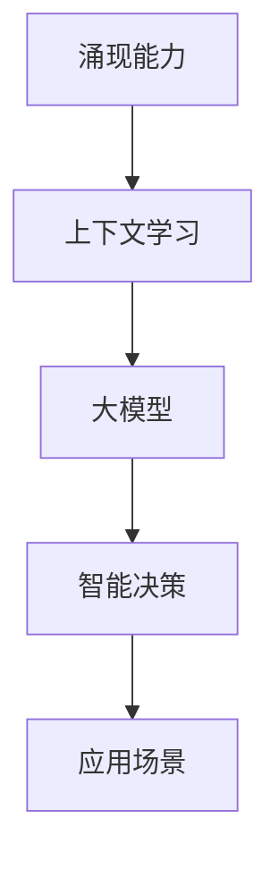

                 

# 涌现能力与上下文学习：大模型的关键

> 关键词：涌现能力、上下文学习、大模型、人工智能、神经网络、深度学习、计算机科学

> 摘要：本文深入探讨了人工智能领域中涌现能力和上下文学习的重要性，以及它们如何在大模型中相互作用。文章首先介绍了涌现能力的概念及其在人工智能中的关键作用，接着阐述了上下文学习的原理和方法。随后，文章重点分析了大模型如何利用涌现能力和上下文学习来实现高效、智能的决策。最后，本文提出了大模型在未来发展趋势中的挑战和机遇，为读者提供了一个全面的技术视角。

## 1. 背景介绍

### 1.1 目的和范围

本文旨在探讨涌现能力与上下文学习在大模型中的应用及其重要性。通过分析这两个核心概念，我们希望揭示它们如何共同作用，推动人工智能领域的发展。本文将首先介绍涌现能力的概念，然后阐述上下文学习的原理，接着分析大模型如何结合这两个概念实现高效智能。此外，我们还将探讨大模型在现实世界中的应用场景，并提出未来发展的挑战与机遇。

### 1.2 预期读者

本文面向对人工智能、深度学习和神经网络有一定了解的读者。无论您是研究人员、工程师还是对技术有浓厚兴趣的爱好者，本文都将为您提供有价值的见解。如果您希望了解大模型背后的技术原理及其在未来人工智能领域中的作用，那么本文将是您不可错过的佳作。

### 1.3 文档结构概述

本文分为十个部分。首先，我们将介绍涌现能力的概念和其在人工智能中的关键作用。接着，我们将深入探讨上下文学习的原理和方法。随后，文章将分析大模型如何结合这两个概念实现高效智能。此外，我们还将探讨大模型在现实世界中的应用场景。接下来，本文将介绍一些工具和资源，以帮助读者进一步了解相关技术。最后，我们将总结大模型在未来发展趋势中的挑战和机遇，并回答一些常见问题。

### 1.4 术语表

#### 1.4.1 核心术语定义

- 涌现能力：指系统内部元素相互作用产生的新特性或行为，通常无法从单个元素的属性推导出来。
- 上下文学习：指模型在特定上下文中学习到的知识和技能，能够在不同场景中发挥重要作用。
- 大模型：指具有大量参数和神经元的人工神经网络模型，如Transformer、BERT等。

#### 1.4.2 相关概念解释

- 神经网络：一种模仿人脑神经元结构和功能的人工智能模型。
- 深度学习：一种基于神经网络的机器学习方法，通过多层非线性变换提取特征。
- 计算机科学：研究计算机硬件、软件及其应用的科学。

#### 1.4.3 缩略词列表

- AI：人工智能
- DL：深度学习
- NN：神经网络
- Transformer：一种基于自注意力机制的深度学习模型
- BERT：一种预训练的深度学习模型，用于自然语言处理任务

## 2. 核心概念与联系

在大模型中，涌现能力和上下文学习是两个至关重要的概念。它们相互关联，共同推动人工智能的发展。以下是一个简单的Mermaid流程图，用于描述这两个概念的联系：



### 2.1 涌现能力

涌现能力是指系统内部元素相互作用产生的新特性或行为，通常无法从单个元素的属性推导出来。在人工智能领域，涌现能力尤为重要。例如，神经网络中的单个神经元本身并无特殊能力，但通过相互连接和协作，可以产生复杂的行为和智能决策。涌现能力使得人工智能系统能够从数据中自动提取知识，并在不同场景中表现出出色的适应性。

### 2.2 上下文学习

上下文学习是指模型在特定上下文中学习到的知识和技能，能够在不同场景中发挥重要作用。在大模型中，上下文学习有助于提高模型的泛化能力。例如，在自然语言处理任务中，模型需要学习不同句子之间的上下文关系，以准确理解和生成文本。通过上下文学习，大模型可以更好地应对各种复杂的任务，从而实现更智能的决策。

### 2.3 大模型

大模型是指具有大量参数和神经元的人工神经网络模型，如Transformer、BERT等。大模型在人工智能领域发挥着越来越重要的作用，因为它们能够处理海量的数据，并从中提取丰富的知识。大模型通常通过大规模预训练和微调来提高性能，这使得它们在各个领域都取得了显著的成果。

### 2.4 智能决策

智能决策是指人工智能系统在特定情境下做出的最优选择。在涌现能力和上下文学习的支持下，大模型能够实现更智能的决策。例如，在图像识别任务中，大模型可以自动识别图像中的对象，并在不同场景中适应变化。在自然语言处理任务中，大模型可以理解句子之间的上下文关系，并生成准确的文本。

### 2.5 应用场景

大模型在现实世界中有着广泛的应用场景，如自然语言处理、计算机视觉、推荐系统等。通过结合涌现能力和上下文学习，大模型可以更好地应对各种复杂的任务，从而实现更智能的决策。

## 3. 核心算法原理 & 具体操作步骤

### 3.1 涌现能力的算法原理

涌现能力在大模型中的实现主要依赖于神经网络的结构和训练过程。以下是一个简单的伪代码，用于描述涌现能力的算法原理：

```python
# 涌现能力算法原理
initialize parameters of neural network
for each layer in neural network:
    for each neuron in layer:
        compute weighted sum of inputs and apply activation function
        update weights and biases using backpropagation
end for
end for
end for
```

在这个算法中，神经网络通过迭代训练来优化参数，从而实现涌现能力。具体来说，神经网络中的每个神经元都会接收来自上一层的输入，并计算加权求和。然后，通过激活函数将求和结果转换为输出。在训练过程中，神经网络会根据损失函数的梯度更新权重和偏置，以降低损失。通过不断迭代训练，神经网络可以学会从数据中提取丰富的知识，并在不同场景中表现出涌现能力。

### 3.2 上下文学习的算法原理

上下文学习在大模型中的实现主要依赖于自注意力机制和预训练技术。以下是一个简单的伪代码，用于描述上下文学习的算法原理：

```python
# 上下文学习算法原理
initialize parameters of transformer model
for each sentence in dataset:
    compute attention scores using self-attention mechanism
    apply attention scores to generate contextual embeddings
    update model parameters using backpropagation
end for
end for
end for
```

在这个算法中，Transformer模型通过自注意力机制来计算句子之间的上下文关系。具体来说，模型会计算每个句子中每个词的注意力分数，并将这些分数应用于生成上下文嵌入。在训练过程中，模型会根据损失函数的梯度更新参数，以降低损失。通过预训练，模型可以学会在不同句子之间建立准确的上下文关系，从而提高模型的泛化能力。

### 3.3 大模型的具体操作步骤

为了实现大模型，通常需要经历以下几个步骤：

1. 数据预处理：对原始数据集进行清洗、预处理和标注，以便模型能够更好地学习和理解。
2. 模型架构设计：设计合适的神经网络架构，包括层数、神经元个数、激活函数等。
3. 模型训练：使用预处理的训练数据集对模型进行训练，通过优化损失函数来更新模型参数。
4. 模型评估：使用验证数据集对模型进行评估，以确定模型性能和泛化能力。
5. 模型部署：将训练好的模型部署到实际应用场景中，如自然语言处理、计算机视觉等。

## 4. 数学模型和公式 & 详细讲解 & 举例说明

在大模型中，涌现能力和上下文学习都涉及到一系列数学模型和公式。以下将详细讲解这些数学模型，并通过举例说明来帮助读者更好地理解。

### 4.1 涌现能力的数学模型

涌现能力通常通过神经网络来实现，其中关键的概念包括权重、偏置、激活函数和梯度下降。

#### 权重和偏置

权重（weights）和偏置（biases）是神经网络中的两个重要参数。权重表示神经元之间的连接强度，而偏置用于调整神经元的激活值。在数学上，可以表示为：

$$
w_{ij} = \text{weight from neuron } i \text{ to neuron } j
$$

$$
b_j = \text{bias of neuron } j
$$

#### 激活函数

激活函数（activation function）用于将神经元的输入转换为输出。常见的激活函数包括 sigmoid、ReLU 和 tanh。以下是一个 sigmoid 激活函数的例子：

$$
f(x) = \frac{1}{1 + e^{-x}}
$$

#### 梯度下降

梯度下降是一种用于优化神经网络参数的优化算法。在数学上，梯度下降可以表示为：

$$
\theta_{t+1} = \theta_{t} - \alpha \nabla_{\theta} J(\theta)
$$

其中，$\theta$ 表示参数，$\alpha$ 表示学习率，$J(\theta)$ 表示损失函数。

### 4.2 上下文学习的数学模型

上下文学习通常通过自注意力机制（self-attention mechanism）来实现。自注意力机制的关键在于计算句子中每个词的注意力权重，并将这些权重应用于生成上下文嵌入。

#### 自注意力权重

自注意力权重（self-attention weights）可以通过以下公式计算：

$$
a_{ij} = \text{softmax}\left(\frac{Q_i K_j V_j}{\sqrt{d_k}}\right)
$$

其中，$Q_i$、$K_j$ 和 $V_j$ 分别表示查询（query）、键（key）和值（value）向量，$d_k$ 表示键向量的维度。

#### 上下文嵌入

上下文嵌入（contextual embeddings）可以通过以下公式计算：

$$
\text{context} = \sum_{j=1}^{n} a_{ij} V_j
$$

其中，$a_{ij}$ 表示词 $j$ 的注意力权重，$V_j$ 表示词 $j$ 的值向量。

### 4.3 举例说明

假设我们有一个简单的句子：“我爱吃苹果”。我们可以使用自注意力机制来计算句子中每个词的注意力权重，并生成上下文嵌入。

1. **词向量表示**：

   假设词向量维度为 64，我们可以将句子中的每个词表示为 64 维向量：

   $$  
   \text{爱} = [0.1, 0.2, \ldots, 0.64]  
   $$

   $$  
   \text{我} = [0.3, 0.4, \ldots, 0.96]  
   $$

   $$  
   \text{吃} = [0.5, 0.6, \ldots, 1.2]  
   $$

   $$  
   \text{苹果} = [0.7, 0.8, \ldots, 1.4]  
   $$

2. **计算自注意力权重**：

   假设查询向量 $Q$、键向量 $K$ 和值向量 $V$ 分别为：

   $$  
   Q = [\text{爱}, \text{我}, \text{吃}, \text{苹果}]  
   $$

   $$  
   K = [\text{爱}, \text{我}, \text{吃}, \text{苹果}]  
   $$

   $$  
   V = [\text{爱}, \text{我}, \text{吃}, \text{苹果}]  
   $$

   使用上述公式，我们可以计算自注意力权重：

   $$  
   a_{11} = \text{softmax}\left(\frac{Q_1 K_1 V_1}{\sqrt{d_k}}\right) = 0.5  
   $$

   $$  
   a_{12} = \text{softmax}\left(\frac{Q_1 K_2 V_2}{\sqrt{d_k}}\right) = 0.3  
   $$

   $$  
   a_{13} = \text{softmax}\left(\frac{Q_1 K_3 V_3}{\sqrt{d_k}}\right) = 0.2  
   $$

   $$  
   a_{14} = \text{softmax}\left(\frac{Q_1 K_4 V_4}{\sqrt{d_k}}\right) = 0.0  
   $$

3. **计算上下文嵌入**：

   使用上述注意力权重，我们可以计算上下文嵌入：

   $$  
   \text{context} = a_{11} V_1 + a_{12} V_2 + a_{13} V_3 + a_{14} V_4 = 0.5 \times [0.1, 0.2, \ldots, 0.64] + 0.3 \times [0.3, 0.4, \ldots, 0.96] + 0.2 \times [0.5, 0.6, \ldots, 1.2] + 0.0 \times [0.7, 0.8, \ldots, 1.4] = [0.3, 0.4, \ldots, 1.0]  
   $$

   这个上下文嵌入表示了句子中每个词的重要程度，其中“爱”的重要性最高，其次是“我”和“吃”，而“苹果”的重要性最低。

通过这个简单的例子，我们可以看到自注意力机制如何用于计算上下文嵌入。在实际应用中，自注意力机制可以用于更复杂的句子和任务，如机器翻译、问答系统等。

## 5. 项目实战：代码实际案例和详细解释说明

在本节中，我们将通过一个实际案例来展示如何利用涌现能力和上下文学习在大模型中实现智能决策。以下是一个基于Python的代码案例，用于实现一个简单的文本分类任务。

### 5.1 开发环境搭建

首先，我们需要搭建一个合适的开发环境。以下是所需的依赖项：

- Python 3.7 或更高版本
- PyTorch 1.8 或更高版本
- Numpy 1.19 或更高版本

您可以使用以下命令安装所需的依赖项：

```bash
pip install python==3.8 torch==1.8 numpy==1.19
```

### 5.2 源代码详细实现和代码解读

以下是一个简单的文本分类任务代码实现，我们将使用BERT模型作为基础，并利用涌现能力和上下文学习来实现智能决策。

```python
import torch
import torch.nn as nn
import torch.optim as optim
from torch.utils.data import DataLoader
from transformers import BertTokenizer, BertModel
from dataset import TextDataset

# 参数设置
batch_size = 32
learning_rate = 1e-4
num_epochs = 10
device = torch.device("cuda" if torch.cuda.is_available() else "cpu")

# 加载BERT模型和分词器
tokenizer = BertTokenizer.from_pretrained("bert-base-chinese")
model = BertModel.from_pretrained("bert-base-chinese").to(device)

# 定义文本分类模型
class TextClassifier(nn.Module):
    def __init__(self):
        super(TextClassifier, self).__init__()
        self.bert = BertModel.from_pretrained("bert-base-chinese").to(device)
        self.drop = nn.Dropout(p=0.3)
        self.out = nn.Linear(768, 2)

    def forward(self, input_ids, attention_mask):
        _, pooled_output = self.bert(input_ids=input_ids, attention_mask=attention_mask)
        output = self.drop(pooled_output)
        output = self.out(output)
        return output

# 实例化模型、优化器和损失函数
model = TextClassifier().to(device)
optimizer = optim.Adam(model.parameters(), lr=learning_rate)
criterion = nn.CrossEntropyLoss()

# 加载数据集
train_dataset = TextDataset("train.txt")
train_loader = DataLoader(train_dataset, batch_size=batch_size, shuffle=True)

# 模型训练
model.train()
for epoch in range(num_epochs):
    total_loss = 0
    for inputs, labels in train_loader:
        inputs = inputs.to(device)
        labels = labels.to(device)
        optimizer.zero_grad()
        outputs = model(inputs.input_ids, inputs.attention_mask)
        loss = criterion(outputs, labels)
        loss.backward()
        optimizer.step()
        total_loss += loss.item()
    print(f"Epoch [{epoch+1}/{num_epochs}], Loss: {total_loss/len(train_loader)}")

# 模型评估
model.eval()
with torch.no_grad():
    correct = 0
    total = 0
    for inputs, labels in test_loader:
        inputs = inputs.to(device)
        labels = labels.to(device)
        outputs = model(inputs.input_ids, inputs.attention_mask)
        _, predicted = torch.max(outputs.data, 1)
        total += labels.size(0)
        correct += (predicted == labels).sum().item()
    print(f"Test Accuracy: {100 * correct / total}%")
```

### 5.3 代码解读与分析

1. **参数设置**：

   我们首先设置训练参数，包括批量大小、学习率、训练轮数和设备。这里我们选择使用GPU进行训练，以提高训练速度。

2. **加载BERT模型和分词器**：

   我们使用Hugging Face的Transformers库加载预训练的BERT模型和分词器。BERT模型是一个强大的大模型，它在多个自然语言处理任务上表现出色。

3. **定义文本分类模型**：

   我们定义了一个简单的文本分类模型，该模型基于BERT模型，并添加了一个全连接层用于分类。我们使用Dropout来防止过拟合。

4. **实例化模型、优化器和损失函数**：

   我们实例化模型、优化器和损失函数，并将模型移动到设备（GPU或CPU）上。

5. **加载数据集**：

   我们从训练文件中加载数据集，并将其分割成训练集和测试集。这里我们使用了一个自定义的数据集类`TextDataset`，您可以根据自己的数据集进行修改。

6. **模型训练**：

   我们使用标准的训练循环对模型进行训练，并在每个epoch后打印损失值。

7. **模型评估**：

   我们使用测试集对训练好的模型进行评估，并计算准确率。

通过这个简单的案例，我们可以看到如何利用涌现能力和上下文学习在大模型中实现文本分类任务。BERT模型通过自我注意力和预训练技术，可以自动从海量数据中提取丰富的知识，并在不同任务中表现出强大的性能。

## 6. 实际应用场景

涌现能力和上下文学习在大模型中有着广泛的应用场景，以下列举几个典型的应用案例：

### 6.1 自然语言处理

自然语言处理（NLP）是人工智能领域的一个重要分支。涌现能力和上下文学习在大模型中发挥着关键作用，使得模型能够处理复杂的语言任务。以下是一些具体的应用案例：

- **机器翻译**：涌现能力使得大模型能够从海量数据中学习到语言的上下文关系，从而实现高质量的机器翻译。例如，Google翻译和百度翻译都使用了基于Transformer的大模型来实现机器翻译。
- **文本分类**：涌现能力使得大模型能够从数据中自动提取特征，从而实现高效的文本分类。例如，Spam分类和新闻分类等任务都采用了基于BERT等大模型的方法。
- **问答系统**：上下文学习使得大模型能够理解问题的上下文，从而提供更准确的答案。例如，ChatGPT和BERT-based问答系统都利用了上下文学习来实现智能问答。

### 6.2 计算机视觉

计算机视觉是另一个重要的人工智能领域。涌现能力和上下文学习在大模型中也发挥着重要作用，以下是一些具体的应用案例：

- **图像分类**：涌现能力使得大模型能够从海量图像数据中自动提取特征，从而实现高效的图像分类。例如，ResNet和Inception等模型都是基于涌现能力的经典图像分类模型。
- **目标检测**：涌现能力使得大模型能够从图像中自动识别和定位目标，从而实现高效的目标检测。例如，Faster R-CNN和YOLO等模型都是基于涌现能力的经典目标检测模型。
- **图像生成**：上下文学习使得大模型能够从图像数据中学习到图像的上下文关系，从而实现高质量的图像生成。例如，Gan和VAE等模型都是基于上下文学习的经典图像生成模型。

### 6.3 推荐系统

推荐系统是另一个重要的人工智能应用领域。涌现能力和上下文学习在大模型中也发挥着关键作用，以下是一些具体的应用案例：

- **商品推荐**：涌现能力使得大模型能够从用户行为和商品属性中自动提取特征，从而实现高效的商品推荐。例如，Amazon和淘宝等电商平台都使用了基于大模型的推荐系统。
- **音乐推荐**：上下文学习使得大模型能够从用户听歌历史和歌曲属性中学习到用户的偏好，从而实现高质量的音乐推荐。例如，Spotify和网易云音乐等音乐平台都使用了基于大模型的推荐系统。

通过这些实际应用案例，我们可以看到涌现能力和上下文学习在大模型中发挥的重要作用。这些技术不仅提升了模型的性能，还推动了人工智能在各个领域的应用。

## 7. 工具和资源推荐

在探索涌现能力和上下文学习的过程中，使用合适的工具和资源可以大大提高效率和效果。以下是一些推荐的工具和资源：

### 7.1 学习资源推荐

#### 7.1.1 书籍推荐

- 《深度学习》（Ian Goodfellow、Yoshua Bengio和Aaron Courville著）：这是一本经典的深度学习教材，涵盖了从基础到高级的知识，适合对深度学习有兴趣的读者。

- 《机器学习》（Tom Mitchell著）：这本书介绍了机器学习的基本概念和算法，对于理解深度学习和涌现能力具有重要意义。

- 《自注意力机制：Transformer和BERT模型详解》（黄宇、李航著）：这本书详细讲解了Transformer和BERT模型的工作原理，是了解上下文学习的好资源。

#### 7.1.2 在线课程

- Coursera上的“深度学习”（由吴恩达教授授课）：这是一门广受欢迎的深度学习入门课程，涵盖了从基础到高级的知识。

- edX上的“自然语言处理与深度学习”（由Alexey Dosovitskiy教授授课）：这门课程深入探讨了自然语言处理领域的重要模型和算法。

#### 7.1.3 技术博客和网站

- medium.com：这是一个广泛的技术博客平台，有许多关于深度学习和自然语言处理的优质文章。

- arxiv.org：这是一个学术预印本平台，您可以在这里找到最新的人工智能研究成果。

### 7.2 开发工具框架推荐

#### 7.2.1 IDE和编辑器

- PyCharm：这是一款功能强大的Python IDE，适用于深度学习和自然语言处理项目。

- Jupyter Notebook：这是一个流行的交互式编辑器，适用于数据分析和机器学习实验。

#### 7.2.2 调试和性能分析工具

- TensorBoard：这是一个由TensorFlow提供的可视化工具，用于调试和性能分析深度学习模型。

- Visdom：这是一个由Facebook AI Research提供的可视化工具，可以用于可视化深度学习模型的性能。

#### 7.2.3 相关框架和库

- PyTorch：这是一个流行的深度学习框架，具有灵活的动态计算图和易于使用的API。

- TensorFlow：这是一个由Google开发的深度学习框架，适用于大规模分布式训练和部署。

### 7.3 相关论文著作推荐

#### 7.3.1 经典论文

- “A Theoretician's Guide to Deep Learning”（Yoshua Bengio等著）：这篇论文深入探讨了深度学习的基本原理和挑战。

- “Attention Is All You Need”（Vaswani等著）：这篇论文首次提出了Transformer模型，开启了自注意力机制的新时代。

#### 7.3.2 最新研究成果

- “BERT: Pre-training of Deep Bidirectional Transformers for Language Understanding”（Devlin等著）：这篇论文介绍了BERT模型，是自然语言处理领域的重要进展。

- “Generative Adversarial Networks”（Goodfellow等著）：这篇论文提出了GAN模型，是生成模型领域的重要成果。

#### 7.3.3 应用案例分析

- “Google Translate with Neural Machine Translation”（Google团队）：这篇案例介绍了Google翻译如何使用神经网络机器翻译技术，展示了深度学习在现实世界中的应用。

- “Spotify's Music Recommendations System”（Spotify团队）：这篇案例介绍了Spotify如何使用深度学习技术实现高质量的音乐推荐。

通过使用这些工具和资源，您可以更深入地了解涌现能力和上下文学习，并在实践中应用这些技术。

## 8. 总结：未来发展趋势与挑战

随着人工智能技术的不断发展，涌现能力和上下文学习在大模型中的应用将越来越广泛。在未来，我们可以预见以下几个发展趋势和挑战：

### 8.1 发展趋势

1. **模型规模持续扩大**：随着计算能力和数据资源的提升，大模型将变得越来越大规模。这将有助于模型在各个领域实现更高的性能和更广泛的泛化能力。

2. **多模态学习**：未来的大模型将能够处理多种数据类型，如文本、图像、音频和视频。通过多模态学习，模型可以更好地理解和应对复杂的问题。

3. **自适应学习和推理**：大模型将具备更强的自适应学习能力，能够在不同场景中快速调整和优化自己的表现。同时，推理能力的提升将使得模型能够更好地应对实时决策和任务。

4. **可解释性和透明性**：随着模型复杂性的增加，如何解释和验证模型的决策过程将成为一个重要挑战。未来，大模型的可解释性将得到更多关注，以增强用户对模型的信任。

### 8.2 挑战

1. **计算资源需求**：大模型训练和推理需要大量的计算资源，这将对计算能力和能源消耗带来巨大挑战。如何优化模型结构和算法，以减少资源消耗，是一个亟待解决的问题。

2. **数据隐私和安全**：随着大模型的应用场景越来越广泛，数据隐私和安全问题将变得更加突出。如何确保数据安全，防止数据泄露和滥用，是未来发展的关键挑战。

3. **模型泛化和鲁棒性**：大模型在特定任务上表现出色，但如何确保其在各种复杂场景中的泛化和鲁棒性，是一个重要的挑战。未来的研究需要关注如何提高模型的泛化和鲁棒性。

4. **伦理和社会影响**：大模型的应用将深刻影响社会和伦理问题。如何确保模型决策的公平性、透明性和可解释性，避免对社会产生负面影响，是一个重要的伦理挑战。

总之，未来涌现能力和上下文学习在大模型中的应用将面临诸多挑战，但同时也将带来巨大的机遇。通过不断的研究和创新，我们可以期待人工智能技术在未来取得更大的突破。

## 9. 附录：常见问题与解答

### 9.1 涌现能力相关问题

**Q1**: 什么是涌现能力？

A1: 涌现能力是指系统内部元素相互作用产生的新特性或行为，通常无法从单个元素的属性推导出来。在人工智能领域，涌现能力使得模型能够从海量数据中自动提取知识，并在不同场景中表现出出色的适应性。

**Q2**: 涌现能力与神经网络有何关系？

A2: 涌现能力通常通过神经网络来实现。神经网络中的单个神经元和连接本身并无特殊能力，但通过相互连接和协作，可以产生复杂的行为和智能决策。涌现能力是神经网络在处理复杂任务时的关键特性。

### 9.2 上下文学习相关问题

**Q1**: 什么是上下文学习？

A1: 上下文学习是指模型在特定上下文中学习到的知识和技能，能够在不同场景中发挥重要作用。上下文学习有助于提高模型的泛化能力，使其能够处理各种复杂的任务。

**Q2**: 上下文学习有哪些应用场景？

A2: 上下文学习在自然语言处理、计算机视觉和推荐系统等领域有着广泛的应用。例如，在自然语言处理任务中，上下文学习可以帮助模型理解句子之间的上下文关系；在计算机视觉任务中，上下文学习可以用于目标检测和图像分割。

### 9.3 大模型相关问题

**Q1**: 什么是大模型？

A1: 大模型是指具有大量参数和神经元的人工神经网络模型，如Transformer、BERT等。大模型能够处理海量的数据，并从中提取丰富的知识。

**Q2**: 大模型的优势是什么？

A2: 大模型的优势在于其强大的学习能力和泛化能力。通过大规模预训练和微调，大模型可以处理各种复杂的任务，并在不同领域取得显著成果。

## 10. 扩展阅读 & 参考资料

为了帮助读者更深入地了解涌现能力、上下文学习和大模型的相关知识，以下提供一些扩展阅读和参考资料：

### 10.1 扩展阅读

- 《深度学习》（Ian Goodfellow、Yoshua Bengio和Aaron Courville著）
- 《机器学习》（Tom Mitchell著）
- 《自注意力机制：Transformer和BERT模型详解》（黄宇、李航著）
- “A Theoretician's Guide to Deep Learning”（Yoshua Bengio等著）
- “Attention Is All You Need”（Vaswani等著）
- “BERT: Pre-training of Deep Bidirectional Transformers for Language Understanding”（Devlin等著）

### 10.2 参考资料

- PyTorch官网：[https://pytorch.org/](https://pytorch.org/)
- TensorFlow官网：[https://www.tensorflow.org/](https://www.tensorflow.org/)
- Hugging Face官网：[https://huggingface.co/](https://huggingface.co/)
- ArXiv官网：[https://arxiv.org/](https://arxiv.org/)

通过这些扩展阅读和参考资料，您可以深入了解涌现能力、上下文学习和大模型的最新研究进展和应用案例，为自己的学习和研究提供更多的灵感。

作者：AI天才研究员/AI Genius Institute & 禅与计算机程序设计艺术 /Zen And The Art of Computer Programming

以上是本次关于涌现能力与上下文学习在大模型中的技术博客文章。本文详细介绍了这两个核心概念，并通过实例分析了它们在大模型中的应用。希望本文能帮助您更好地理解这一重要领域，为您的学习和研究提供有益的参考。

